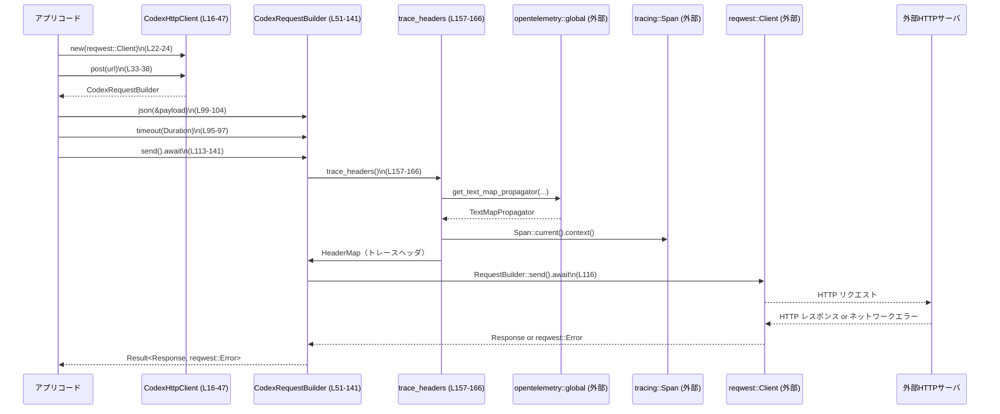

# codex-client/src/default_client.rs コード解説

## 0. ざっくり一言

`reqwest::Client` をラップしたデフォルト HTTP クライアントと、そのリクエストビルダーです。  
各リクエスト送信時に OpenTelemetry のトレースコンテキストを HTTP ヘッダに注入し、`tracing` でリクエスト結果をログ出力します（`CodexHttpClient`, `CodexRequestBuilder`, `trace_headers` が中心）。  
（根拠: `CodexHttpClient`, `CodexRequestBuilder`, `trace_headers` の実装 `codex-client/src/default_client.rs:L16-47`, `L51-141`, `L157-166`）

---

## 1. このモジュールの役割

### 1.1 概要

このモジュールは **HTTP リクエストの組み立て・送信とトレースヘッダ注入** を行うためのユーティリティを提供します。

- `CodexHttpClient`: 基本的な HTTP クライアント API（`get`, `post`, 汎用 `request`）を提供し、内部に `reqwest::Client` を保持します  
  （`codex-client/src/default_client.rs:L16-47`）
- `CodexRequestBuilder`: ヘッダ・ボディ・タイムアウトなどを設定し、`send` で実際のリクエストを非同期送信します  
  （`codex-client/src/default_client.rs:L49-141`）
- `trace_headers` + `HeaderMapInjector`: 現在の `tracing::Span` の OpenTelemetry コンテキストを HTTP ヘッダに注入します  
  （`codex-client/src/default_client.rs:L144-166`）

### 1.2 アーキテクチャ内での位置づけ

`CodexHttpClient` はアプリケーションコードから使われるフロント API で、内部で `reqwest` を用いた HTTP 通信と OpenTelemetry/Tracing 連携を行います。

```mermaid
flowchart LR
    subgraph HTTPクライアント
      C[CodexHttpClient (L16-47)]
      B[CodexRequestBuilder (L51-141)]
    end

    subgraph Telemetry
      T[trace_headers (L157-166)]
      I[HeaderMapInjector (L144-155)]
      OT[opentelemetry::global (外部)]
      Sp[tracing::Span (外部)]
    end

    R[reqwest::Client / RequestBuilder (外部)]

    C -->|request/get/post| B
    B -->|send()| R
    B -->|send() 前に呼び出し| T
    T --> I
    T --> OT
    T --> Sp
```

- アプリケーションは `CodexHttpClient` を通じて `CodexRequestBuilder` を取得し、送信前に必要な設定を行います。（`L21-45`, `L57-111`）
- `send` 実行時に `trace_headers` が呼ばれ、現在の `tracing::Span` コンテキストが HTTP ヘッダに注入されます。（`L113-116`, `L157-166`）
- 実際の HTTP 通信は `reqwest::RequestBuilder::send` に委譲されます。（`L116`）

### 1.3 設計上のポイント

- **reqwest の薄いラッパー**  
  - `CodexHttpClient` は `reqwest::Client` を内包し（`L17-18`）、各 HTTP メソッドで `self.inner.request(method, url)` を呼び出すだけの構造です。（`L40-45`）
- **ビルダー・パターンと所有権**  
  - `CodexRequestBuilder` は内部に `reqwest::RequestBuilder` と HTTP メソッド・URL 文字列を保持し（`L52-54`）、  
    設定メソッド（`headers`, `header`, `bearer_auth`, `timeout`, `json`, `body`）はすべて `self` を消費して新しいビルダーを返します。（`L66-72`, `L74-111`）  
    これにより、ビルダーの誤再利用が構文上防がれています。
  - `#[must_use]` 属性により、ビルダーを無視するとコンパイラ警告になります。（`L49-55`）
- **OpenTelemetry コンテキストの自動注入**  
  - `trace_headers` は `opentelemetry::global::get_text_map_propagator` から取得したプロパゲータを用い、`Span::current().context()` を HTTP ヘッダに注入します。（`L157-163`）
  - `HeaderMapInjector` は `Injector` トレイトの実装として、ヘッダ名・値の変換に失敗した場合はそのエントリを静かに破棄します。（`L144-155`）
- **エラー処理方針**  
  - `send` は `Result<Response, reqwest::Error>` をそのまま返し、成功/失敗の両方で `tracing::debug!` ログを出力するだけで変換やラップは行いません。（`L113-141`）
- **非同期・並行性**  
  - `send` は `async fn` であり、非同期ランタイム上で `.await` する前提です。（`L113`）
  - `CodexHttpClient` 自体は `Clone` を実装しており（`L16`）、`reqwest::Client` のクローンとともに複数タスクから使うことを意図した構造です。

---

## 2. 主要な機能一覧

このファイルが提供する主な機能と役割です（行番号は `codex-client/src/default_client.rs`）。

- `CodexHttpClient` の生成と保持: 既存の `reqwest::Client` をラップして Codex 用 HTTP クライアントを作成する（`L16-24`）
- HTTP メソッド別 API: `get`, `post`, 汎用 `request` で `CodexRequestBuilder` を生成する（`L26-45`）
- `CodexRequestBuilder` によるリクエスト構築:
  - 任意ヘッダの設定 (`headers`, `header`)（`L74-86`）
  - Bearer 認証の設定 (`bearer_auth`)（`L88-93`）
  - タイムアウトの設定 (`timeout`)（`L95-97`）
  - JSON ボディの設定 (`json`)（`L99-104`）
  - 任意ボディの設定 (`body`)（`L106-111`）
- リクエスト送信とログ出力: `send` でトレースヘッダ注入後にリクエスト送信し、成功/失敗を `tracing::debug` に記録する（`L113-141`）
- OpenTelemetry トレースヘッダ注入: `trace_headers` と `HeaderMapInjector` により、現在の `tracing::Span` コンテキストを HTTP ヘッダへ変換する（`L144-166`）
- テスト: `inject_trace_headers_uses_current_span_context` でトレースコンテキストが正しくヘッダに埋め込まれることを検証する（`L181-205`）

---

## 3. 公開 API と詳細解説

### 3.1 型一覧（構造体・列挙体など）

**主要な型と役割**

| 名前 | 種別 | 公開 | 役割 / 用途 | 定義位置 |
|------|------|------|-------------|----------|
| `CodexHttpClient` | 構造体 | `pub` | 内部に `reqwest::Client` を保持し、Codex 用の HTTP クライアント API (`get`, `post`, `request`) を提供する | `codex-client/src/default_client.rs:L16-19` |
| `CodexRequestBuilder` | 構造体 | `pub` | `reqwest::RequestBuilder` をラップし、ヘッダ・ボディ・タイムアウトなどを設定して `send` で送信するビルダー | `codex-client/src/default_client.rs:L49-55` |
| `HeaderMapInjector<'a>` | 構造体 | 非公開 | `&mut HeaderMap` を包み、OpenTelemetry の `Injector` トレイトを実装するためのアダプタ | `codex-client/src/default_client.rs:L144-145` |
| `HeaderMapExtractor<'a>` | 構造体 | 非公開（テスト専用） | テストで `HeaderMap` からトレースヘッダを抽出するための `Extractor` 実装 | `codex-client/src/default_client.rs:L207-207` |

### 3.1.1 コンポーネントインベントリー（関数一覧）

このファイル内の関数・メソッドの一覧です（テストを含む）。

| 名前 | 種別 | 公開 | 概要 | 定義位置 |
|------|------|------|------|----------|
| `CodexHttpClient::new` | メソッド | `pub` | 既存の `reqwest::Client` から `CodexHttpClient` を生成 | `L22-24` |
| `CodexHttpClient::get` | メソッド | `pub` | HTTP GET 用ビルダー (`CodexRequestBuilder`) を生成 | `L26-31` |
| `CodexHttpClient::post` | メソッド | `pub` | HTTP POST 用ビルダーを生成 | `L33-38` |
| `CodexHttpClient::request` | メソッド | `pub` | 任意メソッド・URL からビルダーを生成し、ログ用 URL 文字列も保存 | `L40-45` |
| `CodexRequestBuilder::new` | 関連関数 | 非公開 | 内部フィールドを初期化してビルダーを生成 | `L58-64` |
| `CodexRequestBuilder::map` | メソッド | 非公開 | 内部 `reqwest::RequestBuilder` に変換関数を適用しつつ、メソッド・URL を保持 | `L66-72` |
| `CodexRequestBuilder::headers` | メソッド | `pub` | 複数ヘッダをまとめて設定 | `L74-76` |
| `CodexRequestBuilder::header` | メソッド | `pub` | 単一ヘッダを設定（ジェネリックキー/値） | `L78-86` |
| `CodexRequestBuilder::bearer_auth` | メソッド | `pub` | Bearer 認証ヘッダを設定 | `L88-93` |
| `CodexRequestBuilder::timeout` | メソッド | `pub` | リクエスト単位のタイムアウトを設定 | `L95-97` |
| `CodexRequestBuilder::json` | メソッド | `pub` | シリアライズ可能な値を JSON ボディとして設定 | `L99-104` |
| `CodexRequestBuilder::body` | メソッド | `pub` | 任意のボディを設定 | `L106-111` |
| `CodexRequestBuilder::send` | メソッド | `pub async` | トレースヘッダを付与しリクエストを送信、成功/失敗をログ出力 | `L113-141` |
| `HeaderMapInjector::set` | メソッド | 非公開 | `Injector` トレイト実装: key/value を HTTP ヘッダに変換して挿入 | `L147-154` |
| `trace_headers` | 関数 | 非公開 | 現在の `Span` の OpenTelemetry コンテキストを `HeaderMap` に注入 | `L157-166` |
| `tests::inject_trace_headers_uses_current_span_context` | テスト関数 | 非公開 | `trace_headers` が現在の `Span` のトレース ID / スパン ID を反映することを検証 | `L181-205` |
| `HeaderMapExtractor::get` | メソッド | 非公開（テスト） | `HeaderMap` からキーに対応する値を文字列として取得 | `L210-212` |
| `HeaderMapExtractor::keys` | メソッド | 非公開（テスト） | `HeaderMap` に存在するすべてのキー名を収集 | `L214-215` |

---

### 3.2 関数詳細（主要 7 件）

#### `CodexHttpClient::new(inner: reqwest::Client) -> CodexHttpClient`

**定義位置**: `codex-client/src/default_client.rs:L22-24`

**概要**

既存の `reqwest::Client` を受け取り、それを内包した `CodexHttpClient` を生成します。

**引数**

| 引数名 | 型 | 説明 |
|--------|----|------|
| `inner` | `reqwest::Client` | 実際の HTTP 通信を行うクライアント |

**戻り値**

- `CodexHttpClient`: 内部に `inner` を保持する新しいクライアント。（`L17-18`, `L22-24`）

**内部処理の流れ**

1. 構造体フィールド `inner` に引数 `inner` をそのまま格納します。（`L23`）

**Examples（使用例）**

```rust
use reqwest::Client;
use codex_client::default_client::CodexHttpClient; // モジュールパスは仮。実際はクレート構成に依存します。

// 既存の reqwest クライアントから CodexHttpClient を作成する
let reqwest_client = Client::new();                     // HTTP 接続プールなどを内部に持つクライアント
let codex_client = CodexHttpClient::new(reqwest_client); // CodexHttpClient にラップ
```

**Errors / Panics**

- エラーや panic は発生しません（フィールド代入のみ）。  

**Edge cases（エッジケース）**

- `reqwest::Client` がどのような設定で生成されているかは、この関数ではチェックしません。タイムアウトやプロキシ設定などは `inner` に依存します。

**使用上の注意点**

- `inner` の生存期間管理は呼び出し側で行われます。`CodexHttpClient` は `inner` を所有するため、`inner` を他で同時に所有しているといった問題は発生しません（所有権が移動します）。

---

#### `CodexHttpClient::get<U>(&self, url: U) -> CodexRequestBuilder`

**定義位置**: `codex-client/src/default_client.rs:L26-31`

**概要**

指定された URL への HTTP GET リクエスト用の `CodexRequestBuilder` を生成します。

**引数**

| 引数名 | 型 | 説明 |
|--------|----|------|
| `&self` | `&CodexHttpClient` | 共有参照。内部クライアントは変更しません。 |
| `url` | `U` (`U: IntoUrl`) | `reqwest::Client::request` に渡せる URL 表現（`&str`, `String` など） |

**戻り値**

- `CodexRequestBuilder`: GET メソッドと指定 URL を持つビルダー。

**内部処理の流れ**

1. `self.request(Method::GET, url)` を呼び出します。（`L30`）
2. 実際のビルダー生成ロジックは `request` に委譲されます。

**Examples（使用例）**

```rust
// tokio ランタイム内前提
# use reqwest::Client;
# use codex_client::default_client::CodexHttpClient;
# #[tokio::main]
# async fn main() -> Result<(), reqwest::Error> {
let reqwest_client = Client::new();
let client = CodexHttpClient::new(reqwest_client);

// GET リクエストを組み立てて送信
let response = client
    .get("https://example.com/api") // GET ビルダーを取得
    .timeout(std::time::Duration::from_secs(5)) // タイムアウト設定
    .send()                                     // 非同期送信
    .await?;                                    // Result を伝播

println!("status = {}", response.status());
# Ok(())
# }
```

**Errors / Panics**

- 自身ではエラーを返しません。実際のエラーは `send` 実行時に `reqwest::Error` として返ります。

**Edge cases**

- `url` が `IntoUrl` を実装していれば受け入れます。それ以外の型を渡すとコンパイルエラーになります。
- URL の妥当性チェックはこのメソッドでは行われません。無効な URL の扱いは `reqwest` 側に委ねられます（このファイルからは詳細不明）。

**使用上の注意点**

- `send` は `async fn` なので、必ず `.await` する必要があります。`.await` しないと実際の HTTP リクエストは送信されません。
- `CodexRequestBuilder` は `#[must_use]` 付きなので、ビルダーを無視するとコンパイラ警告になります。

---

#### `CodexHttpClient::post<U>(&self, url: U) -> CodexRequestBuilder`

**定義位置**: `codex-client/src/default_client.rs:L33-38`

**概要**

指定された URL への HTTP POST リクエスト用の `CodexRequestBuilder` を生成します。

**引数 / 戻り値**

`get` と同様で、HTTP メソッドだけが `Method::POST` になります。（`L37`）

**内部処理の流れ**

1. `self.request(Method::POST, url)` を呼び出します。（`L37`）

**Examples（使用例）**

```rust
# use reqwest::Client;
# use serde::Serialize;
# use codex_client::default_client::CodexHttpClient;
# #[derive(Serialize)]
# struct Payload { name: String }
# #[tokio::main]
# async fn main() -> Result<(), reqwest::Error> {
let reqwest_client = Client::new();
let client = CodexHttpClient::new(reqwest_client);

let payload = Payload { name: "codex".to_string() };

let response = client
    .post("https://example.com/api")
    .json(&payload) // JSON ボディを付与（L99-104）
    .send()
    .await?;

println!("status = {}", response.status());
# Ok(())
# }
```

**Errors / Panics / Edge cases / 使用上の注意点**

- `get` と同様です。主な違いは HTTP メソッドのみです。

---

#### `CodexHttpClient::request<U>(&self, method: Method, url: U) -> CodexRequestBuilder`

**定義位置**: `codex-client/src/default_client.rs:L40-45`

**概要**

任意の HTTP メソッドと URL を受け取り、`CodexRequestBuilder` を生成します。トレース・ログ用に URL 文字列を保持します。

**引数**

| 引数名 | 型 | 説明 |
|--------|----|------|
| `&self` | `&CodexHttpClient` | 共有参照 |
| `method` | `reqwest::Method` | HTTP メソッド（`GET`, `POST`, `PUT` など） |
| `url` | `U` (`U: IntoUrl`) | リクエスト先 URL |

**戻り値**

- `CodexRequestBuilder`: 指定メソッドと URL を持つビルダー。

**内部処理の流れ**

1. `let url_str = url.as_str().to_string();` で URL の文字列表現を取得し、`String` として保持します。（`L44`）
   - ※ この時点では、`U: IntoUrl` に加え `as_str` メソッドがある前提でコードが書かれています。`IntoUrl` トレイトに `as_str` が含まれているかどうかは、このファイルからは分かりません。
2. `self.inner.request(method.clone(), url)` で `reqwest::RequestBuilder` を生成します。（`L45`）
3. `CodexRequestBuilder::new` を呼び出し、上記の `RequestBuilder`, `method`, `url_str` を格納したビルダーを生成します。（`L45`）

**Examples（使用例）**

```rust
# use reqwest::{Client, Method};
# use codex_client::default_client::CodexHttpClient;
# #[tokio::main]
# async fn main() -> Result<(), reqwest::Error> {
let client = CodexHttpClient::new(Client::new());

// PUT など任意メソッドで利用可能
let response = client
    .request(Method::PUT, "https://example.com/resource")
    .timeout(std::time::Duration::from_secs(1))
    .send()
    .await?;

println!("status = {}", response.status());
# Ok(())
# }
```

**Errors / Panics**

- このメソッド自体は `Result` を返さず、panic も行いません。
- URL の解決や接続エラーなどは `send` 実行時に `reqwest::Error` となります。

**Edge cases**

- `url.as_str()` 呼び出しがコンパイル可能である前提です。`IntoUrl` の実装内容・制約はこのチャンクには現れないため、詳細は不明です。
- URL 文字列はログ出力に利用されるため（`send` 内 `url = %self.url`、`L120`, `L133`）、長すぎる URL や機密情報を含む URL はログ肥大・情報漏えいにつながる可能性があります。

**使用上の注意点**

- `method` は後のログにも利用されます（`send` の `method = %self.method`、`L119`, `L132`）。メソッド名に機密情報が含まれることは通常ありませんが、URL と組み合わせたログの扱いには注意が必要です。

---

#### `CodexRequestBuilder::send(self) -> Result<Response, reqwest::Error>`

（実際には `pub async fn send(self) -> Result<Response, reqwest::Error>`）  
**定義位置**: `codex-client/src/default_client.rs:L113-141`

**概要**

現在のトレースコンテキストを HTTP ヘッダに注入したうえでリクエストを送信し、レスポンスまたはエラーを返します。同時に `tracing::debug!` ログを出力します。

**引数**

| 引数名 | 型 | 説明 |
|--------|----|------|
| `self` | `CodexRequestBuilder` | ビルダー自身。所有権をムーブし、この呼び出し後は利用できません。 |

**戻り値**

- `Result<Response, reqwest::Error>`  
  - `Ok(Response)`: HTTP リクエストが送信され、レスポンスが得られた場合（HTTP ステータスが 4xx/5xx でも、`reqwest` の設定によっては `Ok` のままなことがありますが、このファイルからは詳細不明です）。  
  - `Err(reqwest::Error)`: ネットワークエラー、タイムアウト、ビルダーに溜まっていたエラーなど。

**内部処理の流れ**

1. `trace_headers` を呼び出し、トレースコンテキストを埋め込んだ `HeaderMap` を生成します。（`L114`, `L157-166`）
2. `self.builder.headers(headers).send().await` で:
   - 生成したヘッダをリクエストに付加し（`L116`）、  
   - 非同期に HTTP リクエストを送信します。
3. `match` で結果を分岐します。（`L116-140`）
   - 成功 (`Ok(response)`) の場合:
     - `tracing::debug!` ログを出力（HTTP メソッド、URL、ステータスコード、レスポンスヘッダ、HTTP バージョン）（`L118-125`）。
     - `Ok(response)` を返します。（`L127`）
   - エラー (`Err(error)`) の場合:
     - `error.status()` で HTTP ステータスが取得できれば、`u16` に変換してログに出力します（`L130-136`）。
     - エラー詳細を `error = %error` としてログに出力します。（`L135`）
     - `Err(error)` をそのまま返します。（`L138`）

**Examples（使用例）**

```rust
# use reqwest::Client;
# use codex_client::default_client::CodexHttpClient;
# #[tokio::main]
# async fn main() -> Result<(), reqwest::Error> {
let client = CodexHttpClient::new(Client::new());

let result = client
    .get("https://example.com")
    .timeout(std::time::Duration::from_secs(3))
    .send()          // CodexRequestBuilder::send を呼ぶ
    .await;          // Result<Response, reqwest::Error>

match result {
    Ok(resp) => println!("OK: {}", resp.status()),
    Err(err) => eprintln!("HTTP error: {err}"),
}
# Ok(())
# }
```

**Errors / Panics**

- 返り値として `Err(reqwest::Error)` を返します。代表的なケース（一般論）:
  - DNS 解決失敗、接続拒否、TLS エラー
  - タイムアウト（`timeout` 設定によるものなど）
  - 事前のビルダー操作で発生したヘッダ変換エラーなど
- この関数内では panic を発生させていません（`panic!` 呼び出し無し）。

**Edge cases（エッジケース）**

- `trace_headers` により追加されるヘッダが、既存のユーザ指定ヘッダと競合するケースがあり得ます。`headers`/`header` と `trace_headers` の優先順位（上書き/共存）の詳細は `reqwest::RequestBuilder::headers` の仕様に依存し、このファイルからは断定できません。
- `error.status()` は常に `Some` を返すとは限らず、`Option` として扱われています（`L130-135`）。HTTP レスポンスがそもそも得られていない場合などは `None` になります。

**使用上の注意点**

- **非同期ランタイム前提**: `async fn` なので、`tokio` や `async-std` などのランタイム内で `.await` する必要があります。
- **ビルダーの一回限りの使用**: `self` を消費するため、同じ `CodexRequestBuilder` を複数回送信することはできません。必要ならビルダーを複製するのではなく、新たに `get`/`post`/`request` を呼び直す設計になっています。
- **ログと機密情報**: 成功時ログには URL とレスポンスヘッダ全体が出力されます（`L119-123`）。レスポンスヘッダに機密情報（`Set-Cookie` など）が含まれる場合、ログへの書き出しに注意が必要です。

---

#### `fn trace_headers() -> HeaderMap`

**定義位置**: `codex-client/src/default_client.rs:L157-166`

**概要**

現在の `tracing::Span` の OpenTelemetry コンテキストを取得し、それを HTTP ヘッダとして `HeaderMap` に注入して返します。

**引数**

- なし。

**戻り値**

- `HeaderMap`: トレースヘッダを含むヘッダマップ（必要なコンテキストがない場合の具体的な中身は、このチャンクからは分かりません）。

**内部処理の流れ**

1. `HeaderMap::new()` で空のヘッダマップを作成します。（`L158`）
2. `global::get_text_map_propagator(|prop| { ... })` を呼び出し、グローバルに登録された `TextMapPropagator` を取得します。（`L159`）
3. `prop.inject_context(...)` で:
   - `Span::current().context()` から現在のスパンのコンテキストを取得し（`L161`）、  
   - `HeaderMapInjector(&mut headers)` を通じてヘッダマップにキー/値ペアとして書き込みます。（`L162`）
4. 最終的な `headers` を返します。（`L165`）

**Examples（使用例）**

通常は直接呼び出さず、`CodexRequestBuilder::send` 経由で利用されますが、テストに近い形の例を示します。

```rust
# use http::HeaderMap;
# use opentelemetry_sdk::propagation::TraceContextPropagator;
# use opentelemetry::global;
# use tracing::trace_span;
// 実際には opentelemetry/tracing の初期化が必要です

global::set_text_map_propagator(TraceContextPropagator::new());

let span = trace_span!("example");
let _entered = span.enter();              // このスコープ内で current span を設定

let headers: HeaderMap = trace_headers(); // 現在の span コンテキストをヘッダに注入
// headers には "traceparent" などのトレース関連ヘッダが入ることが期待されますが、
// 具体的なキー名はプロパゲータの実装に依存し、このチャンクからは断定できません。
```

**Errors / Panics**

- エラー型を返しません。
- 内部で `HeaderName::from_bytes` や `HeaderValue::from_str` が失敗した場合も、エラーにはならず該当ヘッダがスキップされるだけです（`HeaderMapInjector::set` を参照）。

**Edge cases**

- グローバルに `TextMapPropagator` が設定されていない場合や、現在の `Span` コンテキストが無効な場合の挙動は、このファイルからは確認できません。
- どのキー名/値が使われるかは、利用中のプロパゲータ（例: `TraceContextPropagator`）に依存します。

**使用上の注意点**

- `trace_headers` は `Span::current()` を参照するため、`send` 呼び出し時に適切な `tracing` スパンが「現在のスパン」として設定されていることが望ましいです。  
  そうでない場合、意図したトレースコンテキストが注入されない可能性があります。

---

#### `struct HeaderMapInjector<'a>(&'a mut HeaderMap);` と `impl Injector for HeaderMapInjector<'a>`

**対象メソッド**: `fn set(&mut self, key: &str, value: String)`  
**定義位置**: `codex-client/src/default_client.rs:L144-155`

**概要**

`HeaderMapInjector` は OpenTelemetry の `Injector` トレイトを `HeaderMap` に対して実装するためのアダプタです。`set` メソッドは与えられたキーと値を HTTP ヘッダとして挿入します。

**引数**

| 引数名 | 型 | 説明 |
|--------|----|------|
| `&mut self` | `&mut HeaderMapInjector<'a>` | 内部に `&mut HeaderMap` を保持 |
| `key` | `&str` | トレースヘッダのキー名 |
| `value` | `String` | トレースヘッダの値 |

**戻り値**

- なし（`()`）。挿入の成功/失敗は返しません。

**内部処理の流れ**

1. `HeaderName::from_bytes(key.as_bytes())` でキー文字列を HTTP ヘッダ名型に変換します。（`L148-149`）
2. `HeaderValue::from_str(&value)` で値を HTTP ヘッダ値型に変換します。（`L150`）
3. 上記 2 つが両方 `Ok` の場合のみ、`self.0.insert(name, val);` でヘッダマップに挿入します。（`L148-152`）
4. いずれかが `Err` の場合は何もせずスキップします。

**Examples（使用例）**

通常は `trace_headers` からのみ使われます。直接利用する例：

```rust
# use http::{HeaderMap, HeaderName, HeaderValue};
# use opentelemetry::propagation::Injector;
let mut headers = HeaderMap::new();
let mut injector = HeaderMapInjector(&mut headers);

// Injector トレイト経由でセット
injector.set("traceparent", "00-...".to_string());

// 直接 HeaderMap を確認
assert!(headers.contains_key("traceparent"));
```

**Errors / Panics**

- `HeaderName::from_bytes` / `HeaderValue::from_str` の失敗は内部的に無視され、エラー値も返しません。
- panic は発生しません。

**Edge cases**

- 無効なヘッダ名（例: 大文字/小文字規則や許可されない文字）は `HeaderName::from_bytes` が `Err` になり、ヘッダは挿入されません。
- 値が UTF-8 として不正・長すぎるなどの理由で `HeaderValue::from_str` に失敗した場合も同様にスキップされます。
- これにより、「一部のトレースヘッダだけが欠落する」という状況が起こりうりますが、呼び出し側はそれを直接検知できません。

**使用上の注意点**

- エラーが表面化しないため、ヘッダ挿入失敗がログなどに残らない点に注意が必要です。  
  トレースが期待通りに連携されないときは、この部分が潜在的な原因の一つになり得ます。

---

### 3.3 その他の関数

補助的な関数・メソッドの一覧です。

| 関数/メソッド名 | 役割（1 行） | 定義位置 |
|-----------------|--------------|----------|
| `CodexRequestBuilder::new` | 内部用コンストラクタ。`builder`, `method`, `url` をフィールドに格納する。 | `L58-64` |
| `CodexRequestBuilder::map` | 内部 `reqwest::RequestBuilder` に変換関数を適用し、新しい `CodexRequestBuilder` を返すヘルパ。 | `L66-72` |
| `CodexRequestBuilder::headers` | まとめて指定された `HeaderMap` をリクエストヘッダに設定する。 | `L74-76` |
| `CodexRequestBuilder::header` | 単一のヘッダを設定する。キー/値は `TryFrom` を通じて `HeaderName`/`HeaderValue` に変換される。 | `L78-86` |
| `CodexRequestBuilder::bearer_auth` | `Authorization: Bearer <token>` ヘッダを設定するラッパ。 | `L88-93` |
| `CodexRequestBuilder::timeout` | リクエスト単位のタイムアウトを設定する。 | `L95-97` |
| `CodexRequestBuilder::json` | シリアライズ可能な値を JSON ボディとして付与する。 | `L99-104` |
| `CodexRequestBuilder::body` | 任意の型を `reqwest::Body` に変換してリクエストボディとして設定。 | `L106-111` |
| `tests::inject_trace_headers_uses_current_span_context` | `trace_headers` が現在の span のトレース ID / span ID を正しくヘッダに入れることを検証する統合的なテスト。 | `L181-205` |
| `HeaderMapExtractor::get` | `HeaderMap` から指定キーの値を `&str` として取得する（テスト用）。 | `L210-212` |
| `HeaderMapExtractor::keys` | `HeaderMap` に格納された全キーを `Vec<&str>` として返す（テスト用）。 | `L214-215` |

---

## 4. データフロー

ここでは、`CodexHttpClient::post().json().send()` による典型的なリクエスト送信のデータフローを示します。

1. アプリケーションは `CodexHttpClient::new` でクライアントを作成します。（`L22-24`）
2. `post` で `CodexRequestBuilder` を取得します。（`L33-38`）
3. `json`, `timeout` 等でビルダーに設定を追加します。（`L99-104`, `L95-97`）
4. `send` を `.await` すると:
   - `trace_headers` で現在の `Span` からトレースヘッダが生成され（`L113-116`, `L157-166`）、
   - それを付加したリクエストが `reqwest` によって送信されます。（`L116`）
5. レスポンスまたはエラーが戻り、`tracing::debug!` でログ出力されます。（`L118-137`）



---

## 5. 使い方（How to Use）

### 5.1 基本的な使用方法

典型的なフローは「`reqwest::Client` 準備 → CodexHttpClient 作成 → ビルダーで設定 → `send().await`」です。

```rust
use reqwest::Client;
use codex_client::default_client::CodexHttpClient; // 実際のパスはクレートに依存

#[tokio::main] // tokio ランタイムを起動
async fn main() -> Result<(), reqwest::Error> {
    // 1. reqwest クライアントを作成
    let reqwest_client = Client::new();

    // 2. CodexHttpClient を生成
    let client = CodexHttpClient::new(reqwest_client);

    // 3. リクエストビルダーを取得し、必要な設定を付与
    let response = client
        .get("https://example.com/api")
        .timeout(std::time::Duration::from_secs(5))
        .bearer_auth("my-secret-token")
        .send()
        .await?; // 4. リクエスト送信

    println!("status = {}", response.status());
    Ok(())
}
```

### 5.2 よくある使用パターン

1. **JSON POST リクエスト**

```rust
# use reqwest::Client;
# use serde::Serialize;
# use codex_client::default_client::CodexHttpClient;
#[derive(Serialize)]
struct CreateItem {
    name: String,
}

async fn create_item(client: &CodexHttpClient) -> Result<(), reqwest::Error> {
    let payload = CreateItem { name: "item1".into() };

    let resp = client
        .post("https://example.com/items")
        .json(&payload) // JSON にシリアライズ
        .send()
        .await?;

    println!("created: {}", resp.status());
    Ok(())
}
```

1. **タイムアウトを個別に設定した GET**

```rust
# use reqwest::Client;
# use codex_client::default_client::CodexHttpClient;
async fn fetch_with_short_timeout(client: &CodexHttpClient) -> Result<(), reqwest::Error> {
    let resp = client
        .get("https://example.com/slow")
        .timeout(std::time::Duration::from_millis(500)) // 短いタイムアウト
        .send()
        .await?;

    println!("status: {}", resp.status());
    Ok(())
}
```

### 5.3 よくある間違い

```rust
# use reqwest::Client;
# use codex_client::default_client::CodexHttpClient;
# #[tokio::main] async fn main() -> Result<(), reqwest::Error> {

// 間違い例: send() の Future を await していない
let client = CodexHttpClient::new(Client::new());
let _future = client
    .get("https://example.com")
    .send();               // ここで Future を生成するが、await していないため実行されない

// 正しい例: 必ず .await する
let response = client
    .get("https://example.com")
    .send()
    .await?;               // 実際に HTTP リクエストが送信される
println!("status = {}", response.status());

# Ok(()) }
```

その他の典型的な誤用:

- **ビルダーを再利用しようとする**

  `CodexRequestBuilder` のメソッドは `self` を消費するため、以下のようなコードはコンパイルエラーになります。

  ```rust
  // コンパイルエラー例: move された値を再利用しようとしている
  let builder = client.get("https://example.com");
  let builder2 = builder.timeout(Duration::from_secs(1));
  let builder3 = builder.timeout(Duration::from_secs(2)); // builder はすでに move 済み
  ```

  このモデル自体が安全性を高めるための設計です。

### 5.4 使用上の注意点（まとめ）

- **非同期実行環境**  
  - `send` は `async fn` なので、必ず非同期ランタイム（`tokio` など）内で `.await` する必要があります。
- **トレースヘッダの注入条件**  
  - トレースコンテキストは現在の `tracing::Span` に依存します。リクエストごとにスパンを開始し、そのスパン内で `send` を呼ぶことで、意図したトレース ID がヘッダに載ります（テスト `L181-205` 参照）。
- **ログに出る情報**  
  - 成功時ログには URL とレスポンスヘッダ全体が含まれます（`L119-123`）。レスポンスヘッダに機密情報が含まれる場合はログ出力レベルやログ出力先の設定を慎重に行う必要があります。
- **ヘッダ挿入失敗が黙殺される**  
  - `HeaderMapInjector::set` は変換エラーを無視するため、無効なキー/値が渡されても何も起きません（`L147-154`）。トレースが届かないときに原因究明が難しくなる可能性があります。

---

## 6. 変更の仕方（How to Modify）

### 6.1 新しい機能を追加する場合

1. **新しい HTTP メソッドの追加**

   - 例: `put`, `delete` など  
   - 変更箇所:
     - `impl CodexHttpClient` に `pub fn put<U>(&self, url: U) -> CodexRequestBuilder` を追加し、`self.request(Method::PUT, url)` を呼び出すようにします（`get`/`post` と同様, `L26-38` を参考）。

2. **追加のビルダー設定メソッド**

   - 例: クエリパラメータ設定、フォームデータ設定など  
   - 変更箇所:
     - `impl CodexRequestBuilder` 内に `pub fn query(...) -> Self` といったメソッドを追加し、`self.map(|builder| builder.query(...))` のように `map` を使って内部 `RequestBuilder` を更新します（`L66-72` パターンを踏襲）。

3. **トレース以外のメタデータ注入**

   - 例: リクエスト ID ヘッダの自動付加  
   - 変更箇所:
     - `trace_headers` を拡張して追加ヘッダを挿入するか、別関数を呼び出してから `builder.headers(...)` に統合する構造にします（`L157-166`, `L116` 周辺を参照）。

### 6.2 既存の機能を変更する場合

- **ログフォーマットを変えたい場合**

  - 影響箇所: `CodexRequestBuilder::send` 内の `tracing::debug!` 呼び出し（`L118-125`, `L131-136`）。
  - メソッドや URL、ヘッダのどの情報を残すかを決め、必要に応じて機密情報をログに出さないようにフィルタリングします。

- **トレースヘッダの仕様を変更したい場合**

  - 影響箇所:
    - `trace_headers` 本体（`L157-166`）
    - `HeaderMapInjector::set` の挙動（`L147-154`）
    - テスト `inject_trace_headers_uses_current_span_context`（`L181-205`）
  - 変更後は、テストで trace_id / span_id が期待通りに伝播するか確認する必要があります。

- **エラー処理ポリシーの変更**

  - 例えば、特定のステータスコードを `Err` に変換したい場合:
    - 現在は `reqwest::Error` をそのまま返しています（`L138`）。
    - 必要なら `send` 内で `response.status()` をチェックし、`Err` に変換するラッパ型を導入するなどの変更が必要です。

---

## 7. 関連ファイル

このファイルから直接参照されている外部コンポーネント・クレートです（パスはクレート外部のため、このチャンクからは正確には分かりません）。

| パス / コンポーネント | 役割 / 関係 |
|-----------------------|------------|
| `reqwest::Client`, `reqwest::RequestBuilder`, `reqwest::Method`, `reqwest::Response`, `reqwest::IntoUrl` | 実際の HTTP 通信・リクエスト構築を担う HTTP クライアントライブラリ。`CodexHttpClient` / `CodexRequestBuilder` がラップして利用します。 |
| `http::HeaderMap`, `http::HeaderName`, `http::HeaderValue`, `http::Error` | HTTP ヘッダ表現。`CodexRequestBuilder` のヘッダ設定とトレースヘッダ注入に利用されます。 |
| `opentelemetry::global`, `opentelemetry::propagation::Injector` | グローバルな TextMap プロパゲータ取得と、ヘッダへのトレースコンテキスト注入に使用されます。 |
| `tracing`, `tracing_opentelemetry::OpenTelemetrySpanExt` | 現在のスパンコンテキスト取得と、リクエスト結果のログ出力に利用されます。 |
| `opentelemetry_sdk::propagation::TraceContextPropagator` ほか（テスト内） | `trace_headers` が特定のプロパゲータと連携できることを検証するために使用されています（`L181-205`）。 |

このチャンクからは、クレート内の他ファイル（例: 他の HTTP クライアント実装や設定モジュール）との関係は読み取れません。
