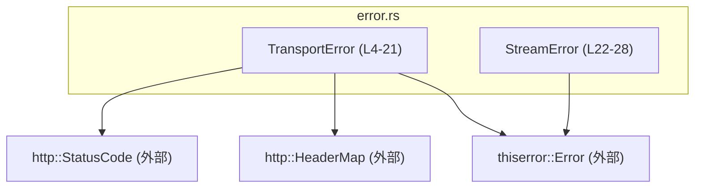

# codex-client/src/error.rs コード解説

---

## 0. ざっくり一言

`codex-client/src/error.rs` は、HTTP トランスポートおよびストリーミング処理で発生しうるエラーを表現するための **公開用エラー型（列挙体）を 2 つ定義するモジュール** です（`TransportError` と `StreamError`）。  
ロジックは持たず、エラー情報を構造化して他モジュールに渡す役割を持ちます（error.rs:L4-21, L22-28）。

---

## 1. このモジュールの役割

### 1.1 概要

- このモジュールは **通信処理に関するエラー状態を型安全に表現する** ために存在し、次の機能を提供します。
  - HTTP レスポンスやネットワーク関連の失敗を表す `TransportError` 型（error.rs:L4-21）
  - ストリーム処理の失敗を表す `StreamError` 型（error.rs:L22-28）
- どちらも `thiserror::Error` を derive しており、`std::error::Error` トレイトを実装することで Rust の一般的なエラーハンドリングと統合されます（error.rs:L3-4, L22）。

### 1.2 アーキテクチャ内での位置づけ

このファイル単体から分かる依存関係は次の通りです。

- 依存先:
  - 外部クレート `http` の `HeaderMap`, `StatusCode`（error.rs:L1-2）
  - 外部クレート `thiserror` の derive マクロ `Error`（error.rs:L3-4, L22）
- 依存元（この型を「誰が使うか」）は、このチャンクには現れません（不明）。

依存関係を Mermaid でまとめると次のようになります。



### 1.3 設計上のポイント

コードから読み取れる設計上の特徴は次の通りです。

- **責務の分離**  
  - 通信エラーの表現のみを扱い、実際の通信処理ロジックは持たない構造になっています（error.rs 全体）。
- **型安全なエラー表現**  
  - HTTP レスポンスを伴うエラー (`Http`) と、再試行限界 (`RetryLimit`), タイムアウト (`Timeout`), ネットワークエラー (`Network`), リクエスト組み立てエラー (`Build`) を別々の variant として定義しています（error.rs:L6-20）。
- **詳細コンテキストの保持**  
  - `Http` variant は `status`, `url`, `headers`, `body` を保持し、エラー発生時のコンテキストを詳細に残せるようになっています（error.rs:L6-12）。
  - ただし `url`, `headers`, `body` は `Option` で、状況に応じて省略可能です（error.rs:L9-12）。
- **エラーメッセージの一元管理**  
  - `thiserror::Error` の `#[error(...)]` 属性で Display 用メッセージを variant ごとに定義しており、ログやユーザ向け出力のメッセージがこのファイルに集約されています（error.rs:L6, L13-14, L15-16, L17-18, L19-20, L24-27）。
- **状態を持たない**  
  - いずれも列挙体であり、グローバルな可変状態や内部キャッシュ等は持ちません（error.rs:L4-21, L22-28）。
- **スレッド安全性に関する明示的な指定はなし**  
  - `Send` / `Sync` などのトレイト境界や同期機構はこのファイルには現れません。  
    したがって、スレッド安全性はフィールド型（`StatusCode`, `HeaderMap`, `String`）に依存しますが、このチャンクからその具体的な性質は読み取れません。

---

## 2. 主要な機能一覧

このモジュールには関数はなく、「機能」は主に **エラー状態の種類** として提供されています。

- `TransportError::Http`  
  - HTTP ステータスコードと、任意の URL / ヘッダ / ボディを含むエラー（error.rs:L6-12）。
- `TransportError::RetryLimit`  
  - 再試行回数が上限に達したことを表すエラー（error.rs:L13-14）。
- `TransportError::Timeout`  
  - HTTP トランスポート関連のタイムアウトを表すエラー（error.rs:L15-16）。
- `TransportError::Network`  
  - ネットワーク層でのエラー内容を文字列で保持するエラー（error.rs:L17-18）。
- `TransportError::Build`  
  - リクエスト構築時のエラー内容を文字列で保持するエラー（error.rs:L19-20）。
- `StreamError::Stream`  
  - ストリーム処理における失敗内容を文字列で保持するエラー（error.rs:L24-25）。
- `StreamError::Timeout`  
  - ストリーム処理におけるタイムアウトを表すエラー（error.rs:L26-27）。

これらはすべて `std::error::Error` トレイトを実装しているため、`Result<T, TransportError>` や `Result<T, StreamError>` として他モジュールの公開 API に組み込まれることが想定されます（根拠: `#[derive(Error)]` の使用, error.rs:L4, L22）。

---

## 3. 公開 API と詳細解説

### 3.1 型一覧（構造体・列挙体など）

#### 公開列挙体一覧

| 名前 | 種別 | 役割 / 用途 | 定義位置 |
|------|------|------------|----------|
| `TransportError` | 列挙体 (`pub enum`) | HTTP トランスポートレイヤのエラー表現。レスポンス情報や再試行・タイムアウト・ネットワーク・ビルドエラーを区別して扱う。 | error.rs:L4-21 |
| `StreamError` | 列挙体 (`pub enum`) | ストリーム処理に関するエラー表現。一般的なストリーム失敗とタイムアウトを区別して扱う。 | error.rs:L22-28 |

#### `TransportError` の variant 一覧

| Variant 名 | フィールド | 説明 | 定義位置 |
|-----------|-----------|------|----------|
| `Http` | `status: StatusCode`, `url: Option<String>`, `headers: Option<HeaderMap>`, `body: Option<String>` | HTTP レスポンスに基づくエラー。ステータスコードと、必要に応じて URL / レスポンスヘッダ / ボディを保持する。 | error.rs:L6-12 |
| `RetryLimit` | なし | 再試行回数が上限に達したことを表すエラー。`"retry limit reached"` というメッセージで表示される。 | error.rs:L13-14 |
| `Timeout` | なし | 通信のタイムアウトを表すエラー。`"timeout"` というメッセージで表示される。 | error.rs:L15-16 |
| `Network(String)` | `String` | ネットワークエラーの説明文字列を保持するエラー。`"network error: {0}"` として表示される。 | error.rs:L17-18 |
| `Build(String)` | `String` | リクエスト構築時のエラー説明文字列を保持するエラー。`"request build error: {0}"` として表示される。 | error.rs:L19-20 |

#### `StreamError` の variant 一覧

| Variant 名 | フィールド | 説明 | 定義位置 |
|-----------|-----------|------|----------|
| `Stream(String)` | `String` | ストリーム処理での失敗内容を保持するエラー。`"stream failed: {0}"` として表示される。 | error.rs:L24-25 |
| `Timeout` | なし | ストリーム処理のタイムアウトを表すエラー。`"timeout"` として表示される。 | error.rs:L26-27 |

### 3.2 関数詳細（最大 7 件）

このファイルには **関数定義が 1 つも存在しません**（error.rs:L1-28）。  
そのため、このセクションで詳細解説すべき関数はありません。

> 代わりに、このモジュールは列挙体とその variant によってエラー情報を表現し、他モジュールの関数から `Result<_, TransportError>` や `Result<_, StreamError>` として利用されることが想定されます（このファイル内には利用側コードは現れません）。

### 3.3 その他の関数

- 該当なし（このチャンクには関数定義が存在しません: error.rs:L1-28）。

---

## 4. データフロー

このモジュール自身は処理ロジックを持ちませんが、**典型的なエラーの生成・伝播の流れ** は次のように整理できます。

1. 別モジュール（HTTP クライアントやストリーム処理ロジック）が通信処理を行う（このチャンクには現れません）。
2. エラー条件（非成功ステータス、タイムアウト、ネットワーク例外など）を検出する。
3. 適切な variant（`TransportError` または `StreamError`）を生成する。
4. 呼び出し元に `Result<T, TransportError>` / `Result<T, StreamError>` として返す。
5. 上位の呼び出し元が `match` や `?` 演算子でエラーを処理する。

このファイルから見える範囲のデータフローを、概念的なシーケンス図で示します。

```mermaid
sequenceDiagram
    participant Caller as 呼び出し側コード<br/>(別モジュール; このチャンクには現れない)
    participant HTTPProc as HTTP/Stream処理ロジック<br/>(別モジュール; このチャンクには現れない)
    participant TE as TransportError (L4-21)
    participant SE as StreamError (L22-28)

    Caller->>HTTPProc: 処理を呼び出す\n(Result<_, TransportError> などを期待)
    HTTPProc-->>HTTPProc: 通信/ストリーム処理を実行

    alt HTTP トランスポートエラー
        HTTPProc->>TE: 適切な variant を生成\n(e.g. Http/Timeout/Network)
        HTTPProc-->>Caller: Err(TransportError::...) を返す
    else ストリームエラー
        HTTPProc->>SE: 適切な variant を生成\n(e.g. Stream/Timeout)
        HTTPProc-->>Caller: Err(StreamError::...) を返す
    end

    Caller-->>Caller: match / ? でエラー処理\nログ出力や再試行など
```

> 注意: `HTTPProc` および `Caller` に相当する具体的な型や関数は、このチャンクには定義されておらず、不明です。

---

## 5. 使い方（How to Use）

### 5.1 基本的な使用方法

`TransportError` を HTTP 通信関数の戻り値として使う例です。

```rust
use http::{HeaderMap, StatusCode};                    // error.rs と同じ http クレートを利用
use codex_client::error::TransportError;              // 本モジュールの公開エラー型をインポート

// HTTP リクエストを実行し、エラーを TransportError で返す関数の例
fn fetch_data() -> Result<String, TransportError> {
    // ここで実際の HTTP 通信を行うと仮定する（このチャンクには実装はない）

    // 例: タイムアウトが発生した場合
    Err(TransportError::Timeout)                      // error.rs:L15-16
}

// HTTP レスポンスに基づいて Http variant を生成する例
fn handle_response(
    status: StatusCode,
    url: String,
    headers: HeaderMap,
    body: String,
) -> Result<(), TransportError> {
    if !status.is_success() {
        // ステータスが成功でない場合、レスポンス情報付きのエラーを構築
        return Err(TransportError::Http {            // error.rs:L6-12
            status,
            url: Some(url),
            headers: Some(headers),
            body: Some(body),
        });
    }

    Ok(())
}
```

この例では、`TransportError` を `Result` のエラー型として使用し、呼び出し側は `?` 演算子や `match` で処理できます。

`StreamError` の利用例です。

```rust
use codex_client::error::StreamError;                // 本モジュールの公開エラー型

// ストリーム処理の例: 失敗時に StreamError を返す
fn process_stream() -> Result<(), StreamError> {
    // 何らかのストリーム処理...

    // 例: ストリームの読み取りに失敗した場合
    Err(StreamError::Stream("read failed".to_string()))  // error.rs:L24-25
}
```

### 5.2 よくある使用パターン

1. **エラーのラップと再マッピング**

   別のエラー型を `TransportError` / `StreamError` に変換して公開 API として返すパターンです。

   ```rust
   use std::io;
   use codex_client::error::{TransportError, StreamError};

   fn do_network_io() -> Result<(), TransportError> {
       let result: Result<(), io::Error> = /* ... */;

       result.map_err(|e| TransportError::Network(e.to_string()))  // error.rs:L17-18
   }

   fn do_stream_io() -> Result<(), StreamError> {
       let result: Result<(), io::Error> = /* ... */;

       result.map_err(|e| StreamError::Stream(e.to_string()))      // error.rs:L24-25
   }
   ```

2. **ログ出力時に Display/Debug を利用**

   `thiserror::Error` の derive により、`Display` と `Debug` でわかりやすいメッセージが出力されます。

   ```rust
   use codex_client::error::TransportError;

   fn log_error(err: &TransportError) {
       eprintln!("error (display): {}", err);      // #[error(...)] で定義したメッセージ
       eprintln!("error (debug):   {:?}", err);    // Debug 表現
   }
   ```

### 5.3 よくある間違い

このファイルから推測できる、起こりやすい誤用と正しい利用の対比です。

```rust
use codex_client::error::TransportError;
use http::StatusCode;

// 誤り例: Option フィールドを None のまま前提として扱う
fn wrong_handle(err: TransportError) {
    if let TransportError::Http { body, .. } = err {
        // body が必ず Some と決めつけて unwrap するとパニックの可能性
        let text = body.unwrap(); // パニックの危険
        println!("{}", text);
    }
}

// 正しい例: Option を安全に扱う
fn correct_handle(err: TransportError) {
    if let TransportError::Http { body, .. } = err {
        if let Some(text) = body {
            println!("{}", text);
        } else {
            println!("no body");
        }
    }
}
```

### 5.4 使用上の注意点（まとめ）

- **Option フィールドは None の可能性がある**  
  - `TransportError::Http` の `url`, `headers`, `body` は `Option` であり、常に利用できるとは限りません（error.rs:L9-12）。
- **文字列フィールドは自由形式**  
  - `Network`, `Build`, `Stream` は `String` を保持するだけなので、メッセージのフォーマットや内容は呼び出し側の実装に依存します（error.rs:L17-20, L24-25）。
- **大きなボディや機密情報の保持に注意**  
  - `Http` variant の `body` や `headers` にレスポンス全体を保持すると、メモリ利用量増加や機密情報のログ流出のリスクがあります（error.rs:L9-12）。  
    ログに出力する際はマスキングやサイズ制限が必要になる場合があります。
- **スレッド安全性はフィールド型に依存**  
  - このファイルでは `Send` / `Sync` の有無は明示されていません。並行処理で共有する場合は、依存する型（特に `HeaderMap`）のスレッド安全性を確認する必要があります（error.rs:L1-2, L6-12）。

---

## 6. 変更の仕方（How to Modify）

### 6.1 新しい機能を追加する場合（新しいエラー variant など）

新しいエラー種別を追加したい場合の典型的な手順です。

1. **どの列挙体に追加すべきかを決める**  
   - HTTP トランスポートのエラーであれば `TransportError`（error.rs:L4-21）。  
   - ストリーム処理関連であれば `StreamError`（error.rs:L22-28）。
2. **該当列挙体に新しい variant を追加する**  
   - 例: `TransportError` に `Authentication(String)` を追加する場合、`Network`, `Build` のようなスタイルで定義する（error.rs:L17-20 を参考）。
   - あわせて `#[error("...")]` 属性で表示メッセージを定義する。
3. **既存の利用箇所の match を更新する**  
   - このチャンクには利用箇所は現れていませんが、一般に `match` で `TransportError` / `StreamError` を列挙しているコードがあれば、新 variant を扱うように修正する必要があります（このチャンクからは位置不明）。
4. **必要であればユニットテストを追加する**  
   - 新 variant の `Display`（`#[error]` メッセージ）が期待通りかどうかを確認するテストなど。  
   - テストコードはこのチャンクには存在しません（error.rs:L1-28）。

### 6.2 既存の機能を変更する場合

- **エラーメッセージ (`#[error("...")]`) を変更する場合**  
  - 変更によってログ解析やユーザ向けエラーメッセージが変わるため、下位互換性への影響を考慮する必要があります（error.rs:L6, L13-14, L15-16, L17-18, L19-20, L24-27）。
- **フィールド追加・削除の場合の影響範囲**  
  - `Http` variant にフィールドを追加・削除すると、その variant をパターンマッチしている全てのコードが影響を受けます（このチャンクには利用側は現れません）。  
  - 例: `Http { status, url, headers, body }` から `Http { status, url, headers, .. }` に書き換えるなどの対応が必要になります。
- **契約（前提条件・意味）の維持**  
  - `RetryLimit`, `Timeout` などは名前とメッセージから意味が伝わるため、実際の挙動（どの条件でこれらが生成されるか）と整合性を保つ必要があります。  
    このファイルだけでは生成条件は不明なため、呼び出し側の実装を確認する必要があります（このチャンクには現れない）。

---

## 7. 関連ファイル

このチャンクには、他ファイルへの参照やモジュール宣言は含まれていません（error.rs:L1-28）。  
そのため、**どのファイルからこのエラー型が実際に利用されているかは、この情報だけでは特定できません**。

このモジュールと論理的に関係しそうなコンポーネントの例と、分かっている/分からない点をまとめます。

| パス / モジュール | 役割 / 関係 | このチャンクから分かること |
|------------------|-------------|-----------------------------|
| `codex-client/src/error.rs` | 本モジュール自身。通信関連エラー型を定義する。 | 列挙体の定義とそのフィールド・メッセージはすべてこのチャンクに含まれている（error.rs:L1-28）。 |
| その他の HTTP クライアント / ストリーム処理モジュール | これらのエラー型を `Result` のエラーとして利用していると考えられる。 | 実際のファイル名や場所、どのように使われているかは、このチャンクには現れないため不明。 |

---

## 付録: コンポーネントインベントリー（まとめ）

最後に、このファイル内のコンポーネントを一覧で整理します。

### 型コンポーネント

| 名前 | 種別 | 公開性 | 依存フィールド / トレイト | 定義位置 |
|------|------|--------|---------------------------|----------|
| `TransportError` | enum | `pub` | フィールドとして `http::StatusCode`, `http::HeaderMap`, `String`; derive として `Debug`, `thiserror::Error` | error.rs:L4-21 |
| `StreamError` | enum | `pub` | フィールドとして `String`; derive として `Debug`, `thiserror::Error` | error.rs:L22-28 |

### 関数コンポーネント

- なし（このチャンクには関数定義が存在しません: error.rs:L1-28）。

---

## Bugs / Security / Contracts / Edge Cases / Tests / Performance の要点

- **顕在的なバグ**  
  - 宣言のみであり、明らかなバグは見当たりません。
- **セキュリティ上の注意**  
  - `TransportError::Http` の `headers` / `body` に機密情報が含まれる可能性があり、ログ出力時にはマスキングなどの対策が必要になる場合があります（error.rs:L9-12）。
- **契約 (Contracts)**  
  - `Timeout` variant は「タイムアウトが発生した」と解釈されることが期待されますが、実際にどのタイミングで生成されるかは呼び出し側に依存し、このチャンクからは不明です（error.rs:L15-16, L26-27）。
- **エッジケース**  
  - `Http` variant の `url`, `headers`, `body` がすべて `None` のケースも型上は許されます。そのような場合にどう扱うかは呼び出し側で決める必要があります（error.rs:L9-12）。
- **テスト**  
  - このファイル内にテストコードは存在しません（error.rs:L1-28）。  
    エラーの `Display` メッセージや variant の追加・変更時は、別ファイルでテストを用意することが推奨されます。
- **パフォーマンス / スケーラビリティ**  
  - エラーにレスポンスボディ全体（`String`）を保持する設計は、エラー頻度やボディサイズによってはメモリ消費に影響する可能性があります（error.rs:L9-12）。必要に応じてサイズ制限や一部のみ保持する設計が検討されることがあります。
