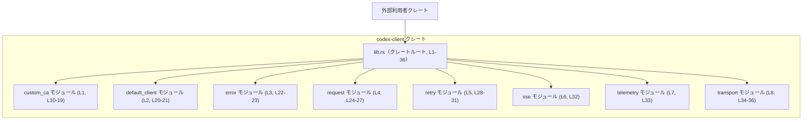

# codex-client/src/lib.rs コード解説

## 0. ざっくり一言

`codex-client/src/lib.rs` は、クレート内の各モジュール（カスタム CA、HTTP クライアント、リトライ、SSE、テレメトリ、トランスポートなど）を宣言し、それらが提供する主要な型や関数を再エクスポートする「ファサード（入口）」として機能するファイルです（`codex-client/src/lib.rs:L1-8, L10-36`）。

---

## 1. このモジュールの役割

### 1.1 概要

- このモジュールはクレート全体の公開 API を集約し、利用者が `codex_client::…` という形で主要な型・関数にアクセスできるようにするために存在します（`mod` と `pub use` の組み合わせ: `codex-client/src/lib.rs:L1-8, L10-36`）。
- 実際の処理ロジック（HTTP 通信、リトライ制御、SSE 処理、テレメトリ収集など）は、`custom_ca`, `default_client`, `error`, `request`, `retry`, `sse`, `telemetry`, `transport` といったサブモジュール側に実装されており、このファイルではそれらを参照するだけです（`codex-client/src/lib.rs:L1-8`）。

### 1.2 アーキテクチャ内での位置づけ

このファイルは「クレート利用者」と「各サブモジュール」の間に立つゲートウェイとして振る舞います。依存関係の構造は次のように表現できます。



**根拠**

- サブモジュール宣言: `mod custom_ca;` など（`codex-client/src/lib.rs:L1-8`）
- 再エクスポート: `pub use crate::…;` 群（`codex-client/src/lib.rs:L10-36`）

### 1.3 設計上のポイント

コードから読み取れる範囲での特徴は次のとおりです。

- **ファサード設計**
  - クレートルートで各モジュールの主要アイテムを `pub use` しており、利用者は内部モジュール名を意識せずに `codex_client::CodexHttpClient` 等でアクセスできます（`codex-client/src/lib.rs:L10-36`）。
- **責務ごとのモジュール分割**
  - `custom_ca`（カスタム CA 関連）、`default_client`（HTTP クライアント）、`error`（エラー型）、`request`（リクエスト/レスポンス表現）、`retry`（リトライ制御）、`sse`（Server-Sent Events）、`telemetry`（テレメトリ）、`transport`（トランスポート抽象化）といった名前で分割されています（`codex-client/src/lib.rs:L1-8`）。
- **テスト専用 API の取り扱い**
  - `build_reqwest_client_for_subprocess_tests` は `#[doc(hidden)]` が付与され、通常のドキュメントには表示されませんが、テスト用バイナリから再利用するため `pub` のまま公開されています（`codex-client/src/lib.rs:L11-17`）。
- **このファイル自身にロジックはない**
  - 関数や構造体の定義はなく、すべて他モジュールへの参照と再エクスポートのみです（メタ情報 `functions=0`, 実際のコード `codex-client/src/lib.rs:L1-36`）。

---

## 2. 主要な機能一覧

このファイルにはロジックはありませんが、**どの機能を公開しているか** という観点で整理すると次のようになります（役割は名前とモジュールからの解釈であり、詳細挙動は該当モジュール側にあります）。

### 2.1 モジュールインベントリー

| モジュール名 | 役割（名前からの解釈） | 根拠 |
|-------------|------------------------|------|
| `custom_ca` | カスタム証明書（CA）を扱う HTTP クライアント構成 | `mod custom_ca;`（`codex-client/src/lib.rs:L1`）、`BuildCustomCaTransportError` などの再エクスポート（`L10-19`） |
| `default_client` | デフォルトの HTTP クライアント実装 | `mod default_client;`（`L2`）、`CodexHttpClient`, `CodexRequestBuilder` の再エクスポート（`L20-21`） |
| `error` | ストリーム/トランスポート関連のエラー型 | `mod error;`（`L3`）、`StreamError`, `TransportError` の再エクスポート（`L22-23`） |
| `request` | HTTP リクエスト/レスポンス表現 | `mod request;`（`L4`）、`Request`, `RequestBody`, `RequestCompression`, `Response` の再エクスポート（`L24-27`） |
| `retry` | リトライポリシーとバックオフ処理 | `mod retry;`（`L5`）、`RetryOn`, `RetryPolicy`, `backoff`, `run_with_retry` の再エクスポート（`L28-31`） |
| `sse` | Server-Sent Events（SSE）ストリーム処理 | `mod sse;`（`L6`）、`sse_stream` の再エクスポート（`L32`） |
| `telemetry` | リクエストに関するテレメトリ情報の収集・表現 | `mod telemetry;`（`L7`）、`RequestTelemetry` の再エクスポート（`L33`） |
| `transport` | HTTP トランスポート層の抽象と実装 | `mod transport;`（`L8`）、`ByteStream`, `HttpTransport`, `ReqwestTransport`, `StreamResponse` の再エクスポート（`L34-36`） |

### 2.2 公開される主な機能

| 機能カテゴリ | 公開アイテム | 説明（このファイルから読み取れる範囲） | 根拠 |
|-------------|-------------|----------------------------------------|------|
| カスタム CA 付きクライアント構築 | `BuildCustomCaTransportError`, `build_reqwest_client_with_custom_ca`, `maybe_build_rustls_client_config_with_custom_ca` | カスタム CA 設定に失敗した際のエラーと、reqwest/rustls 用クライアント構築関数（詳細は `custom_ca` モジュール側） | `codex-client/src/lib.rs:L10, L18-19` |
| テスト専用 CA クライアント | `build_reqwest_client_for_subprocess_tests` | サブプロセステスト用のフック。通常利用者には隠蔽（`#[doc(hidden)]`） | `codex-client/src/lib.rs:L11-17` |
| HTTP クライアント本体 | `CodexHttpClient`, `CodexRequestBuilder` | コードネームから、クライアントとそのビルダと解釈できる | `codex-client/src/lib.rs:L20-21` |
| エラー型 | `StreamError`, `TransportError` | ストリーム処理・トランスポート処理のエラー表現と推測される | `codex-client/src/lib.rs:L22-23` |
| リクエスト/レスポンス表現 | `Request`, `RequestBody`, `RequestCompression`, `Response` | HTTP リクエストとレスポンス、およびボディと圧縮方式の表現 | `codex-client/src/lib.rs:L24-27` |
| リトライ処理 | `RetryOn`, `RetryPolicy`, `backoff`, `run_with_retry` | どの条件でリトライするか、リトライ戦略とバックオフ計算関数、およびリトライ付き実行関数 | `codex-client/src/lib.rs:L28-31` |
| SSE | `sse_stream` | SSE 用のストリーム生成関数（詳細不明） | `codex-client/src/lib.rs:L32` |
| テレメトリ | `RequestTelemetry` | リクエストに紐づくテレメトリ情報の型 | `codex-client/src/lib.rs:L33` |
| トランスポート層 | `ByteStream`, `HttpTransport`, `ReqwestTransport`, `StreamResponse` | HTTP 通信の抽象トレイトや実装、およびストリームレスポンス表現 | `codex-client/src/lib.rs:L34-36` |

※ 機能の詳細な挙動（エラー条件、並行性、安全性など）は、このチャンクには現れず、各モジュール側のコードを確認する必要があります。

---

## 3. 公開 API と詳細解説

### 3.1 型一覧（構造体・列挙体など）

このファイルからは、**大文字で始まる識別子が型（構造体、列挙体、トレイトなど）、小文字で始まる識別子が関数** であることが Rust の命名規約から分かります。

#### 型インベントリー

| 名前 | 種別（推定） | 定義モジュール | 役割 / 用途（名前からの解釈） | 根拠 |
|------|--------------|----------------|--------------------------------|------|
| `BuildCustomCaTransportError` | エラー型 | `custom_ca` | カスタム CA を用いたトランスポート構築時のエラー | `pub use crate::custom_ca::BuildCustomCaTransportError;`（`codex-client/src/lib.rs:L10`） |
| `CodexHttpClient` | 構造体 | `default_client` | このクレートが提供する HTTP クライアント本体 | `codex-client/src/lib.rs:L20` |
| `CodexRequestBuilder` | 構造体 | `default_client` | リクエスト構築用ビルダ | `codex-client/src/lib.rs:L21` |
| `StreamError` | エラー型 | `error` | ストリーミング関連のエラー | `codex-client/src/lib.rs:L22` |
| `TransportError` | エラー型 | `error` | トランスポート層全般のエラー | `codex-client/src/lib.rs:L23` |
| `Request` | 型（構造体等） | `request` | HTTP リクエスト表現 | `codex-client/src/lib.rs:L24` |
| `RequestBody` | 型 | `request` | リクエストのボディ表現 | `codex-client/src/lib.rs:L25` |
| `RequestCompression` | 列挙体等 | `request` | 圧縮方式の指定（例: gzip などと推測） | `codex-client/src/lib.rs:L26` |
| `Response` | 型 | `request` | HTTP レスポンス表現 | `codex-client/src/lib.rs:L27` |
| `RetryOn` | 列挙体等 | `retry` | どの条件でリトライするかの指定 | `codex-client/src/lib.rs:L28` |
| `RetryPolicy` | 構造体等 | `retry` | リトライ戦略（最大回数や間隔などを含むと推測） | `codex-client/src/lib.rs:L29` |
| `RequestTelemetry` | 構造体 | `telemetry` | リクエストごとのテレメトリ情報 | `codex-client/src/lib.rs:L33` |
| `ByteStream` | 型（エイリアス等含む） | `transport` | バイト列ストリーム表現 | `codex-client/src/lib.rs:L34` |
| `HttpTransport` | トレイト等 | `transport` | HTTP トランスポートの抽象インターフェース | `codex-client/src/lib.rs:L35` |
| `ReqwestTransport` | 構造体 | `transport` | `reqwest` ベースの `HttpTransport` 実装と推測 | `codex-client/src/lib.rs:L36` |
| `StreamResponse` | 型 | `transport` | ストリームとして取得されるレスポンス表現 | `codex-client/src/lib.rs:L36` 付近 |

> 注: 具体的なフィールドやメソッド、トレイト境界などは、このファイルからは分かりません。

### 3.2 関数詳細（テンプレート適用）

このファイルには関数定義はありませんが、**再エクスポートされる関数** の名前だけは分かります。シグネチャや詳細挙動は他ファイルにあり、このチャンクには現れません。その前提で、テンプレートに沿って「分かること／分からないこと」を明示します。

#### `build_reqwest_client_with_custom_ca(...) -> ...`（定義は custom_ca モジュール側）

**概要**

- 名前から、カスタム CA 設定を行った `reqwest` ベースの HTTP クライアントを構築する関数と解釈できますが、実際の挙動（どの型を返すか、どのようなオプションを取るか）はこのファイルからは分かりません。
- 再エクスポートされていることから、通常利用者が直接呼び出すことを想定した公開 API です（`codex-client/src/lib.rs:L18`）。

**引数**

- このチャンクには関数定義がないため、引数の数・型・意味は不明です。

**戻り値**

- 不明です。名前からは「クライアント」または「トランスポート」を返す可能性が高いと推測されますが、コード上の根拠はこのファイルにはありません。

**内部処理の流れ**

- `custom_ca` モジュール側に定義されており、このチャンクには現れません。

**Examples（使用例）**

- このファイルだけでは、コンパイル可能な具体的使用例を示すことはできません。
- 利用時は `custom_ca` モジュール内のドキュメントやソースコードを参照する必要があります。

**Errors / Panics**

- エラー型として `BuildCustomCaTransportError` が同じモジュールから公開されているため（`codex-client/src/lib.rs:L10, L18-19`）、この関数から返される可能性がありますが、このファイル単体では確定できません。

**Edge cases / 使用上の注意点**

- 不明です（このチャンクにはエッジケースや前提条件に関する情報がありません）。

---

同様に、以下の関数についても「名称と所在」以外の情報はこのチャンクからは取得できません。

#### `maybe_build_rustls_client_config_with_custom_ca(...) -> ...`

- 概要: `rustls` 用クライアント設定をカスタム CA 付きで構築するかもしれない（`maybe_`）関数と解釈できます。
- 根拠: `pub use crate::custom_ca::maybe_build_rustls_client_config_with_custom_ca;`（`codex-client/src/lib.rs:L19`）。
- 具体的な引数・戻り値・挙動は、このチャンクには現れません。

#### `build_reqwest_client_for_subprocess_tests(...) -> ...`

- 概要: サブプロセステスト用の `reqwest` クライアントを構築するテスト専用フックです。
- 根拠: ドキュメントコメントと `#[doc(hidden)]` 属性（`codex-client/src/lib.rs:L11-17`）。
- 使用上の注意: コメントに「ordinary callers should use [`build_reqwest_client_with_custom_ca`] instead」とあるため、本番コードからの利用は避けるべきと読み取れます。

#### `backoff(...) -> ...`

- 概要: リトライ時の待機時間（バックオフ）を計算する関数名と解釈できます。
- 根拠: `pub use crate::retry::backoff;`（`codex-client/src/lib.rs:L30`）。
- 具体的なアルゴリズムやパラメータは、このチャンクには現れません。

#### `run_with_retry(...) -> ...`

- 概要: ある処理をリトライ付きで実行する関数名と解釈できます。
- 根拠: `pub use crate::retry::run_with_retry;`（`codex-client/src/lib.rs:L31`）。
- エラー/中断条件などは不明です。

#### `sse_stream(...) -> ...`

- 概要: サーバー送信イベント（SSE）のストリームを開始する関数と解釈できます。
- 根拠: `pub use crate::sse::sse_stream;`（`codex-client/src/lib.rs:L32`）。
- 戻り値がどのようなストリーム型かは、このチャンクには現れません。

### 3.3 その他の関数

このファイルに現れる関数名は上記のものに限られます。すべて他モジュールで定義されており、このファイル自身には関数定義がありません。

| 関数名 | 定義モジュール | 役割（名前からの解釈） | 根拠 |
|--------|----------------|------------------------|------|
| `build_reqwest_client_for_subprocess_tests` | `custom_ca` | サブプロセステスト用にカスタム CA クライアントを構築 | `codex-client/src/lib.rs:L11-17` |
| `build_reqwest_client_with_custom_ca` | `custom_ca` | カスタム CA 設定付き `reqwest` クライアント構築 | `codex-client/src/lib.rs:L18` |
| `maybe_build_rustls_client_config_with_custom_ca` | `custom_ca` | 必要に応じて `rustls` クライアント設定を構築 | `codex-client/src/lib.rs:L19` |
| `backoff` | `retry` | バックオフ時間の計算 | `codex-client/src/lib.rs:L30` |
| `run_with_retry` | `retry` | リトライ付きで処理を実行 | `codex-client/src/lib.rs:L31` |
| `sse_stream` | `sse` | SSE ストリームの開始/取得 | `codex-client/src/lib.rs:L32` |

---

## 4. データフロー

このファイルには実行時の処理ロジックがないため、**ランタイムのデータフロー** は読み取れません。ただし、**名前解決・モジュール間の公開フロー** という観点で、利用者がどのように型・関数にアクセスするかは明示できます。

### 4.1 公開 API 名の解決フロー

以下のシーケンス図は、「利用者がクレートルート経由で型/関数にアクセスする流れ」を示します。

```mermaid
sequenceDiagram
    participant User as 利用側クレート
    participant Lib as lib.rs (L1-36)
    participant DefaultClient as default_client モジュール
    participant Transport as transport モジュール

    Note over Lib: サブモジュール宣言<br/>mod default_client;<br/>mod transport;（L2, L8）

    User->>Lib: use codex_client::CodexHttpClient;
    Lib-->>DefaultClient: pub use default_client::CodexHttpClient;（L20）
    Note right of User: 利用者は internal な<br/>`default_client` 名を<br/>意識せずに済む

    User->>Lib: use codex_client::HttpTransport;
    Lib-->>Transport: pub use transport::HttpTransport;（L35）
```

**要点**

- 利用者は `codex_client::CodexHttpClient` や `codex_client::HttpTransport` のように、クレートルートから直接型/トレイトをインポートできます（`codex-client/src/lib.rs:L20, L35`）。
- 実際の定義はそれぞれ `default_client` モジュールおよび `transport` モジュールにあり、`lib.rs` はその橋渡しをしています（`codex-client/src/lib.rs:L1-8`）。
- どの型や関数が、ランタイムにおいてどのようにデータをやり取りするかは、このチャンクでは不明です。

---

## 5. 使い方（How to Use）

このファイル自身にはロジックがないため、**ここで示せるのは「クレートルートからどうインポートするか」のレベル** までになります。具体的なメソッド呼び出しやエラー処理は、各モジュールの定義を参照する必要があります。

### 5.1 基本的な使用方法

以下は、クレートルートから公開アイテムをインポートする最小限の例です。

```rust
// クレートルートから主要な型・関数をインポートする
use codex_client::{
    CodexHttpClient,     // default_client モジュールからの再エクスポート（L20）
    Request,             // request モジュールから（L24）
    Response,            // request モジュールから（L27）
    TransportError,      // error モジュールから（L23）
    // 必要に応じて RetryPolicy, sse_stream などもインポート
};

fn main() {
    // このファイル（lib.rs）だけでは、CodexHttpClient の具体的な初期化方法や
    // Request/Response のフィールド構成は分かりません。
    // 実際に利用する際は、各モジュールのソースコードやドキュメントを参照する必要があります.

    // 以下は「型をどこからインポートするか」を示すのみの擬似コードです。
    // let client = CodexHttpClient::new(/* ... */);
    // let req = Request::new(/* ... */);
    // let res: Result<Response, TransportError> = client.execute(req).await;
}
```

### 5.2 よくある使用パターン（推定レベル）

このチャンクの情報から確定できるのは「どのようなカテゴリの機能が提供されているか」までです。代表的な利用シナリオとしては次のようなものが**想定**されますが、詳細は不明です。

- カスタム CA を利用した HTTP クライアントの構築
  - `build_reqwest_client_with_custom_ca` を用いる（`codex-client/src/lib.rs:L18`）。
- リトライ付きのリクエスト実行
  - `RetryPolicy`, `RetryOn`, `run_with_retry`, `backoff` を組み合わせる（`codex-client/src/lib.rs:L28-31`）。
- SSE ストリームの購読
  - `sse_stream` を使ってストリームを取得（`codex-client/src/lib.rs:L32`）。
- テレメトリ情報の収集
  - `RequestTelemetry` を通じてリクエストのメトリクスを扱う（`codex-client/src/lib.rs:L33`）。

> 上記の具体的なコード例やパラメータは、このチャンクからは導けないため示していません。

### 5.3 よくある間違い（このファイルから読み取れる範囲）

このファイル内のコメントから、次のような誤用が想定されます。

```rust
// 誤用の例（コメントから推測される）:
// テスト専用フックを本番コードで使ってしまう
use codex_client::build_reqwest_client_for_subprocess_tests;

// 正しい方針（コメントより）:
// 通常の利用者は build_reqwest_client_with_custom_ca を使うべき
use codex_client::build_reqwest_client_with_custom_ca;
```

**根拠**

- ドキュメントコメント:  
  > "This stays public only so the `custom_ca_probe` binary target can reuse the shared helper. It  
  > is hidden from normal docs because ordinary callers should use  
  > [`build_reqwest_client_with_custom_ca`] instead."（`codex-client/src/lib.rs:L11-15`）

### 5.4 使用上の注意点（まとめ）

このファイルに基づいて言える注意点は次のとおりです。

- **ファサード経由での利用**
  - 原則として、`codex_client::…` 経由で公開アイテムを利用するのが前提設計と解釈できます（`pub use` 群: `codex-client/src/lib.rs:L10-36`）。
- **テスト専用 API の扱い**
  - `build_reqwest_client_for_subprocess_tests` はコメント上「テスト専用」であり、本番コードからの利用は避ける必要があります（`codex-client/src/lib.rs:L11-17`）。
- **安全性・エラー・並行性について**
  - 本ファイルにはロジックがないため、エラー処理や並行性（`Send`/`Sync` など）に関する詳細な契約は読み取れません。これらは各モジュールの実装とトレイト境界に依存します。

---

## 6. 変更の仕方（How to Modify）

### 6.1 新しい機能を追加する場合

このファイルの役割は「モジュール宣言」と「再エクスポート」です。そのため、新しい機能を追加する際の変更点は次のようになります。

1. **新しいモジュールや型/関数を定義する**
   - 例: `src/new_feature.rs` を作成し、その中で `pub struct NewFeature { ... }` などを定義する（このステップはこのチャンク外）。
2. **`lib.rs` でモジュールを宣言する**
   - `mod new_feature;` を追加する（`mod` 群: `codex-client/src/lib.rs:L1-8` に倣う）。
3. **公開したいアイテムを再エクスポートする**
   - 利用者に `codex_client::NewFeature` として見せたい場合は、`pub use crate::new_feature::NewFeature;` を追加する（`pub use` 群: `codex-client/src/lib.rs:L10-36` を参考）。

### 6.2 既存の機能を変更する場合

既存の API を変更する場合、このファイルは主に「名前と所在」を変える役割を持ちます。

- **公開/非公開の切り替え**
  - ある型や関数を公開しないようにする場合、`pub use` 行を削除またはコメントアウトします。
  - 逆に、内部モジュールだけで公開されていたものをクレートルートからも公開したい場合は、`pub use` を追加します。
- **テスト専用 API の扱い**
  - テスト専用のヘルパーを追加する場合、現在の `build_reqwest_client_for_subprocess_tests` と同様に `#[doc(hidden)]` とコメントで用途を明示するのが一貫したスタイルです（`codex-client/src/lib.rs:L11-17`）。
- **影響範囲の確認**
  - `pub use` を変更すると、クレート利用者のコード（外部クレート）に影響します。特に型名や関数名を削除/リネームする場合は、破壊的変更になります。

---

## 7. 関連ファイル

このファイルと密接に関係するのは、ここで宣言・再エクスポートされている各モジュールファイルです。

| パス（推定） | 役割 / 関係 | 根拠 |
|-------------|------------|------|
| `codex-client/src/custom_ca.rs` | カスタム CA 設定と、それを用いたクライアント/トランスポート構築ロジックを提供する | `mod custom_ca;`（`codex-client/src/lib.rs:L1`）、関連 `pub use`（`L10-19`） |
| `codex-client/src/default_client.rs` | `CodexHttpClient`, `CodexRequestBuilder` の定義 | `mod default_client;`（`L2`）、`pub use crate::default_client::…`（`L20-21`） |
| `codex-client/src/error.rs` | `StreamError`, `TransportError` の定義 | `mod error;`（`L3`）、`pub use crate::error::…`（`L22-23`） |
| `codex-client/src/request.rs` | `Request`, `RequestBody`, `RequestCompression`, `Response` の定義 | `mod request;`（`L4`）、`pub use crate::request::…`（`L24-27`） |
| `codex-client/src/retry.rs` | `RetryOn`, `RetryPolicy`, `backoff`, `run_with_retry` の定義 | `mod retry;`（`L5`）、`pub use crate::retry::…`（`L28-31`） |
| `codex-client/src/sse.rs` | `sse_stream` の定義 | `mod sse;`（`L6`）、`pub use crate::sse::sse_stream;`（`L32`） |
| `codex-client/src/telemetry.rs` | `RequestTelemetry` の定義 | `mod telemetry;`（`L7`）、`pub use crate::telemetry::RequestTelemetry;`（`L33`） |
| `codex-client/src/transport.rs` | `ByteStream`, `HttpTransport`, `ReqwestTransport`, `StreamResponse` の定義 | `mod transport;`（`L8`）、`pub use crate::transport::…`（`L34-36`） |

> これらのファイルに、実際のコアロジック（エラー処理・並行性・セキュリティ上の配慮など）が含まれていると考えられますが、その内容はこのチャンクには現れません。
