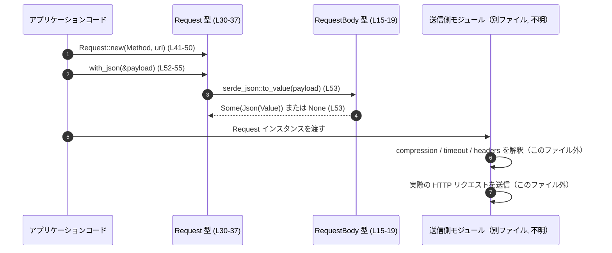

# codex-client/src/request.rs

## 0. ざっくり一言

HTTP リクエストとレスポンスの **軽量な表現型（DTO）** と、リクエストボディの組み立て用メソッドを提供するモジュールです（`codex-client/src/request.rs:L8-73`）。

---

## 1. このモジュールの役割

### 1.1 概要

- このモジュールは、HTTP クライアント周りのコードから共通して使える **`Request` / `Response` の型** を定義しています（`codex-client/src/request.rs:L30-38,68-73`）。
- JSON や生バイト列のボディを表す `RequestBody` と、圧縮方式を表す `RequestCompression` により、リクエストのメタ情報をまとめて扱えるようにしています（`L8-19`）。
- JSON ボディのシリアライズや、生バイト列の設定用の **ビルダーメソッド** を `Request` に対して提供します（`L40-65`）。

### 1.2 アーキテクチャ内での位置づけ

このファイル単体から分かる範囲では、`request` モジュールは次のような依存関係を持っています。

```mermaid
graph TD
    subgraph "このモジュール (codex-client/src/request.rs)"
        Request
        Response
        RequestBody
        RequestCompression
    end

    Request --> RequestBody
    Request --> RequestCompression
    Request --> "http::Method"
    Request --> "HeaderMap (reqwest::header)"
    Request --> "std::time::Duration"
    RequestBody --> "serde_json::Value"
    RequestBody --> "bytes::Bytes"
    Response --> "http::StatusCode"
    Response --> "HeaderMap (reqwest::header)"
    Response --> "bytes::Bytes"
```

- `http::Method` / `http::StatusCode` に依存しているため、HTTP 抽象化レイヤに属する型とみなせます（`L2,70`）。
- ボディ表現には `bytes::Bytes` と `serde_json::Value` を用いており、上位レイヤはこの `Request` を別モジュールの HTTP クライアント実装に渡す設計であると解釈できますが、その実装はこのチャンクには現れません。

### 1.3 設計上のポイント

コードから読み取れる設計上の特徴は次の通りです。

- **データキャリア中心**  
  - `Request` / `Response` / `RequestBody` / `RequestCompression` はいずれもフィールド公開の単純なデータ型です（`L30-37,68-72`）。
- **ビルダー風 API**  
  - `Request::new` を起点に、`with_xxx` メソッドをチェーンしてリクエストを構築するスタイルです（`L40-65`）。
- **エラーハンドリング方針**  
  - `with_json` は `serde_json::to_value` のエラーを **握りつぶして `None` にする** 実装になっており（`L52-54`）、呼び出し元には失敗が通知されません。
- **状態管理**  
  - `Request` / `Response` は内部的な可変状態を持たず、ミュータブルフィールドもありません。ビルダーは `self` を値として受け取り再構築します（`L41,52,57,62`）。
- **派生トレイト**  
  - デバッグ出力とコピー/クローンなどが自動派生されており、ログ出力や複製を意識した設計です（`L8,15,30,68`）。

---

## 2. 主要な機能一覧

このモジュールが提供する主な機能は次の通りです。

- HTTP リクエストの表現: `Request` 構造体でメソッド・URL・ヘッダ・ボディ・タイムアウトなどを保持する（`L30-37`）。
- HTTP レスポンスの表現: `Response` 構造体でステータスコード・ヘッダ・ボディを保持する（`L68-72`）。
- リクエストボディ種別の表現: `RequestBody` 列挙体で JSON or 生バイト列を区別する（`L15-19`）。
- 圧縮方式の指定: `RequestCompression` 列挙体で圧縮の有無と種類（現状 Zstd のみ）を表す（`L8-13`）。
- JSON ボディの埋め込み: 任意の `Serialize` 実装型から JSON ボディを構築する `Request::with_json`（`L52-55`）。
- 生バイト列ボディの埋め込み: `Bytes` に変換可能な値からボディを構築する `Request::with_raw_body`（`L57-60`）。
- ボディの JSON 取得: `RequestBody::json` で JSON ボディであれば参照を取得する（`L21-27`）。

---

## 3. 公開 API と詳細解説

### 3.1 型一覧（コンポーネントインベントリー）

| 名前 | 種別 | 定義行 | 役割 / 用途 |
|------|------|--------|-------------|
| `RequestCompression` | 列挙体 | `L8-13` | リクエストボディの圧縮方式を表現（`None` または `Zstd`）。 |
| `RequestBody` | 列挙体 | `L15-19` | リクエストボディの種別（`Json(Value)` / `Raw(Bytes)`）を表現。 |
| `Request` | 構造体 | `L30-37` | HTTP リクエストのメソッド・URL・ヘッダ・ボディ・圧縮・タイムアウトをまとめる。 |
| `Response` | 構造体 | `L68-72` | HTTP レスポンスのステータスコード・ヘッダ・ボディを保持する。 |

補足:

- いずれも `pub` として公開されているため、クレート外からも直接利用およびフィールド操作が可能です（`L8,15,30,68`）。
- `Request` / `Response` は `Clone` を派生しているので、所有権を移動させずに複製できます（`L30,68`）。

---

### 3.2 関数詳細

#### `RequestBody::json(&self) -> Option<&Value>`（`codex-client/src/request.rs:L21-27`）

**概要**

- `RequestBody` が `Json(Value)` の場合に、その `Value` への参照を返します。
- `Raw(Bytes)` の場合は `None` を返し、JSON ではないことを示します。

**引数**

| 引数名 | 型 | 説明 |
|--------|----|------|
| `&self` | `&RequestBody` | 対象となるリクエストボディへの参照。 |

**戻り値**

- `Option<&serde_json::Value>`  
  - `Some(&Value)` : ボディが JSON である場合の値参照。  
  - `None` : ボディが `Raw(Bytes)` である場合。

**内部処理の流れ**

1. `match self` で `self` のバリアントを判定する（`L23`）。
2. `Json(value)` の場合は `Some(value)` を返す（`L24`）。
3. `Raw(_)` の場合は `None` を返す（`L25`）。

**Examples（使用例）**

```rust
use codex_client::request::{RequestBody}; // モジュールパスは仮。実際のクレート名はこのチャンクには現れません。
use serde_json::json;

// JSON ボディから値を取り出す例
let body = RequestBody::Json(json!({ "foo": 1 }));      // JSON バリアントを作成
if let Some(v) = body.json() {                          // json() で Option<&Value> を取得
    assert_eq!(v["foo"], 1);                            // JSON としてアクセス
}

// Raw ボディの場合は None
use bytes::Bytes;
let raw_body = RequestBody::Raw(Bytes::from("abc"));    // Raw バリアント
assert!(raw_body.json().is_none());                     // JSON ではないので None
```

**Errors / Panics**

- この関数はエラーも panic も発生させません。全パターンを `match` で網羅しています（`L23-25`）。

**Edge cases（エッジケース）**

- `Json(Value::Null)` のように JSON が `null` の場合でも、`Some(&Value)` として返ります（`Value` の中身についての特別扱いはありません）。  
  → これは `serde_json::Value` の通常の挙動に従います。

**使用上の注意点**

- `Raw` バリアントを JSON として扱うことはできないため、`None` を考慮したパターンマッチが前提になります。
- 生バイト列を JSON に変換したい場合は、別途 `serde_json::from_slice` などを利用する必要がありますが、その処理はこのモジュールには含まれていません。

---

#### `Request::new(method: Method, url: String) -> Self`（`codex-client/src/request.rs:L41-50`）

**概要**

- HTTP メソッドと URL を指定して、新しい `Request` を初期化します。
- ヘッダは空、ボディ・タイムアウト・圧縮は未設定（またはデフォルト）になります。

**引数**

| 引数名 | 型 | 説明 |
|--------|----|------|
| `method` | `http::Method` | HTTP メソッド（GET, POST など）。 |
| `url` | `String` | リクエスト先 URL。 |

**戻り値**

- `Request`  
  - フィールドは次のように初期化されます（`L42-48`）。
    - `method`: 引数 `method`
    - `url`: 引数 `url`
    - `headers`: 空の `HeaderMap`
    - `body`: `None`
    - `compression`: `RequestCompression::None`
    - `timeout`: `None`

**内部処理の流れ**

1. `Self { ... }` リテラルで `Request` を構築する（`L42-48`）。
2. ヘッダは `HeaderMap::new()` で空のマップを生成する（`L45`）。
3. その他のオプション値は `None`、圧縮は `RequestCompression::None` で初期化する（`L46-48`）。

**Examples（使用例）**

```rust
use codex_client::request::Request;      // クレートパスは仮
use http::Method;

// GET リクエストの雛形を作成
let mut req = Request::new(Method::GET, "https://example.com".to_string());

// ヘッダを追加（ヘッダ操作はフィールドが pub なので直接行う）
use reqwest::header::{HeaderName, HeaderValue};
req.headers.insert(
    HeaderName::from_static("x-custom"), // カスタムヘッダ名
    HeaderValue::from_static("value"),   // カスタムヘッダ値
);
```

**Errors / Panics**

- この関数自体はエラーも panic も発生させません。
- ただし、後続でヘッダ操作等を行う際に、`HeaderName` や `HeaderValue` の生成が失敗する可能性はありますが、それはこの関数の責務外です。

**Edge cases（エッジケース）**

- 空文字列の URL (`""`) などもそのまま受け入れます。URL の妥当性チェックは行っていません（`L41-48` には検証ロジックがありません）。
- `method` も任意の `Method` をそのまま受け入れるため、アプリケーション側でのバリデーションが前提になります。

**使用上の注意点**

- URL・メソッドの妥当性はこの関数では保証されないため、必要に応じて別途検証を行う前提で利用する設計になっています。
- フィールドがすべて `pub` なので、`new` を通さずに構造体リテラルで構築することも可能ですが、一貫性のために `new` を経由する方がコードの意図が明確になります。

---

#### `Request::with_json<T: Serialize>(self, body: &T) -> Self`（`codex-client/src/request.rs:L52-55`）

**概要**

- 現在の `Request` をもとに、JSON ボディを設定した新しい `Request` を返します。
- `Serde` の `Serialize` トレイトを実装した任意の型から JSON に変換します。

**引数**

| 引数名 | 型 | 説明 |
|--------|----|------|
| `self` | `Request` | 変更対象となるリクエスト（所有権をムーブ）。 |
| `body` | `&T` | JSON にシリアライズするデータ。`T: Serialize` が必要です。 |

**戻り値**

- `Request`  
  - `body` フィールドのみ更新された新しい `Request`。  
  - シリアライズ成功時: `Some(RequestBody::Json(Value))`（`L53`）。  
  - シリアライズ失敗時: `None` のまま（`to_value(...).ok()` により `Err` が無視される、`L53`）。

**内部処理の流れ**

1. `serde_json::to_value(body)` で `body` を JSON 値に変換する（`L53`）。
2. 戻り値の `Result<Value, _>` に対して `.ok()` を呼び、`Option<Value>` に変換する（`L53`）。  
   - 成功: `Some(Value)`  
   - 失敗: `None`
3. `.map(RequestBody::Json)` で `Option<RequestBody>` に変換し、`self.body` に代入する（`L53`）。
4. 更新された `self` を返す（`L54`）。

**Examples（使用例）**

```rust
use codex_client::request::Request;        // クレートパスは仮
use http::Method;
use serde::Serialize;

#[derive(Serialize)]
struct Payload {
    message: String,
}

let payload = Payload { message: "hello".into() };

// JSON ボディを持つ POST リクエストを生成
let req = Request::new(Method::POST, "https://example.com/api".to_string())
    .with_json(&payload);                  // ここで body が Json(...) に設定される
assert!(req.body.is_some());
```

**Errors / Panics**

- `serde_json::to_value` のエラーは `.ok()` により握りつぶされ、`body` は `None` になります（`L53`）。
  - **呼び出し側からは失敗を検知できません。**
- この関数内に panic の可能性がある操作は含まれていません。

**Edge cases（エッジケース）**

- シリアライズ不可能な型または `Serialize` 実装側でエラーが発生した場合:
  - `self.body` は `None` に設定されます（`L53`）。  
  - 呼び出し側からは「ボディが設定されていない」ことしか分かりません。
- すでに `body` が設定されている `Request` に対して呼び出した場合:
  - 新しい JSON ボディで上書きされます（`L53`）。

**使用上の注意点**

- 「必ず JSON ボディを設定したい」ケースでは、この実装だと失敗時に気付けないため、呼び出し直後に `req.body.is_some()` を検査する必要があります。
- より安全にしたい場合、このメソッドを `Result<Self, serde_json::Error>` を返す形に変更するという選択肢がありますが、それは API 互換性に影響します（変更時は利用箇所の修正が必要です）。
- 所有権の観点では、`self` をムーブして新しい `Request` を返すビルダー方式のため、メソッドチェーンがしやすく、所有権エラーも出にくい構造になっています。

---

#### `Request::with_raw_body(self, body: impl Into<Bytes>) -> Self`（`codex-client/src/request.rs:L57-60`）

**概要**

- 現在の `Request` に任意のバイト列をボディとして設定します。
- `Into<Bytes>` を実装している型（`Bytes`, `Vec<u8>`, `&[u8]` など）を受け取れます。

**引数**

| 引数名 | 型 | 説明 |
|--------|----|------|
| `self` | `Request` | 変更対象となるリクエスト（所有権をムーブ）。 |
| `body` | `impl Into<Bytes>` | 生バイト列に変換可能な値。 |

**戻り値**

- `Request`  
  - `body` フィールドが `Some(RequestBody::Raw(Bytes))` に更新された新しい `Request`。

**内部処理の流れ**

1. `body.into()` で `Bytes` 型に変換する（`L58`）。
2. `RequestBody::Raw(...)` バリアントを作成し、`Some(...)` で包む（`L58`）。
3. それを `self.body` に代入し（`L58`）、更新された `self` を返す（`L59`）。

**Examples（使用例）**

```rust
use codex_client::request::Request;        // クレートパスは仮
use http::Method;

// 生の JSON 文字列をボディにする例
let json_bytes = br#"{"key": "value"}"#;   // &[u8] スライス
let req = Request::new(Method::POST, "https://example.com/api".to_string())
    .with_raw_body(json_bytes);            // &[u8] から Bytes に自動変換される

assert!(matches!(
    req.body,
    Some(codex_client::request::RequestBody::Raw(_))
));
```

**Errors / Panics**

- `impl Into<Bytes>` の `into()` 自体は通常 panic を起こしません（一般的な実装では単なる変換）。  
  この関数内ではエラー・panic を発生させる処理はありません（`L57-60`）。

**Edge cases（エッジケース）**

- 空のバイト列 (`Vec::<u8>::new()` など) を渡した場合でも、そのまま `Raw(Bytes::new())` として保持されます。特別な扱いはありません。
- 既にボディが設定されている `Request` に対して呼び出すと、新しい Raw ボディで上書きされます。

**使用上の注意点**

- `Bytes` は参照カウント付きの共有バッファであることが多く、大きなバッファも比較的安価にクローンできますが、メモリ使用量自体は大きくなり得ます。大容量ボディ送信時のメモリ消費に注意が必要です。
- 文字コードやフォーマットは一切管理しないため、「この Raw が JSON なのかバイナリなのか」は上位レイヤの約束として扱われます。

---

#### `Request::with_compression(self, compression: RequestCompression) -> Self`（`codex-client/src/request.rs:L62-64`）

**概要**

- `Request` に対して使用する圧縮方式を設定します。
- 実際の圧縮処理はこのモジュールには含まれず、下位の HTTP クライアント実装側が `compression` フィールドを解釈して処理する想定です（この点はコードからの推測であり、具体的な実装はこのチャンクには現れません）。

**引数**

| 引数名 | 型 | 説明 |
|--------|----|------|
| `self` | `Request` | 変更対象となるリクエスト（所有権をムーブ）。 |
| `compression` | `RequestCompression` | 圧縮方式（`None` / `Zstd`）。 |

**戻り値**

- `Request`  
  - `compression` フィールドが更新された新しい `Request`。

**内部処理の流れ**

1. `self.compression = compression;` でフィールドを上書きする（`L63`）。
2. 更新された `self` を返す（`L64`）。

**Examples（使用例）**

```rust
use codex_client::request::{Request, RequestCompression}; // クレートパスは仮
use http::Method;

// Zstd 圧縮を指定したリクエスト
let req = Request::new(Method::POST, "https://example.com/upload".to_string())
    .with_compression(RequestCompression::Zstd);
assert_eq!(req.compression, RequestCompression::Zstd);
```

**Errors / Panics**

- 単純なフィールド代入のみであり、エラー・panic は発生しません（`L62-64`）。

**Edge cases（エッジケース）**

- 現状 `RequestCompression` のバリアントは `None` と `Zstd` のみです（`L8-12`）。  
  将来的にバリアントが増えた場合、その取り扱いを他モジュール側で忘れないよう注意が必要です。

**使用上の注意点**

- このフィールドは **「どう圧縮するかの指示」** を表すメタ情報です。実際に圧縮したボディを設定するか、送信時にオンザフライで圧縮するかは別モジュールの責務になります。
- 圧縮を有効にする際は、サーバ側が対応しているかどうかの確認も含め、ヘッダ（`Content-Encoding` など）との整合性を他のレイヤで取る必要があります。

---

### 3.3 その他の関数

- このファイルには、上記以外の補助的な関数やラッパー関数は存在しません（`L1-73` 全体を確認）。

---

## 4. データフロー

ここでは、「JSON ボディ付きのリクエストを組み立てて、別モジュールの HTTP クライアントに渡す」想定のデータフローを示します。  
HTTP クライアント自体の実装はこのチャンクには現れないため、図中では「送信側モジュール」として抽象化します。



要点:

- このモジュールは **送信プロセスそのものは担当せず、送信に必要な情報をまとめたコンテナを提供する役割** にとどまっています（`L30-37,68-72`）。
- JSON シリアライズは `with_json` 内で行われますが、失敗は `None` になるだけで、送信側には通知されません（`L52-54`）。  
  そのため、「ボディなしのリクエストを送ってしまう」リスクがあり得る点が注意事項になります。

---

## 5. 使い方（How to Use）

### 5.1 基本的な使用方法

典型的なフローは「`Request` の生成 → ボディ・ヘッダ・圧縮・タイムアウトの設定 → 別モジュールのクライアントに渡して送信」です。

```rust
use http::Method;
use serde::Serialize;
use reqwest::header::{HeaderName, HeaderValue};
use std::time::Duration;

// 仮のパス。実際のクレート名・モジュール名はこのチャンクには現れません。
use codex_client::request::{Request, RequestCompression};

#[derive(Serialize)]
struct Payload {
    message: String,
}

fn example() {
    let payload = Payload { message: "hello".into() };

    // 1. Request の初期化
    let mut req = Request::new(
        Method::POST,
        "https://example.com/api".to_string(),
    );

    // 2. JSON ボディを設定
    req = req.with_json(&payload);

    // 3. ヘッダ設定（フィールドが pub なので直接操作）
    req.headers.insert(
        HeaderName::from_static("content-type"),
        HeaderValue::from_static("application/json"),
    );

    // 4. 圧縮やタイムアウトの設定（タイムアウトは直接フィールドを書き換える）
    req = req.with_compression(RequestCompression::Zstd);
    req.timeout = Some(Duration::from_secs(30));

    // 5. 別モジュールの HTTP クライアントに渡して送信（関数名は仮）
    // send_request(req).await;
    // ↑ send_request はこのファイルには定義されていない仮の関数名です。
}
```

### 5.2 よくある使用パターン

1. **JSON API 呼び出し**

   - `with_json` を使って構造化データをそのままシリアライズする。

   ```rust
   let req = Request::new(Method::POST, url)
       .with_json(&payload); // payload: Serialize
   ```

2. **ファイルアップロードなどのバイナリ送信**

   - `with_raw_body` でファイル内容をバイト列として送る。

   ```rust
   use std::fs;

   let data = fs::read("image.png")?;         // Vec<u8>
   let req = Request::new(Method::PUT, url)
       .with_raw_body(data);                  // Vec<u8> -> Bytes に変換される
   ```

3. **フィールドを直接編集するパターン**

   - `Request` のフィールドは `pub` なので、`with_` メソッドを使わず直接書き換えることもできます。

   ```rust
   let mut req = Request::new(Method::GET, url);
   req.timeout = Some(Duration::from_secs(5));
   // 必要であれば、ヘッダや body も直接代入可能
   ```

### 5.3 よくある間違い

```rust
use codex_client::request::Request; // クレートパスは仮
use http::Method;

// 間違い例: with_json が必ず成功すると仮定している
let payload = /* Serialize を実装していない型など */;
let req = Request::new(Method::POST, url)
    .with_json(&payload);

// ここで body が None の可能性があるが、確認していない
assert!(req.body.is_some()); // この仮定は成立しない可能性がある
```

```rust
// 正しい例: body が設定されたかを検査する
let req = Request::new(Method::POST, url)
    .with_json(&payload);

if req.body.is_none() {
    // シリアライズ失敗などを想定し、ログ出力やエラー扱いをする
    // log::error!("failed to serialize payload as JSON");
}
```

```rust
use codex_client::request::RequestBody;
use bytes::Bytes;

// 間違い例: Raw ボディに対して json() を使ってしまう
let body = RequestBody::Raw(Bytes::from("not json"));
let v = body.json().unwrap(); // パニック: None.unwrap()

// 正しい例: バリアントを確認してから使う
match body {
    RequestBody::Json(ref v) => {
        // JSON として処理
    }
    RequestBody::Raw(ref bytes) => {
        // バイナリとして処理
    }
}
```

### 5.4 使用上の注意点（まとめ）

- **JSON シリアライズ失敗の扱い**  
  - `with_json` は失敗時に `body` を `None` にするだけで、エラーを返しません（`L52-54`）。  
    → 重要なリクエストでは `req.body.is_some()` の検査が実質的な契約になります。
- **大きなボディのメモリ使用量**  
  - `Request` / `Response` はボディを `Bytes` としてすべてメモリ上に保持します（`L35,72`）。  
    → 非ストリーミングのため、非常に大きなファイルなどを扱う場合はメモリ使用量に注意が必要です。
- **並行性（スレッド安全性）**  
  - このファイルでは `Send` / `Sync` の明示的な実装は行っていません。  
    `Bytes` や `HeaderMap` のスレッド安全性に依存するため、マルチスレッドで共有する場合は、実際のクレートの型定義を確認する必要があります（このチャンクからは断定できません）。
- **バリデーションの欠如**  
  - URL やヘッダ値などの妥当性チェックは行っていません。  
    クライアント側での検証や、送信時のエラー処理に依存する設計になっています。

---

## 6. 変更の仕方（How to Modify）

### 6.1 新しい機能を追加する場合

1. **新しい圧縮方式を追加したい場合**

   - `RequestCompression` に新しいバリアントを追加する（`L8-13`）。
   - そのバリアントを解釈して実際に圧縮する処理は、HTTP クライアント側のモジュールに実装する必要があります（このファイルには存在しません）。

2. **タイムアウト設定用ビルダーメソッドを追加したい場合**

   - `impl Request` ブロック（`L40-66`）に、例えば次のようなメソッドを追加できます。

   ```rust
   impl Request {
       pub fn with_timeout(mut self, timeout: Duration) -> Self {
           self.timeout = Some(timeout);
           self
       }
   }
   ```

   - 既存コードが `req.timeout = ...` と直接代入している場合でも、このメソッドの追加は互換性を壊しません。

3. **`Response` にユーティリティメソッドを追加したい場合**

   - 現状 `Response` にはメソッドが一切定義されていません（`L68-72`）。  
     ボディを JSON としてパースするなどのメソッドを別 `impl` ブロックとして追加することができます。

### 6.2 既存の機能を変更する場合

- **`with_json` のエラーハンドリングを変更する**

  - 現状: `Result` → `Option`（`.ok()`）で失敗を握りつぶしています（`L53`）。
  - 変更案: 戻り値を `Result<Self, serde_json::Error>` にする。

  ```rust
  pub fn with_json<T: Serialize>(mut self, body: &T) -> Result<Self, serde_json::Error> {
      let value = serde_json::to_value(body)?;
      self.body = Some(RequestBody::Json(value));
      Ok(self)
  }
  ```

  - 影響範囲: このメソッドを呼び出しているすべての箇所で `Result` の扱いが必要になり、コンパイルエラーとして現れます。  
    変更前後で API 契約が変わるため、ライブラリとして公開している場合はメジャーバージョン変更が必要になる可能性があります。

- **フィールドの公開範囲を変更する**

  - `Request` / `Response` のフィールドはすべて `pub` です（`L31-37,69-72`）。
  - これを `pub(crate)` や非公開にする場合、外部モジュールからの直接アクセスに依存している箇所がコンパイルエラーとなるため、事前に利用箇所を検索して影響範囲を把握する必要があります。

---

## 7. 関連ファイル

このチャンクには、同一クレート内の他ファイルに関する情報は現れません。そのため、モジュール間の関係は不明です。  
外部クレートとの関係のみ、次のように整理できます。

| パス / クレート | 役割 / 関係 |
|----------------|------------|
| `bytes::Bytes` | リクエスト・レスポンスボディのバイト列表現として利用される（`L1,18,72`）。 |
| `http::Method` | `Request` の HTTP メソッド表現（`L2,32`）。 |
| `http::StatusCode` | `Response` のステータスコード表現（`L70`）。 |
| `reqwest::header::HeaderMap` | ヘッダのマップ表現として `Request` / `Response` で利用（`L3,34,71`）。 |
| `serde::Serialize` | `with_json` 用のシリアライズ境界トレイト（`L4,52`）。 |
| `serde_json::Value` | JSON ボディの内部表現として利用（`L5,17`）。 |
| `std::time::Duration` | リクエストのタイムアウト時間を表現（`L6,37`）。 |

---

### Bugs / Security / Tests / 性能・観測性に関する補足（このファイルから読み取れる範囲）

- **潜在的なバグ/仕様上のリスク**
  - `with_json` がシリアライズ失敗を無視する設計は、「気付かないうちに空ボディのリクエストを送る」リスクを持ちます（`L52-54`）。
- **セキュリティ観点**
  - このファイル単体では、入力を外部に露出する処理（ログ出力やエラーメッセージ構築など）は存在しません。  
    したがって、直接的な情報漏えい・インジェクションリスクは読み取れません。
- **テスト**
  - テストコード（`#[cfg(test)]` など）はこのファイルには含まれていません（`L1-73`）。  
    振る舞いの検証は別ファイルで行っているか、まだ用意されていない可能性があります。
- **性能・スケーラビリティ**
  - ボディはすべて `Bytes` としてメモリ上に保持されるため、ストリーミング対応はこのレイヤでは行われていません（`L35,72`）。  
    大容量のデータを扱う場合は、下位レイヤの設計・実装に注意が必要です。
- **観測性（ログ・メトリクス）**
  - `Debug` 派生のみがあり、ログ出力・メトリクス収集・トレーシングなどの仕組みはこのファイルには存在しません（`L8,15,30,68`）。  
    観測性は別レイヤで実装する前提の設計と解釈できます。
