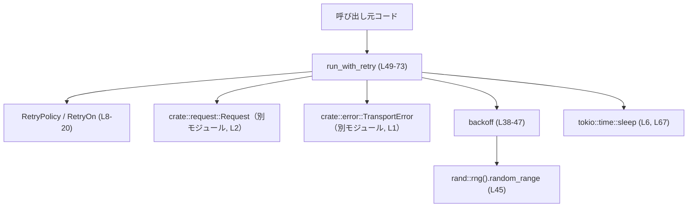

# codex-client/src/retry.rs

## 0. ざっくり一言

非同期処理のための **リトライポリシー定義** と、指数バックオフ＋ジッター付きで `TransportError` を再試行する **共通ヘルパー（`run_with_retry`）** を提供するモジュールです（`codex-client/src/retry.rs:L8-20, L38-73`）。

---

## 1. このモジュールの役割

### 1.1 概要

- このモジュールは、`TransportError` を返す非同期処理に対して、**何回まで・どのエラーで再試行するか** を表す設定（`RetryPolicy`, `RetryOn`）と、  
  その設定に従って処理を自動的に再実行する `run_with_retry` を提供します（`L8-20, L49-73`）。
- 遅延時間は `backoff` 関数で計算され、**指数バックオフ＋ランダムジッター** によって、集中リトライを避ける設計になっています（`L38-47`）。

### 1.2 アーキテクチャ内での位置づけ

このファイルが他コンポーネントとどう関係するかを簡略化して図示します。



- `run_with_retry` は呼び出し元から **ポリシー**・**リクエスト生成クロージャ**・**実際の処理クロージャ** を受け取り、リトライ制御を行います（`L49-56`）。
- エラー型 `TransportError` とリクエスト型 `Request` は別モジュール（`crate::error`, `crate::request`）で定義されており、このチャンクには詳細が現れません（`L1-2`）。
- 時間待ちには Tokio の `sleep` を利用しており、Tokio ランタイム上で動くことが前提と考えられます（`L6, L67`）。

### 1.3 設計上のポイント

- **設定の分離**
  - リトライの回数／ベース遅延／どのエラーを再試行対象にするかを `RetryPolicy` と `RetryOn` に分離しています（`L8-20`）。
- **エラー種別ごとの制御**
  - HTTP ステータス（429/5xx）と、タイムアウト・ネットワーク系エラーについて、個別のフラグで再試行するかどうかを切り替えます（`L16-20, L27-33`）。
- **状態を持たないロジック**
  - `RetryPolicy` 自体は単なる設定値の構造体であり、内部状態を持たず、`run_with_retry` のループ内でのみ消費されます（`L8-13, L49-73`）。
- **エラーハンドリング方針**
  - エラー発生時に `RetryOn::should_retry` で再試行可否を判定し、再試行しないと判断されたら即座にそのエラーを呼び出し元に返却します（`L22-35, L60-66, L69`）。
- **非同期・並行性**
  - リトライ待ちを `tokio::time::sleep` で行うことで、スレッドをブロックせずに待機します（`L6, L67`）。
  - このモジュール自身は `Send` / `Sync` などのトレイト境界を追加しておらず、どのようなスレッドモデルで使うかは呼び出し側に委ねられています（`L49-56`）。

---

## 2. 主要な機能一覧

- `RetryPolicy` によるリトライ設定の保持（最大試行回数・ベース遅延・対象エラー）（`L8-13`）
- `RetryOn` による「どの種類のエラーを再試行するか」の判定ロジック（`L16-20, L22-35`）
- `backoff` による指数バックオフ＋ジッター付きの待ち時間計算（`L38-47`）
- `run_with_retry` による非同期処理の自動リトライ実行（`L49-73`）

---

## 3. 公開 API と詳細解説

### 3.1 型一覧（構造体）

| 名前 | 種別 | 公開 | 役割 / 用途 | 主なフィールド | 定義位置 |
|------|------|------|-------------|----------------|----------|
| `RetryPolicy` | 構造体 | `pub` | リトライの最大回数・ベース遅延・対象エラー種別をまとめたポリシー | `max_attempts: u64`, `base_delay: Duration`, `retry_on: RetryOn` | `codex-client/src/retry.rs:L8-13` |
| `RetryOn` | 構造体 | `pub` | どの種類の `TransportError` を再試行対象とするかをブール値で指定する設定 | `retry_429: bool`, `retry_5xx: bool`, `retry_transport: bool` | `codex-client/src/retry.rs:L15-20` |

両方の構造体には `Debug` と `Clone` が自動導出されています（`L8, L15`）。

#### 関数・メソッド一覧（コンポーネントインベントリー）

| 名前 | 種別 | 概要 | 定義位置 |
|------|------|------|----------|
| `RetryOn::should_retry` | メソッド | エラー種別・試行回数・最大回数に基づいて、再試行すべきかを判定する | `codex-client/src/retry.rs:L22-35` |
| `backoff` | 関数 | ベース遅延と試行回数から指数バックオフ＋ジッター付きの待機時間を計算する | `codex-client/src/retry.rs:L38-47` |
| `run_with_retry` | 非同期関数 | ポリシーとクロージャを受け取り、`TransportError` が発生した場合に自動的にリトライする | `codex-client/src/retry.rs:L49-73` |

---

### 3.2 関数詳細

#### `RetryOn::should_retry(&self, err: &TransportError, attempt: u64, max_attempts: u64) -> bool`

**概要**

- 現在の試行回数 `attempt` と全体の上限 `max_attempts`、およびエラー内容 `err` と `RetryOn` の設定に基づいて、**もう一度リトライするかどうか** を返します（`L22-35`）。

**引数**

| 引数名 | 型 | 説明 |
|--------|----|------|
| `self` | `&RetryOn` | 再試行対象のフラグを保持する設定（`retry_429` / `retry_5xx` / `retry_transport`）（`L16-20`） |
| `err` | `&TransportError` | 発生したエラー。HTTP ステータス・タイムアウト・ネットワークエラー等を含みます（`L23, L27-33`）。 |
| `attempt` | `u64` | 0 始まりの現在の試行回数。`run_with_retry` から渡されます（`L23, L58-60`）。 |
| `max_attempts` | `u64` | 許容される最大試行回数。`RetryPolicy.max_attempts` が渡されています（`L23, L50, L65`）。 |

**戻り値**

- `bool` — `true` の場合は **再試行を行うべき**、`false` の場合は再試行せずエラーを呼び出し元へ返します（`L23, L60-66, L69`）。

**内部処理の流れ**

1. `attempt >= max_attempts` の場合は、上限に達したため **無条件で `false` を返す**（`L24-26`）。
2. そうでなければ `TransportError` のバリアントに応じて `match` します（`L27`）。
3. `TransportError::Http { status, .. }` の場合（`L28`）:
   - `retry_429` が `true` かつ `status.as_u16() == 429` なら `true`（`L29`）。
   - または `retry_5xx` が `true` かつ `status.is_server_error()`（通常は 5xx）なら `true`（`L30`）。
4. `TransportError::Timeout` または `TransportError::Network(_)` の場合は、`retry_transport` の値をそのまま返します（`L32`）。
5. それ以外のエラー（`_`）はすべて再試行せず、`false` を返します（`L33`）。

**Examples（使用例）**

HTTP 429 とネットワークエラーについての挙動例です（`TransportError` の詳細定義はこのチャンクには現れません）。

```rust
use std::time::Duration;
use crate::error::TransportError;
use crate::retry::{RetryOn, RetryPolicy}; // retry.rs と同じクレート内を想定

fn should_retry_examples(err: TransportError, attempt: u64) -> bool {
    // HTTP 429 と 5xx、タイムアウト/ネットワークをすべて再試行対象にする設定（L16-20）
    let retry_on = RetryOn {
        retry_429: true,
        retry_5xx: true,
        retry_transport: true,
    };

    // 通常は RetryPolicy.max_attempts を渡す（L50, L65）
    let policy = RetryPolicy {
        max_attempts: 3,
        base_delay: Duration::from_millis(100),
        retry_on,
    };

    // 実際には run_with_retry 内部から呼ばれるのと同等の使い方（L62-65）
    policy.retry_on.should_retry(&err, attempt, policy.max_attempts)
}
```

**Errors / Panics**

- 戻り値は `bool` であり、`Result` ではありません。
- 関数内部では、明示的な `panic!` や `unwrap` などは使用していません（`L22-35`）。
- `status.as_u16()` や `status.is_server_error()` がパニックを起こすかどうかは、`TransportError::Http` の `status` 型の実装に依存しており、このチャンクからは分かりません（`L28-30`）。

**Edge cases（エッジケース）**

- `attempt >= max_attempts` のとき
  - 即座に `false` を返し、再試行しないことが保証されます（`L24-26`）。
- HTTP 429 以外の 4xx
  - `status.as_u16() == 429` にしか反応しないため、他の 4xx は `retry_5xx` の設定に関わらず再試行対象外になります（`L29-30`）。
- HTTP 5xx 以外のステータス
  - `status.is_server_error()` が `false` の場合（多くの 2xx, 3xx, 4xx）は再試行されません（`L30`）。
- `TransportError::Timeout` / `TransportError::Network(_)` 以外のバリアント
  - `_ => false` にマッチし、常に再試行されません（`L33`）。

**使用上の注意点**

- `max_attempts` の値は呼び出し元が一貫して使用する必要があります。
  - `run_with_retry` からは `policy.max_attempts` をそのまま渡しています（`L65`）。
- 新しい `TransportError` のバリアントが追加された場合、この関数の `match` を更新しない限り、デフォルトで再試行されません（`L33`）。
- `attempt` は 0 始まりであることが前提ですが、その前提は `run_with_retry` のループ仕様に依存しています（`L58`）。

---

#### `backoff(base: Duration, attempt: u64) -> Duration`

**概要**

- ベース遅延 `base` と試行回数 `attempt` から、**指数的に増加する待機時間** を計算し、さらに 0.9〜1.1 倍のランダムジッターをかけた `Duration` を返します（`L38-47`）。

**引数**

| 引数名 | 型 | 説明 |
|--------|----|------|
| `base` | `Duration` | ベースとなる遅延時間（ミリ秒換算して利用）（`L38, L43`）。 |
| `attempt` | `u64` | 0 から始まる試行回数。`run_with_retry` からは `attempt + 1` が渡されます（`L49, L67`）。 |

**戻り値**

- `Duration` — 計算された待機時間。指数バックオフとジッターが考慮されます（`L46`）。

**内部処理の流れ**

1. `attempt == 0` の場合は指数増加を行わず、単純に `base` を返します（`L39-40`）。
2. それ以外の場合、
   - `exp = 2u64.saturating_pow(attempt as u32 - 1)` で指数部分（2 の n 乗）を計算します（`L42`）。
   - `millis = base.as_millis() as u64` でベース遅延をミリ秒単位の `u64` に変換します（`L43`）。
   - `raw = millis.saturating_mul(exp)` で指数を掛け合わせ、オーバーフロー時には飽和します（`L44`）。
3. `rand::rng().random_range(0.9..1.1)` により 0.9〜1.1 の範囲の `f64` ジッターを取得します（`L45`）。
4. `raw` にジッターを掛け、`Duration::from_millis` で `Duration` に変換して返します（`L46`）。

**Examples（使用例）**

```rust
use std::time::Duration;
use crate::retry::backoff;

// ベース 100ms、3 回目の試行（attempt = 3）とした場合の待ち時間の例（L38-47）
fn example_backoff() {
    let base = Duration::from_millis(100);
    let attempt = 3;

    let delay = backoff(base, attempt); // 約 100 * 2^(3-1) * [0.9, 1.1] ms ≒ 400ms 前後

    println!("delay (ms) = {}", delay.as_millis());
}
```

**Errors / Panics**

- この関数は常に `Duration` を返し、`Result` や `Option` を返しません（`L38-47`）。
- 内部で使用している算術演算には飽和演算（`saturating_pow`, `saturating_mul`）を使っているため、整数オーバーフローによるパニックは避けられています（`L42, L44`）。
- `Duration::from_millis` は `u64` を受け取るため、引数自体でパニックはしません（`L46`）。
- `rand::rng().random_range` の振る舞い（例: 範囲指定誤りでのパニック等）は `rand` クレートの実装に依存しており、このチャンクからは詳細不明です（`L45`）。

**Edge cases（エッジケース）**

- `attempt == 0`
  - 分岐で早期に `base` をそのまま返します（`L39-40`）。
- `base` が 0 の場合
  - `base.as_millis()` が 0 になるため、どの `attempt` でも結果は 0ms の `Duration` になります（`L43-46`）。
- `attempt` が非常に大きい場合
  - `saturating_pow` と `saturating_mul` により、`raw` は `u64::MAX` に飽和します（`L42, L44`）。
  - ジッター適用後に `Duration::from_millis` へ渡されますが、極端に大きな待ち時間になる可能性があります（`L46`）。

**使用上の注意点**

- `run_with_retry` からは `attempt + 1` が渡されているため、1 回目の再試行で指数部が `2^(1-1) = 1` となり、2 回目以降から指数的に増えていきます（`L42, L67`）。
- 飽和計算により極端なオーバーフローは防がれていますが、`max_attempts` を過大に設定すると非常に長い待ち時間が生成される可能性があります。

---

#### `run_with_retry<T, F, Fut>(policy: RetryPolicy, mut make_req: impl FnMut() -> Request, op: F) -> Result<T, TransportError>`

**概要**

- 与えられた `RetryPolicy` と 2 つのクロージャ（リクエスト生成 `make_req` / 実処理 `op`）を使って、**`TransportError` が発生した場合に自動的にリトライする非同期関数**です（`L49-56`）。
- リトライするかどうかは `RetryOn::should_retry` と試行回数に基づいて判定され、リトライ間の待ち時間は `backoff` で計算されて `tokio::time::sleep` に渡されます（`L62-67`）。

**引数**

| 引数名 | 型 | 説明 |
|--------|----|------|
| `policy` | `RetryPolicy` | 最大試行回数・ベース遅延・対象エラー種別を含むポリシー（`L49-51, L8-13`）。 |
| `make_req` | `impl FnMut() -> Request` | 毎回の試行で新しい `Request` を生成するクロージャ。所有権を再利用するために `FnMut` になっています（`L50-51, L59`）。 |
| `op` | `F` (`where F: Fn(Request, u64) -> Fut`) | `Request` と試行回数 `attempt` を受け取り、`Future<Output = Result<T, TransportError>>` を返す非同期処理クロージャ（`L52-56`）。 |

**戻り値**

- `Result<T, TransportError>` — 成功時は `T` を含む `Ok(T)`、失敗時は最終的な `TransportError` を含む `Err` を返します（`L53, L61, L69, L72`）。
  - コード上は `Err(TransportError::RetryLimit)` を返す経路もありますが、実際の制御フローから見るとこの行は到達しません（`L71-72`、理由は後述）。

**内部処理の流れ**

1. `for attempt in 0..=policy.max_attempts` で 0 から `max_attempts` まで（両端含む）のループを回します（`L58`）。
2. 各ループで `make_req()` を呼び、`Request` を生成します（`L59`）。
3. `op(req, attempt).await` を呼び出し、非同期処理の結果を待ちます（`L60`）。
4. 結果に応じて `match` します（`L60-70`）:
   - `Ok(resp)` の場合は、即座に `Ok(resp)` を返します（`L61`）。
   - `Err(err)` であり、かつ `policy.retry_on.should_retry(&err, attempt, policy.max_attempts)` が `true` の場合（`L62-65`）:
     - `backoff(policy.base_delay, attempt + 1)` で遅延時間を計算し、`sleep` で非同期に待機してから次のループに進みます（`L67`）。
   - 上記以外の `Err(err)` の場合は、即座に `Err(err)` を返します（`L69`）。
5. `for` ループの外で `Err(TransportError::RetryLimit)` を返していますが（`L71-72`）、実際には `for` ループの中で `Ok(...)` または `Err(...)` によって必ず `return` されるため、この行に制御が到達するケースはありません。

**Examples（使用例）**

以下は、簡略化した擬似コードによる `run_with_retry` の典型的な利用例です。  
`Request` と `TransportError` の具体的な定義はこのチャンクには現れないため、詳細な生成処理は省略しています。

```rust
use std::time::Duration;
use crate::error::TransportError;
use crate::request::Request;
use crate::retry::{RetryPolicy, RetryOn, run_with_retry};

// 非同期で Request を送信する擬似的な関数
async fn send_request(req: Request, _attempt: u64) -> Result<String, TransportError> {
    // 実際にはここでネットワーク I/O を行い、TransportError を返す
    Ok("ok".to_string())
}

async fn example_run_with_retry() -> Result<String, TransportError> {
    let policy = RetryPolicy {                   // リトライポリシーの設定（L8-13）
        max_attempts: 3,                        // 最大 3 回まで試行
        base_delay: Duration::from_millis(100), // 初回リトライ 100ms
        retry_on: RetryOn {                     // リトライ対象とするエラー種別（L16-20）
            retry_429: true,
            retry_5xx: true,
            retry_transport: true,
        },
    };

    // Request を生成するクロージャ（毎回新しい Request を返す）（L50-51, L59）
    let make_req = || -> Request {
        // Request の具体的な作り方はこのチャンクには現れません
        unimplemented!()
    };

    // 実処理クロージャ（L52-56）
    let op = |req: Request, attempt: u64| async move {
        println!("attempt = {}", attempt);
        send_request(req, attempt).await
    };

    // リトライ付きで非同期処理を実行（L49-73）
    run_with_retry(policy, make_req, op).await
}
```

**Errors / Panics**

- **戻り値の `Err`**:
  - `op` が返した `Err(err)` で、`RetryOn::should_retry` が `false` を返した場合、その `err` がそのまま返却されます（`L60-66, L69`）。
  - コード上は `Err(TransportError::RetryLimit)` も返すように書かれていますが（`L71-72`）、前述の通り制御フロー上到達しません。
- **パニックの可能性**:
  - `make_req` や `op` が内部で `panic!` する可能性がありますが、`run_with_retry` はそれを捕捉していません。
    - その場合、パニックは呼び出し元（およびランタイム）に伝播します（このチャンクでは `catch_unwind` 等を使用していないため、抑止されません（`L49-73`））。
- **非同期ランタイム依存**:
  - `tokio::time::sleep` を利用しているため、Tokio ランタイム上で実行されることが前提です（`L6, L67`）。
  - 他のランタイム（例えば async-std）のみを使う環境では、そのままでは動作しない可能性があります。

**Edge cases（エッジケース）**

- `max_attempts == 0`
  - ループは `attempt = 0` の 1 回だけ実行されます（`L58`）。
  - `should_retry` は `attempt >= max_attempts` により必ず `false` を返すため（`L24-26`）、エラーが発生した場合は即座に `Err(err)` が返され、**リトライは行われません**。
- すべての試行が再試行対象エラーを返し続けた場合
  - `attempt` が増加していき、`attempt >= max_attempts` となった時点で `should_retry` が `false` を返します（`L24-26`）。
  - その最後の試行でのエラーが `Err(err)` として呼び出し元に返り、`TransportError::RetryLimit` にはなりません（`L69`）。
- `make_req` が副作用を持つ場合
  - 各試行で必ず `make_req()` が呼ばれるため（`L59`）、副作用（ログ出力・カウンタ増加など）は試行回数分だけ発生します。

**使用上の注意点**

- `backoff` の待機時間は指数的に増加するため、`max_attempts` や `base_delay` を大きく設定すると、合計待機時間が非常に長くなる可能性があります（`L42-46, L67`）。
- `run_with_retry` 自体は `Send` などの境界を課していないため、返り値 `T` やクロージャ `F` がどのようなスレッドセーフ性を持つかは呼び出し元の設計に依存します（`L49-56`）。
- テストコードはこのファイルには含まれていないため（`L1-73`）、実際の利用箇所や上位モジュール側でのテストによって期待動作を確認する必要があります。

---

### 3.3 その他の関数

- このファイルの関数はすべて前述の 3 つであり、それ以外の補助関数・ラッパー関数は定義されていません（`L22-47, L49-73`）。

---

## 4. データフロー

代表的なシナリオとして、`run_with_retry` がエラーを受け取り、一定回数リトライした後に成功する流れを示します。

```mermaid
sequenceDiagram
    participant C as 呼び出し元
    participant R as run_with_retry (L49-73)
    participant M as make_req クロージャ (L50-51, L59)
    participant O as op クロージャ (L52-56, L60)
    participant RO as RetryOn::should_retry (L22-35)
    participant B as backoff (L38-47)
    participant S as tokio::time::sleep (L6, L67)

    C->>R: run_with_retry(policy, make_req, op).await
    loop attempt = 0..=max_attempts (L58)
        R->>M: make_req()（Request 生成, L59）
        M-->>R: Request
        R->>O: op(req, attempt).await（L60）
        alt Ok(resp)（L61）
            O-->>R: Ok(resp)
            R-->>C: Ok(resp)
            break
        else Err(err)（L62-63）
            O-->>R: Err(err)
            R->>RO: should_retry(&err, attempt, max_attempts)（L62-65）
            alt true
                RO-->>R: true
                R->>B: backoff(base_delay, attempt + 1)（L67）
                B-->>R: Duration
                R->>S: sleep(Duration).await（L67）
                S-->>R: ()
            else false
                RO-->>R: false
                R-->>C: Err(err)（L69）
                break
            end
        end
    end
```

- データの流れとしては、`Request` は毎試行ごとに `make_req` から生成され、`op` に渡されます（`L59-60`）。
- エラーが発生した場合には `RetryOn` が再試行可否を決め、`backoff` が遅延時間を決め、`sleep` が実際の待機を行います（`L62-67`）。

---

## 5. 使い方（How to Use）

### 5.1 基本的な使用方法

典型的な利用フローは次のようになります。

1. `RetryOn` と `RetryPolicy` を構築する（`L8-20`）。
2. `Request` を生成するためのクロージャ `make_req` を定義する（`L50-51`）。
3. 実処理 `op` を非同期クロージャとして定義する（`L52-56`）。
4. `run_with_retry` を `await` して結果を受け取る（`L49-53`）。

```rust
use std::time::Duration;
use crate::error::TransportError;
use crate::request::Request;
use crate::retry::{RetryPolicy, RetryOn, run_with_retry};

async fn basic_usage() -> Result<(), TransportError> {
    let policy = RetryPolicy {
        max_attempts: 5,
        base_delay: Duration::from_millis(200),
        retry_on: RetryOn {
            retry_429: true,        // HTTP 429 を再試行する（L29）
            retry_5xx: true,        // HTTP 5xx を再試行する（L30）
            retry_transport: true,  // タイムアウトやネットワークエラーを再試行する（L32）
        },
    };

    let make_req = || -> Request {
        // Request の具体的な作成方法はこのチャンクには現れません
        unimplemented!()
    };

    let op = |req: Request, attempt: u64| async move {
        println!("attempt = {}", attempt);
        // ここで実際の I/O を行い、TransportError を返す可能性がある
        unimplemented!()
    };

    let result = run_with_retry(policy, make_req, op).await?;

    println!("success: {:?}", result);
    Ok(())
}
```

### 5.2 よくある使用パターン

- **HTTP 系 API 呼び出しのリトライ**
  - `TransportError::Http { .. }` の 5xx と 429 のみを再試行対象にし、それ以外の 4xx は即時失敗とする（`L28-30`）。
- **ネットワーク不安定時のリトライ**
  - `retry_transport` を `true` にし、タイムアウトやネットワークエラーに対して再試行する（`L32`）。
- **軽量な操作の短回数リトライ**
  - `max_attempts` を小さく、`base_delay` を短く設定して、素早く数回だけ再試行する（`L8-13, L42`）。

### 5.3 よくある間違い

```rust
use crate::retry::{RetryPolicy, RetryOn, run_with_retry};
use crate::request::Request;
use crate::error::TransportError;

// 間違い例: Request をクロージャ外で 1 度だけ作り回してしまう
async fn wrong_usage() -> Result<(), TransportError> {
    let policy = /* ... */ unimplemented!();
    let req = /* ... */ unimplemented!(); // 1 度だけ作る

    let make_req = || -> Request {
        // ここで req をクローンせずにムーブしようとするとコンパイルエラーになる可能性
        // Request の所有権モデル次第（このチャンクには現れません）
        unimplemented!()
    };

    let op = |req: Request, attempt: u64| async move {
        // ...
        unimplemented!()
    };

    let _ = run_with_retry(policy, make_req, op).await?;
    Ok(())
}

// 正しい例: 毎回の試行で新しい Request を作成する
async fn correct_usage() -> Result<(), TransportError> {
    let policy = /* ... */ unimplemented!();

    let make_req = || -> Request {
        // 各試行ごとに新しい Request を構築する（L59）
        unimplemented!()
    };

    let op = |req: Request, attempt: u64| async move {
        // ...
        unimplemented!()
    };

    let _ = run_with_retry(policy, make_req, op).await?;
    Ok(())
}
```

### 5.4 使用上の注意点（まとめ）

- `run_with_retry` は **Tokio ランタイムに依存** しています（`tokio::time::sleep` の利用, `L6, L67`）。
- リトライ上限に達した場合でも、最後の試行で発生した `TransportError` がそのまま返る設計であり、`RetryLimit` はコード上定義されていますが実際には使われません（`L24-26, L69-72`）。
- ログ出力やメトリクス送出などの **観測性（Observability）** に関する処理はこのモジュールには含まれていません（`L1-73`）。
  - リトライ回数や失敗理由を観測したい場合は、`op` 内でログを出す、あるいは `run_with_retry` をラップする側で計測を行う必要があります。

---

## 6. 変更の仕方（How to Modify）

### 6.1 新しい機能を追加する場合

例: 新しいエラー種別をリトライ対象に追加したい場合。

1. `TransportError` に新しいバリアントを追加する（このチャンクには `TransportError` の定義は現れませんが、`crate::error` 側に存在します）（`L1`）。
2. `RetryOn` に対応するブールフラグを追加する（`L16-20` に倣う）。
3. `RetryOn::should_retry` の `match` に新しいバリアントのパターンを追加し、フラグに応じて `true` / `false` を返す（`L27-33`）。
4. 必要であれば `RetryPolicy` を構築する箇所（このチャンク外）で新しいフラグを設定する。

### 6.2 既存の機能を変更する場合

- **最大試行回数の意味を変えたい場合**
  - 現在は `attempt >= max_attempts` で再試行を打ち切っています（`L24-26`）。
  - `for attempt in 0..=policy.max_attempts` というループ定義との組み合わせで、実際には `max_attempts + 1` 回の試行が行われ、最後の試行に対しては `should_retry` が常に `false` になります（`L58`）。
  - 真に「最大試行回数」を表現したい場合は、`for attempt in 0..policy.max_attempts` にするなど、ループと判定ロジックのどちらかを変更する必要があります。
- **バックオフ戦略を変えたい場合**
  - `backoff` 関数内の指数計算とジッターの適用部分（`L42-46`）を修正します。
  - 変更後は `run_with_retry` からは `backoff` の結果をそのまま利用しているだけなので（`L67`）、他の部分への影響は限定的です。
- 変更後には、`run_with_retry` を利用する上位レイヤのテストコード（このチャンクには現れません）を更新・追加して、期待通りのリトライ回数や待ち時間になることを確認する必要があります。

---

## 7. 関連ファイル

このチャンクから依存関係として確認できるファイル・モジュールは以下の通りです。

| パス / モジュール | 役割 / 関係 |
|------------------|------------|
| `crate::error::TransportError` | リトライ対象となるエラー型。HTTP ステータス付きの `Http`、`Timeout`、`Network(_)`、`RetryLimit` などのバリアントが存在することが `match` や戻り値から読み取れます（`codex-client/src/retry.rs:L1, L27-33, L72`）。このチャンクには定義本体は現れません。 |
| `crate::request::Request` | リトライ対象処理に渡されるリクエスト型。`make_req` クロージャから生成され、`op` に渡されます（`codex-client/src/retry.rs:L2, L50-51, L59-60`）。このチャンクには定義本体は現れません。 |
| `tokio::time::sleep` | 非同期の待機を行う外部クレート関数。指数バックオフで計算した遅延時間を渡して使用します（`codex-client/src/retry.rs:L6, L67`）。 |
| `rand::Rng` / `rand::rng()` | バックオフ時間にジッターを与えるための乱数生成に使用されます（`codex-client/src/retry.rs:L3, L45`）。 |

このファイル自体にはテストコードやサポート用ユーティリティは含まれておらず、リトライロジックのコア実装のみが定義されています（`L1-73`）。
