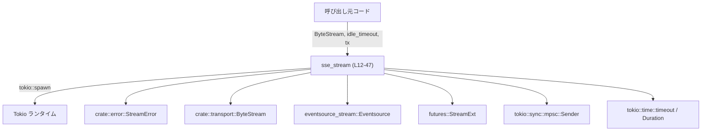
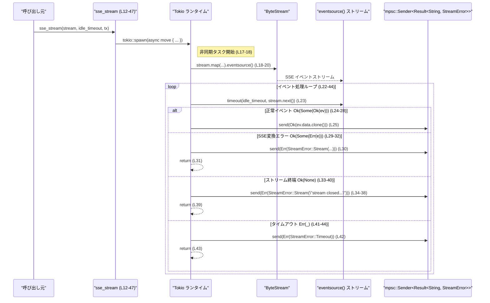

# codex-client/src/sse.rs

## 0. ざっくり一言

- SSE（Server-Sent Events）の `data:` フレームを UTF-8 文字列として読み取り、`mpsc::Sender` で別タスクへ転送するための最小ヘルパーです（`sse_stream` 関数, `sse.rs:L9-16`）。
- ストリームのエラー・終了・アイドルタイムアウトは `StreamError` に包んで送信し、その後バックグラウンドタスクを終了します（`sse.rs:L23-44`）。

---

## 1. このモジュールの役割

### 1.1 概要

- このモジュールは **バイト列ストリームの SSE イベント化と、`data` フィールドの文字列転送** を行います。
- 呼び出し側が持つ `mpsc::Sender<Result<String, StreamError>>` へ、SSE `data` を `Ok(String)` として送り、異常系を `Err(StreamError)` として通知します（`sse.rs:L12-16, L23-44`）。
- 実際の処理は `tokio::spawn` された非同期タスク内で実行され、関数呼び出し自体は即時に戻ります（`sse.rs:L17-18`）。

### 1.2 アーキテクチャ内での位置づけ

このモジュールが他コンポーネントとどのように関係しているかを示した図です。



- `ByteStream` から非同期にバイト列を受け取り、`eventsource_stream::Eventsource` トレイトの `eventsource()` 拡張で SSE イベントストリームに変換しています（`sse.rs:L18-20`）。
- `mpsc::Sender` を通じて結果を呼び出し側に渡します（`sse.rs:L25, L30, L34-38, L42`）。

### 1.3 設計上のポイント

- **責務の分離**  
  - この関数は「SSE ストリーム → `Result<String, StreamError>` のストリーム変換」に限定されています。上位の HTTP 通信や ByteStream の生成は別モジュールに任されています（`sse.rs:L12-16`）。
- **状態管理**  
  - 自前の状態構造体は持たず、`stream` と `tx` をローカル変数として非同期タスクにムーブし、ループ内で逐次処理します（`sse.rs:L17-22`）。
- **エラーハンドリング方針**  
  - 下位ストリームのエラー、SSE 変換のエラー、ストリームの終了、アイドルタイムアウトをすべて `StreamError` に集約し、1 回送信した上でタスクを終了します（`sse.rs:L23-44`）。
- **並行性**  
  - `tokio::spawn` で別タスクとして実行し、呼び出し元とは非同期に動作します（`sse.rs:L17`）。
  - 外部との共有は `mpsc::Sender` 経由のみで、共有可変状態はありません（`sse.rs:L15, L25, L30, L34-38, L42`）。

---

## 2. 主要な機能一覧

- SSE ストリーム起動: `sse_stream`  
  バイトストリームから SSE イベントを読み、`data` フィールドを `String` としてチャネルに送信しつつ、エラーやタイムアウトを `StreamError` として通知します（`sse.rs:L9-16, L23-44`）。

---

## 3. 公開 API と詳細解説

### 3.1 型・関数インベントリー（このチャンク）

| 名前 | 種別 | 公開範囲 | 役割 / 用途 | 根拠 |
|------|------|----------|------------|------|
| `sse_stream` | 関数 | `pub` | ByteStream を SSE として読み、`mpsc::Sender` に `Result<String, StreamError>` を送る非同期タスクを起動する | `sse.rs:L9-16, L17-47` |
| `StreamError` | 型（詳細不明） | 外部モジュール | ストリーム関連のエラーを表すエラー型として使用される | `sse.rs:L1, L15, L19, L30, L35-37, L42` |
| `ByteStream` | 型（詳細不明） | 外部モジュール | SSE に変換される元の非同期バイトストリーム | `sse.rs:L2, L13, L18-20` |
| `mpsc::Sender<Result<String, StreamError>>` | 型 | 外部モジュール | SSE の `data` 文字列または `StreamError` を呼び出し元に伝えるチャネル送信側 | `sse.rs:L5, L15, L25, L30, L34-38, L42` |
| `Eventsource` | トレイト | 外部クレート | ストリームに対して `.eventsource()` メソッドを提供し、SSE イベントストリームに変換 | `sse.rs:L3, L18-20` |

> `StreamError` や `ByteStream` の具体的な定義・フィールドは、このチャンクには現れません。

### 3.2 関数詳細

#### `sse_stream(stream: ByteStream, idle_timeout: Duration, tx: mpsc::Sender<Result<String, StreamError>>)`

**概要**

- 与えられた `ByteStream` を SSE イベントストリームとして処理し、各イベントの `data` 部分を UTF-8 文字列として `tx` に `Ok(String)` で送信します（`sse.rs:L9-11, L23-26`）。
- ストリームエラー・SSE パースエラー・ストリーム終了・一定時間の無通信（アイドルタイムアウト）が発生した場合は、対応する `StreamError` を `Err` として 1 回送信し、バックグラウンドタスクを終了します（`sse.rs:L23-44`）。
- 関数自体は `tokio::spawn` により新たな非同期タスクを起動するだけで、即時に `()` を返します（`sse.rs:L17, L47-48`）。

**引数**

| 引数名 | 型 | 説明 | 根拠 |
|--------|----|------|------|
| `stream` | `ByteStream` | SSE に変換される元のバイトストリーム。`StreamExt::map` と `Eventsource::eventsource` によって加工されます。 | `sse.rs:L13, L18-20` |
| `idle_timeout` | `Duration` | 1 イベントを待つ最大時間。これを超えるとタイムアウトエラーとみなして `StreamError::Timeout` を送信します。 | `sse.rs:L14, L23, L41-43` |
| `tx` | `mpsc::Sender<Result<String, StreamError>>` | SSE `data` 文字列およびエラーを送るための Tokio MPSC チャネル送信側。クローンされずにタスクにムーブされます。 | `sse.rs:L15, L17, L25, L30, L34-38, L42` |

**戻り値**

- 戻り値の型は `()` です（シグネチャに戻り値記述なし、`sse.rs:L12-16`）。
- 呼び出し時点でのエラーは返さず、すべて非同期タスク内から `tx` を通じて通知します。

**内部処理の流れ（アルゴリズム）**

1. **非同期タスクの起動**  
   - `tokio::spawn(async move { ... })` で新しいタスクを起動し、`stream` と `tx` をムーブします（`sse.rs:L17-18`）。
2. **ストリームのエラーマッピングと SSE ラップ**  
   - 元の `stream` に対して `map` を適用し、内部エラーを `StreamError::Stream(e.to_string())` に変換します（`sse.rs:L18-19`）。  
   - その後 `eventsource()` を呼び出し、SSE イベントストリームに変換します（`sse.rs:L20`）。
3. **無限ループでイベント処理**  
   - `loop { ... }` 内で、`timeout(idle_timeout, stream.next()).await` により次のイベントを待機します（`sse.rs:L22-23`）。
4. **正常な SSE イベント (`Ok(Some(Ok(ev)))`) の処理**  
   - イベントが正常に取得された場合、`ev.data.clone()` を `String` として `Ok(...)` でラップし、`tx.send(...).await` で送信します（`sse.rs:L24-26`）。
   - `send` が失敗（受信側が閉じている）した場合は `is_err()` が `true` となり、その時点でタスクを `return` で終了します（`sse.rs:L25-27`）。
5. **SSE パースエラー (`Ok(Some(Err(e)))`) の処理**  
   - SSE 変換時にエラーが出た場合、`StreamError::Stream(e.to_string())` を `Err` として送信しようとします（`sse.rs:L29-31`）。
   - 送信成否に関わらず、その直後に `return` でループとタスクを終了します（`sse.rs:L30-32`）。
6. **ストリーム終端 (`Ok(None)`) の処理**  
   - ストリームが `None` を返した場合、「完了前にストリームが閉じた」とみなし、固定メッセージ `"stream closed before completion"` を `StreamError::Stream` で包んで送信します（`sse.rs:L33-37`）。
   - その後、タスクを終了します（`sse.rs:L39-40`）。
7. **アイドルタイムアウト (`Err(_)`) の処理**  
   - `timeout` 自体が `Err` を返した場合（`idle_timeout` 経過）、`StreamError::Timeout` を送信し、その後タスクを終了します（`sse.rs:L41-43`）。

**処理フロー図**

`timeout` と分岐の流れを簡略化したフローです。

```mermaid
flowchart TD
    A["開始 (sse_stream タスク開始, L17-22)"]
    B["timeout(idle_timeout, stream.next()).await (L23)"]
    C["Ok(Some(Ok(ev))) (L24-28)"]
    D["Ok(Some(Err(e))) (L29-32)"]
    E["Ok(None) (L33-40)"]
    F["Err(_) （タイムアウト） (L41-44)"]
    G["tx.send(Ok(ev.data.clone())) (L25)"]
    H["tx.send(Err(StreamError::Stream(...))) (L30)"]
    I["tx.send(Err(StreamError::Stream(\"stream closed...\"))) (L34-38)"]
    J["tx.send(Err(StreamError::Timeout)) (L42)"]
    K["ループ継続 (L22-23)"]
    L["タスク終了 (return, L27,31,39,43)"]

    A --> B
    B --> C
    B --> D
    B --> E
    B --> F
    C --> G
    G -->|成功| K
    G -->|失敗| L
    D --> H --> L
    E --> I --> L
    F --> J --> L
```

**Examples（使用例）**

> 注意: `ByteStream` の定義はこのチャンクに含まれないため、以下のコードはそのままではコンパイルできません。`ByteStream` の生成部分は実際のプロジェクトの実装に合わせて置き換える必要があります。

```rust
use tokio::sync::mpsc;
use tokio::time::Duration;
use codex_client::transport::ByteStream;     // このモジュール名は use 宣言からの推定です（sse.rs:L2）
use codex_client::sse::sse_stream;          // 実際のパスはクレート構成に依存します
use codex_client::error::StreamError;       // use 宣言からの推定（sse.rs:L1）

#[tokio::main]
async fn main() {
    // ByteStream の生成方法はこのチャンクには現れません
    let byte_stream: ByteStream = unimplemented!("実際の ByteStream をここで生成する");

    // SSE メッセージ用のチャネルを用意（バッファサイズは例として 16）
    let (tx, mut rx) = mpsc::channel::<Result<String, StreamError>>(16);

    // SSE ストリーム処理タスクを起動
    sse_stream(byte_stream, Duration::from_secs(30), tx);

    // 受信ループ：Ok(String) を表示し、Err(StreamError) が来たら終了
    while let Some(msg) = rx.recv().await {
        match msg {
            Ok(data) => {
                println!("SSE data: {}", data); // 各イベントの data フィールド
            }
            Err(e) => {
                eprintln!("SSE stream error: {:?}", e);
                break; // エラー受信後はタスクも終了している想定
            }
        }
    }
}
```

**Errors / Panics**

- **`Result` 経由で通知される条件（tx 経由）**
  - 元の `ByteStream` が `Err(e)` を返した場合  
    → `StreamError::Stream(e.to_string())` として送信（`sse.rs:L18-19`）。
  - SSE パース (`eventsource()` による変換後) が `Err(e)` を返した場合  
    → `StreamError::Stream(e.to_string())` として送信（`sse.rs:L29-31`）。
  - ストリームが早期に終端 (`Ok(None)`) した場合  
    → メッセージ `"stream closed before completion"` を持つ `StreamError::Stream` を送信（`sse.rs:L33-38`）。
  - `idle_timeout` の間にイベントが届かず、`timeout` が `Err(_)` を返した場合  
    → `StreamError::Timeout` を送信（`sse.rs:L41-43`）。
- **`mpsc::Sender::send` のエラー**
  - 正常系 (`Ok(Some(Ok(ev)))`) のパスでは、`send` がエラーなら `return` でタスク終了します（`sse.rs:L25-27`）。
  - 異常系のパスでは、`let _ = tx.send(...).await;` とし、送信エラーを無視して `return` します（`sse.rs:L30-31, L34-40, L42-43`）。
- **パニックの可能性**
  - この関数内で明示的に `panic!` や `unwrap` は使用されていません（`sse.rs:1-48`）。
  - そのため、通常はパニックしない設計といえますが、外部クレートの内部でパニックが起きる可能性については、このチャンクからは判断できません。

**Edge cases（エッジケース）**

- **受信者がすぐにドロップされた場合**
  - `Ok(Some(Ok(ev)))` のパスで最初の `tx.send(...)` が `is_err()` を返し、即座にタスクが終了します（`sse.rs:L25-27`）。
  - エラー通知用の送信は試みられません（正常系で送っているため）。
- **ストリームが一度もイベントを返さずに `None` を返した場合**
  - 最初の `next()` が `Ok(None)` となり、「完了前にストリームが閉じた」という `StreamError::Stream` が送信されます（`sse.rs:L23, L33-38`）。
- **ストリームに長時間イベントが来ない場合**
  - `idle_timeout` を超えると `timeout` が `Err(_)` になり、`StreamError::Timeout` が送信されて終了します（`sse.rs:L23, L41-43`）。
- **ByteStream が連続してエラーを返す場合**
  - 最初のエラー時に `StreamError::Stream` を送信し、タスクを終了するため、複数回のエラーは通知されません（`sse.rs:L18-19, L29-31`）。
- **`tx` のバッファがいっぱいで受信側が遅い場合**
  - Tokio の `mpsc::Sender::send` はバッファが埋まると待機する挙動を持つため、タスクは `send().await` でブロックされます（Tokio の仕様による）。  
    この点はコードから直接は読めませんが、Tokio の一般仕様です。

**使用上の注意点**

- **非同期ランタイムの前提**
  - `tokio::spawn` を使用するため、Tokio ランタイム内で呼び出す必要があります（`sse.rs:L4-7, L17`）。
- **タスクのライフサイクル**
  - `sse_stream` は `JoinHandle` を返さないため、呼び出し側からタスクの終了を待つことやキャンセルすることはできません（`sse.rs:L17-18`）。  
    終了検知は受信側で `tx` 経由の `Err(StreamError)` を受け取ることで行う設計です。
- **`tx` の所有権**
  - `tx` は `async move` タスクにムーブされるため、呼び出し後は呼び出し元からは使用できません（`sse.rs:L15-18`）。  
    他の場所でも送信したい場合は、事前に `tx.clone()` して分配する必要があります。
- **エラー通知は 1 回のみ**
  - 何らかの異常が起きた時点で 1 回だけ `Err(StreamError)` を送信してタスクを終了するため、後続のエラー詳細は通知されません（`sse.rs:L29-31, L33-40, L41-43`）。
- **ストリーム終了を「エラー」と扱う点**
  - `Ok(None)` のケースでも `Err(StreamError::Stream("stream closed before completion"))` を送信しているため（`sse.rs:L33-38`）、  
    呼び出し側では「正常終了」と区別して扱う必要があります。

### 3.3 その他の関数

- このチャンクには `sse_stream` 以外の関数やメソッドは定義されていません（`sse.rs:1-48`）。

---

## 4. データフロー

この関数を通じて、データとエラーがどのように流れるかを示します。

1. 呼び出し元が `ByteStream`・`idle_timeout`・`mpsc::Sender` を `sse_stream` に渡す（`sse.rs:L12-16`）。
2. `sse_stream` は Tokio タスクを起動し、その内部で `ByteStream` を SSE イベントストリームに変換します（`sse.rs:L17-20`）。
3. タスクは `timeout(idle_timeout, stream.next())` でイベントまたはタイムアウトを待機します（`sse.rs:L23`）。
4. 取得したイベントの `data` フィールドを `String` として `tx` に送るか、エラー種別に応じて `StreamError` を `tx` に送って終了します（`sse.rs:L24-44`）。
5. 呼び出し元は `mpsc::Receiver<Result<String, StreamError>>` からメッセージを受信し続け、`Err` を受け取ったらストリーム終了と判断できます（受信側はこのチャンクには現れません）。



---

## 5. 使い方（How to Use）

### 5.1 基本的な使用方法

> 再掲ですが、`ByteStream` の生成方法はこのチャンクには定義がないため疑似コードになります。

```rust
use tokio::sync::mpsc;
use tokio::time::Duration;
use codex_client::transport::ByteStream;   // sse.rs:L2 の use からの推定
use codex_client::sse::sse_stream;
use codex_client::error::StreamError;

#[tokio::main]
async fn main() {
    // 実際の HTTP レスポンスなどから ByteStream を得る処理が必要
    let byte_stream: ByteStream = unimplemented!("プロジェクト固有の ByteStream 生成処理");

    // SSE イベント受信用チャネル（送信側は sse_stream に渡す）
    let (tx, mut rx) = mpsc::channel::<Result<String, StreamError>>(32);

    // SSE ストリーム処理をバックグラウンドタスクとして開始
    sse_stream(byte_stream, Duration::from_secs(20), tx);

    // 受信ループ
    while let Some(msg) = rx.recv().await {
        match msg {
            Ok(data) => {
                // SSE の data フィールド（UTF-8 文字列）が届く
                println!("SSE data: {}", data);
            }
            Err(err) => {
                // ストリーム終了・エラー・タイムアウトなど
                eprintln!("SSE stream terminated with error: {:?}", err);
                break;
            }
        }
    }
}
```

この例では:

- `Ok(String)` が連続して届く間は SSE イベントを処理し、
- 最終的に `Err(StreamError)` を受け取った時点でループを抜け、ストリーム終了と見なしています。

### 5.2 よくある使用パターン

1. **一定時間無通信でタイムアウトさせたい**  
   - `idle_timeout` に適切な値を渡すことで、サーバー側からのイベントが途絶えた際に自動的に `StreamError::Timeout` を受け取れます（`sse.rs:L14, L23, L41-43`）。
2. **チャネルを共有したい場合**
   - `tx` はタスクにムーブされるため、他タスクからも送信したい場合は、事前に `tx.clone()` してから `sse_stream` に渡す構成が考えられます（`sse.rs:L15, L17-18`）。  
   - ただし、このチャンクにはクローン利用例は現れません。

### 5.3 よくある間違いと正しい使い方

```rust
// 誤りの例: Receiver を作らずに sse_stream だけ呼ぶ
// これでは tx.send().await がブロックし続け、タスクがハングする可能性があります。
fn wrong_usage(byte_stream: ByteStream, idle_timeout: Duration, tx: mpsc::Sender<Result<String, StreamError>>) {
    sse_stream(byte_stream, idle_timeout, tx);
    // どこからも rx.recv().await されない
}

// 正しい例: Receiver を用意し、継続的に recv して backpressure を解消する
async fn correct_usage(byte_stream: ByteStream, idle_timeout: Duration) {
    let (tx, mut rx) = mpsc::channel::<Result<String, StreamError>>(16);
    sse_stream(byte_stream, idle_timeout, tx);

    // 受信ループでチャネルを消費する
    while let Some(item) = rx.recv().await {
        // ...
    }
}
```

> `mpsc::Sender::send` はバッファがいっぱいで受信側が読み取っていないと待機するため、Receiver を動かしておくことが重要です（Tokio の一般仕様）。

### 5.4 使用上の注意点（まとめ）

- Tokio ランタイム上で実行すること（`tokio::spawn`, `mpsc`, `timeout` を使用, `sse.rs:L4-7, L17`）。
- `tx` は `sse_stream` 内にムーブされるため、呼び出し後に同じ `Sender` から送信することはできません（`sse.rs:L15, L17-18`）。
- ストリーム終了 (`Ok(None)`) も `Err(StreamError)` として扱われるため、「通常終了」と「エラー終了」を区別したい場合は `StreamError` の中身を確認する必要があります（`sse.rs:L33-38`）。
- エラーや終了は 1 回通知されたらタスクが終了するため、その後にイベントが届くことはありません（`sse.rs:L29-31, L33-40, L41-43`）。

---

## 6. 変更の仕方（How to Modify）

### 6.1 新しい機能を追加する場合

- **SSE イベントのメタ情報を一緒に送りたい場合**
  - 現在は `ev.data.clone()` のみを送信しています（`sse.rs:L25`）。
  - `eventsource_stream` のイベント型 `ev` に他のフィールド（たとえば `event` 名や `id`）がある場合、それらを含む独自構造体を定義し、`Sender` の型を `Result<MyEvent, StreamError>` のように変更する、という拡張が考えられます。  
  - ただし、`ev` の全フィールドはこのチャンクには現れないため、具体的な項目は外部クレートのドキュメントを参照する必要があります。
- **再接続ロジックを入れたい場合**
  - 現在は何らかのエラーが起きると 1 回 `Err(StreamError)` を送ってタスクを終了します（`sse.rs:L29-31, L33-40, L41-43`）。
  - 自動再接続を実装するには、`loop` の外側に再接続制御を追加する、あるいは `Err` を送信せずに内部で再接続を試みるなど、エラー時の分岐を拡張する必要があります。

### 6.2 既存の機能を変更する場合の注意点

- **`idle_timeout` の意味変更**
  - 現在は「1 イベントを待つ最大時間」として実装されており、超過すると `StreamError::Timeout` が送信されます（`sse.rs:L23, L41-43`）。
  - 挙動を変える場合、呼び出し側で「アイドルタイムアウト＝エラー」という前提で使われているコードへの影響に注意が必要です。
- **ストリーム終端時の扱い**
  - `Ok(None)` を「正常終了」とみなすか「エラー」とみなすかは契約上重要です。今は後者として実装されています（`sse.rs:L33-38`）。
- **`StreamError` のバリアント**
  - このチャンクからは `StreamError::Stream` と `StreamError::Timeout` らしきバリアントの存在が読み取れます（`sse.rs:L19, L30, L35-37, L42`）。
  - これらの意味や他のバリアントの有無は `crate::error` 側の定義を確認する必要があります。

---

## 7. 関連ファイル・モジュール

| パス / モジュール | 役割 / 関係 | 根拠 |
|------------------|------------|------|
| `crate::error` | `StreamError` 型を提供し、本モジュールからストリームエラーの表現として使用される | `sse.rs:L1, L15, L19, L30, L35-37, L42` |
| `crate::transport` | `ByteStream` 型を提供し、SSE に変換される元のストリームを表す | `sse.rs:L2, L13, L18-20` |
| `eventsource_stream` クレート | `Eventsource` トレイトと `eventsource()` メソッドを提供し、バイトストリームを SSE イベントストリームに変換する | `sse.rs:L3, L18-20` |
| `futures` クレート | `StreamExt` を提供し、`map` や `next` などのストリーム拡張メソッドを使用 | `sse.rs:L4, L18-19, L23` |
| `tokio::sync::mpsc` | 非同期 MPSC チャネルを提供し、SSE データおよびエラーの送信に利用 | `sse.rs:L5, L15, L25, L30, L34-38, L42` |
| `tokio::time` | `Duration` と `timeout` を提供し、アイドルタイムアウトの実装に利用 | `sse.rs:L6-7, L14, L23, L41-43` |

> このチャンクにはテストコードは含まれていません。そのため、`sse_stream` の振る舞いを検証するテストは別ファイル（または未実装）の可能性があります。
