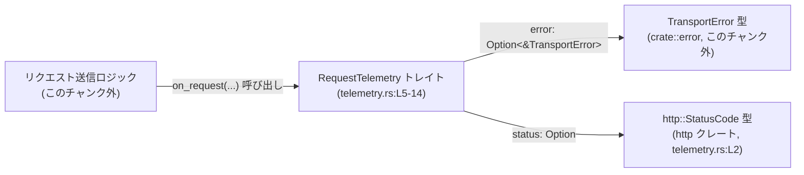
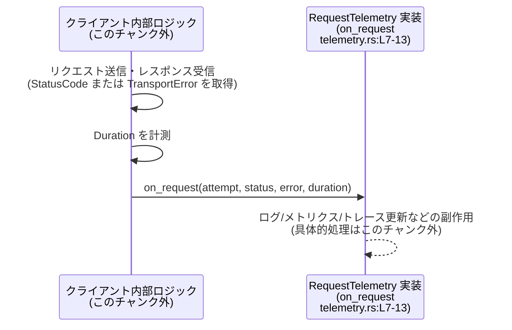

# codex-client/src/telemetry.rs

## 0. ざっくり一言

API リクエストごとのステータス・エラー・所要時間を通知するための **テレメトリ用トレイト `RequestTelemetry`** を定義するファイルです（telemetry.rs:L5-14）。

---

## 1. このモジュールの役割

### 1.1 概要

- このモジュールは、API リクエストの実行結果を外部に知らせるための **拡張ポイント（フック）** を提供します（telemetry.rs:L5-14）。
- 利用側は `RequestTelemetry` を実装することで、ログ出力・メトリクス送信・トレース連携など、任意のテレメトリ処理を注入できます。
- トレイトは `Send + Sync` 制約付きで公開されており、並行実行環境で安全に共有されることを前提とした設計になっています（telemetry.rs:L6）。

### 1.2 アーキテクチャ内での位置づけ

このファイル自体には呼び出し元のコードはありませんが、型の依存関係から、以下のような関係が読み取れます。



- `RequestTelemetry` は **「API クライアント内部のリクエスト実行部」と「テレメトリ実装」** の間をつなぐインターフェースと位置づけられます。
- `TransportError` はクライアント内部で発生したトランスポート層のエラー型と思われますが、具体的な定義はこのチャンクには現れません（telemetry.rs:L1）。
- HTTP ステータスコードには外部クレート `http::StatusCode` が使われています（telemetry.rs:L2）。

### 1.3 設計上のポイント

コードから読み取れる設計上の特徴は次の通りです。

- **責務の分離**
  - このファイルはテレメトリ用のトレイト定義のみを持ち、具体的なロジックは一切含みません（telemetry.rs:L5-14）。
  - 実際のログ・メトリクス送信などは、別実装に委ねる構成になっています。

- **並行性を意識したインターフェース**
  - `RequestTelemetry: Send + Sync` により、トレイト実装はスレッド間で安全に送受信・共有できることが要求されます（telemetry.rs:L6）。
  - メソッドは `&self` を取り、排他的アクセスを要求しないため、同一インスタンスに対する複数スレッドからの同時呼び出しを許容する設計と解釈できます（telemetry.rs:L7-8）。

- **観測専用（制御フローに影響しない）**
  - `on_request` の戻り値は `()` であり、呼び出し側に成功／失敗を返しません（telemetry.rs:L7-13）。
  - したがって、テレメトリ処理の結果がリクエスト処理の制御フローに直接影響しない設計になっています（呼び出し側が panic を拾うなど間接的な影響はあり得ますが、このチャンクからは不明です）。

- **オブジェクトセーフなトレイト**
  - ジェネリクスや関連型を持たず、メソッドは `&self` かつ値を返さないため、`dyn RequestTelemetry` としてトレイトオブジェクト化できる形になっています（telemetry.rs:L6-13）。

- **安全性**
  - このファイルには `unsafe` コードは一切含まれていません（telemetry.rs:L1-14）。
  - メモリ安全性は Rust の通常の所有権・借用規則によって保証されます。

---

## 2. 主要な機能一覧

このモジュールが提供する主要な機能は次の 1 点です。

- `RequestTelemetry` トレイト: API リクエスト 1 回ごとに、「試行回数」「HTTP ステータス（任意）」「トランスポートエラー（任意）」「処理時間」を通知するためのコールバックを定義する（telemetry.rs:L5-13）。

---

## 3. 公開 API と詳細解説

### 3.1 型一覧（構造体・列挙体・トレイトなど） — コンポーネントインベントリー

| 名前 | 種別 | 役割 / 用途 | 定義位置 |
|------|------|------------|----------|
| `RequestTelemetry` | トレイト | API リクエストごとのテレメトリ情報（試行回数・HTTP ステータス・エラー・処理時間）を受け取るためのインターフェース。利用者が実装し、クライアント内部から呼び出されることを想定。 | telemetry.rs:L5-14 |

**補助的に使用している外部コンポーネント**

| 名前 | 種別 | 役割 / 用途 | 定義位置 |
|------|------|------------|----------|
| `TransportError` | 構造体または列挙体（推測） | トランスポート層（ネットワークなど）のエラーを表す型。`on_request` の `error` 引数として参照渡しされる。具体的な中身はこのチャンクには現れません。 | `crate::error::TransportError`（telemetry.rs:L1） |
| `StatusCode` | 構造体 | HTTP ステータスコードを表す型。`http` クレートからインポートされ、`status` 引数に使用される。 | telemetry.rs:L2 |
| `Duration` | 構造体 | 処理時間を表す標準ライブラリの型。`on_request` の `duration` 引数に使用される。 | telemetry.rs:L3 |

### 3.2 関数詳細（最大 7 件）

#### `RequestTelemetry::on_request(&self, attempt: u64, status: Option<StatusCode>, error: Option<&TransportError>, duration: Duration) -> ()`

**概要**

- API リクエストが試行された後に呼び出されることを想定したコールバックです（telemetry.rs:L7-13）。
- 引数として、試行番号（`attempt`）、HTTP ステータスコード（`status`）、トランスポートエラー（`error`）、処理時間（`duration`）が渡されます。
- 戻り値は `()` であり、テレメトリ処理は副作用（ログ、メトリクス更新など）のみを行う想定です。

**引数**

| 引数名 | 型 | 説明 | 根拠 |
|--------|----|------|------|
| `&self` | `&Self` | トレイト実装インスタンスへの共有参照。`Send + Sync` 制約付きのため、複数スレッドから同時に呼ばれる可能性があります。 | telemetry.rs:L6-8 |
| `attempt` | `u64` | リクエストの「試行数」を表すと解釈できる整数。リトライ時に増加させる用途が想定されますが、具体的な意味（0 or 1 起算など）はこのチャンクからは不明です。 | telemetry.rs:L9 |
| `status` | `Option<StatusCode>` | HTTP ステータスコード。`Some(code)` の場合は HTTP レベルで応答があったことを示し、`None` の場合は応答を得られなかったケースなどが想定されますが、詳細な契約はこのチャンクには現れません。 | telemetry.rs:L10 |
| `error` | `Option<&TransportError>` | トランスポート層のエラー。`Some(&err)` の場合、`TransportError` の詳細情報を参照できます。`None` の場合はエラーが発生していないか、エラーが別の形で表現されていると考えられますが、正確な意味は不明です。 | telemetry.rs:L11 |
| `duration` | `Duration` | リクエストに要した時間。通常は送信開始から結果確定までの時間を表すと考えられますが、どの区間を測っているかはこのチャンクからは分かりません。 | telemetry.rs:L12 |

**戻り値**

- 戻り値の型は `()`（ユニット型）です（telemetry.rs:L7-13）。
  - これは、テレメトリ処理の成功・失敗を呼び出し元に返さないことを意味します。
  - 呼び出し元は `on_request` の結果を確認せずに処理を続行する設計と解釈できます。

**内部処理の流れ（アルゴリズム）**

- このファイルはトレイト定義のみであり、`on_request` の実装は含まれていません（telemetry.rs:L7-13）。
- したがって、具体的なアルゴリズムや処理ステップは **このチャンクからは不明** です。
- 典型的な実装としては、次のような処理が考えられますが、あくまで一般的な使用例であり、このリポジトリの実装内容を示すものではありません。
  - 引数の `status` / `error` を解釈して成功・失敗を分類する。
  - `attempt` と `duration` を用いてメトリクス（成功率・レイテンシなど）を更新する。
  - 必要に応じてログ出力やトレースシステムへの送信を行う。

**Examples（使用例）**

> 注意: 以下は **利用者がこのトレイトをどう実装できるか** を示すサンプルであり、実際のリポジトリ内に存在するコードではありません。

シンプルに標準出力へログを出す実装例です。

```rust
use crate::telemetry::RequestTelemetry;          // 同一クレート内のトレイトをインポートする
use crate::error::TransportError;                // トランスポートエラー型をインポートする（定義は別モジュール）
use http::StatusCode;                            // HTTP ステータスコード型
use std::time::Duration;                         // 経過時間を表す型

// ログ出力用のテレメトリ実装
pub struct LoggerTelemetry;                      // 何らかの設定を持たないシンプルな構造体

impl RequestTelemetry for LoggerTelemetry {      // RequestTelemetry トレイトを実装する
    fn on_request(
        &self,                                   // &self なので複数スレッドから同時に呼ばれ得る
        attempt: u64,                            // 試行回数
        status: Option<StatusCode>,              // HTTP ステータスコード（ない場合もある）
        error: Option<&TransportError>,          // トランスポートエラー（ない場合もある）
        duration: Duration,                      // リクエストにかかった時間
    ) {
        // ここでは単純に情報を出力するだけ
        println!(
            "attempt={attempt}, status={:?}, error={:?}, duration={:?}",
            status, error.map(|e| e.to_string()), duration
        );
    }
}
```

**Errors / Panics**

- トレイトシグネチャ上、`Result` や `Option` を返していないため、エラーを呼び出し元に通知する手段はありません（telemetry.rs:L7-13）。
- 実装内で発生したエラーの扱いは **実装者の責任** となります。
  - 例えば、ログ送信先への書き込み失敗などは内部で握りつぶすか、`panic!` するしかありません。
- `panic!` の可能性について:
  - このトレイトは `panic!` を禁止も許可もしていません。
  - ただし多くの場合、テレメトリ処理の失敗でクライアント全体が停止するのは望ましくないため、実装では `panic!` を極力避けることが実務上は推奨されます（これは一般的な指針であり、このリポジトリのポリシーはこのチャンクからは不明です）。

**Edge cases（エッジケース）**

このファイルから読み取れる範囲で、典型的な値の組み合わせを整理します。実際にどう呼ばれるかは呼び出し側次第であり、このチャンクには現れません。

- `status = Some(code), error = None`
  - HTTP レベルでは正常に応答を受け取っているケースと解釈できます（telemetry.rs:L10-11）。
- `status = Some(code), error = Some(err)`
  - HTTP ステータスコードが得られているが、トランスポートエラーも同時に存在するケース。例えば、レスポンスボディの読み出し中にエラーになったといったシナリオが考えられますが、詳細な意味づけは不明です。
- `status = None, error = Some(err)`
  - HTTP レベルでの応答を得る前にトランスポートエラーが発生したケースが想定されますが、確証はありません。
- `status = None, error = None`
  - どのような状況でこの組み合わせになるかは、このチャンクからは分かりません。呼び出し側との契約次第です。
- `duration`
  - 値が 0 に近い場合（例えば `Duration::from_millis(0)`）や非常に大きな値が渡される可能性がありますが、このトレイト側では特に制約は指定されていません（telemetry.rs:L12）。

**使用上の注意点**

- 並行性に関する注意
  - `RequestTelemetry: Send + Sync` であり、`&self` メソッドであるため、**同じインスタンスが複数スレッドから同時に呼び出される前提** を置くべきです（telemetry.rs:L6-8）。
  - 内部状態を持つ場合は、`Mutex` や `RwLock` といった同期プリミティブを使うなど、実装側でスレッド安全性を担保する必要があります（一般的な Rust の慣習であり、このリポジトリ固有のルールは不明です）。
- パフォーマンスに関する注意
  - リクエストごとに必ず呼ばれる可能性が高いため（推測）、重い処理（同期 I/O、長時間ブロックする処理）をここで行うと全体のスループットに影響する可能性があります。
- エラー処理
  - 戻り値がないため、**テレメトリ処理の失敗は極力内部で完結させる** 必要があります。
- セキュリティ・プライバシー
  - `TransportError` や `StatusCode` からログへ出力する際、URL・認証情報・ペイロードなどの機密情報が含まれる可能性があります。実装時には必要最小限の情報に絞るなどの配慮が必要です（`TransportError` の内容はこのチャンクには現れません）。

### 3.3 その他の関数

- このファイルには `on_request` 以外のメソッド・関数定義は存在しません（telemetry.rs:L1-14）。

---

## 4. データフロー

このファイルには呼び出し元の実装はありませんが、`on_request` の引数から、典型的なデータの流れは次のように整理できます。

1. クライアント内部のリクエスト送信ロジックが、リクエストを送信し、結果（`StatusCode` または `TransportError`）と所要時間（`Duration`）を計測する（呼び出し側はこのチャンク外）。
2. その結果を引数として `RequestTelemetry::on_request` を呼び出す（telemetry.rs:L7-13）。
3. テレメトリ実装は引数を基に、ログ・メトリクス更新などの処理を行う（実装はこのチャンク外）。

これをシーケンス図で表すと、次のようになります。



- この図は、本チャンクのコード（`on_request` 定義, telemetry.rs:L7-13）を前提に、呼び出し関係の **典型例** を示したものです。
- 実際の呼び出し回数（成功時だけか、リトライごとに呼ぶかなど）やタイミングの詳細は、このチャンクには現れません。

---

## 5. 使い方（How to Use）

### 5.1 基本的な使用方法

基本的な使い方は「`RequestTelemetry` を実装した型を用意し、それをクライアント内部から呼び出す」です。

以下は、簡易的なカウンタ付きテレメトリ実装の例です。

```rust
use crate::telemetry::RequestTelemetry;          // トレイトをインポート
use crate::error::TransportError;                // エラー型（定義は別モジュール）
use http::StatusCode;                            // HTTP ステータスコード
use std::sync::atomic::{AtomicU64, Ordering};    // スレッド安全なカウンタ
use std::time::Duration;                         // 経過時間

// リクエスト回数を数えるテレメトリ
pub struct CounterTelemetry {
    pub requests: AtomicU64,                     // 成功/失敗問わず呼び出し回数を数える
}

impl RequestTelemetry for CounterTelemetry {     // RequestTelemetry トレイトの実装
    fn on_request(
        &self,
        attempt: u64,                            // 試行回数（例: 1 回目, 2 回目 ...）
        status: Option<StatusCode>,              // HTTP ステータスコード（ない場合もある）
        error: Option<&TransportError>,          // トランスポートエラー（ない場合もある）
        duration: Duration,                      // 所要時間
    ) {
        // まず全体の呼び出し回数をインクリメントする
        self.requests.fetch_add(1, Ordering::Relaxed);

        // 必要なら status / error / duration に応じて別のメトリクスを更新する
        // ここでは例として標準出力に簡易ログを出す
        println!(
            "[telemetry] attempt={attempt}, status={:?}, error_present={}",
            status,
            error.is_some()
        );

        // duration はここでは使っていないが、レイテンシ分布の記録に使える
        let _ = duration;
    }
}
```

この例のポイント:

- `RequestTelemetry: Send + Sync` 制約に合わせ、内部状態には `AtomicU64` を使用しスレッド安全性を確保しています。
- `on_request` 内では、軽量な処理（カウンタ更新とログ出力）のみに留めています。

### 5.2 よくある使用パターン

このチャンクから読み取れる範囲で考えられるパターンをいくつか挙げます。

1. **ログ専用テレメトリ**
   - `status` や `error` の内容をログに出力するだけの実装。
   - シンプルで導入しやすいが、ログ量が多くなりがちなのでログレベルやサンプリングを検討する必要があります。

2. **メトリクス連携テレメトリ**
   - `attempt`・`status`・`duration` から、成功率やレイテンシ分布をメトリクスとして集計する実装。
   - `Send + Sync` 制約に合わせ、内部状態はスレッド安全なカウンタ・ヒストグラムなどを使います。

3. **No-op テレメトリ**
   - 何も行わない実装（空の `on_request`）を提供しておき、テレメトリが不要な場合に使う。
   - パフォーマンス上のオーバーヘッドを最小化できます。

### 5.3 よくある間違い

このトレイトの性質から、起こり得る誤用例とその修正版を挙げます。

```rust
use crate::telemetry::RequestTelemetry;
use crate::error::TransportError;
use http::StatusCode;
use std::time::Duration;

// 間違い例: スレッド安全でない内部状態を &self から直接変更している
pub struct BadTelemetry {
    count: u64,                                   // 普通の u64 カウンタ（スレッド安全ではない）
}

impl RequestTelemetry for BadTelemetry {
    fn on_request(
        &self,
        _attempt: u64,
        _status: Option<StatusCode>,
        _error: Option<&TransportError>,
        _duration: Duration,
    ) {
        // self.count += 1;                       // コンパイル時にエラー: &self ではミュータブルアクセス不可
        // 仮に Cell などで強引に変更しても、Sync ではなくスレッド安全性に問題が出る可能性が高い
    }
}

// 正しい例: AtomicU64 などを使ってスレッド安全な変更を行う
use std::sync::atomic::{AtomicU64, Ordering};

pub struct GoodTelemetry {
    count: AtomicU64,                             // スレッド安全なカウンタ
}

impl RequestTelemetry for GoodTelemetry {
    fn on_request(
        &self,
        _attempt: u64,
        _status: Option<StatusCode>,
        _error: Option<&TransportError>,
        _duration: Duration,
    ) {
        self.count.fetch_add(1, Ordering::Relaxed); // &self からでも安全に更新できる
    }
}
```

- `RequestTelemetry: Send + Sync` で `&self` メソッドであるため、内部可変性を持つ場合は適切な同期が必須です（telemetry.rs:L6-8）。

### 5.4 使用上の注意点（まとめ）

- このトレイトは **観測専用** であり、戻り値でリクエスト処理の流れを変えることはできません（telemetry.rs:L7-13）。
- 実装は `Send + Sync` を満たす必要があり、内部状態を持つ場合はスレッド安全な手段（`Atomic*`、`Mutex` 等）を用いる必要があります（telemetry.rs:L6）。
- テレメトリ処理はリクエストパス上にあるため、重い処理を避ける・非同期化するなどのパフォーマンス配慮が重要です。
- ログやメトリクスで扱う情報に、認証情報・個人情報などが含まれないよう注意が必要です。

---

## 6. 変更の仕方（How to Modify）

### 6.1 新しい機能を追加する場合

**このファイルは公開トレイトを定義しているため、変更は他モジュール・外部利用者への影響が大きい** 点に注意が必要です。

新しいテレメトリ項目を追加したい場合の一般的なパターン:

1. **既存トレイトにメソッドを追加する**
   - 例: `fn on_response_body(&self, ...)` を追加するなど。
   - ただし、デフォルト実装を持たないメソッドを追加すると、既存のすべての実装がコンパイルエラーになります。
   - デフォルト実装付きのメソッドであれば後方互換性を保ちやすいですが、このファイルには現在デフォルト実装はありません（telemetry.rs:L6-13）。

2. **新しいトレイトを定義する**
   - 例: `pub trait ResponseBodyTelemetry: Send + Sync { ... }` を別ファイルまたは同ファイルに追加する。
   - 既存の `RequestTelemetry` を壊さず、新しい機能を分離できます。
   - 呼び出し側で両方のトレイトを受け取るように設計する必要があります（このチャンクからは呼び出し側の構造は不明）。

変更を行う場合に見るべき場所:

- `RequestTelemetry` の利用箇所（このチャンク外）を検索し、メソッド追加／シグネチャ変更の影響範囲を確認する必要があります。
- `TransportError` や `StatusCode` など、引数に使われている型の定義も確認する必要があります（telemetry.rs:L1-3）。

### 6.2 既存の機能を変更する場合

`on_request` のシグネチャやトレイトの制約を変更する場合の注意点:

- `attempt` の型を変更する、引数を追加・削除するなどの変更は、**トレイト境界を破壊する破壊的変更** になります（telemetry.rs:L7-13）。
  - すべての既存実装を更新する必要があります。
- `Send + Sync` 制約を削除する
  - 制約を緩める変更は後方互換性を持ちやすいですが、逆に制約を強くする（例えば `RequestTelemetry: Send + Sync + 'static` にする）と、既存実装がコンパイルできなくなる可能性があります（telemetry.rs:L6）。
- 引数の意味論を変更する（例えば `attempt` の起算を 0 → 1 に変えるなど）
  - コンパイル上は問題なくとも、メトリクス集計などのロジックに影響する可能性があります。
  - こうした意味論的な変更は、利用者向けドキュメント・コメントを更新しないとバグや誤解につながります。
  - 現状、このファイルのコメントは `/// API specific telemetry.` のみであり、各引数の詳細な意味はドキュメント化されていません（telemetry.rs:L5）。

---

## 7. 関連ファイル

このチャンクから参照が分かる関連モジュール・外部クレートは次の通りです。

| パス / モジュール | 役割 / 関係 | 根拠 |
|------------------|------------|------|
| `crate::error::TransportError` | トランスポートエラー型。`on_request` の `error` 引数として参照が渡される。エラーの詳細情報を表すと考えられますが、定義はこのチャンクには現れません。 | telemetry.rs:L1, L11 |
| `http::StatusCode` | HTTP ステータスコードを表す外部クレート `http` の型。`on_request` の `status` 引数に使用される。 | telemetry.rs:L2, L10 |
| `std::time::Duration` | 処理時間を表す標準ライブラリの型。`on_request` の `duration` 引数に使用される。 | telemetry.rs:L3, L12 |
| （呼び出し元のモジュール） | `RequestTelemetry::on_request` を実際に呼び出すリクエスト送信ロジック。トレイトの設計から存在が推定できますが、このチャンクには現れません。 | `pub trait RequestTelemetry` 定義（telemetry.rs:L5-14） |

---

### Bugs / Security / Contracts / Tests / 性能などのまとめ（見出しではなく内容として）

- **潜在的なバグのポイント**
  - スレッドセーフでない実装（`Send + Sync` を満たさないフィールド構成）を行うと、コンパイルエラーまたは未定義の並行バグにつながる可能性があります（telemetry.rs:L6）。
  - `status` と `error` の組み合わせの意味を実装側が一方的に解釈すると、呼び出し側の意図とずれる可能性があります（telemetry.rs:L10-11）。

- **セキュリティ**
  - テレメトリはしばしば外部サービスやログに情報を送るため、機密情報の扱いに注意が必要です。
  - 特に `TransportError` の内容に URL や認証情報が含まれている可能性があり、そのままログに出すのは危険な場合があります（telemetry.rs:L1, L11）。

- **契約（Contracts）とエッジケース**
  - このファイルには引数の意味に関する詳細な契約は記述されていないため、呼び出し側と実装側で **仕様を共有するドキュメント** が別途必要です（telemetry.rs:L5-13）。
  - `status = None` や `error = None` の意味は特に明示されていません。

- **テスト**
  - このファイルにはテストコードは含まれていません（telemetry.rs:L1-14）。
  - 実装をテストする場合は、ダミーの `TransportError` や `StatusCode` を用意し、`on_request` に様々な組み合わせを渡して副作用（カウンタの値・ログ出力など）を検証する形になります。

- **性能・スケーラビリティ**
  - リクエストごとに呼び出される可能性が高いため、テレメトリ実装はできるだけ軽量にする必要があります。
  - 高頻度なサービスでは、同期 I/O を多用するとスループットが大きく低下する可能性があります。非同期キューにイベントを詰めるなどの設計が検討対象になります（このチャンクには非同期に関するコードは現れません）。

- **観測性（Observability）**
  - このトレイト自体が、クライアントの内部動作を外部から観測するためのフックとして機能します（telemetry.rs:L5-13）。
  - 適切な実装を用意することで、リクエスト成功率・レイテンシ・エラーパターンなどの可観測性を高めることができます。
