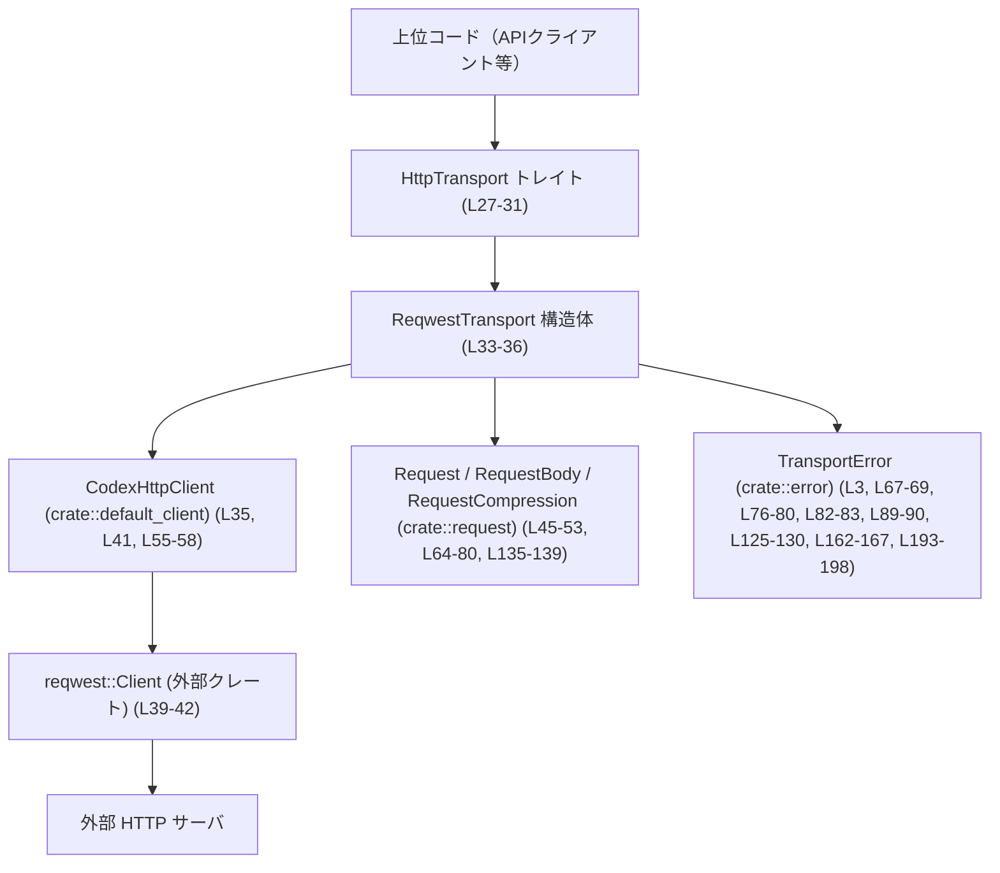
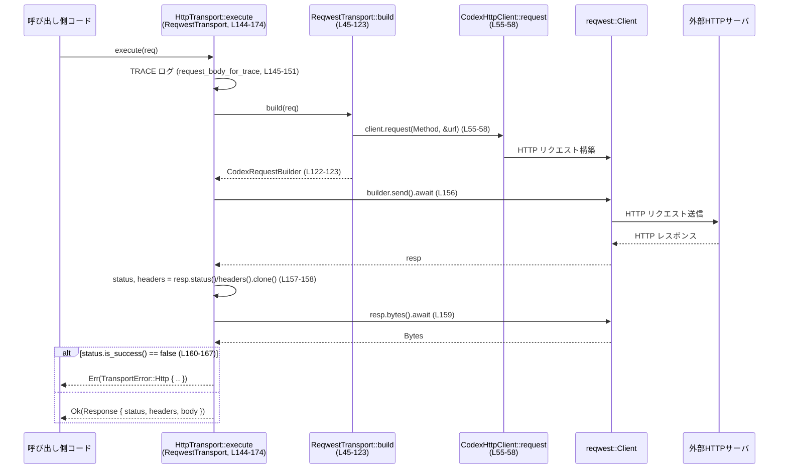

# codex-client/src/transport.rs コード解説

## 0. ざっくり一言

このモジュールは、`reqwest` ベースの HTTP クライアントをラップし、  
`Request`/`Response` 型と `TransportError` を用いた **非同期 HTTP 実行／ストリーミング用トランスポート層** を提供するモジュールです。

---

## 1. このモジュールの役割

### 1.1 概要

- このモジュールは **HTTP リクエストの送信とレスポンスの取得** を抽象化するために存在し、  
  `HttpTransport` トレイトとその実装 `ReqwestTransport` を提供します。（`transport.rs:L27-31`, `L33-36`, `L142-208`）
- ボディ圧縮（現在は zstd）の有無やタイムアウト、ヘッダ設定などを考慮しながら `reqwest` 用のリクエストを組み立てます。（`L45-123`）
- レスポンスは一括取得 (`execute`) とストリーム (`stream`) の 2 形態で扱えます。（`L28-31`, `L144-174`, `L176-208`）

### 1.2 アーキテクチャ内での位置づけ

このモジュールは「Codex クライアント」の中で HTTP 層の責務を持ち、  
上位の API からは `HttpTransport` トレイトとして利用され、内部で `reqwest::Client` に委譲します。



※ モジュールパスは `use` 句に基づきます。このチャンク外の実装詳細は不明です。

### 1.3 設計上のポイント

- **抽象化されたトランスポート層**  
  - `HttpTransport` トレイトにより、`ReqwestTransport` 以外の実装も差し替え可能な設計になっています。（`L27-31`, `L142-208`）
- **状態を持つがスレッド安全なクライアント**  
  - `ReqwestTransport` は `CodexHttpClient` をフィールドに持つ薄いラッパーです。（`L33-36`）  
  - トレイト境界 `HttpTransport: Send + Sync` により、トランスポートは複数スレッドから安全に共有されることが前提になっています。（`L27-28`）
- **エラーハンドリングの明示性**  
  - すべての公開メソッドは `Result<_, TransportError>` を返し、ネットワークエラー／タイムアウト／HTTP ステータスエラー／ビルドエラーなどを `TransportError` で分類しています。（`L28-31`, `L45`, `L125-131`, `L144`, `L176`）
- **圧縮とヘッダ制御の一元化**  
  - JSON ボディの zstd 圧縮と `Content-Encoding` / `Content-Type` 填補を `build` 関数に集中させています。（`L73-117`, `L97-104`）
- **ストリーミング API**  
  - 全体をメモリに読み込まずに、レスポンスボディを `ByteStream` (`BoxStream<'static, Result<Bytes, TransportError>>`) として非同期ストリームで扱えるようにしています。（`L19`, `L21-25`, `L199-207`）

---

## 2. 主要な機能一覧

- HTTP トランスポート抽象化: `HttpTransport` トレイトにより、HTTP 実行機構を抽象化する。（`L27-31`）
- Reqwest ベース実装: `ReqwestTransport` による `reqwest::Client` を使ったトランスポート実装。（`L33-36`, `L38-132`, `L142-208`）
- リクエストビルド: `ReqwestTransport::build` でメソッド・URL・ヘッダ・タイムアウト・ボディ／圧縮を統合して `CodexRequestBuilder` を生成。（`L45-123`）
- 一括レスポンス取得: `HttpTransport::execute` 実装でボディをすべて読み込んで `Response` として返す。（`L144-174`）
- ストリーミングレスポンス取得: `HttpTransport::stream` 実装で `StreamResponse` としてヘッダ＋ボディストリームを返す。（`L176-208`）
- 共通エラーマッピング: `map_error` による `reqwest::Error` を `TransportError::{Timeout, Network}` へ変換。（`L125-131`）
- トレースログ出力: `request_body_for_trace` と `tracing::trace!` により、TRACE レベル時にメソッド・URL・ボディ概要をログに記録。（`L134-140`, `L145-152`, `L177-183`）

---

## 3. 公開 API と詳細解説

### 3.1 型一覧（構造体・トレイト等）

| 名前 | 種別 | 公開 | 行範囲 | 役割 / 用途 |
|------|------|------|--------|-------------|
| `ByteStream` | 型エイリアス | `pub` | `transport.rs:L19` | `BoxStream<'static, Result<Bytes, TransportError>>` の別名。レスポンスボディの非同期ストリームを表します。 |
| `StreamResponse` | 構造体 | `pub` | `transport.rs:L21-25` | ストリーミングレスポンス用のコンテナ。HTTP ステータス・ヘッダ・ボディストリームを保持します。 |
| `HttpTransport` | トレイト | `pub` | `transport.rs:L27-31` | トランスポート抽象化。HTTP リクエストを一括またはストリーミングで送信するためのインターフェースです。`Send + Sync` 制約があります。 |
| `ReqwestTransport` | 構造体 | `pub` | `transport.rs:L33-36` | `HttpTransport` の `reqwest` ベース実装。内部に `CodexHttpClient` を保持します。 |
| `CodexHttpClient` | 構造体 | 非公開（別モジュール） | `transport.rs:L1, L35, L41, L55-58` | `crate::default_client` からインポートされる HTTP クライアントラッパー。詳細はこのチャンクには現れません。 |
| `CodexRequestBuilder` | 型 | 非公開（別モジュール） | `transport.rs:L2, L45, L55-58, L122, L155, L187` | リクエストを構築し送信するビルダ。`build` の戻り値として使われます。 |
| `Request` | 構造体 | 非公開（別モジュール） | `transport.rs:L4, L45-53, L64-80, L135-139, L144, L176` | HTTP リクエスト情報（メソッド・URL・ヘッダ・ボディ・圧縮・タイムアウト）をまとめた型と解釈できますが、定義はこのチャンクにはありません。 |
| `Response` | 構造体 | 非公開（別モジュール） | `transport.rs:L7, L28-30, L144, L169-173` | HTTP レスポンス（ステータス・ヘッダ・ボディ）を表す型。`execute` の戻り値です。 |
| `RequestBody` | 列挙体 | 非公開（別モジュール） | `transport.rs:L5, L64-73, L135-139` | リクエストボディの種別（JSON / Raw）を表す列挙体と解釈できますが、定義はこのチャンクにはありません。 |
| `RequestCompression` | 列挙体 | 非公開（別モジュール） | `transport.rs:L6, L51-52, L66, L73-80, L86-93` | リクエストボディの圧縮設定（`None` / `Zstd`）を持つ列挙体です。 |

※ 他モジュールの型については、`use` 句とパターンマッチから読み取れる範囲で記述しています。

---

### 3.2 関数詳細

#### `ReqwestTransport::new(client: reqwest::Client) -> ReqwestTransport`

**概要**

- `reqwest::Client` から `ReqwestTransport` を生成するコンストラクタです。（`transport.rs:L38-43`）
- 内部で `CodexHttpClient::new` に委譲し、ラップしたクライアントを保持します。

**引数**

| 引数名 | 型 | 説明 |
|--------|----|------|
| `client` | `reqwest::Client` | 既に初期化済みの HTTP クライアント。接続プールやタイムアウト設定などはこのクライアント側にあると考えられます。 |

**戻り値**

- `ReqwestTransport`：引数のクライアントを内部にラップしたトランスポート実装インスタンスです。

**内部処理の流れ**

1. `CodexHttpClient::new(client)` を呼び出し、ラッパーを生成します。（`L41`）
2. それを `ReqwestTransport { client: ... }` に格納して返します。（`L39-43`）

**Examples（使用例）**

```rust
use codex_client::transport::ReqwestTransport; // 実際のパスはクレート構成に依存します

// reqwest::Client を作成
let raw_client = reqwest::Client::new();

// ReqwestTransport を初期化
let transport = ReqwestTransport::new(raw_client);
```

**Errors / Panics**

- この関数内では `Result` を返さず、明示的なエラー分岐はありません。（`L39-43`）
- `CodexHttpClient::new` が panic する可能性については、このチャンクからは分かりません。

**Edge cases**

- `reqwest::Client` 自体が無効な状態になるケース（シャットダウン済みなど）は、`new` では検知されません。後続のリクエスト送信時にエラーになります。

**使用上の注意点**

- `reqwest::Client` は `Clone` 可能でスレッド安全なクライアントであり、`ReqwestTransport::new` に渡す前に必要な設定（プロキシ、タイムアウトなど）を完了しておく前提です。
- `ReqwestTransport` は `Clone` を実装しているため（`#[derive(Clone, Debug)]`、`L33-35`）、生成後に複数の場所で共有できます。

---

#### `ReqwestTransport::build(&self, req: Request) -> Result<CodexRequestBuilder, TransportError>`

**概要**

- 高レベルな `Request` 型から、`CodexRequestBuilder`（`reqwest` ベース）を構築します。（`transport.rs:L45-123`）
- HTTP メソッド、URL、ヘッダ、タイムアウト、ボディ、圧縮設定を考慮してビルドします。
- ここで **ビルド時の検証**（圧縮設定とヘッダの矛盾など）も行い、`TransportError::Build` を返すことがあります。（`L67-69`, `L76-80`, `L82-83`, `L89-90`）

**引数**

| 引数名 | 型 | 説明 |
|--------|----|------|
| `req` | `Request` | メソッド・URL・ヘッダ・ボディ・圧縮・タイムアウトを含む論理的リクエスト。所有権ごと渡されます。 |

**戻り値**

- `Ok(CodexRequestBuilder)`：構築された HTTP リクエストビルダ。
- `Err(TransportError::Build(_))`：リクエスト設定が矛盾している、またはシリアライズ／圧縮に失敗した場合に返されます。

**内部処理の流れ**

1. `Request` を分解  
   - `let Request { method, url, mut headers, body, compression, timeout } = req;` で各フィールドを取り出します。（`L45-53`）

2. HTTP メソッドと URL からビルダ作成  
   - `self.client.request(Method::from_bytes(...).unwrap_or(Method::GET), &url)` を呼び、初期ビルダを生成します。（`L55-58`）  
   - `Method::from_bytes` が失敗した場合は `GET` にフォールバックします。（`L56`）

3. タイムアウト設定  
   - `timeout` が `Some` の場合のみ `builder.timeout(timeout)` を設定します。（`L60-62`）

4. ボディ種別ごとの処理（`match body`）（`L64-121`）

   - **`RequestBody::Raw(raw_body)` の場合**（`L65-72`）
     - `compression != RequestCompression::None` ならビルドエラー：  
       `"request compression cannot be used with raw bodies"`。（`L66-69`）
     - それ以外ではヘッダを設定し、生のボディをそのまま `.body(raw_body)` として設定します。（`L71`）

   - **`RequestBody::Json(body)` の場合**（`L73-117`）
     - `compression == None` の場合  
       - 単にヘッダを設定し、`.json(&body)` で JSON ボディを設定します。（`L114-116`）
     - `compression != None` の場合（現在は `Zstd` のみ）（`L74-113`）
       1. 既に `CONTENT_ENCODING` ヘッダが存在する場合はビルドエラー：  
          `"request compression was requested but content-encoding is already set"`。（`L75-80`）
       2. `serde_json::to_vec(&body)` で JSON を `Vec<u8>` にシリアライズし、失敗時は `TransportError::Build` に変換。（`L82-83`）
       3. zstd 圧縮を実行し、失敗時は同様に `TransportError::Build`。（`L86-93`）
       4. 圧縮前後のサイズと所要時間を `tracing::info!` でログ出力。（`L84-85`, `L94-95`, `L106-111`）
       5. `CONTENT_ENCODING: zstd` を設定し、`CONTENT_TYPE` が未設定なら `"application/json"` を設定。（`L97-104`）
       6. 最終的にヘッダを付与し、圧縮バイト列を `.body(compressed)` として設定。（`L113`）

   - **ボディなし (`None`) の場合**（`L118-120`）
     - ヘッダのみを設定し、ボディは持たないリクエストとします。

5. 完成したビルダを `Ok(builder)` で返す。（`L122-123`）

**Examples（使用例）**

```rust
use http::{HeaderMap, Method};
use codex_client::transport::ReqwestTransport;
// Request 型の定義はこのチャンクにはありませんが、フィールドから推定して例を示します。

let client = reqwest::Client::new();
let transport = ReqwestTransport::new(client);

// JSON ボディ + zstd 圧縮付きリクエストを構築する例
let mut headers = HeaderMap::new();
let req = Request {
    method: Method::POST.as_str().to_string(), // 実際の型はこのチャンクからは不明
    url: "https://api.example.com/data".to_string(),
    headers,
    body: Some(RequestBody::Json(serde_json::json!({ "key": "value" }))),
    compression: RequestCompression::Zstd,
    timeout: None,
};

let builder = transport.build(req)?; // TransportError::Build の可能性があります
```

**Errors / Panics**

- `Err(TransportError::Build(..))` になる条件（コードから読み取れるもの）:
  - Raw ボディで `compression != RequestCompression::None` の場合。（`L64-69`）
  - JSON 圧縮が要求されており、`CONTENT_ENCODING` ヘッダが既に設定されている場合。（`L74-80`）
  - JSON シリアライズ（`serde_json::to_vec(&body)`）に失敗した場合。（`L82-83`）
  - zstd 圧縮（`zstd::stream::encode_all`）に失敗した場合。（`L89-90`）
- `unreachable!("guarded by compression != None")` は理論上到達しない分岐として記述されており、現行の列挙体の値（`None` / `Zstd`）を前提とした設計です。（`L86-88`）
  - 将来的に `RequestCompression` にバリアントが追加されても、マッチは網羅的である必要があるため、コンパイルエラーとして検出されます。

**Edge cases**

- メソッド文字列が不正な場合、`Method::from_bytes(..)` が失敗し、`Method::GET` にフォールバックします。（`L55-57`）  
  → 不正メソッドが silently に GET に変わります。
- タイムアウトが `None` の場合、`reqwest` のデフォルトタイムアウト設定が使われます。（`L60-62`）
- JSON 圧縮要求時に `CONTENT_TYPE` が未設定の場合、自動で `application/json` が設定されます。（`L99-103`）

**使用上の注意点**

- **Raw ボディと圧縮の組み合わせ禁止**  
  - Raw ボディを使う場合は、`compression` を必ず `RequestCompression::None` にする必要があります。（`L64-69`）
- **`CONTENT_ENCODING` と圧縮の競合**  
  - JSON 圧縮を利用する場合、`CONTENT_ENCODING` を事前に設定しているとビルドエラーになります。（`L74-80`）
- **ログと機密情報**  
  - JSON 圧縮時、サイズや圧縮時間のみが `info` レベルで記録され、ボディ内容は記録されませんが、TRACE ログでは別途ボディが出力され得ます（後述）。  
- **パフォーマンス**  
  - 大きな JSON ボディの zstd 圧縮は CPU 負荷がかかるため、頻度やタイミングによっては全体のスループットに影響する可能性があります。`compression_start` から `elapsed` を計測しているのは、その把握のためです。（`L84-85`, `L94-95`, `L106-111`）

---

#### `ReqwestTransport::map_error(err: reqwest::Error) -> TransportError`

**概要**

- `reqwest::Error` をライブラリ内の `TransportError` に変換する共通関数です。（`transport.rs:L125-131`）

**引数**

| 引数名 | 型 | 説明 |
|--------|----|------|
| `err` | `reqwest::Error` | `reqwest` が返すエラー型。 |

**戻り値**

- `TransportError::Timeout`：`err.is_timeout()` が真の場合。（`L126-128`）
- `TransportError::Network(String)`：それ以外のエラーの場合、`err.to_string()` を格納。（`L128-130`）

**内部処理の流れ**

1. `err.is_timeout()` を確認。（`L126`）
2. タイムアウトなら `TransportError::Timeout` を返す。（`L126-128`）
3. それ以外は文字列表現を持つ `TransportError::Network` を返す。（`L128-130`）

**Examples（使用例）**

`execute` や `stream` 内で `.map_err(Self::map_error)` として利用されています。（`L156`, `L159`, `L188`, `L200-202`）

**Errors / Panics**

- 追加の panic はありません。
- `reqwest::Error` 自体の内容に依存するため、情報は文字列化されたものに集約されます。

**Edge cases**

- タイムアウト以外の全てのエラー（DNS 失敗、接続拒否、TLS エラーなど）が `TransportError::Network` にまとめられます。

**使用上の注意点**

- ネットワークエラーの種類をより詳細に区別したい場合でも、この関数経由では文字列しか得られません。このライブラリを利用する側では、`TransportError::Network` の文字列をパースする必要が出る可能性があります。

---

#### `request_body_for_trace(req: &Request) -> String`

**概要**

- TRACE レベルログに埋め込むための、リクエストボディの文字列表現を生成します。（`transport.rs:L134-140`）
- JSON ボディはそのまま `to_string()` した内容、Raw ボディは長さのみを表示します。

**引数**

| 引数名 | 型 | 説明 |
|--------|----|------|
| `req` | `&Request` | ログ対象のリクエスト。 |

**戻り値**

- `String`：ログ用のボディ表現。  
  - JSON: `body.to_string()`  
  - Raw: `"<raw body: {len} bytes>"`  
  - None: 空文字列

**内部処理の流れ**

1. `req.body.as_ref()` でボディの参照を取得。（`L135`）
2. `match` でバリアントごとに処理。（`L135-139`）
   - `Json(body)` → `body.to_string()`（`L136`）
   - `Raw(body)` → `format!("<raw body: {} bytes>", body.len())`（`L137`）
   - `None` → `String::new()`（`L138-139`）

**Examples（使用例）**

`execute` および `stream` 内で TRACE ログ用に使われています。（`L145-151`, `L177-183`）

```rust
if enabled!(Level::TRACE) {
    trace!(
        "{} to {}: {}",
        req.method,
        req.url,
        request_body_for_trace(&req)
    );
}
```

**Errors / Panics**

- 明示的なエラーはありません。
- `body.to_string()` の実装に依存しますが、通常の `serde_json::Value` 等であれば panic は想定されません。

**Edge cases**

- 大きな JSON ボディの場合、TRACE ログに全文が出力されます。
- Raw ボディの場合は内容そのものはログに記録されず、バイト数のみが記録されます。

**使用上の注意点**

- **機密情報を含む JSON ボディ** は TRACE レベルログにそのまま出力されるため、ログ設定や環境によっては情報漏えいのリスクがあります。  
  これは設計上そういう挙動になっている、という事実です。（`L145-151`, `L177-183`）

---

#### `HttpTransport::execute(&self, req: Request) -> Result<Response, TransportError>` （`ReqwestTransport` 実装）

**概要**

- リクエストを送信し、レスポンスボディをすべて読み込んで `Response` として返す非同期関数です。（`transport.rs:L144-174`）
- HTTP ステータスコードが成功（`2xx`）でない場合は、`TransportError::Http` を返します。（`L160-167`）

**引数**

| 引数名 | 型 | 説明 |
|--------|----|------|
| `req` | `Request` | 実行する HTTP リクエスト。所有権が移動します。 |

**戻り値**

- `Ok(Response)`：HTTP ステータスが成功であり、ボディをすべて読み込めた場合。
- `Err(TransportError)`：
  - リクエストビルドエラー (`TransportError::Build`)。（`L155` 経由）
  - ネットワーク／タイムアウトエラー (`TransportError::{Timeout, Network}`)。（`L156`, `L159` 経由で `map_error`）
  - HTTP ステータスエラー (`TransportError::Http`)。（`L160-167`）

**内部処理の流れ**

1. TRACE ログ出力（有効時のみ）（`L145-152`）
   - `enabled!(Level::TRACE)` でレベルを確認し、メソッド・URL・ボディ概要をログ出力します。

2. URL のクローン（`L154`）
   - エラー時に URL を `TransportError::Http` に含めるため、`req.url.clone()` を保持します。

3. ビルドと送信（`L155-157`）
   - `self.build(req)?` で `CodexRequestBuilder` を取得。
   - `builder.send().await.map_err(Self::map_error)?` で HTTP リクエストを送信し、レスポンスを受信します。

4. ステータス・ヘッダ・ボディの取得（`L157-159`）
   - `status = resp.status()`（HTTP ステータスコード）
   - `headers = resp.headers().clone()`（レスポンスヘッダ）
   - `bytes = resp.bytes().await.map_err(Self::map_error)?`（ボディ全体を `Bytes` として読み込み）

5. HTTP ステータスの検査（`L160-167`）
   - `if !status.is_success()` なら、エラーレスポンスとして扱います。
   - ボディを UTF-8 として `String::from_utf8(bytes.to_vec()).ok()` し、成功すれば `Some(String)`、失敗すれば `None`。
   - `TransportError::Http` に `status`、`Some(url)`、`Some(headers)`、`body` を詰めて `Err` で返します。

6. 成功時 `Response` の構築（`L169-173`）
   - `Ok(Response { status, headers, body: bytes })` を返します。

**Examples（使用例）**

```rust
// 前提: transport は ReqwestTransport など HttpTransport を実装した型
// リクエストの詳細な組み立てはこのチャンクの外ですが、例として示します。
let response: Response = transport.execute(request).await?;

// ステータスやボディへのアクセス（Response の定義は別モジュール）
println!("status = {}", response.status);
println!("body len = {}", response.body.len());
```

**Errors / Panics**

- `build` 内での `TransportError::Build`（前節参照）。（`L155`）
- 送信／ボディ取得時の `reqwest::Error` は `map_error` により `TransportError::{Timeout, Network}` に変換されます。（`L156`, `L159`, `L125-131`）
- HTTP ステータスが成功でない場合、必ず `TransportError::Http` になります。（`L160-167`）
- この関数内に `panic!` はありません。

**Edge cases**

- HTTP エラー時のボディが非 UTF-8 の場合、`body` は `None` になります。（`L161-162`）
- 非成功ステータス（4xx/5xx だけでなく 3xx など）も `status.is_success() == false` のため、`TransportError::Http` として扱われます。（`L160`）
- 非同期実行のため、この関数を利用するには `tokio` や `async-std` などのランタイム上で `.await` する必要があります。  

**使用上の注意点**

- エラー時のボディは必ずしも取得できるとは限らず（UTF-8 変換失敗など）、`TransportError::Http` 上では `Option<String>` として扱われます。
- 成功時もボディは全てメモリに読み込まれるため、非常に大きなレスポンスの場合は `stream` メソッドの利用を検討することが想定されます。

---

#### `HttpTransport::stream(&self, req: Request) -> Result<StreamResponse, TransportError>` （`ReqwestTransport` 実装）

**概要**

- リクエストを送信し、レスポンスボディを `ByteStream` としてストリーミングで受け取る非同期関数です。（`transport.rs:L176-208`）
- HTTP ステータスが成功でない場合は、文字列ボディを読み込んでから `TransportError::Http` を返します。（`L191-198`）

**引数**

| 引数名 | 型 | 説明 |
|--------|----|------|
| `req` | `Request` | 実行する HTTP リクエスト。所有権が移動します。 |

**戻り値**

- `Ok(StreamResponse)`：HTTP ステータスが成功であり、ストリームの準備ができた場合。
- `Err(TransportError)`：
  - `execute` と同様に、ビルド／ネットワーク／HTTP ステータスの各種エラーが返ります。

**内部処理の流れ**

1. TRACE ログ出力（`L177-183`）
2. URL のクローン（`L186`）
3. ビルドと送信（`L187-188`）
4. ステータス・ヘッダ取得（`L189-190`）
5. HTTP ステータス検査（`L191-198`）
   - 失敗時は `resp.text().await.ok()` でボディを文字列として取得し、`TransportError::Http` を返します。
6. 成功時のボディストリーム生成（`L199-202`）
   - `resp.bytes_stream()` で `Stream<Item = Result<Bytes, reqwest::Error>>` を取得。
   - `.map(|result| result.map_err(Self::map_error))` で各チャンクのエラーを `TransportError` に変換。
7. `StreamResponse { status, headers, bytes: Box::pin(stream) }` を返します。（`L203-207`）

**Examples（使用例）**

```rust
use futures::StreamExt;

// stream_response は StreamResponse
let stream_response = transport.stream(request).await?;

println!("status = {}", stream_response.status);

let mut body_stream = stream_response.bytes;

while let Some(chunk_result) = body_stream.next().await {
    let chunk = chunk_result?; // TransportError になる可能性
    println!("received {} bytes", chunk.len());
}
```

**Errors / Panics**

- `builder.send().await`、`resp.bytes_stream()` 内のエラーは、各チャンクごとに `TransportError::{Timeout, Network}` に変換されます。（`L188`, `L200-202`, `L125-131`）
- HTTP ステータスエラー時には、ボディを文字列として取得しようとしますが、その取得自体が失敗すると `body` は `None` になります。（`L191-193`）
- panic はありません。

**Edge cases**

- ヘッダやステータスはストリーム開始前に決定しているため、`StreamResponse` に格納されています。（`L189-190`, `L203-205`）
- ストリーム途中のネットワークエラーなどは、ストリームの各アイテムが `Err(TransportError)` になる形で伝播します。（`L200-202`）

**使用上の注意点**

- `ByteStream` は `BoxStream<'static, Result<Bytes, TransportError>>` であり、`Send` かつ `'static` なストリームとして扱えます（`futures` の定義による）。  
  → 他スレッドに移動させた上で消費することも想定できます。
- ストリームを最後まで読みきらずに破棄した場合の挙動（接続のクローズやリソース解放）は `reqwest` 側に依存します。

---

### 3.3 その他の関数

上記以外の関数（自由関数・単純なラッパー）は以下です。

| 関数名 | 行範囲 | 役割（1 行） |
|--------|--------|--------------|
| `request_body_for_trace` | `transport.rs:L134-140` | TRACE ログ用にリクエストボディを文字列化します。 |

---

## 4. データフロー

ここでは `execute` を用いた一括レスポンス取得時の典型的なデータフローを示します。



※ 行番号はこのチャンク内での通し番号です。

---

## 5. 使い方（How to Use）

### 5.1 基本的な使用方法

**一括レスポンス取得の典型的フロー**

```rust
use futures::StreamExt; // stream 使用例で利用する場合
// 実際のパスはクレート構成に依存します
use codex_client::transport::{ReqwestTransport, HttpTransport}; 

// 1. reqwest クライアントとトランスポートの初期化
let raw_client = reqwest::Client::new();                    // reqwest クライアント
let transport = ReqwestTransport::new(raw_client);          // L39-43

// 2. Request 構造体の組み立て
// Request 型の実装はこのチャンクにはないため、フィールドから推定した例です
let request = Request {
    method: "GET".to_string(),
    url: "https://example.com".to_string(),
    headers: http::HeaderMap::new(),
    body: None,
    compression: RequestCompression::None,
    timeout: None,
};

// 3. 非同期にリクエストを実行
let response: Response = transport.execute(request).await?; // L144-174

// 4. 結果の利用
println!("Status: {}", response.status);
println!("Body length: {}", response.body.len());
```

### 5.2 よくある使用パターン

1. **大きなレスポンスをストリーミングで処理**

```rust
let request = /* Request を組み立てる */;
let stream_response = transport.stream(request).await?;      // L176-208

println!("Status: {}", stream_response.status);

let mut bytes_stream = stream_response.bytes;
while let Some(chunk_result) = bytes_stream.next().await {
    let chunk = chunk_result?;                               // TransportError の可能性
    // チャンクごとに処理
    println!("chunk size = {}", chunk.len());
}
```

1. **JSON + zstd 圧縮で送信**

```rust
let mut headers = http::HeaderMap::new();
let request = Request {
    method: "POST".to_string(),
    url: "https://api.example.com/ingest".to_string(),
    headers,
    body: Some(RequestBody::Json(serde_json::json!({ "data": "..." }))),
    compression: RequestCompression::Zstd,                    // L51-52, L73-93
    timeout: Some(std::time::Duration::from_secs(30)),
};

let response = transport.execute(request).await?;
```

1. **タイムアウトとエラーの扱い**

```rust
let request = /* timeout を含む Request */;
match transport.execute(request).await {
    Ok(resp) => {
        println!("ok: {}", resp.status);
    }
    Err(TransportError::Timeout) => {
        eprintln!("request timed out");
    }
    Err(TransportError::Network(msg)) => {
        eprintln!("network error: {}", msg);
    }
    Err(TransportError::Http { status, body, .. }) => {
        eprintln!("http error: {}, body: {:?}", status, body);
    }
    Err(e) => {
        eprintln!("other transport error: {:?}", e);
    }
}
```

### 5.3 よくある間違い

```rust
// 間違い例1: Raw ボディ + 圧縮を同時に指定してしまう
let request = Request {
    body: Some(RequestBody::Raw(vec![0u8; 10])),
    compression: RequestCompression::Zstd,    // L64-69 でエラー
    // 他フィールド省略
};
// => build() 内で TransportError::Build("request compression cannot be used with raw bodies") となる可能性

// 正しい例: Raw ボディの場合は compression を None にする
let request = Request {
    body: Some(RequestBody::Raw(vec![0u8; 10])),
    compression: RequestCompression::None,
    // 他フィールド
};
```

```rust
// 間違い例2: JSON 圧縮を使うのに CONTENT_ENCODING をあらかじめ設定してしまう
let mut headers = http::HeaderMap::new();
headers.insert(
    http::header::CONTENT_ENCODING,
    http::HeaderValue::from_static("gzip"),
);

let request = Request {
    headers,
    body: Some(RequestBody::Json(serde_json::json!({ "x": 1 }))),
    compression: RequestCompression::Zstd,
    // 他フィールド
};
// => build() 内で TransportError::Build("request compression was requested but content-encoding is already set")（L75-80）

// 正しい例: 圧縮をこのモジュールに任せる場合、CONTENT_ENCODING は事前に設定しない
let mut headers = http::HeaderMap::new();
let request = Request {
    headers,
    body: Some(RequestBody::Json(serde_json::json!({ "x": 1 }))),
    compression: RequestCompression::Zstd,
    // 他フィールド
};
```

```rust
// 間違い例3: 非同期ランタイム外で .await しようとする（コンパイル時にエラー）
// let resp = transport.execute(request).await;

// 正しい例: tokio などのランタイム上で async fn から呼び出す
#[tokio::main]
async fn main() -> Result<(), TransportError> {
    let transport = ReqwestTransport::new(reqwest::Client::new());
    let request = /* Request */;
    let resp = transport.execute(request).await?;
    println!("{:?}", resp.status);
    Ok(())
}
```

### 5.4 使用上の注意点（まとめ）

- **並行性**
  - `HttpTransport: Send + Sync` により、実装はスレッド安全であることが前提です。（`L27-28`）
  - `ReqwestTransport` は `Clone` 可能で、複数タスクからの同時利用が想定されています。（`L33-35`）
- **ログと機密性**
  - TRACE レベル有効時に `request_body_for_trace` で JSON ボディ全文がログ出力されます。（`L145-151`, `L177-183`）
  - 機密情報を含むボディを扱う際は、ログレベルやログ出力先に注意が必要です。
- **圧縮とヘッダの整合性**
  - Raw ボディでの圧縮は禁止（ビルドエラー）。（`L64-69`）
  - JSON 圧縮利用時には `CONTENT_ENCODING` を事前に設定しないこと。（`L74-80`）
- **HTTP エラー時の情報**
  - `TransportError::Http` にはステータス・URL・レスポンスヘッダ・ボディ（UTF-8 変換に成功すれば）が含まれます。（`L162-167`, `L193-198`）
  - 非 UTF-8 ボディの場合、`body` は `None` になる点に注意が必要です。（`L161-162`）
- **パフォーマンス**
  - `execute` はボディを完全にメモリに読み込むため、巨大レスポンスでは `stream` 利用が望ましい設計です。（`L159`, `L199-207`）
  - zstd 圧縮は CPU 負荷を伴いますが、`compression_duration_ms` をログしているため、運用時にオーバーヘッドを把握しやすくなっています。（`L84-85`, `L94-95`, `L106-111`）

---

## 6. 変更の仕方（How to Modify）

### 6.1 新しい機能を追加する場合

このモジュールに機能追加を行う場合に、どの部分を見るべきかを整理します。

- **新しい HTTP トランスポート実装を追加する場合**
  - `HttpTransport` トレイト（`L27-31`）に準拠した新しい構造体と `impl HttpTransport for ...` ブロックを追加します。
  - 既存の `ReqwestTransport` 実装（`L33-36`, `L38-132`, `L142-208`）は、インターフェースの参考になります。

- **新しい圧縮方式をサポートする場合**
  - `RequestCompression` 列挙体の定義は別モジュールですが、ここでの使用箇所は `ReqwestTransport::build` 内の `match compression`（`L86-93`）です。
  - 圧縮方法ごとにヘッダ（`CONTENT_ENCODING`）の設定とエラーハンドリングがこの関数に集中しているため、この部分を拡張対象として確認します。

- **ログの内容を変更する場合**
  - リクエストログは `request_body_for_trace` と `trace!` 呼び出し部分（`L134-140`, `L145-151`, `L177-183`）で制御されています。
  - 圧縮関連の統計ログは `tracing::info!`（`L106-111`）で出力されています。

### 6.2 既存の機能を変更する場合

- **影響範囲の確認**
  - `ReqwestTransport::build` の挙動を変えると、`execute` と `stream` 両方のリクエスト送信経路に影響します。（`L155`, `L187`）
  - `map_error` を変更すると、`execute` と `stream` の両方のエラー表現に影響します。（`L156`, `L159`, `L188`, `L200-202`）

- **契約（前提条件・返り値の意味）**
  - `HttpTransport::execute`／`stream` は「HTTP ステータスが成功でない場合はエラーを返す」という契約があります。（`L160-167`, `L191-198`）
  - これを変更すると、利用側コードのエラーハンドリングロジックも見直す必要があります。

- **テスト・使用箇所の確認**
  - このチャンクにはテストコードは含まれていません。  
    実際のプロジェクトでは、`HttpTransport` を利用している上位モジュールのテストや統合テストが存在する可能性が高いため、それらの呼び出し箇所を確認する必要があります。

---

## 7. 関連ファイル

このモジュールと密接に関係するモジュール／型は次の通りです。

| パス / モジュール | 役割 / 関係 |
|-------------------|------------|
| `crate::default_client` | `CodexHttpClient` および `CodexRequestBuilder` を提供し、`ReqwestTransport` が HTTP リクエストの具体的送信を委譲しています。（`L1-2`, `L35`, `L41`, `L55-58`, `L122`, `L155`, `L187`） |
| `crate::request` | `Request`, `RequestBody`, `RequestCompression`, `Response` 型を提供し、本モジュールの主な入出力データ構造となっています。（`L4-7`, `L45-53`, `L64-80`, `L135-139`, `L144`, `L169-173`, `L176`） |
| `crate::error` | `TransportError` 型を提供し、本モジュールの統一的なエラー表現として利用されています。（`L3`, `L19`, `L45`, `L67-69`, `L76-80`, `L82-83`, `L89-90`, `L125-131`, `L144`, `L160-167`, `L176`, `L191-198`, `L199-202`） |
| `bytes` クレート | レスポンスボディのチャンク表現として `Bytes` 型を提供します。（`L9`, `L19`, `L159`, `L200-202`） |
| `futures` クレート | `BoxStream` と `StreamExt::map` を通じて、レスポンスボディの非同期ストリーム処理を支えています。（`L10-11`, `L19`, `L199-202`） |
| `tracing` クレート | `enabled!`, `trace!`, `info!` により、詳細ログや圧縮統計ログなどの観測性を提供します。（`L15-17`, `L106-111`, `L145-151`, `L177-183`） |

このチャンクにはテストファイルやベンチマークファイルに関する情報は含まれていません。
