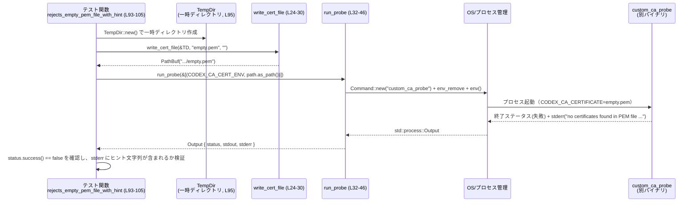

# codex-client/tests/ca_env.rs コード解説

## 0. ざっくり一言

外部バイナリ `custom_ca_probe` をサブプロセスとして起動し、CA 証明書関連の環境変数と PEM ファイル内容に応じた振る舞いを検証する統合テスト用モジュールです（CA ファイル選択・PEM 解析・エラーメッセージを確認します）。  
TLS ハンドシェイクそのものではなく、「どの CA ファイルをどう読むか」「失敗時にどのようなエラーを出すか」を対象としています（コメントより: `codex-client/tests/ca_env.rs:L1-9`）。

---

## 1. このモジュールの役割

### 1.1 概要

- このモジュールは、**カスタム CA 設定が環境変数経由でどのように解決されるか**を検証するために存在し、`custom_ca_probe` バイナリを実際に起動することで **実環境に近い形での挙動** をテストします（`codex-client/tests/ca_env.rs:L1-9,32-46`）。
- 特に次を確認します。
  - `CODEX_CA_CERTIFICATE` / `SSL_CERT_FILE` の優先順位とフォールバック（`L17-18,48-80`）
  - PEM ファイルが空／壊れている場合の失敗と、ユーザー向けヒントの有無（`L93-123`）
  - 複数証明書バンドル・CRL・OpenSSL trusted 証明書など、現実的な証明書ファイル形式の受理（`L82-91,125-145`）

### 1.2 アーキテクチャ内での位置づけ

`ca_env.rs` はテストモジュールであり、以下のような依存関係になっています。

- `custom_ca_probe` … 実際に reqwest クライアントを構築するテスト用バイナリ（ソースはこのチャンクには現れませんが、コメントと `cargo_bin("custom_ca_probe")` 呼び出しから確認できます: `L1-4,32-36`）。
- `codex_utils_cargo_bin::cargo_bin` … テストターゲットバイナリのパスを解決するヘルパー（`L11,32-36`）。
- OS / ファイルシステム / 一時ディレクトリ … 証明書ファイルの作成とサブプロセス起動に使用（`L12,14-15,24-30,32-46`）。

```mermaid
graph TD
    A["テスト関数群<br/>(uses_codex_..., rejects_empty_..., etc.)<br/>L48-145"] --> B["write_cert_file<br/>(ヘルパー)<br/>L24-30"]
    A --> C["run_probe<br/>(サブプロセス起動)<br/>L32-46"]
    B --> D["ファイルシステム(fs)<br/>L12,24-27"]
    A --> E["TempDir (tempfileクレート)<br/>L15,50,60,..."]
    C --> F["cargo_bin(\"custom_ca_probe\")<br/>L11,32-36"]
    C --> G["std::process::Command<br/>L14,32-45"]
    G --> H["custom_ca_probe バイナリ<br/>(別クレート, このチャンクには定義なし)"]
```

### 1.3 設計上のポイント

- **サブプロセス前提のテスト**  
  - テストは `custom_ca_probe` を別プロセスとして起動し、プロセスの終了ステータスと stderr を検証します（`L32-46,93-105,107-123`）。
  - これにより、in-process helper を直接呼ぶのでは拾えない、環境変数継承や実ファイル I/O の問題を含めて検証できます（コメント: `L1-8`）。

- **環境の「hermetic」化の一部を担当**  
  - サブプロセス起動前に `CODEX_CA_CERT_ENV` / `SSL_CERT_FILE_ENV` を `env_remove` で必ず削除し、親プロセスの環境をテストに影響させないようにしています（`L37-40`）。
  - コメントでも「scrubbing inherited CA environment variables」と明記されています（`L5-7`）。

- **重複ロジックのヘルパー化**  
  - 証明書ファイルの生成は `write_cert_file`（`L24-30`）、サブプロセス起動は `run_probe`（`L32-46`）に集約され、各テストはシナリオの構成に集中しています。

- **エラーハンドリング方針**  
  - ファイル書き込みやバイナリ解決・起動に失敗した場合は `unwrap_or_else` で即座に `panic!` し、テストを明示的に失敗させます（`L26-28,34-36,44-45`）。
  - `custom_ca_probe` の失敗は `std::process::Output` の `status` と `stderr` 内容で検証されます（`L55,65,79,90,100-104,118-122,132,144`）。

- **並行性**  
  - コード内でスレッドや async は使っていません。  
  - 各テストは `TempDir::new()` で別々の一時ディレクトリを作り（`L50,60,70,84,95,109,127,137`）、ファイルパスの衝突を避ける構造になっています。

---

## 2. 主要な機能一覧＋コンポーネントインベントリー

### 2.1 機能一覧（何をテストしているか）

- CA 証明書ファイルの書き込みヘルパー `write_cert_file`（`L24-30`）
- サブプロセス `custom_ca_probe` の起動と環境変数設定ヘルパー `run_probe`（`L32-46`）
- `CODEX_CA_CERTIFICATE` を指定した場合に、そのファイルが使用されることの検証（`uses_codex_ca_cert_env`: `L48-56`）
- `CODEX_CA_CERTIFICATE` 未設定時、`SSL_CERT_FILE` にフォールバックすることの検証（`falls_back_to_ssl_cert_file`: `L58-66`）
- 両方設定された場合に `CODEX_CA_CERTIFICATE` が優先されることの検証（`prefers_codex_ca_cert_over_ssl_cert_file`: `L68-80`）
- 複数証明書を含む PEM バンドルの受理（`handles_multi_certificate_bundle`: `L82-91`）
- 空 PEM ファイルの拒否と、環境変数名を含むヒントメッセージの検証（`rejects_empty_pem_file_with_hint`: `L93-105`）
- 壊れた PEM の拒否と、同様のヒントメッセージの検証（`rejects_malformed_pem_with_hint`: `L107-123`）
- OpenSSL の「trusted」証明書形式の受理（`accepts_openssl_trusted_certificate`: `L125-133`）
- 証明書と CRL が混在するバンドルの受理（`accepts_bundle_with_crl`: `L135-145`）

### 2.2 コンポーネント一覧（定数・関数）

#### 定数

| 名前 | 種別 | 役割 / 用途 | 定義位置 |
|------|------|-------------|----------|
| `CODEX_CA_CERT_ENV` | `&'static str` | `CODEX_CA_CERTIFICATE` 環境変数名（`custom_ca_probe` が見る CA ファイル指定） | `codex-client/tests/ca_env.rs:L17` |
| `SSL_CERT_FILE_ENV` | `&'static str` | `SSL_CERT_FILE` 環境変数名（一般的な CA ファイル指定環境変数） | `codex-client/tests/ca_env.rs:L18` |
| `TEST_CERT_1` | `&'static str` | フィクスチャ CA 証明書 PEM (`fixtures/test-ca.pem`) | `codex-client/tests/ca_env.rs:L20` |
| `TEST_CERT_2` | `&'static str` | 中間 CA 証明書 PEM (`fixtures/test-intermediate.pem`) | `codex-client/tests/ca_env.rs:L21` |
| `TRUSTED_TEST_CERT` | `&'static str` | OpenSSL trusted 証明書 PEM (`fixtures/test-ca-trusted.pem`) | `codex-client/tests/ca_env.rs:L22` |

#### 関数（ヘルパー＋テスト）

| 名前 | 種別 | 役割 / 用途 | 定義位置 |
|------|------|-------------|----------|
| `write_cert_file` | ヘルパー関数 | 一時ディレクトリ内に PEM ファイルを作成し、そのパスを返す | `codex-client/tests/ca_env.rs:L24-30` |
| `run_probe` | ヘルパー関数 | 指定された環境変数を設定して `custom_ca_probe` を起動し、`Output` を取得 | `codex-client/tests/ca_env.rs:L32-46` |
| `uses_codex_ca_cert_env` | テスト関数 | `CODEX_CA_CERTIFICATE` が設定された場合の基本的な成功パスを検証 | `codex-client/tests/ca_env.rs:L48-56` |
| `falls_back_to_ssl_cert_file` | テスト関数 | `SSL_CERT_FILE` のフォールバック挙動を検証 | `codex-client/tests/ca_env.rs:L58-66` |
| `prefers_codex_ca_cert_over_ssl_cert_file` | テスト関数 | 両方設定時の優先順位（CODEX_CA が優先）を検証 | `codex-client/tests/ca_env.rs:L68-80` |
| `handles_multi_certificate_bundle` | テスト関数 | 2 枚の証明書を含む PEM バンドルの受理を検証 | `codex-client/tests/ca_env.rs:L82-91` |
| `rejects_empty_pem_file_with_hint` | テスト関数 | 空ファイルを拒否し、エラーメッセージにヒントが含まれることを検証 | `codex-client/tests/ca_env.rs:L93-105` |
| `rejects_malformed_pem_with_hint` | テスト関数 | 壊れた PEM を拒否し、同様のヒントを検証 | `codex-client/tests/ca_env.rs:L107-123` |
| `accepts_openssl_trusted_certificate` | テスト関数 | OpenSSL trusted PEM の受理を検証 | `codex-client/tests/ca_env.rs:L125-133` |
| `accepts_bundle_with_crl` | テスト関数 | 証明書 + CRL 混在バンドルの受理を検証 | `codex-client/tests/ca_env.rs:L135-145` |

---

## 3. 公開 API と詳細解説

このファイルはテスト用モジュールであり、「ライブラリ API」として外部に公開される関数はありません。  
ただし、テスト内で再利用されるヘルパー関数と主要テスト関数について、設計と挙動を詳細に整理します。

### 3.1 型一覧

このファイル内で新たに定義されている型（構造体・列挙体など）はありません。  
外部クレート／標準ライブラリから利用している主な型は次のとおりです（参考）。

| 名前 | 所属 | 役割 / 用途 | 出現位置 |
|------|------|-------------|----------|
| `TempDir` | `tempfile` クレート | 一時ディレクトリを表す型。各テストで証明書ファイルを置く場所として使用。詳細実装はこのチャンクには現れません。 | `L15,50,60,70,84,95,109,127,137` |
| `Command` | `std::process` | 外部プロセス `custom_ca_probe` の起動に使用 | `L14,32-45` |
| `Output` | `std::process` | プロセスの終了ステータス・標準出力・標準エラーをまとめた戻り値 | `L32,44-45,53-55,63-65,...` |
| `Path` | `std::path` | ファイルシステム上のパスを借用参照として扱うために使用 | `L13,32,41-42` |

### 3.2 関数詳細（7 件）

#### `write_cert_file(temp_dir: &TempDir, name: &str, contents: &str) -> std::path::PathBuf`

**概要**

- 指定された一時ディレクトリ直下にファイルを作成し、文字列 `contents` を書き込んだ上で、そのファイルパスを返すヘルパーです（`L24-30`）。

**引数**

| 引数名 | 型 | 説明 |
|--------|----|------|
| `temp_dir` | `&TempDir` | 一時ディレクトリへの参照。ここから `path()` メソッドでディレクトリパスを取得します。 |
| `name` | `&str` | 作成するファイル名（例: `"ca.pem"`）。 |
| `contents` | `&str` | ファイルに書き込む PEM 文字列。空文字列も許可されています（空 PEM のテストに使用: `L72,96`）。 |

**戻り値**

- `std::path::PathBuf`  
  - 作成されたファイルの絶対または相対パス（`temp_dir.path().join(name)` の結果）です（`L24-25,29`）。

**内部処理の流れ**

1. `temp_dir.path().join(name)` でファイルパスを構築（`L24-25`）。
2. `fs::write(&path, contents)` でファイルへ文字列を書き込み（`L26`）。
3. 書き込みに失敗した場合は `unwrap_or_else` のクロージャで `panic!` を発生させ、どのパスで失敗したかをメッセージに含めます（`L26-28`）。
4. 成功した場合は `path` を返します（`L29`）。

**Examples（使用例）**

このファイル内では、ほぼ全てのテスト関数で次のように利用されています（例: `uses_codex_ca_cert_env`、`L48-52`）。

```rust
let temp_dir = TempDir::new().expect("tempdir");            // 一時ディレクトリを作成
let cert_path = write_cert_file(&temp_dir, "ca.pem", TEST_CERT_1); // PEM を書き込んだファイルを作成
// cert_path を環境変数にセットして run_probe(...) に渡す
```

**Errors / Panics**

- `fs::write` が失敗した場合（ディスクフル、権限不足、パス不正など）、`panic!("write cert fixture failed for {}: {error}", path.display())` によりテストを即座に失敗させます（`L26-28`）。
- 戻り値は `Result` ではなく、テスト用ヘルパーとして「失敗はテストのバグまたはテスト環境の問題」とみなし、panic しています。

**Edge cases（エッジケース）**

- `contents` が空文字列の場合でも、そのまま空ファイルが作成されます（`rejects_empty_pem_file_with_hint` で利用: `L96`）。
- `name` にスラッシュなどパス区切りが含まれる場合の扱いは、このファイルからは分かりません（そのような呼び出しはありません）。

**使用上の注意点**

- `TempDir` のライフタイム内でのみ有効なパスである点に注意が必要です。`TempDir` がドロップされるとディレクトリが削除される実装である可能性が高いため（一般的な `tempfile` の仕様）、テスト内で即座に使用する前提になっています。
- 実運用コードでは `panic!` ではなく `Result` ベースのエラー処理にするべきですが、このモジュールはテスト専用です。

---

#### `run_probe(envs: &[(&str, &Path)]) -> std::process::Output`

**概要**

- `custom_ca_probe` バイナリをサブプロセスとして起動し、指定された環境変数を設定した上で `std::process::Output` を取得するヘルパーです（`L32-46`）。
- CA 関連の環境変数を一度クリアしてからテスト用の値を設定することで、テストの「hermetic」性（外部環境への依存の排除）を保ちます（`L37-40`）。

**引数**

| 引数名 | 型 | 説明 |
|--------|----|------|
| `envs` | `&[(&str, &Path)]` | 設定する環境変数のリスト。要素は `(キー, 値のパス)` のペア。`cmd.env(key, value)` でそのまま設定されます（`L41-42`）。 |

**戻り値**

- `std::process::Output`  
  - `status`（終了コード）、`stdout`、`stderr` を含む標準ライブラリの構造体です（`L44-45`）。  
  - 呼び出し側（テスト関数）は `status.success()` や `stderr` の内容を検証します（例: `L55,65,79,90,100-104,118-122,132,144`）。

**内部処理の流れ**

1. `cargo_bin("custom_ca_probe")` でテスト対象バイナリのパスを解決（`L32-35`）。
   - 失敗した場合は `unwrap_or_else` の中で `panic!("failed to locate custom_ca_probe: {error}")` を実行します（`L34-35`）。
2. 得られたパスを `Command::new(...)` に渡し、サブプロセスコマンドを構築（`L32-34`）。
3. 親プロセスから継承される環境に対し、まず `CODEX_CA_CERT_ENV` と `SSL_CERT_FILE_ENV` を `env_remove` で削除（`L37-40`）。
4. 引数 `envs` の各 `(key, value)` ペアを `cmd.env(key, value);` で設定（`L41-42`）。
5. `cmd.output()` を呼び出し、プロセス実行と結果取得を行う（`L44`）。
   - 失敗した場合は `unwrap_or_else` 内で `panic!("failed to run custom_ca_probe: {error}")` を実行（`L44-45`）。
6. 成功した場合は `Output` を返します（`L44-45`）。

**Examples（使用例）**

典型的には、テスト関数内で次のように使われています。

```rust
let temp_dir = TempDir::new().expect("tempdir");                      // 一時ディレクトリ
let cert_path = write_cert_file(&temp_dir, "ca.pem", TEST_CERT_1);    // CA PEM ファイルを作成

let output = run_probe(&[(CODEX_CA_CERT_ENV, cert_path.as_path())]);  // 環境変数を設定して起動
assert!(output.status.success());                                     // 正常終了を期待
```

（`uses_codex_ca_cert_env`: `L48-55` を簡略化）

**Errors / Panics**

- バイナリパス解決に失敗すると `panic!("failed to locate custom_ca_probe: {error}")`（`L32-36`）。
- プロセス起動／待機に失敗すると `panic!("failed to run custom_ca_probe: {error}")`（`L44-45`）。
- どちらもテスト環境の問題とみなし、早期にテストを失敗させる方針です。
- `custom_ca_probe` 自体のエラー（例えば PEM 解析エラー）は `Output.status` と `Output.stderr` に反映され、panic にはなりません。

**Edge cases（エッジケース）**

- `envs` が空スライスの場合、CA 関連環境変数はすべて削除された状態で `custom_ca_probe` が起動します。この場合の挙動は `custom_ca_probe` 側の仕様によります（このチャンクにはそのコードは現れません）。
- `envs` に同じキーが複数回含まれていた場合、`cmd.env` の標準仕様では後勝ちになるはずですが、このファイルではそのような使用はありません。
- `Path` が存在しないファイルを指していても、サブプロセスは起動します。ファイル存在チェックは `custom_ca_probe` 側で行われます（このファイルではその結果としての失敗を検証する可能性がありますが、明示的に存在しないパスをあえて渡すテストは定義されていません）。

**使用上の注意点**

- CA 関連環境変数（`CODEX_CA_CERTIFICATE`, `SSL_CERT_FILE`）以外は「そのまま継承」されます。完全なサンドボックス環境ではない点に注意が必要です（`L37-40`）。
- ファイルパスの値は `&Path` として渡されますが、内部的には環境変数値として OS 文字列へ変換されます（標準ライブラリの `Command::env` の仕様）。UTF-8 以外のパスも扱える設計です。

---

#### `uses_codex_ca_cert_env()`

**概要**

- `CODEX_CA_CERTIFICATE` がセットされている場合に、そのファイルが CA として認識されてクライアント生成が成功することを確認する基本テストです（`L48-56`）。

**内部処理の流れ**

1. `TempDir::new()` で一時ディレクトリを作成（`L50`）。
2. `write_cert_file` で `TEST_CERT_1` の内容を `"ca.pem"` に書き込む（`L51`）。
3. `run_probe(&[(CODEX_CA_CERT_ENV, cert_path.as_path())])` で、`CODEX_CA_CERTIFICATE` のみ設定した状態で `custom_ca_probe` を起動（`L53`）。
4. `assert!(output.status.success());` でサブプロセスが成功終了していることを確認（`L55`）。

**Errors / Panics**

- `TempDir::new()` が失敗した場合は `expect("tempdir")` により panic（`L50`）。
- `write_cert_file` や `run_probe` 内の panic 条件は前述のとおりです。
- `custom_ca_probe` 側が失敗した場合（例えば `TEST_CERT_1` が無効だった場合）、`status.success()` が `false` となりテスト失敗になります。

**Edge cases**

- `CODEX_CA_CERTIFICATE` が有効な PEM ファイルを指していれば成功することを確認するのみで、`SSL_CERT_FILE` との組み合わせはこのテストでは扱いません。

---

#### `falls_back_to_ssl_cert_file()`

**概要**

- `CODEX_CA_CERTIFICATE` が未設定で、`SSL_CERT_FILE` のみ設定されている場合に、`SSL_CERT_FILE` が CA ファイルとして利用されることを確認するテストです（`L58-66`）。

**内部処理の流れ**

1. 一時ディレクトリの生成（`L60`）。
2. `write_cert_file(&temp_dir, "ssl.pem", TEST_CERT_1)` で PEM を作成（`L61`）。
3. `run_probe(&[(SSL_CERT_FILE_ENV, cert_path.as_path())])` を呼び、`SSL_CERT_FILE` のみセット（`L63`）。
4. `status.success()` が `true` であることを確認（`L65`）。

**Edge cases**

- `run_probe` 内で `CODEX_CA_CERTIFICATE` は明示的に削除されるため、親環境でこの変数が設定されていても影響しません（`L37-40`）。

---

#### `prefers_codex_ca_cert_over_ssl_cert_file()`

**概要**

- `CODEX_CA_CERTIFICATE` と `SSL_CERT_FILE` の両方が設定されている場合に、`CODEX_CA_CERTIFICATE` が優先されることを確認するテストです（`L68-80`）。

**内部処理の流れ**

1. 一時ディレクトリ生成（`L70`）。
2. 正常な PEM を `"ca.pem"` に、空文字列を `"bad.pem"` に書き込み（`L71-72`）。
3. `run_probe` に `[(CODEX_CA_CERT_ENV, cert_path), (SSL_CERT_FILE_ENV, bad_path)]` の順で渡す（`L74-77`）。
4. プロセスが成功終了することを確認（`L79`）。

**契約（想定される仕様）**

- このテストから、`custom_ca_probe` は `CODEX_CA_CERTIFICATE` を優先して CA ファイルを選択し、`SSL_CERT_FILE` のファイルが無効でも全体として成功する、という仕様が読み取れます（根拠: 良い証明書 + 空ファイルの組み合わせで success を期待している点: `L71-72,74-79`）。

---

#### `rejects_empty_pem_file_with_hint()`

**概要**

- `CODEX_CA_CERTIFICATE` が空の PEM ファイルを指している場合、`custom_ca_probe` が失敗し、stderr にユーザー向けヒントが含まれることを検証するテストです（`L93-105`）。

**内部処理の流れ**

1. 一時ディレクトリ生成（`L95`）。
2. 空文字列を `"empty.pem"` に書き込み（`L96`）。
3. `run_probe(&[(CODEX_CA_CERT_ENV, cert_path.as_path())])` を実行（`L98`）。
4. `assert!(!output.status.success())` で失敗終了を確認（`L100`）。
5. `String::from_utf8_lossy(&output.stderr)` で stderr を文字列化（`L101`）。
6. 次の文字列の含有を確認（`L102-104`）:
   - `"no certificates found in PEM file"`
   - `"CODEX_CA_CERTIFICATE"`
   - `"SSL_CERT_FILE"`

**Errors / Panics**

- `output.stderr` のデコードには `from_utf8_lossy` を使用しており、非 UTF-8 バイト列が含まれていても panic せず、「置き換え文字」を含む文字列に変換されます（`L101`）。
- テストは単純な `contains(...)` で ASCII 文字列の存在を検証しているため、メッセージにこれらの文字列が含まれている限り、エンコーディングの問題には比較的頑健です（`L102-104`）。

**Edge cases**

- このテストから、`custom_ca_probe` は「PEM ファイル内に証明書が一枚もない」ケースを検出し、専用のメッセージ `"no certificates found in PEM file"` を出すことが分かります（`L102`）。
- さらに、エラー時には環境変数名を含めた「設定方法のヒント」を出していると解釈できます（`L103-104`）。

---

#### `rejects_malformed_pem_with_hint()`

**概要**

- PEM ヘッダはあるがボディが壊れているような PEM ファイルを `CODEX_CA_CERTIFICATE` に指定した場合の挙動を確認するテストです（`L107-123`）。

**内部処理の流れ**

1. 一時ディレクトリ生成（`L109`）。
2. `"malformed.pem"` に `"-----BEGIN CERTIFICATE-----\nMIIBroken"` を書き込み（`L110-113`）。
3. `run_probe` で `CODEX_CA_CERT_ENV` を設定し起動（`L116`）。
4. 失敗終了であることを確認（`L118`）。
5. stderr に次の文字列が含まれることを確認（`L119-122`）:
   - `"failed to parse PEM file"`
   - `"CODEX_CA_CERTIFICATE"`
   - `"SSL_CERT_FILE"`

**Edge cases**

- 空ファイルケースとは異なるメッセージ `"failed to parse PEM file"` を使い分けていることが分かります（`L120`）。
- こちらも環境変数名をヒントとして含める仕様は同じです（`L121-122`）。

---

### 3.3 その他の関数（簡易一覧）

| 関数名 | 役割（1 行） | 定義位置 |
|--------|--------------|----------|
| `handles_multi_certificate_bundle` | 2 つの PEM 証明書を連結したバンドルが受理されることを確認するテスト | `codex-client/tests/ca_env.rs:L82-91` |
| `accepts_openssl_trusted_certificate` | OpenSSL の trusted 証明書 PEM フォーマットが受理されることを確認するテスト | `codex-client/tests/ca_env.rs:L125-133` |
| `accepts_bundle_with_crl` | 証明書＋CRL 混在バンドルが受理されることを確認するテスト | `codex-client/tests/ca_env.rs:L135-145` |

---

## 4. データフロー

ここでは、代表的なエラーケース（空 PEM ファイル）におけるデータフローを示します。

### 4.1 処理の要点

- テスト関数が `TempDir` と `write_cert_file` を使って PEM ファイルを作成します（`L95-96`）。
- `run_probe` が CA 関連環境変数をクリアし、`CODEX_CA_CERTIFICATE` にそのパスを設定した状態で `custom_ca_probe` を起動します（`L37-42,98`）。
- `custom_ca_probe` は PEM ファイルの内容を解析し、証明書が見つからないためエラー終了します。
- `run_probe` は `Output` に stderr を含めて返し、テスト関数がステータスとメッセージを検証します（`L100-104`）。

### 4.2 シーケンス図



---

## 5. 使い方（How to Use）

このモジュールはテスト専用のため、「外部コードからの使用」というよりは、「新しいテストケースを追加するときの使い方」を整理します。

### 5.1 基本的な使用方法

1. 一時ディレクトリを作成する。
2. 必要な PEM 内容を `write_cert_file` でファイル化する。
3. テストしたい環境変数セットを構成し、`run_probe` に渡す。
4. 返された `Output` の `status` や `stderr` を `assert!` で検証する。

例: 未存在ファイル指定が失敗になるかを検証するテスト（実際にはこのファイルにはありませんが、既存パターンに沿って追加するイメージです）。

```rust
use tempfile::TempDir;
use std::path::Path;

// 既存ヘルパーを再利用
// use crate::write_cert_file;
// use crate::run_probe;
// use crate::CODEX_CA_CERT_ENV;

#[test]
fn rejects_nonexistent_pem_file() {
    let temp_dir = TempDir::new().expect("tempdir");          // 一時ディレクトリを作成
    let missing = temp_dir.path().join("missing.pem");        // あえて存在しないパスを作る

    let output = run_probe(&[(CODEX_CA_CERT_ENV, missing.as_path())]); // 環境変数に渡して起動

    assert!(!output.status.success());                        // 失敗を期待
    let stderr = String::from_utf8_lossy(&output.stderr);     // エラーメッセージを取得
    // 期待するエラーメッセージを contains で検証する……
}
```

### 5.2 よくある使用パターン

- **正常系の検証**
  - 有効な PEM を 1 つ書き出し、`CODEX_CA_CERTIFICATE` または `SSL_CERT_FILE` のみ設定して `status.success()` を期待する（`L48-56,58-66,125-133`）。
- **優先順位の検証**
  - 良い PEM と悪い PEM を別ファイルに書き出し、複数の環境変数を設定して、どのファイルが実際に使われているかを間接的に検証する（`L68-80`）。
- **フォーマット許容度の検証**
  - 複数証明書（`L82-91`）や CRL 混在（`L135-145`）、OpenSSL trusted PEM（`L125-133`）などを用いて、「どの程度柔軟な PEM を受け入れるか」をテストする。

### 5.3 よくある間違い

**誤用例: `run_probe` を使わずに直接 `Command` を構築してしまう**

```rust
// 間違い例: CA関連環境変数のスクラビングを自分で実装し忘れる可能性がある
#[test]
fn bad_test() {
    let output = std::process::Command::new("custom_ca_probe")
        .output()
        .unwrap();
    assert!(output.status.success());
}
```

**正しい例: `run_probe` を使って環境変数を確実にスクラブする**

```rust
// 正しい例: 既存の run_probe ヘルパーを利用する
#[test]
fn good_test() {
    let temp_dir = TempDir::new().expect("tempdir");
    let cert_path = write_cert_file(&temp_dir, "ca.pem", TEST_CERT_1);

    let output = run_probe(&[(CODEX_CA_CERT_ENV, cert_path.as_path())]);
    assert!(output.status.success());
}
```

### 5.4 使用上の注意点（まとめ）

- **環境変数のスクラビング**
  - CA 関連変数を確実に消してから再設定するために、必ず `run_probe` を利用するのが安全です（`L37-42`）。
- **エラーメッセージへの依存**
  - テストは stderr の文字列に直接依存しています（`L102-104,120-122`）。  
    メッセージ文言を変更するとテストが失敗するため、仕様として固定したいメッセージなのかを検討する必要があります。
- **並行実行**
  - 各テストが独自の `TempDir` を使い、ファイル名もテストごとに異なるため、並列実行されてもファイルパス競合が起こりにくい構造になっています（`L50,60,70,84,95,109,127,137`）。
- **セキュリティ観点**
  - これらのテストは「**どの CA ファイルを使うか**」や「**不正な PEM を拒否するか**」といった重要なセキュリティ前提を検証しますが、TLS ハンドシェイクそのものや証明書検証ロジックの詳細は対象外です（コメント: `L7-9`）。

---

## 6. 変更の仕方（How to Modify）

### 6.1 新しい機能（テストケース）を追加する場合

1. **検証したいシナリオの整理**
   - 例: 「存在しないファイルパス」「パスがディレクトリを指す」「別の環境変数名を導入」など。
2. **フィクスチャの準備**
   - 既存の PEM フィクスチャ（`TEST_CERT_1` など）で足りない場合は、新しい PEM ファイルを `fixtures/` に追加し、`include_str!` で定数化する（このファイルでは `L20-22` のように定義されています）。
3. **テスト関数の実装**
   - `TempDir::new()` → `write_cert_file()` → `run_probe()` → `assert!` の基本パターンに従って実装します（既存テストを参考にします）。
4. **エッジケースの明示**
   - 失敗系のテストでは、終了コードに加えて stderr のメッセージも検証し、「何が悪いのか」がユーザーに伝わることを確認します（`L100-104,118-122`）。

### 6.2 既存の機能を変更する場合

- **環境変数の仕様変更**
  - もし `custom_ca` 側で新しい環境変数を導入したり、優先順位を変えたりした場合、関連するテスト（`uses_codex_ca_cert_env`, `falls_back_to_ssl_cert_file`, `prefers_codex_ca_cert_over_ssl_cert_file`）を更新する必要があります（`L48-80`）。
  - 同時に、`run_probe` でスクラブする環境変数のリストを増やす・変更する必要があるか検討します（`L37-40`）。

- **エラーメッセージ変更**
  - `"no certificates found in PEM file"` や `"failed to parse PEM file"` の文言を変更すると、対応するテストが失敗します（`L102,120`）。
  - 仕様としてメッセージを厳密に保証するか、ある程度柔軟にするか方針を決めた上で、テストのマッチ方法（完全一致 vs 部分一致）を調整するべきです。

- **バイナリ名・場所の変更**
  - `custom_ca_probe` バイナリ名や配置が変わる場合、`cargo_bin("custom_ca_probe")` の引数を合わせて変更する必要があります（`L32-36`）。

---

## 7. 関連ファイル

| パス / モジュール | 役割 / 関係 |
|-------------------|------------|
| `codex_client::custom_ca` | コメントで参照されている本体ロジック。CA 証明書の選択や hermetic な挙動の詳細な説明がここにあると記されています（`L5-6`）。このチャンクには実装は現れません。 |
| `custom_ca_probe` バイナリクレート | 本テストが起動するテスト用バイナリ。`build_reqwest_client_for_subprocess_tests` を通じて実際の reqwest クライアントを構築するとコメントされています（`L3-4`）。ソースコードはこのチャンクにはありません。 |
| `codex_utils_cargo_bin` クレート | `cargo_bin("custom_ca_probe")` により、ビルド済みテストバイナリのパス解決を行うヘルパーを提供します（`L11,32-35`）。 |
| `codex-client/tests/fixtures/test-ca.pem` | `TEST_CERT_1` に対応する PEM フィクスチャ（`include_str!("fixtures/test-ca.pem")`、`L20`）。 |
| `codex-client/tests/fixtures/test-intermediate.pem` | `TEST_CERT_2` に対応する中間 CA フィクスチャ（`L21`）。 |
| `codex-client/tests/fixtures/test-ca-trusted.pem` | `TRUSTED_TEST_CERT` に対応する OpenSSL trusted フィクスチャ（`L22`）。 |

このチャンク内では、これらの外部モジュール・ファイルの中身は分かりませんが、テストの意図から「どのような役割を担っているか」がおおよそ読み取れる範囲で記載しました。
