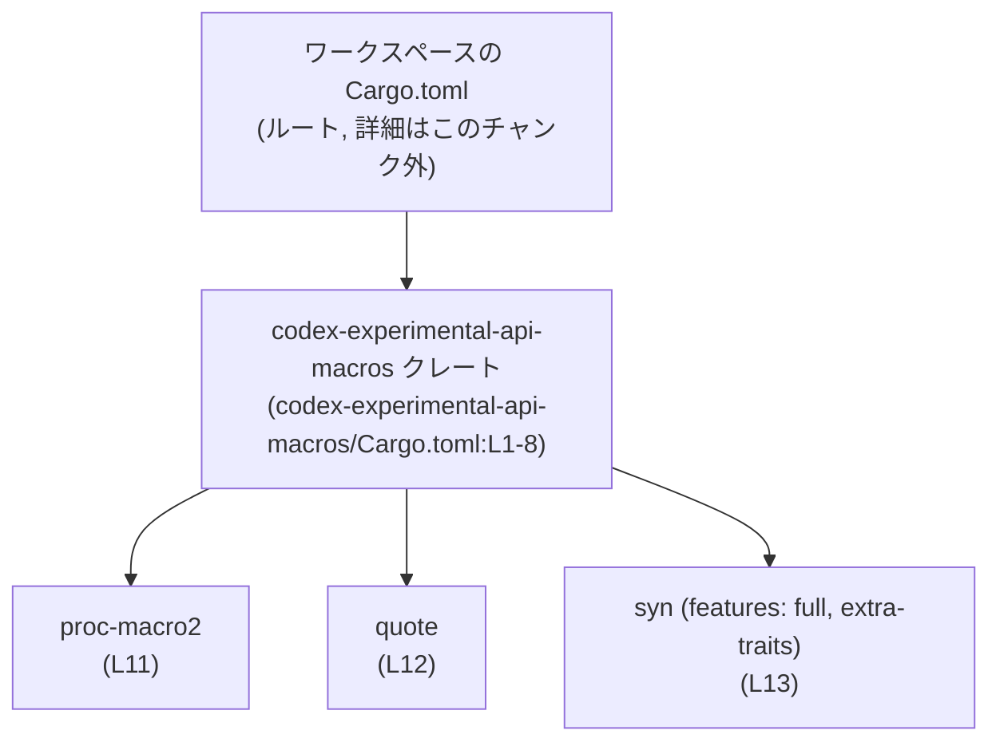
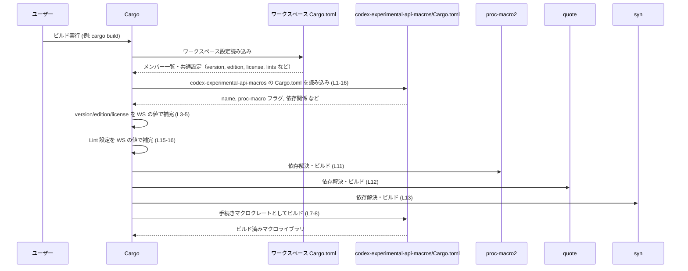

# codex-experimental-api-macros/Cargo.toml コード解説

## 0. ざっくり一言

`codex-experimental-api-macros` クレートを **手続きマクロ（proc-macro）ライブラリ** として定義し、ワークスペース由来のメタデータと依存クレート（`proc-macro2`, `quote`, `syn`）を宣言する Cargo マニフェストです（`codex-experimental-api-macros/Cargo.toml:L1-5,L7-13`）。

---

## 1. このモジュールの役割

### 1.1 概要

- このファイルは Rust のビルドツール Cargo 用の設定ファイル（`Cargo.toml`）です。
- `codex-experimental-api-macros` という名前のクレートを **ワークスペースに属する手続きマクロライブラリ** として定義しています（`L1-2,L7-8`）。
- バージョン・Edition・ライセンス・Lint 設定をワークスペースに委譲し、マクロ実装でよく用いられる `proc-macro2`, `quote`, `syn` を依存として宣言しています（`L3-5,L10-13,L15-16`）。

### 1.2 アーキテクチャ内での位置づけ

- `[package]` セクションで、このクレートがワークスペースの一員であることが示されています（`version.workspace = true` など、`L3-5`）。
- `[lib]` セクションで `proc-macro = true` と指定されており、このクレートは **ライブラリかつ手続きマクロクレート** としてビルドされます（`L7-8`）。
- `[dependencies]` で宣言されている 3 つのクレートは、このマクロクレートのビルド時依存関係です（`L10-13`）。
- `[lints] workspace = true` により、Lint（コンパイラ警告の方針）はワークスペース側で集中管理されます（`L15-16`）。

ビルド時の依存関係を簡略化して図示すると次のようになります。



※ この図は、`codex-experimental-api-macros/Cargo.toml:L1-16` に記載された情報だけに基づく **ビルド時依存関係** の図です。  
どのクレートがこのマクロクレートを実際に利用しているかは、このチャンクからは分かりません。

### 1.3 設計上のポイント

コード（設定）から読み取れる設計上の特徴は次のとおりです。

- **ワークスペース集中管理**  
  - バージョン・Edition・ライセンス・Lint 設定をワークスペースに委譲しています（`L3-5,L15-16`）。
  - 複数クレート間でこれらを一貫させる構成になっています。
- **手続きマクロ専用クレート**  
  - `[lib] proc-macro = true` により、このライブラリは通常のライブラリではなく **手続きマクロクレート** として扱われます（`L7-8`）。
- **マクロ実装向けの典型的依存関係**  
  - `proc-macro2`, `quote`, `syn` という、Rust のソースコードを解析・生成する際によく使われるライブラリに依存しています（`L11-13`）。
  - ただし、実際にどの API を使っているかはこのファイルからは分かりません。

---

## 2. 主要な機能一覧

このファイル自体は「実行時機能」ではなく「ビルド設定」を提供します。Cargo.toml としての主な役割は次のとおりです（全て `codex-experimental-api-macros/Cargo.toml:L1-16` に基づく）。

- 手続きマクロクレートとしてのライブラリ定義
- ワークスペース共通のバージョン・Edition・ライセンス設定の継承
- マクロ実装用依存クレート（`proc-macro2`, `quote`, `syn`）の宣言
- Lint 設定のワークスペースへの委譲

### 2.1 コンポーネント一覧（インベントリー）

#### 関数・構造体インベントリー

このファイルは設定ファイルであり、Rust の関数や構造体の定義は含まれません。

| 名前 | 種別 | 定義位置 | 備考 |
|------|------|----------|------|
| （なし） | - | - | このチャンクには関数・構造体・列挙体などのコード定義は現れません。 |

#### 設定コンポーネントインベントリー

| 名前 | 種別 | 説明 | 定義位置 |
|------|------|------|----------|
| `codex-experimental-api-macros` | クレート（パッケージ） | 手続きマクロを提供するライブラリとしてビルドされるクレート | `Cargo.toml:L1-2,L7-8` |
| `[package]` | Cargo セクション | クレート名と、バージョン・Edition・ライセンスをワークスペースから継承する設定 | `Cargo.toml:L1-5` |
| `name = "codex-experimental-api-macros"` | パッケージ名 | クレートの公開名。他クレートから依存指定する際の名前 | `Cargo.toml:L2` |
| `version.workspace = true` | ワークスペース継承 | バージョン番号をワークスペースの設定から継承 | `Cargo.toml:L3` |
| `edition.workspace = true` | ワークスペース継承 | Rust Edition（例: 2021）をワークスペースから継承 | `Cargo.toml:L4` |
| `license.workspace = true` | ワークスペース継承 | ライセンス情報をワークスペースから継承 | `Cargo.toml:L5` |
| `[lib]` | Cargo セクション | ライブラリクレートに関する設定を保持 | `Cargo.toml:L7-8` |
| `proc-macro = true` | ライブラリ属性 | このライブラリが手続きマクロクレートであることを指定 | `Cargo.toml:L8` |
| `[dependencies]` | Cargo セクション | ビルド時に必要な外部クレートの一覧 | `Cargo.toml:L10-13` |
| `proc-macro2 = "1"` | 依存クレート | 手続きマクロ API を安定したインターフェースで扱うためのクレート（一般論） | `Cargo.toml:L11` |
| `quote = "1"` | 依存クレート | Rust コード断片をトークンストリームとして生成するためのクレート（一般論） | `Cargo.toml:L12` |
| `syn = { version = "2", features = ["full", "extra-traits"] }` | 依存クレート | Rust コードの構文木をパースするためのクレート。`full`, `extra-traits` 機能を有効化 | `Cargo.toml:L13` |
| `[lints]` | Cargo セクション | コンパイラ警告（Lint）のポリシー設定 | `Cargo.toml:L15-16` |
| `workspace = true`（lints） | ワークスペース継承 | Lint 設定をワークスペースのポリシーに合わせる | `Cargo.toml:L16` |

---

## 3. 公開 API と詳細解説

このファイル単体には **関数・メソッド・型の公開 API は一切含まれていません**。  
公開 API（マクロや関数など）は、Cargo の規約に従えば `src/lib.rs`（または `[lib]` セクションで指定されたパス）に定義されるため、そちらのソースコードが必要です。このチャンクには現れません。

### 3.1 型一覧（構造体・列挙体など）

- このファイルは TOML 形式の設定ファイルであり、Rust の型定義は存在しません。
- 型一覧として列挙できる要素はありません（`codex-experimental-api-macros/Cargo.toml:L1-16`）。

### 3.2 関数詳細（最大 7 件）

- 本ファイルには Rust の関数定義が存在しないため、「関数詳細」テンプレートを適用できる対象はありません（`L1-16`）。
- 実際のマクロや関数の挙動は `src/lib.rs` などソースコード側に依存しますが、このチャンクでは確認できません。

### 3.3 その他の関数

- 補助的な関数やラッパー関数についても、このファイルには一切現れません。

---

## 4. データフロー

ここでは、「Cargo がこの `Cargo.toml` をどのように解釈してビルドを進めるか」という **設定上のデータフロー** を簡単に示します。

1. Cargo はワークスペースルートの `Cargo.toml` を読み込み、ワークスペースメンバーとして `codex-experimental-api-macros` クレートを認識します（ワークスペース定義はこのチャンク外）。
2. Cargo はこの `codex-experimental-api-macros/Cargo.toml` を読み込み、`[package]` セクションの `name` と、`version.workspace`, `edition.workspace`, `license.workspace` に基づき、最終的なメタデータを決定します（`L1-5`）。
3. `[lib] proc-macro = true` を見て、このクレートを手続きマクロクレートとしてビルドします（`L7-8`）。
4. `[dependencies]` セクションから `proc-macro2`, `quote`, `syn` への依存関係を解決し、指定されたバージョン・機能でこれらをビルドまたは取得します（`L10-13`）。
5. `[lints] workspace = true` に基づき、ワークスペースで定義された Lint 設定を適用します（`L15-16`）。

これをシーケンス図で表すと次のようになります。



※ 実際のマクロ呼び出し（`#[derive(...)]` や属性マクロ適用）のフローは、このファイルには一切現れません。

---

## 5. 使い方（How to Use）

### 5.1 基本的な使用方法

この `Cargo.toml` は、`codex-experimental-api-macros` クレートの **ビルド定義** そのものです。  
通常、ユーザーが直接編集する場面は次のようなケースです。

- マクロ実装側で新しい依存クレートを追加したいとき
- `syn` の機能フラグを調整したいとき
- ワークスペースのポリシー変更に合わせて設定を追加・変更したいとき

別クレートからこのマクロクレートに依存する典型的な例（あくまで一般的なパターン）は、同じワークスペース内で次のようになります。

```toml
# 例: 同じワークスペース内の別クレートの Cargo.toml から参照する場合
[dependencies]
codex-experimental-api-macros = { path = "codex-experimental-api-macros" } # 実際のパスはプロジェクト構成に依存します
```

上記は依存記述の一例であり、**実際のディレクトリ構成はこのチャンクからは分かりません**。

> このファイルでは Rust コードそのものが定義されていないため、マクロの具体的な呼び出し例（`use` 文やマクロ名など）は示せません。

### 5.2 よくある使用パターン

このファイル単体から読み取れる「使用パターン」は限定的です。代表的なパターンを挙げます。

- **手続きマクロクレートとしてビルドする**  
  - `[lib] proc-macro = true` を設定することで、コンパイラ（`rustc`）がこのクレートを手続きマクロとして扱います（`L7-8`）。
- **マクロ実装で AST を扱う（一般論）**  
  - `syn`（`full`, `extra-traits` を有効化）と `quote` を依存に含める構成は、AST をパースし、コードを生成するマクロクレートでよく見られるパターンです（`L12-13`）。
  - ただし、このクレートが実際にどう使っているかはソースコード側を見ないと分かりません。

### 5.3 よくある間違い

Cargo 設定という観点から、起こりがちな誤りと、このファイルがどうなっているかを対比します。

```toml
# 間違い例: 手続きマクロなのに proc-macro フラグを立てていない
[lib]
# proc-macro = true を指定していないため、通常のライブラリとして扱われてしまう
```

```toml
# 正しい例: このファイルの設定 (L7-8)
[lib]
proc-macro = true  # 手続きマクロクレートとしてビルドされる
```

```toml
# 間違い例: ワークスペースでバージョンを一元管理しているのに、個別に version を書いてしまう
[package]
name = "codex-experimental-api-macros"
version = "0.1.0"  # workspace と矛盾する可能性がある
```

```toml
# 正しい例: このファイルの設定 (L1-5)
[package]
name = "codex-experimental-api-macros"
version.workspace = true   # ワークスペース側に一元化
edition.workspace = true
license.workspace = true
```

### 5.4 使用上の注意点（まとめ）

- **ワークスペース設定との整合性**  
  - `version.workspace`, `edition.workspace`, `license.workspace`, `lints.workspace` を使っているため、ワークスペースのルート `Cargo.toml` を変更すると、このクレートにも影響します（`L3-5,L15-16`）。
- **手続きマクロ特有の性質**  
  - 手続きマクロクレートはコンパイル時に実行されるため、実装の中で `panic!` などが起きると、**コンパイルエラー** として報告されます（一般論）。  
    このファイルだけでは、実装がどうエラー処理しているかは分かりません。
- **依存クレートの機能フラグの影響**  
  - `syn` の `full` 機能は「Rust のほぼすべての構文」をパースする API を有効化するため、一般にコンパイル時間やメモリ消費が増える傾向があります（一般論, `L13`）。  
    実装がどの程度の構文を扱っているかは、このチャンクからは判断できません。

---

## 6. 変更の仕方（How to Modify）

### 6.1 新しい機能を追加する場合

ここでいう「機能」は、マクロ実装を支える設定・依存関係の追加を指します。

1. **実装コード側を確認する**  
   - まず `src/lib.rs` などマクロ実装コードを確認し、何が必要かを把握します。  
   - このチャンクには実装が現れないため、変更時は必ずソースコードと一緒に見る必要があります。
2. **必要な依存クレートを `[dependencies]` に追加する**  
   - 例えば新たに `syn` の別機能や別ライブラリが必要なら、`[dependencies]` に追記します（`L10-13`）。
3. **ワークスペースとの整合性を保つ**  
   - 依存バージョンをワークスペース側で一元管理している場合、個別クレートで直接バージョンを書かず、`workspace = true` を使うかどうかを検討します。  
   - このファイルでは `version/edition/license/lints` はワークスペースから継承していますが、依存クレートについては個別指定です（`L3-5,L11-13,L16`）。
4. **必要なら `syn` の feature を見直す**  
   - AST の範囲が限定的で済む場合、`full` や `extra-traits` を外すことでコンパイルコストを下げられる可能性があります（一般論）。  
   - ただし、実装がこれらの機能に依存している場合はコンパイルエラーになるため、実装を必ず確認します（`L13`）。

### 6.2 既存の機能を変更する場合

- **パッケージ名を変更する場合**  
  - `name = "codex-experimental-api-macros"` を変更すると、他クレートからの依存指定名も合わせて変更する必要があります（`L2`）。  
  - 依存元の `Cargo.toml` と Rust コード（`use` パスなど）を再確認する必要があります。
- **手続きマクロクレートでなくしたい場合**  
  - `proc-macro = true` を削除または `false` にすると、通常のライブラリとしてビルドされますが、既存のマクロ呼び出しはすべて利用できなくなります（`L7-8`）。  
  - 影響範囲はすべての利用クレートに及びます。
- **依存クレートのバージョン変更**  
  - `proc-macro2`, `quote`, `syn` のバージョンを上げ下げする場合、API の変更による影響に注意が必要です（`L11-13`）。  
  - マクロ実装側のコードをビルドして動作確認することが前提になります。

---

## 7. 関連ファイル

この `Cargo.toml` と密接に関係するファイル・ディレクトリ（Cargo の仕様およびこの設定から推論できる範囲）は次のとおりです。

| パス / 場所 | 役割 / 関係 |
|-------------|------------|
| ワークスペースルートの `Cargo.toml` | `version.workspace`, `edition.workspace`, `license.workspace`, `lints.workspace` の具体的な値およびワークスペースメンバー定義を行うファイルです（`codex-experimental-api-macros/Cargo.toml:L3-5,L15-16` より存在が示唆されます）。実際のファイル位置はこのチャンクからは特定できません。 |
| `codex-experimental-api-macros/src/lib.rs`（Cargo のデフォルト想定） | `[lib]` セクションで `path` が指定されていないため、Cargo の規定により、このクレートのライブラリ実装ファイルは `src/lib.rs` であると解釈できます（`L7-8`）。手続きマクロの本体はここに定義されているはずですが、内容はこのチャンクには現れません。 |
| 他クレートの `Cargo.toml` | `codex-experimental-api-macros` を依存として指定している可能性のあるファイル群です。どのクレートが依存しているかは、このチャンクからは不明です。 |

---

### 安全性・エラー・並行性について（このファイルに関するまとめ）

- **安全性**  
  - このファイルはビルド設定のみを記述しており、実行時安全性に直接影響するロジックは含みません（`L1-16`）。
- **エラー**  
  - 不正な設定（例: 存在しない feature 名、矛盾したバージョン指定など）がある場合、Cargo の依存解決時やビルド時にエラーとなります。  
  - このチャンクの範囲では、明らかに無効なキーや構文エラーは見られません。
- **並行性**  
  - 並行実行に関わるコードはこのファイルには一切現れません。  
  - 手続きマクロ実装側でスレッドやグローバル状態をどう扱っているかは、別ファイルの分析が必要です。
