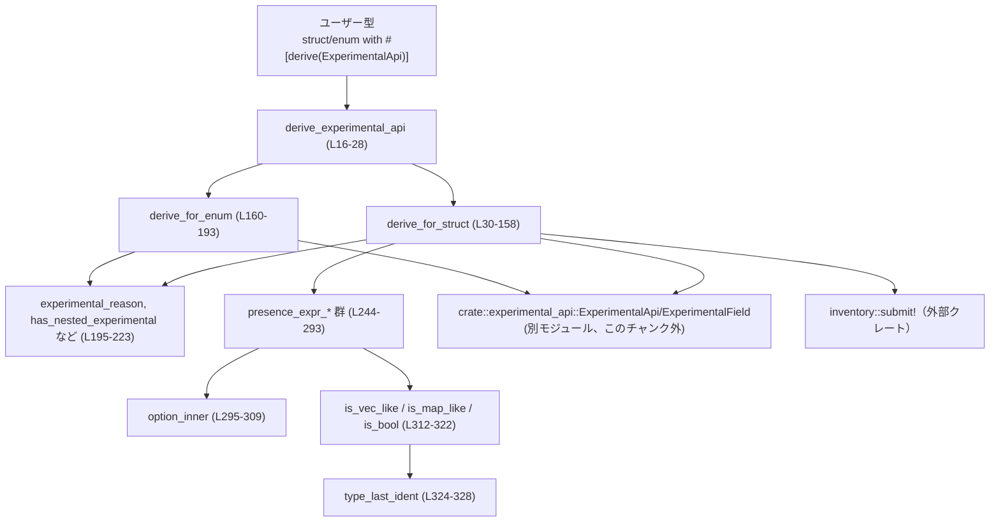
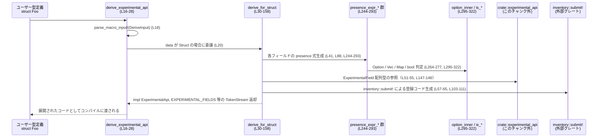
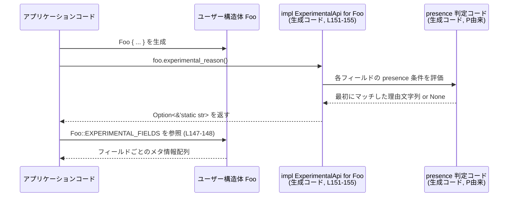

# codex-experimental-api-macros/src/lib.rs

## 0. ざっくり一言

`#[derive(ExperimentalApi)]` と `#[experimental(...)]` 属性を処理する **手続きマクロ（proc_macro）** を定義し、「実験的な API フィールド／バリアント」を自動検出・登録するためのロジックをまとめたファイルです。  
構造体・列挙体に対して `ExperimentalApi` トレイト実装と、実験的フィールド一覧の定数・登録コードを生成します。

---

## 1. このモジュールの役割

### 1.1 概要

- このモジュールは、ユーザー定義の構造体・列挙体に対して `ExperimentalApi` トレイト実装を自動生成するための **derive マクロ** を提供します（`derive_experimental_api`、L16-28）。
- フィールドや列挙バリアントに付いた `#[experimental("理由")]` 属性を読み取り、「なぜこの値は実験的なのか」という理由文字列を返すロジックを生成します（L39-67, L86-112, L164-181）。
- 構造体については `EXPERIMENTAL_FIELDS` という定数と `inventory::submit!` を通じて、全フィールドのメタ情報をグローバルなインベントリに登録します（L48-66, L95-111, L143-149）。
- `Option` や `Vec`／`HashMap`／`BTreeMap`／`bool` などの型に応じて、「値が実際に **存在している** かどうか」を判定するための式（presence expression）も生成します（L244-292）。

### 1.2 アーキテクチャ内での位置づけ

このファイルのコンポーネントと依存関係は、おおよそ次のようになっています。



- `crate::experimental_api::{ExperimentalApi, ExperimentalField}` はこのファイルでは定義されておらず、別モジュールに存在します（使用箇所: L51-55, L58-63, L147-148, L151-153, L184-188）。
- グローバル登録には外部クレート `inventory` の `submit!` マクロを利用しています（L58-65, L104-111）。

### 1.3 設計上のポイント

コードから読み取れる特徴を整理します。

- **コンパイル時コード生成**
  - `#[proc_macro_derive]` により、入力 AST (`syn::DeriveInput`) から Rust コードを生成する構造です（L16-21, L30-32, L160-162）。
- **構造体と列挙体で処理を分割**
  - 構造体: `derive_for_struct` に委譲し、フィールド単位の presence 判定やインベントリ登録を行います（L30-158）。
  - 列挙体: `derive_for_enum` に委譲し、各バリアントについて `Some(reason)`/`None` を返す `match` を生成します（L160-193）。
  - ユニオン: サポートせず、コンパイルエラーを発生させます（L22-26）。
- **属性駆動**
  - `#[experimental("理由")]` … 直接「実験的理由」を持つフィールド／バリアント（`experimental_reason_attr`, L199-205）。
  - `#[experimental(nested)]` … フィールド型の側が `ExperimentalApi` を実装しているとみなし、その `experimental_reason` を委譲して利用します（`has_nested_experimental` / `experimental_nested_attr`, L207-218）。
- **型に応じた presence 判定**
  - `Option<T>`: `Some` かつ中身が「存在する」ときのみ実験的とみなす（L264-268, L280-284）。
  - `Vec` / `HashMap` / `BTreeMap`: `!is_empty()` のときのみ存在するとみなす（L270-272, L286-288）。
  - `bool`: `true` のときのみ存在するとみなす（L273-275, L289-291）。
  - その他の型: 値があれば常に存在するとみなす（L276-277, L292-292）。
- **エラーハンドリング方針**
  - ユーザーがユニオンに `#[derive(ExperimentalApi)]` を付けると、`syn::Error::new_spanned` によりコンパイルエラーが生成されます（L22-26）。
  - `#[experimental(...)]` 属性の引数パースに失敗した場合は `None` と扱い、「実験的ではない」と見なします（L199-205, L211-217）。

---

## 2. 主要な機能一覧

このファイルが提供する主な機能は次のとおりです。

- `#[derive(ExperimentalApi)]` マクロ: 構造体・列挙体に `ExperimentalApi` トレイトの実装を自動生成する（L16-28, L30-158, L160-193）。
- 構造体フィールドの実験的判定ロジック生成:
  - `#[experimental("理由")]` 付きフィールドが「存在している」場合、その理由を返すコードを生成（L39-47, L86-93, L260-276, L279-292）。
- 列挙体バリアントの実験的判定ロジック生成:
  - バリアントに直接付いた `#[experimental("理由")]` に基づき、`match` で理由を返すコードを生成（L164-181）。
- ネストした型の伝播:
  - `#[experimental(nested)]` が付いたフィールドについて、そのフィールド型の `ExperimentalApi::experimental_reason` を呼び出して理由を伝播するコードを生成（L67-77, L112-120, L207-218）。
- 実験的フィールド一覧の提供:
  - 構造体に `EXPERIMENTAL_FIELDS` 定数を追加し、型名／シリアライズ名／理由を含む `ExperimentalField` 配列を生成（L48-56, L95-102, L143-149）。
- インベントリ登録:
  - 各フィールドを `inventory::submit!` を用いてグローバルに登録するコードを生成（L57-65, L103-111）。
- 型に基づく presence 判定ヘルパ:
  - `Option`／`Vec`／`HashMap`／`BTreeMap`／`bool` などの型に対して適切な presence 条件式を組み立てる（L244-292, L295-322）。

---

## 3. 公開 API と詳細解説

### 3.1 型一覧（構造体・列挙体など）

このファイル内で **新たに定義される公開型はありません**。

ただし、以下の外部型が前提となることがコードから読み取れます。

| 名前 | 種別 | 役割 / 用途 | 根拠 |
|------|------|-------------|------|
| `ExperimentalApi` | トレイト（別モジュール） | `experimental_reason(&self) -> Option<&'static str>` を提供するトレイト。構造体・列挙体に対する実装がこのファイルで自動生成されます。 | 実装先: `impl crate::experimental_api::ExperimentalApi for #name`（L151-155, L184-190） |
| `ExperimentalField` | 構造体（別モジュール） | `type_name`, `field_name`, `reason` フィールドを持つメタ情報。実験的フィールド一覧と `inventory::submit!` 登録に使われます。 | フィールド使用: L51-55, L60-63, L147-148 |

これらの型定義そのものは **このチャンクには現れません**。

### 3.2 関数詳細（最大 7 件）

#### 1. `derive_experimental_api(input: TokenStream) -> TokenStream`  

（公開 API／derive マクロ本体）  
根拠: `codex-experimental-api-macros/src/lib.rs:L16-28`

**概要**

- `#[derive(ExperimentalApi)]` に対応する手続きマクロのエントリポイントです。
- 入力 AST（`DeriveInput`）が構造体／列挙体／ユニオンのどれかを判定し、構造体なら `derive_for_struct`、列挙体なら `derive_for_enum` を呼び出して展開コードを生成します。
- ユニオンに対して使われた場合はコンパイルエラーを出します。

**引数**

| 引数名 | 型 | 説明 |
|--------|----|------|
| `input` | `proc_macro::TokenStream` | `#[derive(ExperimentalApi)]` が付いた型定義全体のトークン列。 |

**戻り値**

- 型: `proc_macro::TokenStream`
- 意味: Rust コンパイラに渡す展開済みコード（`impl ExperimentalApi for Xxx` など）です。

**内部処理の流れ**

1. `parse_macro_input!(input as DeriveInput)` で `syn::DeriveInput` にパースします（L18）。
2. `input.data` を `match` し、`Data::Struct`／`Data::Enum`／`Data::Union` に分岐します（L19-21）。
3. 構造体の場合: `derive_for_struct(&input, data)` を呼び、その戻り値の `TokenStream` を返します（L20）。
4. 列挙体の場合: `derive_for_enum(&input, data)` を呼び、その戻り値の `TokenStream` を返します（L21）。
5. ユニオンの場合: `syn::Error::new_spanned` で `"ExperimentalApi does not support unions"` というエラーを作成し、`to_compile_error().into()` でコンパイルエラーを表すコードに変換して返します（L22-26）。

**Examples（使用例）**

ユーザー側では、通常次のように使います。

```rust
use your_crate::ExperimentalApi;        // トレイト（別モジュール、名前は例示）
use your_crate::experimental_api_macros::*; // またはクレートが re-export している derive

#[derive(ExperimentalApi)]
struct MyConfig {
    #[experimental("まだ仕様が固まっていないため")]
    experimental_field: Option<String>, // Someかつ非空文字列なら実験的と判定される可能性がある
    stable_field: i32,
}
```

- 上記のように `#[derive(ExperimentalApi)]` を付けると、この関数がコンパイル時に呼び出され、`impl ExperimentalApi for MyConfig` などが生成されます。

**Errors / Panics**

- ユニオンに対して使うと、コンパイルエラーになります（L22-26）。
- それ以外では、この関数自身がパニックしたり実行時エラーを起こすことはありません（コンパイル時にのみ実行されます）。

**Edge cases（エッジケース）**

- `input.data` が `Struct`/`Enum`/`Union` のいずれでもないケースは `syn::Data` 型の定義上存在しないため、ここでは考慮されていません。
- 属性パースエラーなどは `derive_for_struct` / `derive_for_enum` の内部で処理されます。

**使用上の注意点**

- この derive は **ユニオンをサポートしていません**。ユニオンに付けるとコンパイルが失敗します（L22-26）。
- マクロはコンパイル時に実行されるため、ランタイムでの並行性やパフォーマンスに直接影響することはありません。

---

#### 2. `derive_for_struct(input: &DeriveInput, data: &DataStruct) -> TokenStream`  

（構造体向け展開ロジック）  
根拠: `codex-experimental-api-macros/src/lib.rs:L30-158`

**概要**

- 構造体に対して `ExperimentalApi` トレイト実装と `EXPERIMENTAL_FIELDS` 定数、および `inventory::submit!` による登録コードを生成します。
- フィールドごとに `#[experimental("理由")]` / `#[experimental(nested)]` を解析し、「どの条件で何を理由として返すか」を表す Rust コード片を組み立てます。

**引数**

| 引数名 | 型 | 説明 |
|--------|----|------|
| `input` | `&DeriveInput` | 型名や属性など、型定義全体の情報。 |
| `data`  | `&DataStruct` | 構造体のフィールド情報（名前付き／タプル／ユニット）。 |

**戻り値**

- 型: `TokenStream`
- 意味: 次のような構造のコードを含むトークン列です（概略、実際は `quote!` で生成）。
  - `impl <TypeName> { pub(crate) const EXPERIMENTAL_FIELDS: &'static [ExperimentalField] = ... }`
  - `impl ExperimentalApi for <TypeName> { fn experimental_reason(&self) -> Option<&'static str> { ... } }`
  - 複数の `inventory::submit!` 呼び出し。

**内部処理の流れ（主に named フィールドの場合）**

1. 型名 (`input.ident`) から `LitStr` を作成し、`type_name_lit` として保持します（L31-32）。
2. `data.fields` のバリアント（Named/Unnamed/Unit）に応じて分岐します（L34-35, L82, L125）。
3. 名前付きフィールド (`Fields::Named`) の場合（L35-81）:
   - `checks`, `experimental_fields`, `registrations` の 3 つのベクタを構築します（L36-38）。
   - 各 `field` について:
     - `experimental_reason(&field.attrs)` で `#[experimental("理由")]` 属性を探します（L40）。
       - 見つかった場合:
         - `experimental_presence_expr(field, false)` で「値が存在するか」を判定する式（`expr`）を生成します（L41）。
         - `checks` に `if #expr { return Some(#reason); }` というコード片を追加します（L42-46）。
         - `field_serialized_name(field)` でフィールド名をシリアライズ名（スネークケース→キャメル）に変換し（L48-54）、`ExperimentalField` インスタンスを表す `quote!` を `experimental_fields` と `registrations` に追加します（L50-66）。
       - 見つからないが `has_nested_experimental(field)` が真の場合（L67-77）:
         - `crate::experimental_api::ExperimentalApi::experimental_reason(&self.field)` を呼び、その結果が `Some` ならそれを返すコード片を `checks` に追加します（L71-76）。
4. タプル構造体 (`Fields::Unnamed`) の場合も、インデックスベースでほぼ同様の処理を行います（L82-123, L255-257）。
5. `Fields::Unit` の場合は空のベクタとします（L125）。
6. 最終的に `checks` が空かどうかを見て:
   - 空なら `quote! { None }`（常に `None` を返す）、
   - そうでなければ、`#checks` をすべて展開した後に `None` を返すコードを生成します（L128-135）。
7. `experimental_fields` が空かどうかを見て、空なら `&[]`、そうでなければ生成したフィールド配列への参照を返すコードを作ります（L137-141）。
8. 以上を `quote!` でまとめ、`EXPERIMENTAL_FIELDS` 定数と `ExperimentalApi` トレイト実装、および `inventory::submit!` 呼び出しのセットとして `expanded` を構成します（L143-156）。
9. `expanded.into()` で `TokenStream` に変換して返します（L157-157）。

**Examples（使用例）**

ユーザー側の構造体例（named フィールド）:

```rust
#[derive(ExperimentalApi)]
struct FeatureFlags {
    #[experimental("このフラグはまだ実験段階です")]
    new_search_enabled: bool,                       // true のときだけ実験的理由を返す

    #[experimental("内部仕様検証用")]
    extra_logging: Option<Vec<String>>,             // Some かつ Vec が非空のときのみ理由を返す

    #[experimental(nested)]
    nested: NestedConfig,                           // NestedConfig 側の ExperimentalApi 実装に委譲

    stable: i32,                                    // 実験属性なし → 対象外
}
```

この構造体に対しては、おおよそ次のようなコードが生成されます（簡略化、挙動イメージ）:

```rust
impl FeatureFlags {
    pub(crate) const EXPERIMENTAL_FIELDS: &'static [ExperimentalField] = &[
        ExperimentalField {
            type_name: "FeatureFlags",
            field_name: "newSearchEnabled",        // snake_to_camel による変換
            reason: "このフラグはまだ実験段階です",
        },
        ExperimentalField {
            type_name: "FeatureFlags",
            field_name: "extraLogging",
            reason: "内部仕様検証用",
        },
    ];
}

impl ExperimentalApi for FeatureFlags {
    fn experimental_reason(&self) -> Option<&'static str> {
        if self.new_search_enabled {
            return Some("このフラグはまだ実験段階です");
        }
        if self.extra_logging.as_ref().is_some_and(|value| !value.is_empty()) {
            return Some("内部仕様検証用");
        }
        if let Some(reason) = ExperimentalApi::experimental_reason(&self.nested) {
            return Some(reason);
        }
        None
    }
}
```

**Errors / Panics**

- この関数自体は `syn::Error` を生成しません（ユニオンは `derive_experimental_api` で処理）。
- 属性の解析に失敗した場合（例えば `#[experimental(123)]` のような不正な形）は `experimental_reason`／`experimental_nested_attr` が `None` / `false` を返し、「実験的でない」と扱われます（L195-205, L211-217）。コンパイルエラーにはなりません。

**Edge cases**

- **`Option<Option<T>>` 等の多重 Option**
  - `presence_expr_for_access`／`presence_expr_for_ref` が再帰的に `option_inner` を呼ぶため、`Some(Some(...))` などの多重 `Option` にも対応します（L264-268, L280-284, L295-309）。
- **未知のコンテナ型**
  - `is_vec_like`／`is_map_like`／`is_bool` で判定できない型は、常に「存在する」と見なされます（L270-277, L286-293）。
- **タプル構造体**
  - `experimental_presence_expr` は `tuple_struct` が `true` の場合 `None` を返す設計ですが、この関数内からは常に `false` を渡しているため、現状のコードでは **タプル構造体用に `experimental_presence_expr` は使われていません**（L41, L244-252）。タプル構造体は `index_presence_expr` を通じて別経路で処理されます（L88-89, L255-257）。

**使用上の注意点**

- フィールドに `#[experimental("理由")]` を付けても、presence 判定条件により「値がない」と判断される場合は `experimental_reason` が `None` を返します。
  - 例: `Option<T>` フィールドなので `None` のとき、`Vec` なのに空、`bool` が `false` のときなど。
- `#[experimental(nested)]` を付けたフィールド型は `ExperimentalApi` トレイトを実装している必要があります。実装されていない場合は、その型に対する `impl ExperimentalApi` が存在しないためコンパイルエラーになります（このファイル外の問題ですが、呼び出しコードから推測できます: L71-73, L115-116）。

---

#### 3. `derive_for_enum(input: &DeriveInput, data: &DataEnum) -> TokenStream`  

根拠: `codex-experimental-api-macros/src/lib.rs:L160-193`

**概要**

- 列挙体に対して `ExperimentalApi` トレイト実装を自動生成します。
- 各バリアントに付いた `#[experimental("理由")]` 属性を解析し、そのバリアントにマッチしたとき `Some(reason)` を返す `match` 式を構築します。

**引数**

| 引数名 | 型 | 説明 |
|--------|----|------|
| `input` | `&DeriveInput` | 型名など、列挙体全体の情報。 |
| `data`  | `&DataEnum` | 列挙体バリアントの情報。 |

**戻り値**

- 型: `TokenStream`
- 意味: 対象列挙体の `impl ExperimentalApi for <EnumName>` を含むコード。

**内部処理の流れ**

1. 型名を取得し（L161）、`match_arms` ベクタを初期化します（L162）。
2. 各 `variant` についてループします（L164-181）。
3. バリアントのフィールド形態に応じてパターンを決定します（L166-170）。
   - 名前付きフィールド: `Self::VariantName { .. }`
   - タプル（Unnamed）: `Self::VariantName ( .. )`
   - ユニット: `Self::VariantName`
4. `experimental_reason(&variant.attrs)` で `#[experimental("理由")]` 属性を探します（L171）。
5. 属性が見つかれば、そのパターンに `=> Some(#reason),` を対応させ、なければ `=> None,` を対応させます（L172-180）。
6. 最後に、すべての `match_arms` を含む `match self { ... }` を `quote!` で生成し、`impl ExperimentalApi for #name` に埋め込みます（L183-190）。

**Examples（使用例）**

```rust
#[derive(ExperimentalApi)]
enum ApiVersion {
    #[experimental("Alpha 版です")]
    Alpha,

    #[experimental("Beta 版です")]
    Beta,

    Stable,
}
```

生成される `ExperimentalApi` 実装イメージ:

```rust
impl ExperimentalApi for ApiVersion {
    fn experimental_reason(&self) -> Option<&'static str> {
        match self {
            Self::Alpha => Some("Alpha 版です"),
            Self::Beta => Some("Beta 版です"),
            Self::Stable => None,
        }
    }
}
```

**Errors / Panics**

- バリアントごとの属性パースに失敗した場合は `experimental_reason` が `None` を返すだけで、コンパイルエラーにはなりません（L195-205）。
- フィールド付きバリアントでも、フィールドの内容による presence 判定は行われません（この関数はバリアントレベルのみを見ています）。

**Edge cases**

- どのバリアントにも `#[experimental(...)]` が付いていない場合、`experimental_reason` は常に `None` を返します。
- 同じバリアントに複数の `experimental` 属性が付いている場合の挙動は、このファイルからは明確ではありません。
  - `attrs.iter().find_map(experimental_reason_attr)` により **最初にマッチしたものだけ** を使うと読めますが（L195-197）、属性の並び順がどうなるかは入力コード次第です。

**使用上の注意点**

- 列挙体では **フィールドの状態に応じた presence 判定は行われません**。バリアントに `#[experimental("理由")]` が付いていれば、そのバリアントであるかどうかだけで判定されます。

---

#### 4. `experimental_presence_expr(field: &Field, tuple_struct: bool) -> Option<TokenStream>`  

根拠: `codex-experimental-api-macros/src/lib.rs:L244-253`

**概要**

- 名前付き構造体フィールドに対して、「このフィールドの値が存在しているか」を判定する式を生成します。
- 現状は named フィールド（`tuple_struct == false`）にのみ使われており、`self.field_name` へのアクセスを基点とします。

**引数**

| 引数名 | 型 | 説明 |
|--------|----|------|
| `field` | `&Field` | `syn` のフィールド AST。名前・型・属性が含まれます。 |
| `tuple_struct` | `bool` | タプル構造体用かどうかのフラグ。`true` の場合は処理を行わず `None` を返します。 |

**戻り値**

- 型: `Option<proc_macro2::TokenStream>`
- 意味:
  - `Some(expr)` の場合: `expr` は `self.field_name` の存在性を判定する式です（例: `self.flag`, `self.values.is_empty()` の否定など）。
  - `None` の場合: 名前がないフィールド（タプル構造体）などで presence 判定を生成できないことを示します。

**内部処理の流れ**

1. `tuple_struct` が `true` なら早期に `None` を返します（L248-250）。
2. `field.ident.as_ref()?` によりフィールド名を取得できなければ `None` を返します（L251）。
3. それ以外の場合、`presence_expr_for_access(quote!(self.#ident), &field.ty)` を呼び出し、その結果を `Some(...)` で包んで返します（L252）。

**Examples（使用例）**

`derive_for_struct` の中での使用:

```rust
if let Some(reason) = experimental_reason(&field.attrs) {
    let expr = experimental_presence_expr(field, /*tuple_struct*/ false); // L41
    checks.push(quote! {
        if #expr {
            return Some(#reason);
        }
    });
}
```

ここで `expr` は例えば次のような形になります。

- `bool` フィールド → `self.flag`（L273-275）。
- `Vec<T>` フィールド → `!self.items.is_empty()`（L270-272）。
- `Option<T>` フィールド → `self.value.as_ref().is_some_and(|value| ...)`（L264-268）。

**Errors / Panics**

- `field.ident.as_ref()?` は `Option` を使った早期 return であり、パニックの可能性はありません（L251）。
- この関数は構造体フィールドの AST に対してのみ使われ、ランタイムでは実行されません。

**Edge cases**

- タプル構造体やユニット構造体のフィールドには対応しておらず、その場合は `None` を返します。実際には、タプル構造体は `index_presence_expr` で処理されています（L82-123, L255-257）。

**使用上の注意点**

- 呼び出し側は `None` の場合を考慮する必要があります。`derive_for_struct` では named フィールドにのみ使われているため、現状は `Some(_)` しか出てきません。

---

#### 5. `presence_expr_for_access(access: TokenStream, ty: &Type) -> TokenStream`  

根拠: `codex-experimental-api-macros/src/lib.rs:L260-277`

**概要**

- 任意の「値へのアクセス式」と「その型」から、「その値が実際に**存在する**と見なせるかどうか」を判定する Rust 式を生成します。
- 主に `self.field` や `self.0` などのフィールドアクセスに対して使用されます。

**引数**

| 引数名 | 型 | 説明 |
|--------|----|------|
| `access` | `proc_macro2::TokenStream` | `self.field` や `self.0` などのアクセス式。 |
| `ty` | `&Type` | 上記アクセス式の型。`Option<T>` か、`Vec`/`HashMap`/`BTreeMap`/`bool` か、その他かを判定するために使います。 |

**戻り値**

- 型: `proc_macro2::TokenStream`
- 意味: boolean 式（`bool` として評価される式）。`true` なら「値が存在している」とみなします。

**内部処理の流れ**

1. `option_inner(ty)` で `Option<Inner>` かどうかを調べます（L264-265, L295-309）。
   - `Some(inner)` の場合:
     - `presence_expr_for_ref(quote!(value), inner)` を再帰的に呼び出し、「内部の値」の存在判定式を得ます（L265-266, L279-284）。
     - `access.as_ref().is_some_and(|value| inner_expr)` という式を返します（L267-268）。
2. `Option` でなければ、`is_vec_like(ty) || is_map_like(ty)` を調べます（L270-271, L312-317）。
   - 真なら `!access.is_empty()` を返します（L271-272）。
3. それでもなければ `is_bool(ty)` を調べます（L273-274, L320-321）。
   - 真なら `access` 自体を返します（L274-275）。
4. 上記どれにも当てはまらない場合、常に `true` を返す式 `quote! { true }` を生成します（L276-277）。

**Examples（使用例）**

- `access = quote!(self.flags)`、`ty = Vec<T>`  
  → 生成される式: `!self.flags.is_empty()`
- `access = quote!(self.enabled)`、`ty = bool`  
  → 生成される式: `self.enabled`
- `access = quote!(self.optional)`、`ty = Option<Vec<T>>`  
  → 生成される式（イメージ）:

```rust
self.optional.as_ref().is_some_and(|value| !value.is_empty())
```

**Errors / Panics**

- この関数は AST から式を組み立てるだけであり、自身がパニックする経路はありません。
- ただし、生成された式中で `is_empty` や `as_ref` が存在しない型に対して呼ばれると、コンパイルエラーになります。
  - そのような状況になるのは、`ty` と `access` が矛盾した場合ですが、呼び出し側（このファイル内）では `ty` を AST から一貫して取得しているため、通常は発生しないと考えられます。

**Edge cases**

- `Option<Option<T>>` や `Option<HashMap<..>>` のようなネストした型に対しても、`option_inner` と `presence_expr_for_ref` の再帰により適切な存在判定式が生成されます（L264-268, L280-284）。
- `type alias` などで最終識別子が `Vec`／`HashMap`／`BTreeMap` になっていない場合、対応する型として認識されません。  
  例: `type MyVec<T> = Vec<T>;` を使うと、`is_vec_like` は `MyVec` を `Vec` と認識しません（L312-313）。

**使用上の注意点**

- 「どの型を '存在するコレクション' と見なすか」は `is_vec_like`／`is_map_like` に埋め込まれています。対応型を増やす場合はこれらの関数を拡張する必要があります（L312-317）。
- 生成されるコードはランタイムで実行されるため、非常に大きなコレクションに対して頻繁に `is_empty()` を呼ぶとそれなりのコストが発生します。ただし `is_empty` 自体は通常 O(1) です。

---

#### 6. `option_inner(ty: &Type) -> Option<&Type>`  

根拠: `codex-experimental-api-macros/src/lib.rs:L295-309`

**概要**

- `type` が `Option<T>` かどうかを判定し、`T` の `syn::Type` を返すヘルパ関数です。
- 上述の presence 判定ロジックにおいて、`Option` の中身の型を再帰的に調べるために使われます。

**引数**

| 引数名 | 型 | 説明 |
|--------|----|------|
| `ty` | `&Type` | 解析対象の型 AST。 |

**戻り値**

- 型: `Option<&Type>`
- 意味:
  - `Some(inner_ty)` の場合: `ty` が `Option<inner_ty>` であることを示します。
  - `None` の場合: `ty` が `Option` でない、または期待どおりにパースできない型であることを示します。

**内部処理の流れ**

1. `let Type::Path(type_path) = ty else { return None; }`  
   → シンプルなパス型（`Option<T>` など）でなければ `None`（L295-297）。
2. `type_path.path.segments.last()?` で最後のセグメント（`Option` や `std::option::Option` の `Option` 部分）を取得します（L299-300）。
3. `segment.ident != "Option"` なら `None` を返します（L300-301）。
4. `segment.arguments` が `AngleBracketed` であることを確認できなければ `None` を返します（L303-305）。
5. 角括弧内の引数から最初の `GenericArgument::Type(inner)` を探し、それを返します（L306-309）。

**使用例（概念的）**

```rust
if let Some(inner) = option_inner(&field.ty) {
    // field.ty は Option<inner> 型
}
```

**Errors / Panics**

- `else { return None; }` と `?` を使った早期 return のみであり、パニックは発生しません。

**Edge cases**

- `Option` に型パラメータが 2 つ以上あるような不正なケース（通常は存在しません）は、一番最初に現れた `GenericArgument::Type(inner)` のみを返します（L306-309）。
- `std::option::Option<T>` のような完全修飾名でも、最後の識別子が `Option` であれば対応します（L299-301）。

---

#### 7. `snake_to_camel(s: &str) -> String`  

根拠: `codex-experimental-api-macros/src/lib.rs:L226-241`

**概要**

- スネークケース（`snake_case`）の文字列をキャメルケース（`camelCase`）に変換するユーティリティです。
- 実験的フィールドの「シリアライズ名」を生成する際に使われます（`field_serialized_name` から呼び出し、L220-223）。

**引数**

| 引数名 | 型 | 説明 |
|--------|----|------|
| `s` | `&str` | スネークケース形式の文字列（例: `"my_field"`）。 |

**戻り値**

- 型: `String`
- 意味: 変換後の文字列（例: `"myField"`）。

**内部処理の流れ**

1. 入力長と同じ容量を持つ `String` を作成します（L227）。
2. `upper` というフラグを `false` で初期化します（L228）。
3. `s.chars()` をループし、各文字 `ch` を処理します（L229-240）。
   - `ch == '_'` のとき:
     - `upper = true` にし、`continue` で次の文字に進みます（L230-233）。
   - それ以外のとき:
     - `upper` が `true` なら `ch.to_ascii_uppercase()` を `out` に push し、`upper = false` に戻します（L234-236）。
     - `upper` が `false` ならそのまま `ch` を push します（L237-239）。
4. ループ終了後 `out` を返します（L241）。

**Examples（使用例）**

- `"new_feature_flag"` → `"newFeatureFlag"`
- `"x"` → `"x"`
- `"alreadyCamel"` → `"alreadyCamel"`（アンダースコアがないので変更されません）

**Errors / Panics**

- パニックする可能性はありません。

**Edge cases**

- 連続するアンダースコア `"foo__bar"` の場合:
  - `"fooBar"` になります（2 個目の `_` も次の文字を大文字にするだけで、連続しても影響は 1 度きりです）。
- 末尾がアンダースコア `"foo_"` の場合:
  - 最後の `_` で `upper = true` になりますが、後続の文字がないため何も追加されず、結果は `"foo"` になります。

**使用上の注意点**

- ロケールに依存しない ASCII ベースの大文字化（`to_ascii_uppercase`）を行っているため、非 ASCII 文字が含まれる場合の挙動は単純なコピーになります。

---

### 3.3 その他の関数

このファイルに定義されているその他の関数の一覧です。

| 名前 | 種別 | 役割（1 行） | 定義位置 |
|------|------|--------------|----------|
| `experimental_reason` | 関数 | 属性配列から最初に見つかった `#[experimental(...)]` を `LitStr` として返すヘルパ。 | `codex-experimental-api-macros/src/lib.rs:L195-197` |
| `experimental_reason_attr` | 関数 | 単一属性が `experimental` であり、引数が `LitStr` の場合にそれを返す。 | `codex-experimental-api-macros/src/lib.rs:L199-205` |
| `has_nested_experimental` | 関数 | フィールドに `#[experimental(nested)]` が付いているかどうかを判定する。 | `codex-experimental-api-macros/src/lib.rs:L207-208` |
| `experimental_nested_attr` | 関数 | 属性が `experimental` かつ引数が識別子 `nested` なら `true` を返す。 | `codex-experimental-api-macros/src/lib.rs:L211-217` |
| `field_serialized_name` | 関数 | フィールド識別子からキャメルケースのシリアライズ名を生成する。 | `codex-experimental-api-macros/src/lib.rs:L220-223` |
| `index_presence_expr` | 関数 | タプル構造体フィールド（インデックスアクセス）の presence 判定式を生成する。 | `codex-experimental-api-macros/src/lib.rs:L255-257` |
| `presence_expr_for_ref` | 関数 | 参照経由でアクセスする値に対する presence 判定式を生成する。`presence_expr_for_access` の参照版。 | `codex-experimental-api-macros/src/lib.rs:L279-292` |
| `is_vec_like` | 関数 | 型の最終識別子が `Vec` かどうかを判定する。 | `codex-experimental-api-macros/src/lib.rs:L312-313` |
| `is_map_like` | 関数 | 型の最終識別子が `HashMap` または `BTreeMap` かどうかを判定する。 | `codex-experimental-api-macros/src/lib.rs:L316-317` |
| `is_bool` | 関数 | 型の最終識別子が `bool` かどうかを判定する。 | `codex-experimental-api-macros/src/lib.rs:L320-321` |
| `type_last_ident` | 関数 | `Type::Path` から最後の識別子（例: `Vec`, `HashMap`）を取得する。 | `codex-experimental-api-macros/src/lib.rs:L324-328` |

---

## 4. データフロー

ここでは、構造体に対して `ExperimentalApi` を derive したときの典型的なデータフローを説明します。

### 4.1 コンパイル時のフロー



### 4.2 実行時のフロー（構造体の場合）



- presence 判定ロジックは `derive_for_struct` 内で `quote!` により生成され、ランタイムで実行されます。
- `ExperimentalApi::experimental_reason` は、最初に「存在する」と判定された実験的フィールドまたはネストした型の理由文字列を返し、それ以外は `None` を返します（L128-135, L151-155）。

---

## 5. 使い方（How to Use）

### 5.1 基本的な使用方法

構造体に対して実験的フィールドを定義し、それを調査する基本フローの例です。

```rust
// 実際にはこの derive が使えるようにクレート依存関係を設定しておく必要があります。
use your_crate::ExperimentalApi;         // トレイト（別モジュール、名称は例示）
use your_crate::ExperimentalApiMacros::*; // derive マクロを提供するモジュール（例示）

#[derive(ExperimentalApi)]
struct Config {
    #[experimental("まだ正式サポート前のオプションです")]
    beta_option: Option<String>,          // Some かつ非空なら実験的

    #[experimental(nested)]
    nested: NestedConfig,                 // ネスト先に委譲

    stable: i32,                          // 実験的ではない
}

#[derive(ExperimentalApi)]
struct NestedConfig {
    #[experimental("ネストされた実験フィールド")]
    nested_flag: bool,                    // true のとき実験的
}

fn main() {
    let cfg = Config {
        beta_option: Some("value".to_string()),
        nested: NestedConfig { nested_flag: false },
        stable: 42,
    };

    // 実験的理由を確認
    if let Some(reason) = cfg.experimental_reason() {
        println!("この Config は実験的です: {reason}");
    }

    // 構造体レベルの実験的フィールド一覧
    for field in Config::EXPERIMENTAL_FIELDS {
        println!("type={}, field={}, reason={}",
                 field.type_name, field.field_name, field.reason);
    }
}
```

この例では:

- `cfg.experimental_reason()` は `Some("まだ正式サポート前のオプションです")` を返す可能性があります（`beta_option` の存在と内容に依存）。
- `NestedConfig` の `nested_flag` は `false` なので、`#[experimental(nested)]` フィールド経由では理由は返りません。

### 5.2 よくある使用パターン

1. **フラグ型の実験オプション**

   - `bool` フィールドに `#[experimental("理由")]` を付けると、フラグが `true` のときのみ実験的と判定されます（L273-275）。

   ```rust
   #[derive(ExperimentalApi)]
   struct Feature {
       #[experimental("新しい UI の実験フラグ")]
       new_ui: bool,
   }
   ```

2. **コレクションの存在で判定**

   - `Vec`／`HashMap`／`BTreeMap` フィールドに `#[experimental("理由")]` を付けると、**非空** のときのみ実験的と判定されます（L270-272）。

   ```rust
   #[derive(ExperimentalApi)]
   struct FeatureConfig {
       #[experimental("実験対象のエンドポイント一覧")]
       experimental_endpoints: Vec<String>, // 非空の場合のみ実験的
   }
   ```

3. **ネストした設定オブジェクト**

   - `#[experimental(nested)]` を使うと、ネストした型の `experimental_reason` を再利用できます（L67-77, L112-120, L207-218）。

   ```rust
   #[derive(ExperimentalApi)]
   struct Parent {
       #[experimental(nested)]
       child: ChildConfig,
   }
   ```

### 5.3 よくある間違い

```rust
#[derive(ExperimentalApi)]
struct BadConfig {
    // 間違い例: 引数なしの experimental 属性
    // #[experimental]
    // 上記のような形だと parse_args::<LitStr>() に失敗し、
    // experimental_reason_attr が None を返すため「実験的ではない」と扱われます。

    // 正しい例: 理由を文字列で渡す
    #[experimental("ちゃんと理由を書く")]
    field: Option<String>,
}

// 間違い例: experimental(nested) なのに ChildConfig が ExperimentalApi を実装していない
#[derive(ExperimentalApi)]
struct Parent {
    #[experimental(nested)]
    child: ChildConfig, // ChildConfig に ExperimentalApi 実装がないとコンパイルエラーになる
}
```

- `#[experimental]` のように引数を省略すると、単なる `Attribute` にはなりますが `experimental_reason_attr`（L199-205）では `parse_args::<LitStr>()` が失敗し `None` と扱われます。
- `#[experimental(nested)]` を使う場合、対象フィールド型にも `ExperimentalApi` 実装を用意する必要があります（L71-73, L115-116）。

### 5.4 使用上の注意点（まとめ）

- **安全性（Rust らしい観点）**
  - すべてのロジックはコンパイル時コード生成か、単純なフィールドアクセス・メソッド呼び出しで構成されており、`unsafe` コードは含まれていません（このチャンクには `unsafe` ブロックが存在しません）。
  - 生成されるコードも、フィールドへの通常のアクセスや標準的なメソッド (`is_empty`, `as_ref`) の呼び出しのみです。
- **エラーハンドリング**
  - ユニオンに対する derive は明示的にコンパイルエラーになります（L22-26）。
  - 属性書式の誤りは「実験的ではない」とみなされるだけで、エラーにはなりません（L195-205, L211-217）。
- **並行性**
  - マクロ本体はコンパイル時に実行されるため、ランタイムでのスレッド安全性やデータ競合の問題はありません。
  - `inventory` によるインベントリ登録のスレッド安全性は `inventory` クレート側の実装に依存し、このファイルからは詳細は分かりません。
- **性能面**
  - ランタイムで行われる処理は、`experimental_reason` の `if` チェックと `is_empty`／`is_some_and` などの軽量なメソッド呼び出しに限られます。
  - コレクションの大きさにかかわらず `is_empty` は多くの標準コレクションで O(1) です。

---

## 6. 変更の仕方（How to Modify）

### 6.1 新しい機能を追加する場合

1. **新しいコンテナ型の presence 判定を追加したい場合**

   - 例: `SmallVec` や独自のコレクションを「空かどうか」で判定したい場合。
   - 変更箇所:
     - `is_vec_like` / `is_map_like` と同様のヘルパを追加し（L312-317 を参考にする）、
     - `presence_expr_for_access` / `presence_expr_for_ref` でそのヘルパを参照するようにする（L270-272, L286-288）。
   - 契約:
     - 新しいヘルパは `type_last_ident` と組み合わせて動作する前提になっています（L324-328）。

2. **別の属性パラメータをサポートしたい場合**

   - 例: `#[experimental(nested, reason = "...")]` のような複合指定。
   - 変更箇所:
     - `experimental_reason_attr`（L199-205）と `experimental_nested_attr`（L211-217）で `attr.parse_args` のパースロジックを拡張します。
   - 注意:
     - 現状は `LitStr` または `Ident`（`nested`）の単一引数を前提としているため、新しい構文を導入するときは後方互換性を意識する必要があります。

### 6.2 既存の機能を変更する場合

- **presence 判定の意味を変更する**

  - 影響範囲:
    - `presence_expr_for_access`（L260-277）と `presence_expr_for_ref`（L279-292）、それに依存する `experimental_presence_expr`／`index_presence_expr`（L244-253, L255-257）。
  - 契約:
    - 現状、`Option` は「`Some` かつ中身が存在」、コレクションは「非空」、`bool` は「true」を存在条件としています。
    - ここを変えると、既存ユーザーの「どの値のときに実験的と判定されるか」が変化するため、互換性に注意が必要です。

- **フィールドのシリアライズ名を変えたい**

  - 影響範囲:
    - `field_serialized_name`（L220-223）と `snake_to_camel`（L226-241）。
  - 契約:
    - 現状は「フィールド識別子をキャメルケースに変換」という前提で `ExperimentalField.field_name` を生成しています（L51-54, L97-100）。
    - API 利用者が `field_name` をキーとして利用している場合、ここを変えると互換性に影響します。

- **Bugs / Security 観点での注意**

  - このチャンクから見える範囲では、明確なメモリ安全性の問題やパニック経路はありません。
  - ただし、`is_vec_like`／`is_map_like` が単に識別子名で判定しているため、ユーザー定義型で偶然同じ名前を持つ場合に意図しない挙動になる可能性があります（L312-317）。
    - 例: `struct Vec { /* ... */ }` という型を使うと、それを「コレクション」と誤認識します。
  - セキュリティ上重要な値に対して `ExperimentalApi` を利用する場合は、presence 判定のルールを理解したうえでフィールド型を設計する必要があります。

- **テスト戦略（このファイルからは不明だが推奨される観点）**

  - このチャンクにはテストコードは含まれていません。
  - 変更時には以下のようなテストが有用です（存在するかどうかは不明ですが、推奨される観点です）:
    - `#[experimental]` のパターンごと（`Option`, `Vec`, `HashMap`, `bool`, その他の型）。
    - `#[experimental(nested)]` を用いたネスト構造。
    - 無効な属性引数が「実験的ではない」と扱われること。
    - ユニオンへの derive がコンパイルエラーになること。

---

## 7. 関連ファイル

このモジュールと密接に関係すると推測できるファイル／モジュールです。

| パス / モジュール | 役割 / 関係 |
|-------------------|------------|
| `crate::experimental_api` | `ExperimentalApi` トレイトおよび `ExperimentalField` 構造体を提供するモジュールです。本ファイル内の生成コードはここに依存しています（L51-55, L60-63, L147-148, L151-153, L184-188）。 |
| `inventory` クレート | `::inventory::submit!` マクロを提供し、`ExperimentalField` をグローバルインベントリに登録する仕組みを担います（L57-65, L103-111）。 |

これらの具体的な実装内容やファイル構造は、このチャンクには現れないため不明です。
