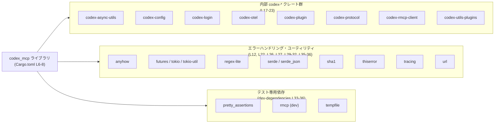
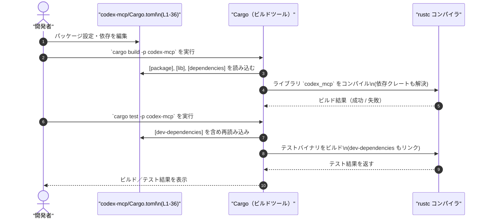

# codex-mcp/Cargo.toml コード解説

## 0. ざっくり一言

`codex-mcp/Cargo.toml` は、`codex-mcp` パッケージ／ライブラリ `codex_mcp` の **Cargo マニフェスト** であり、クレート名・ライブラリエントリポイント・ワークスペース設定と依存クレート（本番用・開発用）を定義しています（codex-mcp/Cargo.toml:L1-5, L6-8, L11-36）。

---

## 1. このモジュールの役割

### 1.1 概要

- このファイルは、Rust のビルドツール Cargo が参照する設定ファイルです。
- `codex-mcp` パッケージの基本情報（名前・版数・ライブラリのエントリポイント）と、使用する依存クレート・有効化する機能フラグを宣言しています（L1-5, L6-8, L11-36）。
- 版数・ライセンス・エディションおよびほとんどの依存はワークスペースの共通設定を参照する構成になっています（`workspace = true`, L2, L3, L5, L12-23, L25, L26, L28-32, L34, L36）。

### 1.2 アーキテクチャ内での位置づけ

`codex-mcp` クレートと、その依存クレート群との高レベルな関係を示します。個々の依存ごとではなく、グループ化して 10 ノード以内に収めています。



- `codex_mcp` ライブラリ（L6-8）が、内部の `codex-*` クレート群（L17-23）と、一般的なライブラリ群（L12, L22, L26, L27, L29-32, L35）、およびテスト用ライブラリ群（L33-36）に依存する構成になっています。
- ここでは依存関係の「存在」のみが分かり、具体的にどの関数・型をどう呼んでいるかは、このチャンクには現れません（実装は `src/lib.rs` などにあり、このチャンクには含まれません）。

### 1.3 設計上のポイント

コード（マニフェスト）から読み取れる設計上の特徴は次のとおりです。

- **ワークスペース一元管理**  
  - エディション・ライセンス・バージョンはすべてワークスペース設定に委任されています（`edition.workspace = true`, `license.workspace = true`, `version.workspace = true`, L2, L3, L5）。
  - ほとんどの依存クレートも `workspace = true` で宣言されており、バージョンや一部の共通オプションはワークスペース側で管理される前提です（L12-23, L25, L26, L28-32, L34, L36）。

- **ライブラリクレートとしての公開**  
  - [lib] セクションで `name = "codex_mcp"`、`path = "src/lib.rs"` を指定しており、ライブラリクレートとしてビルドされます（L6-8）。
  - バイナリターゲット（[[bin]] など）はこのファイルには現れないため、実行可能クレートとしてのエントリポイントがあるかどうかは不明です。

- **非同期・並行処理を想定した依存**  
  - `async-channel`, `futures`, `tokio`, `tokio-util` など非同期実行関連クレートへの依存が宣言されています（L13, L22, L29, L30）。
  - これにより、`codex-mcp` が非同期処理を行う可能性が高いと推測できますが、具体的な並行性制御やエラーハンドリングの実装はこのチャンクには現れません（推測の根拠はクレート名と一般的な用途です）。

- **プロトコル／RPC 関連の依存**  
  - `rmcp` と `codex-rmcp-client` に依存し、`rmcp` では `default-features = false` としつつ `"base64", "macros", "schemars", "server"` 機能を有効化しています（L24, L27, L35）。
  - クライアント／サーバー型のプロトコル処理を行う可能性が推測されますが、どのようなプロトコルかはこのファイルからは分かりません。

- **シリアライゼーション / 設定系の依存**  
  - `serde`（derive 機能付き）と `serde_json` に依存しており（L25, L26）、構造体のシリアライズ／デシリアライズを行う設計であることが示唆されます。
  - `codex-config` という内部クレートへの依存もあり（L18）、設定管理機能が別クレートに分離されている構造と解釈できます。

---

## 2. 主要な機能一覧（マニフェストとしての機能）

このファイル自体は関数やロジックを持たず、「機能」というより **ビルド／依存管理の設定** を提供します。マニフェストとしての主要な役割を列挙します。

- パッケージメタデータの定義: パッケージ名 `codex-mcp` とワークスペース由来のエディション・バージョン・ライセンスを指定（L1-5）。
- ライブラリターゲットの定義: ライブラリ名 `codex_mcp` と実装ファイル `src/lib.rs` を指定（L6-8）。
- Lints 設定の共有: `lints.workspace = true` により、ワークスペース共通の lint 設定を利用（L9-10）。
- 本番用依存クレートの宣言: [dependencies] セクションで、エラー処理／非同期／シリアライズ／プロトコルなど多数のクレートへの依存と、一部 features を指定（L11-32）。
- テスト・開発専用依存クレートの宣言: [dev-dependencies] セクションで、テストに用いるクレートを別途指定（L33-36）。

---

## 3. 公開 API と詳細解説

### 3.1 型一覧（構造体・列挙体など）

- このファイルは Cargo の設定ファイルであり、**Rust の型（構造体・列挙体など）は一切定義されていません**。
- 型やモジュールの定義は `src/lib.rs` などのソースファイル側に存在するはずですが、その内容はこのチャンクには現れません。

### 3.2 関数詳細（最大 7 件）

- このファイルには **関数定義やメソッド定義は存在しません**。
- したがって、「関数詳細テンプレート」に沿って説明できる対象はこのチャンクにはありません。
- 実際の公開 API（関数・メソッド・型）の一覧や詳細は `src/lib.rs` 等のコードから読み取る必要がありますが、それらはこのチャンクには含まれていないため不明です。

### 3.3 その他の関数

- Cargo.toml 内に関数的な要素（スクリプトやビルドロジック）は定義されていません。
- `[build-dependencies]` や `build = "build.rs"` などの記述もなく（このチャンクには現れません）、ビルドスクリプトの有無は不明です。

---

## コンポーネントインベントリー（このチャンクで確認できる単位）

このチャンクに現れる「コンポーネント」（パッケージ・ライブラリターゲット・依存クレート）を一覧にします。

| コンポーネント名 | 種別 | 説明 | 根拠 |
|------------------|------|------|------|
| `codex-mcp` | Cargo パッケージ | このクレートのパッケージ名。ワークスペースに属する（エディション・バージョン・ライセンスはワークスペース依存）。 | L1-5 |
| `codex_mcp` | ライブラリターゲット | ライブラリクレート名。エントリポイントは `src/lib.rs` に設定。 | L6-8 |
| ワークスペース版数・ライセンス | ワークスペース設定参照 | `edition.workspace`, `license.workspace`, `version.workspace` により、これらの情報をルートワークスペースから取得。 | L2-3, L5 |
| `lints.workspace` | Lint 設定 | lint 設定もワークスペース共通設定を利用する指定。 | L9-10 |
| `anyhow` | 依存クレート | エラー表現用クレートへの依存。ワークスペース設定を参照。 | L12 |
| `async-channel` | 依存クレート | 非同期チャネル用クレートへの依存。ワークスペース設定を参照。 | L13 |
| `codex-async-utils` | 依存クレート | `codex-*` 系内部クレートの一つ。ワークスペース設定を参照。 | L17 |
| `codex-config` | 依存クレート | 設定管理関連と推測される内部クレート。ワークスペース設定を参照。 | L18 |
| `codex-login` | 依存クレート | ログイン処理関連と推測される内部クレート。 | L19 |
| `codex-otel` | 依存クレート | OpenTelemetry 連携と推測される内部クレート。 | L20 |
| `codex-plugin` | 依存クレート | プラグイン機構関連と推測される内部クレート。 | L21 |
| `codex-protocol` | 依存クレート | プロトコル定義関連と推測される内部クレート。 | L19 |
| `codex-rmcp-client` | 依存クレート | `rmcp` クライアント機能を提供する内部クレートと推測。 | L22 |
| `codex-utils-plugins` | 依存クレート | プラグイン向けユーティリティ内部クレートと推測。 | L23 |
| `futures` | 依存クレート | 非同期処理用の共通トレイトセットへの依存。 | L22 |
| `regex-lite` | 依存クレート | 正規表現処理用クレートへの依存。 | L23 |
| `rmcp` (prod) | 依存クレート | プロトコル関連クレート。`default-features = false` で `"base64", "macros", "schemars", "server"` 機能を有効化。 | L24 |
| `serde` | 依存クレート | シリアライズ／デシリアライズ用。`features = ["derive"]` を有効化。 | L25 |
| `serde_json` | 依存クレート | JSON 用シリアライズ／デシリアライズ。 | L26 |
| `sha1` | 依存クレート | SHA-1 ハッシュ計算用クレート。 | L27 |
| `thiserror` | 依存クレート | エラー型定義補助クレート。 | L28 |
| `tokio` | 依存クレート | 非同期ランタイム。`features = ["macros", "rt-multi-thread"]` を有効化。 | L29 |
| `tokio-util` | 依存クレート | `tokio` 補助ユーティリティ。`features = ["rt"]` を有効化。 | L30 |
| `tracing` | 依存クレート | 構造化ログ／トレース出力用クレート。 | L31 |
| `url` | 依存クレート | URL パース用クレート。 | L32 |
| `pretty_assertions` | dev 依存 | テスト時の見やすいアサート出力向けクレート。 | L34 |
| `rmcp` (dev) | dev 依存 | テスト時にも `rmcp` を利用。設定は本番用と同じ。 | L35 |
| `tempfile` | dev 依存 | 一時ファイル操作用クレート。テストでの利用が想定される。 | L36 |

> 補足: クレート名からの用途推測（「〜と推測」）は、一般的なクレートの役割に基づくものであり、このチャンクのコードだけからは厳密には確認できません。

---

## 4. データフロー

このファイル自体は実行時の処理を持ちませんが、**ビルド時・テスト時にどのように参照されるか** という観点でのフローを示します。

### 4.1 ビルド／テスト時のマニフェスト利用フロー



- `Cargo.toml` は、開発者が依存を追加・変更する入口であり（L11-36）、Cargo がビルド対象クレート・依存クレート・機能フラグを解釈するためのソースとなります（L6-8）。
- dev-dependencies はテスト・ベンチマーク・例示プログラムなどで利用され、通常の `cargo build` ではリンクされない点に注意が必要です（一般的な Cargo の仕様に基づく説明です）。

---

## 5. 使い方（How to Use）

ここでは、「`codex-mcp` プロジェクトの一部としてこの `Cargo.toml` をどう扱うか」という観点で説明します。

### 5.1 基本的な使用方法

代表的な操作は「依存の追加・変更」と「機能フラグの調整」です。

```toml
# パッケージ情報（ワークスペースから継承）
[package]
edition.workspace = true
license.workspace = true
name = "codex-mcp"
version.workspace = true

# ライブラリターゲット
[lib]
name = "codex_mcp"
path = "src/lib.rs"

# 本番用依存の追加例
[dependencies]
anyhow = { workspace = true }

# 新しい依存を追加する場合の例
my-new-crate = "0.1"                # ワークスペース外の新規依存を直指定する場合
# あるいは
# my-new-crate = { workspace = true }  # ワークスペースルート側で定義済みの場合
```

- 既存のスタイルに合わせるなら、まずワークスペースルートの `Cargo.toml` に依存を追加し、その後このファイルでは `{ workspace = true }` で参照する構成にそろえるのが自然です（ワークスペース一元管理という設計に沿います）。

### 5.2 よくある使用パターン

1. **内部 `codex-*` クレートの追加**

   - 新しい内部クレート（例: `codex-foo`）を追加したい場合、ワークスペースルートにメンバとして登録しつつ、この `codex-mcp` の `[dependencies]` に `codex-foo = { workspace = true }` を追加する、という使い方が想定されます。
   - ただし、具体的にどの内部クレートがどこで使われるかは、このチャンクには現れません。

2. **非同期機能の feature 調整**

   ```toml
   tokio = { workspace = true, features = ["macros", "rt-multi-thread"] }
   ```

   - ここで tokio の features を変更することで、`codex-mcp` 内の非同期実行モデル（例: シングルスレッド vs マルチスレッド）に影響を与えることができます（L29）。
   - feature を削る／追加する場合は、実際のコード（`src/lib.rs` 等）がその機能に依存していないかを確認する必要があります。

3. **プロトコル関連機能の feature 調整**

   ```toml
   rmcp = { workspace = true, default-features = false,
            features = ["base64", "macros", "schemars", "server"] }
   ```

   - `rmcp` の `default-features` を無効にし、必要な機能のみ明示的に有効化する方針が取られています（L24, L35）。
   - 機能の ON/OFF は、特徴的な API の有無・サーバー機能の有無などに影響しうるため、変更には注意が必要です。

### 5.3 よくある間違い

このファイルから推測できる、起こりやすい誤り例とその正しい書き方を示します。

```toml
# 誤り例: ライブラリパスと実際のファイル構成がずれている
[lib]
name = "codex_mcp"
path = "src/main.rs"   # 実際には src/lib.rs しか存在しないケースなど

# 正しい例: 実際のライブラリ実装ファイルを指す
[lib]
name = "codex_mcp"
path = "src/lib.rs"
```

- `path` が実在しないファイルや、ライブラリ用でないファイル（`main.rs` など）を指すとビルドエラーになります。  
  このチャンクでは `path = "src/lib.rs"` と指定されているため、`src/lib.rs` がライブラリ実装ファイルとして存在することが前提です（L8）。

```toml
# 誤り例: ワークスペース依存とバージョン直指定を混在させる
[dependencies]
anyhow = "1.0"                  # ワークスペースが anyhow のバージョンを管理しているのに直書きする
tokio = { workspace = true, features = ["macros"] }

# 推奨される書き方（このプロジェクトのスタイルに合わせる）
[dependencies]
anyhow = { workspace = true }   # 版数はワークスペース側に任せる
tokio = { workspace = true, features = ["macros", "rt-multi-thread"] }
```

- このファイルでは `workspace = true` を使った一元管理が基本方針なので、個別のバージョン指定を混ぜると管理が複雑になります（L2-5, L12-23, L25, L26, L28-32, L34, L36）。

### 5.4 使用上の注意点（まとめ）

- **ワークスペースへの依存**  
  - `edition`, `license`, `version`、ほとんどの依存はワークスペース設定に依存しています（L2-5, L12-23, L25, L26, L28-32, L34, L36）。  
  - このクレート単体で切り出して使う場合、ワークスペース側の `Cargo.toml` がないとビルドできない点に注意が必要です。

- **feature 変更の影響範囲**  
  - `rmcp`, `tokio`, `serde` などに対して明示的に features が指定されています（L24-25, L29-30, L35）。  
  - feature を削除するとコンパイルエラーになる可能性があるため、コード側の利用状況を確認することが前提条件になります。

- **セキュリティ上の観点（sha1）**  
  - `sha1` クレートへの依存があります（L27）。SHA-1 は一般に衝突攻撃が知られているハッシュであり、セキュリティクリティカルな用途（署名・改ざん検出）に使う場合は注意が必要です。  
  - ただし、このチャンクには `sha1` の具体的な利用箇所が現れないため、実際の用途は不明です。

- **非同期ランタイムの選択**  
  - `tokio` は `rt-multi-thread` を有効にしているため（L29）、マルチスレッドランタイムに依存したコードである可能性があります。  
  - ランタイムの切り替えや feature の削減は、並行性の前提を覆す可能性があるため、変更には注意が必要です。

---

## 6. 変更の仕方（How to Modify）

### 6.1 新しい機能を追加する場合（依存を増やす）

新しい機能を `codex-mcp` に追加する際、依存クレートを追加する流れの一例です。

1. **ワークスペース側の確認**  
   - まずルートのワークスペース `Cargo.toml`（このチャンクには現れません）で、追加したいクレートが既に `dependency` として定義されているかを確認します。
   - 既にあれば、このファイルでは `{ workspace = true }` だけで参照できます（本ファイルでそのスタイルが使われている例: L12-23, L25, L26, L28-32, L34, L36）。

2. **新規依存の追加**  

   ```toml
   [dependencies]
   # 既存の依存…
   url = { workspace = true }

   # 新しい依存を追加
   my-new-crate = { workspace = true }
   ```

   - ワークスペース外の依存であれば、バージョンを直接指定する必要があります。

3. **実装コード側の変更（このチャンクには現れない）**  
   - `src/lib.rs` などで新しいクレートを `use` し、機能を追加します。
   - このステップの詳細は、このチャンクの情報だけでは説明できません。

### 6.2 既存の機能を変更する場合（依存や feature を変える）

- **依存の削除**  
  - 依存を削除する前に、プロジェクト内でそのクレートが参照されていないかを検索し、利用が残っていないことを確認します。
  - 例えば `regex-lite` を削除したい場合、`use regex_lite::...` などの記述がないかを実装コード側で確認する必要があります（`regex-lite` 自体の宣言は L23 にあります）。

- **feature の変更**  
  - `rmcp` の `server` 機能を無効にするなどの変更は、サーバー関連 API の有無に影響します（L24, L35）。
  - feature を変更した場合は、`cargo check`, `cargo test` などでビルド・テストを行い、影響範囲を確認することが重要です。

- **テスト専用依存の調整**  
  - dev-dependencies（L33-36）は本番バイナリには影響しませんが、テストコードでは必須になる場合があります。  
  - `tempfile` 等を削除・変更する場合は、`tests/` や `src/` 内の `#[cfg(test)]` ブロックを確認する必要があります（ただし、これらのコードはこのチャンクには現れません）。

---

## 7. 関連ファイル

このマニフェストと密接に関係するであろうファイル／ディレクトリをまとめます（存在は Cargo の一般的な構成から推測していますが、このチャンクには中身は現れません）。

| パス | 役割 / 関係 |
|------|------------|
| `codex-mcp/src/lib.rs` | [lib] セクションの `path = "src/lib.rs"` に対応するライブラリ実装ファイル（L8）。`codex_mcp` の公開 API やコアロジックはここに定義されていると考えられますが、このチャンクには内容は現れません。 |
| ルートワークスペース `Cargo.toml` | `edition.workspace = true`, `license.workspace = true`, `version.workspace = true` および多くの依存の `{ workspace = true }` の定義元（L2-5, L12-23, L25, L26, L28-32, L34, L36）。このファイルと組み合わせて、完全なビルド設定が決まります。 |
| `codex-*` 各クレートのディレクトリ | `codex-async-utils`, `codex-config`, `codex-login` など内部クレート群の実装。`codex-mcp` の機能の一部は、これらのクレートに委譲されていると考えられますが、このチャンクには詳細は現れません。 |

---

### このチャンクから分からないことの明示

- `codex_mcp` が提供する具体的な型・関数・モジュール構造
- 非同期処理やエラーハンドリングの具体的なパターン
- `rmcp` や `codex-rmcp-client` を通じて扱うプロトコルの詳細
- 各依存クレートの実際の利用箇所・利用方法

これらはすべて `src/lib.rs` などのソースコード側に依存しており、**この Cargo.toml のチャンク単体からは読み取れません**。
