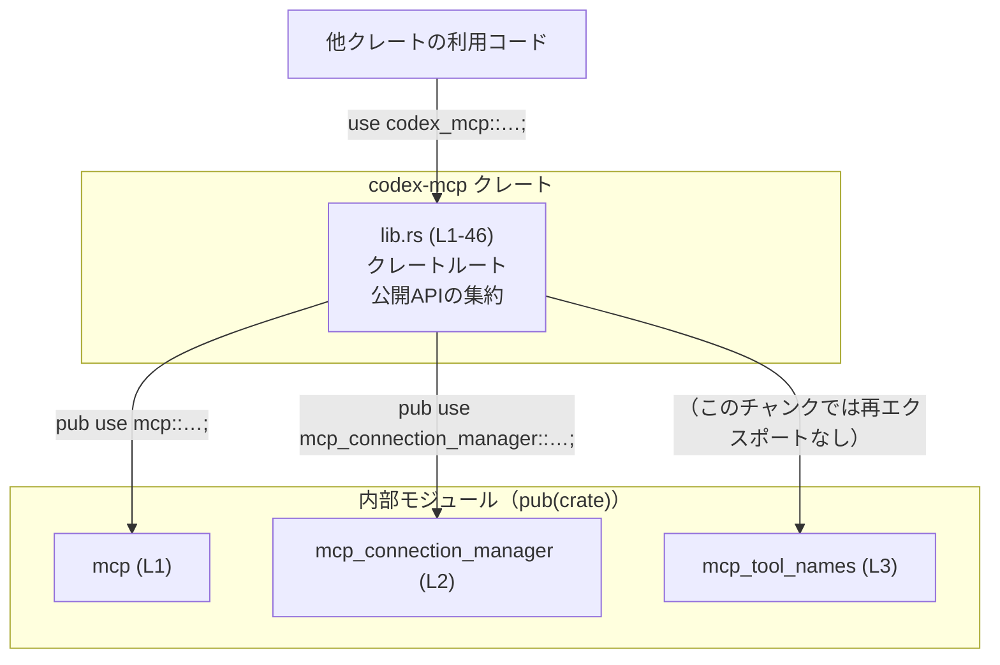
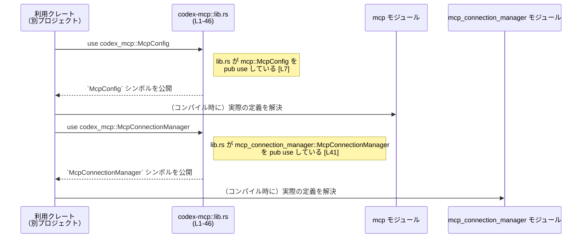

# codex-mcp/src/lib.rs コード解説

## 0. ざっくり一言

- `codex-mcp` クレートのルートモジュールであり、内部モジュール `mcp` / `mcp_connection_manager` / `mcp_tool_names` を宣言し、そのうち `mcp` と `mcp_connection_manager` から多数の項目を再エクスポートして「公開 API の入口」をまとめる役割のファイルです（`pub(crate) mod` と `pub use` が並んでいる構成から判断できます）[codex-mcp/src/lib.rs:L1-3, L5-46]。

---

## 1. このモジュールの役割

### 1.1 概要

- このモジュールは `codex-mcp` クレートの**公開 API を集約するファサード**として機能します。
- 内部実装は `mcp`・`mcp_connection_manager`・`mcp_tool_names` モジュール側にあり、このファイルではそれらを `pub use` で再エクスポートすることで、利用者が `codex_mcp::…` という単純なパスでアクセスできるようにしています [L1-3, L5-46]。
- コアロジック・エラーハンドリング・並行性制御などの具体的な処理はこのファイルには含まれておらず、**このファイルは純粋にモジュール構成と API 表面の定義のみ**を行っています。

### 1.2 アーキテクチャ内での位置づけ

- `pub(crate) mod mcp;` / `pub(crate) mod mcp_connection_manager;` / `pub(crate) mod mcp_tool_names;` により、3 つの内部モジュールがクレート内に存在します [L1-3]。
- `pub(crate)` 修飾子により、これらのモジュールはクレート内部からは見えますが、**他クレートからは `codex_mcp::mcp` のようには直接アクセスできません**。
- 代わりに、必要な型・関数などを `pub use mcp::…;` / `pub use mcp_connection_manager::…;` で再エクスポートし、外部には `codex_mcp::McpConfig` 等として見せています [L5-46]。

この構造を簡略化した依存関係図です（このチャンクの範囲: `lib.rs` L1-46）:



- `mcp_tool_names` は宣言されていますが、このファイル内では `pub use` されておらず、**現時点ではクレート内部専用のモジュール**であると読み取れます [L3]。

### 1.3 設計上のポイント

コードから読み取れる設計上の特徴は次のとおりです。

- **ファサードパターン的な公開面の集約**  
  - 内部モジュールを `pub(crate)` とし、外部には個々のシンボル（型・関数など）のみを `pub use` で再エクスポートする方針になっています [L1-3, L5-46]。
  - これにより「どのモジュールから来たか」を意識せずに、`codex_mcp::…` だけで主な API にアクセスできる構造です。
- **モジュール境界でのカプセル化**  
  - 内部モジュール全体を公開せず、必要な項目だけを選択的に外に出すことで、内部構造のカプセル化と後方互換性の維持を意図している設計と解釈できます。
- **このファイルには状態やロジックが存在しない**  
  - 変数定義・関数定義・`impl` ブロックなどはなく、**バグ・エラーハンドリング・並行性制御はすべて他ファイル側の責務**です。
- **安全性・エラー・並行性に関する情報の欠如**  
  - `unsafe` キーワードや `async` 関連の記述はこのファイルには存在しません [L1-46]。したがって、Rust 特有の安全性・エラー処理・並行性に関する具体的な契約は、`mcp` / `mcp_connection_manager` 側の定義を参照する必要があります（このチャンクでは不明）。

---

## 2. 主要な機能一覧（コンポーネントインベントリー・概要）

このファイルに現れる項目を、**名前と役割（主に命名規則からの推測）ごとにグルーピング**します。  
※ 種別や役割は、明示されていないものについては「命名からの推測」であることを明記します。

### 2.1 MCP サーバ設定・管理系（主に `mcp` 由来）

- `McpConfig`（型と推定）: MCP サーバの設定を表す型と推定されます [L7]。
- `McpManager`（型と推定）: MCP 関連の管理（サーバの起動・停止や状態管理など）を行う管理オブジェクトと推定されます [L8]。
- `CODEX_APPS_MCP_SERVER_NAME`（定数と推定）: Codex Apps の MCP サーバ名を表す定数と推定されます [L5]。
- `canonical_mcp_server_key`（関数または値と推定）: MCP サーバを一意に識別するキーを正規化する API と推定されます [L16]。
- `configured_mcp_servers`（API 項目）: 設定済み MCP サーバ一覧を取得する API である可能性があります [L25]。
- `effective_mcp_servers`（API 項目）: 実際に有効な MCP サーバ一覧を返す API である可能性があります [L27]。
- `with_codex_apps_mcp`（API 項目）: Codex Apps 用 MCP を有効化したコンテキストを構築するようなユーティリティである可能性があります [L36]。

（※ いずれも型／関数かどうかはこのファイルだけでは確定できません。）

### 2.2 OAuth ログイン・スコープ系（`mcp` 由来）

- `McpOAuthLoginConfig`（型と推定）: OAuth ログイン設定を保持する型と推定されます [L9]。
- `McpOAuthLoginSupport`（型と推定）: OAuth ログインをサポートする機能のフラグまたはハンドラーと推定されます [L10]。
- `McpOAuthScopesSource`（型と推定）: OAuth スコープのソース（どこからスコープを取得するか）を示す型と推定されます [L11]。
- `ResolvedMcpOAuthScopes`（型と推定）: 実際に解決されたスコープ集合を表現する型と推定されます [L14]。
- `oauth_login_support`（API 項目）: OAuth ログインサポート情報を取得する API と推定されます [L30]。
- `discover_supported_scopes`（API 項目）: サーバや設定からサポートされる OAuth スコープを探索する API と推定されます [L26]。
- `resolve_oauth_scopes` / `should_retry_without_scopes`（API 項目）: スコープの解決や再試行ポリシーに関する API と推定されます [L32-33]。

### 2.3 スナップショット・ステータス収集系（`mcp` 由来）

- `McpServerStatusSnapshot` / `McpSnapshotDetail`（型と推定）: サーバ状態のスナップショットおよび詳細情報を表す型と推定されます [L12-13]。
- `collect_mcp_server_status_snapshot*` 4 種類（API 項目）: サーバの状態スナップショットを収集し、詳細の有無や呼び出し元（マネージャ経由かどうか）でバリエーションを持つ API 群と推定されます [L17-18, L20-22]。
- `collect_mcp_snapshot*` 系（API 項目）: MCP 全体のスナップショットを取得する API 群と推定されます [L19-22].
- `collect_missing_mcp_dependencies`（API 項目）: 不足している MCP 依存関係を収集する API と推定されます [L23]。
- `compute_auth_statuses` / `McpAuthStatusEntry`（型＋API 項目）: 認証状態を計算し、結果をエントリとして表現する仕組みと推定されます [L6, L24]。

### 2.4 ツール情報・グルーピング・フィルタリング系

- `ToolPluginProvenance` / `tool_plugin_provenance`（型＋API 項目）: ツールプラグインの由来情報を表す型と、その由来を取得する API と推定されます [L15, L35]。
- `group_tools_by_server`（API 項目）: MCP ツールをサーバ単位にグルーピングする API と推定されます [L28]。
- `qualified_mcp_tool_name_prefix` / `split_qualified_tool_name`（API 項目）: 修飾付きツール名の prefix 取得や分割を行う名前操作ユーティリティと推定されます [L31, L34]。
- `CodexAppsToolsCacheKey` / `codex_apps_tools_cache_key`（型＋API 項目）: Codex Apps 用ツールキャッシュのキー型と、そのキー生成ユーティリティと推定されます [L37, L44]。
- `ToolInfo`（型と推定）: MCP ツールに関するメタ情報を保持する型と推定されます [L43]。
- `filter_non_codex_apps_mcp_tools_only`（API 項目）: Codex Apps 以外の MCP ツールだけを抽出するフィルタリング API と推定されます [L46]。
- `declared_openai_file_input_param_names`（API 項目）: OpenAI ファイル入力用パラメータ名を収集する API と推定されます [L45]。

### 2.5 接続管理・サンドボックス状態系（`mcp_connection_manager` 由来）

- `McpConnectionManager`（型と推定）: MCP サーバとの接続を管理するコンポーネントと推定されます [L41]。
- `SandboxState`（型と推定）: サンドボックス環境の状態を表す列挙体または構造体と推定されます [L42]。
- `DEFAULT_STARTUP_TIMEOUT`（定数と推定）: 起動時タイムアウトのデフォルト値と推定されます [L38]。
- `MCP_SANDBOX_STATE_CAPABILITY` / `MCP_SANDBOX_STATE_METHOD`（定数と推定）: サンドボックス状態機能に関する capability 名・メソッド名などの識別子と推定されます [L39-40]。

> 上記の「役割」はすべて命名からの推測であり、**厳密な契約や型シグネチャはこのファイルからは読み取れません**。

---

## 3. 公開 API と詳細解説

### 3.1 型一覧（構造体・列挙体など、推定を含む）

パスカルケースや全大文字の識別子は、Rust の慣例から「型」や「定数」である可能性が高いですが、このファイルだけでは完全には断定できません。そのため **「種別（推定）」列**を設けています。

| 名前 | 種別（推定） | 役割 / 用途（命名からの推測） | 定義元モジュール | lib.rs 上の場所 |
|------|--------------|-------------------------------|------------------|------------------|
| `CODEX_APPS_MCP_SERVER_NAME` | 定数 | Codex Apps MCP サーバ名を表す識別子 | `mcp` | `codex-mcp/src/lib.rs:L5` |
| `McpAuthStatusEntry` | 型（構造体/enum） | 認証状態の 1 エントリを表現 | `mcp` | L6 |
| `McpConfig` | 型 | MCP サーバ設定 | `mcp` | L7 |
| `McpManager` | 型 | MCP 管理コンポーネント | `mcp` | L8 |
| `McpOAuthLoginConfig` | 型 | OAuth ログイン用の設定 | `mcp` | L9 |
| `McpOAuthLoginSupport` | 型 | OAuth ログインをサポートする機能フラグ／構造 | `mcp` | L10 |
| `McpOAuthScopesSource` | 型 | OAuth スコープ情報のソース種別 | `mcp` | L11 |
| `McpServerStatusSnapshot` | 型 | サーバ状態スナップショット | `mcp` | L12 |
| `McpSnapshotDetail` | 型 | スナップショットの詳細情報 | `mcp` | L13 |
| `ResolvedMcpOAuthScopes` | 型 | 解決済み OAuth スコープ集合 | `mcp` | L14 |
| `ToolPluginProvenance` | 型 | ツールプラグインの由来を表す | `mcp` | L15 |
| `CodexAppsToolsCacheKey` | 型 | Codex Apps 向けツールキャッシュキー | `mcp_connection_manager` | L37 |
| `DEFAULT_STARTUP_TIMEOUT` | 定数 | 起動時のデフォルトタイムアウト | `mcp_connection_manager` | L38 |
| `MCP_SANDBOX_STATE_CAPABILITY` | 定数 | サンドボックス状態機能の capability 名など | `mcp_connection_manager` | L39 |
| `MCP_SANDBOX_STATE_METHOD` | 定数 | サンドボックス状態取得メソッド名など | `mcp_connection_manager` | L40 |
| `McpConnectionManager` | 型 | MCP 接続管理コンポーネント | `mcp_connection_manager` | L41 |
| `SandboxState` | 型 | サンドボックス状態 | `mcp_connection_manager` | L42 |
| `ToolInfo` | 型 | MCP ツールの情報 | `mcp_connection_manager` | L43 |

> 「型」か「定数」かは、**再エクスポート側からは区別できません**。ここでは一般的な命名慣例に基づき推定しています。

### 3.2 重要 API 項目の詳細（関数形式で使われそうなもの）

以下は、**関数として利用される可能性が高い API 項目**を 7 件選び、テンプレートに沿って説明します。ただし、このファイルにはシグネチャや実装が存在しないため、**引数・戻り値・内部処理・エラー条件はすべて「不明」**であることを明示します。

#### `collect_mcp_snapshot`（シグネチャ不明）

**概要**

- `mcp` モジュールから再エクスポートされる API 項目です [L19]。
- 名前からは「MCP に関するスナップショットを収集する処理」であることが想像されますが、**具体的な仕様はこのチャンクには現れません**。

**引数**

| 引数名 | 型 | 説明 |
|--------|----|------|
| 不明 | 不明 | このファイルにはシグネチャが存在しないため、不明です。 |

**戻り値**

- 型・意味ともに、このファイルからは読み取れません。

**内部処理の流れ**

- 実装が `mcp` モジュール側にあり、このファイルには記述がないため不明です。

**Examples（使用例）**

```rust
// 再エクスポートされた関数（または値）をインポート
use codex_mcp::collect_mcp_snapshot; // 定義は mcp モジュール側。シグネチャはこのファイルからは不明。

fn example() {
    // 実際にどのような引数・戻り値で呼び出すかは、
    // `mcp` モジュールの定義を参照する必要があります。
    // let snapshot = collect_mcp_snapshot(/* ... */);
}
```

**Errors / Panics**

- どのような条件でエラーやパニックが発生するかは、このファイルからは分かりません。

**Edge cases（エッジケース）**

- エッジケースに対する挙動も、このチャンクには情報がありません。

**使用上の注意点**

- `collect_mcp_snapshot` の**正確なシグネチャ・契約・エラー条件は `mcp` モジュールの実装を確認する必要があります**。
- このファイルが提供しているのは「`codex_mcp::collect_mcp_snapshot` というエイリアス」であり、挙動はすべて定義元に依存します。

---

#### `collect_mcp_server_status_snapshot`（シグネチャ不明）

**概要**

- `mcp` モジュールから再エクスポートされる API 項目です [L17]。
- 名前から「MCP サーバの状態スナップショットを収集する」処理と推測されます。

**引数 / 戻り値 / 内部処理**

- いずれもこのファイルからは不明です。

**Examples**

```rust
use codex_mcp::collect_mcp_server_status_snapshot;

fn example() {
    // 実際の使い方は mcp モジュールの定義を参照する必要があります。
    // let status_snapshot = collect_mcp_server_status_snapshot(/* ... */);
}
```

**Errors / Edge cases / 使用上の注意点**

- すべて定義元モジュール依存であり、このチャンクからは判断できません。

---

#### `configured_mcp_servers`（シグネチャ不明）

**概要**

- `mcp` モジュールから再エクスポートされる API 項目です [L25]。
- 名前から「設定済み MCP サーバ一覧を返す」処理と推測されます。

**その他の項目（引数・戻り値・内部処理・エラー・エッジケース・注意点）**

- すべて不明（このチャンクには定義が現れない）であり、`mcp` 側のコードを参照する必要があります。

---

#### `effective_mcp_servers`（シグネチャ不明）

- `mcp` モジュールからの再エクスポート [L27]。
- 名前から「実際に有効な MCP サーバ一覧」を扱う処理と推測できますが、詳細は不明です。

---

#### `group_tools_by_server`（シグネチャ不明）

- `mcp` モジュールから再エクスポート [L28]。
- ツールをサーバ単位でグルーピングする API と推測されますが、型情報やアルゴリズムはこのファイルには現れません。

---

#### `oauth_login_support`（シグネチャ不明）

- `mcp` モジュールから再エクスポート [L30]。
- OAuth ログインサポートに関する情報を取得する API と推測されますが、仕様は不明です。

---

#### `with_codex_apps_mcp`（シグネチャ不明）

- `mcp` モジュールから再エクスポート [L36]。
- Codex Apps 向けに MCP を組み込んだコンテキストを提供するヘルパーであるように見えますが、詳細は不明です。

> 上記 7 項目はいずれも「**名前と定義元モジュール、lib.rs 上の行番号以外の情報がこのチャンクには存在しない**」ため、より詳しい仕様・エラーハンドリング・並行性に関する情報を得るには、`mcp` / `mcp_connection_manager` 側の実装を確認する必要があります。

### 3.3 その他の再エクスポート API 一覧

snake_case の識別子は、Rust では「関数」または「値（static/const）」であることが多いですが、このファイルだけからは種別を断定できません。

| 名前 | 役割（命名からの 1 行要約・推定） | 定義元 | lib.rs 上の場所 |
|------|-----------------------------------|--------|------------------|
| `canonical_mcp_server_key` | MCP サーバを一意に識別するキーを正規化 | `mcp` | L16 |
| `collect_mcp_server_status_snapshot_with_detail` | 詳細付きサーバステータス収集 | `mcp` | L18 |
| `collect_mcp_snapshot_from_manager` | マネージャ経由でスナップショット収集 | `mcp` | L20 |
| `collect_mcp_snapshot_from_manager_with_detail` | マネージャ経由＋詳細付きスナップショット収集 | `mcp` | L21 |
| `collect_mcp_snapshot_with_detail` | 詳細付きスナップショット収集 | `mcp` | L22 |
| `collect_missing_mcp_dependencies` | 不足している MCP 依存関係の収集 | `mcp` | L23 |
| `compute_auth_statuses` | 認証状態の計算 | `mcp` | L24 |
| `discover_supported_scopes` | サポートされる OAuth スコープの探索 | `mcp` | L26 |
| `mcp_permission_prompt_is_auto_approved` | パーミッションプロンプトが自動承認かどうかの判定 | `mcp` | L29 |
| `qualified_mcp_tool_name_prefix` | 修飾付き MCP ツール名のプレフィックス取得 | `mcp` | L31 |
| `resolve_oauth_scopes` | OAuth スコープの解決 | `mcp` | L32 |
| `should_retry_without_scopes` | スコープ無しでリトライすべきかの判定 | `mcp` | L33 |
| `split_qualified_tool_name` | 修飾付きツール名の分割 | `mcp` | L34 |
| `tool_plugin_provenance` | ツールプラグインの由来情報の取得 | `mcp` | L35 |
| `codex_apps_tools_cache_key` | Codex Apps 用ツールキャッシュキーの生成 | `mcp_connection_manager` | L44 |
| `declared_openai_file_input_param_names` | OpenAI ファイル入力パラメータ名の取得 | `mcp_connection_manager` | L45 |
| `filter_non_codex_apps_mcp_tools_only` | Codex Apps 以外の MCP ツールのみを抽出 | `mcp_connection_manager` | L46 |

---

## 4. データフロー

このファイルは **実行時ロジックを持たない**ため、関数間呼び出しやデータ処理のフロー自体は記述されていません。  
ここでは、「**コンパイル時の名前解決と公開 API 利用のフロー**」を示します。

### 4.1 名前解決のシーケンス（lib.rs L1-46）



- 実行時には、`lib.rs` 自体が処理を行うことはありません。
- `lib.rs` の責務は「**シンボルをどの名前で外部に見せるかを決めること**」だけであり、データの生成・変換・ネットワーク I/O などはすべて定義元モジュールで行われます。

### 4.2 Bugs / Security 観点

- このファイルにはロジックがないため、**直接的にバグやセキュリティホールを生むような処理は存在しません**。
- ただし、以下のような**公開 API レベルのリスク**は存在します。
  - 不要な内部項目を `pub use` してしまうと、外部に公開される API が増え、後方互換性の維持が難しくなる。
  - セキュリティに関わる内部 API（たとえばデバッグ用のバックドア関数等）が誤って `pub use` されてしまうと、外部からの不適切な利用を招きうる。
- これらはすべて「**どの項目を再エクスポートするか**」の設計・運用上の問題であり、このファイルの主な注意点はそこにあります。

---

## 5. 使い方（How to Use）

### 5.1 基本的な使用方法（このファイルが担う部分）

このファイルのおかげで、利用側は内部モジュール名を意識せず、**すべて `codex_mcp::…` からインポート**できます。

```rust
// `codex-mcp` クレートの主な API をルートから直接インポートする例
use codex_mcp::{
    McpConfig,             // mcp モジュールから再エクスポート [L7]
    McpManager,            // mcp モジュールから再エクスポート [L8]
    McpConnectionManager,  // mcp_connection_manager から再エクスポート [L41]
};

fn main() {
    // ここから先の具体的な使い方（コンストラクタ、メソッド、エラー処理など）は、
    // mcp / mcp_connection_manager モジュールの定義に依存します。
}
```

- 上記コードは「**どのパスでインポートするか**」のみを示した例です。
- `McpConfig` にどのフィールドがあるか、`McpManager` にどのメソッドがあるか等は、`lib.rs` からは分かりません。

### 5.2 よくある使用パターン（import パターン）

1. **必要な型・関数のみを明示的にインポート**

    ```rust
    use codex_mcp::{McpConfig, McpManager}; // 必要なものだけ列挙

    // 他のコード...
    ```

2. **プレリュード的にワイルドカードインポート（推奨度はプロジェクト方針次第）**

    ```rust
    use codex_mcp::*; // lib.rs で pub use されている全項目を取り込む

    // 名前衝突に注意が必要なため、プロジェクトポリシーによっては避ける場合もあります。
    ```

3. **接続管理系のみをインポート**

    ```rust
    use codex_mcp::{McpConnectionManager, DEFAULT_STARTUP_TIMEOUT};

    // 接続管理に関するコードのみを書く場合など
    ```

### 5.3 よくある間違い

**誤り例: 内部モジュールに直接アクセスしようとする**

```rust
// 別クレートからのコード

// エラーになる例（mcp は pub(crate) であり外部公開されていない [L1]）
use codex_mcp::mcp::McpConfig;
```

**正しい例: lib.rs 経由の再エクスポートを利用**

```rust
// 別クレートからのコード

// OK: lib.rs が mcp::McpConfig を pub use 済み [L7]
use codex_mcp::McpConfig;
```

- `mcp` / `mcp_connection_manager` / `mcp_tool_names` は `pub(crate)` で宣言されているため、**外部クレートからはモジュールとしては参照できません** [L1-3]。
- 外部からは必ず `codex_mcp::…` というパスで、`lib.rs` が再エクスポートしたシンボルを利用する契約になっています。

### 5.4 使用上の注意点（まとめ）

- **前提条件**
  - `codex-mcp` の API を利用する場合、実際の機能・エラー条件・並行性などの仕様は、`mcp` / `mcp_connection_manager` 側の実装に依存します。
- **禁止事項**
  - 別クレートから `codex_mcp::mcp` や `codex_mcp::mcp_connection_manager` に直接アクセスすることはできません（`pub(crate)` のため）。
- **エラー・パフォーマンス**
  - このファイル自体には処理がないため、エラー発生やパフォーマンスに影響するコードは存在しませんが、どの API を公開するかはライブラリの表面設計に影響します。
- **並行性**
  - 並行性・スレッド安全性に関する情報は、このファイルからは一切読み取れません。必要に応じて各型の `Send` / `Sync` 実装や `async` 関数の有無を定義元で確認する必要があります。

---

## 6. 変更の仕方（How to Modify）

### 6.1 新しい機能を追加する場合

このファイルに機能追加する際の典型的なステップを示します。

1. **内部モジュールに実装を追加**
   - 例: `mcp` モジュールに `fn new_feature(...) { ... }` を追加する。（ファイル名は通常 `src/mcp.rs` または `src/mcp/mod.rs` ですが、このチャンクからは確定できません。）
2. **必要に応じて lib.rs から再エクスポート**
   - もしその機能を外部クレートにも公開したい場合、`lib.rs` に次のような行を追加します。

     ```rust
     pub use mcp::new_feature; // 新しい API をクレートのルートから公開
     ```

3. **公開範囲の検討**
   - クレート内部でしか使わないものは再エクスポートせず、`pub(crate)` または `pub(in crate::some_mod)` などで閉じ込める設計も検討する必要があります。
4. **API 破壊を避ける**
   - すでに公開済みの `pub use` を削除・変更する場合、既存ユーザコードがコンパイルエラーになるため、後方互換性への影響を慎重に確認する必要があります。

### 6.2 既存の機能を変更する場合

- **影響範囲の確認**
  - たとえば `pub use mcp::McpConfig;` のような行を変更・削除する場合、`codex_mcp::McpConfig` を利用している全ての外部コードに影響します [L7]。
- **契約の維持**
  - `pub use` の名前を変えたり、別の型を同名で再エクスポートしたりすると、「型の意味」が変わる可能性があります。この場合、ライブラリの公開契約が変わるため注意が必要です。
- **モジュールの可視性を変える場合**
  - `pub(crate) mod mcp;` を `pub mod mcp;` に変更すると、外部から `codex_mcp::mcp::…` という形でアクセスできるようになります [L1]。これも公開 API の大きな変更となるため慎重な検討が必要です。
- **テストとドキュメント**
  - `pub use` の変更はドキュメントや使い方のサンプルにも影響するため、テストやドキュメントの更新もセットで行う必要があります。

---

## 7. 関連ファイル

このファイルと密接に関係するモジュールをまとめます。物理的なファイルパスは Rust の一般的な規約からの推測を含みます。

| パス / モジュール | 役割 / 関係 |
|-------------------|------------|
| `mcp` モジュール（例: `src/mcp.rs` または `src/mcp/mod.rs` と推定） | 多数の MCP 関連型・API（`McpConfig`, `McpManager`, スナップショット収集、OAuth 関連など）を定義し、本ファイルから `pub use` されています [L5-36]。 |
| `mcp_connection_manager` モジュール（例: `src/mcp_connection_manager.rs` または `src/mcp_connection_manager/mod.rs` と推定） | 接続管理・サンドボックス状態・ツール情報・キャッシュキーなどを定義し、本ファイルから `pub use` されています [L37-46]。 |
| `mcp_tool_names` モジュール | `pub(crate) mod mcp_tool_names;` によりクレート内部で利用されているモジュールですが、このチャンク内では再エクスポートされておらず、**内部専用ユーティリティ**であると解釈できます [L3]。 |

> これらのモジュールに、実際のロジック・エラーハンドリング・並行性制御・詳細な型定義が含まれているはずですが、**このチャンクには現れません**。したがって、公開 API の契約やエッジケースを正確に把握するには、各モジュールのソースを参照する必要があります。

---

### まとめ

- `codex-mcp/src/lib.rs` は、**クレートの内部構造を隠しつつ、必要な MCP 関連 API をクレートルートから一括して公開する役割**を持つルートモジュールです [L1-3, L5-46]。
- このファイルにはロジックが存在しないため、Rust 特有の安全性・エラー・並行性に関する情報は読み取れませんが、**どの項目が外部に公開されているか**という観点で、コンポーネントインベントリーと API の入口を把握することができます。
