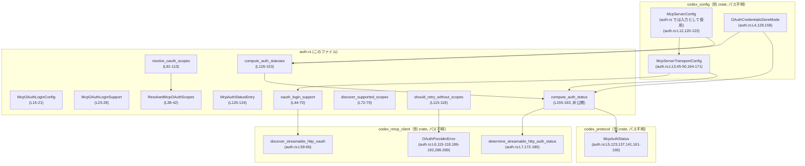

# codex-mcp/src/mcp/auth.rs 解説レポート

## 0. ざっくり一言

- MCP サーバーの **OAuth ログイン対応状況** と **認証ステータス** を判定し、OAuth スコープの扱い（優先順位・リトライ条件）をまとめて管理するモジュールです（`codex-mcp/src/mcp/auth.rs:L15-183`）。

---

## 1. このモジュールの役割

### 1.1 概要

- このモジュールは **MCP サーバーの認証まわりの状態を集約して扱う** ために存在し、主に次の機能を提供します。
  - Streamable HTTP な MCP サーバーについて **OAuth ログインがサポートされているかの検出**（`oauth_login_support`、`discover_supported_scopes`）（`auth.rs:L44-79`）
  - 明示・設定・自動検出の 3 種類の OAuth スコープを統合し、**どのスコープを使うか決定するロジック**（`resolve_oauth_scopes`）（`auth.rs:L81-113`）
  - OAuth でエラーが発生した際に、**スコープなしでのリトライが妥当かどうか**を判定（`should_retry_without_scopes`）（`auth.rs:L115-118`）
  - 全 MCP サーバーについて **認証ステータスを非同期で並列に計算**（`compute_auth_statuses` / `compute_auth_status`）（`auth.rs:L126-183`）

### 1.2 アーキテクチャ内での位置づけ

このモジュールは「設定」と「実際の OAuth クライアント」の間に入り、認証状態を整理して上位レイヤーに渡す位置づけです。



- 上位レイヤーは `McpServerConfig` / `McpServerTransportConfig` を持ち、このモジュールに渡して認証ステータス（`McpAuthStatus`）を取得する構造になっています（`auth.rs:L126-153`）。
- 実際の OAuth プロトコル処理は `codex_rmcp_client` 側の関数に委譲し、このモジュールでは **結果の整理と判定ロジック** に集中しています（`auth.rs:L59-69,172-180`）。

### 1.3 設計上のポイント

- 責務分割
  - このモジュールは **設定解析・状態判定ロジックのみ** を持ち、HTTP 通信や OAuth プロトコルは外部クライアント（`codex_rmcp_client`）に委譲しています（`auth.rs:L59-69,172-180`）。
- 状態管理
  - 認証ステータスは `McpAuthStatusEntry` にまとめて保持し（`auth.rs:L120-124`）、複数サーバー分を `HashMap<String, McpAuthStatusEntry>` で返します（`auth.rs:L126-153`）。
- エラーハンドリング
  - OAuth ログイン検出では、成功/非対応/不明（`Unknown(anyhow::Error)`）の 3 状態を `McpOAuthLoginSupport` で表します（`auth.rs:L23-28`）。
  - 認証ステータス計算の失敗はログ（`tracing::warn!`）に出しつつ、呼び出し側には `McpAuthStatus::Unsupported` として返すポリシーになっています（`auth.rs:L137-142`）。
- 並行性
  - 複数サーバーの認証ステータスは `futures::future::join_all` を用いて **すべて非同期タスクとして並列実行** しています（`auth.rs:L133-152`）。
  - 各タスク内で `String` と `McpServerConfig` をクローンして所有権を移動しており、ライフタイムや共有安全性の問題を避ける設計になっています（`auth.rs:L133-136`）。

---

## 2. 主要な機能一覧

- OAuth ログイン対応検出: `oauth_login_support` で Streamable HTTP MCP サーバーが OAuth ログインをサポートしているか判定（`auth.rs:L44-70`）
- OAuth スコープ自動検出: `discover_supported_scopes` でサーバーから自動検出されたスコープ一覧を取得（`auth.rs:L72-79`）
- OAuth スコープ解決: `resolve_oauth_scopes` で明示・設定・自動検出のスコープから採用するものを決定（`auth.rs:L81-113`）
- OAuth エラー時のリトライ判定: `should_retry_without_scopes` で「発見されたスコープが原因のエラー」かどうかを判定し、スコープなし再試行の可否を返却（`auth.rs:L115-118`）
- MCP サーバー認証ステータスの一括計算: `compute_auth_statuses` で複数サーバーの `McpAuthStatus` を並列に計算し、名前→ステータスのマップとして返却（`auth.rs:L126-153`）
- 個別サーバーの認証ステータス計算: `compute_auth_status`（非公開）で 1 サーバー分の `McpAuthStatus` を決定（`auth.rs:L155-183`）

---

## 3. 公開 API と詳細解説

### 3.1 型一覧（構造体・列挙体など）

| 名前 | 種別 | 役割 / 用途 | 定義位置（根拠） |
|------|------|-------------|------------------|
| `McpOAuthLoginConfig` | 構造体 | OAuth ログイン用のエンドポイント URL と HTTP ヘッダ、およびサーバーから検出されたスコープ一覧を保持 | `codex-mcp/src/mcp/auth.rs:L15-21` |
| `McpOAuthLoginSupport` | 列挙体 | 対象サーバーの OAuth ログインサポート状況（Supported/Unsupported/Unknown）を表現 | `auth.rs:L23-28` |
| `McpOAuthScopesSource` | 列挙体 | 採用した OAuth スコープの由来（明示・設定・自動検出・空）を示す | `auth.rs:L30-36` |
| `ResolvedMcpOAuthScopes` | 構造体 | 実際に使用するスコープ配列と、その由来（`McpOAuthScopesSource`）の組 | `auth.rs:L38-42` |
| `McpAuthStatusEntry` | 構造体 | サーバー設定と、そのサーバーの認証ステータス（`McpAuthStatus`）をひとまとめにしたエントリ | `auth.rs:L120-124` |

### 3.2 関数詳細（主要 6 件）

#### `oauth_login_support(transport: &McpServerTransportConfig) -> McpOAuthLoginSupport`

**概要**

- 与えられた MCP サーバーのトランスポート設定について、**OAuth ログインが利用可能かどうか**を判定します。
- Streamable HTTP 以外のトランスポートや、環境変数ベアラー認証を使う構成では `Unsupported` を返します（`auth.rs:L44-57`）。

**引数**

| 引数名 | 型 | 説明 |
|--------|----|------|
| `transport` | `&McpServerTransportConfig` | 対象 MCP サーバーのトランスポート設定（`Stdio` または `StreamableHttp`） |

**戻り値**

- `McpOAuthLoginSupport`（`auth.rs:L23-28`）
  - `Supported(McpOAuthLoginConfig)`：OAuth ログインが利用可能と検出された場合。ログイン URL などを含む構成情報を持つ（`auth.rs:L61-66`）。
  - `Unsupported`：OAuth ログインが利用できない/不要な構成（例: Stdio、環境変数ベアラー）。（`auth.rs:L52-57,67`）
  - `Unknown(anyhow::Error)`：検出処理中にエラーが発生し、サポート有無が判定できなかった場合（`auth.rs:L68-69`）。

**内部処理の流れ**

根拠: `codex-mcp/src/mcp/auth.rs:L44-69`

1. `transport` が `McpServerTransportConfig::StreamableHttp` であるかを `let ... else` で判定し、そうでなければ `Unsupported` を即返却。
2. `StreamableHttp` であっても `bearer_token_env_var`（環境変数ベアラートークン）が設定されている場合は、OAuth ログイン方式は使わない前提で `Unsupported` を返却。
3. `discover_streamable_http_oauth(url, http_headers.clone(), env_http_headers.clone()).await` を実行。
4. 結果の `Result<Option<Discovery>, Error>` について:
   - `Ok(Some(discovery))` の場合、`McpOAuthLoginConfig` を構築し `Supported(...)` で返却。`discovery.scopes_supported` を `discovered_scopes` に格納。
   - `Ok(None)` の場合、OAuth エンドポイントが見つからなかったとみなし `Unsupported`。
   - `Err(err)` の場合、詳細不明として `Unknown(err)`。

**Examples（使用例）**

> 注意: 下記は概念的な例であり、`McpServerTransportConfig` の完全な定義はこのファイル外にあるため一部フィールドは省略しています。

```rust
use codex_config::McpServerTransportConfig;
use codex_mcp::mcp::auth::{oauth_login_support, McpOAuthLoginSupport};

// 非同期コンテキスト内
async fn check_oauth(transport: &McpServerTransportConfig) {
    match oauth_login_support(transport).await {
        McpOAuthLoginSupport::Supported(config) => {
            // config.url や config.http_headers を使って OAuth ログインフローを開始できる
            println!("OAuth login supported at {}", config.url);
        }
        McpOAuthLoginSupport::Unsupported => {
            println!("OAuth login not supported for this server");
        }
        McpOAuthLoginSupport::Unknown(err) => {
            eprintln!("Failed to detect OAuth support: {err:#}");
        }
    }
}
```

**Errors / Panics**

- 関数自体は `Result` を返さず、エラーは `McpOAuthLoginSupport::Unknown` としてラップされます（`auth.rs:L68-69`）。
- パニック条件はコードからは見当たりません（unwrap などなし）。

**Edge cases（エッジケース）**

- `transport` が `Stdio` の場合：必ず `Unsupported`（`auth.rs:L44-53` のパターンマッチにより）。
- `StreamableHttp` だが `bearer_token_env_var` が Some：環境変数ベアラーで認証する構成のため `Unsupported`（`auth.rs:L55-57`）。
- `discover_streamable_http_oauth` が `Ok(None)` を返す場合：OAuth エンドポイントが見つからなかったとみなし `Unsupported`（`auth.rs:L67`）。
- `discover_streamable_http_oauth` がエラー：`Unknown(err)` として詳細を保持（`auth.rs:L68-69`）。

**使用上の注意点**

- **前提**: 非同期関数なので、Tokio などの非同期ランタイム内で `.await` する必要があります。
- **解釈**: `Unsupported` には「本当に非対応」と「環境変数ベアラーなど別方式を使うので OAuth ログインは不要」の両方が含まれます。
- **Unknown の扱い**: ネットワークエラーなどにより `Unknown` になる可能性があるため、UI などで「判定失敗」として区別したい場合は `Unknown` を明示的に扱う必要があります。

---

#### `discover_supported_scopes(transport: &McpServerTransportConfig) -> Option<Vec<String>>`

**概要**

- 対象トランスポートについて、**サーバー側から「サポートされている OAuth スコープ」一覧を取得**します（`auth.rs:L72-79`）。
- サーバーがスコープの情報を提供しない場合や、OAuth ログイン自体が非対応の場合は `None` を返します。

**引数**

| 引数名 | 型 | 説明 |
|--------|----|------|
| `transport` | `&McpServerTransportConfig` | 対象 MCP サーバーのトランスポート設定 |

**戻り値**

- `Option<Vec<String>>`
  - `Some(scopes)`：`oauth_login_support` の結果が `Supported` で、その `McpOAuthLoginConfig.discovered_scopes` が Some の場合。
  - `None`：非対応、検出失敗、またはスコープ情報が存在しない場合。

**内部処理の流れ**

根拠: `auth.rs:L72-79`

1. `oauth_login_support(transport).await` を呼び出し、サポート状況を取得。
2. マッチング:
   - `McpOAuthLoginSupport::Supported(config)` の場合、`config.discovered_scopes` をそのまま返却。
   - `Unsupported` または `Unknown(_)` の場合は `None` を返却。

**Examples（使用例）**

```rust
use codex_config::McpServerTransportConfig;
use codex_mcp::mcp::auth::discover_supported_scopes;

async fn auto_scopes(transport: &McpServerTransportConfig) {
    if let Some(scopes) = discover_supported_scopes(transport).await {
        println!("Server supports scopes: {:?}", scopes);
    } else {
        println!("No scopes discovered or OAuth not supported");
    }
}
```

**Errors / Panics**

- `oauth_login_support` と同様、内部エラーは `Unknown` として吸収され、`discover_supported_scopes` は単に `None` を返します。
- パニックの可能性はコード上は見当たりません。

**Edge cases**

- OAuth ログインが `Supported` であっても、`discovered_scopes` が `None` ならばこの関数は `None` を返します（`auth.rs:L75-77`）。
- OAuth 非対応 (`Unsupported`) または検出エラー (`Unknown(_)`) の場合も `None` です。

**使用上の注意点**

- `None` の意味には、「OAuth 非対応」「検出エラー」「スコープ情報だけが無い」の 3 つが含まれる点に注意が必要です。
  - 正確な理由を区別したい場合は、`discover_supported_scopes` ではなく `oauth_login_support` を直接参照する必要があります。

---

#### `resolve_oauth_scopes(explicit_scopes, configured_scopes, discovered_scopes) -> ResolvedMcpOAuthScopes`

**概要**

- 明示指定されたスコープ・設定ファイルのスコープ・サーバーから自動検出したスコープの **3 種類を優先順位付きで統合**し、実際に使用するスコープとその由来を決定します（`auth.rs:L81-113`）。

**引数**

| 引数名 | 型 | 説明 |
|--------|----|------|
| `explicit_scopes` | `Option<Vec<String>>` | ユーザーが明示的に指定したスコープ（最優先） |
| `configured_scopes` | `Option<Vec<String>>` | 設定ファイルなどに記載されたスコープ |
| `discovered_scopes` | `Option<Vec<String>>` | サーバー側から自動検出されたスコープ |

**戻り値**

- `ResolvedMcpOAuthScopes`（`auth.rs:L38-42`）
  - `scopes: Vec<String>`：採用されたスコープ一覧（空ベクタの可能性あり）。
  - `source: McpOAuthScopesSource`：`Explicit` / `Configured` / `Discovered` / `Empty` のいずれか。

**内部処理の流れ**

根拠: `auth.rs:L81-113`

1. `explicit_scopes` が `Some(scopes)` の場合、それをそのまま採用し `source = Explicit` として返却（`auth.rs:L86-91`）。
2. `explicit_scopes` が `None` で `configured_scopes` が `Some(scopes)` の場合、それを採用し `source = Configured` として返却（`auth.rs:L93-98`）。
   - このとき `scopes` が空 (`Vec::new()`) でもそのまま採用（テスト参照: `auth.rs:L247-261`）。
3. `explicit_scopes` / `configured_scopes` が `None` で、`discovered_scopes` が `Some(scopes)` かつ `!scopes.is_empty()` の場合、それを採用し `source = Discovered`（`auth.rs:L100-107`）。
4. 上記すべてに該当しない場合（`discovered_scopes` が `None` または `Some` だが空）、
   - `scopes = Vec::new()`、`source = Empty` を返却（`auth.rs:L109-112`）。

**Examples（使用例）**

```rust
use codex_mcp::mcp::auth::{resolve_oauth_scopes, McpOAuthScopesSource, ResolvedMcpOAuthScopes};

fn example() {
    let explicit = Some(vec!["user.read".to_string()]);
    let configured = Some(vec!["configured.scope".to_string()]);
    let discovered = Some(vec!["server.default".to_string()]);

    let resolved = resolve_oauth_scopes(explicit, configured, discovered);
    assert_eq!(resolved.source, McpOAuthScopesSource::Explicit);
    assert_eq!(resolved.scopes, vec!["user.read".to_string()]);
}
```

**Errors / Panics**

- 単純なデータ選択ロジックであり、エラーやパニックを発生させる操作（`unwrap` など）はありません。

**Edge cases**

テストコードから確認できるエッジケース（`auth.rs:L196-278`）:

- 明示 > 設定 > 自動検出の優先度が正しく保たれている：
  - `resolve_oauth_scopes_prefers_explicit`（`auth.rs:L196-211`）
  - `resolve_oauth_scopes_prefers_configured_over_discovered`（`auth.rs:L213-228`）
- 設定スコープが明示的に空 (`Some(Vec::new())`) の場合でも、`source = Configured`、`scopes = Vec::new()` として採用される（`resolve_oauth_scopes_preserves_explicitly_empty_configured_scopes`、`auth.rs:L247-261`）。
- すべて `None` の場合は `source = Empty`、`scopes = Vec::new()`（`resolve_oauth_scopes_falls_back_to_empty`、`auth.rs:L265-277`）。
- 自動検出スコープは非空の場合のみ採用され、空の場合は `Empty` が選択される（本体ロジック `auth.rs:L100-107` から）。

**使用上の注意点**

- 「設定で空ベクタを指定する」ことと「設定項目自体を省略する (`None`)」ことに意味の違いがあります。
  - 前者: `Configured` 由来として「スコープなし」を明示している。
  - 後者: 明示/設定が無いので、サーバーからの自動検出または `Empty` にフォールバック。
- ログや UI でスコープの由来を表示するときは `source` を必ず参照する必要があります。

---

#### `should_retry_without_scopes(scopes: &ResolvedMcpOAuthScopes, error: &anyhow::Error) -> bool`

**概要**

- OAuth 認可エラー発生時に、**一度指定したスコープを外して再試行すべきか**どうかを判定するヘルパー関数です（`auth.rs:L115-118`）。
- 「自動検出したスコープが原因で OAuth プロバイダからエラーが返された」と見なせる場合のみ `true` を返します。

**引数**

| 引数名 | 型 | 説明 |
|--------|----|------|
| `scopes` | `&ResolvedMcpOAuthScopes` | 直前のリクエストで使用したスコープとその由来 |
| `error` | `&anyhow::Error` | 発生したエラー（`OAuthProviderError` かどうかを downcast して判定） |

**戻り値**

- `bool`
  - `true`：スコープなしでのリトライを行うべきと判定。
  - `false`：スコープを変えずに扱うべき、またはスコープとは無関係と判定。

**内部処理の流れ**

根拠: `auth.rs:L115-118`

1. `scopes.source == McpOAuthScopesSource::Discovered` かどうかをチェック。
2. かつ、`error.downcast_ref::<OAuthProviderError>().is_some()`（`anyhow::Error` の実体が `OAuthProviderError` か）をチェック。
3. 両方満たす場合のみ `true` を返し、それ以外は `false`。

テストにより意図が確認できます（`auth.rs:L281-302`）:

- 自動検出スコープ + `OAuthProviderError` → `true`。
- 設定由来スコープ + `OAuthProviderError` → `false`。
- 自動検出スコープ + `OAuthProviderError` 以外のエラー → `false`。

**Examples（使用例）**

```rust
use anyhow::anyhow;
use codex_mcp::mcp::auth::{ResolvedMcpOAuthScopes, McpOAuthScopesSource, should_retry_without_scopes};
use codex_rmcp_client::OAuthProviderError;

fn handle_oauth_error(scopes: ResolvedMcpOAuthScopes, err: anyhow::Error) {
    if should_retry_without_scopes(&scopes, &err) {
        // ここでスコープなしの再試行ロジックを実装する
        println!("Retrying OAuth without scopes...");
    } else {
        eprintln!("OAuth error, not retrying without scopes: {err:#}");
    }
}
```

**Errors / Panics**

- 例外やパニックを発生させず、常に `bool` を返します。
- `downcast_ref` が失敗した場合も単に `None` となり `false` を返します。

**Edge cases**

- `scopes.source != Discovered` の場合は、どのようなエラーであっても `false`（`auth.rs:L115-116`）。
- `error` が `OAuthProviderError` でない場合は `false`（`auth.rs:L117`）。
- `OAuthProviderError` の具体的な内容（`invalid_scope` など）には関知せず、型だけで判定しています。

**使用上の注意点**

- `anyhow::Error` に複数回 `context` をつけた場合でも、最も内側が `OAuthProviderError` であれば downcast に成功します（これは `anyhow` の一般的挙動に基づくライブラリ知識です）。
- この関数は「自動検出したスコープが信用できない」ケースのみにフォーカスしており、明示・設定スコープでのエラーには適用されません。

---

#### `compute_auth_statuses<'a, I>(servers: I, store_mode: OAuthCredentialsStoreMode) -> HashMap<String, McpAuthStatusEntry>`

**概要**

- 複数の MCP サーバーについて、**認証ステータス（`McpAuthStatus`）を並列に計算しマップとして返す** 非同期関数です（`auth.rs:L126-153`）。
- 内部では各サーバーごとに `compute_auth_status` を非同期タスクとして起動し、`join_all` で全タスクの終了を待ちます。

**引数**

| 引数名 | 型 | 説明 |
|--------|----|------|
| `servers` | `I` where `I: IntoIterator<Item = (&'a String, &'a McpServerConfig)>` | サーバー名とサーバー設定のペアのイテレータ。通常は `HashMap<String, McpServerConfig>` などから借用で渡す想定。 |
| `store_mode` | `OAuthCredentialsStoreMode` | OAuth 認証情報の保存モード。具体的な意味は別 crate（`codex_config::types`）で定義（`auth.rs:L4,128,158`）。 |

**戻り値**

- `HashMap<String, McpAuthStatusEntry>`
  - キーはサーバー名（`String`）。
  - 値は `McpAuthStatusEntry { config, auth_status }`（`auth.rs:L120-124`）。

**内部処理の流れ**

根拠: `auth.rs:L126-153`

1. `servers.into_iter()` で `(name, config)` ペアを列挙。
2. 各ペアに対して以下を行う非同期ブロックを生成:
   - `name`（`&String`）と `config`（`&McpServerConfig`）を `clone()` して所有権付きの値を作成（`auth.rs:L133-136`）。
   - `compute_auth_status(&name, &config, store_mode).await` を実行（`auth.rs:L137`）。
   - `Ok(status)` ならそのまま採用。`Err(error)` の場合は `warn!` ログを出しつつ `McpAuthStatus::Unsupported` を採用（`auth.rs:L137-142`）。
   - `McpAuthStatusEntry { config, auth_status }` を構築し、`(name, entry)` のタプルとして返却（`auth.rs:L144-148`）。
3. 上記非同期ブロックのイテレータを `join_all(futures).await` に渡し、全タスクを並列に実行して `Vec<(String, McpAuthStatusEntry)>` を得る（`auth.rs:L151-152`）。
4. `into_iter().collect()` で `HashMap<String, McpAuthStatusEntry>` に変換して返却（`auth.rs:L152-153`）。

**Examples（使用例）**

```rust
use std::collections::HashMap;
use codex_config::{McpServerConfig, McpServerTransportConfig};
use codex_config::types::OAuthCredentialsStoreMode;
use codex_mcp::mcp::auth::{compute_auth_statuses, McpAuthStatusEntry};

async fn compute_all_statuses() {
    let mut servers: HashMap<String, McpServerConfig> = HashMap::new();
    // servers.insert("server1".to_string(), ...);

    let store_mode = OAuthCredentialsStoreMode::default(); // 実際のデフォルトは別 crate 参照

    // `&servers` のイテレータから (&String, &McpServerConfig) を得る
    let statuses = compute_auth_statuses(&servers, store_mode).await;

    for (name, entry) in statuses {
        println!("Server {name} status: {:?}", entry.auth_status);
    }
}
```

**Errors / Panics**

- 個々のサーバーで `compute_auth_status` が `Err` を返した場合でも、この関数自体はエラーを返さず、
  - 警告ログを出力し（`warn!`、`auth.rs:L137-141`）、
  - 該当サーバーのステータスを `McpAuthStatus::Unsupported` にします（`auth.rs:L141-142`）。
- パニック動作はコード上では行っていません。

**Edge cases**

- `servers` が空の場合：`join_all` は空ベクタを返し、結果も空の `HashMap` になります。
- 同じサーバー名が複数回現れる場合：最後の要素が `HashMap` に残ることになります（`collect` の一般的挙動に基づく）。
- `store_mode` の値によって `compute_auth_status` の挙動は変わり得ますが、その詳細はこのファイルからは分かりません（別 crate 依存）。

**使用上の注意点**

- 大量のサーバーに対して呼び出す場合、`join_all` により **全サーバー分の非同期タスクが一度に生成される** ため、同時接続数やメモリに注意が必要です。
- エラーが `McpAuthStatus::Unsupported` にマッピングされるため、「本当に非対応なのか／一時的な障害なのか」はログを見ないと判別できません。

---

#### `compute_auth_status(server_name, config, store_mode) -> Result<McpAuthStatus>`

> 非公開関数ですが、`compute_auth_statuses` のコアロジックであるため詳細に記載します。

**概要**

- 単一の MCP サーバーについて、**有効かつどのトランスポートかに応じて認証ステータスを決定**します（`auth.rs:L155-183`）。
- Stdio トランスポートや無効化されたサーバーは一律 `Unsupported` として扱い、Streamable HTTP の場合は `determine_streamable_http_auth_status` に委譲します。

**引数**

| 引数名 | 型 | 説明 |
|--------|----|------|
| `server_name` | `&str` | サーバー名（ログ出力などに利用） |
| `config` | `&McpServerConfig` | ターゲット MCP サーバーの設定 |
| `store_mode` | `OAuthCredentialsStoreMode` | OAuth 認証情報の保存モード |

**戻り値**

- `Result<McpAuthStatus, anyhow::Error>`（実際には `anyhow::Result<McpAuthStatus>`、`auth.rs:L3,159`）

**内部処理の流れ**

根拠: `auth.rs:L155-183`

1. `config.enabled` を確認し、`false` なら `Ok(McpAuthStatus::Unsupported)` を即返却（`auth.rs:L160-162`）。
2. `config.transport` に対してパターンマッチ（`auth.rs:L164-182`）:
   - `McpServerTransportConfig::Stdio { .. }`:
     - `Ok(McpAuthStatus::Unsupported)` を返却（`auth.rs:L165`）。
   - `McpServerTransportConfig::StreamableHttp { url, bearer_token_env_var, http_headers, env_http_headers }`:
     - `determine_streamable_http_auth_status(server_name, url, bearer_token_env_var.as_deref(), http_headers.clone(), env_http_headers.clone(), store_mode).await` の結果をそのまま返却（`auth.rs:L172-180`）。

**Examples（使用例）**

> 外部からは通常 `compute_auth_statuses` 経由で使われるため、直接呼び出す機会は限定的です。

```rust
use codex_config::{McpServerConfig, McpServerTransportConfig};
use codex_config::types::OAuthCredentialsStoreMode;
use codex_protocol::protocol::McpAuthStatus;
use codex_mcp::mcp::auth::compute_auth_status; // 実際には `pub` ではないので同モジュール内限定

async fn single_status(name: &str, cfg: &McpServerConfig, store: OAuthCredentialsStoreMode)
    -> anyhow::Result<McpAuthStatus>
{
    compute_auth_status(name, cfg, store).await
}
```

**Errors / Panics**

- `determine_streamable_http_auth_status` が `Err` を返した場合、そのまま `Err` を返します（`auth.rs:L172-180`）。
- それ以外のパスでは `Ok` のみを返し、パニック要因はありません。

**Edge cases**

- 無効化されたサーバー（`config.enabled == false`）は、トランスポート種別に関わらず必ず `Unsupported`（`auth.rs:L160-162`）。
- 新しいトランスポート種別が `McpServerTransportConfig` に追加された場合、この `match` にも分岐追加が必要です。そうでないとコンパイルエラーになるため、網羅性はコンパイラにより保証されます。

**使用上の注意点**

- この関数は公開されていないため、外部からは `compute_auth_statuses` を通じて利用される前提です。
- HTTP など I/O を伴う処理が `determine_streamable_http_auth_status` 内にあると推測されるため、非同期コンテキストでのみ利用可能です。

---

### 3.3 その他の関数

このファイルには他に、テスト用の関数が `#[cfg(test)] mod tests` 内に定義されています（`auth.rs:L185-302`）。

| 関数名 | 役割（1 行） | 定義位置 |
|--------|--------------|----------|
| `resolve_oauth_scopes_prefers_explicit` | `resolve_oauth_scopes` が明示スコープを最優先することを確認 | `auth.rs:L196-211` |
| `resolve_oauth_scopes_prefers_configured_over_discovered` | 設定スコープが自動検出スコープより優先されることを確認 | `auth.rs:L213-228` |
| `resolve_oauth_scopes_uses_discovered_when_needed` | 明示・設定が無い場合に自動検出スコープが使われることを確認 | `auth.rs:L230-245` |
| `resolve_oauth_scopes_preserves_explicitly_empty_configured_scopes` | 空の設定スコープが明示的指定として尊重されることを確認 | `auth.rs:L247-261` |
| `resolve_oauth_scopes_falls_back_to_empty` | 何も指定がないときに `Empty` にフォールバックすることを確認 | `auth.rs:L265-277` |
| `should_retry_without_scopes_only_for_discovered_provider_errors` | `should_retry_without_scopes` の条件が「自動検出スコープ + OAuthProviderError」に限定されることを確認 | `auth.rs:L281-302` |

---

## 4. データフロー

ここでは、**複数サーバーの認証ステータス算出**（`compute_auth_statuses (L126-153)`）の代表的なフローを示します。

### 認証ステータス算出のシーケンス

```mermaid
sequenceDiagram
    participant Caller as "呼び出し側"
    participant Auth as "auth::compute_auth_statuses\n(L126-153)"
    participant Worker as "auth::compute_auth_status\n(L155-183)"
    participant Client as "determine_streamable_http_auth_status\n(codex_rmcp_client)"
    participant Proto as "McpAuthStatus\n(codex_protocol)"

    Caller->>Auth: compute_auth_statuses(servers, store_mode)
    activate Auth

    loop 各サーバー (servers.into_iter)
        Auth->>Worker: compute_auth_status(&name, &config, store_mode)
        activate Worker

        alt config.enabled == false
            Worker-->>Auth: Ok(McpAuthStatus::Unsupported)
        else transport == Stdio
            Worker-->>Auth: Ok(McpAuthStatus::Unsupported)
        else transport == StreamableHttp
            Worker->>Client: determine_streamable_http_auth_status(...)
            Client-->>Worker: Result<McpAuthStatus>
            Worker-->>Auth: 同上 Result
        end

        deactivate Worker

        alt Result::Ok(status)
            Auth-->>Auth: auth_status = status
        else Result::Err(error)
            Auth-->>Auth: warn!(...error...);\nMcpAuthStatus::Unsupported
        end

        Auth-->>Auth: entry = McpAuthStatusEntry {config, auth_status}
        Auth-->>Auth: results.push((name, entry))
    end

    Auth-->>Caller: HashMap<String, McpAuthStatusEntry>
    deactivate Auth
```

- 並列性：`compute_auth_statuses` はサーバーごとに非同期タスクを生成し、`join_all` で全てのタスクを同時実行します（`auth.rs:L133-152`）。
- エラー処理：`compute_auth_status` 内で発生したエラーは呼び出し元で `warn!` ログを出しつつ `Unsupported` に変換されます（`auth.rs:L137-142`）。

### OAuth ログイン対応検出のデータフロー

```mermaid
flowchart TD
    A["McpServerTransportConfig\n(L45-50)"]
    B["oauth_login_support\n(L44-70)"]
    C["discover_streamable_http_oauth\n(codex_rmcp_client)\n(L59-66)"]
    D["McpOAuthLoginSupport::Supported\n(McpOAuthLoginConfig)\n(L61-66)"]
    E["McpOAuthLoginSupport::Unsupported\n(L52-57,67)"]
    F["McpOAuthLoginSupport::Unknown\n(L68-69)"]

    A --> B
    B -->|Stdio または bearer_token_env_var が Some| E
    B -->|StreamableHttp + bearer_token_env_var なし| C
    C -->|Ok(Some(discovery))| D
    C -->|Ok(None)| E
    C -->|Err(err)| F
```

---

## 5. 使い方（How to Use）

### 5.1 基本的な使用方法

#### 複数 MCP サーバーの認証ステータスを取得する

```rust
use std::collections::HashMap;
use anyhow::Result;
use codex_config::{McpServerConfig, McpServerTransportConfig};
use codex_config::types::OAuthCredentialsStoreMode;
use codex_mcp::mcp::auth::{compute_auth_statuses, McpAuthStatusEntry};

#[tokio::main] // 非同期ランタイム
async fn main() -> Result<()> {
    // サーバー設定を名前付きで用意する（実際は設定ファイル等からロード）
    let mut servers: HashMap<String, McpServerConfig> = HashMap::new();
    // servers.insert("server1".into(), McpServerConfig { ... });

    let store_mode = OAuthCredentialsStoreMode::default(); // 実際の定義は codex_config 側

    // (&String, &McpServerConfig) のイテレータを渡す
    let statuses: HashMap<String, McpAuthStatusEntry> =
        compute_auth_statuses(&servers, store_mode).await;

    for (name, entry) in statuses {
        println!("server {name}: {:?}", entry.auth_status);
    }

    Ok(())
}
```

- ポイント:
  - `compute_auth_statuses` は `&HashMap<String, McpServerConfig>` のようなコレクションからも利用可能です（`IntoIterator<Item=(&String,&McpServerConfig)>` 制約、`auth.rs:L130-131`）。
  - エラーはログに出るだけで戻り値には現れないため、詳細はログ出力を確認する必要があります（`auth.rs:L137-142`）。

#### OAuth スコープの解決とエラー時リトライ判定

```rust
use anyhow::anyhow;
use codex_mcp::mcp::auth::{
    resolve_oauth_scopes, should_retry_without_scopes,
    ResolvedMcpOAuthScopes, McpOAuthScopesSource,
};
use codex_rmcp_client::OAuthProviderError;

// 例: ユーザー明示のスコープはなく、設定スコープが Some(["configured"])
fn scopes_and_retry() {
    let resolved = resolve_oauth_scopes(
        None,
        Some(vec!["configured".to_string()]),
        Some(vec!["discovered".to_string()]),
    );

    // resolved.source は Configured になる（auth.rs:L93-98）
    assert_eq!(resolved.source, McpOAuthScopesSource::Configured);

    let provider_error = anyhow!(OAuthProviderError::new(
        Some("invalid_scope".to_string()),
        Some("scope rejected".to_string()),
    ));

    // Configured 由来なので should_retry_without_scopes は false（auth.rs:L281-302）
    assert!(!should_retry_without_scopes(&resolved, &provider_error));
}
```

### 5.2 よくある使用パターン

1. **UI でサーバー一覧と認証状態を表示**
   - `compute_auth_statuses` で全サーバーの `McpAuthStatusEntry` を取得し、UI で `auth_status` をステータスアイコンとして表示する。
2. **OAuth 設定画面でスコープ候補を提示**
   - `discover_supported_scopes` でサーバーの推奨スコープ一覧を取得し、設定フォームの候補として使う。
   - ユーザーが独自にスコープを指定した場合は `resolve_oauth_scopes` で明示スコープを優先して採用。
3. **OAuth エラー時の自動フォールバック**
   - 自動検出スコープでリクエスト → `OAuthProviderError` が発生 → `should_retry_without_scopes` が `true` → スコープなしで再試行、というリトライ戦略。

### 5.3 よくある間違い

```rust
use codex_mcp::mcp::auth::{
    resolve_oauth_scopes, McpOAuthScopesSource,
};

// ❌ 間違い例: configured_scopes = Some(Vec::new()) を「スコープ未設定」とみなしている
let resolved = resolve_oauth_scopes(
    None,
    Some(Vec::new()), // 空だが Some
    Some(vec!["discovered".into()]),
);

// resolved.source は Configured になる（auth.rs:L93-98,247-261）
assert_eq!(resolved.source, McpOAuthScopesSource::Configured);
// この場合、自動検出スコープは無視される

// ✅ 正しい解釈:
// - Some(Vec::new()): 「設定でスコープを明示的に空にした」という意味
// - None: 「設定にスコープが書かれていない」という意味
```

```rust
// ❌ 間違い例: should_retry_without_scopes はどんな OAuth エラーでも true を返すと期待する
use anyhow::anyhow;
use codex_mcp::mcp::auth::{ResolvedMcpOAuthScopes, McpOAuthScopesSource, should_retry_without_scopes};

let scopes = ResolvedMcpOAuthScopes {
    scopes: vec!["scope".to_string()],
    source: McpOAuthScopesSource::Configured,
};

// `OAuthProviderError` だとしても、Configured 由来なので false になる（auth.rs:L115-118,281-302）
let err = anyhow!("some oauth error");
assert!(!should_retry_without_scopes(&scopes, &err));

// ✅ 正しい使い方:
// - `source == Discovered` かつ `error` が `OAuthProviderError` のときだけ true になる
```

### 5.4 使用上の注意点（まとめ）

- **並行性**
  - `compute_auth_statuses` はサーバー数に比例した数の非同期タスクを生成します（`auth.rs:L133-152`）。
    - サーバー数が多い場合、同時接続数・外部 API 呼び出し数が急増する可能性があります。
- **エラーの可視性**
  - `compute_auth_status` のエラーは `compute_auth_statuses` 内でログにのみ出力され、呼び出し元には `Unsupported` として返されます（`auth.rs:L137-142`）。
  - 「本当に未対応か」「一時的な障害か」を区別したい場合はログ収集・監視基盤と組み合わせる必要があります。
- **スコープの意味付け**
  - `resolve_oauth_scopes` の `source` を見ずに `scopes` だけを扱うと、「なぜこのスコープになったのか」が分からなくなります。
  - 特に `Empty` と `Configured`（空ベクタ）は動作は同じでも意味が異なります。

---

## 6. 変更の仕方（How to Modify）

### 6.1 新しい機能を追加する場合

1. **新しい認証ステータスを追加したい場合**
   - `McpAuthStatus` 自体は別 crate（`codex_protocol`）にあるため、このファイルからは追加できません。
   - プロトコル側に新 variant を追加した後、このファイルの `compute_auth_status` と `compute_auth_statuses` が新ステータスを適切に扱うか確認する必要があります（根拠: `auth.rs:L5,123,137,141,161-166`）。
2. **OAuth スコープ解決ロジックのバリエーションを増やしたい場合**
   - 例えば「ユーザーインタラクティブモード」用の別解決ポリシーを追加するなら、新しい関数（例: `resolve_oauth_scopes_interactive`）を `resolve_oauth_scopes` 近くに追加するのが自然です（`auth.rs:L81-113`）。
   - 既存の `ResolvedMcpOAuthScopes` 型を再利用し、`McpOAuthScopesSource` に新しい由来を追加する設計も考えられますが、それは enum 定義の変更を伴います（`auth.rs:L30-36`）。

### 6.2 既存の機能を変更する場合

- 影響範囲の確認
  - `resolve_oauth_scopes` と `should_retry_without_scopes` はテストが存在するため（`auth.rs:L185-302`）、変更時にはこれらのテストを必ず確認・更新する必要があります。
  - `oauth_login_support` と `compute_auth_statuses` / `compute_auth_status` には、このファイル内に直接のテストはありません。
    - それらを利用する上位モジュールや統合テストが存在する可能性がありますが、このチャンクからは不明です。
- 契約の維持
  - `compute_auth_statuses` が「エラーをログに出して `Unsupported` を返す」という契約（`auth.rs:L137-142`）を変更すると、呼び出し側のエラー処理ロジックに影響します。
  - `resolve_oauth_scopes` の優先順位（明示 > 設定 > 自動検出 > 空）を変えると既存の設定解釈が変わるため、互換性に注意が必要です。
- 並行性・パフォーマンス
  - `join_all` での一括並行実行から、上限付きの同時実行数に変更する場合、`compute_auth_statuses` の実装をキューイングや `FuturesUnordered` などに書き換えることになります。
  - その際も戻り値の型（`HashMap<String, McpAuthStatusEntry>`）は変えないのが無難です。

---

## 7. 関連ファイル

このモジュールと密接に関係する型・関数は別 crate に定義されており、正確なファイルパスはこのチャンクからは分かりません。

| パス/シンボル | 役割 / 関係 |
|--------------|------------|
| `codex_config::McpServerConfig` | MCP サーバーの設定。`compute_auth_status` / `compute_auth_statuses` の入力として利用（`auth.rs:L12,120-123,155-158`）。 |
| `codex_config::McpServerTransportConfig` | サーバーのトランスポート種別（Stdio / Streamable Http）を表す。OAuth ログインサポート判定や認証ステータス判定の基準（`auth.rs:L13,45-50,164-171`）。 |
| `codex_config::types::OAuthCredentialsStoreMode` | OAuth 認証情報の保存方法を表す列挙体と思われる。認証ステータス計算時に渡される（`auth.rs:L4,128,158`）。 |
| `codex_protocol::protocol::McpAuthStatus` | MCP サーバーの認証状態（例: 認証済み/未認証/非対応など）を表す列挙体。`McpAuthStatusEntry` および `compute_auth_status` の戻り値として使用（`auth.rs:L5,123,137,141,161-166`）。 |
| `codex_rmcp_client::discover_streamable_http_oauth` | Streamable HTTP サーバーの OAuth サポートを検出し、スコープ情報などを返す関数（`auth.rs:L8,59-66`）。 |
| `codex_rmcp_client::determine_streamable_http_auth_status` | Streamable HTTP サーバーの認証ステータスを実際に評価する関数（`auth.rs:L7,172-180`）。 |
| `codex_rmcp_client::OAuthProviderError` | OAuth プロバイダからのエラーを表す型。`should_retry_without_scopes` でのリトライ判定に利用（`auth.rs:L6,115-118,186-192,286-289`）。 |

---

## Bugs / Security / Contracts / Edge Cases / Tests / 性能・スケーラビリティ（まとめ）

最後に、ユーザー指定の観点に沿って重要点を簡潔にまとめます。

- **潜在バグ**
  - このチャンクから明確なロジックバグは読み取れません。
  - ただし、`compute_auth_statuses` がすべてのエラーを `Unsupported` にマッピングするため、運用上「一時的な障害」と「本当に非対応」が区別しづらい点は注意が必要です（`auth.rs:L137-142`）。
- **セキュリティ上の注意**
  - `warn!("...: {error:?}")` により、エラー詳細がログに出力されます（`auth.rs:L140`）。エラーに機密情報（トークンなど）が含まれている場合、それがログに残る可能性があります。
- **契約 / エッジケース**
  - スコープ優先順位と `McpOAuthScopesSource` の扱いはテストで明確に規定されており（`auth.rs:L196-277`）、変更時には後方互換性に注意が必要です。
  - `should_retry_without_scopes` は、「自動検出スコープ + OAuthProviderError」に限定して `true` を返す契約を持ちます（`auth.rs:L115-118,281-302`）。
- **テスト**
  - `resolve_oauth_scopes` と `should_retry_without_scopes` に対しては単体テストが用意されており、代表的なエッジケースをカバーしています（`auth.rs:L185-302`）。
  - `oauth_login_support` や `compute_auth_statuses` / `compute_auth_status` には、このファイル内にはテストがありません。
- **性能 / スケーラビリティ**
  - `compute_auth_statuses` でサーバー数に比例した非同期タスクを `join_all` で同時実行するため、大規模環境では同時接続数に注意が必要です（`auth.rs:L133-152`）。
  - 各サーバー設定を `clone` してタスクに渡すため、大きな設定構造体の場合はメモリコピーコストが増えます（`auth.rs:L133-136`）。

この情報を基に、モジュールの公開 API とコアロジックを安全かつ意図通りに利用できるはずです。
