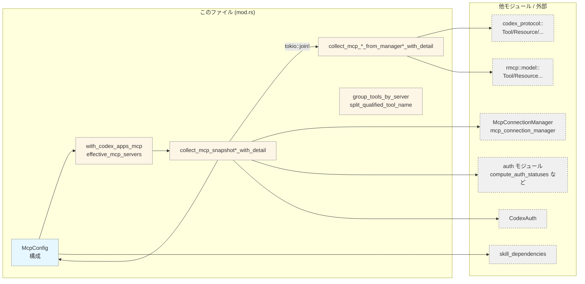
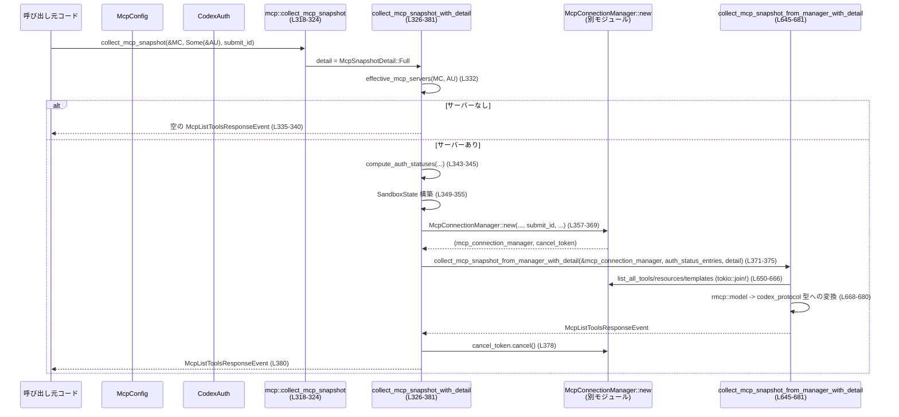

codex-mcp/src/mcp/mod.rs

---

## 0. ざっくり一言

このモジュールは、Codex システムにおける MCP (Model Context Protocol) サーバー群の「スナップショット取得」と「構成管理」の中心です。  
MCP サーバーの一覧・ツール・リソース・認可状態を集約し、`codex_protocol` のイベント型に変換して返します。

---

## 1. このモジュールの役割

### 1.1 概要

- このモジュールは **複数の MCP サーバーからツール・リソース・認可状態を収集し、クライアント向けのスナップショットとして返す** ために存在します。
- さらに、ChatGPT アプリ用の組み込み MCP サーバー (`codex_apps`) を構成に基づいて自動的に出し入れし、  
  **ユーザー設定の MCP サーバーとプラグイン提供の MCP サーバーを統合** します（`with_codex_apps_mcp`、`effective_mcp_servers`、mod.rs:L286-312）。
- MCP 実行時の設定をまとめた `McpConfig` を提供し、**OAuth 設定・サンドボックス設定・承認ポリシーなどの長寿命コンフィグ**を保持します（mod.rs:L108-137）。

### 1.2 アーキテクチャ内での位置づけ

このモジュールは「構成 & スナップショット層」として、接続管理・認証・プロトコル実装の間をつなぎます。



- `collect_mcp_snapshot_with_detail` / `collect_mcp_server_status_snapshot_with_detail` がエントリポイントとなり、  
  `McpConnectionManager` を起動してツール・リソースを取得します（mod.rs:L326-381, L400-453）。
- 認証状態は `auth` モジュールの `compute_auth_statuses` で計算され（mod.rs:L343-345, L417-418）、  
  MCP レスポンスは `rmcp::model::*` から `codex_protocol::mcp::*` 型へ変換されます（mod.rs:L485-587）。

### 1.3 設計上のポイント

- **責務の分割**
  - このモジュールは「設定とスナップショット作成」に限定され、実際の MCP 通信・リクエスト処理は `McpConnectionManager` 側に委譲されています（mod.rs:L357-369, L430-442）。
- **状態管理**
  - 長寿命の設定は `McpConfig` に保持し（mod.rs:L108-137）、接続ライフサイクルは `McpConnectionManager::new` の戻り値とキャンセルトークンで管理します（mod.rs:L357-369, L371-380）。
  - スナップショット自体は毎回新しい `HashMap` を構築する形で、共有可変状態は持ちません。
- **エラーハンドリング**
  - MCP ツール/リソース変換に失敗した場合は `tracing::warn!` を出しつつ、その要素だけスキップする設計です（mod.rs:L485-499, L510-547, L549-587）。
  - 例外的な状況でもパニックせず、空マップや部分的な結果を返す方針になっています。
- **並行性**
  - ツール・リソース・テンプレートの取得は `tokio::join!` を用いて **非同期で並列実行** されます（mod.rs:L589-610, L650-666）。
  - イベント送信用のチャネルを用意しつつ、必要ない場合はすぐにリスナーを破棄することで、インターフェース要求を満たしつつオーバーヘッドを最小化しています（mod.rs:L346-347, L420-421）。

---

## 2. 主要な機能一覧

### 2.1 機能の箇条書き

- MCP スナップショット取得（ツール・リソース・認証状態）  
  - `collect_mcp_snapshot*` / `collect_mcp_server_status_snapshot*`（mod.rs:L318-381, L391-453）
- ChatGPT アプリ用 MCP サーバー `codex_apps` の自動有効化/無効化  
  - `with_codex_apps_mcp`, `codex_apps_mcp_*` 系（mod.rs:L197-285）
- MCP 用ランタイム設定の保持  
  - `McpConfig`（mod.rs:L108-137）
- プラグイン由来の MCP ツールの出所情報を構築  
  - `ToolPluginProvenance`, `tool_plugin_provenance`（mod.rs:L139-195, L314-316）
- MCP ツール名の正規化/分解とサーバーごとのグルーピング  
  - `sanitize_responses_api_tool_name`, `qualified_mcp_tool_name_prefix`,  
    `split_qualified_tool_name`, `group_tools_by_server`（mod.rs:L60-84, L456-483）
- `rmcp::model` から Codex プロトコル型への変換  
  - `protocol_tool_from_rmcp_tool`, `convert_mcp_resources`,  
    `convert_mcp_resource_templates`（mod.rs:L485-587）

### 2.2 コンポーネントインベントリー（このチャンク）

> 行番号は `codex-mcp/src/mcp/mod.rs:L開始-終了` 形式です。

#### 型・定数・エイリアス

| 名前 | 種別 | 公開範囲 | 概要 | 根拠 |
|------|------|----------|------|------|
| `auth` | モジュール | `pub(crate)` | 認証関連の型/関数を定義（詳細はこのチャンク外） | L1 |
| `skill_dependencies` | モジュール | private | スキルの MCP 依存関係関連（詳細はこのチャンク外） | L2 |
| `McpAuthStatusEntry` ほか | re-export | `pub` | `auth` モジュールからの再公開（OAuth / auth 状態関連） | L3-12 |
| `canonical_mcp_server_key`, `collect_missing_mcp_dependencies` | re-export | `pub` | MCP 依存関係解決用 API（定義は `skill_dependencies` にあり、このチャンクには現れません） | L13-14 |
| `McpManager` | 型エイリアス | `pub` | `McpConnectionManager` の別名 | L37-40 |
| `MCP_TOOL_NAME_PREFIX` | 定数 | private | 修飾済 MCP ツール名の prefix `"mcp"` | L42 |
| `MCP_TOOL_NAME_DELIMITER` | 定数 | private | サーバー名とツール名の区切り `"__"` | L43 |
| `CODEX_APPS_MCP_SERVER_NAME` | 定数 | `pub` | 組み込み ChatGPT アプリ MCP サーバー名 `"codex_apps"` | L44 |
| `CODEX_CONNECTORS_TOKEN_ENV_VAR` | 定数 | private | コネクタ用トークン環境変数名 `"CODEX_CONNECTORS_TOKEN"` | L45 |
| `McpSnapshotDetail` | enum | `pub` | スナップショットの詳細レベル（`Full` / `ToolsAndAuthOnly`） | L47-52, L54-58 |
| `McpConfig` | struct | `pub` | MCP ランタイムの長寿命コンフィグ（URL, OAuth, サンドボックスなど） | L108-137 |
| `ToolPluginProvenance` | struct | `pub` | MCP ツールがどのプラグイン由来かを記録するマップ | L139-143, L145-195 |
| `McpServerStatusSnapshot` | struct | `pub` | サーバー単位にツール・リソース・認証状態をまとめたスナップショット | L383-389 |

#### 関数（定義されているもの）

| 名前 | 公開 | 概要 | 根拠 |
|------|------|------|------|
| `sanitize_responses_api_tool_name` | `pub(crate)` | Responses API 用にツール名を正規化（許可されない文字を `_` に置換） | L60-78 |
| `qualified_mcp_tool_name_prefix` | `pub` | `mcp__{server_name}__` 形式の修飾ツール名 prefix を生成 | L80-84 |
| `mcp_permission_prompt_is_auto_approved` | `pub` | 承認ポリシーとサンドボックス設定から、MCP プロンプトを自動承認すべきか判定 | L86-97 |
| `codex_apps_mcp_bearer_token_env_var` | private | `CODEX_CONNECTORS_TOKEN` 環境変数が有効かを判定し、その名前を返す | L197-203 |
| `codex_apps_mcp_bearer_token` | private | `CodexAuth` から Bearer トークン文字列を取り出す | L206-214 |
| `codex_apps_mcp_http_headers` | private | Bearer トークンとアカウント ID を元に HTTP ヘッダを構築 | L216-229 |
| `normalize_codex_apps_base_url` | private | ChatGPT/Codex ベース URL を正規化し `/backend-api` を補完 | L231-239 |
| `codex_apps_mcp_url_for_base_url` | private | ベース URL から `/wham/apps` / `/api/codex/apps` などの実際の MCP URL を組み立て | L242-251 |
| `codex_apps_mcp_url` | `pub(crate)` | `McpConfig.chatgpt_base_url` から `codex_apps` MCP URL を生成 | L253-255 |
| `codex_apps_mcp_server_config` | private | `codex_apps` 用の `McpServerConfig` を構築 | L257-284 |
| `with_codex_apps_mcp` | `pub` | 条件に応じて `codex_apps` MCP サーバー設定を追加/削除 | L286-300 |
| `configured_mcp_servers` | `pub` | ユーザー設定＋プラグイン設定の MCP サーバー一覧を返す | L302-304 |
| `effective_mcp_servers` | `pub` | `configured_mcp_servers` に `codex_apps` をマージした有効サーバー一覧 | L306-312 |
| `tool_plugin_provenance` | `pub` | `McpConfig.plugin_capability_summaries` から `ToolPluginProvenance` を構築 | L314-316 |
| `collect_mcp_snapshot` | `pub async` | フル詳細の MCP スナップショットを取得する高レベル API | L318-324 |
| `collect_mcp_snapshot_with_detail` | `pub async` | 詳細レベルを指定して MCP スナップショットを取得 | L326-381 |
| `collect_mcp_server_status_snapshot` | `pub async` | サーバー単位スナップショット（フル詳細）を取得 | L391-397 |
| `collect_mcp_server_status_snapshot_with_detail` | `pub async` | サーバー単位スナップショット（詳細指定）を取得 | L400-453 |
| `split_qualified_tool_name` | `pub` | `"mcp__{server}__{tool}"` 形式のツール名を `(server, tool)` に分解 | L456-468 |
| `group_tools_by_server` | `pub` | 修飾ツール名をサーバーごとにグルーピング | L470-483 |
| `protocol_tool_from_rmcp_tool` | private | `rmcp::model::Tool` を `codex_protocol::mcp::Tool` に変換 | L485-499 |
| `auth_statuses_from_entries` | private | `McpAuthStatusEntry` マップから `McpAuthStatus` マップへ変換 | L501-508 |
| `convert_mcp_resources` | private | `rmcp::model::Resource` を `codex_protocol::mcp::Resource` に変換 | L510-547 |
| `convert_mcp_resource_templates` | private | `rmcp::model::ResourceTemplate` をプロトコル型に変換 | L549-587 |
| `collect_mcp_server_status_snapshot_from_manager` | private async | 既存の `McpConnectionManager` からサーバー別スナップショットを収集 | L589-631 |
| `collect_mcp_snapshot_from_manager` | `pub async` | 既存 `McpConnectionManager` からフル詳細スナップショットを収集（ラッパー） | L633-642 |
| `collect_mcp_snapshot_from_manager_with_detail` | `pub async` | 既存 `McpConnectionManager` から詳細指定スナップショットを収集 | L645-681 |

---

## 3. 公開 API と詳細解説

### 3.1 型一覧（構造体・列挙体など）

| 名前 | 種別 | 役割 / 用途 | 根拠 |
|------|------|-------------|------|
| `McpConfig` | 構造体 (`pub`) | MCP ランタイムの長寿命設定（ChatGPT ベース URL、OAuth ストアモード、サンドボックス設定、MCP サーバー一覧、プラグインメタデータなど）を保持します。 | L108-137 |
| `McpSnapshotDetail` | 列挙体 (`pub`) | スナップショットの詳細レベルを指定します。`Full` の場合はリソースも含め、`ToolsAndAuthOnly` の場合はツールと認証のみを返します。`include_resources` メソッドで判定します。 | L47-52, L54-58 |
| `ToolPluginProvenance` | 構造体 (`pub`) | MCP ツールとプラグイン表示名の対応関係を保持します。コネクタ ID / MCP サーバー名ごとにプラグイン名リストを引けます。 | L139-143, L145-195 |
| `McpServerStatusSnapshot` | 構造体 (`pub`) | サーバー名ごとに MCP ツール・リソース・テンプレート・認証状態をまとめたスナップショットです。主にデバッグや管理用途向けと考えられます（コードからの推測）。 | L383-389 |
| `McpManager` | 型エイリアス (`pub`) | `McpConnectionManager` の別名であり、外部から MCP 接続管理を扱う際のエイリアスとして利用できます。 | L37-40 |

### 3.2 重要関数の詳細

#### `sanitize_responses_api_tool_name(name: &str) -> String`

**概要**

- Responses API が要求する正規表現 `^[a-zA-Z0-9_-]+$` に沿うよう、ツール名に含まれる **非英数字かつ `'_'` 以外の文字をすべて `'_'` に置き換え** ます（mod.rs:L60-71）。
- 変換後が空文字列になった場合は `"_"` を返します（mod.rs:L73-77）。

**引数**

| 引数名 | 型 | 説明 |
|--------|----|------|
| `name` | `&str` | 元のツール名（サーバー名や prefix を含む場合があります）。 |

**戻り値**

- `String`: 不正な文字を `_` に置き換えたツール名。空の場合は `"_"`。

**内部処理の流れ**

1. 元の長さを用いて `sanitized` 文字列バッファを確保（mod.rs:L64）。
2. `name.chars()` を反復し、ASCII 英数字または `'_'` の場合だけそのまま追加し、それ以外は `'_'` を追加（mod.rs:L65-71）。
3. 最終的な文字列が空であれば `"_"` を返し、そうでなければそのまま返します（mod.rs:L73-77）。

**Errors / Panics**

- パニックの可能性はありません（`String` 操作のみ）。
- 変換に失敗するケースはありません。

**Edge cases（エッジケース）**

- `name` が空文字列: ループを通らず `sanitized` が空のままなので `"_"` を返します（mod.rs:L73-75）。
- ハイフン `'-'`: 正規表現上は許可されていますが、コードでは `'_'` へ置換されます（`is_ascii_alphanumeric()` に含まれないため）（mod.rs:L66-70）。  
  → コメントと実装が完全には一致していない点に注意が必要です。
- 非 ASCII 文字（日本語など）: すべて `'_'` に変換されます。

**使用上の注意点**

- この関数は **Responses API との互換性のための防御的なフィルタ** であり、元のツール名の可読性が失われる場合があります（特に非 ASCII 文字）。
- `qualified_mcp_tool_name_prefix` など、他の関数から内部的に利用されますが、逆変換は提供されていません。  
  一方向変換として扱う必要があります。

---

#### `with_codex_apps_mcp(servers: HashMap<String, McpServerConfig>, auth: Option<&CodexAuth>, config: &McpConfig) -> HashMap<String, McpServerConfig>`

**概要**

- 既存の MCP サーバー一覧に対し、**設定と認証状況に基づいて `codex_apps` MCP サーバーの設定を追加または削除** します（mod.rs:L286-300）。
- ChatGPT 認証が有効かつ `config.apps_enabled` が `true` のときだけ `codex_apps` を有効にします。

**引数**

| 引数名 | 型 | 説明 |
|--------|----|------|
| `servers` | `HashMap<String, McpServerConfig>` | 既存の MCP サーバー設定（所有権を受け取って変更します）。 |
| `auth` | `Option<&CodexAuth>` | 現在の認証情報。ChatGPT 認証かどうかの判定に使用します。 |
| `config` | `&McpConfig` | アプリ MCP 機能の有効/無効フラグおよび他の設定を含むコンフィグ。 |

**戻り値**

- `HashMap<String, McpServerConfig>`: `codex_apps` の設定が必要に応じて追加または削除された MCP サーバー一覧。

**内部処理の流れ**

1. `config.apps_enabled` と `auth.is_some_and(CodexAuth::is_chatgpt_auth)` をチェック（mod.rs:L291）。
2. 両方満たす場合:
   - `codex_apps_mcp_server_config(config, auth)` で `McpServerConfig` を構築し（mod.rs:L257-284）、  
     `servers.insert("codex_apps".to_string(), ...)` でマップに追加/上書き（mod.rs:L292-295）。
3. 条件を満たさない場合:
   - `servers.remove("codex_apps")` で既存設定を削除（mod.rs:L297）。
4. 更新された `servers` を返却（mod.rs:L299）。

**Errors / Panics**

- HashMap 操作のみであり、パニック条件はありません。
- `codex_apps_mcp_server_config` 内の処理も `unwrap` を使用していないため、通常パニックしません（mod.rs:L257-284）。

**Edge cases**

- `servers` に既に `"codex_apps"` がある状態で条件を満たした場合、その設定は **内部生成の設定で上書き** されます（mod.rs:L292-295）。
- `config.apps_enabled == false` でも、`servers` から確実に `"codex_apps"` が削除されます（mod.rs:L297）。
- `auth` が `Some` でも `CodexAuth::is_chatgpt_auth` を満たさない場合は、`codex_apps` は無効です（mod.rs:L291）。

**使用上の注意点**

- `effective_mcp_servers` はこの関数を必ず通るため、外部コードから直接 `servers` に `"codex_apps"` を足すのではなく、`with_codex_apps_mcp`／`effective_mcp_servers` を経由することが前提になっています（mod.rs:L306-312）。
- ChatGPT 認証ではない `CodexAuth` を渡した場合は `codex_apps` が利用されないため、「なぜ `codex_apps` が見えないのか」を調査する際は `CodexAuth::is_chatgpt_auth` の結果を確認する必要があります。

---

#### `collect_mcp_snapshot_with_detail(config: &McpConfig, auth: Option<&CodexAuth>, submit_id: String, detail: McpSnapshotDetail) -> McpListToolsResponseEvent`

**概要**

- 有効な MCP サーバー群に対して `McpConnectionManager` を起動し、**全サーバーの MCP ツール・リソース・テンプレート・認証状態のスナップショットを集約して返す** 非同期関数です（mod.rs:L326-381）。
- `McpSnapshotDetail` に応じて、リソース関連の収集を省略することができます。

**引数**

| 引数名 | 型 | 説明 |
|--------|----|------|
| `config` | `&McpConfig` | MCP ランタイム設定（サーバー一覧、OAuth ストアモード、サンドボックス設定など）。 |
| `auth` | `Option<&CodexAuth>` | 認証情報。`effective_mcp_servers` や `codex_apps_tools_cache_key` などで利用されます。 |
| `submit_id` | `String` | このスナップショット要求を識別する ID。`McpConnectionManager::new` に渡されます（mod.rs:L362）。 |
| `detail` | `McpSnapshotDetail` | スナップショットの詳細レベル（リソース取得の有無などを制御） |

**戻り値**

- `McpListToolsResponseEvent`:  
  - `tools: HashMap<String, Tool>`（修飾ツール名→ツール）  
  - `resources: HashMap<String, Vec<Resource>>`  
  - `resource_templates: HashMap<String, Vec<ResourceTemplate>>`  
  - `auth_statuses: HashMap<String, McpAuthStatus>`  

**内部処理の流れ（概要）**

1. **MCP サーバー一覧の決定**
   - `effective_mcp_servers(config, auth)` を呼び出し、ユーザー設定＋`codex_apps` を統合したサーバー一覧を取得（mod.rs:L332）。
   - `tool_plugin_provenance(config)` でプラグイン由来情報を構築（mod.rs:L333-334）。
   - サーバーが空なら、全てのフィールドが空の `McpListToolsResponseEvent` を返す（mod.rs:L335-340）。

2. **認証状態の計算**
   - `compute_auth_statuses(mcp_servers.iter(), config.mcp_oauth_credentials_store_mode).await` を呼び出し、  
     サーバーごとの OAuth 認証状態を計算（mod.rs:L343-345）。

3. **イベントチャネルとサンドボックス状態の準備**
   - `async_channel::unbounded()` でイベント送信チャネルを準備し、受信側はすぐに破棄（mod.rs:L346-347）。
   - ReadOnly ポリシーの `SandboxState` を構築。CWD が取得できない場合は `/` にフォールバック（mod.rs:L349-355）。

4. **McpConnectionManager の起動**
   - `McpConnectionManager::new(...)` を `await` し、接続マネージャとキャンセルトークンを取得（mod.rs:L357-369）。

5. **スナップショットの収集**
   - `collect_mcp_snapshot_from_manager_with_detail(&mcp_connection_manager, auth_status_entries, detail).await` を呼び出し（mod.rs:L371-375）、  
     実際のツール・リソース一覧を取得します。

6. **クリーンアップ**
   - `cancel_token.cancel()` を呼び出して、バックグラウンド接続を終了（mod.rs:L378）。
   - 得られたスナップショットをそのまま返却（mod.rs:L380）。

**Errors / Panics**

- 通信や MCP プロトコルレベルのエラーは `McpConnectionManager` 内部に隠蔽され、この関数は常に `McpListToolsResponseEvent` を返します。
- `env::current_dir()` が失敗しても `PathBuf::from("/")` にフォールバックしているため、ここでパニックしません（mod.rs:L353-354）。
- `compute_auth_statuses` や `McpConnectionManager::new` が `Result` を返している形跡はなく、単純な `await` でタプルを受け取っています（mod.rs:L343-345, L357-369）。

**Edge cases**

- 有効な MCP サーバーが 1 つもない場合、すべてのフィールドが空のスナップショットを返します（mod.rs:L335-340）。
- `detail == McpSnapshotDetail::ToolsAndAuthOnly` の場合でも、この関数自体では `detail` を保持して下位へ渡すのみで、リソースの有無の判定は下位の `*_from_manager_with_detail` に委ねています（mod.rs:L371-375）。

**使用上の注意点**

- **非同期関数** のため、Tokio などのランタイム内から `.await` して呼び出す必要があります。
- `submit_id` はログやキャッシュキーなどに使われる可能性があるため、一意性を確保することが望ましいと考えられます（`McpConnectionManager::new` への引数として渡されるため、mod.rs:L362）。
- 認証情報 `auth` が `None` の場合、一部の MCP サーバー（特に `codex_apps`）は有効にならない可能性があります（mod.rs:L291-295, L332）。

---

#### `collect_mcp_server_status_snapshot_with_detail(config: &McpConfig, auth: Option<&CodexAuth>, submit_id: String, detail: McpSnapshotDetail) -> McpServerStatusSnapshot`

**概要**

- `collect_mcp_snapshot_with_detail` とほぼ同じ流れで `McpConnectionManager` を起動しますが、戻り値として  
  **サーバー名ごとにツール一覧をグルーピングした `McpServerStatusSnapshot`** を返します（mod.rs:L400-453, L383-389）。

**引数 / 戻り値**

- 引数は `collect_mcp_snapshot_with_detail` と同じです（mod.rs:L401-405）。
- 戻り値は `McpServerStatusSnapshot`（mod.rs:L383-389）。

**内部処理の流れ（差分）**

- MCP サーバー一覧の取得・認証状態の計算・サンドボックス設定・`McpConnectionManager::new` の呼び出しは `collect_mcp_snapshot_with_detail` と同様です（mod.rs:L406-442）。
- スナップショット収集には `collect_mcp_server_status_snapshot_from_manager` を利用し、  
  サーバー名ごとのツール一覧 `tools_by_server` を構築します（mod.rs:L444-449, L589-631）。

**使用上の注意点**

- サーバー名単位の情報が必要な管理画面やダッシュボード向けに適していますが、  
  モデルが直接消費するレスポンス形式 (`McpListToolsResponseEvent`) とは異なります。
- リソースの有無は `detail` によって制御されます（mod.rs:L589-610 内の `detail.include_resources()`）。

---

#### `collect_mcp_snapshot_from_manager_with_detail(mcp_connection_manager: &McpConnectionManager, auth_status_entries: HashMap<String, McpAuthStatusEntry>, detail: McpSnapshotDetail) -> McpListToolsResponseEvent`

**概要**

- 既に起動済みの `McpConnectionManager` から **全 MCP サーバーのツール・リソース・テンプレートを並列に取得し、プロトコル型に変換した上で `McpListToolsResponseEvent` にまとめる** 関数です（mod.rs:L645-681）。

**引数**

| 引数名 | 型 | 説明 |
|--------|----|------|
| `mcp_connection_manager` | `&McpConnectionManager` | 既に初期化済みの MCP 接続マネージャ。 |
| `auth_status_entries` | `HashMap<String, McpAuthStatusEntry>` | サーバーごとの認証状態。`auth_statuses_from_entries` で `McpAuthStatus` に変換されます。 |
| `detail` | `McpSnapshotDetail` | リソース取得の有無を制御する詳細レベル。 |

**戻り値**

- `McpListToolsResponseEvent`（mod.rs:L675-680）。

**内部処理の流れ**

1. **並列取得**: `tokio::join!` でツール・リソース・テンプレートを並列に取得（mod.rs:L650-666）。
   - `detail.include_resources()` が `false` の場合、リソースとテンプレートは空の `HashMap` を返します。
2. **ツールの変換**:
   - `tools.into_iter().filter_map(...)` で `rmcp::model::Tool` を `codex_protocol::mcp::Tool` に変換（mod.rs:L668-673）。
   - 変換に失敗したツールはログ出力の上でスキップされます（`protocol_tool_from_rmcp_tool` 内, mod.rs:L485-499）。
3. **リソースの変換**:
   - `convert_mcp_resources(resources)` / `convert_mcp_resource_templates(resource_templates)` を用いてプロトコル型へ変換（mod.rs:L675-678）。
4. **認証状態のマップ化**:
   - `auth_statuses_from_entries(&auth_status_entries)` でサーバー名→`McpAuthStatus` のマップを生成（mod.rs:L679-680, L501-508）。

**Errors / Panics**

- `McpConnectionManager` の `list_all_*` が返す型は `HashMap` であり、ここでは失敗ケースを扱っていません。
- ツール/リソース変換の失敗はログとして記録しつつ、その要素のみスキップするため、関数全体としては常に正常終了します。

**Edge cases**

- `detail == ToolsAndAuthOnly` の場合:
  - ツールは取得されますが、`resources` と `resource_templates` は空のままになります（mod.rs:L653-657, L659-665）。
- `tools` が空でも問題なく処理され、`tools: HashMap::new()` のレスポンスが返ります。

**使用上の注意点**

- `McpConnectionManager` のライフタイム管理（キャンセル等）は呼び出し元（例: `collect_mcp_snapshot_with_detail`）の責務であり、この関数は単にスナップショット収集だけを行います。
- 変換失敗時に一部ツールが落ちることがあるため、「ツール数が少ない」問題の調査時には `tracing::warn!` のログを確認する必要があります（mod.rs:L490-491）。

---

#### `collect_mcp_server_status_snapshot_from_manager(mcp_connection_manager: &McpConnectionManager, auth_status_entries: HashMap<String, crate::mcp::auth::McpAuthStatusEntry>, detail: McpSnapshotDetail) -> McpServerStatusSnapshot`

**概要**

- `collect_mcp_snapshot_from_manager_with_detail` と同様に `tokio::join!` で MCP サーバーから情報を取得しますが、  
  **ツールをサーバー単位でグルーピングした `McpServerStatusSnapshot` を返す** バージョンです（mod.rs:L589-631）。

**主な違い**

- `list_all_tools()` の戻り値を、そのまま `server_name` ごとにまとめて `tools_by_server` を構築します（mod.rs:L612-623）。
- `Tool` のキーには修飾名ではなく、プロトコル型 `Tool` の `name` フィールドを使用しています（mod.rs:L614-618）。

**注意点**

- 同一サーバー内で `Tool.name` が重複した場合、最後に処理されたツールがマップ内で上書きされます（mod.rs:L619-622）。
- 認証状態の変換は `auth_statuses_from_entries` を再利用しており、`McpAuthStatus` だけを外部に公開します（mod.rs:L625-630）。

---

#### `group_tools_by_server(tools: &HashMap<String, Tool>) -> HashMap<String, HashMap<String, Tool>>`

**概要**

- `"mcp__{server}__{tool}"` 形式の「修飾ツール名」をキーとするマップから、  
  **サーバー名ごとにツール名→`Tool` をまとめた二段構造のマップ** を生成します（mod.rs:L470-483）。

**引数**

| 引数名 | 型 | 説明 |
|--------|----|------|
| `tools` | `&HashMap<String, Tool>` | 修飾ツール名 → `Tool` のマップ。 |

**戻り値**

- `HashMap<String, HashMap<String, Tool>>`: サーバー名 → (ツール名 → `Tool`)。

**内部処理の流れ**

1. 空の `grouped` マップを作成（mod.rs:L473）。
2. `tools` の各 `(qualified_name, tool)` に対しループ（mod.rs:L474）。
3. `split_qualified_tool_name(qualified_name)` で `(server_name, tool_name)` へ分解。失敗した場合はスキップ（mod.rs:L475）。
4. `grouped.entry(server_name).or_insert_with(HashMap::new).insert(tool_name, tool.clone())` で二段マップに格納（mod.rs:L476-479）。
5. 最終的なマップを返す（mod.rs:L482）。

**Errors / Panics**

- 失敗時は単にそのツールをスキップするのみで、パニックはありません。
- `Tool: Clone` が前提ですが、ここではコンパイル時に保証されます（実際の `Tool` 定義はこのチャンクにはありません）。

**Edge cases**

- 修飾名が `mcp__` プレフィックスでない場合、あるいはツール名部分が空文字の場合、そのエントリは無視されます（`split_qualified_tool_name` の判定, mod.rs:L456-467）。
- 同一サーバー・同一ツール名に対して複数のエントリがあれば、最後のものが上書きされます（HashMap の `insert` の仕様）。

**使用上の注意点**

- この関数は `qualified_mcp_tool_name_prefix` で構成された名前を前提としているため、  
  任意の文字列キーを与えると一部が無視される可能性があります。
- 「どのツールがどの MCP サーバーに属しているか」を UI などに表示したい場合に便利です。

---

### 3.3 その他の関数（概要一覧）

| 関数名 | 役割（1 行） | 根拠 |
|--------|--------------|------|
| `qualified_mcp_tool_name_prefix` | サーバー名から `"mcp__{server}__"` 形式のプレフィックスを生成 | L80-84 |
| `mcp_permission_prompt_is_auto_approved` | 承認ポリシーとサンドボックス設定に応じて MCP 権限プロンプトを自動承認するかを判定 | L86-97 |
| `codex_apps_mcp_bearer_token_env_var` | `CODEX_CONNECTORS_TOKEN` 環境変数が使用可能ならその名前を返す | L197-203 |
| `codex_apps_mcp_bearer_token` | `CodexAuth` からトークン文字列を抽出（空やエラー時は `None`） | L206-214 |
| `codex_apps_mcp_http_headers` | Bearer トークンとアカウント ID を HTTP ヘッダ形式にする | L216-229 |
| `normalize_codex_apps_base_url` | ChatGPT/Codex のベース URL を `/backend-api` を付与して正規化 | L231-239 |
| `codex_apps_mcp_url_for_base_url` | ベース URL から `/wham/apps` または `/api/codex/apps` などの実URLを構築 | L242-251 |
| `codex_apps_mcp_url` | `McpConfig.chatgpt_base_url` に基づき `codex_apps` の MCP URL を返す | L253-255 |
| `configured_mcp_servers` | `McpConfig.configured_mcp_servers` をクローンして返す | L302-304 |
| `effective_mcp_servers` | `configured_mcp_servers` に `with_codex_apps_mcp` を適用 | L306-312 |
| `tool_plugin_provenance` | `ToolPluginProvenance::from_capability_summaries` を呼ぶラッパー | L314-316 |
| `collect_mcp_snapshot` | `McpSnapshotDetail::Full` を指定して `collect_mcp_snapshot_with_detail` を呼ぶラッパー | L318-324 |
| `collect_mcp_server_status_snapshot` | フル詳細で `collect_mcp_server_status_snapshot_with_detail` を呼ぶラッパー | L391-397 |
| `split_qualified_tool_name` | 修飾ツール名を prefix / サーバー名 / ツール名に分解するユーティリティ | L456-468 |
| `protocol_tool_from_rmcp_tool` | MCP モデルツールを JSON 経由でプロトコルツールに変換（失敗時ログ） | L485-499 |
| `auth_statuses_from_entries` | `McpAuthStatusEntry` から `McpAuthStatus` だけを取り出す | L501-508 |
| `convert_mcp_resources` | MCP モデルリソースをプロトコルリソースに変換（失敗時ログ） | L510-547 |
| `convert_mcp_resource_templates` | MCP リソーステンプレートをプロトコル型に変換（失敗時ログ） | L549-587 |
| `collect_mcp_snapshot_from_manager` | フル詳細で `collect_mcp_snapshot_from_manager_with_detail` を呼ぶラッパー | L633-642 |

---

## 4. データフロー

ここでは、「MCP ツール一覧スナップショットを取得する」典型的なフローを示します。

### 4.1 `collect_mcp_snapshot` 呼び出しのフロー



- 並列性: `collect_mcp_snapshot_from_manager_with_detail` 内で `tokio::join!` により、ツール・リソース・テンプレート取得が非同期で並列実行されます（mod.rs:L650-666）。
- サンドボックス: スナップショット取得時は常に **ReadOnly ポリシー** が適用されるため、実行される MCP ツールがファイルを書き換えることは想定されていません（SandboxPolicy は `new_read_only_policy`、mod.rs:L350-351）。

---

## 5. 使い方（How to Use）

### 5.1 基本的な使用方法

ここでは、外部コードから MCP ツール一覧スナップショットを取得する最小限の例を示します。

```rust
use codex_mcp::mcp::{
    McpConfig,
    collect_mcp_snapshot,
};
use codex_login::CodexAuth;

// 非同期コンテキストが必要です（Tokio メインなど）
async fn list_mcp_tools(config: &McpConfig, auth: Option<&CodexAuth>) -> anyhow::Result<()> {
    // submit_id はログやトレースの関連付けに使われる識別子です
    let submit_id = "snapshot-1".to_string();

    // フル詳細の MCP スナップショットを取得する
    let snapshot = collect_mcp_snapshot(config, auth, submit_id).await; // L318-324

    // ツール一覧を列挙する
    for (qualified_name, tool) in &snapshot.tools {
        println!("Tool {} -> {:?}", qualified_name, tool);
    }

    // 必要に応じて resources や auth_statuses も利用できます
    Ok(())
}
```

ポイント:

- `collect_mcp_snapshot` は `McpSnapshotDetail::Full` を指定するラッパーです（mod.rs:L318-324）。
- ChatGPT アプリ MCP (`codex_apps`) を利用したい場合は、`McpConfig.apps_enabled == true` かつ `auth` が ChatGPT 認証である必要があります（mod.rs:L286-295）。

### 5.2 よくある使用パターン

1. **リソース取得を省略した軽量スナップショット**

```rust
use codex_mcp::mcp::{McpConfig, McpSnapshotDetail, collect_mcp_snapshot_with_detail};

async fn list_tools_without_resources(config: &McpConfig) {
    let submit_id = "tools-only".to_string();

    let snapshot = collect_mcp_snapshot_with_detail(
        config,
        None, // 認証なし
        submit_id,
        McpSnapshotDetail::ToolsAndAuthOnly, // リソースを含めない
    ).await;

    // snapshot.resources / resource_templates は空です
    println!("tool count = {}", snapshot.tools.len());
}
```

- `McpSnapshotDetail::ToolsAndAuthOnly` により、`collect_mcp_snapshot_from_manager_with_detail` 内で `list_all_resources` / `list_all_resource_templates` が呼ばれなくなります（mod.rs:L653-657, L659-665）。

1. **サーバー別ステータスビューの取得**

```rust
use codex_mcp::mcp::{McpConfig, collect_mcp_server_status_snapshot};

async fn show_server_status(config: &McpConfig) {
    let submit_id = "status-snapshot".to_string();
    let snapshot = collect_mcp_server_status_snapshot(config, None, submit_id).await;

    for (server_name, tools) in &snapshot.tools_by_server {
        println!("Server: {}", server_name);
        for (tool_name, _tool) in tools {
            println!("  - {}", tool_name);
        }
    }
}
```

- `collect_mcp_server_status_snapshot` は `McpSnapshotDetail::Full` を指定して、サーバー別の情報を返します（mod.rs:L391-397）。

### 5.3 よくある間違い

```rust
use codex_mcp::mcp::{McpConfig, with_codex_apps_mcp};

// 誤り例: ChatGPT 認証でないのに codex_apps が存在すると期待している
fn wrong_expectation(config: &McpConfig) {
    let servers = config.configured_mcp_servers.clone();
    let auth = None; // 認証情報なし

    let effective = with_codex_apps_mcp(servers, auth, config);

    // ここで "codex_apps" が存在すると期待すると間違い
    assert!(effective.contains_key("codex_apps")); // 実際には false になる
}

// 正しい例: apps_enabled と ChatGPT 認証を確認する
fn correct_usage(config: &McpConfig, auth: Option<&CodexAuth>) {
    let servers = config.configured_mcp_servers.clone();
    let effective = with_codex_apps_mcp(servers, auth, config);

    if config.apps_enabled && auth.is_some_and(CodexAuth::is_chatgpt_auth) {
        assert!(effective.contains_key("codex_apps")); // 条件を満たすときのみ true
    } else {
        assert!(!effective.contains_key("codex_apps"));
    }
}
```

- `with_codex_apps_mcp` の条件（mod.rs:L291）を見落とすと、「`codex_apps` が見えない」という誤解につながります。

```rust
use codex_mcp::mcp::group_tools_by_server;
use codex_protocol::mcp::Tool;
use std::collections::HashMap;

// 誤り例: 修飾されていないツール名をそのまま渡している
fn wrong_grouping_example() {
    let mut tools: HashMap<String, Tool> = HashMap::new();
    tools.insert("my_tool".to_string(), Tool::default()); // 実際の型定義はこのチャンク外

    let grouped = group_tools_by_server(&tools);
    assert!(grouped.is_empty()); // "mcp__" プレフィックスではないため無視される
}
```

### 5.4 使用上の注意点（まとめ）

- 非同期 API (`collect_mcp_snapshot*`, `collect_mcp_server_status_snapshot*`, `*_from_manager*`) は、Tokio などの非同期ランタイム上で呼び出す必要があります。
- スナップショット取得時に作成される `McpConnectionManager` のキャンセルは、上位 API が責任を持って行っています（mod.rs:L378, L451）。  
  既存マネージャを流用する場合は、呼び出し側でライフタイムを適切に管理する必要があります。
- リソースやテンプレートの数が多い場合、`tokio::join!` により並列取得されますが、  
  それでもネットワーク I/O の負荷が高くなる可能性があるため、`ToolsAndAuthOnly` を使って軽量化する選択肢があります。

---

## 6. 変更の仕方（How to Modify）

### 6.1 新しい機能を追加する場合

例: スナップショットに「ツール数の統計情報」を追加したい場合。

1. **型の拡張**
   - `McpServerStatusSnapshot` または新しい構造体を追加し、必要な統計フィールドを定義します（mod.rs:L383-389 を参照）。
2. **収集ロジックの拡張**
   - `collect_mcp_snapshot_from_manager_with_detail` や `collect_mcp_server_status_snapshot_from_manager` 内で、  
     `tools` や `resources` から統計値を計算し、新しいフィールドに格納します（mod.rs:L612-623, L668-673）。
3. **公開 API の追加**
   - 新しいスナップショット型を返す `pub async fn` をこのモジュールに追加し、  
     `effective_mcp_servers` → `McpConnectionManager::new` → `*_from_manager_with_detail` と同様のパターンで呼び出します（mod.rs:L326-381, L400-453 を参考）。

### 6.2 既存の機能を変更する場合

- **ツール名のフォーマットを変更したい場合**
  - `qualified_mcp_tool_name_prefix` と `split_qualified_tool_name`、およびそれを利用している箇所（`group_tools_by_server` など）を一貫して更新する必要があります（mod.rs:L80-84, L456-483）。
  - Responses API の正規表現制約に影響しないかどうかを確認します（`sanitize_responses_api_tool_name`, mod.rs:L60-78）。

- **サンドボックスポリシーを変更したい場合**
  - スナップショット取得時のサンドボックスは `SandboxPolicy::new_read_only_policy()` で固定されているため（mod.rs:L350-351, L424-425）、  
    書き込みを許可する必要がある場合は、このポリシー生成部分を変更することになります。
  - セキュリティへの影響が大きいため、`mcp_permission_prompt_is_auto_approved` の挙動との組み合わせも確認が必要です（mod.rs:L86-97）。

- **影響範囲の確認**
  - 関連するテストは `mod_tests.rs` にありますが、このチャンクには内容が現れないため詳細は不明です（mod.rs:L683-685）。
  - 変更前後で、`collect_mcp_snapshot*` および `collect_mcp_server_status_snapshot*` を呼び出して結果の互換性を確認するのが安全です。

---

## 7. 関連ファイル

| パス | 役割 / 関係 |
|------|------------|
| `codex-mcp/src/mcp/auth.rs`（推定） | 本モジュールから `pub use` されている認証関連型・関数 (`McpAuthStatusEntry`, `compute_auth_statuses`, `oauth_login_support` など) を定義します（mod.rs:L1, L3-12）。このチャンクには定義が現れません。 |
| `codex-mcp/src/mcp/skill_dependencies.rs`（推定） | MCP サーバーの依存関係処理 (`canonical_mcp_server_key`, `collect_missing_mcp_dependencies`) を提供します（mod.rs:L2, L13-14）。 |
| `codex-mcp/src/mcp_connection_manager.rs` | MCP サーバーとの接続管理・`list_all_tools` / `list_all_resources` / `list_all_resource_templates` などを提供し、本モジュールのスナップショット収集の実体を担います（mod.rs:L37-39, L357-369, L430-442, L589-610, L650-666）。 |
| `codex-mcp/src/mcp/mod_tests.rs` | `#[cfg(test)]` で取り込まれるテストコード。どの API をテストしているかはこのチャンクでは不明です（mod.rs:L683-685）。 |

---

### Bugs / Security / Contracts についての補足（このチャンクから読み取れる範囲）

- **コメントと実装の差異**  
  - `sanitize_responses_api_tool_name` のコメント上は `-` も許容される正規表現ですが、実装では `-` が `_` に変換されます（mod.rs:L60-67）。  
    挙動としてはより安全側（制限が厳しい）ですが、仕様の期待と異なる可能性があります。
- **自動承認ポリシー**  
  - `mcp_permission_prompt_is_auto_approved` は `AskForApproval::Never` かつ `SandboxPolicy::DangerFullAccess` または `ExternalSandbox` の場合だけ自動承認します（mod.rs:L88-96）。  
    セキュリティ上重要な条件なので、UI や設定側と整合を取る必要があります。
- **契約 / エッジケース**
  - `split_qualified_tool_name` は `"mcp__"` プレフィックスと非空ツール名を前提としており、それ以外は `None` を返して静かに無視します（mod.rs:L456-467）。  
    キーのフォーマットが破られてもパニックしない一方、サイレントにツールが落ちる点に注意が必要です。
  - リソース変換 (`convert_mcp_resources` / `convert_mcp_resource_templates`) では、URI や名前が `tracing::warn!` ログに出力される可能性があります（mod.rs:L522-535, L561-575）。  
    機密情報を URI や名前に含める場合はログ設定に注意が必要です。

以上が、このチャンク（`codex-mcp/src/mcp/mod.rs`）から読み取れる公開 API とコアロジックの整理、およびデータフロー・安全性・エッジケースに関する要点です。
