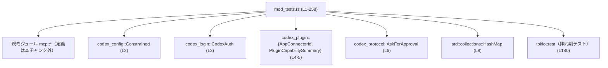
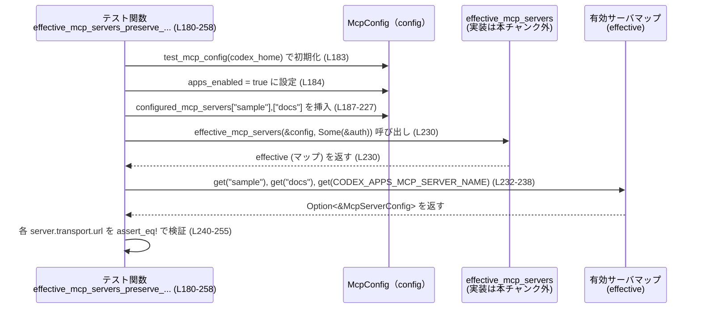

# codex-mcp/src/mcp/mod_tests.rs コード解説

---

## 0. ざっくり一言

このファイルは、`mcp` 親モジュールの **MCP ツール名処理・プラグイン情報集約・Codex Apps 用 MCP サーバ設定** などの関数群の振る舞いを検証するテストモジュールです（定義自体は `use super::*;` でインポートされ、このチャンクには現れません / `codex-mcp/src/mcp/mod_tests.rs:L1`）。

---

## 1. このモジュールの役割

### 1.1 概要

- MCP（Model Context Protocol）関連の設定・ツール・サーバ構成に関する **公開 API の契約（Contract）** をテストで固定する役割を持ちます。
- 具体的には、次のような振る舞いを検証しています。
  - MCP ツール名のプレフィックス付与・分解・サーバごとのグルーピング
  - プラグイン能力サマリから「コネクタ ID」や「MCP サーバ名」ごとのプラグイン一覧を集約する処理
  - Codex Apps 向け MCP エンドポイント URL の生成と、ユーザー定義の MCP サーバと自動追加される Codex Apps サーバの共存ロジック

### 1.2 アーキテクチャ内での位置づけ

このテストモジュールと、依存している外部コンポーネントとの関係を簡略化して示します。



- テスト対象の関数や型（`McpConfig`, `McpServerConfig`, `Tool`, `ToolPluginProvenance` など）は、`use super::*;` により親モジュールからインポートされています（`codex-mcp/src/mcp/mod_tests.rs:L1`）。
- このファイル自身は **テスト専用** であり、ランタイムの本番コードは親モジュール側に存在します。

### 1.3 設計上のポイント

コードから読み取れる設計上の特徴は次のとおりです。

- **小さなヘルパー関数でテスト準備を簡素化**
  - `test_mcp_config` が最小限の `McpConfig` を組み立てます（`codex-mcp/src/mcp/mod_tests.rs:L11-25`）。
  - `make_tool` がテスト用の `Tool` インスタンスを生成します（`L28-38`）。
- **関数ごとに独立したユニットテスト**
  - ツール名関係、プラグイン情報集約、URL 生成、サーバ構成といった関心ごとごとにテスト関数が分かれています（`L41-85`, `L87-126`, `L128-178`, `L180-258`）。
- **非同期テストの利用**
  - `effective_mcp_servers_preserve_user_servers_and_add_codex_apps` は `#[tokio::test]` で実行される非同期テストですが、テスト対象の `effective_mcp_servers` 自体は同期関数として呼ばれています（`L180-231`）。
- **エラー処理の契約確認**
  - `split_qualified_tool_name` が無効なツール名で `None` を返すことを確認するなど、**エラーを返す契約** をテストで明示しています（`L57-61`）。
- **安全性**
  - 本ファイル内では I/O やスレッド共有状態は登場せず、すべてローカル変数と純粋関数呼び出しで構成されているため、並行性やメモリ安全性に関する Rust 固有の問題は現れていません。

---

## 2. 主要な機能一覧とコンポーネントインベントリー

### 2.1 検証対象の主要機能（親モジュールの API）

このファイルのテストから分かる、**親モジュール側の主要機能** は次のとおりです。

- MCP ツール名の取り扱い
  - `split_qualified_tool_name`: `"mcp__{server}__{tool}"` 形式の文字列からサーバ名とツール名を取り出す（`L41-47`, `L57-61`）。
  - `group_tools_by_server`: キーが MCP 形式のツール名であるマップを、サーバ名ごとのマップに再構成する（`L63-85`）。
- プラグイン情報の集約
  - `ToolPluginProvenance::from_capability_summaries`: `PluginCapabilitySummary` の配列から、コネクタ ID / MCP サーバ名ごとのプラグイン表示名リストを構築する（`L87-125`）。
- Codex Apps 用 MCP URL の生成
  - `codex_apps_mcp_url_for_base_url`: 基本 URL から Codex Apps MCP エンドポイント URL を生成する（`L128-145`）。
  - `codex_apps_mcp_url`: `McpConfig` から Codex Apps MCP URL を計算する（`L148-155`）。
- MCP サーバ構成の拡張
  - `with_codex_apps_mcp`: 既存の MCP サーバマップに Codex Apps 用 MCP サーバエントリを条件付きで追加する（`L158-178`）。
  - `effective_mcp_servers`: ユーザー設定と Codex Apps サーバを統合した「有効な」MCP サーバ一覧を返す（`L180-258`）。

### 2.2 このファイルで定義されている関数一覧

| 名前 | 種別 | 役割 / 用途 | 定義位置 |
|------|------|------------|---------|
| `test_mcp_config` | テストヘルパー | 既定値込みの `McpConfig` を生成する | `codex-mcp/src/mcp/mod_tests.rs:L11-25` |
| `make_tool` | テストヘルパー | シンプルな `Tool` インスタンスを生成する | `codex-mcp/src/mcp/mod_tests.rs:L28-38` |
| `split_qualified_tool_name_returns_server_and_tool` | ユニットテスト | 正しい MCP ツール名から `(server, tool)` を取り出せることを確認 | `L41-47` |
| `qualified_mcp_tool_name_prefix_sanitizes_server_names_without_lowercasing` | ユニットテスト | サーバ名から MCP ツール名プレフィックスを作る関数の振る舞いを確認 | `L49-55` |
| `split_qualified_tool_name_rejects_invalid_names` | ユニットテスト | 不正な MCP ツール名で `None` が返ることを確認 | `L57-61` |
| `group_tools_by_server_strips_prefix_and_groups` | ユニットテスト | MCP 形式のツールマップがサーバごとに正しくグループ化されることを確認 | `L63-85` |
| `tool_plugin_provenance_collects_app_and_mcp_sources` | ユニットテスト | プラグイン能力サマリからの集約結果を検証 | `L87-126` |
| `codex_apps_mcp_url_for_base_url_keeps_existing_paths` | ユニットテスト | 種々の base URL から期待通りの Codex Apps URL が生成されることを確認 | `L128-146` |
| `codex_apps_mcp_url_uses_legacy_codex_apps_path` | ユニットテスト | `McpConfig` から旧式パス `backend-api/wham/apps` が使われることを確認 | `L148-155` |
| `codex_apps_server_config_uses_legacy_codex_apps_path` | ユニットテスト | Codex Apps サーバ構成の URL が旧式パスであることを確認 | `L158-178` |
| `effective_mcp_servers_preserve_user_servers_and_add_codex_apps` | 非同期ユニットテスト (`#[tokio::test]`) | ユーザー定義サーバが保持されつつ Codex Apps MCP サーバが追加されることを確認 | `L180-258` |

---

## 3. 公開 API と詳細解説

### 3.1 型一覧（主に親モジュール側の型）

> ※これらの型の定義本体はこのチャンクには現れません。ここでは **テストコードから読み取れるフィールド** と役割だけを記載します。

| 名前 | 種別 | 役割 / 用途 | このチャンクで見える情報 |
|------|------|-------------|---------------------------|
| `McpConfig` | 構造体 | MCP 関連のグローバル設定 | フィールドとして `chatgpt_base_url`, `codex_home`, `mcp_oauth_credentials_store_mode`, `mcp_oauth_callback_port`, `mcp_oauth_callback_url`, `skill_mcp_dependency_install_enabled`, `approval_policy`, `codex_linux_sandbox_exe`, `use_legacy_landlock`, `apps_enabled`, `configured_mcp_servers`, `plugin_capability_summaries` を持つ（`L11-25`, `L187-227`）。定義は親モジュール側に存在。 |
| `McpServerConfig` | 構造体 | 個々の MCP サーバ設定 | フィールドとして `transport`, `enabled`, `required`, `disabled_reason`, `startup_timeout_sec`, `tool_timeout_sec`, `enabled_tools`, `disabled_tools`, `scopes`, `oauth_resource`, `tools` を持つ（`L187-227`）。 |
| `McpServerTransportConfig` | 列挙体（と推定） | MCP サーバとの通信方法 | バリアント `StreamableHttp { url, bearer_token_env_var, http_headers, env_http_headers }` が使われている（`L190-195`, `L211-216`, `L172-175`, `L240-255`）。 |
| `Tool` | 構造体 | MCP ツールのメタデータ | ヘルパー `make_tool` から、フィールド `name`, `title`, `description`, `input_schema`, `output_schema`, `annotations`, `icons`, `meta` を持つことが分かる（`L28-38`）。 |
| `ToolPluginProvenance` | 構造体 | プラグインがどのコネクタ／MCP サーバから来ているかを表す | フィールド `plugin_display_names_by_connector_id` と `plugin_display_names_by_mcp_server_name` を持ち、どちらも `HashMap<String, Vec<String>>` 型に類似した構造として使われている（`L109-124`）。 |
| `PluginCapabilitySummary` | 構造体（外部クレート） | プラグインの能力サマリ | フィールド `display_name`, `app_connector_ids`, `mcp_server_names` が使われ、`default()` で残りを埋めている（`L90-104`）。 |
| `AppConnectorId` | 新しい型ラッパ（外部クレート） | アプリコネクタの ID | `AppConnectorId(String)` のタプル構造体形式で初期化されている（`L92`, `L98-100`）。 |
| `CodexAuth` | 構造体（外部クレート） | Codex / ChatGPT 認証情報 | テストでは `create_dummy_chatgpt_auth_for_testing()` でダミー認証情報を生成している（`L161`, `L185`）。 |

### 3.2 重要関数の詳細（テストから読み取れる範囲）

> ここで説明する関数は **親モジュール側に定義** されており、このファイルには実装が現れません。  
> したがって、「内部処理」はテストが保証している振る舞いの範囲に限定して記述します。

---

#### `split_qualified_tool_name(input: &str) -> Option<(String, String)>`（推定）

**概要**

- MCP ツール名 `"mcp__{server}__{tool}"` 形式の文字列から、サーバ名とツール名を分解する関数としてテストされています（`L41-47`）。
- 無効な形式の文字列に対しては `None` を返すことがテストで確認されています（`L57-61`）。

**引数（テストからの推定）**

| 引数名 | 型 | 説明 |
|--------|----|------|
| `input` | `&str` と推定 | MCP ツール名を表す文字列。例: `"mcp__alpha__do_thing"`（`L44`）。 |

**戻り値（テストからの推定）**

- `Option<(String, String)>` に相当する値。
  - 正常な入力の場合: `Some((server_name, tool_name))`（`L44-46`）。
  - 無効な入力の場合: `None`（`L59-60`）。

**テストから分かる振る舞い**

- `"mcp__alpha__do_thing"` → `Some(("alpha", "do_thing"))`（`L44-46`）。
- `"other__alpha__do_thing"` → `None` （接頭辞 `"mcp__"` でないため）（`L59`）。
- `"mcp__alpha__"` → `None` （ツール名部分が空のため）（`L60`）。

これらから次が言えます。

- プレフィックスが `"mcp__"` でない場合は無効として扱われる。
- `"mcp__{server}__{tool}"` 形式でも、`{tool}` が空文字列であれば無効。
- `"mcp__alpha__nested__op"` のように `'__'` が追加で含まれるケースについては、この関数単体ではテストされていません（`L68-69` では `group_tools_by_server` の入力としてのみ使用）。

**Examples（使用例）**

```rust
// 正常ケース（テストと同等）                                  // codex-mcp/src/mcp/mod_tests.rs:L41-47
assert_eq!(
    split_qualified_tool_name("mcp__alpha__do_thing"),
    Some(("alpha".to_string(), "do_thing".to_string())),
);

// 無効な形式（プレフィックスが違う）                          // L57-61
assert_eq!(
    split_qualified_tool_name("other__alpha__do_thing"),
    None,
);

// 無効な形式（ツール名が空）
assert_eq!(
    split_qualified_tool_name("mcp__alpha__"),
    None,
);
```

**Errors / Panics**

- テストでは、無効な入力時に `None` が返ることのみ確認されており、パニックは期待されていません（`L59-60`）。
- その他の入力（極端に長い文字列など）での挙動は、このチャンクからは分かりません。

**Edge cases（エッジケース）**

- プレフィックスが `"mcp__"` 以外 → `None`（`L59`）。
- 最後の区切り以降が空 → `None`（`L60`）。
- ツール名側に `'__'` を含む（例: `"mcp__alpha__nested__op"`）場合の扱いは、この関数単体ではテストされていません。

**使用上の注意点**

- `"mcp__{server}__{tool}"` 形式でない文字列を渡した場合、`None` が返る前提で扱う必要があります。
- `None` を `unwrap()` するなどのコードを書くとパニックになりうるため、`match` や `if let` でハンドリングすることが想定されます。

---

#### `group_tools_by_server(tools: &HashMap<String, Tool>) -> HashMap<String, HashMap<String, Tool>>`（推定）

**概要**

- キーが MCP 形式のツール名（`"mcp__{server}__{tool}"`）である `HashMap` を、サーバ名ごとのネストした `HashMap` に変換する関数としてテストされています（`L63-85`）。

**引数（テストからの推定）**

| 引数名 | 型 | 説明 |
|--------|----|------|
| `tools` | `HashMap<String, Tool>` と推定 | キーが MCP 形式のツール名、値が `Tool` のマップ（`L65-71`）。 |

**戻り値（テストからの推定）**

- `HashMap<String, HashMap<String, Tool>>` に類似する構造。
  - 第一キー: サーバ名（例: `"alpha"`, `"beta"`）。
  - 第二キー: ツール名（例: `"do_thing"`, `"nested__op"`）。
- テストでは `assert_eq!` で `HashMap` 同士を比較しているため、標準の `HashMap` である可能性が高いですが、型定義はこのチャンクには現れません（`L80-85`）。

**テストから分かる振る舞い**

入力（省略）→ `group_tools_by_server(&tools)` の結果は、次のような構造になります（`L65-82`）。

- `"mcp__alpha__do_thing"` → サーバ `"alpha"`, ツール `"do_thing"` としてグルーピング（`L65-66`, `L73-75`）。
- `"mcp__alpha__nested__op"` → サーバ `"alpha"`, ツール `"nested__op"`（`L67-70`, `L73-75`）。
- `"mcp__beta__do_other"` → サーバ `"beta"`, ツール `"do_other"`（`L71`, `L77-78`）。

**Examples（使用例）**

```rust
// 入力マップ                                                     // codex-mcp/src/mcp/mod_tests.rs:L63-71
let mut tools = HashMap::new();
tools.insert("mcp__alpha__do_thing".to_string(), make_tool("do_thing"));
tools.insert("mcp__alpha__nested__op".to_string(), make_tool("nested__op"));
tools.insert("mcp__beta__do_other".to_string(), make_tool("do_other"));

// 期待されるグルーピング結果                                   // L73-82
let mut expected_alpha = HashMap::new();
expected_alpha.insert("do_thing".to_string(), make_tool("do_thing"));
expected_alpha.insert("nested__op".to_string(), make_tool("nested__op"));

let mut expected_beta = HashMap::new();
expected_beta.insert("do_other".to_string(), make_tool("do_other"));

let mut expected = HashMap::new();
expected.insert("alpha".to_string(), expected_alpha);
expected.insert("beta".to_string(), expected_beta);

assert_eq!(group_tools_by_server(&tools), expected);
```

**Errors / Panics**

- テストでは例外ケースについては検証されていません。
- 無効なキー（`"mcp__"` 形式でない文字列）を含む場合の挙動は、このチャンクからは不明です。

**Edge cases**

- ツール名部分に `'__'` が含まれても、テストでは `"nested__op"` がそのまま第二キーとして扱われています（`L68-69`, `L75`）。
- 空の `tools` を渡したときの戻り値はテストされていません（おそらく空マップになりますが、未確認）。

**使用上の注意点**

- 入力のキー形式が `split_qualified_tool_name` の期待形式と一致していることを前提にしている可能性がありますが、実装はこのチャンクに存在しないため詳細は不明です。
- 非 MCP 形式のキーを混在させると、パニックや無視などのどの挙動になるかはテストからは読み取れません。

---

#### `ToolPluginProvenance::from_capability_summaries(summaries: &[PluginCapabilitySummary]) -> ToolPluginProvenance`

**概要**

- 複数の `PluginCapabilitySummary` から、プラグインの「出どころ」を集約した `ToolPluginProvenance` を生成する関連関数です（`L87-105`）。

**引数（テストからの推定）**

| 引数名 | 型 | 説明 |
|--------|----|------|
| `summaries` | `&[PluginCapabilitySummary]` | プラグイン能力サマリのスライス。各要素が `display_name`, `app_connector_ids`, `mcp_server_names` を持つ（`L90-104`）。 |

**戻り値**

- `ToolPluginProvenance` 構造体（`L89`, `L109-124`）。
  - `plugin_display_names_by_connector_id: HashMap<String, Vec<String>>`
  - `plugin_display_names_by_mcp_server_name: HashMap<String, Vec<String>>`

**テストから分かる振る舞い**

入力は 2 つのプラグインサマリです（`L90-104`）。

1. `"alpha-plugin"`:  
   - `app_connector_ids`: `["connector_example"]`  
   - `mcp_server_names`: `["alpha"]`
2. `"beta-plugin"`:  
   - `app_connector_ids`: `["connector_example", "connector_gmail"]`  
   - `mcp_server_names`: `["beta"]`

期待される `ToolPluginProvenance` は（`L109-124`）:

- `plugin_display_names_by_connector_id`:
  - `"connector_example"` → `["alpha-plugin", "beta-plugin"]`
  - `"connector_gmail"` → `["beta-plugin"]`
- `plugin_display_names_by_mcp_server_name`:
  - `"alpha"` → `["alpha-plugin"]`
  - `"beta"` → `["beta-plugin"]`

**Examples（使用例）**

```rust
// 入力サマリの配列                                              // codex-mcp/src/mcp/mod_tests.rs:L87-105
let provenance = ToolPluginProvenance::from_capability_summaries(&[
    PluginCapabilitySummary {
        display_name: "alpha-plugin".to_string(),
        app_connector_ids: vec![AppConnectorId("connector_example".to_string())],
        mcp_server_names: vec!["alpha".to_string()],
        ..PluginCapabilitySummary::default()
    },
    PluginCapabilitySummary {
        display_name: "beta-plugin".to_string(),
        app_connector_ids: vec![
            AppConnectorId("connector_example".to_string()),
            AppConnectorId("connector_gmail".to_string()),
        ],
        mcp_server_names: vec!["beta".to_string()],
        ..PluginCapabilitySummary::default()
    },
]);

// 期待される集約結果                                           // L109-124
assert_eq!(
    provenance,
    ToolPluginProvenance {
        plugin_display_names_by_connector_id: HashMap::from([
            ("connector_example".to_string(), vec!["alpha-plugin".to_string(), "beta-plugin".to_string()]),
            ("connector_gmail".to_string(), vec!["beta-plugin".to_string()]),
        ]),
        plugin_display_names_by_mcp_server_name: HashMap::from([
            ("alpha".to_string(), vec!["alpha-plugin".to_string()]),
            ("beta".to_string(), vec!["beta-plugin".to_string()]),
        ]),
    }
);
```

**Errors / Panics・Edge cases**

- 空のサマリ配列や、同じプラグインが複数回現れる場合の扱いはテストされていません。
- コネクタ ID や MCP サーバ名が重複する場合も、単純に `Vec` に追加されるのか、重複排除されるのかは不明です。

**使用上の注意点**

- テストではプラグイン名の順序が入力順を保っているように見えますが、順序が仕様として保証されているかはこのチャンクからは断定できません。

---

#### `codex_apps_mcp_url_for_base_url(base_url: &str) -> String`

**概要**

- ChatGPT / Codex の「ベース URL」から、Codex Apps 用 MCP エンドポイントの URL を生成する関数です（`L128-145`）。

**引数**

| 引数名 | 型 | 説明 |
|--------|----|------|
| `base_url` | `&str` | ChatGPT / Codex のベース URL（`L131`, `L135`, `L139`, `L143`）。 |

**戻り値**

- `String`（と推定）。`assert_eq!` で `&str` リテラルと比較されています（`L131-145`）。

**テストから分かる振る舞い**

- `"https://chatgpt.com/backend-api"`  
  → `"https://chatgpt.com/backend-api/wham/apps"`（`L131-133`）
- `"https://chat.openai.com"`  
  → `"https://chat.openai.com/backend-api/wham/apps"`（`L135-137`）
- `"http://localhost:8080/api/codex"`  
  → `"http://localhost:8080/api/codex/apps"`（`L139-141`）
- `"http://localhost:8080"`  
  → `"http://localhost:8080/api/codex/apps"`（`L143-145`）

少なくとも次のことが言えます。

- `chatgpt.com` / `chat.openai.com` 系の URL では `/backend-api` 以下に `/wham/apps` を付与する。
- ローカルホストの API では `/api/codex` のパスを使い、その後ろに `/apps` を付与する。

**Examples（使用例）**

```rust
assert_eq!(
    codex_apps_mcp_url_for_base_url("https://chatgpt.com/backend-api"),
    "https://chatgpt.com/backend-api/wham/apps",
);

assert_eq!(
    codex_apps_mcp_url_for_base_url("http://localhost:8080"),
    "http://localhost:8080/api/codex/apps",
);
```

**Errors / Panics・Edge cases**

- スキームが `https` / `http` 以外の場合や、末尾に `/` が付いた base URL などに対する挙動はこのチャンクからは不明です。
- URL の正当性検証をどの程度行っているかも分かりません。

**使用上の注意点**

- ベース URL のフォーマットによって生成されるパスが変わるため、指定する base URL が想定どおりかどうかを事前に確認する必要があります。

---

#### `codex_apps_mcp_url(config: &McpConfig) -> String`（推定）

**概要**

- `McpConfig`（特に `chatgpt_base_url`）から、Codex Apps MCP エンドポイント URL を計算するヘルパー関数としてテストされています（`L148-155`）。

**引数・戻り値**

| 引数名 | 型 | 説明 |
|--------|----|------|
| `config` | `&McpConfig` | `chatgpt_base_url` などの設定を含む構造体（`L150-152`）。 |

戻り値は `String` と推定されます（`assert_eq!` の右辺が `&str` リテラルであるため / `L152-155`）。

**テストから分かる振る舞い**

- `test_mcp_config` で生成した `config` の `chatgpt_base_url` は `"https://chatgpt.com"` に固定されています（`L11-13`）。
- この `config` に対する `codex_apps_mcp_url(&config)` は  
  `"https://chatgpt.com/backend-api/wham/apps"` を返します（`L152-155`）。

これは、`codex_apps_mcp_url_for_base_url("https://chatgpt.com")` の結果と一致しています（`L135-137`）。

**使用上の注意点**

- `McpConfig` の他のフィールド（`apps_enabled` など）は、この関数では使用されない可能性がありますが、実装はこのチャンクには現れません。
- ベース URL の値に依存するため、`chatgpt_base_url` を変更した場合はこの関数の戻り値も変化します。

---

#### `with_codex_apps_mcp(servers: HashMap<_, McpServerConfig>, auth: Option<&CodexAuth>, config: &McpConfig) -> HashMap<_, McpServerConfig>`（推定）

**概要**

- 既存の MCP サーバマップに対し、Codex Apps 用 MCP サーバを条件付きで追加する関数としてテストされています（`L158-178`）。

**引数（テストからの推定）**

| 引数名 | 型 | 説明 |
|--------|----|------|
| `servers` | `HashMap<_, McpServerConfig>` と推定 | 既存の MCP サーバ設定のマップ。最初は空マップが渡されている（`L163`）。 |
| `auth` | `Option<&CodexAuth>` | Codex 認証情報。`None` または `Some(&auth)`（`L163`, `L168`）。 |
| `config` | `&McpConfig` | `apps_enabled` などの設定を含む（`L160-168`）。 |

**戻り値**

- 引数の `servers` に Codex Apps サーバが追加された（またはされていない）新しいマップ（`L163-168`）。

**テストから分かる振る舞い**

1. `apps_enabled = false`, `auth = None` の場合（`L160-166`）:
   - `servers = with_codex_apps_mcp(HashMap::new(), None, &config);`
   - 戻り値 `servers` は `CODEX_APPS_MCP_SERVER_NAME` キーを **含まない**（`L163-165`）。

2. `apps_enabled = true`, `auth = Some(&auth)` の場合（`L166-177`）:
   - 同じ `servers` に対し `with_codex_apps_mcp(servers, Some(&auth), &config)` を呼び出す（`L168`）。
   - 結果の `servers` には `CODEX_APPS_MCP_SERVER_NAME` キーが存在し、その値の `transport` は  
     `McpServerTransportConfig::StreamableHttp { url: "https://chatgpt.com/backend-api/wham/apps", .. }` である（`L169-177`）。

**Examples（使用例）**

```rust
let mut config = test_mcp_config(PathBuf::from("/tmp"));        // apps_enabled は false で開始（L11-23, L160）
let auth = CodexAuth::create_dummy_chatgpt_auth_for_testing();  // L161

// apps_enabled=false & auth=None → Codex Apps サーバは追加されない   // L163-165
let mut servers = with_codex_apps_mcp(HashMap::new(), None, &config);
assert!(!servers.contains_key(CODEX_APPS_MCP_SERVER_NAME));

// apps_enabled=true & auth=Some → Codex Apps サーバが追加される      // L166-177
config.apps_enabled = true;

servers = with_codex_apps_mcp(servers, Some(&auth), &config);
let server = servers
    .get(CODEX_APPS_MCP_SERVER_NAME)
    .expect("codex apps should be present when apps is enabled");
let url = match &server.transport {
    McpServerTransportConfig::StreamableHttp { url, .. } => url,
    _ => panic!("expected streamable http transport for codex apps"),
};

assert_eq!(url, "https://chatgpt.com/backend-api/wham/apps");
```

**Contracts / Edge cases**

- **前提条件**:
  - `config.apps_enabled == true` かつ `auth.is_some()` のときに Codex Apps MCP サーバが追加される、という前提がテストで固定されています（`L166-169`）。
- **エッジケース**:
  - `apps_enabled = true` かつ `auth = None` の場合の挙動はテストされていません。
  - 既に `CODEX_APPS_MCP_SERVER_NAME` キーが存在するマップを渡したときの扱いは不明です。

**使用上の注意点**

- 認証情報がない状態 (`auth = None`) で Codex Apps を有効化したい場合、実装がどのように振る舞うかはこのチャンクからは分からないため、本番コードを確認する必要があります。
- 戻り値のマップをそのまま捨てず、**必ず戻り値で上書き** して利用するパターンになっています（`servers = with_codex_apps_mcp(servers, ...)` / `L168`）。

---

#### `effective_mcp_servers(config: &McpConfig, auth: Option<&CodexAuth>) -> MapLike`（推定）

**概要**

- ユーザーが設定した MCP サーバ (`configured_mcp_servers`) と、Codex Apps 用の MCP サーバを統合した「有効な MCP サーバ一覧」を返す関数としてテストされています（`L180-258`）。

**引数（テストからの推定）**

| 引数名 | 型 | 説明 |
|--------|----|------|
| `config` | `&McpConfig` | `apps_enabled`, `configured_mcp_servers` などを含む設定（`L183-227`）。 |
| `auth` | `Option<&CodexAuth>` | 認証情報。非 `None` の場合に Codex Apps サーバを追加するために使われていると推測されます（`L185`, `L230`）。 |

**戻り値**

- `.get(&str)` メソッドを持つマップ型（`effective.get("sample")` など / `L232-238`）。
- 要素の値は `McpServerConfig` 型（`L232-255`）。

**テストから分かる振る舞い**

1. 準備（`L180-227`）:
   - 一時ディレクトリを作成し、そのパスを `McpConfig.codex_home` に設定（`L182-184`）。
   - `config.apps_enabled = true` に設定（`L184`）。
   - `config.configured_mcp_servers` に `"sample"`, `"docs"` の 2 サーバを追加（`L187-227`）。
     - どちらも `transport` は `McpServerTransportConfig::StreamableHttp` で、それぞれ異なる URL を持つ（`L190-195`, `L211-216`）。

2. 関数呼び出しと検証（`L230-257`）:
   - `let effective = effective_mcp_servers(&config, Some(&auth));`（`L230`）
   - 戻り値 `effective` に次のキーが存在することを確認（`L232-238`）。
     - `"sample"`（元のユーザーサーバ）
     - `"docs"`（元のユーザーサーバ）
     - `CODEX_APPS_MCP_SERVER_NAME`（Codex Apps サーバ）
   - 各サーバの `transport` が期待どおりであることを検証（`L240-255`）:
     - `"sample"` → URL `"https://user.example/mcp"`（`L241-243`）。
     - `"docs"` → URL `"https://docs.example/mcp"`（`L247-249`）。
     - Codex Apps → URL `"https://chatgpt.com/backend-api/wham/apps"`（`L253-255`）。

**Examples（使用例）**

```rust
// 設定準備                                                        // codex-mcp/src/mcp/mod_tests.rs:L180-227
let codex_home = tempfile::tempdir().expect("tempdir");
let mut config = test_mcp_config(codex_home.path().to_path_buf());
config.apps_enabled = true;
let auth = CodexAuth::create_dummy_chatgpt_auth_for_testing();

// ユーザー定義サーバを設定
config.configured_mcp_servers.insert(
    "sample".to_string(),
    McpServerConfig { /* transport: https://user.example/mcp, ... */ }
);
config.configured_mcp_servers.insert(
    "docs".to_string(),
    McpServerConfig { /* transport: https://docs.example/mcp, ... */ }
);

// 有効な MCP サーバ一覧の計算                                   // L230-238
let effective = effective_mcp_servers(&config, Some(&auth));

let sample = effective.get("sample").expect("user server should exist");
let docs = effective.get("docs").expect("configured server should exist");
let codex_apps = effective.get(CODEX_APPS_MCP_SERVER_NAME).expect("codex apps server should exist");

// URL の検証                                                      // L240-255
match &sample.transport {
    McpServerTransportConfig::StreamableHttp { url, .. } =>
        assert_eq!(url, "https://user.example/mcp"),
    other => panic!("expected streamable http transport, got {other:?}"),
}
```

**Contracts / Edge cases**

- **保持されるべき契約**（テストで固定されている）:
  - `configured_mcp_servers` に存在するユーザー定義サーバは、`effective_mcp_servers` の戻り値にもそのまま残る（`L187-227`, `L232-235`, `L240-251`）。
  - `config.apps_enabled = true` かつ `auth = Some(_)` であれば、Codex Apps サーバが追加される（`L184-186`, `L236-238`, `L252-255`）。
- **未カバーのエッジケース**:
  - `apps_enabled = false` の場合の戻り値（Codex Apps サーバが含まれるかどうか）。
  - `auth = None` の場合の挙動。
  - ユーザーが `CODEX_APPS_MCP_SERVER_NAME` と同名のサーバを設定した場合の優先順位。

**使用上の注意点**

- 戻り値のマップに対して `.get` を前提にアクセスしているため、呼び出し側でキーの存在を確認するか、`expect` などを使う必要があります（`L232-238`）。
- この関数は同期的に呼ばれており、`async` ではないことがテストから分かります（`L230`）。非同期コンテキストの中でも普通の同期関数として使用できます。

---

### 3.3 その他の関数・ヘルパー

| 関数名 | 役割（1 行） | 備考 |
|--------|--------------|------|
| `qualified_mcp_tool_name_prefix(server_name: &str) -> String`（推定） | サーバ名から `"mcp__{sanitized_server}__"` 形式のプレフィックスを生成する | `"Some-Server"` → `"mcp__Some_Server__"` を返すことがテストで確認されている（`L49-55`）。 |
| `test_mcp_config(codex_home: PathBuf) -> McpConfig` | テスト用の `McpConfig` を生成する | `chatgpt_base_url` などを固定値に設定し、他フィールドを既定値にしている（`L11-25`）。 |
| `make_tool(name: &str) -> Tool` | テスト用の `Tool` を生成する | シリアライズ可能な最低限の `input_schema` を持つツールを作成する（`L28-38`）。 |

---

## 4. データフロー

### 4.1 代表的なシナリオ: `effective_mcp_servers` による統合（L180-258）

このシナリオでは、ユーザー定義の MCP サーバ設定と Codex Apps サーバがどのように統合されるかをテストしています。

1. 一時ディレクトリから `McpConfig` を生成し、`apps_enabled = true` に設定（`L182-185`）。
2. `config.configured_mcp_servers` に `"sample"`, `"docs"` の 2 サーバを追加（`L187-227`）。
3. `effective_mcp_servers(&config, Some(&auth))` を呼び出し、戻り値 `effective` マップを取得（`L230`）。
4. `effective` から `"sample"`, `"docs"`, `CODEX_APPS_MCP_SERVER_NAME` をキーにサーバ設定を取り出し、それぞれの URL を検証（`L232-255`）。

これをシーケンス図で表すと次のようになります。



- この図から、`effective_mcp_servers` が **新しいマップを返す「純粋関数」的な API** として扱われていることが分かります（`L230`）。
- テストは URL の検証に集中しており、タイムアウトや OAuth 設定など他のフィールドは検証対象外です（`L196-205`, `L217-226`）。

---

## 5. 使い方（How to Use）

> このファイルはテストコードですが、親モジュールの API をどのように利用するかの「使用例」としても参考になります。

### 5.1 Codex Apps MCP URL を生成する基本的な使い方

```rust
// 1. 設定構造体を用意                                        // codex-mcp/src/mcp/mod_tests.rs:L11-25, L148-155
let codex_home = std::path::PathBuf::from("/tmp");
let config = test_mcp_config(codex_home);

// 2. Codex Apps MCP URL を取得
let apps_url = codex_apps_mcp_url(&config);

// 3. URL を利用（ログ出力など）
println!("Codex Apps MCP URL: {apps_url}");
assert_eq!(apps_url, "https://chatgpt.com/backend-api/wham/apps");
```

- `test_mcp_config` の実装はテスト専用ですが、本番コードでも同様に `McpConfig` の `chatgpt_base_url` を設定した上で `codex_apps_mcp_url` を呼び出す形になります。

### 5.2 MCP ツールのグルーピング

```rust
use std::collections::HashMap;

// 1. MCP 形式のツール名をキーとしたマップを作る                   // L63-71
let mut tools = HashMap::new();
tools.insert("mcp__alpha__do_thing".to_string(), make_tool("do_thing"));
tools.insert("mcp__alpha__nested__op".to_string(), make_tool("nested__op"));
tools.insert("mcp__beta__do_other".to_string(), make_tool("do_other"));

// 2. サーバごとにグルーピング                                  // L84
let grouped = group_tools_by_server(&tools);

// 3. 結果を利用
let alpha_tools = grouped.get("alpha").expect("alpha server tools");
assert!(alpha_tools.contains_key("do_thing"));
assert!(alpha_tools.contains_key("nested__op"));

let beta_tools = grouped.get("beta").expect("beta server tools");
assert!(beta_tools.contains_key("do_other"));
```

- この例では、`split_qualified_tool_name` の契約（`"mcp__{server}__{tool}"` 形式）に従ったキーを渡していることが重要です。

### 5.3 よくある間違い

```rust
// 間違い例: プレフィックスが "mcp__" でないツール名を渡す
let result = split_qualified_tool_name("alpha__do_thing");
// result は None になり、unwrap するとパニックする可能性がある

// 正しい例: "mcp__{server}__{tool}" 形式で渡し、None を安全に扱う
if let Some((server, tool)) = split_qualified_tool_name("mcp__alpha__do_thing") {
    println!("server={server}, tool={tool}");
} else {
    // エラーハンドリング
}
```

```rust
// 間違い例: with_codex_apps_mcp の戻り値を無視する            // パターンとして起こりうる誤用
let mut servers = HashMap::new();
with_codex_apps_mcp(servers, Some(&auth), &config);  // 戻り値を受け取っていない

// 正しい例: 戻り値でマップを上書きする                         // L163-168
let servers = HashMap::new();
let servers = with_codex_apps_mcp(servers, Some(&auth), &config);
```

---

## 5.4 使用上の注意点（まとめ）

- **ツール名のフォーマット**:
  - `split_qualified_tool_name` および `group_tools_by_server` は `"mcp__{server}__{tool}"` 形式を前提としているため、この形式を守る必要があります（`L41-47`, `L63-71`）。
- **Codex Apps の有効化**:
  - Codex Apps MCP サーバを追加するには `config.apps_enabled = true` であること、および `auth = Some(_)` が必要である前提がテストで固定されています（`L160-169`, `L184-186`, `L230-238`）。
- **戻り値マップの再代入**:
  - `with_codex_apps_mcp` や `effective_mcp_servers` は新しいマップを返すスタイルの API であり、引数のマップをインプレースで更新しているとは限りません。戻り値で上書きする前提で呼び出されています（`L163-168`, `L230`）。

---

## 6. 変更の仕方（How to Modify）

### 6.1 新しい機能を追加する場合（親モジュール側）

このテストファイルの観点から見ると、親モジュールに新しい機能を追加した際の流れは次のようになります。

1. **親モジュールに新関数・新フィールドを追加**
   - 例: 新しい MCP サーバ種別、URL ルールなど。
2. **契約（期待される振る舞い）をテストとして記述**
   - 本ファイルに新しい `#[test]` または `#[tokio::test]` 関数を追加し、具体的な入力と期待される出力を `assert_eq!` などで記述します。
3. **必要ならテストヘルパーを拡張**
   - `test_mcp_config` や `make_tool` にフィールドを追加したり、別のヘルパー関数を作成する（`L11-25`, `L28-38`）。

### 6.2 既存の機能を変更する場合

- 影響範囲の確認:
  - ツール名フォーマットの変更 → `split_qualified_tool_name*` と `group_tools_by_server_*` 系テスト（`L41-61`, `L63-85`）を確認。
  - Codex Apps URL ロジックの変更 → `codex_apps_mcp_url_for_base_url_*` と `codex_apps_mcp_url_*` 系テスト（`L128-146`, `L148-155`）。
  - MCP サーバ統合ロジックの変更 → `codex_apps_server_config_*` と `effective_mcp_servers_*` テスト（`L158-178`, `L180-258`）。
- 契約の保持:
  - テストが表現している契約（例えば「ユーザーサーバの URL はそのまま変わらない」など / `L240-251`）を維持するか、仕様変更としてテストを書き換えるかを決めます。
- テストの更新:
  - 振る舞いを変える場合は、まず意図を反映したテストを書き換え、その後に実装を修正することで、仕様のドキュメントとしてテストを活用できます。

---

## 7. 関連ファイル

このテストモジュールと密接に関係するコンポーネントをまとめます。

| パス / モジュール | 役割 / 関係 |
|------------------|------------|
| `super` モジュール（`use super::*;`） | `McpConfig`, `McpServerConfig`, `McpServerTransportConfig`, `Tool`, `ToolPluginProvenance`, `split_qualified_tool_name` など、本テストの対象となる型・関数を提供する。実際のファイル名はこのチャンクからは分かりません（`L1`）。 |
| `codex_config::Constrained` | `approval_policy` フィールドの値を構築するために使われています（`L19`）。 |
| `codex_login::CodexAuth` | Codex / ChatGPT 認証情報。Codex Apps MCP サーバの追加条件としてテストで利用されています（`L161`, `L185`）。 |
| `codex_plugin::{AppConnectorId, PluginCapabilitySummary}` | `ToolPluginProvenance::from_capability_summaries` の入力として使用されるプラグイン能力サマリを表現します（`L90-104`）。 |
| `codex_protocol::protocol::AskForApproval` | `approval_policy` の既定値 `OnFailure` を設定するために使用（`L19`）。 |
| `tempfile` クレート | テスト用に一時ディレクトリを作成し、`McpConfig.codex_home` に設定するために使用されています（`L182`）。 |

---

このファイルは、親モジュールの MCP 関連 API の **仕様をテストという形で固定するドキュメント** として機能しています。挙動を変更する際は、このテスト群が表現している契約を読み解きながら進めることが重要です。
