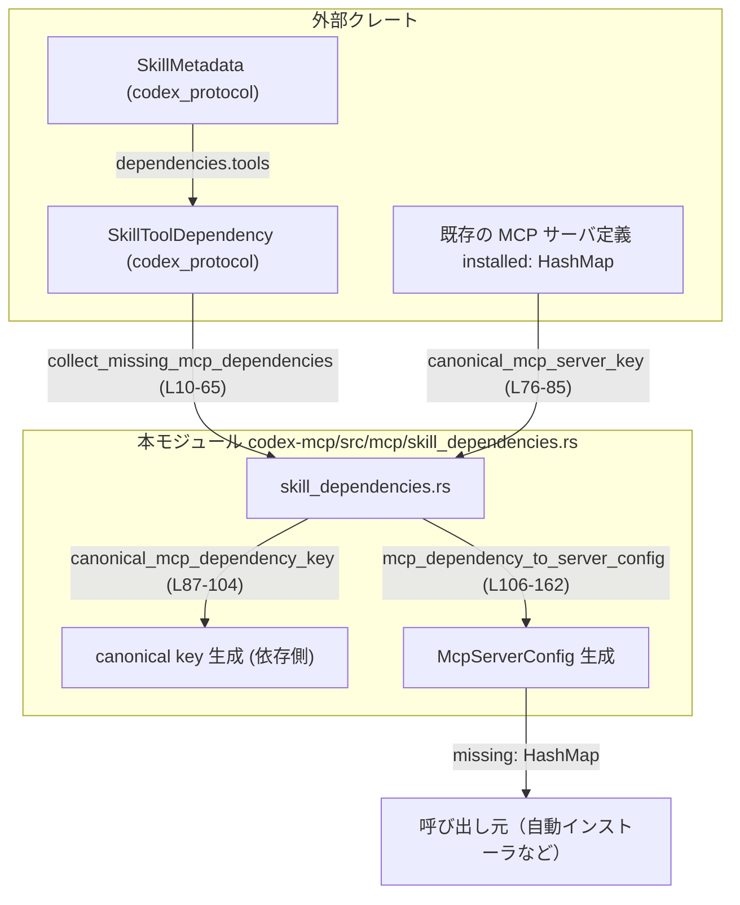
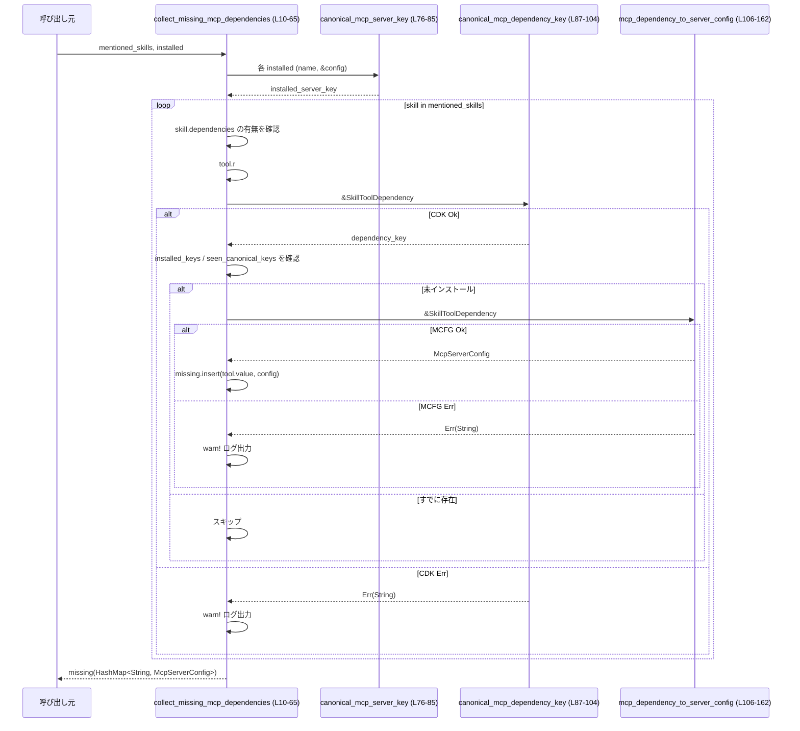

# codex-mcp/src/mcp/skill_dependencies.rs コード解説

## 0. ざっくり一言

MCP 対応スキルが宣言している「MCP サーバ依存関係」から、まだインストールされていない MCP サーバの設定 (`McpServerConfig`) を自動生成し、収集するユーティリティです。

---

## 1. このモジュールの役割

### 1.1 概要

- このモジュールは **スキルが要求する MCP サーバ** と **すでにインストール済みの MCP サーバ** を突き合わせて、足りない MCP サーバ設定を洗い出します。
- MCP サーバや依存関係に対して、**トランスポート種別＋識別子からなる正規化キー（canonical key）** を生成します。
- MCP 依存関係の定義 (`SkillToolDependency`) から、**最小限の `McpServerConfig` を構築**します。

### 1.2 アーキテクチャ内での位置づけ

このモジュールは、`codex_protocol` のスキル定義と `codex_config` の MCP サーバ設定の橋渡しを行う位置づけです。



- 入力:
  - `mentioned_skills: &[SkillMetadata]`（スキルメタデータ）【L10-12】
  - `installed: &HashMap<String, McpServerConfig>`（既存 MCP サーバ設定）【L11-12】
- 出力:
  - `HashMap<String, McpServerConfig>`（自動で追加すべき MCP サーバ設定）【L13】

### 1.3 設計上のポイント

- すべて **純粋関数（関数スコープ内のローカル状態のみを使用）** として実装されています。【L10-65, L67-85, L87-104, L106-162】
- MCP サーバを一意に識別するための **canonical key を一箇所（`canonical_mcp_key`）に集約** しています。【L67-74】
- トランスポート種別は現在 `streamable_http` と `stdio` のみを明示サポートし、それ以外はエラー文字列で扱います。【L88-103, L109-112, L135-161】
- エラーは `Result<_, String>` として返し、呼び出し元（`collect_missing_mcp_dependencies`）では `tracing::warn!` ログに出してスキップする設計です。【L30-40, L47-57】
- グローバルな可変状態や `unsafe` は使用しておらず、**並行実行してもデータ競合が起きにくい構造**になっています。

---

## 2. 主要な機能一覧（＋コンポーネントインベントリー）

### 2.1 機能一覧

- スキルの MCP 依存関係解析:
  - `collect_missing_mcp_dependencies` が、スキルに宣言された MCP 依存関係から、未インストールの MCP サーバ設定を収集します。【L10-65】
- MCP サーバの canonical key 生成（インストール済み側）:
  - `canonical_mcp_server_key` が、`McpServerConfig` からトランスポートごとの一意キーを生成します。【L76-85】
- MCP 依存定義からの canonical key 生成（依存側）:
  - `canonical_mcp_dependency_key` が、`SkillToolDependency` から一意キーを生成します。【L87-104】
- MCP 依存定義からの `McpServerConfig` 自動生成:
  - `mcp_dependency_to_server_config` が、HTTP / stdio 用の最小構成のサーバ設定を作ります。【L106-162】
- canonical key 共通ロジック:
  - `canonical_mcp_key` が、トランスポート種別と識別子から `mcp__{transport}__{identifier}` 形式のキーを構築します。【L67-74】

### 2.2 関数インベントリー（行番号付き）

| 名前 | 種別 | 公開範囲 | 役割 / 用途 | 定義位置 |
|------|------|----------|-------------|----------|
| `collect_missing_mcp_dependencies` | 関数 | `pub` | スキルから要求されている MCP サーバのうち、未インストールのものの設定を収集する | `skill_dependencies.rs:L10-65` |
| `canonical_mcp_key` | 関数 | `fn` (private) | トランスポート＋識別子から canonical MCP キーを生成する共通ヘルパ | `skill_dependencies.rs:L67-74` |
| `canonical_mcp_server_key` | 関数 | `pub` | 既存 `McpServerConfig` から canonical MCP サーバキーを生成する | `skill_dependencies.rs:L76-85` |
| `canonical_mcp_dependency_key` | 関数 | `fn` (private) | `SkillToolDependency` から canonical MCP 依存キーを生成する | `skill_dependencies.rs:L87-104` |
| `mcp_dependency_to_server_config` | 関数 | `fn` (private) | `SkillToolDependency` から `McpServerConfig` を構築する | `skill_dependencies.rs:L106-162` |
| `tests` モジュール | テストモジュール | `#[cfg(test)]` | このモジュール用のテストを外部ファイルから読み込む | `skill_dependencies.rs:L164-166` |

---

## 3. 公開 API と詳細解説

### 3.1 型一覧（構造体・列挙体など）

このモジュール内で **新たに定義される型はありません**。外部クレートから次の型を利用しています。

| 名前 | 所属 | 役割 / 用途 | 根拠 |
|------|------|------------|------|
| `McpServerConfig` | `codex_config` | MCP サーバの設定を表す構造体。トランスポート種別や有効/無効フラグ、タイムアウトなどを保持します。詳細定義はこのチャンクには現れません。 | `skill_dependencies.rs:L4, L115-132, L140-158` |
| `McpServerTransportConfig` | `codex_config` | MCP サーバのトランスポート設定（`Stdio` / `StreamableHttp`）を表す列挙体と推測できます。 | `skill_dependencies.rs:L5, L77-83, L116-121, L141-147` |
| `SkillMetadata` | `codex_protocol::protocol` | スキルのメタデータ。`name` や `dependencies` フィールドを持つことが分かります。その他のフィールドはこのチャンクには現れません。 | `skill_dependencies.rs:L6, L21-24, L34-37, L51-54` |
| `SkillToolDependency` | `codex_protocol::protocol` | スキルが依存する「ツール」を表す定義。`r#type`, `value`, `transport`, `url`, `command` などのフィールドを持ちます。 | `skill_dependencies.rs:L7, L26-27, L30-40, L47-57, L87-103, L109-113, L135-140` |

> 上記の型の正確な定義内容（フィールドの全一覧や型など）は、このファイルやチャンクからは読み取れません。

---

### 3.2 関数詳細

#### `collect_missing_mcp_dependencies(mentioned_skills: &[SkillMetadata], installed: &HashMap<String, McpServerConfig>) -> HashMap<String, McpServerConfig>` （L10-65）

**概要**

- スキル群が宣言している MCP 依存関係と、すでにインストール済みの MCP サーバ設定を比較し、**まだ存在しない MCP サーバ設定のみを収集して返す**関数です。【L10-13, L21-62】

**引数**

| 引数名 | 型 | 説明 |
|--------|----|------|
| `mentioned_skills` | `&[SkillMetadata]` | 依存関係を含むスキルメタデータの配列参照。【L10-12】 |
| `installed` | `&HashMap<String, McpServerConfig>` | すでに設定済みの MCP サーバ一覧。キーはサーバ名などの識別文字列。【L11-12】 |

**戻り値**

- `HashMap<String, McpServerConfig>`  
  - キー: `SkillToolDependency.value`（依存定義に書かれた値）【L59】  
  - 値: 依存定義から構築された `McpServerConfig`。【L47-57, L59】  
  - すでに `installed` に存在するものと、同じ依存を重複して処理したものは含まれません。【L41-45】

**内部処理の流れ**

1. 空の `missing` マップを作成。【L14】
2. `installed` の全エントリに対して `canonical_mcp_server_key` を適用し、その結果の集合 `installed_keys` を作る。【L15-18, L76-85】
3. ループ用の `seen_canonical_keys` セットを初期化し、1 回の走査中に同じ依存を重複して処理しないようにする。【L19】
4. `mentioned_skills` をループし、`skill.dependencies` が存在しないスキルはスキップする。【L21-24】
5. `dependencies.tools` をループし、`tool.r#type` が `"mcp"` 以外のものはスキップする。【L26-29】
6. `canonical_mcp_dependency_key(tool)` で依存の canonical key を取得する。  
   - 失敗した場合は `warn!` ログを出し、その依存はスキップする。【L30-40】
7. canonical key が `installed_keys` または `seen_canonical_keys` に含まれる場合は、すでにインストール済みか処理済みなのでスキップする。【L41-45】
8. `mcp_dependency_to_server_config(tool)` で `McpServerConfig` を生成する。  
   - 失敗した場合は `warn!` ログを出し、その依存はスキップする。【L47-57】
9. 成功した場合は `missing.insert(tool.value.clone(), config)` し、`seen_canonical_keys` に canonical key を追加する。【L59-60】
10. すべてのスキル・依存の処理後、`missing` を返す。【L64】

**Examples（使用例）**

この関数を使って、スキル定義から不足している MCP サーバ設定を集める想定です。

```rust
use std::collections::HashMap;
use codex_config::McpServerConfig;
use codex_protocol::protocol::SkillMetadata;
use codex_mcp::mcp::skill_dependencies::collect_missing_mcp_dependencies;

// すでに設定済みの MCP サーバ
let installed: HashMap<String, McpServerConfig> = load_installed_mcp_servers(); // 実装は別モジュールとする

// スキルメタデータ（どこか別の層で取得済みとする）
let skills: Vec<SkillMetadata> = load_skills_from_somewhere();

// 不足している MCP サーバ設定を収集
let missing = collect_missing_mcp_dependencies(&skills, &installed);

// missing を設定ファイルに追記する／自動インストールする、などの処理へ渡す
for (name, cfg) in &missing {
    println!("missing MCP server: {name}, transport: {:?}", cfg.transport);
}
```

※ `load_installed_mcp_servers` や `load_skills_from_somewhere` の実装は、このチャンクには現れません。

**Errors / Panics**

- この関数自体は `Result` を返さず、**エラーは内部でログ出力して該当依存をスキップ**します。
  - `canonical_mcp_dependency_key` が `Err` を返した場合【L30-40】
  - `mcp_dependency_to_server_config` が `Err` を返した場合【L47-57】
- `panic!` を直接呼び出しておらず、標準ライブラリ API の使い方もパニックを誘発するもの（`unwrap` など）はありません。

**Edge cases（エッジケース）**

- `mentioned_skills` が空:  
  - ループは実行されず、空の `HashMap` が返ります。【L21-24, L64】
- すべてのスキルに `dependencies` がない/`None` の場合:  
  - すべてスキップされ、空の `HashMap` が返ります。【L22-24】
- `tool.r#type` が `"mcp"` 以外の場合:  
  - その依存は無視されます。【L26-29】
- 依存定義に不備があり、canonical key 生成または config 生成に失敗した場合:  
  - `warn!` ログを出し、その依存は `missing` に追加されません。【L30-40, L47-57】
- 同じ canonical key を持つ依存が複数回現れる場合:  
  - 2 件目以降は `seen_canonical_keys` によりスキップされ、`missing` には 1 件分だけ追加されます。【L41-45, L59-60】

**使用上の注意点**

- 戻り値のキーは **canonical key ではなく `tool.value`** です。【L59】  
  呼び出し側が canonical key を必要とする場合は、別途 `canonical_mcp_dependency_key` を呼び出す必要があります。
- エラーは `Result` として伝搬されず、警告ログに出してスキップされます。【L30-40, L47-57】  
  依存の欠落を厳密に検知したい場合は、テストや上位層でログ監視が必要です。
- 関数内には共有可変状態がなく、引数も共有参照のみなので、**複数スレッドから同じ `installed` / `mentioned_skills` を参照して呼び出してもデータ競合は発生しません**（ただし、`installed` や `mentioned_skills` 自体の所有側が別に排他制御している前提です）。

---

#### `canonical_mcp_server_key(name: &str, config: &McpServerConfig) -> String` （L76-85）

**概要**

- 既存の `McpServerConfig` から、MCP サーバを一意に識別する **canonical key** を生成する関数です。【L76-83】
- トランスポート種別ごとに、`command`（stdio）や `url`（HTTP）を用いてキーを構築します。

**引数**

| 引数名 | 型 | 説明 |
|--------|----|------|
| `name` | `&str` | サーバの論理名（設定ファイルのキーなど）。identifier が空の場合のフォールバックに利用されます。【L76, L79, L82】 |
| `config` | `&McpServerConfig` | MCP サーバ設定。`transport` フィールドの中身に応じてキーを作ります。【L76-83】 |

**戻り値**

- `String`  
  - 形式は `mcp__{transport}__{identifier}` です。【L67-74】
  - `{transport}` は `"stdio"` または `"streamable_http"`。【L77-83】
  - `{identifier}` は、`Stdio` の場合は `command`、`StreamableHttp` の場合は `url` の `trim()` 後の値。空文字列の場合は `name` にフォールバックします。【L67-71】

**内部処理の流れ**

1. `config.transport` に対して `match` し、分岐します。【L77-83】
   - `Stdio { command, .. }` の場合: `canonical_mcp_key("stdio", command, name)` を呼ぶ。【L77-80】
   - `StreamableHttp { url, .. }` の場合: `canonical_mcp_key("streamable_http", url, name)` を呼ぶ。【L81-83】
2. `canonical_mcp_key` 内で `identifier.trim()` の結果が空なら `fallback`（ここでは `name`）を用い、それ以外なら `format!("mcp__{transport}__{identifier}")` を返します。【L67-73】

**Examples（使用例）**

```rust
use codex_config::{McpServerConfig, McpServerTransportConfig};
use codex_mcp::mcp::skill_dependencies::canonical_mcp_server_key;

let config = McpServerConfig {
    transport: McpServerTransportConfig::StreamableHttp {
        url: "https://example.com/mcp".to_string(),
        bearer_token_env_var: None,
        http_headers: None,
        env_http_headers: None,
    },
    // 他フィールドはこのチャンクに現れるデフォルト値に類似と仮定
    enabled: true,
    required: false,
    disabled_reason: None,
    startup_timeout_sec: None,
    tool_timeout_sec: None,
    enabled_tools: None,
    disabled_tools: None,
    scopes: None,
    oauth_resource: None,
    tools: std::collections::HashMap::new(),
};

let key = canonical_mcp_server_key("example-mcp", &config);
assert_eq!(key, "mcp__streamable_http__https://example.com/mcp".to_string());
```

※ `McpServerConfig` の完全な定義はこのチャンクには現れないため、上記のフィールド一覧は `mcp_dependency_to_server_config` 内で実際に使用されているものに基づくものです。【L115-132】

**Errors / Panics**

- `Result` ではなく単純に `String` を返す関数であり、内部で `panic!` や `unwrap` は使っていません。【L76-83】
- 無効な値が渡された場合も、単にそのまま文字列を構築するだけです（例: 不正な URL であっても、キーとしてはそのまま使われます）。

**Edge cases**

- `command` または `url` が空文字列や空白だけの場合:  
  - `identifier.trim()` が空となり、`fallback`（ここでは `name`）を使ったキー `mcp__{transport}__{name}` が生成されます。【L67-71】
- `name` 自体が空の場合:  
  - `fallback` も空のため、`mcp__{transport}__` という末尾の identifier が空のキーになります。【L67-73】  
    そのような設定が実際に作られるかどうかは、このチャンクからは分かりません。

**使用上の注意点**

- canonical key は **インストール済みサーバの比較用** に使われています。【L15-18, L41-45】  
  呼び出し側がキーの意味を人間可読な名前として使う場合、`name` だけでなく `command` や `url` の値を含んでいる点に注意が必要です。
- トランスポートのバリエーションを追加する場合、この関数に分岐を追加する必要があります。

---

#### `canonical_mcp_dependency_key(dependency: &SkillToolDependency) -> Result<String, String>` （L87-104）

**概要**

- スキルが宣言する MCP 依存（`SkillToolDependency`）から、**canonical な MCP サーバキー** を生成する関数です。【L87-103】
- トランスポート種別に応じて `url` もしくは `command` を使い、必要なフィールドが欠けている場合は `Err` を返します。

**引数**

| 引数名 | 型 | 説明 |
|--------|----|------|
| `dependency` | `&SkillToolDependency` | スキルが宣言した MCP ツール依存。`transport`, `url`, `command`, `value` を参照します。【L87-103】 |

**戻り値**

- `Result<String, String>`  
  - `Ok(canonical_key)`: `canonical_mcp_key` によって生成されたキー。【L94-95, L101-102】  
  - `Err(message)`: 必須フィールド欠落または未知の `transport` の場合のメッセージ。【L91-93, L98-100, L103】

**内部処理の流れ**

1. `dependency.transport.as_deref().unwrap_or("streamable_http")` により、トランスポート種別を取得し、`None` の場合は `"streamable_http"` とみなします。【L88】
2. `transport` が `"streamable_http"`（大文字小文字無視）なら:
   - `dependency.url.as_ref()` を取り出し、`None` の場合は `"missing url for streamable_http dependency"` をエラーとして返します。【L90-93】
   - URL が存在すれば `canonical_mcp_key("streamable_http", url, &dependency.value)` を呼び、`Ok` で返します。【L94-95】
3. `transport` が `"stdio"`（大文字小文字無視）なら:
   - `dependency.command.as_ref()` を取り出し、`None` の場合は `"missing command for stdio dependency"` をエラーとして返します。【L96-100】
   - コマンドが存在すれば `canonical_mcp_key("stdio", command, &dependency.value)` を呼び、`Ok` で返します。【L101-102】
4. 上記以外の `transport` の場合は、`"unsupported transport {transport}"` として `Err` を返します。【L103-104】

**Examples（使用例）**

```rust
use codex_protocol::protocol::SkillToolDependency;
use codex_mcp::mcp::skill_dependencies::canonical_mcp_dependency_key;

let dep = SkillToolDependency {
    r#type: "mcp".to_string(),
    value: "example-mcp".to_string(),
    transport: Some("streamable_http".to_string()),
    url: Some("https://example.com/mcp".to_string()),
    command: None,
    // 他のフィールドがある場合はこのチャンクでは不明
};

let key = canonical_mcp_dependency_key(&dep).expect("valid dependency");
assert_eq!(key, "mcp__streamable_http__https://example.com/mcp".to_string());
```

**Errors / Panics**

- `Err` になる条件:
  - `transport` が `"streamable_http"`（または `None` でデフォルト適用）かつ `url` が `None` の場合。【L90-93】
  - `transport` が `"stdio"` かつ `command` が `None` の場合。【L96-100】
  - 上記以外の `transport` の値である場合（例: `"tcp"` など）。【L103-104】
- `panic!` を直接呼び出していません。

**Edge cases**

- `transport` が `None` の場合:  
  - `"streamable_http"` として扱われます。【L88-90】
- `transport` の大小文字が混在している場合（`"StReAmAbLe_HtTp"` など）:
  - `eq_ignore_ascii_case` により大文字小文字を無視して判定されます。【L89-90, L96-97】
- `dependency.value` が空文字の場合:
  - `canonical_mcp_key` の `fallback` としてのみ使われるので、identifier が空の場合に `mcp__{transport}__` という形になる可能性があります。【L67-71, L94-95, L101-102】  
  - この値がユーザーにどのように表示されるかは、本チャンクからは分かりません。

**使用上の注意点**

- この関数は **依存定義の妥当性検証** を兼ねています。`Err` の場合、その依存は `collect_missing_mcp_dependencies` からは無視されます。【L30-40】
- サポートされるトランスポートは `"streamable_http"` と `"stdio"` のみです。新たなトランスポートを追加する場合、この関数に分岐を追加する必要があります。

---

#### `mcp_dependency_to_server_config(dependency: &SkillToolDependency) -> Result<McpServerConfig, String>` （L106-162）

**概要**

- `SkillToolDependency` から実行可能な `McpServerConfig` を構築する関数です。【L106-161】
- `streamable_http` と `stdio` の 2 種類のトランスポートをサポートし、**それぞれに適した最小限の設定オブジェクト**を返します。

**引数**

| 引数名 | 型 | 説明 |
|--------|----|------|
| `dependency` | `&SkillToolDependency` | MCP ツール依存定義。`transport`, `url`, `command`, `value` などを参照します。【L106-113, L135-140】 |

**戻り値**

- `Result<McpServerConfig, String>`  
  - `Ok(config)`: 有効な依存定義から生成された `McpServerConfig`。【L114-133, L136-158】  
  - `Err(message)`: 必須フィールド欠落または未知の `transport` の場合のエラー文字列。【L112-113, L139-140, L161-162】

**内部処理の流れ**

1. `dependency.transport.as_deref().unwrap_or("streamable_http")` でトランスポート種別を決定（`None` は `"streamable_http"` 扱い）。【L109】
2. `transport` が `"streamable_http"` の場合:
   - `dependency.url.as_ref()` を取得し、`None` なら `"missing url for streamable_http dependency"` として `Err`。【L110-114】
   - あれば `McpServerConfig { transport: McpServerTransportConfig::StreamableHttp { ... }, ... }` を構築して返す。【L115-132】
     - `url`: 依存定義の URL のクローン。【L117】
     - 認証・ヘッダ関連フィールド: `None` に設定。【L118-121】
     - `enabled: true`, `required: false` など、その他のフィールドにデフォルト値を設定。【L122-131】
     - `tools: HashMap::new()` で空のツール定義。【L131-132】
3. `transport` が `"stdio"` の場合:
   - `dependency.command.as_ref()` を取得し、`None` なら `"missing command for stdio dependency"` として `Err`。【L135-140】
   - あれば `McpServerConfig { transport: McpServerTransportConfig::Stdio { ... }, ... }` を構築して返す。【L140-158】
     - `command`: 依存定義のコマンドのクローン。【L142】
     - `args`: 空の `Vec`。【L143】
     - `env`: `None`、`env_vars`: 空の `Vec`。【L144-145】
     - `cwd`: `None`。【L146】
     - その他のフィールドは HTTP と同様のデフォルト。【L148-157】
4. 上記以外の `transport` の場合は `"unsupported transport {transport}"` として `Err` を返します。【L161-162】

**Examples（使用例）**

```rust
use codex_protocol::protocol::SkillToolDependency;
use codex_mcp::mcp::skill_dependencies::mcp_dependency_to_server_config;

let dep = SkillToolDependency {
    r#type: "mcp".to_string(),
    value: "example-mcp".to_string(),
    transport: Some("stdio".to_string()),
    url: None,
    command: Some("example-mcp-binary".to_string()),
    // 他のフィールドは不明
};

let cfg = mcp_dependency_to_server_config(&dep).expect("valid dependency");

// cfg.transport が Stdio であり、command が "example-mcp-binary" になっていることが期待されます。
```

**Errors / Panics**

- `Err` になる条件:
  - `transport` が `"streamable_http"`（または `None`）かつ `url` が `None` の場合。【L110-114】
  - `transport` が `"stdio"` かつ `command` が `None` の場合。【L135-140】
  - 上記以外の `transport` の値である場合。【L161-162】
- `panic!` は使用されていません。

**Edge cases**

- `transport` が `None` の場合:  
  - `"streamable_http"` として扱い、`url` が必須になります。【L109-114】
- URL または command が空文字列の場合:  
  - この関数では空文字列を特別扱いせず、そのまま `McpServerConfig` にセットします。【L117, L142】  
  - この値が後段でどのように扱われるか（エラーになるかどうか）は、このチャンクからは分かりません。
- 生成される config の多くのフィールドは `None` や空コレクションで初期化されるため、**非常にミニマルな設定**になります。【L118-121, L143-147, L131-132, L155-157】

**使用上の注意点**

- 生成される `McpServerConfig` は、認証情報や追加ヘッダ、ツールごとの細かい設定がすべて `None` / 空になっています。【L118-121, L131-132, L143-147】  
  運用上必要な場合、呼び出し側でこれらのフィールドを追記する必要があります。
- 依存定義の由来によっては、`command` や `url` が信頼できない可能性があります。  
  この関数自体は検証を行わないため、「どのような値を許容するか」は上位レイヤーで制御する必要があります（この点の詳細はこのチャンクからは分かりません）。
- 新しいトランスポートをサポートする場合、`canonical_mcp_dependency_key` と同様にこの関数に分岐を追加する必要があります。

---

#### `canonical_mcp_key(transport: &str, identifier: &str, fallback: &str) -> String` （L67-74）

**概要**

- MCP サーバや依存定義から作られる canonical key の **共通生成ロジック** を提供するヘルパ関数です。【L67-73】
- identifier が空の場合に fallback を使うという単純なルールでキーを構成します。

**引数**

| 引数名 | 型 | 説明 |
|--------|----|------|
| `transport` | `&str` | トランスポート種別（例: `"stdio"`, `"streamable_http"`）。【L67, L72】 |
| `identifier` | `&str` | サーバや依存を識別するための主な文字列（コマンド名・URL など）。【L67-73】 |
| `fallback` | `&str` | `identifier` が空だった場合に代わりに使う識別子（サーバ名・依存値など）。【L67-71】 |

**戻り値**

- `String`  
  - `identifier.trim()` が空でなければ `mcp__{transport}__{identifier.trim()}`。【L67-73】  
  - 空であれば `fallback.to_string()`。【L69-71】

**内部処理の流れ**

1. `identifier.trim()` をとり、先頭末尾の空白を除去します。【L68-69】
2. トリム後の文字列が空なら `fallback.to_string()` を返します。【L69-71】
3. そうでなければ `format!("mcp__{transport}__{identifier}")` を返します。【L72-73】

**Examples（使用例）**

```rust
use codex_mcp::mcp::skill_dependencies::canonical_mcp_key;

let key1 = canonical_mcp_key("stdio", "my-command", "fallback");
assert_eq!(key1, "mcp__stdio__my-command".to_string());

let key2 = canonical_mcp_key("stdio", "   ", "fallback");
assert_eq!(key2, "fallback".to_string());
```

**Errors / Panics**

- エラーもパニックも発生しません。単純な文字列操作のみです。

**Edge cases**

- `identifier` が空文字または空白だけの場合:  
  - `fallback` がそのまま返ります。【L69-71】
- `fallback` も空の場合:  
  - 空文字列 `""` が返ります。【L69-71】

**使用上の注意点**

- 返される形式は `mcp__...` で始まるものと fallback のどちらかになります。  
  呼び出し側は、fallback をすでに canonical である前提で渡しているため、**結果として異なる形式のキーが混在しうる**点に注意が必要です。

---

### 3.3 その他の関数

- このモジュールには、上記の 4 関数以外に補助関数は存在しません。【ファイル末尾まで確認: L164-166】

---

## 4. データフロー

`collect_missing_mcp_dependencies` 呼び出し時の典型的なデータフローを示します。



要点:

- canonical key 生成は **インストール済みサーバ側（`CSK`）と依存側（`CDK`）で分かれて**います。
- config 生成 (`MCFG`) は依存定義からのみ行われ、インストール済み設定には影響しません。
- エラーはすべて `warn!` ログとして記録され、該当依存は `missing` に入らない設計です。

---

## 5. 使い方（How to Use）

### 5.1 基本的な使用方法

アプリケーション起動時などに、スキル定義から不足している MCP サーバ設定を集計する例です。

```rust
use std::collections::HashMap;
use codex_config::McpServerConfig;
use codex_protocol::protocol::SkillMetadata;
use codex_mcp::mcp::skill_dependencies::collect_missing_mcp_dependencies;

fn reconcile_mcp_servers(
    skills: &[SkillMetadata],                             // スキル一覧（どこか別の層で取得）
    installed: &HashMap<String, McpServerConfig>,         // 既存の MCP サーバ設定
) -> HashMap<String, McpServerConfig> {
    // 不足している MCP サーバ設定を収集
    let missing = collect_missing_mcp_dependencies(skills, installed);

    // ここでは単に返すだけだが、呼び出し元で設定ファイルに反映するなどの処理を行う想定
    missing
}
```

このように、既存設定とスキル定義を入力として渡すだけで、追加入力なしに自動補完用設定を得られます。

### 5.2 よくある使用パターン

1. **起動時の自動インストール候補生成**

   - アプリケーション起動時に、全スキルと現在の MCP サーバ設定をロードし、`collect_missing_mcp_dependencies` を実行。
   - 戻り値のマップを、ユーザーへの確認 UI や自動インストール処理に渡す。

2. **設定ファイルの検査**

   - CI や検査ツールから、この関数を使って「スキルが要求している MCP サーバのうち、設定されていないものがどれか」を検出し、警告として報告する。

3. **canonical key を利用した重複検出**

   - `canonical_mcp_server_key` と `canonical_mcp_dependency_key` を単体で利用し、設定ファイル内の重複定義や、異なる名前で同じ URL/command を指していないかを検査するツールに組み込む。

### 5.3 よくある間違い

```rust
use codex_mcp::mcp::skill_dependencies::collect_missing_mcp_dependencies;

// 誤り例: installed のキーと canonical key を混同する
let mut installed: HashMap<String, McpServerConfig> = HashMap::new();
installed.insert(
    "mcp__streamable_http__https://example.com/mcp".to_string(),
    some_config(),
);

// こうしてしまうと、collect_missing_mcp_dependencies 内部で
// 再度 canonical 化されるため、キーに canonical key を使う前提と
// ずれている場合があります（キーの形式を固定していないと混乱しやすい）
let missing = collect_missing_mcp_dependencies(&skills, &installed);
```

- 正しい前提:
  - `installed` のキーは **任意の識別子** でよく、実際の比較には `canonical_mcp_server_key` の結果が使われます。【L15-18】
  - 呼び出し側はキーを canonical key にするかどうかを統一しておくと分かりやすくなります。

別の誤用例:

```rust
// 誤り例: SkillToolDependency に url/command を入れないまま使う
let dep = SkillToolDependency {
    r#type: "mcp".to_string(),
    value: "example".to_string(),
    transport: Some("stdio".to_string()),
    url: None,
    command: None, // 必須フィールドが抜けている
};

let key = canonical_mcp_dependency_key(&dep).unwrap(); // ここで Err になり panic する可能性
```

- `canonical_mcp_dependency_key` / `mcp_dependency_to_server_config` は、transport 種別によって `url` または `command` を必須とします。【L90-93, L96-100, L110-114, L135-140】

### 5.4 使用上の注意点（まとめ）

- **依存定義の完全性**  
  - `transport` が `None` の場合は自動的に `"streamable_http"` と解釈され、`url` が必須になります。【L88, L109-114】
  - `stdio` の場合は `command` が必須です。【L96-100, L135-140】
- **エラー処理の方針**  
  - `collect_missing_mcp_dependencies` は `Result` を返さず、エラーをログ (`warn!`) のみに記録して該当依存をスキップします。【L30-40, L47-57】
  - 依存が正しく処理されていないことを検知したい場合、ログの監視が重要です。
- **生成される MCP サーバ設定のミニマムさ**  
  - 認証や追加ヘッダ、ツールごとの設定は一切付与されず、すべて `None` / 空コレクションです。【L118-121, L131-132, L143-147】
  - 実運用では、この設定に追加情報をマージするフェーズが必要になる可能性があります。
- **並行性**  
  - どの関数も外部の共有可変状態を持たず、入力は参照のみなので、複数スレッドから同時に安全に呼び出せる構造になっています。

---

## 6. 変更の仕方（How to Modify）

### 6.1 新しい機能を追加する場合

1. **新しいトランスポート種別をサポートする**

   - `McpServerTransportConfig` に新しいバリアントを追加する場合（例: `WebSocket` など）、このモジュールでは次の箇所を変更する必要があります。
     - `canonical_mcp_server_key` に新バリアントの分岐を追加。【L76-83】
     - `canonical_mcp_dependency_key` に新しい `transport` 名の条件分岐と canonical key 生成ロジックを追加。【L87-104】
     - `mcp_dependency_to_server_config` に新しい `transport` の `McpServerConfig` 生成ロジックを追加。【L106-162】
   - これにより、`collect_missing_mcp_dependencies` は新トランスポートも透過的に扱えるようになります。

2. **依存定義から追加の設定項目を反映する**

   - たとえば `SkillToolDependency` にタイムアウトなどのフィールドが追加された場合、その値を `McpServerConfig` にコピーする処理を `mcp_dependency_to_server_config` 内に追加するのが自然です。【L115-132, L140-158】

### 6.2 既存の機能を変更する場合

- **canonical key の形式を変更する**

  - 変更箇所:
    - `canonical_mcp_key` の `format!` 部【L72-73】
  - 影響範囲:
    - `canonical_mcp_server_key` と `canonical_mcp_dependency_key` の戻り値が変わるため、これをキーとして使っているあらゆる比較処理に影響します。【L15-18, L41-45, L94-95, L101-102】
  - 注意点:
    - 既存設定との後方互換性を保つため、移行期間中は旧形式と新形式の両方を受け付けるロジックが必要になる可能性があります（この詳細はこのチャンクからは分かりません）。

- **エラー処理を強化する**

  - 現状、`collect_missing_mcp_dependencies` はエラーをログに出してスキップするだけです。【L30-40, L47-57】
  - 依存の欠落を致命的エラーとして扱いたい場合:
    - `collect_missing_mcp_dependencies` のシグネチャを `Result<HashMap<...>, CollectError>` のように変更し、内部で `Err` を集約して返す実装に変更することが考えられます。
    - その場合、呼び出し側でのハンドリング（リトライ・ユーザー通知など）も合わせて変更が必要です。

- **テストの更新**

  - このモジュールのテストは `skill_dependencies_tests.rs` に分離されています。【L164-166】
  - 挙動変更時には、対応するテストケースの追加・修正が必要です。テスト内容自体はこのチャンクには現れないため、別途ファイルを確認する必要があります。

---

## 7. 関連ファイル

| パス / モジュール | 役割 / 関係 |
|------------------|------------|
| `codex_config::McpServerConfig` | MCP サーバの設定構造体。本モジュールで自動生成される設定の型です。【L4, L115-132, L140-158】 |
| `codex_config::McpServerTransportConfig` | MCP サーバのトランスポート設定列挙体。`Stdio` / `StreamableHttp` の 2 種類が使用されています。【L5, L77-83, L116-121, L141-147】 |
| `codex_protocol::protocol::SkillMetadata` | スキルのメタデータ型。`collect_missing_mcp_dependencies` の入力として使用されます。【L6, L10-12, L21-24】 |
| `codex_protocol::protocol::SkillToolDependency` | スキルが依存する MCP ツールの定義。canonical key 生成と config 生成の入力です。【L7, L26-27, L30-40, L47-57, L87-103, L109-113, L135-140】 |
| `codex-mcp/src/mcp/skill_dependencies_tests.rs` | `#[path = "skill_dependencies_tests.rs"]` 経由で読み込まれるテストコード。本モジュールのテストを含みます。【L164-166】 |

このチャンクには他のモジュールとの呼び出し関係は直接は現れませんが、上記の外部型・テストファイルを通じて、設定読み込みやスキル管理の層と連携していると考えられます（詳細な連携方法はこのチャンクからは分かりません）。
