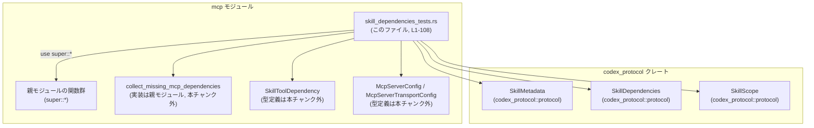
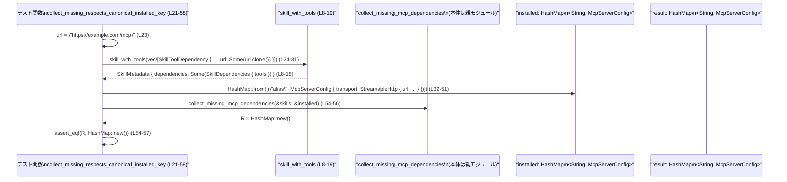

# codex-mcp/src/mcp/skill_dependencies_tests.rs コード解説

## 0. ざっくり一言

このファイルは、`collect_missing_mcp_dependencies` 関数の振る舞い（特に **MCP サーバの「正規化キー」ベースの判定と重複排除**）を検証するためのユニットテスト群と、そのためのヘルパー関数を定義しています。  
テストを通じて、「URL による正規化」と「重複 URL の統合時に元の名前を保存する」という契約が読み取れます。

---

## 1. このモジュールの役割

### 1.1 概要

- このモジュールは、スキルが宣言する MCP ツール依存関係から「未インストールの MCP サーバ設定を集める」関数 `collect_missing_mcp_dependencies` の挙動を検証します（関数本体は親モジュールにあります。`use super::*;` より、親モジュールのシンボルを利用していることが分かります。`codex-mcp/src/mcp/skill_dependencies_tests.rs:L1`）。
- 主に次の 2 点をテストしています。
  - インストール済みサーバのキー（エイリアス）とは別に、**正規化キー（少なくとも URL を使う）で突き合わせる**こと。
  - 同じ正規化キーを持つ依存関係が複数あっても、**1 つにまとめたうえで、元のツール名（`value`）を結果マップのキーとして保持する**こと。

### 1.2 アーキテクチャ内での位置づけ

このファイルは MCP 関連モジュールのテストであり、親モジュールに定義された関数・型を利用して動作確認を行います。



- `collect_missing_mcp_dependencies` は、テスト内からのみ参照されており、本体は親モジュール（`super`）側にあります（`codex-mcp/src/mcp/skill_dependencies_tests.rs:L1, L54-56, L104-106`）。
- テストは `SkillMetadata` と `SkillDependencies` を構成し、それを引数に `collect_missing_mcp_dependencies` を呼び出します（`L8-19, L24-31, L63-80`）。

### 1.3 設計上のポイント

- **ヘルパー関数による定型化**
  - `skill_with_tools` で、共通の `SkillMetadata` 初期化処理をまとめています（`L8-19`）。
- **正規化キー（canonical key）を前提としたテスト設計**
  - インストール済みサーバのキー `"alias"`（`L33`）と、依存関係側の `"github"`（`L26`）が一致しない状況で、URL 一致により「未欠如」とみなされることを前提にしています。
- **重複 URL の排除と命名の保持**
  - 同じ URL を持つ 2 つのツール `"alias-one"` と `"alias-two"`（`L66, L74`）から、結果として 1 つの `McpServerConfig` を生成し、そのマップのキーには `"alias-one"` が使われることを確認します（`L82-83, L104-106`）。
- **言語固有の観点**
  - すべて安全な Rust（`unsafe` ブロックなし）で記述されており、エラーは `Result` ではなくテスト失敗（`assert_eq!` のパニック）としてのみ扱われます（`L5, L54-57, L104-107`）。
  - 並行性（スレッド、`async`）は登場せず、テストは単一スレッド前提の単純な関数呼び出しのみです。

---

## 2. 主要な機能一覧（コンポーネントインベントリー）

このファイル内で登場する関数と、テスト対象の関数を一覧にします。

| 名前 | 種別 | 役割 / 概要 | 定義/利用位置 |
|------|------|-------------|----------------|
| `skill_with_tools` | ヘルパー関数 | 指定された MCP ツール依存リストを持つ `SkillMetadata` を生成する | 定義: `codex-mcp/src/mcp/skill_dependencies_tests.rs:L8-19` |
| `collect_missing_respects_canonical_installed_key` | テスト関数 | インストール済みサーバのキーと依存関係のツール名が異なっても、URL 一致により未欠如と判定されることを検証する | 定義: `L21-58` |
| `collect_missing_dedupes_by_canonical_key_but_preserves_original_name` | テスト関数 | 同一 URL の MCP ツール依存が複数ある場合に、1 つのエントリに統合しつつ最初のツール名を結果マップのキーとして保持することを検証する | 定義: `L60-107` |
| `collect_missing_mcp_dependencies` | 親モジュールの関数 | スキルの MCP ツール依存とインストール済み MCP サーバ設定から、「足りない」サーバ設定を `HashMap` で返す関数。ここではテスト対象としてのみ使用されます | 利用: `L54-56, L104-106`（本体は別ファイル） |

---

## 3. 公開 API と詳細解説

### 3.1 型一覧（構造体・列挙体など）

このチャンクに定義はありませんが、テスト内で利用されている主要な型を整理します。

| 名前 | 種別 | 役割 / 用途 | 定義/利用位置 |
|------|------|-------------|----------------|
| `SkillMetadata` | 構造体 | スキルのメタデータ（名前、説明、依存関係、パス、スコープなど）を保持します。ここでは `SkillDependencies` を含むテスト用のスキルインスタンスとして利用されています。 | 利用: `L8-18`（`skill_with_tools` の戻り値） |
| `SkillDependencies` | 構造体 | スキルが依存するリソース群を保持します。ここでは `tools: Vec<SkillToolDependency>` を持つ形で利用されています。 | 利用: `L14` |
| `SkillScope` | 列挙体 | スキルがどのスコープ（`User` など）で有効かを表します。ここでは常に `SkillScope::User` が設定されています。 | 利用: `L16` |
| `SkillToolDependency` | 構造体（推定） | スキルが依存する 1 つの「ツール」（ここでは MCP サーバ）の情報を表します。`r#type`, `value`, `description`, `transport`, `command`, `url` フィールドが使われています。型定義はこのチャンクにはありません。 | 利用: `L24-31, L64-71, L72-79` |
| `McpServerConfig` | 構造体（推定） | MCP サーバの設定（トランスポート方式、enabled フラグ、タイムアウト、ツール一覧など）を表します。ここでは期待値・インストール済み値として `HashMap` の値型に使われています。 | 利用: `L34-51, L84-101` |
| `McpServerTransportConfig::StreamableHttp` | 列挙体バリアント（推定） | MCP サーバのトランスポート方式の一つとして、`StreamableHttp` バリアントが使われています。URL と認証・ヘッダ情報を持ちます。 | 利用: `L35-40, L85-90` |
| `HashMap` | 構造体（連想配列） | キーと値のペアを保持するマップ。ここでは MCP サーバ設定のマップ（インストール済み・期待される欠如分）として利用されています。具体的な名前空間（`std::collections::HashMap` など）は本チャンクからは分かりません。 | 利用: `L32, L50, L56, L82, L100, L105` |

> 注: 上記のうち `SkillToolDependency`, `McpServerConfig`, `McpServerTransportConfig`, `HashMap` の定義場所は、このチャンクには現れません。そのため、役割の説明はメンバフィールドの使われ方と一般的な命名からの解釈に基づきます。

---

### 3.2 関数詳細

#### `collect_missing_mcp_dependencies(skills: &Vec<SkillMetadata>, installed: &HashMap<String, McpServerConfig>) -> HashMap<String, McpServerConfig>`

**概要**

- スキル群が宣言する MCP ツール依存関係と、既にインストール済みの MCP サーバ設定のマップを比較し、**「まだ存在しない（不足している）」 MCP サーバ設定**を新たに構築して返す関数です。
- 関数本体はこのファイルには含まれておらず、テストから契約のみが読み取れます（`L54-56, L104-106`）。

**引数（テストから分かる範囲）**

| 引数名 | 型 | 説明 |
|--------|----|------|
| `skills` | `&Vec<SkillMetadata>` もしくは `&[SkillMetadata]` に類する型（呼び出し側では `&skills`） | スキルのメタデータ一覧。各スキルの `dependencies.tools` から MCP ツール依存を取り出す前提です（`L23-31, L62-80`）。 |
| `installed` | `&HashMap<String, McpServerConfig>`（推定） | 既に設定済みの MCP サーバのマップ。キーはサーバの「名前」（エイリアス）です（`L32-33`）。 |

**戻り値**

- 型: `HashMap<String, McpServerConfig>`（テストで `HashMap::new()` および `HashMap::from([("alias-one".to_string(), McpServerConfig{...})])` と比較されているため）（`L54-57, L82-101, L104-106`）。
- 意味:
  - キー: 結果として新規に追加すべき MCP サーバの「名前」。テストから、**依存関係側の `SkillToolDependency.value` がそのまま使われる**ことが分かります（`L66, L82-83`）。
  - 値: 追加すべき `McpServerConfig`。`McpServerTransportConfig::StreamableHttp` など、依存関係情報から構築されています（`L84-101`）。

**内部処理の流れ（テストから推測できる契約）**

実装はこのチャンクにはありませんが、テストから次のような契約が読み取れます。

1. スキルごとに `dependencies.tools` を走査し、`SkillToolDependency` のうち `r#type == "mcp"` かつ `transport == Some("streamable_http")` のものを対象とする（`L24-31, L64-71, L72-79`）。
2. 各 MCP ツール依存から、**正規化キー**を算出する。
   - テストでは URL が同じであれば同じ正規化キーと扱われる前提になっています（`"https://example.com/mcp"` / `"https://example.com/one"` を共有する依存が同一とみなされている, `L23, L30, L36, L62-63, L70, L86`）。
3. `installed` に含まれる既存サーバ設定の中から、同じ正規化キーを持つものがあれば「すでにインストール済み」と見なし、欠如リストには含めない。
   - `"alias"` キーで登録されているサーバが、依存側 `"github"` と URL 一致により同一とみなされ、結果が空になることがテストで確認されています（`L23-37, L54-57`）。
4. インストール済みに該当しない MCP ツール依存については、新しい `McpServerConfig` を構成し、結果マップに追加する。
   - 複数の依存が同一正規化キーを持つ場合、**結果マップには 1 件のみ追加し、最初のツール依存の `value` をキーとして利用する**ことがテストから分かります（`"alias-one"` と `"alias-two"` で同じ URL を持ち、結果は `"alias-one"` のみ, `L62-80, L82-83, L104-106`）。

**Examples（使用例）**

テストコードそのものが使用例です。

- 既に相当する MCP サーバがインストールされているケース（結果は空）:

```rust
// スキルが依存する MCP ツールを 1 つ定義する（type=mcp, transport=streamable_http, url=...）
let url = "https://example.com/mcp".to_string();
let skills = vec![skill_with_tools(vec![SkillToolDependency {
    r#type: "mcp".to_string(),
    value: "github".to_string(),                    // ツール名
    description: None,
    transport: Some("streamable_http".to_string()),
    command: None,
    url: Some(url.clone()),
}])];                                                // L23-31

// すでに同じ URL の MCP サーバが "alias" というキーでインストールされている
let installed = HashMap::from([(
    "alias".to_string(),
    McpServerConfig {
        transport: McpServerTransportConfig::StreamableHttp { url, /* ... */ },
        enabled: true,
        required: false,
        /* ... */
        tools: HashMap::new(),
    },
)]);                                                // L32-51

// URL ベースの正規化により、既存サーバが見つかるため、結果は空のマップになる
let missing = collect_missing_mcp_dependencies(&skills, &installed); // L54-56
assert_eq!(missing, HashMap::new());
```

- インストール済みが無く、かつ同じ URL の依存が複数あるケース（重複排除される）:

```rust
let url = "https://example.com/one".to_string();    // L62
let skills = vec![skill_with_tools(vec![
    SkillToolDependency {
        r#type: "mcp".to_string(),
        value: "alias-one".to_string(),             // 最初のツール名
        transport: Some("streamable_http".to_string()),
        url: Some(url.clone()),
        /* ... */
    },
    SkillToolDependency {
        r#type: "mcp".to_string(),
        value: "alias-two".to_string(),             // 同じ URL だが別名
        transport: Some("streamable_http".to_string()),
        url: Some(url.clone()),
        /* ... */
    },
])];                                                // L63-80

// インストール済みは空
let installed = HashMap::new();

// 結果は 1 件のみで、キーには "alias-one" が使われる
let missing = collect_missing_mcp_dependencies(&skills, &installed); // L104-106
assert_eq!(missing.keys().collect::<Vec<_>>(), vec!["alias-one"]);
```

**Errors / Panics**

- テストからは、`collect_missing_mcp_dependencies` 自身がエラー型（`Result` など）を返す様子は見えません。戻り値は単純な `HashMap` として扱われています（`L54-56, L104-106`）。
- この関数呼び出しによるパニック条件は、このチャンクからは読み取れません。
- テストが失敗すると `assert_eq!` によりパニックが発生しますが、これはテストフレームワークの挙動です（`L54-57, L104-107`）。

**Edge cases（エッジケース）**

テストから読み取れる／読み取れない点を整理します。

- カバーされているケース
  - 既存サーバと依存側の**名前が異なる**が、URL が同じ場合 → 未欠如と扱われる（`L23-37, L54-57`）。
  - 同じ URL を持つ MCP ツール依存が複数存在する場合 → 1 件のみ結果に含める（`L62-80, L82-83, L104-106`）。
- このチャンクからは不明なケース
  - `url: None` の MCP ツール依存の扱い。
  - `r#type != "mcp"` や `transport != Some("streamable_http")` の依存。
  - URL の正規化（末尾のスラッシュ有無、大文字小文字、クエリパラメータなど）の扱い。

**使用上の注意点**

- このテストから読み取れる限り、**URL が正規化キーの中心**になっています。インストール済みサーバのキー（エイリアス）は、突き合わせに直接使われない前提です。
- 依存関係側のツール名（`SkillToolDependency.value`）は、**未インストールサーバの「提案される名前」**として結果マップのキーに使われる契約になっています。
- URL を使った正規化は、文字列一致かそれに準じる処理を前提としていると考えられますが、具体的なルールは本チャンクからは分かりません。そのため、URL の細かな差（末尾スラッシュなど）については実装コードを確認する必要があります。

---

#### `skill_with_tools(tools: Vec<SkillToolDependency>) -> SkillMetadata`

**概要**

- 引数で与えられた MCP ツール依存リストを `SkillDependencies` に格納し、それを `dependencies` フィールドに持つ `SkillMetadata` を生成するテスト用ヘルパー関数です（`L8-19`）。

**引数**

| 引数名 | 型 | 説明 |
|--------|----|------|
| `tools` | `Vec<SkillToolDependency>` | スキルが依存する MCP ツールのリスト。`SkillDependencies { tools }` としてそのまま埋め込まれます（`L14`）。 |

**戻り値**

- 型: `SkillMetadata`（`L8`）。
- 名前や説明、パス、スコープはテスト固定値になっており、`dependencies` のみ呼び出し側で変えられます（`L10-18`）。

**内部処理の流れ**

1. 新しい `SkillMetadata` 構造体をリテラルで生成します（`L9-18`）。
2. `name` と `description` は `"skill"` 固定の文字列です（`L10-11`）。
3. `short_description` と `interface` は `None` に設定されます（`L12-13`）。
4. `dependencies` には `Some(SkillDependencies { tools })` が設定され、引数で渡されたベクタがそのまま使われます（`L14`）。
5. `path` は `"skill"` というパス文字列から `PathBuf` を生成して設定します（`L15`）。
6. `scope` は `SkillScope::User`、`enabled` は `true` として固定されています（`L16-17`）。

**Examples（使用例）**

- 単一の MCP ツール依存を持つスキルの生成:

```rust
let tools = vec![SkillToolDependency {
    r#type: "mcp".to_string(),
    value: "github".to_string(),
    description: None,
    transport: Some("streamable_http".to_string()),
    command: None,
    url: Some("https://example.com/mcp".to_string()),
}];

let skill = skill_with_tools(tools);
// skill.dependencies は Some(SkillDependencies { tools: ... }) になる
```

**Errors / Panics**

- この関数は単純な構造体リテラルを返すだけであり、エラーやパニックを発生させる箇所はありません（`L8-19`）。

**Edge cases**

- `tools` が空のベクタであっても、そのまま `SkillDependencies { tools: vec![] }` として設定されると推測されます（このケースを扱うテストはこのチャンクにはありません）。

**使用上の注意点**

- テストヘルパーとして設計されているため、本番コードでの利用を想定しているかどうかはこのチャンクからは分かりません。
- `name`, `description`, `path`, `scope`, `enabled` が固定値であるため、これらが重要な意味を持つ実運用では適しません。

---

#### `collect_missing_respects_canonical_installed_key()`

**概要**

- インストール済み MCP サーバのキー（ここでは `"alias"`）と、依存関係のツール名（ここでは `"github"`）が異なっていても、**URL が一致していれば「欠如していない」と判定される**ことを検証するテストです（`L21-58`）。

**内部処理の流れ（テストシナリオ）**

1. `url = "https://example.com/mcp"` を作成する（`L23`）。
2. この URL を持つ MCP ツール依存 `"github"` を 1 つ含むスキルを作成する（`L24-31`）。
3. 同じ URL を持つ `McpServerConfig` を `"alias"` というキーで `installed` マップに登録する（`L32-51`）。
4. `collect_missing_mcp_dependencies(&skills, &installed)` を呼び出し、その結果が空の `HashMap` であることを `assert_eq!` で検証する（`L54-57`）。

**Edge cases / 契約上のポイント**

- 「名前が違っても URL が同じなら既存とみなす」という契約が、`collect_missing_mcp_dependencies` に課されていることを示します。

---

#### `collect_missing_dedupes_by_canonical_key_but_preserves_original_name()`

**概要**

- 同じ URL を持つ MCP ツール依存 `"alias-one"` と `"alias-two"` を 2 つ定義し、**結果のマップに 1 つだけ追加され、かつキーとして `"alias-one"`（最初の名前）が使われる**ことを検証するテストです（`L60-107`）。

**内部処理の流れ（テストシナリオ）**

1. `url = "https://example.com/one"` を作成する（`L62`）。
2. この URL を共有する 2 つの MCP ツール依存 `"alias-one"` と `"alias-two"` を定義したスキルを作成する（`L63-80`）。
3. 期待される結果として、キー `"alias-one"`、`McpServerTransportConfig::StreamableHttp { url, ... }` を持つ `McpServerConfig` 1 件だけを格納した `HashMap` を `expected` として構築する（`L82-101`）。
4. `collect_missing_mcp_dependencies(&skills, &HashMap::new())` を呼び出し、その結果が `expected` に一致することを `assert_eq!` で検証する（`L104-107`）。

**Edge cases / 契約上のポイント**

- 同一の正規化キー（ここでは URL）を持つ依存は、**1 つの `McpServerConfig` にまとめられる**。
- まとめる際のキーは、**最初に登場した依存の `value`** であることが要求されています。

---

### 3.3 その他の関数

このファイルには上記以外の関数定義はありません。

---

## 4. データフロー

### 4.1 代表的な処理シナリオ

ここでは、`collect_missing_respects_canonical_installed_key` テストにおけるデータフローを示します。

- スキル定義 (`SkillMetadata`) が作られ、
- インストール済み MCP サーバ設定 (`installed: HashMap`) が作られ、
- `collect_missing_mcp_dependencies` に渡されて結果が検証される、という流れです。



同様に、2 つ目のテストでは `installed` が空である点と、`SkillToolDependency` が 2 つに増え、戻り値 `R` が 1 エントリを含む `HashMap` になる点のみが異なります（`L60-80, L82-101, L104-107`）。

---

## 5. 使い方（How to Use）

### 5.1 基本的な使用方法

テストコードから抽出できる、`collect_missing_mcp_dependencies` の基本的な呼び出しパターンです。

```rust
// 1. スキルが依存する MCP ツールを定義する
let tools = vec![
    SkillToolDependency {
        r#type: "mcp".to_string(),                      // MCP ツール種別
        value: "my-mcp-server".to_string(),             // ツール名（結果マップのキー候補）
        description: None,
        transport: Some("streamable_http".to_string()), // トランスポート種別
        command: None,
        url: Some("https://example.com/mcp".to_string()), // サーバの URL
    },
];

// 2. SkillMetadata にラップする（ヘルパー利用）
let skills = vec![skill_with_tools(tools)];             // L8-19

// 3. 既存の MCP サーバ設定マップを用意する（ここでは空）
let installed = HashMap::new();

// 4. 不足している MCP サーバ設定を収集する
let missing = collect_missing_mcp_dependencies(&skills, &installed);

// 5. 得られた HashMap<String, McpServerConfig> を設定ファイル等に反映するなどして利用する
for (name, config) in &missing {
    println!("要追加 MCP サーバ: {name} -> {:?}", config);
}
```

### 5.2 よくある使用パターン

- **既存設定とスキル依存の差分を取りたい場合**
  - テストの 1 つ目のパターンのように、すでに設定ファイル等から読み込んだ `installed` を渡し、`missing` をユーザへの提案や自動設定のために利用する、という使い方が想定されます。
- **複数スキルの依存をまとめて解析する場合**
  - `skills` を複数の `SkillMetadata` からなるベクタにし、全スキルの MCP 依存を一括して処理できます（このチャンクのテストでは 1 つのスキルのみですが、`Vec` になっていることで複数スキルを許容していることが分かります, `L23, L63`）。

### 5.3 よくある間違い（推測される注意点）

このチャンクから実装詳細は分かりませんが、テストに基づいて想定される誤用例を挙げます。

```rust
// 誤りの可能性がある例: type="mcp" ではない
let tools = vec![SkillToolDependency {
    r#type: "other".to_string(),          // テストでは type="mcp" のみカバーされている
    value: "my-mcp".to_string(),
    transport: Some("streamable_http".to_string()),
    url: Some("https://example.com/mcp".to_string()),
}];
// この場合、実装によっては MCP 依存として扱われず、missing に反映されない可能性があります。
// （この挙動は本チャンクからは不明であり、実装コードの確認が必要です）
```

正しい例（テストと同様の前提）:

```rust
let tools = vec![SkillToolDependency {
    r#type: "mcp".to_string(),            // type は "mcp"
    value: "my-mcp".to_string(),
    transport: Some("streamable_http".to_string()),
    url: Some("https://example.com/mcp".to_string()),
}];
```

### 5.4 使用上の注意点（まとめ）

- **URL の設定は必須とみなすのが安全**  
  テストではいずれも `url: Some(...)` が設定された MCP 依存のみが扱われています（`L30, L70, L78`）。`url: None` の場合の扱いは不明であり、正しく検出できない可能性があります。
- **トランスポート種別の整合性**  
  `transport: Some("streamable_http")` 以外のケースはテストされていないため、別のトランスポート種別を使う場合は挙動を確認する必要があります（`L28-29, L68-69, L76-77`）。
- **並行性・スレッドセーフティ**  
  この関数は単純な `HashMap` と構造体を扱う同期関数としてテストされています。共有状態やマルチスレッドでの利用については、このチャンクからは判断できませんが、少なくともテストに `Sync`/`Send` などは登場しません。

---

## 6. 変更の仕方（How to Modify）

### 6.1 新しい機能を追加する場合（テスト観点）

このファイルを起点に、新しいシナリオをサポートしたい場合のテスト追加方針です。

1. **新しい依存パターンを扱う**  
   例: `url: None` の MCP 依存や、別トランスポート種別をサポートする場合、そのケースをカバーするテスト関数をこのファイルに追加します。
2. **正規化ロジックの変更**  
   例: URL 正規化（末尾スラッシュの無視など）を行うように実装を変更する場合、その仕様を表すテスト（`"https://example.com/mcp"` と `"https://example.com/mcp/"` を同一とみなす、など）を追加します。
3. **複数スキル間での統合**  
   複数の `SkillMetadata` に分かれている MCP 依存をまたいで統合する振る舞いを明示したい場合は、`skills` に複数要素を含めるテストを追加します。

### 6.2 既存の機能を変更する場合（契約の確認）

`collect_missing_mcp_dependencies` の実装を変更する際には、次の点に注意する必要があります。

- **正規化キーに関する契約**
  - 「既存サーバとの突き合わせは名前ではなく正規化キー（少なくとも URL）で行う」契約を満たす必要があります（`L23-37, L54-57`）。
- **重複排除と命名**
  - 「同一正規化キーを持つ依存は 1 件にまとめる」「その際のキーは最初に登場した `value`」という契約を維持するかどうかを明確にし、変える場合はテストを更新する必要があります（`L62-80, L82-83, L104-106`）。
- **影響範囲の確認**
  - この関数はテストから `HashMap<String, McpServerConfig>` を返す前提で使われています。戻り値の型やキーの意味を変える場合、呼び出し元とテストの両方の修正が必要になります。

---

## 7. 関連ファイル

このチャンクから直接参照されている、または論理的に関連すると分かるファイル／モジュールです（ファイルパスが明示されていないものはモジュールパスのみを記載します）。

| パス / モジュール | 役割 / 関係 |
|-------------------|------------|
| 親モジュール（`super`） | `collect_missing_mcp_dependencies`, `SkillToolDependency`, `McpServerConfig`, `McpServerTransportConfig`, `HashMap` などが定義されていると推測されます。ファイルの物理パスはこのチャンクからは分かりません（`L1, L24-31, L32-51, L54-56, L63-80, L82-101, L104-106`）。 |
| `codex_protocol::protocol::SkillMetadata` | スキルメタデータの定義。テストでは MCP 依存を埋め込むためのコンテナとして利用されています（`L3, L8-18`）。 |
| `codex_protocol::protocol::SkillDependencies` | スキル依存関係の定義。`SkillMetadata.dependencies` として利用されています（`L2, L14`）。 |
| `codex_protocol::protocol::SkillScope` | スキルのスコープ（`User` など）を表す列挙体。ここではテスト用に固定値として設定されています（`L4, L16`）。 |
| `pretty_assertions::assert_eq` | 通常の `assert_eq!` に対して、差分を見やすく表示するためのマクロ。テストの検証に使用されています（`L5, L54-57, L104-107`）。 |

このファイルはテスト専用であり、本体のロジックは親モジュール側に置かれています。利用者や実装者は、本体の `collect_missing_mcp_dependencies` とあわせてこのテストを読むことで、契約（正規化キー・重複排除・名前の扱い）を正しく理解できる構成になっています。
