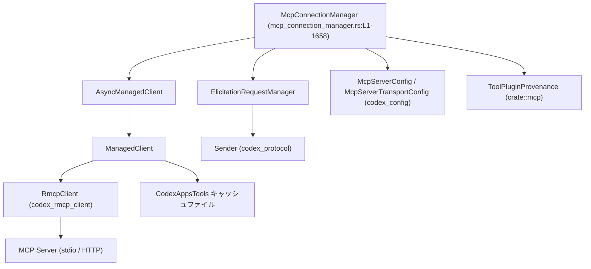
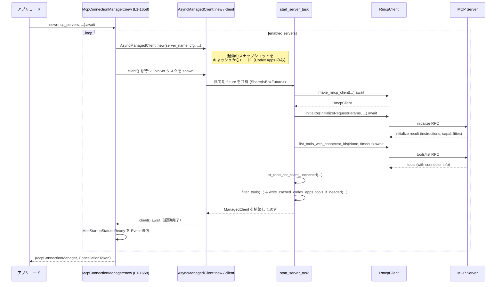

codex-mcp/src/mcp_connection_manager.rs

---

## 0. ざっくり一言

Model Context Protocol (MCP) サーバーごとに `RmcpClient` を管理し、  
ツール一覧・リソース一覧・ツール呼び出し・サンドボックス状態通知・承認フロー（elicitation）を束ねて扱う「接続マネージャ」です。  
定義はすべて `codex-mcp/src/mcp_connection_manager.rs:L1-1658` に含まれます（個別行番号はこのチャンクからは取得できません）。

---

## 1. このモジュールの役割

### 1.1 概要

- このモジュールは **複数の MCP サーバーとの接続と、その上でのツール・リソース利用** を抽象化するために存在します。
- 各 MCP サーバーに対して 1 つの `RmcpClient` を作成し、非同期に初期化・ツール取得・リソース取得・ツール呼び出しを行います。
- Codex Apps 用の MCP サーバーに対しては **ツール一覧のディスクキャッシュ** を行い、起動時のレスポンスを改善します。
- MCP の elicitation（ユーザー承認ダイアログ）を `Event` 経由で外部に通知し、`resolve_elicitation` 経由で応答を受け取る仕組みを提供します。

### 1.2 アーキテクチャ内での位置づけ

主要コンポーネントと外部依存の関係は次のようになっています。



- `McpConnectionManager` が公開 API であり、アプリケーションコードはここを入口として MCP サーバーを利用します。
- サーバーごとの接続状態とツールリストは `AsyncManagedClient` / `ManagedClient` が隠蔽します。
- `ElicitationRequestManager` が MCP クライアントの elicitation コールバックと、外部の `Event` バスを仲介します。
- Codex Apps 向けのツール一覧は、ユーザー固有キー (`CodexAppsToolsCacheKey`) に基づいてディスクキャッシュされます。

### 1.3 設計上のポイント

- **責務分割**
  - `McpConnectionManager`: 公開 API・全サーバーのオーケストレーション。
  - `AsyncManagedClient`: サーバーごとの非同期初期化・ツール取得（起動中スナップショットも含む）。
  - `ManagedClient`: 初期化完了後のクライアントとツールリストの保持。
  - `ElicitationRequestManager`: elicitation の送受信・ポリシー適用。
  - キャッシュ関連 (`CodexAppsToolsCacheContext` ほか): Codex Apps ツールのディスクキャッシュ処理。
- **状態管理**
  - サーバーごとに `AsyncManagedClient` を持つ `HashMap<String, AsyncManagedClient>`。
  - elicitation 応答待ちの oneshot チャネルを `ResponderMap`（`tokio::sync::Mutex` で保護）で管理。
  - 起動中かどうかを `AtomicBool` で判定し、起動中のみキャッシュのスナップショットを返す。
- **エラーハンドリング**
  - 外向きには基本的に `anyhow::Result<T>` を返し、メッセージ文字列にコンテキストを付加。
  - 起動処理専用にクローン可能な `StartupOutcomeError` を定義し、JoinSet で集約可能にしています。
  - 環境変数未設定や不正なサーバー名などの設定エラーは起動エラーとして扱い、`mcp_init_error_display` でユーザー向けメッセージを組み立てます。
- **並行性**
  - サーバーごとの起動・ツール取得・リソース取得は `tokio::task::JoinSet` で並列化。
  - ロックには、データの性質に応じて `tokio::sync::Mutex`（非同期コンテキスト用）と `std::sync::Mutex`（設定ポリシーなど短時間ロック）を使い分けています。
  - 起動キャンセルは `CancellationToken` とカスタムエラー `CancelErr` で表現。
- **安全性**
  - ロックは `.await` の前後で分割されており、ロック保持中に `.await` を行わないようになっています（デッドロック回避）。
  - キャッシュの読み書きエラーは壊れたキャッシュを無視する方針で、MCP ツール取得自体は継続します（フェイルセーフ）。

---

## 2. 主要な機能一覧（コンポーネントインベントリー）

このファイルで提供される主な機能・コンポーネントです。  
（定義位置はいずれも `codex-mcp/src/mcp_connection_manager.rs:L1-1658`）

- MCP サーバー接続管理:
  - `McpConnectionManager`: MCP サーバー起動・停止（キャンセル）・ツール/リソース一覧・ツール呼び出し。
- MCP ツール一覧とキャッシュ:
  - `ToolInfo`: 単一ツールの情報（サーバー名・表示名・メタ情報）。
  - `CodexAppsToolsCacheKey` / `CodexAppsToolsCacheContext`: ユーザーごとの Codex Apps ツールキャッシュキーとキャッシュパス。
  - `codex_apps_tools_cache_key`: 認証情報からキャッシュキーを生成。
  - `list_tools_for_client_uncached`: MCP サーバーから生のツール一覧を取得。
  - `ManagedClient::listed_tools` / `AsyncManagedClient::listed_tools`: フィルタとキャッシュを考慮したツール一覧。
- ツール名・入力スキーマ処理:
  - `declare_openai_file_input_param_names`: MCP ツール meta から OpenAI ファイル入力パラメータ名を抽出。
  - `tool_with_model_visible_input_schema`: ファイルパラメータ用の input_schema をマスキング。
  - Codex Apps 用名寄せ:
    - `normalize_codex_apps_tool_title`
    - `normalize_codex_apps_callable_name`
    - `normalize_codex_apps_callable_namespace`
- ツールフィルタ:
  - `ToolFilter`: 有効/無効ツールリストに基づくフィルタ。
  - `filter_tools` / `filter_non_codex_apps_mcp_tools_only`
- Elicitation（承認フロー）:
  - `ElicitationRequestManager`: elicitation リクエストとレスポンスの管理。
  - `McpConnectionManager::resolve_elicitation`: 外部から elicitation への回答を受け付ける。
  - `elicitation_is_rejected_by_policy`, `can_auto_accept_elicitation`
- MCP サーバー起動:
  - `AsyncManagedClient::new` / `start_server_task` / `make_rmcp_client`
  - `StartupOutcomeError` とその関連関数。
- サンドボックス状態通知:
  - `SandboxState`, `MCP_SANDBOX_STATE_CAPABILITY`, `MCP_SANDBOX_STATE_METHOD`
  - `ManagedClient::notify_sandbox_state_change`
  - `McpConnectionManager::notify_sandbox_state_change`
- リソース API ラッパー:
  - `McpConnectionManager::{list_all_resources, list_all_resource_templates}`
  - `McpConnectionManager::{list_resources, list_resource_templates, read_resource}`
- メトリクス・ユーティリティ:
  - `emit_duration`: OpenTelemetry メトリクス記録。
  - ツール一覧・キャッシュに関連するメトリクス用定数。

---

## 3. 公開 API と詳細解説

### 3.1 型一覧（構造体・列挙体など）

| 名前 | 種別 | 公開範囲 | 役割 / 用途 | 定義位置 |
|------|------|----------|-------------|----------|
| `ToolInfo` | 構造体 | `pub` | MCP サーバー上の単一ツールのメタデータ（サーバー名、モデル向け名、元ツール定義など）を保持します。 | `mcp_connection_manager.rs:L1-1658` |
| `CodexAppsToolsCacheKey` | 構造体 | `pub` | Codex Apps ツールキャッシュをユーザーごとに分離するためのキー（アカウント ID 等）を保持します。 | 同上 |
| `CodexAppsToolsCacheContext` | 構造体 | crate 内 | キャッシュディレクトリとユーザーキーを組にしたコンテキスト。`cache_path` を計算します。 | 同上 |
| `CodexAppsToolsDiskCache` | 構造体 | crate 内 | キャッシュファイルに保存されるスキーマバージョンとツール一覧のコンテナです。 | 同上 |
| `CachedCodexAppsToolsLoad` | enum | crate 内 | キャッシュ読込結果（ヒット / 不存在 / 不正）を表現します。 | 同上 |
| `ElicitationRequestManager` | 構造体 | crate 内 | elicitation リクエストの登録・解決とポリシーの保持を行います。 | 同上 |
| `ManagedClient` | 構造体 | crate 内 | 初期化済み `RmcpClient` と、そのサーバーのツール一覧などの状態を保持します。 | 同上 |
| `AsyncManagedClient` | 構造体 | crate 内 | `ManagedClient` の生成を非同期に行うラッパー（`Shared<BoxFuture>`）です。 | 同上 |
| `SandboxState` | 構造体 | `pub` | MCP サーバーへ通知するサンドボックス状態（ポリシー・作業ディレクトリ等）を表します。 | 同上 |
| `McpConnectionManager` | 構造体 | `pub` | 複数 MCP サーバーの接続を管理し、ツール・リソース・elicitation・サンドボックスなどの API を束ねます。 | 同上 |
| `ToolFilter` | 構造体 | `pub(crate)` | MCP サーバーの設定に基づいてツールの有効・無効を判定します。 | 同上 |
| `ResponderMap` | 型エイリアス | crate 内 | `(server_name, RequestId)` から elicitation レスポンス用 `oneshot::Sender` へのマップです。 | 同上 |
| `StartupOutcomeError` | enum | crate 内 | MCP サーバー起動処理専用のエラー型（キャンセル / 失敗）です。 | 同上 |
| `StartServerTaskParams` | 構造体 | crate 内 | `start_server_task` へのパラメータの束ね役です。 | 同上 |

※ すべて同一ファイル内に定義されており、正確な行番号はこのチャンクには含まれません。

---

### 3.2 重要な関数・メソッドの詳細

ここでは公開 API とコアロジックから代表的な 7 つを取り上げます。  
（定義はすべて `mcp_connection_manager.rs:L1-1658` 内）

---

#### `McpConnectionManager::new(...) -> (Self, CancellationToken)`

**概要**

- 有効化された MCP サーバー群の設定から、非同期に各 MCP サーバーを起動し、`McpConnectionManager` とキャンセル用 `CancellationToken` を返します。
- 各サーバーの起動結果を `McpStartupUpdateEvent` / `McpStartupCompleteEvent` として `tx_event` に送信します。

**シグネチャ（簡略化）**

```rust
pub async fn new(
    mcp_servers: &HashMap<String, McpServerConfig>,
    store_mode: OAuthCredentialsStoreMode,
    auth_entries: HashMap<String, McpAuthStatusEntry>,
    approval_policy: &Constrained<AskForApproval>,
    submit_id: String,
    tx_event: Sender<Event>,
    initial_sandbox_state: SandboxState,
    codex_home: PathBuf,
    codex_apps_tools_cache_key: CodexAppsToolsCacheKey,
    tool_plugin_provenance: ToolPluginProvenance,
) -> (Self, CancellationToken)
```

**引数**

| 引数名 | 型 | 説明 |
|--------|----|------|
| `mcp_servers` | `&HashMap<String, McpServerConfig>` | 設定で有効化された MCP サーバー群。`enabled == true` のものだけが起動対象。 |
| `store_mode` | `OAuthCredentialsStoreMode` | HTTP MCP クライアントの資格情報保存モード。 |
| `auth_entries` | `HashMap<String, McpAuthStatusEntry>` | サーバーごとの認証状態と設定。起動エラー文言に利用。 |
| `approval_policy` | `&Constrained<AskForApproval>` | elicitation の承認ポリシー。 |
| `submit_id` | `String` | 起動プロセスを識別するイベント ID。 |
| `tx_event` | `Sender<Event>` | 起動状況および elicitation を通知するイベントチャネル。 |
| `initial_sandbox_state` | `SandboxState` | 起動後に各 MCP サーバーへ通知する初期サンドボックス状態。 |
| `codex_home` | `PathBuf` | Codex のホームディレクトリ。Codex Apps ツールキャッシュディレクトリのベースパス。 |
| `codex_apps_tools_cache_key` | `CodexAppsToolsCacheKey` | Codex Apps ツールキャッシュ用のユーザーキー。 |
| `tool_plugin_provenance` | `ToolPluginProvenance` | ツールがどのプラグイン由来かを後から注釈するための情報。 |

**戻り値**

- `McpConnectionManager`: 初期化された接続マネージャ。
- `CancellationToken`: すべての MCP 起動タスクに共有されるキャンセルトークン。

**内部処理の流れ**

1. 新しい `CancellationToken` と空の `clients`, `server_origins` マップを作成。
2. `ElicitationRequestManager` を初期サンドボックスポリシー・承認ポリシーで構築。
3. `mcp_servers` から `enabled == true` のものだけをフィルタリングし、それぞれについて:
   - HTTP の場合は `transport_origin` でオリジン文字列を取得し `server_origins` に登録。
   - `McpStartupStatus::Starting` を `tx_event` に送信（`emit_update`）。
   - Codex Apps サーバーの場合は `CodexAppsToolsCacheContext` を構築。
   - `AsyncManagedClient::new` を呼び出し、サーバーごとの非同期クライアント構築 future を開始。
   - 同時に `JoinSet` に起動監視タスクを spawn（起動完了後に Ready / Failed をイベント送信）。
4. `JoinSet::join_all` を別タスクで待ち合わせ、全サーバーの起動結果を `McpStartupCompleteEvent` にまとめて送信。
5. 完成した `McpConnectionManager` と `CancellationToken` を返す。

**Examples（使用例）**

```rust
// MCP サーバー設定とその他依存値がある前提
let (manager, cancel_token) = McpConnectionManager::new(
    &mcp_servers,                  // サーバー設定
    OAuthCredentialsStoreMode::Disk,
    auth_entries,                  // 認証状態
    &approval_policy,              // elicitation ポリシー
    "startup-123".to_string(),     // submit_id
    tx_event.clone(),              // イベント送信用チャネル
    initial_sandbox_state.clone(), // 初期サンドボックス状態
    codex_home.clone(),            // キャッシュベースパス
    codex_apps_tools_cache_key(&auth),
    tool_plugin_provenance,        // プラグイン由来情報
).await;

// 例えば必須サーバー群の起動失敗を確認
let failures = manager
    .required_startup_failures(&required_servers)
    .await;
```

**Errors / Panics**

- 本メソッド自体は `Result` ではなく、内部でのエラーは各サーバーごとの `StartupOutcomeError` として扱われます。
- 起動中の `make_rmcp_client` / `start_server_task` 内でのエラーは、`StartupOutcomeError::Failed` として集計され、`McpStartupUpdateEvent` と `McpStartupCompleteEvent` に反映されます。
- `tokio::spawn` したタスクのパニックは `join_all` 内で `Err` として扱われ、`McpStartupCompleteEvent` の `failed` に反映されます。

**Edge cases（エッジケース）**

- `mcp_servers` が空の場合:
  - `clients` が空の `McpConnectionManager` が返ります。`has_servers()` は `false` を返します。
- 一部サーバーのみ設定エラー（例: 不正な `bearer_token_env_var`）の場合:
  - 当該サーバーだけが `StartupOutcomeError::Failed` となり、他のサーバーは通常通り起動します。
- `CancellationToken` が起動中にキャンセルされた場合:
  - 起動タスクは `StartupOutcomeError::Cancelled` になり、`McpStartupCompleteEvent::cancelled` に名前が集計されます。

**使用上の注意点**

- 起動直後には、すべてのサーバーが Ready になっているとは限らないため、特定サーバーの利用前には `wait_for_server_ready` で待機するのが安全です。
- `cancel_token` をキャンセルすると、以後 `AsyncManagedClient::client().await` の呼び出しは `StartupOutcomeError::Cancelled` で失敗する可能性があります。

---

#### `McpConnectionManager::list_all_tools(&self) -> HashMap<String, ToolInfo>`

**概要**

- すべての MCP サーバーからツール一覧を集約し、モデルに見せるための **完全修飾ツール名** をキーとした `HashMap` を返します。
- Codex Apps のツールでは、ファイル入力スキーマのマスキングやプラグイン名の注釈が行われます。

**引数**

- なし（`&self` のみ）。

**戻り値**

- `HashMap<String, ToolInfo>`:  
  - キー: `qualify_tools` により付与された完全修飾ツール名（例: `mcp__server__tool` 形式）。
  - 値: `ToolInfo`。`tool.tool.description` にプラグイン由来の注釈が追加されている場合があります。

**内部処理の流れ**

1. `self.clients.values()` で全 `AsyncManagedClient` を列挙。
2. 各 `AsyncManagedClient` に対して `listed_tools().await` を呼び、`Option<Vec<ToolInfo>>` を取得。
   - 起動中のサーバーではキャッシュからのスナップショットが返る場合があります。
   - 初期化失敗時は `None` となり、そのサーバーはスキップされます。
3. 取得した全ツールを `Vec<ToolInfo>` に集約。
4. `qualify_tools`（別モジュール・再エクスポート）で完全修飾名を付与した `HashMap<String, ToolInfo>` に変換して返却。

**Examples（使用例）**

```rust
// すべての MCP ツールを一覧取得し、名前を列挙
let tools = manager.list_all_tools().await;
for (name, info) in &tools {
    println!("tool: {name} (server: {})", info.server_name);
}
```

**Errors / Panics**

- `list_all_tools` 自体は `Result` を返さず、内部でのサーバーごとのエラーは無視（そのサーバーのツールは含めない）されます。
- そのため、戻り値に特定サーバーのツールが含まれていない可能性があります（起動失敗・ツール取得失敗時）。

**Edge cases**

- いずれのサーバーからもツールが取得できなかった場合、空の `HashMap` が返ります。
- Codex Apps サーバーでは、起動中にキャッシュスナップショットがあればそれが使用されるため、最新状態と一時的に乖離する可能性があります（後に更新される）。

**使用上の注意点**

- 「指定のツールが必ず存在する」ことを前提にせず、`HashMap::get` の結果を `Option` として扱う必要があります。
- Codex Apps 用の最新ツール一覧が必須なケースでは、事前に `hard_refresh_codex_apps_tools_cache` を呼び出すと確実です。

---

#### `McpConnectionManager::call_tool(&self, server: &str, tool: &str, arguments: Option<Value>, meta: Option<Value>) -> Result<CallToolResult>`

**概要**

- 指定された MCP サーバー上のツールを呼び出し、結果を `codex_protocol::mcp::CallToolResult` 形式に変換して返します。
- MCP クライアントから返る `rmcp::model::CallToolResult` を JSON にシリアライズし直しています。

**引数**

| 引数名 | 型 | 説明 |
|--------|----|------|
| `server` | `&str` | MCP サーバー名。`McpServerConfig` のキーに対応します。 |
| `tool` | `&str` | MCP ツール名（サーバー内部名）。 |
| `arguments` | `Option<serde_json::Value>` | ツール引数を表す任意の JSON 値。 |
| `meta` | `Option<serde_json::Value>` | メタデータ（MCP 側にそのまま渡されます）。 |

**戻り値**

- `Result<codex_protocol::mcp::CallToolResult>`:
  - `content`: MCP の `content` を JSON 配列としてシリアル化したもの。
  - `structured_content`: MCP 側の `structured_content` をそのまま転送。
  - `is_error`: MCP がエラーを示したかどうか。
  - `meta`: MCP 側の `meta` を JSON にシリアライズしたもの。

**内部処理の流れ**

1. `client_by_name(server).await` で `ManagedClient` を取得（`StartupOutcomeError` を `anyhow::Error` に変換）。
2. `ToolFilter::allows(tool)` でツールが有効かチェック。無効ならエラーを返す。
3. `client.client.call_tool(...)` を await し、MCP ツールを実際に呼び出す。
4. `rmcp::model::CallToolResult` から `content` を JSON 化（`serde_json::to_value`）。シリアライズ失敗時はプレースホルダ文字列 `"<content>"` にフォールバック。
5. `CallToolResult` 構造体に詰め直して `Ok(...)` を返す。

**Examples（使用例）**

```rust
use serde_json::json;

let args = json!({ "query": "SELECT 1" });

// "sql" サーバー上の "execute" ツールを呼び出す例
let result = manager
    .call_tool("sql", "execute", Some(args), None)
    .await?;

if result.is_error {
    eprintln!("tool error: {:?}", result.content);
} else {
    println!("tool result: {:?}", result.content);
}
```

**Errors / Panics**

- `unknown MCP server '{name}'`:
  - `server` 名に対応するクライアントが存在しない場合。
- `tool '{tool}' is disabled for MCP server '{server}'`:
  - MCP サーバー設定の `enabled_tools` / `disabled_tools` によって拒否された場合。
- `tool call failed for '{server}/{tool}'`:
  - 内部の `call_tool` が失敗した場合（通信エラー、タイムアウトなど）。元エラーは `anyhow::Context` によりラップされます。

**Edge cases**

- `arguments` / `meta` に `None` を渡すと、MCP 側には `null` ではなく「フィールドなし」として扱われます（MCP クライアントの実装依存）。
- MCP 側が返す `content` のシリアライズに失敗した場合、その要素は `"<content>"` という文字列 JSON で代用されます。

**使用上の注意点**

- ツール名は **サーバー内部名** であり、`list_all_tools` のキー（完全修飾名）とは異なる点に注意が必要です。
- モデルから渡される名前空間付きツール名しか持っていない場合は、`resolve_tool_info` を使って `server_name` + 生の `tool.name` を逆引きする必要があります。

---

#### `McpConnectionManager::list_all_resources(&self) -> HashMap<String, Vec<Resource>>`

**概要**

- すべての MCP サーバーに対して `resources/list` を並列に呼び出し、サーバー名をキーとした `Vec<Resource>` のマップを返します。
- ページング付き API (`PaginatedRequestParams`) を内部でループして完全な一覧を構築します。

**引数**

- なし（`&self`）。

**戻り値**

- `HashMap<String, Vec<Resource>>`:
  - キー: サーバー名。
  - 値: そのサーバーに属する MCP `Resource` の一覧。

**内部処理の流れ**

1. `clients_snapshot = &self.clients` を取得。
2. 各 `(server_name, async_managed_client)` について:
   - `async_managed_client.client().await` で `ManagedClient` を取得。失敗した場合はそのサーバーをスキップ。
   - `JoinSet` にタスクを spawn:
     - `cursor: Option<String>` を使ってページングを管理。
     - `client.list_resources(params, timeout).await` を繰り返し呼び出し、`resources` を `collected` に蓄積。
     - `next_cursor` が `None` になるまで続ける。カーソルが前回と同じ値を返した場合はエラーとする（無限ループ防止）。
3. `join_set.join_next()` で全タスクの完了を待ち、成功したものだけ `aggregated` マップに格納。
4. エラーになったサーバーについては `warn!` ログを出力し、マップには含めません。
5. `aggregated` を返す。

**Examples（使用例）**

```rust
let resources_by_server = manager.list_all_resources().await;

for (server, resources) in &resources_by_server {
    println!("server: {server}, resources: {}", resources.len());
}
```

**Errors / Panics**

- メソッド自体は `Result` を返さず、サーバーごとのエラーは内部で `warn!` ログとして記録され、マップから除外されます。
- `resources/list returned duplicate cursor`:
  - 同じ `cursor` を繰り返し返して無限ループになりうる MCP サーバーに対する防御。該当サーバーはエラー扱いとなります。

**Edge cases**

- すべてのサーバーでエラーが発生した場合、空のマップが返ります。
- 一部サーバーがエラーの場合、そのサーバーのエントリのみ欠落します。

**使用上の注意点**

- 「特定サーバーのリソース一覧」を必要とする場合は、このメソッドではなく `list_resources(server, params)` を使用するとエラー内容が `Result` 経由で取得できます。
- ページ数が多いサーバーに対しても内部でループ処理を行うため、1 サーバーあたりのコストは高くなり得ますが、サーバー間は並列化されています。

---

#### `AsyncManagedClient::listed_tools(&self) -> Option<Vec<ToolInfo>>`

**概要**

- サーバーごとのツールリストを取得し、Codex Apps サーバーについては **入力スキーマのマスキングとプラグイン名による説明文注釈** を行う中核メソッドです。
- 起動中はキャッシュスナップショットを返し、起動完了後は実際の `ManagedClient` による最新一覧を返します。

**引数**

- なし（`&self`）。

**戻り値**

- `Option<Vec<ToolInfo>>`:
  - `Some(Vec<...>)`: ツール一覧取得に成功。
  - `None`: 起動失敗などでツールを取得できない場合。

**内部処理の流れ**

1. `startup_snapshot_while_initializing()` を呼び、起動完了前かつキャッシュスナップショットがある場合はそれを `Some` として使う。
2. そうでなければ `self.client().await` で `ManagedClient` を取得。
   - 成功時は `ManagedClient::listed_tools()` を呼ぶ。
   - 失敗時は `self.startup_snapshot.clone()` を使用（あれば）し、なければ `None`。
3. 得られた `Vec<ToolInfo>` に対して `annotate_tools` クロージャを適用:
   - Codex Apps サーバー (`CODEX_APPS_MCP_SERVER_NAME`) のツールについては `tool_with_model_visible_input_schema` でファイルパラメータの input_schema をマスキング。
   - `tool_plugin_provenance` からプラグイン名一覧を取得し、`plugin_display_names` に格納。
   - 説明文 (`tool.tool.description`) に「どのプラグイン由来か」の注釈文（1 個なら単数、複数なら列挙）を付加。

**Examples（使用例）**

通常は直接呼ばず、`McpConnectionManager::list_all_tools` 経由で利用されます。

**Errors / Panics**

- `self.client().await` が `StartupOutcomeError::Cancelled` や `Failed` を返した場合、そのサーバーは最終的に `None` になる可能性があります。
- プラグイン名の取得や説明文の編集でパニックするようなコードは含まれていません（`String` 操作のみ）。

**Edge cases**

- 起動中にキャッシュスナップショットが利用されるため、**プラグイン名注釈がまだ付与されていない** 状態のツールが返ることはありません（注釈は `annotate_tools` で毎回行われます）。
- `connector_id` も `connector_name` もないツールは、プラグイン名の注釈が付かず、`plugin_display_names` は空ベクタのままです。

**使用上の注意点**

- 起動状態やキャッシュの存在により返る内容が変わるため、「ツール一覧が変わらない」ことを前提にキャッシュしておくのは避けるほうが安全です。

---

#### `list_tools_for_client_uncached(server_name, client, timeout, server_instructions) -> Result<Vec<ToolInfo>>`

**概要**

- MCP クライアントに対して `list_tools_with_connector_ids` を 1 回呼び出し、その結果を `ToolInfo` ベクタに変換するコアロジックです。
- Codex Apps サーバーの場合は、許可されていない connector をフィルタリングします。

**引数**

| 引数名 | 型 | 説明 |
|--------|----|------|
| `server_name` | `&str` | MCP サーバー名。 |
| `client` | `&Arc<RmcpClient>` | 初期化済み MCP クライアント。 |
| `timeout` | `Option<Duration>` | ツール一覧取得のタイムアウト。 |
| `server_instructions` | `Option<&str>` | サーバーの initialize で返ってきた instructions（ツールにも添付される）。 |

**戻り値**

- `Result<Vec<ToolInfo>>`:
  - MCP クライアントが返す `tools` を変換したもの。

**内部処理の流れ**

1. `client.list_tools_with_connector_ids(None, timeout).await` を呼び出して MCP ツール一覧を取得。
2. 各 MCP ツール（connector 情報付き）に対して:
   - `normalize_codex_apps_callable_name` でモデルから見える `callable_name` を決定。
   - `normalize_codex_apps_callable_namespace` で名前空間を決定。
   - `normalize_codex_apps_tool_title` でタイトルからコネクタ名のプレフィックスを除去。
   - `ToolInfo` を構築（`server_instructions` はそのままコピー）。
3. `server_name == CODEX_APPS_MCP_SERVER_NAME` の場合:
   - `filter_disallowed_codex_apps_tools` により、`connector_id` が `is_connector_id_allowed` で拒否されたツールは除外。
4. それ以外の場合はそのまま返却。

**Examples（使用例）**

通常は `start_server_task` や `hard_refresh_codex_apps_tools_cache` 内部からのみ呼ばれます。

**Errors / Panics**

- MCP クライアントの `list_tools_with_connector_ids` が失敗した場合、そのエラーが `anyhow::Error` としてそのまま返されます。
- 正規化処理はすべて `String` 操作のみで、パニックを引き起こすようなものは含まれていません。

**Edge cases**

- MCP サーバーが空のツールリストを返した場合でも、空の `Vec` を返すだけです。
- Codex Apps 以外のサーバーで `connector_id` が存在しても、ここではフィルタリングされません（Codex Apps 専用ロジック）。

**使用上の注意点**

- キャッシュ利用やツールフィルタはここでは行わず、「生のツール一覧取得」に専念しています。呼び出し側で `filter_tools` および `write_cached_codex_apps_tools_if_needed` を組み合わせる前提です。

---

#### `declared_openai_file_input_param_names(meta: Option<&Map<String, JsonValue>>) -> Vec<String>`

**概要**

- MCP ツールの `meta` 情報から、OpenAI のファイル入力パラメータを示す `"openai/fileParams"` 配列を読み取り、その要素名を取得します。
- `tool_with_model_visible_input_schema` によるファイルパス用スキーママスキングの対象を決定するために使われます。

**引数**

| 引数名 | 型 | 説明 |
|--------|----|------|
| `meta` | `Option<&Map<String, JsonValue>>` | MCP ツールの `meta` オブジェクト。 |

**戻り値**

- `Vec<String>`: `"openai/fileParams"` 配列中の非空文字列要素（パラメータ名）一覧。

**内部処理の流れ**

1. `meta` が `None` の場合は空ベクタを返す。
2. `meta.get("openai/fileParams")` で配列を取得。
3. `JsonValue::as_array` で配列として解釈できない場合は空ベクタ。
4. 各要素について `as_str()` に成功し、かつ非空文字列であるものだけを `String` 化して `collect`。

**Examples（使用例）**

通常は直接呼ばず、`tool_with_model_visible_input_schema` 内から利用されます。

```rust
let file_param_names = declared_openai_file_input_param_names(tool.meta.as_deref());
```

**Errors / Panics**

- 不正な JSON 形式であっても `Option` / `Result` を通じて無視されるため、パニックは発生しません。

**Edge cases**

- `"openai/fileParams"` が存在しない、または配列でない場合は空ベクタ。
- 配列の中に `null` や数値など非文字列要素があっても無視されます。

**使用上の注意点**

- 「パラメータ名が宣言されていない」＝「ファイルパス引数ではない」とみなされます。MCP サーバー側の meta 設計が重要になります。

---

#### `McpConnectionManager::notify_sandbox_state_change(&self, sandbox_state: &SandboxState) -> Result<()>`

**概要**

- すべての MCP サーバーに対して、サンドボックス状態（ポリシーや作業ディレクトリなど）の変更を通知します。
- 各サーバーごとに非同期タスクを spawn し、`ManagedClient::notify_sandbox_state_change` を呼び出します。

**引数**

| 引数名 | 型 | 説明 |
|--------|----|------|
| `sandbox_state` | `&SandboxState` | 通知すべきサンドボックス状態。 |

**戻り値**

- `Result<()>`: すべての通知タスクを待ち終わったかどうか。
  - 個々のサーバーでのエラーは `warn!` ログに出力されるだけで、呼び出し元にはエラーとして伝播しません。

**内部処理の流れ**

1. `JoinSet` を作成。
2. `self.clients.values()` をループし、各 `AsyncManagedClient` について:
   - クローンした `sandbox_state` と `AsyncManagedClient` を持つタスクを spawn。
   - タスク内で `async_managed_client.notify_sandbox_state_change(&sandbox_state).await` を実行。
3. すべてのタスクが `join_set.join_next()` で完了するまで待つ。
4. 各タスクの結果に応じて:
   - `Ok(Ok(()))`: 何もしない。
   - `Ok(Err(err))`: ログ `warn!("Failed to notify sandbox state change ...")` を出力。
   - `Err(err)`: タスクパニックを `warn!` ログとして出力。
5. 最終的に `Ok(())` を返す。

**Examples（使用例）**

```rust
let new_state = SandboxState {
    sandbox_policy: updated_policy,
    codex_linux_sandbox_exe: None,
    sandbox_cwd: new_cwd,
    use_legacy_landlock: false,
};

manager.notify_sandbox_state_change(&new_state).await?;
```

**Errors / Panics**

- メソッド自体の戻り値は常に `Ok(())` になります（内部エラーはログにのみ記録）。
- パニックは `JoinSet` の `Err` として捕捉され、ログ出力のみにとどまります。

**Edge cases**

- まだ起動中の MCP サーバーに対しては、`AsyncManagedClient::notify_sandbox_state_change` 内部で `client().await` が `StartupOutcomeError` を返す可能性があり、その場合もログにのみ出力されます。

**使用上の注意点**

- 呼び出し元でサーバーごとの通知成功/失敗を評価したい場合は、現状の API では個別結果を取得できないため、ログ収集やメトリクスを利用する必要があります。

---

### 3.3 その他の関数（概要）

代表的なヘルパー関数・内部関数を用途別にまとめます（すべて `mcp_connection_manager.rs:L1-1658` に定義）。

#### キャッシュ関連

| 関数名 | 役割（1 行） |
|--------|--------------|
| `sha1_hex` | 文字列の SHA1 ハッシュを 16 進文字列に変換し、キャッシュファイル名に使用します。 |
| `codex_apps_tools_cache_key` | `CodexAuth` から `CodexAppsToolsCacheKey` を組み立てます。 |
| `CodexAppsToolsCacheContext::cache_path` | ユーザーキーからツールキャッシュのファイルパスを構築します。 |
| `load_cached_codex_apps_tools` | キャッシュファイルの読み込みとバージョンチェックを行い、`CachedCodexAppsToolsLoad` を返します。 |
| `write_cached_codex_apps_tools_if_needed` | Codex Apps サーバーに対してのみキャッシュ書き込みを行います。 |
| `write_cached_codex_apps_tools` | ディスクにキャッシュを書き込みます（エラーは無視）。 |
| `load_startup_cached_codex_apps_tools_snapshot` | Codex Apps サーバーの起動時スナップショットをロードします。 |
| `filter_disallowed_codex_apps_tools` | connector が許可されていないツールをフィルタリングします。 |

#### ツール名・フィルタ関連

| 関数名 | 役割 |
|--------|------|
| `filter_tools` | `ToolFilter` に基づいて `Vec<ToolInfo>` から無効なツールを除外します。 |
| `filter_non_codex_apps_mcp_tools_only` | Codex Apps 以外のサーバーのツールだけを残します。 |
| `normalize_codex_apps_tool_title` | Codex Apps ツールのタイトルから connector 名プレフィックスを除去します。 |
| `normalize_codex_apps_callable_name` | Codex Apps ツールのモデル向け呼び出し名を決定します。 |
| `normalize_codex_apps_callable_namespace` | モデル向け名前空間（`mcp__server__connector` 形式）を決定します。 |
| `ToolFilter::from_config` | `McpServerConfig` の enabled/disabled 設定からフィルタを構築します。 |
| `ToolFilter::allows` | ツール名が許可されているか判定します。 |

#### Elicitation / 起動関連

| 関数名 | 役割 |
|--------|------|
| `elicitation_is_rejected_by_policy` | `AskForApproval` ポリシーに基づいて elicitation を拒否すべきか判定します。 |
| `can_auto_accept_elicitation` | スキーマが空の confirm/approval elicitation かどうか判定し、自動承認可否を決めます。 |
| `ElicitationRequestManager::new` | 承認・サンドボックスポリシー付きマネージャを作成します。 |
| `ElicitationRequestManager::resolve` | `(server_name, id)` に対応する oneshot チャネルに応答を送信します。 |
| `ElicitationRequestManager::make_sender` | MCP クライアントに渡す `SendElicitation` クロージャを構築します。 |
| `elicitation_capability_for_server` | MCP クライアント側の elicitation capability 設定を構築します。 |
| `start_server_task` | 指定サーバーの initialize とツール一覧取得、キャッシュ書き込みを行います。 |
| `make_rmcp_client` | stdio / HTTP 設定から `RmcpClient` を構築します。 |
| `resolve_bearer_token` | HTTP MCP の bearer token を環境変数から取得します。 |
| `validate_mcp_server_name` | MCP サーバー名が正規表現 `^[a-zA-Z0-9_-]+$` に一致するかチェックします。 |

#### エラー表示・ユーティリティ

| 関数名 | 役割 |
|--------|------|
| `mcp_init_error_display` | 起動失敗の `StartupOutcomeError` からユーザー向けエラーメッセージを構築します。 |
| `is_mcp_client_auth_required_error` | エラーメッセージ文字列が「Auth required」を含むかで認証不足エラーか判定します。 |
| `is_mcp_client_startup_timeout_error` | エラーメッセージ文字列から起動タイムアウトエラーか判定します。 |
| `startup_outcome_error_message` | `StartupOutcomeError` を文字列に変換します。 |
| `emit_update` | `McpStartupUpdateEvent` を `Sender<Event>` に送信します。 |
| `emit_duration` | OpenTelemetry メトリクスに処理時間を記録します。 |
| `transport_origin` | MCP HTTP URL からオリジン文字列（または `"stdio"`）を取得します。 |

---

## 4. データフロー

ここでは代表的なシナリオとして **MCP サーバー起動とツール一覧取得** のフローを説明します。

### 4.1 起動〜ツール一覧取得フロー



- Codex Apps サーバー (`CODEX_APPS_MCP_SERVER_NAME`) の場合のみ、起動前にキャッシュスナップショットを読み込み、`AsyncManagedClient::listed_tools` から即座にツール一覧を返せるようにしています。
- `McpConnectionManager::list_all_tools` を呼ぶと、各 `AsyncManagedClient::listed_tools` が起動完了済みなら `ManagedClient::listed_tools()` から、起動中ならスナップショットから値を取得します。

---

## 5. 使い方（How to Use）

### 5.1 基本的な使用方法

#### 1. マネージャの初期化

```rust
use std::collections::HashMap;
use codex_config::{McpServerConfig, Constrained};
use codex_protocol::protocol::AskForApproval;
use async_channel::bounded; // 例として bounded channel
use codex_mcp::mcp_connection_manager::{
    McpConnectionManager, SandboxState, codex_apps_tools_cache_key,
};

#[tokio::main]
async fn main() -> anyhow::Result<()> {
    // MCP サーバー設定を用意する（詳細は他モジュール）
    let mcp_servers: HashMap<String, McpServerConfig> = /* ... */;

    // 承認ポリシー・サンドボックス初期状態
    let approval_policy = Constrained::new(AskForApproval::UnlessTrusted);
    let sandbox_state = SandboxState {
        sandbox_policy: SandboxPolicy::new_read_only_policy(),
        codex_linux_sandbox_exe: None,
        sandbox_cwd: std::env::current_dir()?,
        use_legacy_landlock: false,
    };

    // Event チャネル
    let (tx_event, _rx_event) = bounded(100);

    // 認証情報など
    let auth_entries = HashMap::new();
    let codex_home = /* Codex のホームディレクトリ */;
    let auth: Option<CodexAuth> = None;
    let cache_key = codex_apps_tools_cache_key(auth.as_ref());
    let tool_plugin_provenance = /* crate::mcp::tool_plugin_provenance(config) */;

    let (manager, _cancel_token) = McpConnectionManager::new(
        &mcp_servers,
        OAuthCredentialsStoreMode::Disk,
        auth_entries,
        &approval_policy,
        "startup-1".to_string(),
        tx_event,
        sandbox_state,
        codex_home,
        cache_key,
        tool_plugin_provenance,
    ).await;

    // 例: ツール一覧を取得して表示
    let tools = manager.list_all_tools().await;
    for (name, info) in tools {
        println!("tool: {name} (server: {})", info.server_name);
    }

    Ok(())
}
```

#### 2. ツールの呼び出し

```rust
use serde_json::json;

async fn call_example(manager: &McpConnectionManager) -> anyhow::Result<()> {
    // サーバー "sql", ツール "execute" を呼ぶ例
    let args = json!({ "query": "SELECT 1" });

    let result = manager
        .call_tool("sql", "execute", Some(args), None)
        .await?;

    if result.is_error {
        eprintln!("tool error: {:?}", result.content);
    } else {
        println!("tool ok: {:?}", result.content);
    }
    Ok(())
}
```

### 5.2 よくある使用パターン

1. **起動完了を待ってから利用する**

```rust
// required_servers: 起動が必須なサーバー名一覧
let failures = manager.required_startup_failures(&required_servers).await;
if !failures.is_empty() {
    // 起動失敗時のハンドリング
}
```

1. **Codex Apps ツールキャッシュの強制更新**

```rust
let refreshed_tools = manager
    .hard_refresh_codex_apps_tools_cache()
    .await?;

// Codex Apps の最新ツール一覧を利用
```

1. **リソース一覧の取得**

```rust
let all_resources = manager.list_all_resources().await;
// または特定サーバーのみ
let result = manager
    .list_resources("sql", None)
    .await?; // Result<ListResourcesResult>
```

1. **サンドボックス状態変更の通知**

```rust
let new_state = SandboxState { /* ... */ };
manager.notify_sandbox_state_change(&new_state).await?;
```

### 5.3 よくある間違い

```rust
// 間違い例: サーバー起動失敗を無視してツールを前提にする
let tools = manager.list_all_tools().await;
let tool = tools["mcp__sql__execute"].clone(); // panic の可能性

// 正しい例: 存在チェックを行う
if let Some(tool) = manager.list_all_tools().await.get("mcp__sql__execute") {
    println!("found tool: {}", tool.callable_name);
} else {
    eprintln!("tool not found; server may have failed to start");
}
```

```rust
// 間違い例: 完全修飾名をそのまま call_tool の第二引数に渡す
let name = "mcp__sql__execute";
manager.call_tool("sql", name, None, None).await?; // 期待通り動かない可能性

// 正しい例: ToolInfo から server_name と 生の tool 名を取り出して呼ぶ
if let Some(info) = manager.resolve_tool_info("execute", Some("mcp__sql__")).await {
    manager
        .call_tool(&info.server_name, &info.tool.name, None, None)
        .await?;
}
```

### 5.4 使用上の注意点（まとめ）

- **サーバー起動エラー**
  - 起動エラーは `McpStartupUpdateEvent` / `McpStartupCompleteEvent` で通知され、API 呼び出し時には `StartupOutcomeError` が `anyhow::Error` に変換されます。
  - 必須サーバーが正常に起動したかは `required_startup_failures` で確認できます。
- **ツールフィルタ**
  - `ToolFilter` により、設定で無効化されたツールは `call_tool` で明示的にエラーになります。
- **キャッシュ**
  - Codex Apps ツールキャッシュが壊れている場合、自動的に無視して再取得します（安全側）。
- **並行性**
  - `McpConnectionManager` のメソッドはすべて `&self` を取るだけで内部状態は `Arc`/`Mutex`などで管理されており、複数タスクから同時に呼び出してもメモリ安全です。
  - ただし、外部の MCP サーバー自体のスレッドセーフ性は各サーバー実装に依存します。

---

## 6. 変更の仕方（How to Modify）

### 6.1 新しい機能を追加する場合

例: MCP サーバーに新しいカスタム通知を送る機能を追加したい場合。

1. **どこにコードを追加するか**
   - サーバー横断的な API であれば `impl McpConnectionManager` にメソッドを追加します。
   - サーバー単位の処理で十分な場合は `impl ManagedClient` または `impl AsyncManagedClient` にメソッドを追加し、そのラッパーを `McpConnectionManager` に生やします。

2. **既存のどの型に依存するか**
   - MCP RPC を送る必要があれば `ManagedClient::client: Arc<RmcpClient>` を利用します。
   - サーバーごとの能力に応じて分岐する場合は、`initialize` 結果から設定された `server_supports_sandbox_state_capability` のようなフラグを参考に、類似のフラグを追加します。

3. **呼び出し元との接続**
   - 新メソッドを公開 API とする場合、リクエスト/レスポンスに使う型を `codex_protocol` 側に定義し、それをこのモジュールから利用するのが既存スタイルと整合的です。

### 6.2 既存の機能を変更する場合

- **影響範囲の確認**
  - ツールキャッシュ関連の変更: `load_cached_codex_apps_tools` / `write_cached_codex_apps_tools` / `list_tools_for_client_uncached` / `ManagedClient::listed_tools` / `AsyncManagedClient::listed_tools`。
  - elicitation 関連の変更: `ElicitationRequestManager` と `make_sender`, `McpConnectionManager::resolve_elicitation`。
  - 起動エラー表示の変更: `mcp_init_error_display` とそのテストモジュール。

- **契約（前提条件）の保持**
  - `McpConnectionManager::call_tool` は「無効化されたツールは呼べない」という契約を持つため、`ToolFilter` の意味付けを変える場合はこの契約を再検討する必要があります。
  - `list_all_resources` / `list_all_resource_templates` は **失敗したサーバーをマップから除外する** 契約のもとで設計されており、これを変更すると呼び出し側のエラー処理が変わります。

- **テストの確認**
  - `#[cfg(test)] #[path = "mcp_connection_manager_tests.rs"] mod tests;` に、公開 API の期待挙動に関するテストが存在する可能性があります（内容はこのチャンクには含まれません）。
  - 起動エラー表示については `mod mcp_init_error_display_tests {}` が別途用意されています（現状空定義）。

---

## 7. 関連ファイル

| パス / クレート | 役割 / 関係 |
|-----------------|------------|
| `codex-mcp/src/mcp_connection_manager.rs` | 本ファイル。MCP 接続管理の中核実装。 |
| `codex-mcp/src/mcp_connection_manager_tests.rs` | `#[path = "mcp_connection_manager_tests.rs"]` として参照されるテストモジュール。内容はこのチャンクには含まれません。 |
| `codex-mcp/src/mcp_tool_names.rs` | `qualify_tools` を定義し、ツールの完全修飾名生成を担います（本ファイルから `pub(crate) use`）。 |
| `codex_config` クレート | `McpServerConfig`, `McpServerTransportConfig`, `Constrained`, `OAuthCredentialsStoreMode` など、MCP サーバーの設定情報を提供します。 |
| `codex_rmcp_client` クレート | `RmcpClient`, `ElicitationResponse`, `SendElicitation` など MCP クライアント実装。 |
| `codex_protocol` クレート | `Event`, `EventMsg`, `McpStartupUpdateEvent`, `McpStartupCompleteEvent`, `CallToolResult` 等、外部とのプロトコル型定義。 |
| `codex_async_utils` クレート | `CancelErr`, `OrCancelExt` によりキャンセル可能な future を扱います。 |
| `codex_utils_plugins::mcp_connector` | `is_connector_id_allowed`, `sanitize_name` によりコネクタ ID のフィルタリングと名前正規化を提供します。 |

---

### Bugs / Security / Contracts 補足（このファイルから読み取れる範囲）

- **明確なバグと断定できる挙動は、このチャンクからは確認できません。**
- セキュリティ観点:
  - bearer token を環境変数から読み取る際、未設定・空・非 Unicode の場合は起動エラーにしており、誤設定を検出しやすくしています（`resolve_bearer_token`）。
  - Codex Apps ツールのキャッシュでは `filter_disallowed_codex_apps_tools` により、許可されていない connector のツールをキャッシュから除外しています。
- 契約とエッジケース:
  - 「起動に失敗したサーバーのツールは `list_all_tools` に現れない」「リソース一覧 API は失敗サーバーをマップから除外するだけ」という契約があるため、呼び出し側では「ない = エラーかもしれない」と解釈する必要があります。
- 並行性:
  - `std::sync::Mutex` によるポリシー更新は `.lock()` 直後に値をコピーするだけで `.await` を挟まずに解放されており、デッドロックリスクを低減しています。
  - `tokio::sync::Mutex` による `ResponderMap` へのアクセスも同様に、ロック期間は短く保たれています。

以上が、本ファイルに基づいて客観的に読み取れる範囲での解説です。
