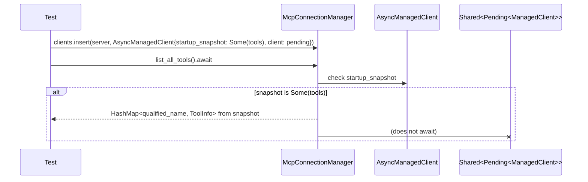
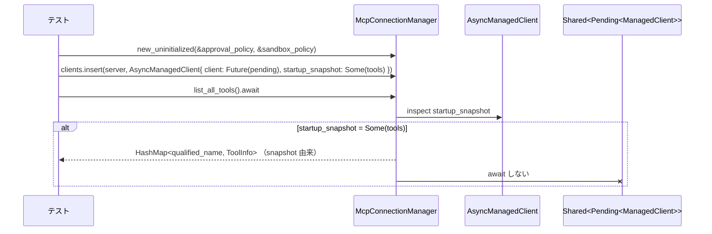
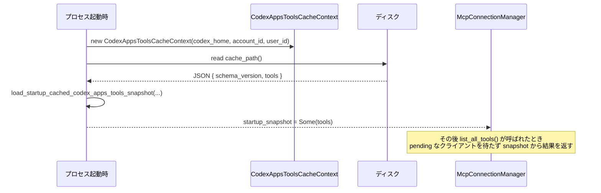

# codex-mcp/src/mcp_connection_manager_tests.rs

## 0. ざっくり一言

MCP 接続マネージャと周辺ユーティリティの挙動（ツール名の正規化・ツールフィルタ・キャッシュ・起動時スナップショット・エリシテーション・エラー表示・transport 文字列表現）を網羅的に検証するテストモジュールです。

---

## 1. このモジュールの役割

### 1.1 概要

このテストモジュールは、親モジュール（`super::*`）で定義されている MCP 関連コンポーネントについて、以下のような仕様を確認します。

- OpenAI 互換の file パラメータ情報の扱いと、ツール input schema の「モデル向け変換」
- MCP ツール名の正規化（`mcp__{server}__{tool}`）と衝突回避ロジック
- ツールフィルタ（有効・無効リスト）の判定ロジック
- Codex Apps ツール一覧キャッシュの読み書き・バージョン管理
- MCP クライアント起動時スナップショットと `list_all_tools` のブロッキング／非ブロッキング挙動
- エリシテーション（ユーザーへの質問フォーム）に関する承認ポリシー
- MCP 初期化エラーのユーザー向けメッセージ生成
- MCP サーバー transport 設定からの「origin」文字列抽出

### 1.2 アーキテクチャ内での位置づけ

このファイル自身はテスト専用であり、本番コードはすべて `super::*` からインポートされています（`codex-mcp\src\mcp_connection_manager_tests.rs:L1`）。  
テストが依存する主なコンポーネントの関係を簡略化すると次のようになります。

```mermaid
%% 概略依存関係 (codex-mcp\src\mcp_connection_manager_tests.rs 全体)
graph TD
    Tests["このテストモジュール"]
    Manager["McpConnectionManager"]
    AsyncClient["AsyncManagedClient"]
    CacheCtx["CodexAppsToolsCacheContext"]
    Qualify["qualify_tools"]
    Filter["ToolFilter / filter_tools"]
    CacheRW["write_/read_cached_codex_apps_tools<br/>load_startup_cached_codex_apps_tools_snapshot"]
    ElicitMgr["ElicitationRequestManager"]
    Policy["AskForApproval / SandboxPolicy"]
    ErrorDisp["mcp_init_error_display"]
    Transport["McpServerTransportConfig / transport_origin"]

    Tests --> Manager
    Tests --> AsyncClient
    Tests --> CacheCtx
    Tests --> Qualify
    Tests --> Filter
    Tests --> CacheRW
    Tests --> ElicitMgr
    Tests --> Policy
    Tests --> ErrorDisp
    Tests --> Transport
```



ここで示したノードのうち、`Tests` 以外はすべて親モジュールまたは外部クレートからの型・関数です。

### 1.3 設計上のポイント（テスト観点）

コードから読み取れる設計上の特徴は次のとおりです。

- **テスト補助関数による共通初期化**  
  - `create_test_tool`, `create_test_tool_with_connector`, `create_codex_apps_tools_cache_context` でテスト用データを一貫して構築します（`codex-mcp\src\mcp_connection_manager_tests.rs:L12-62`）。
- **安全なデフォルトとエッジケース重視のテスト**  
  - 無効な JSON や schema version 違いのキャッシュは無視されることを確認（L556-575, L578-592）。
  - 認証エラーのメッセージは具体的な操作（PAT 設定や login コマンド）を案内（L748-840）。
- **非同期処理とブロッキング挙動の明示的テスト**  
  - `futures::future::pending()` と `tokio::time::timeout` を用いて、`list_all_tools` がいつブロック／非ブロックになるかを検証（L619-694）。
- **モデル向けツール名／スキーマの安全性**  
  - ツール名は ASCII 英数字と `_` のみ、長さ 64 文字以内など、LLM から安全に呼べるよう制約（L272-400）。
  - file パラメータは「ローカル絶対パスを期待する」ことが説明に反映される（L81-133）。

---

## 2. 主要な機能一覧（テスト対象の機能）

このファイルはテスト専用ですが、テストを通して次の本番 API 仕様をカバーしています。

- OpenAI file パラメータ
  - `declared_openai_file_input_param_names`: メタデータ中の `"openai/fileParams"` をそのまま名前リストとして解釈（L64-79）。
  - `tool_with_model_visible_input_schema`: file パラメータを「ローカルファイルパス文字列」としてモデルに提示するために schema を書き換え（L81-133）。
- エリシテーション承認ポリシー
  - `elicitation_is_rejected_by_policy`: `AskForApproval` と `GranularApprovalConfig` に従ってエリシテーション可否を判定（L144-178）。
  - `ElicitationRequestManager::new` / `make_sender`: DangerFullAccess かつポリシーによる自動 Accept/Decline（L180-242）。
- MCP ツール名の正規化
  - `qualify_tools`: サーバー・ツール名から `mcp__{sanitized_server}__{sanitized_tool}` を生成し、重複・衝突を解決（L244-400）。
- MCP ツールフィルタ
  - `ToolFilter::allows`: enabled/disabled リストに従ってツール名を許可/拒否（L402-441）。
  - `filter_tools`: サーバー毎のフィルタを適用してツール一覧を絞り込み（L443-467）。
- Codex Apps ツールキャッシュ
  - `CodexAppsToolsCacheContext` + `write_cached_codex_apps_tools` / `read_cached_codex_apps_tools`  
    - 最終書き込み勝ち・ユーザー毎の分離・禁止 connector のフィルタ・schema version / JSON エラー時の無視（L469-575）。
  - `load_startup_cached_codex_apps_tools_snapshot`  
    - 起動時にディスクキャッシュからツール一覧をロード（L594-617）。
- MCP クライアント一覧取得
  - `McpConnectionManager::list_all_tools`:  
    - クライアント future が pending でも、startup_snapshot があればそれを返す（L619-647）。  
    - startup_snapshot なしの場合は pending future を待つため、呼び出しはブロックしうる（L649-670）。  
    - startup_snapshot が Some(Vec::new()) の場合はすぐ空結果を返す（L672-694）。  
    - クライアント起動が失敗しても startup_snapshot があればそれを返す（L696-729）。
- エリシテーション capability 公開
  - `elicitation_capability_for_server`: Codex Apps / custom MCP の両方でフォームベースのエリシテーションを有効にし、URL ベースは無効（L731-745）。
- MCP 初期化エラー表示
  - `mcp_init_error_display`: サーバー名・Auth 設定・エラー内容に応じたガイダンス文字列を生成（L748-840）。
- MCP transport origin
  - `transport_origin`: HTTP URL から origin (scheme+host+port) を抽出、stdio transport では `"stdio"` を返す（L842-868）。

---

## 3. 公開 API と詳細解説

### 3.1 型一覧（主にこのファイルから利用される型）

> 定義そのものは親モジュール／外部クレート側にあります。ここではテストから読み取れる役割を整理します。

| 名前 | 種別 | 役割 / 用途 | 根拠 |
|------|------|-------------|------|
| `ToolInfo` | 構造体 | MCP ツール 1 件分のメタデータ。サーバー名、モデル向け callable 名・namespace、実際の MCP ツール (`Tool`) や connector 情報を保持します。テスト補助関数でフィールドを初期化。 | `codex-mcp\src\mcp_connection_manager_tests.rs:L12-35, L305-323` |
| `Tool` | 構造体 | 実際の MCP ツール定義。名前 (`name`)、説明 (`description`)、入出力 schema、メタデータなどを含みます。 | L19-29, L322 |
| `ToolFilter` | 構造体 | `enabled: Option<HashSet<String>>` と `disabled: HashSet<String>` によりツール名の許可／拒否を定義するフィルタ。`allows(&str)` メソッドを持つ。 | L402-441, L444-457 |
| `CodexAppsToolsCacheContext` | 構造体 | Codex Apps ツールキャッシュのパスとキー (`CodexAppsToolsCacheKey`) を保持し、`cache_path()` を提供します。 | L49-62, L563-585, L517-521 |
| `CodexAppsToolsCacheKey` | 構造体 | `account_id`, `chatgpt_user_id`, `is_workspace_account` からキャッシュスコープを表現するキー。 | L56-60 |
| `ElicitationRequestManager` | 構造体 | エリシテーション（フォームなどでの追加質問）を扱うマネージャ。承認ポリシー・SandboxPolicy に基づいて sender を生成します。 | L180-187, L212-217 |
| `SandboxPolicy` | 列挙体 or 構造体 | サンドボックス（危険／読み取り専用など）のポリシー。`DangerFullAccess` / `new_read_only_policy()` がテストで利用されます。 | L182-183, L212-213, L628-629, L655-656, L709-710 |
| `AskForApproval` | 列挙体 | エリシテーション時にユーザー承認を求めるかどうかのポリシー。`OnFailure`, `OnRequest`, `UnlessTrusted`, `Granular`, `Never` などのバリアントを持ちます。 | L145-177 |
| `GranularApprovalConfig` | 構造体 | `AskForApproval::Granular` の設定値。`sandbox_approval`, `rules`, `skill_approval`, `request_permissions`, `mcp_elicitations` のブール値を持ちます。 | L155-163, L169-177 |
| `ElicitationResponse` | 構造体 | エリシテーション結果。`action: ElicitationAction`, `content: Option<serde_json::Value>`, `meta: Option<_>` を持つ。 | L200-207, L234-241 |
| `ElicitationAction` | 列挙体 | エリシテーションのアクション。`Accept` / `Decline` など。 | L203, L237 |
| `CreateElicitationRequestParams` | 列挙体 | エリシテーションリクエストのパラメータ。`FormElicitationParams` バリアントをテストで利用。 | L189-195, L219-229 |
| `McpConnectionManager` | 構造体 | 複数 MCP クライアントを管理し、ツール一覧 (`list_all_tools`) を提供するマネージャ。 | L619-647, L649-670, L672-694, L696-729 |
| `AsyncManagedClient` | 構造体 | `client: Shared<Future<Output=Result<ManagedClient, StartupOutcomeError>>>`、`startup_snapshot: Option<Vec<ToolInfo>>`、`startup_complete: AtomicBool` などをフィールドに持つ非同期クライアントラッパー。 | L631-639, L657-664, L680-687, L713-720 |
| `ManagedClient` | 型 | 実際の MCP クライアント。ここでは `Future<Output=Result<ManagedClient, StartupOutcomeError>>` の型パラメータとして登場。 | L625-627, L651-653, L674-676, L702-707 |
| `StartupOutcomeError` | 列挙体 | MCP クライアント起動結果のエラー型。`Failed { error: String }` などのバリアントを持ちます。`anyhow::Error` から `Into` されています。 | L702-705, L771-772, L785-786, L820-821, L832-833 |
| `Constrained<T>` | ジェネリック構造体 | ポリシー値 (`AskForApproval`, `SandboxPolicy` など) をラップし、`allow_any` で制約付き値を生成。 | L628-629, L654-655, L677-678, L709-710 |
| `ElicitationCapability` | 構造体 | フォーム／URL ベースのエリシテーション capability を表現。`form: Option<FormElicitationCapability>`, `url: Option<_>`。 | L731-743 |
| `FormElicitationCapability` | 構造体 | フォームエリシテーションの詳細。`schema_validation: Option<_>` があり、テストでは `None` を期待。 | L738-739 |
| `McpAuthStatusEntry` | 構造体 | MCP サーバー設定 (`McpServerConfig`) と認証状態 (`McpAuthStatus`) をまとめたもの。エラー表示に利用。 | L748-770, L798-819 |
| `McpServerConfig` | 構造体 | MCP サーバーの設定。`transport`, `enabled`, `startup_timeout_sec`, `tool_timeout_sec` など多数のフィールドを持ちます。 | L751-767, L800-817 |
| `McpServerTransportConfig` | 列挙体 | MCP サーバーの接続方式。`StreamableHttp` と `Stdio` バリアントがテストに登場。 | L752-757, L801-806, L843-849, L859-865 |
| `McpAuthStatus` | 列挙体 | MCP 認証状態。ここでは `Unsupported` バリアントが使用されています。 | L2-3, L769, L818 |
| `ToolPluginProvenance` | 構造体 | ツールがどのプラグイン由来かを表すメタ情報。ここでは `default()` で初期化されるのみ。 | L637-638, L663-664, L686-687, L719-720 |

### 3.2 重要な関数・メソッドの詳細

ここでは、テストから見える範囲で特に重要な 7 つの API の振る舞いを整理します。

#### `qualify_tools(tools: Vec<ToolInfo>) -> HashMap<String, ToolInfo>`

**概要**

- MCP サーバー名とツール名から「モデル向けに安全な callable 名」を生成し、`HashMap` へ詰め直す関数です。
- キーおよび `ToolInfo` 内の `callable_namespace` / `callable_name` は LLM が安全に扱えるよう、ASCII 英数字と `_` のみになり、長さは 64 文字に制限されます。
- サニタイズ後に重複するツール名がある場合の扱いもテストされています。

**引数**

| 引数名 | 型 | 説明 |
|--------|----|------|
| `tools` | `Vec<ToolInfo>` | MCP サーバー名・ツール名などが入った一覧。`ToolInfo.server_name` と `ToolInfo.tool.name` が元になります。 |

**戻り値**

- 型: `HashMap<String, ToolInfo>`
- キー: サニタイズ済みの「モデル向け callable フル名」 (`"mcp__{sanitized_server}__{sanitized_tool}"`)
- 値: 対応する `ToolInfo`。`callable_namespace` / `callable_name` もサニタイズ結果に更新されます。

**仕様（テストから分かる範囲）**

- 短く一意な名前の場合（L245-256）
  - `server_name = "server1"`, `tool_name = "tool1" / "tool2"` の場合、キーは `"mcp__server1__tool1"` などになります。
- 同一サーバー・同一ツール名が複数ある場合（L259-270）
  - 最初のツールのみが残り、2 つ目はスキップされます（`len() == 1`）。
- 非常に長いツール名の場合（L272-301）
  - 戻り値のキー長は常に 64 文字に制限されます。
  - すべてのキーは `"mcp__my_server__"` で始まり、`is_ascii_alphanumeric() || '_'` のみから成ります。
- サーバー名・ツール名に不正文字が含まれる場合（L303-330）
  - 例: `server.one`, `tool.two-three` → キー `"mcp__server_one__tool_two_three"` に変換。
  - `ToolInfo.tool.name` は元の MCP 名（`"tool.two-three"`）を保持しつつ、`callable_namespace`, `callable_name` はサニタイズ済みになります。
- サーバー名レベルのサニタイズで衝突する場合（L346-375）
  - 例: `"basic-server"` と `"basic_server"` の両方にツールがあるときも、`callable_namespace` が 2 つに分かれるように disambiguate されます。
  - すべてのキーは ASCII 英数字と `_` のみ。
- ツール名のサニタイズで衝突する場合（L377-400）
  - 例: `"tool-name"` と `"tool_name"` はどちらも `ToolInfo.tool.name` として保持され、`callable_name` も 2 つに分かれるように disambiguate されます。

**根拠**

- 基本的な動作と短い名前: `codex-mcp\src\mcp_connection_manager_tests.rs:L245-256`
- 重複スキップ: L259-270
- 長い名前と長さ制限・文字種制限: L272-301
- 不正文字のサニタイズと生の MCP 名保持: L303-330
- namespace 衝突の回避: L347-375
- ツール名サニタイズ衝突の回避: L377-400

**内部処理の流れ（推測を含む高レベル仕様）**

テストからわかる最低限の手順は次の通りです。

1. 各 `ToolInfo` について:
   - `server_name` をサニタイズ（`.` や `-` を `_` 等に置換）。
   - `tool.tool.name` をサニタイズ。
2. `callable_namespace = format!("mcp__{sanitized_server}__")` を構築し、`callable_name = sanitized_tool` を設定。
3. `format!("{}{}", callable_namespace, callable_name)` をキーとする。
4. 既に同じキーが存在する場合:
   - 「完全に同じ」ツールであれば後発をスキップ（L259-270）。
   - サニタイズの結果だけが衝突している場合は、何らかの disambiguation を行い、最終的にキー・`callable_namespace`・`callable_name` をユニークにする（L347-400）。
5. キー長が 64 文字を超える場合は 64 文字に収まるよう調整（L272-301）。

**Examples（使用例）**

```rust
// テストコードに近い形での利用例
let tools = vec![
    create_test_tool("music-studio", "get-strudel-guide"), // サーバー名とツール名にハイフンを含む
];

let qualified = qualify_tools(tools);
let (key, info) = qualified.into_iter().next().unwrap();

assert_eq!(key, "mcp__music_studio__get_strudel_guide");    // サニタイズ済み
assert_eq!(info.callable_namespace, "mcp__music_studio__"); // namespace 部分
assert_eq!(info.callable_name, "get_strudel_guide");        // callable 名
assert_eq!(info.tool.name, "get-strudel-guide");            // MCP 側の元名は保存
```

**Errors / Panics**

- テストからは、`qualify_tools` がエラーや panic を返すパスは確認できません。
- 入力ベクタに重複・長大名・不正文字が含まれていても、正常に `HashMap` を返す前提になっています。

**Edge cases**

- 同じサーバー・同じツール名が複数回現れる → 最初の 1 件のみ残る（L259-270）。
- サーバー名／ツール名のサニタイズで衝突 → disambiguate してユニークな callable 名にする（L346-400）。
- 極端に長いツール名 → キー長 64 文字に切り詰められる（L272-301）。

**使用上の注意点**

- 呼び出し側は、**モデルに見せるツール名としては `qualify_tools` の戻り値のキーを使う**ことが前提です。元の MCP 名 (`tool.tool.name`) をそのままモデルに渡すと、不正な文字や長さの問題が起きる可能性があります。
- `ToolInfo` を後から追加する場合も、必ず `qualify_tools` を通してからモデルに公開する契約になっていると考えられます。

---

#### `ToolFilter::allows(&self, name: &str) -> bool`

**概要**

- ツール名がフィルタ条件を満たしているか（許可されるか）を判定するメソッドです。
- `enabled` が指定されている場合は「ホワイトリスト優先」、`disabled` は「ブラックリスト」として扱われます。

**仕様（テストから分かる範囲）**

- デフォルトでは全許可（L402-407）
  - `ToolFilter::default()` は `enabled = None, disabled = ∅` とみなされ、任意の名前を許可します。
- `enabled` のみ指定（L409-418）
  - `enabled = {"allowed"}` の場合:
    - `"allowed"` → `true`
    - `"denied"` → `false`
- `disabled` のみ指定（L420-429）
  - `disabled = {"blocked"}` の場合:
    - `"blocked"` → `false`
    - `"open"` → `true`
- `enabled` と `disabled` の両方指定（L431-441）
  - `enabled = {"keep", "remove"}`, `disabled = {"remove"}` の場合:
    - `"keep"` → `true`
    - `"remove"` → `false` （enabled にあっても disabled にあれば拒否）
    - `"unknown"` → `false` （enabled のみ許可）

**根拠**

- デフォルトと `enabled` の挙動: L402-418
- `disabled` のみの挙動: L420-429
- `enabled` + `disabled` の優先順位: L431-441

**内部処理の流れ（推測レベルの仕様）**

1. `if let Some(enabled) = &self.enabled`:
   - `if !enabled.contains(name)` なら即 `false` を返す。
2. その後 `if self.disabled.contains(name)` なら `false` を返す。
3. それ以外は `true`。

**Examples（使用例）**

```rust
// サーバー毎のフィルタに利用される例（L444-467）
let filter = ToolFilter {
    enabled: Some(HashSet::from(["tool_a".to_string(), "tool_b".to_string()])),
    disabled: HashSet::from(["tool_b".to_string()]),
};

assert!(filter.allows("tool_a")); // enabled に含まれ disabled には含まれない
assert!(!filter.allows("tool_b")); // disabled により拒否
assert!(!filter.allows("unknown")); // enabled に含まれないため拒否
```

**Errors / Panics**

- テストからは panic やエラーを発生させるパスはありません。

**Edge cases**

- `enabled = Some(∅)` かどうかはテストされていません（このチャンクには現れません）が、仕様上は「何も許可しない」になる可能性があります。
- 名前の大文字小文字やサニタイズはここでは扱われず、呼び出し側の責務です。

**使用上の注意点**

- `ToolFilter` は「名前文字列」に対するフィルタなので、**`qualify_tools` で生成した callable 名か、元の MCP 名か**を統一して使う必要があります。
- フィルタの粒度（サーバー単位かグローバルか）は呼び出し側（`filter_tools`）で管理されます。

---

#### `filter_tools(tools: Vec<ToolInfo>, filter: &ToolFilter) -> Vec<ToolInfo>`

**概要**

- 指定された `ToolFilter` に従って、ツール一覧をフィルタリングする関数です。

**引数**

| 引数名 | 型 | 説明 |
|--------|----|------|
| `tools` | `Vec<ToolInfo>` | フィルタ対象のツール一覧。 |
| `filter` | `&ToolFilter` | `allows` メソッドを通じて許可／拒否判定を行うフィルタ。 |

**戻り値**

- 型: `Vec<ToolInfo>`
- 内容: `filter.allows(tool.callable_name)`（または類似の判断）を満たすツールのみを含むベクタ。

**仕様（テストから分かる範囲）**

- サーバー毎に異なるフィルタを適用できる（L443-467）。
  - `server1` のツール（`tool_a`, `tool_b`）に対しては `enabled={"tool_a","tool_b"}, disabled={"tool_b"}`。
  - `server2` のツール（`tool_a`）には `disabled={"tool_a"}`。
- それぞれ `filter_tools` を呼んだ結果を `chain` し、最終的に 1 件 (`server1` の `tool_a`) のみが残ることを確認。

**根拠**

- per-server フィルタの適用例: L443-467

**内部処理の流れ（推測レベルの仕様）**

1. `tools.into_iter().filter(|tool| filter.allows(&tool.callable_name)).collect()`
   - もしくはサーバー名など別のキーでフィルタしている可能性もありますが、テストからは callable 名ベースと解釈できます。

**Examples（使用例）**

```rust
let server1_tools = vec![
    create_test_tool("server1", "tool_a"),
    create_test_tool("server1", "tool_b"),
];
let server1_filter = ToolFilter {
    enabled: Some(HashSet::from(["tool_a".to_string(), "tool_b".to_string()])),
    disabled: HashSet::from(["tool_b".to_string()]),
};

let filtered_server1 = filter_tools(server1_tools, &server1_filter);
assert_eq!(filtered_server1.len(), 1);
assert_eq!(filtered_server1[0].callable_name, "tool_a");
```

**Errors / Panics**

- テストからはエラーや panic の発生は確認されていません。

**Edge cases**

- `filter` が `enabled = None, disabled = ∅` の場合、入力の `tools` がそのまま返ると考えられます（L402-407 の `ToolFilter::default` と組み合わせた場合）。

**使用上の注意点**

- **サーバー毎に異なるフィルタを適用したい場合**、テストのようにサーバー毎に `filter_tools` を呼び出し、その結果を `Iterator::chain` 等でまとめる形になります（L459-462）。
- `ToolFilter` の対象となる名前が `callable_name` か `tool.tool.name` かは、実装に依存します。テストでは `callable_name` を使っています（L465-466）。

---

#### `write_cached_codex_apps_tools(ctx: &CodexAppsToolsCacheContext, tools: &[ToolInfo])` / `read_cached_codex_apps_tools(ctx: &CodexAppsToolsCacheContext) -> Option<Vec<ToolInfo>>`

**概要**

- Codex Apps MCP ツール一覧をディスク上にキャッシュし、後から読み返すための API です。
- キャッシュはユーザー毎に分離され、最新書き込みが常に有効になります。
- schema version 不一致や JSON 不正時にはキャッシュを無視します。

**仕様（テストから分かる範囲）**

1. **最後に書いたものが有効（L469-489）**
   - 同じ `cache_context` で `tools_gateway_1` → `tools_gateway_2` の順に `write_cached_codex_apps_tools` を呼ぶと、以降の `read` では `tools_gateway_2` の内容（callable_name `"two"`）のみが返る。

2. **ユーザー毎に完全に分離されたキャッシュ（L491-522）**
   - `account-one/user-one` と `account-two/user-two` で別々の `CodexAppsToolsCacheContext` を作成。
   - それぞれに書き込んだツールが `read` で混ざらずに取得される。
   - `cache_path()` が異なることも検証される（L517-521）。

3. **特定 connector のツールはキャッシュ読み出し時にフィルタされる（L524-553）**
   - `connector_id = "connector_openai_hidden"` のツールは読み出し結果に含まれない。
   - `"calendar"` の connector のみが残る。

4. **schema_version 不一致時の無視（L555-575）**
   - キャッシュファイルの JSON に `schema_version = CODEX_APPS_TOOLS_CACHE_SCHEMA_VERSION + 1` と書かれている場合、`read_cached_codex_apps_tools` は `None` を返す。

5. **JSON 不正時の無視（L577-592）**
   - キャッシュファイル内容が `{not json` の場合、`read_cached_codex_apps_tools` は `None` を返す。

**根拠**

- 上書き動作: L469-489  
- ユーザー毎の分離: L491-522  
- connector フィルタ: L524-553  
- schema_version チェック: L555-575  
- JSON 不正時: L577-592  

**内部処理の流れ（推測レベルの仕様）**

`write_cached_codex_apps_tools`（書き込み）:

1. `ctx.cache_path()` からパスを取得。
2. 親ディレクトリがなければ作成（L563-566, L585-588 のパターンから推測）。
3. JSON 形式で `{ "schema_version": CODEX_APPS_TOOLS_CACHE_SCHEMA_VERSION, "tools": tools }` を書き出す。

`read_cached_codex_apps_tools`（読み込み）:

1. `ctx.cache_path()` のファイルを読み取り、JSON としてパース。
2. `schema_version` が期待値と一致しない場合は `None` を返す（L567-574）。
3. `tools` 配列を `Vec<ToolInfo>` にデシリアライズ。
4. `connector_id` に基づくフィルタ（`"connector_openai_hidden"` 等）を適用してから返す（L524-553）。

**Examples（使用例）**

```rust
// キャッシュ書き込みと読み出し
let codex_home = tempdir().expect("tempdir");
let cache_context = create_codex_apps_tools_cache_context(
    codex_home.path().to_path_buf(),
    Some("account-one"),
    Some("user-one"),
);

let tools = vec![create_test_tool(CODEX_APPS_MCP_SERVER_NAME, "calendar_search")];
write_cached_codex_apps_tools(&cache_context, &tools);

if let Some(cached) = read_cached_codex_apps_tools(&cache_context) {
    assert_eq!(cached[0].callable_name, "calendar_search");
}
```

**Errors / Panics**

- ファイル I/O の失敗についてはテストされていません（このチャンクには現れません）。
- JSON 不正や schema_version 不一致は panic ではなく `None` による「キャッシュ無視」で扱われます（L574-575, L591-592）。

**Edge cases**

- キャッシュファイルが存在しない場合の挙動は、このチャンクには現れませんが、通常は `None` もしくは空リストを返す設計が想定されます。
- ツール配列が空のキャッシュ（`tools: []`）をどう扱うかは別テスト（`startup_cached_codex_apps_tools_loads_from_disk_cache` と `list_all_tools_does_not_block_when_startup_snapshot_cache_hit_is_empty`）で間接的に扱われています（L594-617, L672-694）。

**使用上の注意点**

- キャッシュ schema を変更する場合は `CODEX_APPS_TOOLS_CACHE_SCHEMA_VERSION` を更新し、過去のキャッシュが自動的に無視されるようにする必要があります（L567-570）。
- connector フィルタ（`connector_openai_hidden` など）は **キャッシュ読み出し時** に適用されるため、書き込み側ではそのまま全ツールを保存していてもよいという契約になっています（L524-553）。

---

#### `load_startup_cached_codex_apps_tools_snapshot(server_name: &str, ctx: Option<&CodexAppsToolsCacheContext>) -> Option<Vec<ToolInfo>>`

**概要**

- MCP サーバー起動時に、ディスク上の Codex Apps ツールキャッシュからスナップショットを読み込むための関数です。
- `McpConnectionManager` の `AsyncManagedClient.startup_snapshot` に渡され、クライアント接続完了前の `list_all_tools` で利用されます。

**仕様（テストから分かる範囲）**

- 正常にキャッシュが存在し、schema_version も一致している場合は `Some(Vec<ToolInfo>)` を返します（L594-617）。
  - 読み込んだツールの `server_name` は引数で与えた `server_name` と一致している必要があります（L615）。
  - `callable_name` もキャッシュに保存されていたもの (`"calendar_search"`) になります（L616）。

**根拠**

- ディスクキャッシュからの読み出し: L594-617  
- 実際には `write_cached_codex_apps_tools` と組み合わせて動作確認されています。

**内部処理の流れ（推測レベルの仕様）**

1. `ctx` が `None` の場合は `None` を返す。
2. `read_cached_codex_apps_tools(ctx)` を呼び出す。
3. `Some(tools)` が返れば、そのまま `Some(tools)`（もしくは `server_name` 一致のみフィルタして返す）。

**使用上の注意点**

- Codex Apps の MCP ツールを起動時に即座に利用したい場合、この関数を通じて `startup_snapshot` を事前ロードすることが前提になります（次節 `list_all_tools` 参照）。

---

#### `McpConnectionManager::list_all_tools(&self) -> HashMap<String, ToolInfo>`

**概要**

- 管理下にあるすべての MCP クライアントからツール一覧を収集し、`HashMap` として返す非同期メソッドです。
- クライアントの起動状態や `startup_snapshot` の有無に応じて、ブロッキング／非ブロッキングの挙動が変わります。

**仕様（テストから分かる範囲）**

1. **クライアント future が pending かつ `startup_snapshot` がある場合（L619-647）**
   - `ManagedClient` への接続 future が `futures::future::pending()` のままですが、`startup_snapshot: Some(startup_tools)` が設定されている。
   - `list_all_tools().await` は**ブロックせず**に `startup_snapshot` 由来のツールを返します。
   - 戻り値のキー `"mcp__codex_apps__calendar_create_event"` に対応する `ToolInfo` が期待通りであることを確認（L641-646）。

2. **pending だが `startup_snapshot` がない場合（L649-670）**
   - `startup_snapshot: None` かつ future が `pending()`。
   - `tokio::time::timeout(Duration::from_millis(10), manager.list_all_tools()).await` が timeout (`Err`) になることから、`list_all_tools` はクライアント future を awaited しており、**ブロックする**ことがわかります。

3. **pending + `startup_snapshot: Some(Vec::new())` の場合（L672-694）**
   - `startup_snapshot` が `Some(empty_vec)`。
   - `timeout` で 10ms 待ってもタイムアウトせず、`tools` は空の `HashMap` になることが確認されています。
   - → 「**キャッシュヒット（空）」の場合も、pending future を待たずに即座に空結果を返す」挙動が保証されます。

4. **クライアント起動が失敗している場合（L696-729）**
   - `client` が `ready(Err(StartupOutcomeError::Failed { .. }))` の shared future。
   - `startup_complete` が `true` に設定されており、`startup_snapshot: Some(startup_tools)` もある。
   - `list_all_tools` は `startup_snapshot` からツールを返します（L723-728）。

**根拠**

- startup snapshot 使用: L619-647, L696-729  
- pending + no snapshot でブロック: L649-670  
- pending + empty snapshot で非ブロック: L672-694  

**内部処理の流れ（テストから推測される仕様）**

1. 各 `AsyncManagedClient` について:
   - もし `startup_snapshot` が `Some(snapshot)` なら、**少なくとも 1 回は**それをツール一覧として利用する。
   - snapshot が空ベクタであっても「キャッシュヒット」として扱い、クライアント future を待たずに空一覧を返す。
2. `startup_snapshot` が `None` の場合:
   - クライアント future (`client`) を await し、その結果からツール一覧を取得する。
   - future が pending であれば呼び出しもブロックする（L649-670）。
3. クライアント起動が失敗しても、`startup_snapshot` があればその内容にフォールバックする（L696-729）。

**データフロー図**



**Examples（使用例）**

```rust
// 起動直後、まだクライアント接続が完了していないが、ディスクキャッシュから snapshot を読み込んだケース
let approval_policy = Constrained::allow_any(AskForApproval::OnFailure);
let sandbox_policy = Constrained::allow_any(SandboxPolicy::new_read_only_policy());
let mut manager = McpConnectionManager::new_uninitialized(&approval_policy, &sandbox_policy);

// 事前に load_startup_cached_codex_apps_tools_snapshot で snapshot を取得した想定
let snapshot = load_startup_cached_codex_apps_tools_snapshot(
    CODEX_APPS_MCP_SERVER_NAME,
    Some(&cache_context),
).unwrap();

manager.clients.insert(
    CODEX_APPS_MCP_SERVER_NAME.to_string(),
    AsyncManagedClient {
        client: futures::future::pending::<Result<ManagedClient, StartupOutcomeError>>()
            .boxed()
            .shared(),
        startup_snapshot: Some(snapshot),
        startup_complete: Arc::new(std::sync::atomic::AtomicBool::new(false)),
        tool_plugin_provenance: Arc::new(ToolPluginProvenance::default()),
    },
);

let tools = manager.list_all_tools().await; // pending だが snapshot から即時に取得
```

**Errors / Panics**

- テストでは、`list_all_tools` 自体が `Result` を返すのではなく、`HashMap` を直接返す前提になっています（`timeout(..., manager.list_all_tools())` を `Result` として扱っていない点から推測）。
- クライアント future のエラー (`StartupOutcomeError`) は内部で処理され、ツール一覧の取得失敗として扱われるか、startup snapshot にフォールバックします（L696-729）。

**Edge cases**

- pending + snapshot なし → 呼び出しがハングしうる（高レイテンシサーバーの場合など）（L649-670）。
- snapshot が存在しても empty → 非ブロックで空一覧を返す（L672-694）。
- クライアント起動失敗 (`StartupOutcomeError::Failed`) でも snapshot からツールを返す（L696-729）。

**使用上の注意点**

- **UX とレスポンス性の観点から、遅いクライアントには `startup_snapshot` を用意することが重要**です。そうしないと、`list_all_tools` が起動完了までブロックします。
- `startup_snapshot` が空でも「キャッシュヒット」と見なされるため、「このサーバーにはツールがない」ことを事前に知っている場合でも空ベクタを設定する意味があります。

---

#### `mcp_init_error_display(server_name: &str, entry: Option<&McpAuthStatusEntry>, err: &StartupOutcomeError) -> String`

**概要**

- MCP クライアントの起動に失敗したとき、ユーザーに表示する人間向けメッセージを生成する関数です。
- サーバー名・Auth 設定・エラー内容に応じて異なるガイダンスを返します。

**仕様（テストから分かる範囲）**

1. **GitHub 専用メッセージ（L748-780）**
   - `server_name = "github"`  
   - `entry.config.transport.url` が `https://api.githubcopilot.com/mcp/`  
   - `auth_status = McpAuthStatus::Unsupported`  
   - `err` は `"OAuth is unsupported"` を含む `StartupOutcomeError`  
   → 出力: GitHub MCP は OAuth をサポートしないので、PAT を環境変数と `config.toml` に設定するよう案内するメッセージ。

2. **Auth 必須だが未ログインな場合（エントリなし）（L782-794）**
   - `entry = None`  
   - エラーメッセージに `"Auth required for server"` が含まれる  
   → 出力: `codex mcp login {server_name}` を実行するよう促すメッセージ。

3. **一般的なエラー（L796-827）**
   - `entry` あり（`bearer_token_env_var` あり）だが、エラーは `"boom"` のような任意のもの。
   - → 出力: `"MCP client for`{server_name}`failed to start: {err:#}`"  
     - `{err:#}` は `anyhow` の pretty-print 形式。

4. **起動タイムアウト時（L829-840）**
   - `entry = None`  
   - エラーメッセージに `"request timed out"` が含まれる  
   → 出力: デフォルト 30 秒でタイムアウトしたことと、`startup_timeout_sec` を設定する方法を案内するメッセージ。

**根拠**

- GitHub 専用メッセージ: L748-780  
- login コマンド案内: L782-794  
- 汎用エラー: L796-827  
- タイムアウト・ヒント: L829-840  

**使用上の注意点**

- 呼び出し側は、**`StartupOutcomeError` のメッセージ内容に依存したパターンマッチング**が行われている前提でエラーを構築していると考えられます（例: `"request timed out"`）。
- 新しいエラーケースを追加する場合、ユーザー向けの文言をここに追加しないと、すべて「汎用エラー」として扱われる可能性があります。

---

#### `transport_origin(transport: &McpServerTransportConfig) -> Option<String>`

**概要**

- MCP サーバーの transport 設定から、「origin」文字列（HTTP の origin or `"stdio"`）を抽出する関数です。

**仕様（テストから分かる範囲）**

- `StreamableHttp` バリアントの場合（L843-855）
  - `url = "https://example.com:8443/path?query=1"` のとき、`Some("https://example.com:8443".to_string())` を返す。
  - → パスやクエリは切り捨てられ、スキーム＋ホスト＋ポートのみが残る。
- `Stdio` バリアントの場合（L857-868）
  - 任意の `command` や `args` に関わらず、`Some("stdio".to_string())` を返す。

**根拠**

- HTTP origin 抽出: L843-855  
- stdio 表現: L857-868  

**使用上の注意点**

- この関数は UI やログ表示のために「接続先」を要約する用途で使われると解釈できます。
- HTTP URL が不正な場合の挙動はテストされていません。このチャンクには現れません。

---

### 3.3 このファイル内で定義される補助関数

| 関数名 | 役割（1 行） | 根拠 |
|--------|--------------|------|
| `create_test_tool(server_name, tool_name) -> ToolInfo` | 指定されたサーバー名・ツール名から、デフォルト値を持つ `ToolInfo` を生成するテスト用ヘルパー。 | `codex-mcp\src\mcp_connection_manager_tests.rs:L12-35` |
| `create_test_tool_with_connector(server_name, tool_name, connector_id, connector_name) -> ToolInfo` | `create_test_tool` で生成した `ToolInfo` に connector 情報を付与するヘルパー。 | L37-47 |
| `create_codex_apps_tools_cache_context(codex_home, account_id, chatgpt_user_id) -> CodexAppsToolsCacheContext` | Codex Apps ツールキャッシュをユーザー毎にスコープするためのコンテキストを構築するヘルパー。 | L49-62 |

---

## 4. データフロー

### 4.1 `list_all_tools` と startup snapshot の利用

テストから読み取れる代表的なシナリオは、**クライアントがまだ起動完了していない（future が pending）状態**で `list_all_tools` を呼ぶケースです。

- `startup_snapshot` が `Some(tools)` の場合: snapshot から即座に結果を返し、future を待たない（L619-647）。
- `startup_snapshot` が `None` の場合: future を await し、pending なら呼び出しがブロックする（L649-670）。
- `startup_snapshot` が `Some(Vec::new())` の場合: 空結果を即座に返す（L672-694）。



### 4.2 キャッシュの読み出しと起動時スナップショット

起動時キャッシュは次のような流れで利用されます（L594-617, L619-647）。



---

## 5. 使い方（How to Use）

このファイルはテストですが、本番コード利用の代表的なパターンをテストから抽出して示します。

### 5.1 基本的な使用方法（`McpConnectionManager` + キャッシュ）

```rust
use std::sync::Arc;
use futures::FutureExt;
use tempfile::tempdir;

// 1. キャッシュコンテキストを用意
let codex_home = tempdir().expect("tempdir");
let cache_context = create_codex_apps_tools_cache_context(
    codex_home.path().to_path_buf(),
    Some("account-one"),
    Some("user-one"),
);

// 2. 事前にツール一覧を取得してキャッシュに書き込み（初回起動時など）
let initial_tools = vec![create_test_tool(CODEX_APPS_MCP_SERVER_NAME, "calendar_search")];
write_cached_codex_apps_tools(&cache_context, &initial_tools);

// 3. 次回起動時にキャッシュから snapshot をロード
let startup_snapshot = load_startup_cached_codex_apps_tools_snapshot(
    CODEX_APPS_MCP_SERVER_NAME,
    Some(&cache_context),
);

// 4. マネージャを初期化し、pending なクライアント future と snapshot を登録
let approval_policy = Constrained::allow_any(AskForApproval::OnFailure);
let sandbox_policy = Constrained::allow_any(SandboxPolicy::new_read_only_policy());
let mut manager = McpConnectionManager::new_uninitialized(&approval_policy, &sandbox_policy);

// 実際にはここで ManagedClient を起動する future を作成する
let client_future = futures::future::pending::<Result<ManagedClient, StartupOutcomeError>>()
    .boxed()
    .shared();

manager.clients.insert(
    CODEX_APPS_MCP_SERVER_NAME.to_string(),
    AsyncManagedClient {
        client: client_future,
        startup_snapshot,
        startup_complete: Arc::new(std::sync::atomic::AtomicBool::new(false)),
        tool_plugin_provenance: Arc::new(ToolPluginProvenance::default()),
    },
);

// 5. ツール一覧を取得（クライアントが pending でも snapshot があれば即座に返る）
let tools = manager.list_all_tools().await;
println!("Tools: {:?}", tools.keys().collect::<Vec<_>>());
```

### 5.2 よくある使用パターン

1. **ツール名の正規化とフィルタ**

```rust
// サーバー毎のツール一覧を収集
let raw_tools = vec![
    create_test_tool("server.one", "tool.two-three"),
    create_test_tool("server.two", "tool_name"),
];

// モデル向け callable 名に正規化
let qualified = qualify_tools(raw_tools);

// ユーザー設定に基づいたフィルタ
let filter = ToolFilter {
    enabled: Some(HashSet::from(["mcp__server_one__tool_two_three".to_string()])),
    disabled: HashSet::new(),
};

let visible_tools: Vec<_> = qualified
    .into_iter()
    .filter(|(name, _)| filter.allows(name))
    .collect();
```

1. **エリシテーションの自動 accept / decline**

```rust
let manager = ElicitationRequestManager::new(
    AskForApproval::Never,
    SandboxPolicy::DangerFullAccess,
);

let (tx_event, _rx_event) = async_channel::bounded(1);
let sender = manager.make_sender("server".to_string(), tx_event);

// requested_schema にフィールドがない場合は自動 Accept
let response = sender(
    NumberOrString::Number(1),
    CreateElicitationRequestParams::FormElicitationParams {
        meta: None,
        message: "Confirm?".to_string(),
        requested_schema: rmcp::model::ElicitationSchema::builder()
            .build()
            .expect("schema"),
    },
).await.expect("auto accept");
assert!(matches!(response.action, ElicitationAction::Accept));
```

### 5.3 よくある間違いと正しいパターン

```rust
// 間違い例: 遅いサーバーに対して startup_snapshot を用意せず list_all_tools を呼ぶ
let mut manager = McpConnectionManager::new_uninitialized(&approval_policy, &sandbox_policy);
manager.clients.insert(
    CODEX_APPS_MCP_SERVER_NAME.to_string(),
    AsyncManagedClient {
        client: futures::future::pending::<Result<ManagedClient, StartupOutcomeError>>()
            .boxed()
            .shared(),
        startup_snapshot: None, // ← snapshot がない
        startup_complete: Arc::new(std::sync::atomic::AtomicBool::new(false)),
        tool_plugin_provenance: Arc::new(ToolPluginProvenance::default()),
    },
);
// tokio::time::timeout を使わないと、この await は長時間ブロックしうる
// let tools = manager.list_all_tools().await;

// 正しい例: 起動時キャッシュから snapshot をロードして登録
let startup_snapshot = load_startup_cached_codex_apps_tools_snapshot(
    CODEX_APPS_MCP_SERVER_NAME,
    Some(&cache_context),
);
manager.clients.insert(
    CODEX_APPS_MCP_SERVER_NAME.to_string(),
    AsyncManagedClient {
        client: futures::future::pending::<Result<ManagedClient, StartupOutcomeError>>()
            .boxed()
            .shared(),
        startup_snapshot, // ← snapshot があるのでブロックしない
        startup_complete: Arc::new(std::sync::atomic::AtomicBool::new(false)),
        tool_plugin_provenance: Arc::new(ToolPluginProvenance::default()),
    },
);
```

### 5.4 使用上の注意点（まとめ）

- **モデル向けツール名の安全性**
  - 直接 `ToolInfo.tool.name` をモデルに公開せず、必ず `qualify_tools` を通した callable 名を使用することが前提になっています（L303-330）。
- **ツールキャッシュの整合性**
  - schema version を変更した場合は `CODEX_APPS_TOOLS_CACHE_SCHEMA_VERSION` を更新し、古いキャッシュが自動無視されるようにする必要があります（L567-570）。
- **クライアント起動のレスポンス性**
  - `list_all_tools` は pending なクライアント future を await するため、遅いサーバーには `startup_snapshot` を設定する、あるいは呼び出し側で `tokio::time::timeout` を使うことが推奨されます（L649-670）。
- **エリシテーションの安全性**
  - DangerFullAccess であっても、requested_schema にフィールドがあるフォームエリシテーションは自動で Decline されることがテストされています（L210-242）。ユーザーに無断で追加情報を送信しない安全策と解釈できます。

---

## 6. 変更の仕方（How to Modify）

### 6.1 新しい機能を追加する場合

- **ツール名正規化ロジックを拡張したい場合**
  - 親モジュール側の `qualify_tools` 実装を変更し、このテストファイル中の以下のテストを合わせて更新します。
    - `test_qualify_tools_*` 系（L245-400）。
  - 変更意図（例: 文字種や長さ制限）に合わせてアサーションを調整します。
- **キャッシュフォーマットを拡張したい場合**
  - `write_cached_codex_apps_tools` / `read_cached_codex_apps_tools` の JSON schema を変更し、`CODEX_APPS_TOOLS_CACHE_SCHEMA_VERSION` をインクリメントします（L567-570）。
  - schema version mismatch テスト（L555-575）を更新し、新しいバージョンを期待するようにします。

### 6.2 既存の機能を変更する場合の注意点

- `list_all_tools` のブロッキング条件を変更する場合
  - 次のテストが期待を固定しているため、意図に応じて更新が必要です。
    - `list_all_tools_uses_startup_snapshot_while_client_is_pending`（L619-647）
    - `list_all_tools_blocks_while_client_is_pending_without_startup_snapshot`（L649-670）
    - `list_all_tools_does_not_block_when_startup_snapshot_cache_hit_is_empty`（L672-694）
    - `list_all_tools_uses_startup_snapshot_when_client_startup_fails`（L696-729）
- エラー表示ロジック（`mcp_init_error_display`）を変更する場合
  - GitHub 専用メッセージ・login コマンド案内・汎用メッセージ・タイムアウトヒント用の 4 つのテスト（L748-840）を確認し、新しい仕様に合わせてアサーションを更新します。
- セキュリティ的な挙動（エリシテーションの自動 Accept/Decline や connector フィルタ）を変更する場合
  - エリシテーション関連テスト（L144-178, L180-242）と、connector フィルタテスト（L524-553）を合わせて見直します。

---

## 7. 関連ファイル

| パス | 役割 / 関係 |
|------|------------|
| `codex-mcp\src\mcp_connection_manager_tests.rs` | 本ファイル。MCP 接続マネージャおよび関連ユーティリティのテストを提供します。 |
| 親モジュール（`super`） | このチャンクからは具体的なパスは分かりませんが、`McpConnectionManager`, `qualify_tools`, `ToolFilter` など本番実装が定義されるモジュールです（`use super::*;` により参照されています: L1）。 |
| 外部クレート `codex_protocol` | `GranularApprovalConfig`, `McpAuthStatus` などプロトコル定義を提供します（L2-3）。 |
| 外部クレート `rmcp` | `JsonObject`, `Meta`, `NumberOrString`, `ElicitationSchema` など MCP プロトコル関連の型を提供します（L5-7, L192-227）。 |

このテストモジュールは、これら関連ファイル・モジュールの仕様を固定する役割を担っているため、いずれかの挙動を変更する際は、本ファイル内の対応するテストとセットで確認することが重要です。
