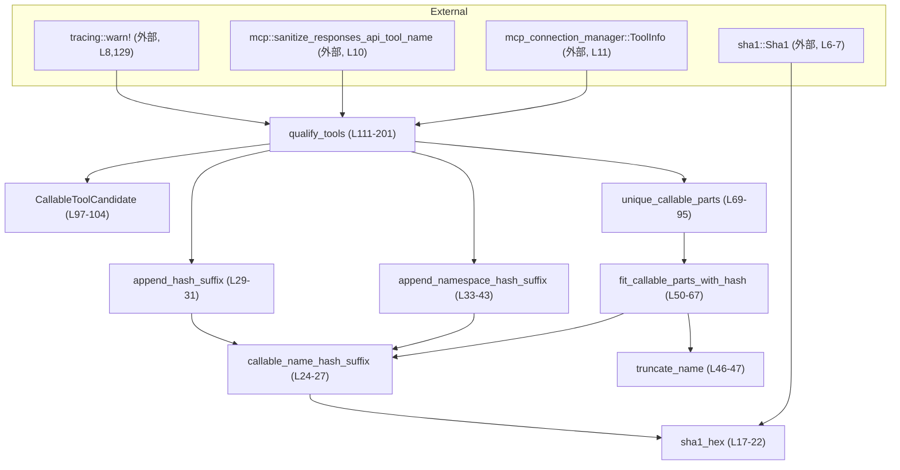

# codex-mcp/src/mcp_tool_names.rs コード解説

## 0. ざっくり一言

MCP（Model Context Protocol）のツール情報 `ToolInfo` に対して、  
モデルから見える「呼び出し可能なツール名（namespace + name）」を一意かつ最大 64 バイト以内に収まるように割り当てるモジュールです（`qualify_tools`）。  
元の MCP 上の識別子（サーバ名など）は `ToolInfo` 内に保持しつつ、モデル用の名前空間／ツール名を正規化・ハッシュ・短縮します（`codex-mcp/src/mcp_tool_names.rs:L1-15,106-110`）。

---

## 1. このモジュールの役割

### 1.1 概要

- このモジュールは **MCP ツールの内部識別子（サーバ名・コネクタ ID・元ツール名など）** を統合し、  
  **モデルから見える一意なツール名（`mcp__namespace__tool` 形式を想定）** を生成するために存在します（`L1,106-110`）。
- 複数の MCP サーバやコネクタから同名ツールが来ても衝突しないように、  
  SHA1 に基づくハッシュを名前空間やツール名に付与し、必要に応じて長さを調整します（`L17-31,50-67,69-95`）。
- 生成された名前は `HashMap<String, ToolInfo>` のキーとして返され、値の `ToolInfo` 側にも最終的な `callable_namespace` / `callable_name` が書き戻されます（`L111-115,190-201`）。

### 1.2 アーキテクチャ内での位置づけ

主な依存関係と役割を簡単な依存グラフで表します。



- `qualify_tools` がこのモジュールの入口であり、ほかのすべての内部関数を間接的に利用します。
- `ToolInfo` 型や `sanitize_responses_api_tool_name` の実装は、このチャンクには現れていません（`L10-11`）。

### 1.3 設計上のポイント

- **責務の分割**  
  - ハッシュ生成（`sha1_hex`, `callable_name_hash_suffix`）、  
    名前へのハッシュ付与（`append_hash_suffix`, `append_namespace_hash_suffix`）、  
    長さ調整（`truncate_name`, `fit_callable_parts_with_hash`）、  
    一意名の確定（`unique_callable_parts`）が段階的に分離されています（`L17-95`）。
- **状態管理**  
  - グローバル状態は持たず、すべて関数ローカルな `HashMap` / `HashSet` / `Vec` で完結しており、  
    呼び出し間の副作用は `ToolInfo` 内のフィールド更新のみです（`L115-116,142-143,162-163,188-201`）。
- **エラーハンドリング**  
  - Rust の `Result` は使用せず、パニックの可能性があるのは主に  
    文字列スライス `&hash[..CALLABLE_NAME_HASH_LEN]`（`L24-27`）と、メモリアロケーション失敗などのランタイム要因です。  
    重複ツールは `warn!` ログを出してスキップする方針です（`L128-131`）。
- **並行性**  
  - すべての関数は同期（非 `async`）で、内部に共有可変状態やスレッドを持ちません。  
    `qualify_tools` は引数と戻り値の間でデータを移動する純粋な変換処理として設計されています（`L111-115,190-201`）。

---

## 2. 主要な機能一覧

このモジュールが提供する主要な機能は次の通りです。

- MCP ツール一覧の正規化と一意名付け:  
  `ToolInfo` のリストから、モデル可視な一意のツール名を生成し `HashMap` にまとめて返す（`qualify_tools`, `L111-201`）。
- 名前空間の衝突解消:  
  異なる実体（サーバ／コネクタ）なのに同じ正規化 namespace になった場合、ハッシュを namespace に付与して区別する（`L142-160,33-43`）。
- ツール名の衝突解消:  
  同じ namespace 内で同じ正規化ツール名になった場合、ツール名にハッシュを付与して区別する（`L162-183,29-31`）。
- 最大長 64 バイトを意識した名前短縮:  
  namespace とツール名の連結が長すぎる場合でも、ハッシュ付きでなるべく情報を残しつつ短縮する（`L50-67,69-95`）。
- 安定的かつ一意な最終名の決定:  
  生の ID（サーバ名やコネクタ ID など）を材料に SHA1 からハッシュを作り、  
  衝突時も繰り返しハッシュ入力を変えて再試行することで、高い一意性を持たせています（`L17-22,24-27,80-94`）。

### 2.1 コンポーネントインベントリー（関数・構造体・定数）

| 名前 | 種別 | 公開範囲 | 役割 / 用途 | 定義箇所 |
|------|------|----------|-------------|----------|
| `MCP_TOOL_NAME_DELIMITER` | 定数 `&'static str` | モジュール内 | namespace 末尾の区切り文字列 `"__"` | `codex-mcp/src/mcp_tool_names.rs:L13` |
| `MAX_TOOL_NAME_LENGTH` | 定数 `usize` | モジュール内 | 生成するツール名（namespace+name）の最大長（バイト数）64 | `L14` |
| `CALLABLE_NAME_HASH_LEN` | 定数 `usize` | モジュール内 | ハッシュ文字列から使用する長さ（12） | `L15` |
| `sha1_hex` | 関数 | モジュール内 | 文字列の SHA1 を 16 進文字列に変換 | `L17-22` |
| `callable_name_hash_suffix` | 関数 | モジュール内 | ID からハッシュサフィックス（`_xxxxxxxxxxxx`）を生成 | `L24-27` |
| `append_hash_suffix` | 関数 | モジュール内 | 任意の文字列末尾にハッシュサフィックスを付与 | `L29-31` |
| `append_namespace_hash_suffix` | 関数 | モジュール内 | namespace に対して、区切り記号前にハッシュを差し込むなどの処理 | `L33-43` |
| `truncate_name` | 関数 | モジュール内 | 文字列を `max_len` 個の Unicode 文字に切り詰め | `L46-47` |
| `fit_callable_parts_with_hash` | 関数 | モジュール内 | namespace とツール名を 64 バイト以内に収めるようにハッシュ付きで調整 | `L50-67` |
| `unique_callable_parts` | 関数 | モジュール内 | 既存集合と照合しつつ、一意で <=64 バイト（想定）の namespace, name, qualified_name を決める | `L69-95` |
| `CallableToolCandidate` | 構造体 | モジュール内 | `ToolInfo` とその各種 ID／正規化名を束ねる内部用レコード | `L97-104` |
| `qualify_tools` | 関数 | `pub(crate)` | MCP ツール一覧から一意なモデル可視名を割り当てた `HashMap` を返すメイン API | `L111-201` |

---

## 3. 公開 API と詳細解説

### 3.1 型一覧（構造体・列挙体など）

| 名前 | 種別 | 公開範囲 | 役割 / 用途 | 定義箇所 |
|------|------|----------|-------------|----------|
| `CallableToolCandidate` | 構造体 | モジュール内 (`pub` ではない) | 各ツールの元 ID（namespace / tool）と、正規化された callable 名をまとめて保持する内部構造体 | `L97-104` |
| `ToolInfo` | 構造体（外部定義） | `pub`（推定） | MCP ツールの情報を表す型。`server_name`, `callable_namespace`, `callable_name`, `connector_id`, `tool.name` フィールドがこのファイル内で使用されていますが、完全な定義はこのチャンクには現れません。 | インポート: `use crate::mcp_connection_manager::ToolInfo;` (`L11`) |

`CallableToolCandidate` のフィールド構成（根拠: `L97-104`）:

- `tool: ToolInfo` – 元のツール情報
- `raw_namespace_identity: String` – サーバ名・元 namespace・コネクタ ID から作る生の namespace 識別子
- `raw_tool_identity: String` – 生 namespace ID と元 callable 名・元ツール名から作る生のツール識別子
- `callable_namespace: String` – 正規化済みの callable namespace（衝突解消・ハッシュ適用前／途中の値）
- `callable_name: String` – 正規化済みの callable name（同上）

### 3.2 関数詳細（主要 7 件）

#### `qualify_tools<I>(tools: I) -> HashMap<String, ToolInfo>`（L111-201）

**概要**

MCP ツール群から、モデル可視な一意ツール名をキーとする `HashMap` を構築するメイン API です（`L111-115`）。  
元の `ToolInfo` に含まれる raw な識別子を用いてハッシュ／短縮／衝突解消を行い、  

- `HashMap` のキー: 最終的な「完全修飾名」（namespace + name の連結文字列）  
- 値の `ToolInfo.callable_namespace` / `.callable_name`: 同じく最終的な namespace / name  
を設定して返します（`L190-201`）。

**シグネチャ**

```rust
pub(crate) fn qualify_tools<I>(tools: I) -> HashMap<String, ToolInfo>
where
    I: IntoIterator<Item = ToolInfo>,
```

**引数**

| 引数名 | 型 | 説明 |
|--------|----|------|
| `tools` | `I: IntoIterator<Item = ToolInfo>` | 入力となる MCP ツール情報の列。各 `ToolInfo` には `server_name`, `callable_namespace`, `callable_name`, `connector_id`, `tool.name` などが含まれている前提です（`L118-127`）。 |

**戻り値**

- 型: `HashMap<String, ToolInfo>`
  - キー: モデル可視な完全修飾ツール名（`namespace + name`）（`L75-76,191-199`）
  - 値: `ToolInfo`。`callable_namespace` / `callable_name` はこの関数内で最終的な値に書き換えられます（`L197-198`）。

**内部処理の流れ（アルゴリズム）**

根拠はコメントおよびコード全体（`L106-201`）です。

1. **重複 raw ツールの除外**（`L115-131`）
   - `seen_raw_names: HashSet<String>` を初期化（`L115`）。
   - 各 `tool` について、
     - `raw_namespace_identity = "{server_name}\0{callable_namespace}\0{connector_id}"` を構成（`L118-123`）。
     - `raw_tool_identity = "{raw_namespace_identity}\0{callable_name}\0{tool.tool.name}"` を構成（`L124-127`）。
     - `seen_raw_names` に `raw_tool_identity` を挿入し、すでに存在していれば `warn!` を出してそのツールはスキップ（`L128-131`）。
2. **候補オブジェクトの構築**（`L133-139`）
   - `sanitize_responses_api_tool_name` で namespace/name を正規化（`L133-135`）。
   - `CallableToolCandidate` に
     - 正規化 namespace/name
     - `raw_namespace_identity` / `raw_tool_identity`
     - 元の `tool`
     を詰め、`candidates: Vec<CallableToolCandidate>` に追加（`L116,133-139`）。
3. **namespace 衝突の検出と解決**（`L142-160`）
   - `namespace_identities_by_base: HashMap<String, HashSet<String>>` を作成し、
     正規化 namespace ごとに raw_namespace_identity を集約（`L142-148`）。
   - 同じ正規化 namespace に複数の raw_namespace_identity が属するものを `colliding_namespaces` として抽出（`L149-152`）。
   - `candidates` を走査し、`colliding_namespaces` に含まれる namespace を持つものは
     `append_namespace_hash_suffix` でハッシュ付き namespace に書き換える（`L153-160`）。
4. **ツール名（namespace+name）衝突の検出と解決**（`L162-183`）
   - キー `(callable_namespace, callable_name)` ごとに `raw_tool_identity` を集約する
     `tool_identities_by_base: HashMap<(String,String), HashSet<String>>` を構築（`L162-171`）。
   - raw_tool_identity が複数あるキーだけを `colliding_tools` として抽出（`L172-175`）。
   - `colliding_tools` に該当する候補については、
     `callable_name = append_hash_suffix(callable_name, raw_tool_identity)` でハッシュ付き name に置き換え（`L176-183`）。
5. **安定ソート**（`L186`）
   - `candidates` を `raw_tool_identity` の辞書順でソートし、同じ入力に対して決定的な順序を保証（`L186`）。
6. **最終完全修飾名の決定と一意化**（`L188-201`）
   - `used_names: HashSet<String>` と `qualified_tools: HashMap<String, ToolInfo>` を初期化（`L188-189`）。
   - 各 `candidate` について
     - `unique_callable_parts` に
       `(candidate.callable_namespace, candidate.callable_name, candidate.raw_tool_identity, &mut used_names)` を渡して  
       `(final_namespace, final_name, qualified_name)` を取得（`L191-196`）。
       - ここで 64 バイト長制約と最終的な一意性が担保される想定です（`L69-95`）。
     - `candidate.tool.callable_namespace/name` を最終値で上書き（`L197-198`）。
     - `qualified_tools.insert(qualified_name, candidate.tool)` でマップに登録（`L199`）。
   - 最終的な `qualified_tools` を返す（`L201`）。

**Examples（使用例）**

`ToolInfo` の完全な定義はこのチャンクにはないため、抽象的な使用例になります。

```rust
use std::collections::HashMap;
use crate::mcp_connection_manager::ToolInfo;
use crate::mcp_tool_names::qualify_tools;

fn build_tool_map(tools: Vec<ToolInfo>) -> HashMap<String, ToolInfo> {
    // ToolInfo のベクタから、モデル可視な完全修飾名で引けるマップを作る
    let qualified = qualify_tools(tools);

    // 例えば、キー（完全修飾名）の一覧をログに出す
    for (qualified_name, _tool) in &qualified {
        println!("registered MCP tool: {}", qualified_name);
    }

    qualified
}
```

**Errors / Panics**

この関数自体は `Result` を返さず、明示的なエラー伝搬は行っていません。

- **パニックの可能性**
  - 間接的に呼ぶ `callable_name_hash_suffix` の中で  
    `&hash[..CALLABLE_NAME_HASH_LEN]` を行っており（`L24-27`）、  
    ここで `hash.len() < CALLABLE_NAME_HASH_LEN` だった場合はパニックになります。  
    `sha1_hex` が常にそれ以上の長さを返すことが前提です（`L17-22`）。
  - メモリアロケーションに失敗した場合など、通常の Rust のランタイム要因によるパニックはありえます。
- **ログ出力**
  - 同一 `raw_tool_identity` のツールが複数渡された場合、  
    `warn!("skipping duplicated tool {}", tool.tool.name);` が出力され、そのツールは無視されます（`L124-131`）。  
    これは挙動としては静かにスキップですが、原因調査には `tracing` のログが必要です。

**Edge cases（エッジケース）**

- **空の入力**  
  - `tools` が空のイテレータの場合、`candidates` も空であり、  
    衝突検出ループやソートはほぼノーオペレーションとなり、空の `HashMap` が返ります（`L115-201`）。
- **raw_tool_identity が重複する場合**  
  - 同じサーバ名・namespace・connector_id・callable_name・`tool.name` の組み合わせを持つツールは 2 件目以降がスキップされます（`L118-131`）。  
  - スキップされたことは戻り値からは分かりませんが、warn ログとしてのみ観測できます（`L129`）。
- **namespace の衝突**  
  - 異なる raw_namespace_identity（サーバやコネクタが違うなど）にもかかわらず  
    正規化された `callable_namespace` が同じになった場合、  
    それらの namespace にはハッシュサフィックスが付与されて区別されます（`L142-160`）。
- **ツール名の衝突**  
  - 正規化後の `(callable_namespace, callable_name)` が同じで raw_tool_identity が異なる場合、  
    `callable_name` にハッシュを付加してユニークにします（`L162-183`）。
- **最終名前長と文字種（非 ASCII）の場合**  
  - 長さ制約は `MAX_TOOL_NAME_LENGTH`（バイト数）を前提にしていますが、  
    `truncate_name` は「文字数」ベースで切り詰めており（`L46-47`）、  
    入力文字列にマルチバイト文字が含まれる場合、  
    最終的なバイト長が 64 を超える可能性があります（詳細は後述）。

**使用上の注意点**

- `ToolInfo` の `server_name`, `callable_namespace`, `callable_name`, `connector_id`, `tool.name` などが  
  一意性の基礎となるため、それらが頻繁に変わると最終的なツール名も変わる可能性があります（`L118-127`）。
- 重複ツールがスキップされるため、「入力した件数」と「登録された件数」が一致するとは限りません。  
  呼び出し側で件数チェックを行う場合は注意が必要です（`L128-131`）。
- 並行性の観点では、`qualify_tools` は引数に依存する純粋関数であり、  
  共有状態を変更しないため、複数スレッドから同じ入力で呼び出しても競合は生じません。

---

#### `unique_callable_parts(

    namespace: &str,
    tool_name: &str,
    raw_identity: &str,
    used_names: &mut HashSet<String>,
) -> (String, String, String)`（L69-95）

**概要**

指定された `namespace` と `tool_name` から完全修飾名 `qualified_name = namespace + tool_name` を作成し、  

- 64 バイト以内（想定）  
- `used_names` に対して一意  
となるようにハッシュ付きで調整した `(namespace, tool_name, qualified_name)` を返します（`L75-95`）。

**引数**

| 引数名 | 型 | 説明 |
|--------|----|------|
| `namespace` | `&str` | ベースとなる namespace 文字列。すでに正規化・衝突解決済みの値が渡される想定です（`L191-192`）。 |
| `tool_name` | `&str` | ベースとなるツール名。こちらも正規化・衝突解決済み（`L191-193`）。 |
| `raw_identity` | `&str` | このツール固有の raw ID。ハッシュ入力として使用されます（`L72-73,82-86`）。 |
| `used_names` | `&mut HashSet<String>` | これまでに使用済みの完全修飾名の集合。新しい名前が一意かどうかの判定に使われます（`L73-77,90-91`）。 |

**戻り値**

- `(String, String, String)`:
  - `namespace`: 最終的な namespace（変化しない場合も多い）（`L76-77,91`）
  - `tool_name`: 最終的なツール名（ハッシュ付き・短縮される場合あり）（`L76-77,88-91`）
  - `qualified_name`: `namespace + tool_name` の連結文字列（`L75-76,89-91`）

**内部処理の流れ**

1. **単純ケース: そのまま使える場合**（`L75-78`）
   - `qualified_name = format!("{namespace}{tool_name}")` を生成（`L75`）。
   - `qualified_name.len() <= MAX_TOOL_NAME_LENGTH` かつ `used_names.insert(qualified_name.clone()) == true`  
     であれば、そのまま `(namespace.to_string(), tool_name.to_string(), qualified_name)` を返します（`L75-78`）。
2. **衝突・長さ超過時のハッシュ付きリトライ**（`L80-94`）
   - `attempt: u32 = 0` から開始（`L80`）。
   - ループ内で `hash_input` を次のように決めます（`L82-86`）。
     - `attempt == 0` のとき: `hash_input = raw_identity.to_string()`
     - `attempt > 0` のとき: `hash_input = format!("{raw_identity}\0{attempt}")`
   - `fit_callable_parts_with_hash(namespace, tool_name, &hash_input)` を呼び出し、  
     改めて `(namespace, tool_name)` を決定（`L87-88`）。
   - 再度 `qualified_name = format!("{namespace}{tool_name}")` を生成し（`L89`）、  
     `used_names` に挿入して成功すれば結果を返却（`L90-91`）。
   - 挿入に失敗した場合（既に使用済み）、
     `attempt = attempt.saturating_add(1)` でインクリメントして再ループ（`L93`）。

**Examples（使用例）**

`unique_callable_parts` は内部関数ですが、挙動イメージを示します。

```rust
use std::collections::HashSet;

fn example_unique_parts() {
    let mut used = HashSet::new();

    // 1回目はそのまま通るケース
    let (ns1, name1, q1) = unique_callable_parts("mcp__demo__", "tool", "raw-id-1", &mut used);
    assert_eq!(q1, format!("{}{}", ns1, name1)); // 完全修飾名

    // 2回目、同じ namespace + name だが raw_identity が異なるケース
    let (_ns2, _name2, q2) = unique_callable_parts("mcp__demo__", "tool", "raw-id-2", &mut used);
    assert_ne!(q1, q2); // ハッシュ付きで一意な名前になる想定
}
```

（`ns1` / `name1` / `q1` の具体的内容は `fit_callable_parts_with_hash` とハッシュ次第です。）

**Errors / Panics**

- `fit_callable_parts_with_hash` が内部で `callable_name_hash_suffix` / `truncate_name` を使用するため、  
  それらに起因するパニック（ハッシュ文字列の長さ不足など）の可能性があります（`L50-67,24-27`）。
- `saturating_add` を用いているため、`attempt` が `u32::MAX` に到達してもオーバーフローのパニックは起きません（`L93`）。

**Edge cases（エッジケース）**

- **最初から 64 バイト以内で一意な場合**  
  - ハッシュ付与や短縮は行われず、そのままの `namespace`, `tool_name` が採用されます（`L75-78`）。
- **極端に多くの衝突がある場合**  
  - 各衝突ごとに `hash_input` を変えて新しいハッシュサフィックスを試みます（`L82-86`）。  
  - 理論的には、`used_names` が非常に大きく、かつハッシュサフィックスがすべて既存と衝突し続けると無限ループの可能性がありますが、  
    SHA1 の 12 桁（48bit）サフィックスを前提とすると実務上は極めて起こりにくいと考えられます。  
    ただし、このチャンクだけからは「必ず終わる」とは断定できません。

**使用上の注意点**

- 長さチェックは `qualified_name.len()`（バイト数）で行われますが、  
  `fit_callable_parts_with_hash` の短縮ロジックは Unicode 文字数ベースであるため、  
  非 ASCII 文字が含まれる場合の長さ保証には注意が必要です（`L46-47,50-67`）。
- `used_names` は呼び出し側から共有される前提であり、  
  同じ関数を複数回呼ぶ際に別々の `HashSet` を使うと、一意性は「その呼び出し内」だけで保証されます（`L69-95`）。

---

#### `fit_callable_parts_with_hash(

    namespace: &str,
    tool_name: &str,
    raw_identity: &str,
) -> (String, String)`（L50-67）

**概要**

`raw_identity` から生成したハッシュサフィックスを用いて、  
`namespace` と `tool_name` を連結した完全修飾名が `MAX_TOOL_NAME_LENGTH`（64 バイト）以内になるよう  

- 可能なら namespace をそのまま保持し、tool_name を短縮 + ハッシュ付与  
- それでも無理な場合は namespace を短縮 + ハッシュのみをツール名とする  
という方針で調整します（`L50-67`）。

**引数**

| 引数名 | 型 | 説明 |
|--------|----|------|
| `namespace` | `&str` | 基本となる namespace。呼び出し元ではすでに namespace 衝突解消が済んでいる場合があります（`L50-52,153-160`）。 |
| `tool_name` | `&str` | 基本となるツール名（正規化後）。この関数内で短縮される可能性があります（`L52,61-62`）。 |
| `raw_identity` | `&str` | このツール固有の raw ID。ハッシュサフィックスの材料となります（`L53,55`）。 |

**戻り値**

- `(String, String)`:
  - 1 要素目: 調整後 namespace
  - 2 要素目: 調整後ツール名（短縮 + ハッシュサフィックス、またはハッシュのみ）

**内部処理の流れ**

1. `suffix = callable_name_hash_suffix(raw_identity)` でハッシュサフィックスを生成（`L55`）。
2. `max_tool_len = MAX_TOOL_NAME_LENGTH.saturating_sub(namespace.len())` で  
   ツール名が使えるバイト数の上限を計算（`L56`）。
3. `max_tool_len >= suffix.len()` の場合（`L57`）:
   - `prefix_len = max_tool_len - suffix.len()`（`L58`）。
   - `truncate_name(tool_name, prefix_len)` でツール名先頭 `prefix_len` 文字を取り出し、  
     その後ろに `suffix` を連結した文字列を新しいツール名とする（`L61-62`）。
   - namespace はそのまま返す（`L59-61`）。
4. `max_tool_len < suffix.len()` の場合（`L65-66`）:
   - namespace を `max_namespace_len = MAX_TOOL_NAME_LENGTH - suffix.len()` 文字ぶんに切り詰め（`L65-66`）。
   - ツール名は `suffix` のみとする（`L66`）。

**Examples（使用例）**

```rust
fn example_fit() {
    let (ns, name) = fit_callable_parts_with_hash(
        "mcp__long_namespace__", 
        "extremely_long_tool_name_that_needs_truncation",
        "raw-id-123",
    );

    println!("namespace = {ns}, tool_name = {name}");
    // 具体的な値はハッシュによって変わるが、
    // format!("{ns}{name}").len() が 64 以下になるよう調整されることを意図している。
}
```

**Errors / Panics**

- `callable_name_hash_suffix` 呼び出しにより、ハッシュ文字列の長さが `CALLABLE_NAME_HASH_LEN` 未満の場合はパニックの可能性があります（`L24-27`）。
- それ以外は単純な文字列操作であり、通常はパニックは想定されません。

**Edge cases（エッジケース）**

- **非常に長い namespace**  
  - `namespace.len()` が `MAX_TOOL_NAME_LENGTH` に近いか超えていると、`max_tool_len` が 0 に近づきます。  
  - `max_tool_len < suffix.len()` になると namespace 側を短縮するモードに移行します（`L56-66`）。
- **tool_name が空**  
  - `tool_name` が空文字でも、`truncate_name("", prefix_len)` は空文字となり、  
    結果としてツール名はハッシュのみになります（`L61-62`）。
- **マルチバイト文字**  
  - `truncate_name` は Unicode 文字数単位で切り詰めますが（`L46-47`）、  
    `max_tool_len` / `max_namespace_len` はバイト数を前提としているため、  
    非 ASCII 文字を含む場合、最終的な `format!("{namespace}{tool_name}")` のバイト長が 64 を超える可能性があります。

**使用上の注意点**

- この関数単体では「64 バイト以内であること」が絶対に保証されるわけではありません（文字数とバイト数の不整合のため）。  
  呼び出し側で追加の長さチェックが必要になる場合があります。
- `raw_identity` を変えることで異なるハッシュサフィックスを得られるため、  
  衝突時の再試行に適しています（`L82-88`）。

---

#### `append_namespace_hash_suffix(namespace: &str, raw_identity: &str) -> String`（L33-43）

**概要**

namespace 文字列に対してハッシュサフィックスを付与する関数です。  
`namespace` がすでに `MCP_TOOL_NAME_DELIMITER`（`"__"`）で終わっている場合は、その直前にハッシュを挿入し、  
そうでない場合は `append_hash_suffix` で末尾にハッシュを付加します（`L33-43`）。

**引数**

| 引数名 | 型 | 説明 |
|--------|----|------|
| `namespace` | `&str` | 正規化された namespace 文字列。この関数でハッシュ付き namespace に変換されます（`L33-35,155-158`）。 |
| `raw_identity` | `&str` | namespace に応じた raw ID。ハッシュサフィックス生成に使用されます（`L33-34,38`）。 |

**戻り値**

- `String`: ハッシュサフィックスが適用された新しい namespace 文字列。

**内部処理の流れ**

1. `namespace.strip_suffix(MCP_TOOL_NAME_DELIMITER)` を試みる（`L34-35`）。
   - 成功した場合（`Some(namespace)` が返るとき）、  
     - `format!("{}{}{}", namespace, callable_name_hash_suffix(raw_identity), MCP_TOOL_NAME_DELIMITER)` を返す（`L35-40`）。  
       すなわち、末尾の `"__"` の直前にハッシュ `_xxxxxxxxxxxx` を挟み、再度 `"__"` を付けるイメージです。
   - 失敗した場合（`None`）、`append_hash_suffix(namespace, raw_identity)` を呼んで  
     namespace 末尾に `_xxxxxxxxxxxx` を付けた文字列を返します（`L41-43`）。

**Examples（使用例）**

```rust
fn example_append_namespace() {
    // 末尾が "__" の場合
    let ns1 = append_namespace_hash_suffix("mcp__demo__", "raw-ns-1");
    // ns1 はおおよそ "mcp__demo_<hash>__" のような形になる

    // 末尾が "__" でない場合
    let ns2 = append_namespace_hash_suffix("mcp__demo", "raw-ns-2");
    // ns2 は "mcp__demo_<hash>" のような形になる
}
```

**Errors / Panics**

- 内部で `callable_name_hash_suffix` を使用するため、  
  ハッシュ文字列長さ不足によるパニックの可能性があります（`L24-27`）。

**Edge cases（エッジケース）**

- **空 namespace**  
  - `namespace == ""` の場合、`strip_suffix("__")` は失敗し、  
    `append_hash_suffix("", raw_identity)` にフォールバックします。  
    結果としてツール名自体が `_xxxxxxxxxxxx` のような形になります（`L41-43`）。
- **MCP_TOOL_NAME_DELIMITER を複数回含む namespace**  
  - `strip_suffix` は末尾のみを見るため、  
    例えば `"mcp__demo__extra__"` の場合、最後の `"__"` が対象となります。

**使用上の注意点**

- `MCP_TOOL_NAME_DELIMITER` に依存したレイアウト（例: `"mcp__namespace__"`）を保ちつつハッシュを差し込みたい場合に利用されます。  
  namespace のフォーマットを変更する場合はこの関数も合わせて見直す必要があります。

---

#### `append_hash_suffix(value: &str, raw_identity: &str) -> String`（L29-31）

**概要**

任意の文字列 `value` の末尾に、`raw_identity` に基づくハッシュサフィックスを付けた新しい文字列を返します。  
`append_namespace_hash_suffix` や、ツール名の衝突解消処理から利用されます（`L29-31,176-183`）。

**引数**

| 引数名 | 型 | 説明 |
|--------|----|------|
| `value` | `&str` | ハッシュを付けたい元の文字列（namespace またはツール名） |
| `raw_identity` | `&str` | ハッシュの入力となる raw ID |

**戻り値**

- `String`: `"value" + "_xxxxxxxxxxxx"` の形式の文字列。

**内部処理の流れ**

1. `callable_name_hash_suffix(raw_identity)` でハッシュサフィックス（`_xxxxxxxxxxxx`）を取得（`L30`）。
2. `format!("{value}{}", suffix)` の形で連結した文字列を返します（`L29-31`）。

**Examples（使用例）**

```rust
fn example_append_hash() {
    let base = "tool";
    let hashed = append_hash_suffix(base, "raw-tool-1");
    // hashed は "tool_<hash>" のような形になる
}
```

**Errors / Panics**

- 内部で `callable_name_hash_suffix` を呼び出すため、それに起因するパニックの可能性があります（`L24-27`）。

**Edge cases（エッジケース）**

- `value` が空文字でも問題なく動作し、単に `"_xxxxxxxxxxxx"` となります。

**使用上の注意点**

- 複数回適用した場合、`tool_<hash1>_<hash2>` のようにハッシュが連結されていきます。  
  このファイル内では同じ文字列に対して複数回適用することはありません（`L33-43,176-183`）。

---

#### `callable_name_hash_suffix(raw_identity: &str) -> String`（L24-27）

**概要**

`raw_identity` 文字列から SHA1 を計算し、その 16 進表現の先頭 `CALLABLE_NAME_HASH_LEN` 文字（12 字）を  
`"_"` で前置したサフィックスとして返します（`L24-27`）。

**引数**

| 引数名 | 型 | 説明 |
|--------|----|------|
| `raw_identity` | `&str` | ハッシュの入力。namespace ID や tool ID を表す文字列が渡されます（`L24-25,55,38,30`）。 |

**戻り値**

- `String`: `format!("_{}", &hash[..CALLABLE_NAME_HASH_LEN])` の結果（`L26`）。

**内部処理の流れ**

1. `hash = sha1_hex(raw_identity)` で SHA1 の 16 進文字列を得る（`L25`）。
2. `&hash[..CALLABLE_NAME_HASH_LEN]` で先頭 12 文字を取り出し、`"_"` を付けて返す（`L26`）。

**Examples（使用例）**

```rust
fn example_suffix() {
    let suffix = callable_name_hash_suffix("raw-id-xyz");
    assert!(suffix.starts_with('_'));
    assert!(suffix.len() > 1); // 具体的な長さは sha1_hex に依存
}
```

**Errors / Panics**

- `hash.len() < CALLABLE_NAME_HASH_LEN` の場合、`&hash[..CALLABLE_NAME_HASH_LEN]` でパニックが発生します（`L26`）。  
  `sha1_hex` が十分な長さの文字列を返すことが前提条件です。

**Edge cases（エッジケース）**

- `raw_identity` が空文字でも `sha1_hex("")` は何らかのハッシュ文字列を返し、それを基にサフィックスが生成されます。

**使用上の注意点**

- サフィックスは人間に意味のある ID ではなく、あくまで衝突解消用の短いハッシュとして使われます。  
  SHA1 であることから暗号学的な強度は期待されておらず、このコードでも安全性ではなく一意性目的で利用されています。

---

#### `truncate_name(value: &str, max_len: usize) -> String`（L46-47）

**概要**

`value` の先頭 `max_len` 個の **Unicode 文字**（`char`）を取り出して `String` にして返します（`L46-47`）。  
バイト数ではなく文字数ベースのトリミングである点が、このモジュールの長さ制約と組み合わさる際のポイントです。

**引数**

| 引数名 | 型 | 説明 |
|--------|----|------|
| `value` | `&str` | 切り詰める元の文字列 |
| `max_len` | `usize` | 取得する文字数（バイト数ではない） |

**戻り値**

- `String`: `value.chars().take(max_len).collect()` の結果。

**内部処理の流れ**

1. `value.chars()` で Unicode 文字イテレータを取得（`L47`）。
2. `take(max_len)` で先頭 `max_len` 文字のみを取り出し（`L47`）、`collect()` で `String` に変換して返します（`L46-47`）。

**Examples（使用例）**

```rust
fn example_truncate() {
    // ASCII の場合: 文字数 == バイト数
    assert_eq!(truncate_name("abcdef", 3), "abc");

    // 非 ASCII の場合: 文字数とバイト数が異なる
    let s = "あいうえお"; // 各文字が3バイト
    let t = truncate_name(s, 2);
    assert_eq!(t, "あい"); // 文字数2だが、バイト数は6
}
```

**Errors / Panics**

- 通常の使用ではパニックは発生しません。

**Edge cases（エッジケース）**

- `max_len == 0` の場合、常に空文字を返します。
- `max_len` が `value.chars().count()` より大きい場合、元の文字列全体を返します。

**使用上の注意点**

- このモジュールでは `MAX_TOOL_NAME_LENGTH`（バイト数）から導かれた値を `max_len` に渡しているため（`L56,65`）、  
  **「バイト数の上限」を「文字数の上限」として使用している** 状態になっています。  
  非 ASCII 文字を含む場合、狙いどおりのバイト長にはならない可能性があります。

---

#### `sha1_hex(s: &str) -> String`（L17-22）

**概要**

文字列 `s` の SHA1 ダイジェストを計算し、その 16 進文字列表現を返します（`L17-22`）。  
`callable_name_hash_suffix` を通じて、ツール名や namespace のハッシュサフィックス生成に使われます。

**引数**

| 引数名 | 型 | 説明 |
|--------|----|------|
| `s` | `&str` | ハッシュ対象の文字列。namespace ID や tool ID の構成要素が渡されます。 |

**戻り値**

- `String`: `format!("{sha1:x}")` による 16 進表現（長さはこのチャンクでは固定されていませんが、通常は 40 桁程度を想定）。

**内部処理の流れ**

1. `let mut hasher = Sha1::new();` でハッシュオブジェクトを生成（`L18`）。
2. `hasher.update(s.as_bytes());` で入力バイト列を追加（`L19`）。
3. `let sha1 = hasher.finalize();` でダイジェストを取得（`L20`）。
4. `format!("{sha1:x}")` で 16 進文字列表現に変換して返します（`L21`）。

**Examples（使用例）**

```rust
fn example_sha1_hex() {
    let h = sha1_hex("hello");
    // 具体的な値は sha1 実装に依存するが、空でないことは期待できる
    assert!(!h.is_empty());
}
```

**Errors / Panics**

- 通常の使用ではパニックは想定されません。

**Edge cases（エッジケース）**

- 入力が空文字列でも何らかの SHA1 文字列が返るため、`callable_name_hash_suffix` の前提（長さ >= 12）が成り立つと期待されています。

**使用上の注意点**

- 暗号学的な強度ではなく、一意性のためのハッシュとして使用されています。  
  セキュリティ目的での使用には適しません。

---

### 3.3 その他の関数

`sha1_hex` 以外のすべての関数は 3.2 で詳述済みなので、補助的な関数としての位置づけのみまとめます。

| 関数名 | 役割（1 行） | 定義箇所 |
|--------|--------------|----------|
| `sha1_hex` | 文字列の SHA1 を 16 進文字列に変換するユーティリティ関数 | `codex-mcp/src/mcp_tool_names.rs:L17-22` |

---

## 4. データフロー

ここでは、`qualify_tools` を呼び出して MCP ツール名を確定させる典型的なフローを示します。

### 4.1 処理の要点（文章）

1. 呼び出し元は複数の `ToolInfo` を `qualify_tools` に渡します（`L111-115`）。
2. `qualify_tools` 内で
   - raw namespace/tool ID を構成し、重複する raw ツールを除外（`L118-131`）。
   - 正規化済み namespace/name と raw ID を `CallableToolCandidate` にまとめる（`L133-139`）。
   - namespace 衝突を検出し、必要なものにハッシュサフィックスを付与（`L142-160`）。
   - ツール名（namespace+name）衝突を検出し、必要なものにハッシュサフィックスを付与（`L162-183`）。
3. 衝突解消後の候補を raw_tool_identity でソートし、  
   `unique_callable_parts` を通じて全体としてユニークな完全修飾名を決定します（`L186-196`）。
4. 最終的に `HashMap<String, ToolInfo>` を構築し、キーは完全修飾名、値は更新済みの `ToolInfo` です（`L188-201`）。

### 4.2 シーケンス図（Mermaid）

```mermaid
sequenceDiagram
    participant Caller as 呼び出し側
    participant Qualify as qualify_tools (L111-201)
    participant Cand as CallableToolCandidate (L97-104)
    participant Uniq as unique_callable_parts (L69-95)
    participant Fit as fit_callable_parts_with_hash (L50-67)
    participant HashSuf as callable_name_hash_suffix (L24-27)
    participant Sha1Fn as sha1_hex (L17-22)

    Caller->>Qualify: tools: IntoIterator<Item = ToolInfo>

    loop 各 ToolInfo (重複排除 & 候補生成, L117-139)
        Qualify->>Qualify: raw_namespace_identity/raw_tool_identity を構成
        Qualify->>Qualify: seen_raw_names に挿入 (重複チェック)
        alt raw_tool_identity が未使用
            Qualify->>Cand: CallableToolCandidate { ... } を生成
        else すでに存在
            Qualify->>Qualify: warn! でログ出力しスキップ
        end
    end

    Note over Qualify: namespace 衝突検出と append_namespace_hash_suffix 呼び出し (L142-160)
    Note over Qualify: ツール名衝突検出と append_hash_suffix 呼び出し (L162-183)

    Qualify->>Qualify: candidates を raw_tool_identity でソート (L186)

    loop 各 candidate (最終名決定, L190-199)
        Qualify->>Uniq: unique_callable_parts(ns, name, raw_tool_identity, &mut used_names)
        activate Uniq
        Uniq->>Fit: fit_callable_parts_with_hash(...) （必要に応じて, L87-88）
        activate Fit
        Fit->>HashSuf: callable_name_hash_suffix(raw_identity) (L55)
        activate HashSuf
        HashSuf->>Sha1Fn: sha1_hex(raw_identity) (L25)
        Sha1Fn-->>HashSuf: ハッシュ文字列
        deactivate Sha1Fn
        HashSuf-->>Fit: "_xxxxxxxxxxxx" サフィックス
        deactivate HashSuf
        Fit-->>Uniq: (namespace, tool_name) 調整結果
        deactivate Fit
        Uniq-->>Qualify: (namespace, tool_name, qualified_name)
        deactivate Uniq

        Qualify->>Qualify: ToolInfo.callable_namespace/name を更新
        Qualify->>Qualify: HashMap に (qualified_name, ToolInfo) を挿入
    end

    Qualify-->>Caller: HashMap<String, ToolInfo>
```

---

## 5. 使い方（How to Use）

### 5.1 基本的な使用方法

`ToolInfo` の定義はこのファイルにはありませんが、すでにどこかで構築された `Vec<ToolInfo>` を  
モデル可視名で引けるマップに変換する単純な例です。

```rust
use std::collections::HashMap;
use crate::mcp_connection_manager::ToolInfo;
use crate::mcp_tool_names::qualify_tools;

fn register_mcp_tools(tools: Vec<ToolInfo>) -> HashMap<String, ToolInfo> {
    // 1. MCP から取得したツール一覧を qualify_tools に渡す
    let qualified = qualify_tools(tools);

    // 2. 完全修飾名をキーにして、後で ToolInfo を取り出せるようにする
    for (name, _info) in &qualified {
        println!("registered MCP tool: {}", name);
    }

    qualified
}
```

このコードを実行すると、`qualified` には  
「衝突解消済みで 64 バイト以内（想定）のモデル可視名」→「対応する ToolInfo」  
というマップが構築されます（根拠: `L188-201`）。

### 5.2 よくある使用パターン

1. **起動時の一括登録**
   - アプリケーション起動時に MCP サーバからツール一覧を取得し、  
     一度だけ `qualify_tools` を呼び出してマップを構築するパターンが考えられます。
   - 以降はこのマップをキャッシュしておき、モデルからのツール呼び出し時に名前で引きます。

2. **再接続時・設定変更時の再構築**
   - コネクタや MCP サーバの設定変更により `ToolInfo` の一覧が変わる場合、  
     そのタイミングで再度 `qualify_tools` を呼び出してマップを再構築することが想定されます。

（これらのパターンはコードに直接は書かれていませんが、`qualify_tools` が純粋な変換関数であることから自然に考えられる使い方です。）

### 5.3 よくある間違い（起こりうる誤用）

コードから推測できる範囲で、注意すべきポイントを示します。

```rust
use crate::mcp_tool_names::qualify_tools;

// 間違い例: raw_tool_identity の重複を考慮しない
fn wrong_usage(tools: Vec<ToolInfo>) {
    // 入力 tools に同一 raw_tool_identity の要素が含まれていても
    // 呼び出し側ではそれに気づかない可能性がある
    let map = qualify_tools(tools);

    // 「期待した数だけ登録されていない」ことに気づかない
    println!("tools in map = {}", map.len());
}

// 正しい例: 件数のチェックやログを併用する
fn correct_usage(tools: Vec<ToolInfo>) {
    let expected = tools.len();
    let map = qualify_tools(tools);
    let actual = map.len();

    if actual < expected {
        eprintln!(
            "Some tools were skipped as duplicates: input={}, registered={}",
            expected, actual
        );
    }
}
```

根拠: 重複 raw_tool_identity のツールが静かにスキップされる実装（`L124-131`）。

### 5.4 使用上の注意点（まとめ）

- **一意性の前提**
  - 一意性は `raw_namespace_identity` / `raw_tool_identity` の構成に依存します（`L118-127`）。  
    これらの構成要素（サーバ名や connector_id など）を変更する際は、  
    最終的なツール名が変わることを前提に設計する必要があります。
- **長さ制約と文字種**
  - 64 バイト制約は主に英数字などの ASCII を想定しており、  
    非 ASCII が含まれると実際のバイト長が 64 を超える可能性があります（`L46-47,50-67`）。  
    `sanitize_responses_api_tool_name` がどのような文字種に正規化するかによって安全性が変わりますが、  
    このチャンクだけでは判断できません（`L10`）。
- **ログ依存の重複検出**
  - 重複ツールは warn ログでのみ通知され、戻り値からは識別できません（`L128-131`）。  
    運用時には `tracing` のログ出力設定が重要になります。
- **スレッドセーフティ**
  - 関数は引数と戻り値を通じてのみ状態を持ち、  
    グローバルな可変状態をアクセスしていないため、  
    どのスレッドから呼び出しても同様の結果が得られます。

---

## 6. 変更の仕方（How to Modify）

### 6.1 新しい機能を追加する場合

例として、「64 バイト制約をカスタマイズ可能にする」機能追加を考えます。

1. **定数の扱いを検討**
   - 現在は `MAX_TOOL_NAME_LENGTH` がモジュール内定数として埋め込まれています（`L14`）。  
   - 呼び出し側から変更したい場合は、  
     - パラメータとして `qualify_tools` に渡す  
     - あるいは新たな設定構造体を導入し、このモジュールの関数に渡す  
     といった拡張が必要になります。
2. **関連関数の修正箇所**
   - `fit_callable_parts_with_hash` と `unique_callable_parts` が直接 `MAX_TOOL_NAME_LENGTH` を参照しているため（`L56,65,75-76`）、  
     ここを新しいパラメータに置き換える必要があります。
3. **文字数 vs バイト数の扱い**
   - 非 ASCII を正しく扱いたい場合、`truncate_name` の実装と  
     `len()` を使った長さ計算の両方を見直す必要があります（`L46-47,50-67,69-77`）。

### 6.2 既存の機能を変更する場合

変更時に注意すべき契約・影響範囲を整理します。

- **衝突検出ロジックを変更する場合**
  - namespace 衝突: `namespace_identities_by_base` と `colliding_namespaces` の算出ロジック（`L142-152`）
  - ツール名衝突: `tool_identities_by_base` と `colliding_tools`（`L162-175`）
  - これらを変更すると、どの raw ID の違いを「別物」とみなすかが変わるため、  
    ツール名の安定性に影響します。
- **ハッシュ方式を変更する場合**
  - `sha1_hex` / `callable_name_hash_suffix` / `CALLABLE_NAME_HASH_LEN` / `MAX_TOOL_NAME_LENGTH` が密接に関係しています（`L15,17-27,50-67,69-95`）。  
  - ハッシュ長を変えると、`fit_callable_parts_with_hash` の計算式（`suffix.len()` を前提）も変える必要があります（`L55-58,65`）。
- **テスト・使用箇所の再確認**
  - このチャンク内にはテストコードは存在しません（`L1-201` 全体から確認）。  
    変更後は、`qualify_tools` を呼び出している上位モジュールのテストや、  
    期待される名前付け規則（例: `mcp__namespace__tool`）を検証するテストを追加するのが望ましいです。

---

## 7. 関連ファイル

このモジュールと密接に関係する外部モジュール・ライブラリをまとめます。

| パス / モジュール | 役割 / 関係 |
|-------------------|------------|
| `crate::mcp::sanitize_responses_api_tool_name` | namespace やツール名を「Responses API」で利用可能な形式に正規化する関数。`CallableToolCandidate` の生成時に呼ばれます（`codex-mcp/src/mcp_tool_names.rs:L10,133-135`）。本チャンクには実装は現れません。 |
| `crate::mcp_connection_manager::ToolInfo` | MCP ツール情報を保持する構造体。`qualify_tools` の入力・出力で使用されます（`L11,117-139,190-199`）。完全な定義は別ファイルです。 |
| 外部クレート `sha1` | SHA1 ハッシュの計算に使用。`sha1_hex` 内で `Sha1::new`, `update`, `finalize` を呼び出しています（`L6-7,17-21`）。 |
| 外部クレート `tracing` | 重複ツールを検出した際に `warn!` ログを出すために使用（`L8,129`）。 |

テストコードや補助ユーティリティはこのチャンクには含まれていません。
