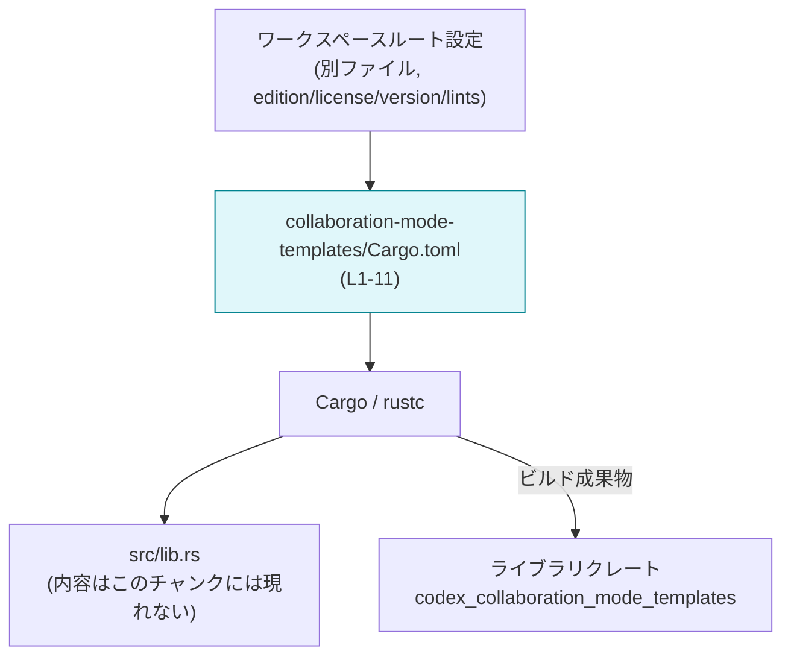
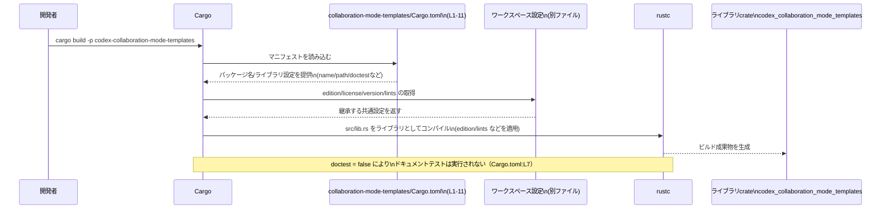

# collaboration-mode-templates/Cargo.toml コード解説

---

## 0. ざっくり一言

- Rust ワークスペース内のライブラリクレート `codex-collaboration-mode-templates` の Cargo マニフェストで、パッケージ名・ライブラリターゲット・lints の継承を定義しているファイルです（Cargo.toml:L1-11）。
- edition / license / version / lints はワークスペース共通設定を継承し、`src/lib.rs` をエントリポイントとするライブラリクレートを生成するよう指定されています（Cargo.toml:L2-3,L5,L6-9,L10-11）。

---

## 1. このモジュールの役割

### 1.1 概要

- このファイルは、Rust のビルドツール Cargo が参照するマニフェストであり、`codex-collaboration-mode-templates` パッケージの基本情報とビルドターゲットを定義します（Cargo.toml:L1-9）。
- edition / license / version / lints などの共通メタデータはワークスペース側の設定を使うようにし、このファイルではパッケージ名・ライブラリ名・ソースパス・doctest の有無のみを個別に定義しています（Cargo.toml:L2-5,L6-10）。

### 1.2 アーキテクチャ内での位置づけ

このファイルは、ワークスペース全体の一部として、このライブラリクレートを Cargo / rustc に登録する役割を持ちます。実際の Rust コードは `src/lib.rs` に置かれており（Cargo.toml:L9）、ここで指定された情報に基づいてコンパイルされます。



- ワークスペース設定から edition / license / version / lints を継承しています（Cargo.toml:L2-3,L5,L10-11）。
- `Cargo.toml` は `src/lib.rs` をライブラリターゲットとして Cargo / rustc に渡します（Cargo.toml:L6-9）。
- `src/lib.rs` の中身や公開 API は、このチャンクには現れていません。

### 1.3 設計上のポイント

- **ワークスペース継承を活用**  
  `edition.workspace = true` / `license.workspace = true` / `version.workspace = true` / `[lints] workspace = true` とすることで、共通設定をワークスペースに集約する設計になっています（Cargo.toml:L2-3,L5,L10-11）。
- **ライブラリ専用クレート**  
  `[lib]` セクションのみが定義されており、バイナリターゲット（`[[bin]]`）はありません。つまり、このパッケージはライブラリクレートとして利用される前提になっています（Cargo.toml:L6-9）。
- **パッケージ名とクレート名を分離**  
  パッケージ名はハイフン区切り（`codex-collaboration-mode-templates`）、クレート名はアンダースコア区切り（`codex_collaboration_mode_templates`）で明示的に指定されています（Cargo.toml:L4,L8）。
- **doctest を無効化**  
  `doctest = false` により、このクレートのドキュメントコメントに対する自動テストが走らないよう設定されています（Cargo.toml:L7）。
- **安全性 / エラー / 並行性**  
  これらは Rust コード側の設計に依存しますが、このファイルには Rust コードが存在しないため、どのように扱われているかは分かりません（このチャンクには現れません）。

---

## 2. 主要な機能一覧

このファイル自体は実行ロジックを持ちませんが、ビルドや利用の観点での「機能」を列挙します。

- パッケージメタデータの定義: パッケージ名を `codex-collaboration-mode-templates` として登録します（Cargo.toml:L1,L4）。
- edition / license / version のワークスペース継承: これらの値をワークスペース共通設定から取得します（Cargo.toml:L2-3,L5）。
- ライブラリターゲットの定義: ライブラリ crate 名を `codex_collaboration_mode_templates` とし、エントリポイントを `src/lib.rs` に設定します（Cargo.toml:L6-9）。
- doctest の無効化: ドキュメントテストを実行しないように指定します（Cargo.toml:L7）。
- lints 設定のワークスペース継承: コンパイル時の lints ポリシーをワークスペース共通設定から継承します（Cargo.toml:L10-11）。

---

## 3. 公開 API と詳細解説

### 3.1 コンポーネント一覧（ビルドターゲット）

このファイルは Rust の型や関数を定義していないため、「コンポーネント」を Cargo が扱う単位（パッケージ・ライブラリターゲットなど）として整理します。

| 名前 | 種別 | 役割 / 用途 | 根拠 |
|------|------|-------------|------|
| `codex-collaboration-mode-templates` | パッケージ名 | Cargo コマンドや依存関係指定で用いられるパッケージ識別子です。 | Cargo.toml:L1,L4 |
| `codex_collaboration_mode_templates` | ライブラリ crate 名 | Rust コード内の `use` 文などで参照するライブラリ crate 名です。 | Cargo.toml:L6-8 |
| `src/lib.rs` | ライブラリソースファイル | ライブラリ crate のエントリポイントとなる Rust コードファイルです。中身はこのチャンクには現れません。 | Cargo.toml:L9 |
| ワークスペース共通設定 | edition / license / version / lints | このパッケージが継承する共通のメタデータ・lints 設定です。具体的な値はワークスペースルートの `Cargo.toml` で定義されていると考えられますが、このチャンクには現れません。 | Cargo.toml:L2-3,L5,L10-11 |

> 関数・構造体・列挙体などの Rust レベルのコンポーネントは、このファイルには登場しません（このチャンクには現れません）。

### 3.2 関数詳細

- このファイルは Cargo マニフェスト（TOML）であり、Rust の関数やメソッドは定義されていません。
- したがって、このチャンクからは公開 API（関数・メソッド・型）の詳細やコアロジックの内容は分かりません。これらは `src/lib.rs` などの Rust ソースに記述されているはずです（Cargo.toml:L9）。

### 3.3 その他の関数

- 該当なし（このファイルには Rust の関数定義が存在しません）。

---

## 4. データフロー

ここでは、「開発者がこのライブラリをビルドしたときに、Cargo がどのようにこのファイルを利用するか」という観点でデータフローを説明します。

### 4.1 ビルド時のデータフロー



要点:

- パッケージ名 `codex-collaboration-mode-templates` を指定してビルドすると（一般的には `cargo build -p ...`）、Cargo はまずこの `Cargo.toml` を読み込みます（Cargo.toml:L1,L4）。
- edition / license / version / lints はワークスペース共通設定から補完されるため、このファイル内には具体的な値が書かれていません（Cargo.toml:L2-3,L5,L10-11）。
- `[lib]` セクションに従い、`src/lib.rs` をライブラリ crate `codex_collaboration_mode_templates` として `rustc` に渡し、コンパイルが行われます（Cargo.toml:L6-9）。
- `doctest = false` により、ドキュメントコメントのテスト（doctest）はこのクレートでは実行されません（Cargo.toml:L7）。

---

## 5. 使い方（How to Use）

### 5.1 基本的な使用方法

#### 1) このクレート自体をビルド / テストする

開発者がワークスペース内でこのクレートをビルドする最小限の例です。コマンドは一般的なものであり、プロジェクト全体の構成はこのチャンクからは分かりません。

```bash
# パッケージ名を指定してビルドする例
cargo build -p codex-collaboration-mode-templates

# パッケージ名を指定してテストを実行する例
# doctest = false のため、ドキュメントテストは走らず、通常のテストのみが実行されます
cargo test -p codex-collaboration-mode-templates
```

- パッケージ名には `[package]` セクションで定義された `codex-collaboration-mode-templates` を使用します（Cargo.toml:L4）。
- `doctest = false` により、`cargo test` 実行時にも doctest は無効です（Cargo.toml:L7）。

#### 2) 他のクレートから依存として利用する（例）

以下は、このライブラリを同一リポジトリ内の別クレートからパス依存で利用する例です。`path` の値はプロジェクト構成に応じて変える必要があり、このリポジトリの実際のパス構成を示すものではありません。

```toml
# 別クレートの Cargo.toml の例（参考）
[dependencies]
codex-collaboration-mode-templates = { path = "../collaboration-mode-templates" }
```

Rust コード側からは、ライブラリ crate 名 `codex_collaboration_mode_templates` を使って `use` します（Cargo.toml:L8）。

```rust
// 例: ライブラリ crate を use する（具体的な API 名はこのチャンクには現れません）
use codex_collaboration_mode_templates::*; // 実際に存在するアイテムは src/lib.rs の定義に依存する
```

- ここで利用する crate 名は `[lib]` セクションの `name` に対応しています（Cargo.toml:L8）。
- 具体的な関数や型名は `src/lib.rs` に依存するため、このチャンクだけからは不明です（Cargo.toml:L9）。

### 5.2 よくある使用パターン

- **ワークスペース内の内部ライブラリとして利用**  
  他のワークスペースメンバー Crate が `path` 依存またはワークスペースメンバー依存としてこのライブラリを利用するパターンが想定されます。  
  どのクレートが依存しているかは、このチャンクには現れません。
- **外部公開ライブラリとして利用**  
  `[package]` にバージョンやライセンスが設定されていれば crates.io 等で外部公開することもできますが、具体的な値はワークスペース継承のため、このファイルからは分かりません（Cargo.toml:L2-3,L5）。

### 5.3 よくある間違い

#### 1) パッケージ名と crate 名の混同

```rust
// 間違い例: パッケージ名（ハイフン区切り）を use しようとしている
// use codex-collaboration-mode-templates::*; // コンパイルエラーになる

// 正しい例: crate 名（アンダースコア区切り）を use する
use codex_collaboration_mode_templates::*; // Cargo.toml の [lib].name に対応（Cargo.toml:L8）
```

- Cargo での依存指定・ビルドにはパッケージ名 `codex-collaboration-mode-templates` を用います（Cargo.toml:L4）。
- Rust コード内の `use` / `extern crate` には crate 名 `codex_collaboration_mode_templates` を用います（Cargo.toml:L8）。

#### 2) doctest が動くと思い込む

- `doctest = false` のため、`cargo test` 実行時でもドキュメントコメント中のコードブロックはテストされません（Cargo.toml:L7）。
- ドキュメント通りに動くことをテストしたい場合は、通常の単体テスト（`tests/` や `#[test]`）を用意する必要があります。この点は、テスト設計上の注意点となります。

### 5.4 使用上の注意点（まとめ）

- **前提条件**
  - このパッケージはワークスペースの一員として構成されているため、`edition.workspace = true` などが有効に機能するにはワークスペースルートに対応する設定が必要です（Cargo.toml:L2-3,L5,L10-11）。
- **テスト関連**
  - doctest が無効化されているため、ドキュメントコメントの整合性は別途テストやレビューで担保する必要があります（Cargo.toml:L7）。
- **安全性 / エラー / 並行性**
  - これらは Rust コード内の設計に依存し、このファイルからは何も判断できません（このチャンクには現れません）。
- **ビルドエラーのリスク**
  - `path = "src/lib.rs"` が変更されたりファイルが存在しない場合、ビルドエラーになります（Cargo.toml:L9）。
  - パッケージ名 / crate 名の変更は、他のクレートの依存指定や `use` パスにも影響します（Cargo.toml:L4,L8）。

---

## 6. 変更の仕方（How to Modify）

### 6.1 新しい機能を追加する場合（マニフェスト観点）

このファイル自体にはロジックはありませんが、新しい機能を Rust コード側に追加する際に関係しそうな変更ポイントをまとめます。

1. **Rust コード側に API を追加する**  
   - 実際の機能追加は `src/lib.rs` などで行います（Cargo.toml:L9）。
   - このファイルからは API のシグネチャやエラー型は分かりません。

2. **公開方法を変える場合（例: バイナリ追加）**
   - CLI などを追加したい場合は、この `Cargo.toml` に `[[bin]]` セクションを追加して新バイナリターゲットを定義します（このチャンクには bin セクションは存在しません）。
   - その場合、`path` や `name` を適切に設定する必要があります。

3. **lints ポリシーをパッケージ固有にしたい場合**
   - 現在は `[lints] workspace = true` によってワークスペース共通の lints を使っています（Cargo.toml:L10-11）。
   - パッケージ固有の lints を設定したい場合は、共通設定からの継承を解除し、ここで個別にルールを記述します。

### 6.2 既存の機能を変更する場合

変更が他箇所に与える影響を考慮するための観点です。

- **パッケージ名の変更（Cargo.toml:L4）**
  - `cargo build -p ...` などのコマンドや、他クレートの依存指定に影響します。
  - 依存元の `Cargo.toml` を含め、すべての参照箇所を確認する必要があります。
- **crate 名の変更（Cargo.toml:L8）**
  - Rust コード内の `use codex_collaboration_mode_templates::...` など、すべての `use` パスを修正する必要があります。
  - バイナリ側からリンクされている場合も、crate 名を前提としたコードがないか確認が必要です。
- **`path = "src/lib.rs"` の変更（Cargo.toml:L9）**
  - 実際のソースファイルの場所と一致していないとビルドエラーになります。
  - `src/lib.rs` で公開している API はこのチャンクには現れないため、どのファイルに何が移動するかは別途確認が必要です。
- **doctest 設定の変更（Cargo.toml:L7）**
  - `doctest = true` に変更すると、ドキュメントコメントのコードブロックがテストされるようになります。
  - 既存のドキュメントコメントが doctest として通るかどうかを確認し、必要に応じて修正する必要があります。
- **Bugs / Security 観点**
  - このファイル自体にランタイムの安全性・セキュリティ上のロジックはありません。
  - ただし、誤ったライセンス情報やバージョン指定は配布ポリシーや依存解決に影響し得るため、ワークスペース共通設定との整合性を確認する必要があります（Cargo.toml:L2-3,L5）。

---

## 7. 関連ファイル

この `Cargo.toml` と密接に関係すると考えられるファイル・設定を整理します。

| パス / 設定 | 役割 / 関係 | 根拠 |
|-------------|-------------|------|
| `src/lib.rs` | ライブラリ crate `codex_collaboration_mode_templates` のエントリポイントとなる Rust ソースファイルです。このファイルに公開 API やコアロジックが実装されていると考えられますが、内容はこのチャンクには現れません。 | Cargo.toml:L6-9 |
| ワークスペースルートの `Cargo.toml` | edition / license / version / lints の共通設定を保持し、`edition.workspace = true` などを通じてこのパッケージに値を提供します。具体的なパスや内容はこのチャンクには現れませんが、ワークスペース継承機能の仕様上存在が前提となります。 | Cargo.toml:L2-3,L5,L10-11 |
| 他のワークスペースメンバー Crate の `Cargo.toml` | このライブラリを依存として参照している可能性があります。どのクレートが依存しているか、どのように利用しているかは、このチャンクには現れません。 | 関連は推定レベル、具体的な記述はこのチャンクには現れない |

---

### このチャンクから分からない点のまとめ

- Rust コードレベルの型・関数・モジュール構成、公開 API やコアロジックの詳細（`src/lib.rs` の中身）は一切分かりません（Cargo.toml:L9）。
- 並行性モデル（同期 / 非同期の使い分けなど）、エラー設計（Result 型 / カスタムエラー型）、安全性に関する具体的な実装は、このファイルには現れません。
- テストコード（`tests/` や `src/lib.rs` 内の `#[test]`）の有無や内容、観測性（ログ / メトリクス）の実装状況も、このチャンクからは判断できません。

このファイルの役割は、あくまで「クレートの外形的な定義（ビルドターゲットと共通設定の継承）」に限定されている、という点が重要です。
