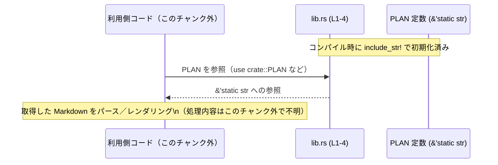

# collaboration-mode-templates/src/lib.rs

## 0. ざっくり一言

`../templates/*.md` にある Markdown テンプレートファイルを、`&'static str` の公開定数として提供するモジュールです（`lib.rs:L1-4`）。

---

## 1. このモジュールの役割

### 1.1 概要

- このモジュールは、**外部ファイルとして管理されている Markdown テンプレートを、コンパイル時にバイナリへ埋め込み、定数として公開する**ために存在します（`lib.rs:L1-4`）。
- Rust のマクロ `include_str!` を用いて、テンプレートファイルを `&'static str` として読み込みます（`lib.rs:L1-4`）。

### 1.2 アーキテクチャ内での位置づけ

このチャンクに登場する要素どうしの関係、および想定される利用側コードとの関係を簡略化して図示します。

```mermaid
graph TD
    App["利用側コード（このチャンク外）"]
    Lib["collaboration-mode-templates/src/lib.rs (L1-4)"]
    PLAN["pub const PLAN: &str\n= include_str!(\"../templates/plan.md\");\n(lib.rs:L1)"]
    DEFAULT["pub const DEFAULT: &str\n= include_str!(\"../templates/default.md\");\n(lib.rs:L2)"]
    EXECUTE["pub const EXECUTE: &str\n= include_str!(\"../templates/execute.md\");\n(lib.rs:L3)"]
    PAIR["pub const PAIR_PROGRAMMING: &str\n= include_str!(\"../templates/pair_programming.md\");\n(lib.rs:L4)"]
    Templates["../templates/*.md\n（ファイル本体はこのチャンク外）"]

    App -->|参照| PLAN
    App -->|参照| DEFAULT
    App -->|参照| EXECUTE
    App -->|参照| PAIR

    Lib --> PLAN
    Lib --> DEFAULT
    Lib --> EXECUTE
    Lib --> PAIR

    PLAN --> Templates
    DEFAULT --> Templates
    EXECUTE --> Templates
    PAIR --> Templates
```

> 注: 実際にこれらの定数を使用しているコードは、このチャンク内には存在せず不明です。

### 1.3 設計上のポイント

コードから読み取れる特徴は次のとおりです（`lib.rs:L1-4`）。

- **責務の分割**
  - テンプレートの内容そのものは `../templates/*.md` ファイルに分離し、Rust コード側は「定数として公開する」役割に限定されています。
- **状態管理**
  - ランタイム状態は保持せず、すべて `pub const &str` の **不変・静的な値**として提供します。
- **エラーハンドリング**
  - 実行時のエラー処理はありません。
  - 対応するテンプレートファイルが存在しない、または UTF-8 でない場合は、`include_str!` により **コンパイルエラー**となります（言語仕様に基づく挙動）。
- **並行性**
  - `&'static str` の読み取り専用データのみであり、どのスレッドからも安全に参照可能です（内部でミューテーションを行いません）。

---

## 2. 主要な機能一覧（コンポーネントインベントリー）

このファイルが提供する主要な公開要素の一覧です。

| 名称 | 種別 | 型 | 役割 / 用途 | 定義位置 |
|------|------|----|-------------|----------|
| `PLAN` | 公開定数 | `&'static str` | `../templates/plan.md` の内容を表すテンプレート文字列 | `lib.rs:L1` |
| `DEFAULT` | 公開定数 | `&'static str` | `../templates/default.md` の内容を表すテンプレート文字列 | `lib.rs:L2` |
| `EXECUTE` | 公開定数 | `&'static str` | `../templates/execute.md` の内容を表すテンプレート文字列 | `lib.rs:L3` |
| `PAIR_PROGRAMMING` | 公開定数 | `&'static str` | `../templates/pair_programming.md` の内容を表すテンプレート文字列 | `lib.rs:L4` |

> このファイルには構造体・列挙体・関数の定義は存在しません（`lib.rs:L1-4`）。

---

## 3. 公開 API と詳細解説

### 3.1 型一覧（構造体・列挙体など）

- このファイルには独自の構造体・列挙体・型エイリアスは定義されていません（`lib.rs:L1-4`）。
- すべての公開 API は **`&'static str` 型の公開定数**です。

### 3.2 関数詳細

- このファイルには関数定義がないため、この節で詳解する関数はありません（`lib.rs:L1-4`）。

### 3.3 公開定数の詳細

関数の代わりに、公開定数ごとの詳細をまとめます。

#### `PLAN: &'static str`

**概要**

- `../templates/plan.md` の内容を、UTF-8 の文字列として埋め込んだ定数です（`lib.rs:L1`）。

**型と意味**

- 型: `&'static str`
  - プログラムの実行期間全体で有効な文字列スライスです。
- 意味:
  - 「計画（plan）」に関するテンプレートを表すと推測されますが、実際の内容は `plan.md` 側にあり、このチャンクには現れません。

**内部処理**

- `include_str!("../templates/plan.md")` によって、コンパイル時にファイル内容がバイト列として埋め込まれます（`lib.rs:L1`）。
- 実行時のファイル読み込みや I/O はありません。

**Errors / Panics**

- 実行時のエラー・パニックは発生しません。
- 次のような場合、**コンパイル時エラー**になります（Rust の `include_str!` の仕様に基づきます）。
  - `../templates/plan.md` が存在しない。
  - ファイルが UTF-8 として解釈できない。

**Edge cases（エッジケース）**

- ファイルが空の場合:
  - 定数は空文字列 `""` になります（実行時エラーはありません）。
- 非常に大きなファイルの場合:
  - バイナリサイズが増大しますが、実行時の読み込みコストは一定です。
  - 具体的なサイズはこのチャンクからは分かりません。

**使用上の注意点**

- 定数の値は変更できず、再読み込みもできません。
- バイナリサイズに影響するため、極端に大きなテンプレートを埋め込む場合は、全体設計上の影響を確認する必要があります。

#### `DEFAULT: &'static str`

- `../templates/default.md` を埋め込んだ定数です（`lib.rs:L2`）。
- `PLAN` と同様に `include_str!` を用いてコンパイル時に埋め込まれます。
- エラー条件・エッジケース・注意点は `PLAN` と同様で、対象ファイルが `default.md` である点のみが異なります。

#### `EXECUTE: &'static str`

- `../templates/execute.md` を埋め込んだ定数です（`lib.rs:L3`）。
- それ以外の性質（型、安全性、エラー条件）は上記と同様です。

#### `PAIR_PROGRAMMING: &'static str`

- `../templates/pair_programming.md` を埋め込んだ定数です（`lib.rs:L4`）。
- それ以外の性質（型、安全性、エラー条件）は上記と同様です。

---

## 4. データフロー

このモジュール単体のデータフローは単純で、「コンパイル時にファイルを取り込み → 実行時は定数として参照される」という流れになります。

代表例として、利用側コードが `PLAN` テンプレートを取得して使う想定のフローを示します（利用側はこのチャンク外であり、あくまで典型例です）。



要点:

- **コンパイル時**
  - `include_str!` によってテンプレートファイルの内容がバイナリに埋め込まれます（`lib.rs:L1-4`）。
- **実行時**
  - 利用側コードは `PLAN` などの定数を参照し、即座に `&'static str` を取得します。
  - 実行時の I/O は発生しません。

---

## 5. 使い方（How to Use）

このファイルには利用側のコードは含まれていないため、以下は**一般的な使用例**です。実際にどのように使われているかは、このチャンクからは分かりません。

### 5.1 基本的な使用方法

テンプレート定数を取得し、標準出力にそのまま表示する例です。

```rust
// 他クレート／他モジュールから利用する場合の例
use collaboration_mode_templates::PLAN; // PLAN 定数をインポート（lib.rs:L1）

fn main() {
    // PLAN テンプレートの内容をそのまま表示する
    println!("{}", PLAN); // &'static str なので、そのまま &str として使用可能
}
```

このコードを実行すると、`../templates/plan.md` の内容が標準出力に表示されます（ファイルの実際の中身はこのチャンクには現れません）。

### 5.2 よくある使用パターン

#### パターン 1: モードに応じてテンプレートを選択する

複数のテンプレート定数から、条件に応じて使い分ける典型例です。

```rust
use collaboration_mode_templates::{PLAN, DEFAULT, EXECUTE, PAIR_PROGRAMMING};

// コラボレーションモードを表す単純な列挙体の例（実際の定義はこのチャンクにはありません）
enum Mode {
    Plan,
    Default,
    Execute,
    PairProgramming,
}

// モードに応じてテンプレートを返すヘルパー関数の例
fn template_for(mode: Mode) -> &'static str {
    match mode {
        Mode::Plan => PLAN,                 // plan.md に対応
        Mode::Default => DEFAULT,           // default.md に対応
        Mode::Execute => EXECUTE,           // execute.md に対応
        Mode::PairProgramming => PAIR_PROGRAMMING, // pair_programming.md に対応
    }
}
```

### 5.3 よくある間違い（想定）

このモジュールから推測される「起こり得る誤用例」と、その修正版です。

```rust
// 間違い例: 実行時にファイルを読み込めると思い込み、パスを変更しても再コンパイルしない
// 実際には include_str! はコンパイル時に内容を埋め込むため、
// バイナリを再ビルドしない限り変更は反映されない。

// 正しい扱い: テンプレートファイルを変更したら、必ずビルド／再起動が必要
// （開発フロー上の注意点であり、コード自体は次のように単純です）
use collaboration_mode_templates::DEFAULT;

fn print_default() {
    println!("{}", DEFAULT);
}
```

```rust
// 間違い例: 大きなテンプレートを毎回 String にコピーしてしまう
use collaboration_mode_templates::EXECUTE;

fn inefficient() {
    let s = EXECUTE.to_string(); // 毎回ヒープ確保が発生する
    println!("{}", s);
}

// より効率的な例: 参照 &str のまま利用する
fn efficient() {
    println!("{}", EXECUTE); // &'static str のまま使うので追加の割り当てが不要
}
```

### 5.4 使用上の注意点（まとめ）

- **再読み込みの不可**
  - `include_str!` で埋め込まれた定数は実行時にファイルから再読み込みできません。
  - テンプレートファイルを変更した場合は、バイナリの再ビルドが必要です。
- **バイナリサイズ**
  - テンプレート内容はすべてバイナリに含まれるため、大きなテンプレートはバイナリサイズを増やします。
- **スレッド安全性**
  - すべて `&'static str` の定数であり、読み取り専用なので、複数スレッドから同時に参照しても安全です。
- **セキュリティ**
  - このモジュールは単に文字列を提供するだけです。
  - XSS 等のリスクがあるかどうかは、テンプレートをどのように解釈・表示するか（HTML に埋め込むかなど）に依存し、このチャンクからは判断できません。

---

## 6. 変更の仕方（How to Modify）

### 6.1 新しいテンプレート定数を追加する場合

新しい Markdown テンプレートを追加したい場合の典型的な手順です。

1. `templates` ディレクトリに新しいファイル（例: `review.md`）を追加する。  
   - このファイルの内容はこのチャンクには現れません。
2. `src/lib.rs` に新しい公開定数を追加する。

   ```rust
   // 既存の定数にならって、新しい定数を追加する
   pub const REVIEW: &str = include_str!("../templates/review.md");
   ```

3. `include_str!` の引数パスは **`lib.rs` からの相対パス**であることに注意します。
4. ビルド時に、ファイルの存在・UTF-8 であることが検査されます。

### 6.2 既存のテンプレートを変更する場合

- **テンプレート内容のみを変更したい場合**
  - `../templates/*.md` の内容を書き換えるだけでよく、`lib.rs` を変更する必要はありません。
  - ただし、ビルド／再起動は必要です（実行時には再読み込みされないため）。
- **ファイル名・パスを変更したい場合**
  - 対応する `include_str!` のパスも合わせて修正する必要があります（`lib.rs:L1-4`）。
  - 誤ったパスにするとコンパイルエラーになります。
- **定数名を変更したい場合**
  - `lib.rs` に加えて、その定数を利用しているすべての箇所の修正が必要です。
  - 利用側コードはこのチャンクにないため、検索などで参照箇所を洗い出す必要があります。

---

## 7. 関連ファイル

このモジュールと直接関係するファイルは、`include_str!` で参照されているテンプレートファイルです。

| パス | 役割 / 関係 |
|------|------------|
| `templates/plan.md` | `PLAN` 定数の元となる Markdown テンプレート（内容はこのチャンクには現れません） |
| `templates/default.md` | `DEFAULT` 定数の元となるテンプレート |
| `templates/execute.md` | `EXECUTE` 定数の元となるテンプレート |
| `templates/pair_programming.md` | `PAIR_PROGRAMMING` 定数の元となるテンプレート |

> これらのファイルの具体的な中身や構造は、このチャンクには含まれていないため不明です。
