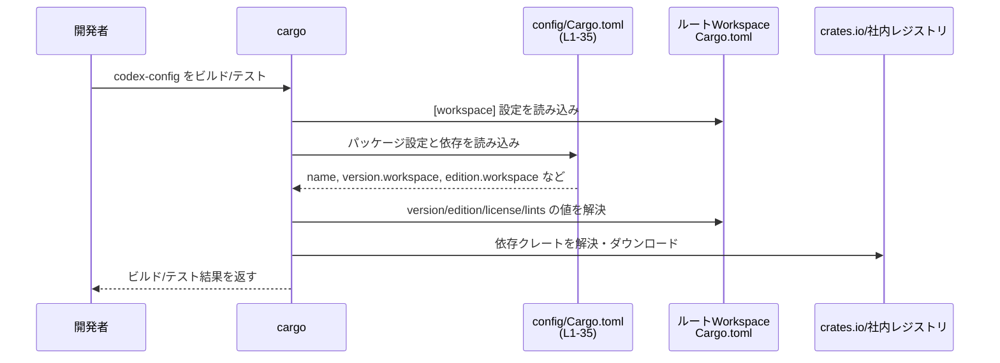

# config/Cargo.toml コード解説

## 0. ざっくり一言

`config/Cargo.toml` は、`codex-config` クレートの **パッケージメタデータと依存クレート一覧** を定義する Cargo マニフェストファイルです（`config/Cargo.toml:L1-35`）。

---

## 1. このモジュールの役割

### 1.1 概要

- このファイルは Rust クレート `codex-config` の
  - パッケージ名（`name`）  
  - バージョン・エディション・ライセンスのワークスペース継承  
  - 依存クレート・開発用依存クレート  
  を定義します（`config/Cargo.toml:L1-5,L8-35`）。
- 実際の公開 API やコアロジック（Rust ソースコード）はこのファイルには含まれていません。

### 1.2 アーキテクチャ内での位置づけ

- `codex-config` は、ワークスペース内の 1 つのクレートとして定義されています（`version.workspace = true` などより、ワークスペース前提であることが分かります `config/Cargo.toml:L3-4,L6-7`）。
- このクレートは、複数の **内部 codex 系クレート** と **外部クレート** に依存します（`config/Cargo.toml:L8-31`）。
- 依存関係の概要を Mermaid 図で示します。

```mermaid
graph TD
  A["codex-config クレート\n(Cargo.toml L1-35)"]

  %% 内部 codex 系クレート
  A --> C1["codex-app-server-protocol\n(L10)"]
  A --> C2["codex-execpolicy\n(L11)"]
  A --> C3["codex-features\n(L12)"]
  A --> C4["codex-git-utils\n(L13)"]
  A --> C5["codex-model-provider-info\n(L14)"]
  A --> C6["codex-network-proxy\n(L15)"]
  A --> C7["codex-protocol\n(L16)"]
  A --> C8["codex-utils-absolute-path\n(L17)"]

  %% 代表的な外部クレート（安全性/エラー/並行性に関係しうるもの）
  A --> E1["anyhow\n(L9)"]
  A --> E2["thiserror\n(L26)"]
  A --> E3["tokio (fs)\n(L27)"]
  A --> E4["futures (alloc,std)\n(L19)"]
  A --> E5["serde/serde_json\n(L22-23)"]
  A --> E6["tracing\n(L30)"]
  A --> E7["sha2\n(L25)"]
```



> 図は `config/Cargo.toml:L1-31` に基づく依存関係のみを示しています。  
> 依存クレート内部のモジュール構成や、実際の呼び出し関係はこのチャンクには現れません。

### 1.3 設計上のポイント

コードから読み取れる（Cargo の仕様として確定している）範囲での設計上の特徴は次のとおりです。

- **ワークスペース集中管理**
  - `version.workspace = true`、`edition.workspace = true`、`license.workspace = true` により、バージョン・エディション・ライセンスをワークスペース共通設定から継承しています（`config/Cargo.toml:L3-5`）。
  - `lints.workspace = true` により、Lint 設定もワークスペース側で一元管理されています（`config/Cargo.toml:L6-7`）。
- **エラー処理のための依存関係**
  - `anyhow`（汎用エラーラッパ）（`config/Cargo.toml:L9`）と  
    `thiserror`（エラー型実装支援）（`config/Cargo.toml:L26`）が依存に含まれています。
  - これにより、codex-config 内では「独自エラー型 + anyhow による集約」といった構成が可能ですが、実際にどう使われているかはこのチャンクからは分かりません。
- **非同期・並行処理を前提にした依存**
  - `tokio`（非同期ランタイム）に `fs` 機能のみを有効化した依存（`config/Cargo.toml:L27`）と、
  - `futures`（Future/ストリームユーティリティ）に `alloc`・`std` 機能を有効化した依存（`config/Cargo.toml:L19`）が設定されています。
  - これにより、非同期 I/O（特にファイル操作）や Future ベースの並行処理が行われる可能性がありますが、具体的な使用箇所はこのチャンクには現れません。
- **設定・シリアライズ関連**
  - `serde`（`derive` 機能付き）、`serde_json`、`toml`、`toml_edit`、`schemars` などが依存に含まれています（`config/Cargo.toml:L21-23,L28-29`）。
  - 設定ファイルを JSON/TOML で読み書きし、スキーマ生成まで行う構成が取りうることが分かります。
- **開発用依存**
  - `pretty_assertions`、`tempfile`、`tokio`（`full` 機能）などの dev-dependencies があり（`config/Cargo.toml:L32-35`）、テストや開発時にはより広い tokio 機能が使われる構成です。

---

## 2. 主要な機能一覧

このファイル自体は実行ロジックを持たず、「機能」は Cargo へのメタデータ提供という形になります。`config/Cargo.toml:L1-35` から読み取れる範囲での役割は次のとおりです。

- パッケージメタデータ定義  
  - クレート名 `codex-config` の定義（`config/Cargo.toml:L2`）。  
  - 版数・エディション・ライセンスをワークスペースから継承（`config/Cargo.toml:L3-5`）。
- Lint 設定のワークスペース継承  
  - `[lints]` セクションで `workspace = true`（`config/Cargo.toml:L6-7`）。
- 実行時依存クレートの宣言  
  - 設定・シリアライズ、エラー処理、非同期処理、パス処理、ロギングなどのための依存を列挙（`config/Cargo.toml:L8-31`）。
- 開発・テスト用依存クレートの宣言  
  - テスト用アサーション、テンポラリファイル、テストでの tokio 利用（`config/Cargo.toml:L32-35`）。

### 2.1 コンポーネントインベントリー（依存クレート）

`[dependencies]` / `[dev-dependencies]` に列挙されているコンポーネント（クレート）の一覧です。

| クレート名 | 種別 | 想定される役割 / 用途 | 定義位置 |
|-----------|------|----------------------|----------|
| `anyhow` | 実行時依存（外部） | ライブラリ/アプリ全体で使える汎用エラー型（`anyhow::Error`）を提供するクレート。エラーの集約と伝播に利用されることが多い。実際の利用箇所はこのチャンクには現れません。 | `config/Cargo.toml:L9-9` |
| `codex-app-server-protocol` | 実行時依存（内部 codex） | 同一ワークスペース内の別クレート。名称からはアプリケーションサーバとのプロトコル定義を扱う可能性がありますが、コードがないため詳細不明です。 | `config/Cargo.toml:L10-10` |
| `codex-execpolicy` | 実行時依存（内部 codex） | 実行ポリシーに関する処理を行うと推測されますが、このチャンクからは不明です。 | `config/Cargo.toml:L11-11` |
| `codex-features` | 実行時依存（内部 codex） | 機能フラグ管理などに関係すると推測されますが、詳細は不明です。 | `config/Cargo.toml:L12-12` |
| `codex-git-utils` | 実行時依存（内部 codex） | Git 操作のユーティリティである可能性がありますが、このチャンクからは不明です。 | `config/Cargo.toml:L13-13` |
| `codex-model-provider-info` | 実行時依存（内部 codex） | モデルプロバイダ情報に関する機能が想定されますが、詳細は不明です。 | `config/Cargo.toml:L14-14` |
| `codex-network-proxy` | 実行時依存（内部 codex） | ネットワークプロキシ機能に関連すると推測されますが、コードはこのチャンクにありません。 | `config/Cargo.toml:L15-15` |
| `codex-protocol` | 実行時依存（内部 codex） | プロトコル定義関連と推測されますが詳細不明です。 | `config/Cargo.toml:L16-16` |
| `codex-utils-absolute-path` | 実行時依存（内部 codex） | 絶対パス処理ユーティリティと推測されますが、実装は不明です。 | `config/Cargo.toml:L17-17` |
| `dunce` | 実行時依存（外部） | Windows のパス正規化などを行うパス処理ユーティリティクレート。パスの正規化で使われる可能性があります。 | `config/Cargo.toml:L18-18` |
| `futures`（`features = ["alloc", "std"]`） | 実行時依存（外部） | Future/Stream を扱うためのユーティリティクレート。`alloc`/`std` 機能が有効化されており、ヒープ確保や標準ライブラリと組み合わせた非同期処理が可能です。 | `config/Cargo.toml:L19-19` |
| `multimap` | 実行時依存（外部） | 1 つのキーに複数の値をマップできるデータ構造を提供するクレート。設定項目に複数値が紐づく場面で利用しうるが、実際の使われ方は不明です。 | `config/Cargo.toml:L20-20` |
| `schemars` | 実行時依存（外部） | `serde` 対応型から JSON Schema を生成するクレート。設定スキーマの生成などに利用可能ですが、このチャンクから用途は分かりません。 | `config/Cargo.toml:L21-21` |
| `serde`（`features = ["derive"]`） | 実行時依存（外部） | シリアライズ/デシリアライズ用クレート。`derive` 機能により、構造体/列挙体への `#[derive(Serialize, Deserialize)]` が可能になります。 | `config/Cargo.toml:L22-22` |
| `serde_json` | 実行時依存（外部） | JSON 形式とのシリアライズ/デシリアライズを提供。設定やメタ情報を JSON で扱う可能性があります。 | `config/Cargo.toml:L23-23` |
| `serde_path_to_error` | 実行時依存（外部） | Serde デシリアライズ時に「どのフィールドでエラーが起きたか」というパス情報付きエラーを提供するクレート。設定ファイルパース時のエラー報告を詳細化する用途が考えられますが、実際の利用は不明です。 | `config/Cargo.toml:L24-24` |
| `sha2` | 実行時依存（外部） | SHA-2 系暗号ハッシュ関数の実装を提供するクレート。設定やファイル内容のハッシュ計算などに使い得ますが、用途はこのチャンクには現れません。 | `config/Cargo.toml:L25-25` |
| `thiserror` | 実行時依存（外部） | カスタムエラー型実装を簡略化するための属性マクロを提供。`anyhow` との併用が多いです。 | `config/Cargo.toml:L26-26` |
| `tokio`（`features = ["fs"]`） | 実行時依存（外部） | 非同期ランタイム `tokio` のうち、ファイルシステム関連 API（`fs` 機能）のみを利用する構成。非同期ファイル I/O が想定されます。 | `config/Cargo.toml:L27-27` |
| `toml` | 実行時依存（外部） | TOML 形式とのシリアライズ/デシリアライズを提供。設定ファイルの読み書きに使われることが多いです。 | `config/Cargo.toml:L28-28` |
| `toml_edit` | 実行時依存（外部） | TOML ファイルを保持したまま編集するためのクレート。TOML 設定の部分変更や差分書き戻しを行う際に利用されうるが、このチャンクからは用途不明です。 | `config/Cargo.toml:L29-29` |
| `tracing` | 実行時依存（外部） | 構造化ロギング/トレースを提供するクレート。設定処理のログ出力に利用される可能性があります。 | `config/Cargo.toml:L30-30` |
| `wildmatch` | 実行時依存（外部） | シェル風ワイルドカードパターンマッチングを提供するクレート。パスや名前のフィルタリングに使われることがありますが、具体的用途は不明です。 | `config/Cargo.toml:L31-31` |
| `pretty_assertions` | dev-dependency（外部） | テストでの差分表示を見やすくするアサーションマクロを提供します。 | `config/Cargo.toml:L33-33` |
| `tempfile` | dev-dependency（外部） | 一時ファイル/ディレクトリを安全に作成するクレート。テストでの一時リソース管理に利用されることが多いです。 | `config/Cargo.toml:L34-34` |
| `tokio`（`features = ["full"]`） | dev-dependency（外部） | テスト時には tokio の `full` 機能を有効化し、ネットワーク・タイマーなども含めたフル機能の非同期テストが可能な構成です。 | `config/Cargo.toml:L35-35` |

> `codex-*` 系クレートの具体的な API や内部構造は、このチャンク（Cargo.toml）には現れないため不明です。

---

## 3. 公開 API と詳細解説

### 3.1 型一覧（構造体・列挙体など）

このファイルは **TOML マニフェスト** であり、Rust の型定義（構造体・列挙体など）は一切含まれていません。

| 名前 | 種別 | 役割 / 用途 | 定義位置 |
|------|------|-------------|----------|
| （なし） | ー | このファイルには Rust の型定義は存在しません。`codex-config` クレートが公開する型は、別の Rust ソースファイル（例: `src/lib.rs` 等）側に定義されているはずですが、このチャンクには現れません。 | `config/Cargo.toml:L1-35` |

### 3.2 関数詳細

- `config/Cargo.toml` には **関数やメソッドの定義は一切ありません**。
- したがって、「関数詳細テンプレート」を適用できる対象はこのチャンクには存在しません。
- `codex-config` クレートの公開 API（関数・メソッド・型メソッド）については、Rust ソースファイル（`src/*.rs` 等）を参照する必要がありますが、本タスクでは提供されていません。

### 3.3 その他の関数

- このチャンクには補助関数・ラッパー関数なども含め、**あらゆる関数定義が存在しません**（`config/Cargo.toml:L1-35` には TOML のキー・値のみが存在）。
- 関数インベントリー表の更新対象は「なし」となります。

---

## 4. データフロー

このファイルには実行時のロジックや関数呼び出しは含まれないため、**ランタイムのデータフロー** はこのチャンクからは分かりません。

ここでは代わりに、**ビルド時に Cargo がどのように `config/Cargo.toml` を利用するか** という観点で、メタデータの流れを示します。

### 4.1 ビルド時のマニフェスト利用フロー



- `version.workspace = true` などの指定により、Cargo はルートワークスペースの `Cargo.toml`（`[workspace.package]` 等）から値を取得します（`config/Cargo.toml:L3-4,L6-7`）。
- `[dependencies]` / `[dev-dependencies]` に列挙されたクレート名に基づき、cargo は crates.io や社内レジストリから依存クレートを解決し、コンパイルを行います（`config/Cargo.toml:L8-35`）。
- この図はビルド時のメタデータの流れを示すものであり、`codex-config` クレート内のランタイム処理・並行実行・エラー処理フローは、このチャンクからは不明です。

---

## 5. 使い方（How to Use）

### 5.1 基本的な使用方法

`config/Cargo.toml` 自体は Cargo によって自動的に読み込まれます。開発者が行う操作は主に:

- 依存クレートの追加・削除・機能フラグの変更
- ワークスペース設定との整合性の維持

などです。

他クレートから `codex-config` を使う場合の **一般的な** Cargo.toml 例（このリポジトリが実際にこの構成であるかは、このチャンクからは分かりません）:

```toml
[dependencies]
# 同一ワークスペース内の codex-config クレートを参照する一般的な例
codex-config = { path = "config" }  # 実際のパスはワークスペース構成によって異なります
```

このように設定された場合、Rust コード側では通常のクレートと同様に

```rust
// 使用例（仮）: 実際の API はこのチャンクからは不明
use codex_config; // 実際には公開されている型や関数名を指定する必要があります
```

のように利用しますが、**具体的な型や関数名は本チャンクには一切現れないため不明です**。

### 5.2 よくある使用パターン（Cargo レベル）

このファイルに見られる、Cargo レベルでの典型的なパターンは次のとおりです。

- **ワークスペース共通のバージョン・エディション指定**
  - `version.workspace = true` や `edition.workspace = true` を使い、各クレートでバージョンを重複記述しない（`config/Cargo.toml:L3-4`）。
- **ランタイムとテストで tokio 機能を分ける**
  - 実行時は `tokio` に `fs` 機能のみを有効化（`config/Cargo.toml:L27`）し、テストでは `full` 機能を dev-dependency で有効化する（`config/Cargo.toml:L35`）。
  - これにより、本番コード側で不要な tokio 機能を避けつつ、テストでは多機能な非同期環境を利用できる構成が可能です。

### 5.3 よくある間違い（Cargo 設定上）

一般的な Cargo 設定で起こりがちな誤りと、このファイルに関連しうるポイントを挙げます（あくまで一般論であり、このリポジトリで実際に起きているかはこのチャンクからは分かりません）。

```toml
# 間違い例: 同じクレートに対して依存と dev-dependency で矛盾した feature 指定
[dependencies]
tokio = { version = "1.0", features = ["fs"] }

[dev-dependencies]
tokio = { version = "1.0", features = ["rt-multi-thread"] }
```

```toml
# より望ましい一般的構成例: dev-dependency の方を superset にするか、features をまとめる
[dependencies]
tokio = { version = "1.0", features = ["fs"] }

[dev-dependencies]
tokio = { version = "1.0", features = ["fs", "rt-multi-thread", "macros", "test-util"] }
```

- Cargo の仕様上、**features はユニオン（和集合）** で解決されるため、本番コードとテストコードで異なる feature セットを想定すると動作が食い違うことがあります。
- このリポジトリでは、実行時は `fs` のみ、テスト時は `full` を指定しています（`config/Cargo.toml:L27,L35`）。この場合も最終的には `full` 相当の機能が有効になることに注意が必要です。

### 5.4 使用上の注意点（まとめ）

- **ワークスペース前提**
  - `version.workspace = true` 等を使うため、ルートワークスペースの `Cargo.toml` に対応する項目が存在しないとビルド時にエラーになります（`config/Cargo.toml:L3-5,L6-7`）。
- **tokio の feature 統合**
  - dependencies と dev-dependencies の両方で tokio を指定しているため（`config/Cargo.toml:L27,L35`）、実際には union された feature セットでコンパイルされる点に留意が必要です。
- **暗号・ネットワーク関連**
  - `sha2` や `codex-network-proxy` など、セキュリティやネットワークに関係しうるクレートに依存しています（`config/Cargo.toml:L15,L25`）。安全性の議論には、これらをどう使っているかをソースコード側で確認する必要があります。

---

## 6. 変更の仕方（How to Modify）

### 6.1 新しい機能を追加する場合（Cargo レベル）

`codex-config` クレート自体に新機能（設定フォーマット追加など）を実装する場合、Cargo レベルで想定される変更は次のとおりです。

1. **必要な依存クレートの追加**
   - 例: 新たなフォーマット `yaml` を扱いたい場合、`serde_yaml` などを `[dependencies]` に追加する、といった変更が考えられます。
   - 実際にどの依存が必要かは追加するコード次第であり、このチャンクからは具体的要求は分かりません。
2. **ワークスペース設定との整合性確認**
   - 新規クレート追加ではなく、既存クレートへの機能追加であれば、通常は `version.workspace` などはそのまま利用できます（`config/Cargo.toml:L3-4`）。
3. **テストで必要な dev-dependencies の追加**
   - テスト専用の補助クレートが必要であれば `[dev-dependencies]` に追加します（`config/Cargo.toml:L32-35` 参照）。

### 6.2 既存の機能（依存関係）を変更する場合

依存クレートの変更・削除に関する注意点です。

- **依存クレートの削除**
  - 例: `wildmatch` を削除する場合、`codex-config` 内のすべてのコードから `wildmatch` への参照を取り除く必要がありますが、それらのコードはこのチャンクには現れません。
- **feature の変更**
  - `tokio` の機能を変更する場合（例: 実行時にも `rt-multi-thread` を追加するなど）、
    - `[dependencies]` 側の feature を変更（`config/Cargo.toml:L27-27`）  
    - 必要であれば `[dev-dependencies]` 側も調整（`config/Cargo.toml:L35-35`）  
    する必要があります。
- **契約（Contracts）**
  - Cargo の仕様として、存在しない feature 名を指定するとビルドエラーになります。
  - `version.workspace = true` で参照する値がワークスペース定義に存在しない場合もエラーになります（この点は Cargo の仕様に基づく一般論です）。

---

## 7. 関連ファイル

このチャンクから直接パスが分かるファイルは `config/Cargo.toml` 自身のみですが、Cargo の仕様と `workspace = true` 指定から、関連が強いと考えられるファイル/設定を挙げます。

| パス / 設定 | 役割 / 関係 |
|------------|------------|
| ルートワークスペースの `Cargo.toml` | `version.workspace = true`、`edition.workspace = true`、`license.workspace = true`、`lints.workspace = true` の値を提供する必要があります（`config/Cargo.toml:L3-5,L6-7`）。通常はリポジトリルートに置かれた `Cargo.toml` が該当しますが、このチャンクから具体的な内容は分かりません。 |
| `config` ディレクトリ配下の Rust ソースファイル（例: `src/lib.rs`, `src/*.rs`） | `codex-config` クレートの公開 API・コアロジック・エラー処理・並行性の実装が存在すると推測されますが、このチャンクには現れません。実際のパス・構成は不明です。 |
| 他の `codex-*` クレートの Cargo.toml | `codex-app-server-protocol` など、内部クレート側のマニフェスト。`codex-config` とのビルド時依存関係の詳細やワークスペース設定を共有していると考えられますが、このチャンクからはファイルパスや内容は分かりません。 |

---

### 付記: 安全性・エラー・並行性に関するコメント（このチャンクから分かる範囲）

- **安全性（セキュリティ）**
  - `sha2` や `codex-network-proxy` など、セキュリティに影響を与えうるクレートに依存しています（`config/Cargo.toml:L15,L25`）。  
    実際の安全性評価には、これらのクレートの使われ方とバージョン（ワークスペース側で定義）を確認する必要があります。
- **エラー処理**
  - `anyhow` + `thiserror` + `serde_path_to_error` という構成から、「独自エラー型を定義しつつ、汎用エラーとして集約し、設定パース時に詳細なエラー位置を報告する」といった設計が可能です。ただし、**実際にそう実装されているかはこのチャンクからは分かりません**。
- **並行性**
  - `tokio`（実行時は `fs`、テスト時は `full`）と `futures` への依存から、非同期/並行処理が利用されていることが推測されますが、スレッドモデル（シングル/マルチスレッド）や具体的な Future チェーンなどは、コードがないため不明です。

このように、`config/Cargo.toml` は `codex-config` クレートの **ビルド時の顔** を定義するファイルであり、公開 API やコアロジックの詳細は、別途 Rust ソースコードを確認する必要があります。
