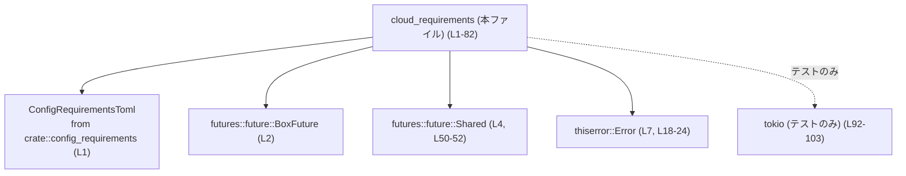
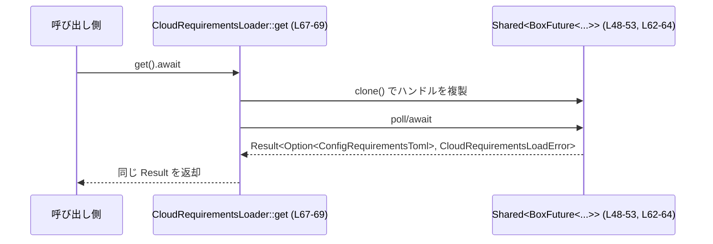
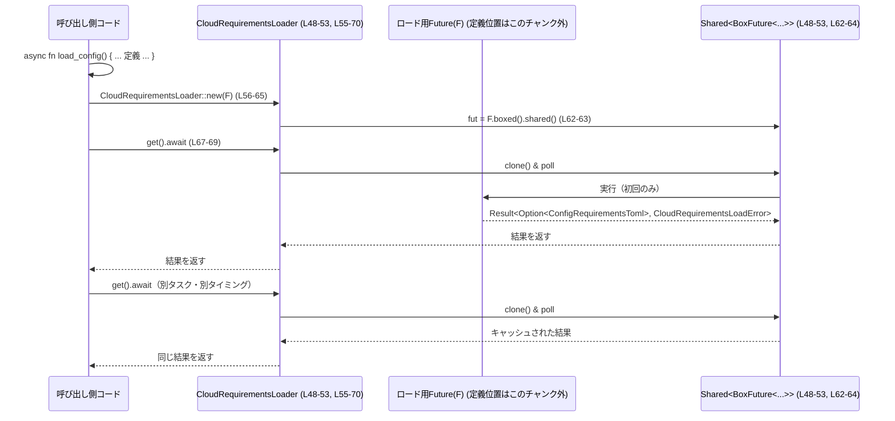

# config\src\cloud_requirements.rs

## 0. ざっくり一言

クラウド由来の設定（`ConfigRequirementsToml`）を **一度だけ非同期に読み込み、その結果を共有するローダー** と、読み込み失敗時のエラー型を定義するモジュールです（`cloud_requirements.rs:L9-82`）。

---

## 1. このモジュールの役割

### 1.1 概要

- このモジュールは、クラウド等から取得する設定情報（`ConfigRequirementsToml`）の **非同期ロードの結果をキャッシュして共有する仕組み** を提供します（`cloud_requirements.rs:L48-70`）。
- ロード失敗時には、種類を表すコード（`CloudRequirementsLoadErrorCode`）と詳細メッセージ、任意のステータスコードを持つ **エラー型** を返します（`cloud_requirements.rs:L9-24`）。
- 非同期処理には `futures` クレートの `Shared` な Future を利用し、**複数の呼び出しから並行に待ち受けても、実際のロード処理は 1 回だけ実行される** ようになっています（`cloud_requirements.rs:L48-53, L55-69, L93-103`）。

### 1.2 アーキテクチャ内での位置づけ

このモジュールは、アプリケーション内部の「クラウド要件設定」のロード処理のラッパーという位置づけです。ロード処理そのものは **呼び出し側が用意する Future** に委ねています。



- 実際のクラウドアクセスや設定取得処理は、このファイルには現れず、`CloudRequirementsLoader::new` に渡される Future の側に実装されます（`cloud_requirements.rs:L56-61`）。
- このファイルは、**結果の共有・エラー表現・API の形** を提供する薄い層になっています。

### 1.3 設計上のポイント

- **エラーの分類と詳細情報の分離**  
  - 列挙体 `CloudRequirementsLoadErrorCode` でエラー種別を定型化しつつ（`cloud_requirements.rs:L9-16`）、  
    任意メッセージとステータスコードを `CloudRequirementsLoadError` が保持します（`cloud_requirements.rs:L20-24`）。
- **一度だけ実行される非同期ロードの共有**  
  - `CloudRequirementsLoader` は `Shared<BoxFuture<...>>` を内部に持ち（`cloud_requirements.rs:L48-53`）、  
    `get` を何度呼び出しても、基底の Future は 1 回だけ実行される設計です（`cloud_requirements.rs:L67-69, L93-103`）。
- **所有権・スレッド安全性の配慮**  
  - `CloudRequirementsLoader::new` は `Future + Send + 'static` を要求し（`cloud_requirements.rs:L56-60`）、  
    非同期処理をスレッド間で安全に扱えるようにしています。
- **クラッシュしない API 設計**  
  - すべての公開メソッドは `Result` や `Option` を返し、`unwrap` や `expect` による強制的な panic は行っていません（`cloud_requirements.rs:L26-46, L55-70`）。

---

## 2. 主要な機能一覧

- クラウド設定ロードエラーの表現:
  - `CloudRequirementsLoadErrorCode`: エラー種別を表す列挙（認証・タイムアウトなど）（`cloud_requirements.rs:L9-16`）
  - `CloudRequirementsLoadError`: エラーコード・メッセージ・ステータスコードを保持するエラー型（`cloud_requirements.rs:L20-24`）
- 非同期ロードの共有ローダー:
  - `CloudRequirementsLoader`: `ConfigRequirementsToml` を返す非同期処理を一度だけ実行し、その結果を共有するラッパー（`cloud_requirements.rs:L48-53, L55-70`）
  - `CloudRequirementsLoader::new`: 任意の Future を共有ローダーに包むコンストラクタ（`cloud_requirements.rs:L56-65`）
  - `CloudRequirementsLoader::get`: Future の結果（`Result<Option<ConfigRequirementsToml>, CloudRequirementsLoadError>`）を取得する非同期メソッド（`cloud_requirements.rs:L67-69`）

### 2.1 コンポーネントインベントリー（型）

| 名前 | 種別 | 公開 | 役割 / 用途 | 定義位置 |
|------|------|------|-------------|----------|
| `CloudRequirementsLoadErrorCode` | enum | `pub` | クラウド設定ロード時のエラー種別（認証エラー・タイムアウトなど）を表現する | `cloud_requirements.rs:L9-16` |
| `CloudRequirementsLoadError` | struct | `pub` | エラーコード・人間向けメッセージ・任意のステータスコードを保持するエラー型 | `cloud_requirements.rs:L20-24` |
| `CloudRequirementsLoader` | struct | `pub` | `ConfigRequirementsToml` を返す非同期 Future を共有して 1 度だけ実行するローダー | `cloud_requirements.rs:L48-53` |

### 2.2 コンポーネントインベントリー（関数・メソッド）

| 名前 | 属する型 / モジュール | 公開 | 役割 / 用途 | 定義位置 |
|------|----------------------|------|-------------|----------|
| `CloudRequirementsLoadError::new` | `CloudRequirementsLoadError` | `pub` | エラーコード・ステータスコード・メッセージからエラー値を構築する | `cloud_requirements.rs:L27-37` |
| `CloudRequirementsLoadError::code` | `CloudRequirementsLoadError` | `pub` | 保持しているエラーコードを返す | `cloud_requirements.rs:L39-41` |
| `CloudRequirementsLoadError::status_code` | `CloudRequirementsLoadError` | `pub` | 保持しているステータスコード（あれば）を返す | `cloud_requirements.rs:L43-45` |
| `CloudRequirementsLoader::new` | `CloudRequirementsLoader` | `pub` | 任意の Future を共有ローダーに包んで初期化する | `cloud_requirements.rs:L56-65` |
| `CloudRequirementsLoader::get` | `CloudRequirementsLoader` | `pub async` | 共有 Future の結果を取得する（実行は 1 回のみ） | `cloud_requirements.rs:L67-69` |
| `CloudRequirementsLoader::default` | `CloudRequirementsLoader` (`Default` impl) | `pub`（トレイト経由） | 常に `Ok(None)` を返すローダーを生成する | `cloud_requirements.rs:L78-81` |
| `fmt` | `impl fmt::Debug for CloudRequirementsLoader` | 非公開（トレイト実装） | デバッグ出力時に `CloudRequirementsLoader` として表示する | `cloud_requirements.rs:L72-75` |
| `shared_future_runs_once` | テストモジュール `tests` | 非公開 | 共有 Future が 1 度しか実行されないことを検証するテスト | `cloud_requirements.rs:L93-103` |

---

## 3. 公開 API と詳細解説

### 3.1 型一覧（構造体・列挙体など）

| 名前 | 種別 | 役割 / 用途 | 関連メソッド | 定義位置 |
|------|------|-------------|--------------|----------|
| `CloudRequirementsLoadErrorCode` | 列挙体 | ロードエラーの種別（認証・タイムアウト等）を表す | ― | `cloud_requirements.rs:L9-16` |
| `CloudRequirementsLoadError` | 構造体 | エラーコード・詳細メッセージ・ステータスコードを表すエラー型 | `new`, `code`, `status_code` | `cloud_requirements.rs:L20-24, L26-46` |
| `CloudRequirementsLoader` | 構造体 | 非同期 Future を共有し、`ConfigRequirementsToml` のロード結果をキャッシュするローダー | `new`, `get`, `default` | `cloud_requirements.rs:L48-53, L55-70, L78-81` |

---

### 3.2 関数詳細（7 件）

#### `CloudRequirementsLoadError::new(code: CloudRequirementsLoadErrorCode, status_code: Option<u16>, message: impl Into<String>) -> CloudRequirementsLoadError`

**概要**

- 指定したエラーコード・任意のステータスコード・メッセージから `CloudRequirementsLoadError` を構築します（`cloud_requirements.rs:L27-37`）。

**引数**

| 引数名 | 型 | 説明 |
|--------|----|------|
| `code` | `CloudRequirementsLoadErrorCode` | エラーの種類を表すコード（`Auth` や `Timeout` など）（`cloud_requirements.rs:L10-15`） |
| `status_code` | `Option<u16>` | 任意のステータスコード。`Some(値)` か `None`。用途はコードからは明示されていませんが、一般的には HTTP ステータスコード等に利用可能な表現です（`cloud_requirements.rs:L23`）。 |
| `message` | `impl Into<String>` | 人間向けのエラーメッセージ。`&str` や `String` などから変換されます（`cloud_requirements.rs:L30-35`）。 |

**戻り値**

- `CloudRequirementsLoadError`  
  指定された情報を内部に保持するエラー値です。

**内部処理の流れ**

1. `message.into()` によってメッセージを `String` に変換します（`cloud_requirements.rs:L34`）。
2. フィールド `code`, `message`, `status_code` にそれぞれ代入した `Self` を返します（`cloud_requirements.rs:L32-36`）。

**Examples（使用例）**

```rust
use crate::cloud_requirements::{CloudRequirementsLoadError, CloudRequirementsLoadErrorCode}; // エラー型をインポート

// 認証エラーを作成する例
let err = CloudRequirementsLoadError::new(               // エラーインスタンスを生成
    CloudRequirementsLoadErrorCode::Auth,                // 認証関連のエラーコードを指定
    Some(401),                                           // 例としてステータスコード 401 を指定
    "認証に失敗しました",                                   // 人間向けのエラーメッセージ
);

// Result で返す例
fn build_result() -> Result<(), CloudRequirementsLoadError> { // CloudRequirementsLoadError を返す関数
    Err(err)                                             // エラーとして返却
}
```

**Errors / Panics**

- このコンストラクタ自体はパニック要因や `Result` の `Err` を返す処理を持ちません。

**Edge cases（エッジケース）**

- `status_code` が `None` の場合  
  - ステータスコード無しのエラーとして保持されます。特別な処理はありません（`cloud_requirements.rs:L23, L35`）。
- `message` が空文字列の場合  
  - 空の `String` としてそのまま保持されます。特別な制約はありません。

**使用上の注意点**

- メッセージに外部からの入力をそのまま埋め込む場合、このモジュール内ではログ出力や表示を行っていないため、セキュリティ上の懸念は読み取れませんが、**実際に出力する側** でサニタイズやマスキングが必要になる場合があります（この点はこのチャンクからは分かりません）。

---

#### `CloudRequirementsLoadError::code(&self) -> CloudRequirementsLoadErrorCode`

**概要**

- エラーが保持しているコード（種別）を返します（`cloud_requirements.rs:L39-41`）。

**引数**

| 引数名 | 型 | 説明 |
|--------|----|------|
| `&self` | `&CloudRequirementsLoadError` | 取得対象のエラー値 |

**戻り値**

- `CloudRequirementsLoadErrorCode`  
  元のエラーが持つコードのコピーです（`CloudRequirementsLoadErrorCode` は `Copy` を実装しているため、コピーになり得ます（`cloud_requirements.rs:L9`））。

**内部処理の流れ**

1. 単に `self.code` を返すだけのゲッターです（`cloud_requirements.rs:L40`）。

**Examples（使用例）**

```rust
let err = CloudRequirementsLoadError::new(               // エラーを作成
    CloudRequirementsLoadErrorCode::Timeout,             // タイムアウトエラー
    None,                                                // ステータスコード無し
    "クラウド設定の取得がタイムアウトしました",                 // メッセージ
);

let code = err.code();                                   // コードのみ取り出す
assert_eq!(code, CloudRequirementsLoadErrorCode::Timeout); // 等価比較が可能（Eq/PartialEq）
```

**Errors / Panics**

- ゲッターのみであり、特にエラーやパニックは発生しません。

**Edge cases**

- どのバリアントであっても同一の挙動（フィールドを返すだけ）です。

**使用上の注意点**

- 比較・分岐に使うことで、「タイムアウト時だけリトライする」等のロジックを組み立てることが可能です。このモジュール内ではそのようなロジックは実装されていません。

---

#### `CloudRequirementsLoadError::status_code(&self) -> Option<u16>`

**概要**

- エラーが保持しているステータスコードを返します（`cloud_requirements.rs:L43-45`）。

**引数**

| 引数名 | 型 | 説明 |
|--------|----|------|
| `&self` | `&CloudRequirementsLoadError` | 取得対象のエラー値 |

**戻り値**

- `Option<u16>`  
  ステータスコードがある場合は `Some(値)`、ない場合は `None` です（`cloud_requirements.rs:L23, L44`）。

**内部処理の流れ**

1. 単に `self.status_code` を返すだけのゲッターです（`cloud_requirements.rs:L44`）。

**Examples（使用例）**

```rust
let err = CloudRequirementsLoadError::new(               // ステータスコード付きのエラー
    CloudRequirementsLoadErrorCode::RequestFailed,       // リクエスト失敗
    Some(500),                                           // 例として 500 を指定
    "クラウド設定の取得に失敗しました",                        // メッセージ
);

// ステータスコードに応じた分岐
match err.status_code() {                                // Option<u16> を取得
    Some(code) if code >= 500 => {
        // サーバ側エラーとして扱う、などの処理を記述できる
    }
    Some(_) => {
        // その他のコード
    }
    None => {
        // ステータスコード無しの場合の処理
    }
}
```

**Errors / Panics**

- ゲッターのみであり、エラー・パニックは発生しません。

**Edge cases**

- `status_code` が `None` の場合もそのまま `None` を返します。

**使用上の注意点**

- `u16` の意味（HTTP か独自コードか）はこのファイルからは判断できません。利用側で意味づけを決める必要があります。

---

#### `CloudRequirementsLoader::new<F>(fut: F) -> CloudRequirementsLoader`

**概要**

- 任意の `Future<Output = Result<Option<ConfigRequirementsToml>, CloudRequirementsLoadError>>` を受け取り、  
  その結果を共有する `CloudRequirementsLoader` を構築します（`cloud_requirements.rs:L56-65`）。

**引数**

| 引数名 | 型 | 説明 |
|--------|----|------|
| `fut` | `F` | `Future<Output = Result<Option<ConfigRequirementsToml>, CloudRequirementsLoadError>> + Send + 'static` を満たす任意の Future。クラウド設定の実際の読み込み処理を表す。 |

**戻り値**

- `CloudRequirementsLoader`  
  渡された Future を内部の `Shared<BoxFuture<...>>` に変換して保持するローダーです（`cloud_requirements.rs:L48-53, L62-64`）。

**内部処理の流れ**

1. `fut.boxed()` で `fut` を `BoxFuture<'static, Result<Option<ConfigRequirementsToml>, CloudRequirementsLoadError>>` に変換します（`cloud_requirements.rs:L51, L62-63`）。  
   - `BoxFuture` は `Pin<Box<dyn Future<Output = T> + Send>>` の型エイリアスであり、ヒープに確保された Future です。
2. `.shared()` を呼び出して、結果を共有可能な `Shared<BoxFuture<...>>` に変換します（`cloud_requirements.rs:L50-52, L63`）。  
   - `Shared` は複数回クローンされても、内部の Future は 1 度だけポーリングされることが `tests::shared_future_runs_once` で確認されています（`cloud_requirements.rs:L93-103`）。
3. 変換した `Shared` を `fut` フィールドに格納した `CloudRequirementsLoader` を返します（`cloud_requirements.rs:L48-53, L62-64`）。

**Examples（使用例）**

```rust
use crate::config_requirements::ConfigRequirementsToml;           // ロード対象の型
use crate::cloud_requirements::CloudRequirementsLoader;          // ローダー型
use crate::cloud_requirements::CloudRequirementsLoadError;       // エラー型

// 実際のクラウド設定読み込みロジックを async ブロックで定義
let loader = CloudRequirementsLoader::new(async {
    // ここでネットワークやクラウドから設定を取得する処理を行う想定
    // この例ではダミーとして default を返す
    let config = ConfigRequirementsToml::default();              // ダミーの設定値
    Ok(Some(config))                                             // 正常終了を表す Result
});

// 以降、loader.get().await で同じ結果を共有して取得できる
```

**Errors / Panics**

- `new` 自体は非同期処理を実行せず、単に Future をラップするだけなので、ここでエラーは発生しません。
- 型レベルでは `Future + Send + 'static` 制約を満たさない場合、コンパイルエラーとなります。

**Edge cases**

- 渡された Future が内部で panic した場合  
  - その挙動は `futures::future::Shared` とランタイム（`tokio` など）の仕様に依存し、このファイルからは詳細は分かりません。
- 渡された Future が非常に長時間ブロックする場合  
  - `CloudRequirementsLoader` 側にはタイムアウト機構はありません。必要であれば Future 側でタイムアウト処理を組み込む必要があります。

**使用上の注意点**

- **キャッシュの単位は `CloudRequirementsLoader` インスタンスごと** です。  
  毎回 `CloudRequirementsLoader::new` を呼ぶと毎回新しい Future が生成され、共有の効果がなくなります。
- 渡す Future は `Send + 'static` 制約を満たす必要があるため、非 `'static` な参照を直接キャプチャすることはできません。必要に応じて `Arc` などで所有権を共有します。
- Future の `Output` は `Clone` でなければ `shared()` を呼べないため、`ConfigRequirementsToml` が `Clone` を実装している必要がありますが、このファイル内からは定義を確認できません（`cloud_requirements.rs:L51` の型からそのように推測されます）。

---

#### `CloudRequirementsLoader::get(&self) -> Result<Option<ConfigRequirementsToml>, CloudRequirementsLoadError>`

**概要**

- `CloudRequirementsLoader` に格納されている共有 Future を `await` し、  
  **クラウド設定のロード結果** を取得する非同期メソッドです（`cloud_requirements.rs:L67-69`）。

**引数**

| 引数名 | 型 | 説明 |
|--------|----|------|
| `&self` | `&CloudRequirementsLoader` | ローダーインスタンスへの参照。クローン可能であり、複数タスクから同一インスタンスを共有できます（`cloud_requirements.rs:L48, L55-65`）。 |

**戻り値**

- `Result<Option<ConfigRequirementsToml>, CloudRequirementsLoadError>`  
  - `Ok(Some(config))` : 設定取得に成功し、値が存在する場合  
  - `Ok(None)` : 設定が未定義など、値が存在しない場合  
  - `Err(e)` : ロード処理中にエラーが発生した場合

**内部処理の流れ**

1. `self.fut.clone()` によって共有 Future をクローンします（`cloud_requirements.rs:L67`）。  
   - `Shared` に対するクローンは、内部の Future を新たに生成するのではなく、**同一の計算結果を共有するハンドル** を複製します。
2. `await` して計算結果を待機し、そのまま呼び出し元に返します（`cloud_requirements.rs:L68`）。



**Examples（使用例）**

```rust
// 事前に CloudRequirementsLoader::new(...) などで loader を構築しておく必要がある
async fn use_loader(loader: CloudRequirementsLoader) 
    -> Result<Option<ConfigRequirementsToml>, CloudRequirementsLoadError> 
{
    let config_opt = loader.get().await?;               // 非同期に結果を待つ
    // config_opt が Some の場合は設定あり、None の場合は設定無し
    Ok(config_opt)                                      // そのまま呼び出し元に返却
}

// 複数タスクから共有する例（tokio を想定）
async fn use_loader_concurrently(loader: CloudRequirementsLoader) {
    let loader1 = loader.clone();                       // 同じローダーをクローン
    let loader2 = loader.clone();                       // もう一つクローン

    let (r1, r2) = tokio::join!(                        // 2 つの get を並行に実行
        loader1.get(),
        loader2.get(),
    );

    assert_eq!(r1, r2);                                 // 両者の結果は同じ
}
```

**Errors / Panics**

- `Err(CloudRequirementsLoadError)`  
  - 渡された Future がエラーとして `CloudRequirementsLoadError` を返した場合、そのまま伝播します。
- `get` 自体は `panic!` を呼んでいません。Future 内での panic はこの関数の責務外です。

**Edge cases**

- すでに Future の計算が完了している場合  
  - `Shared` は計算結果をキャッシュしているため、**即座にクローンされた結果** が返ります。
- まだ開始されていない場合  
  - 最初に `get()` を呼んだタスクが Future の実行を開始し、他のタスクも同じ結果を共有します。  
    `tests::shared_future_runs_once` が、この「実行は 1 回だけ」という性質を確認しています（`cloud_requirements.rs:L93-103`）。

**使用上の注意点**

- `get` は `async fn` なので、必ず `.await` する必要があります。同期コードから直接呼び出すことはできません。
- `CloudRequirementsLoader` は各インスタンスごとに 1 回だけ Future を実行する設計のため、**設定を更新したい場合は新たな `CloudRequirementsLoader` を構築する必要** があります。

---

#### `CloudRequirementsLoader::default() -> CloudRequirementsLoader`

（`impl Default for CloudRequirementsLoader` 内のメソッド。`cloud_requirements.rs:L78-81`）

**概要**

- 常に `Ok(None)` を返す簡易ローダーを生成します。  
  つまり「クラウド要件設定は存在しない（または未使用）」という前提のローダーです（`cloud_requirements.rs:L80`）。

**引数**

- なし。

**戻り値**

- `CloudRequirementsLoader`  
  内部では `async { Ok(None) }` という Future を `new` に渡して構築しています（`cloud_requirements.rs:L80`）。

**内部処理の流れ**

1. `async { Ok(None) }` という Future を作成します（`cloud_requirements.rs:L80`）。
2. それを `CloudRequirementsLoader::new` に渡してローダーを構築し、そのまま返します（`cloud_requirements.rs:L79-81`）。

**Examples（使用例）**

```rust
use crate::cloud_requirements::CloudRequirementsLoader; // ローダーをインポート

async fn example() {
    let loader = CloudRequirementsLoader::default();    // 常に Ok(None) を返すローダー
    let result = loader.get().await;                    // 非同期に取得

    assert!(matches!(result, Ok(None)));                // 結果は必ず Ok(None)
}
```

**Errors / Panics**

- 内部 Future が常に `Ok(None)` を返すため、`Err` が返ることはありません。
- panic を起こすコードも含まれていません。

**Edge cases**

- 特にありません。常に同じ結果を返します。

**使用上の注意点**

- 実際にクラウド設定を利用しない環境（ローカル開発など）でのデフォルト値として利用するのに向いています。
- 本番環境などでクラウド設定が必須である場合、このローダーを利用すると **設定が読み込まれない状態でもエラーにならない** ため、適切なローダーを構築して差し替える必要があります。

---

#### テスト `shared_future_runs_once()`

（テストモジュール `tests` 内の非公開関数。`cloud_requirements.rs:L93-103`）

**概要**

- `CloudRequirementsLoader::get` を 2 つのタスクから同時に呼び出しても、  
  内部の Future が 1 回だけ実行されることを検証するテストです（`cloud_requirements.rs:L93-103`）。

**引数 / 戻り値**

- 引数なし、戻り値なしの `#[tokio::test] async fn` です（`cloud_requirements.rs:L92-93`）。

**内部処理の流れ**

1. `AtomicUsize` でカウンタを初期化し、`Arc` で共有します（`cloud_requirements.rs:L94-95`）。
2. `CloudRequirementsLoader::new(async move { ... })` で、Future の中でカウンタをインクリメントするローダーを構築します（`cloud_requirements.rs:L96-98`）。
3. `tokio::join!(loader.get(), loader.get())` で 2 つの `get` を並行に実行します（`cloud_requirements.rs:L101`）。
4. 返ってきた 2 つの結果が等しいことを `assert_eq!` で確認します（`cloud_requirements.rs:L102`）。
5. カウンタが 1 であることを確認し、Future が 1 度しか実行されていないことを検証します（`cloud_requirements.rs:L103`）。

**Examples（性質を理解するための抜粋）**

```rust
let counter = Arc::new(AtomicUsize::new(0));             // 実行回数カウンタ
let counter_clone = Arc::clone(&counter);                // Future 内から使うためにクローン

let loader = CloudRequirementsLoader::new(async move {
    counter_clone.fetch_add(1, Ordering::SeqCst);        // Future が実行されるたびに +1
    Ok(Some(ConfigRequirementsToml::default()))          // 適当な成功値
});

let (first, second) = tokio::join!(loader.get(), loader.get()); // 2 回同時に実行
assert_eq!(first, second);                              // 結果は等しい
assert_eq!(counter.load(Ordering::SeqCst), 1);          // 実行回数は 1 回のみ
```

**使用上の注意点**

- このテストにより、「同一 `CloudRequirementsLoader` インスタンスからの `get()` 呼び出しは、内部 Future の単一実行結果を共有する」という契約が暗黙的に文書化されています。

---

### 3.3 その他の関数

| 関数名 | 役割（1 行） | 定義位置 |
|--------|--------------|----------|
| `fmt(&self, f: &mut fmt::Formatter<'_>) -> fmt::Result` | `CloudRequirementsLoader` の `Debug` 出力で `"CloudRequirementsLoader"` という構造体名のみを表示する | `cloud_requirements.rs:L72-75` |

---

## 4. データフロー

### 4.1 代表的な処理シナリオ

典型的なフローは以下の通りです。

1. 利用側で「クラウド設定を読み込む」Future を定義する（ネットワークアクセスなどはこの Future 内に実装される想定です）。
2. その Future を渡して `CloudRequirementsLoader::new` でローダーを構築する（`cloud_requirements.rs:L56-65`）。
3. 複数の箇所から `loader.get().await` を呼び出すと、内部 Future は 1 回だけ実行され、その結果が共有される（`cloud_requirements.rs:L67-69, L93-103`）。



- 注意点として、このモジュールでは Future の中身（クラウドからどのように設定を取得するか）は一切定義されておらず、完全に呼び出し側に委ねられています。

---

## 5. 使い方（How to Use）

### 5.1 基本的な使用方法

クラウド設定を 1 回だけ読み込み、以降は結果を共有して利用する想定の例です。

```rust
use crate::config_requirements::ConfigRequirementsToml;  // 設定値の型
use crate::cloud_requirements::{                         // このモジュールの型をインポート
    CloudRequirementsLoader,
    CloudRequirementsLoadError,
};

// クラウド設定を取得するためのローダーを作成する関数
fn build_loader() -> CloudRequirementsLoader {
    CloudRequirementsLoader::new(async {
        // ここで実際のクラウドアクセスや I/O を行う想定
        // 例として、仮の設定値を返す
        let config = ConfigRequirementsToml::default();  // ダミーの設定
        Ok(Some(config))                                 // 正常終了として Result を返す
    })
}

// ローダーを使って設定を取得する非同期関数
async fn use_config() -> Result<Option<ConfigRequirementsToml>, CloudRequirementsLoadError> {
    let loader = build_loader();                         // ローダーを構築
    let config_opt = loader.get().await?;                // 非同期に結果を取得

    // config_opt が Some の場合は設定あり、None の場合は設定無し
    Ok(config_opt)                                       // 呼び出し元にそのまま返す
}
```

### 5.2 よくある使用パターン

1. **ローダーを共有して複数タスクから利用**

```rust
async fn use_in_multiple_tasks(loader: CloudRequirementsLoader) {
    let l1 = loader.clone();                             // Clone して別タスク用のハンドルを作成
    let l2 = loader.clone();                             // さらにもう一つ

    let (r1, r2) = tokio::join!(                         // 2 つのタスクを並行実行
        async move { l1.get().await },                   // 1 つ目のタスク
        async move { l2.get().await },                   // 2 つ目のタスク
    );

    assert_eq!(r1, r2);                                  // 結果は共有される
}
```

- テスト `shared_future_runs_once` と同様、内部 Future は 1 回だけ実行されます（`cloud_requirements.rs:L93-103`）。

1. **クラウド設定を使わない環境でのデフォルトローダー**

```rust
async fn use_default_loader() {
    let loader = CloudRequirementsLoader::default();     // 常に Ok(None) を返すローダー
    let result = loader.get().await;                     // 非同期に取得

    assert!(matches!(result, Ok(None)));                 // 設定無しとして扱う
}
```

### 5.3 よくある間違い

#### 1. 毎回 `CloudRequirementsLoader::new` を呼んでしまう

```rust
// 間違い例: キャッシュされず、毎回 Future が実行される
async fn wrong_usage() {
    let result1 = CloudRequirementsLoader::new(async {
        Ok(Some(ConfigRequirementsToml::default()))
    }).get().await;

    let result2 = CloudRequirementsLoader::new(async {
        Ok(Some(ConfigRequirementsToml::default()))
    }).get().await;

    // それぞれ別の Future が実行されているため、
    // ネットワークアクセスなどが重複する可能性がある
}

// 正しい例: 一つのローダーを共有して利用する
async fn correct_usage() {
    let loader = CloudRequirementsLoader::new(async {
        Ok(Some(ConfigRequirementsToml::default()))
    });

    let (r1, r2) = tokio::join!(loader.get(), loader.get()); // 同じローダーから取得
    assert_eq!(r1, r2);                                      // 結果は共有される
}
```

#### 2. 非 `'static` な参照を Future にキャプチャする

- `CloudRequirementsLoader::new` は `F: 'static` を要求するため（`cloud_requirements.rs:L60`）、  
  以下のようなコードはコンパイルエラーになります。

```rust
async fn wrong_capture() {
    let local = String::from("temp");
    let loader = CloudRequirementsLoader::new(async {
        // &local をキャプチャしようとすると 'static 制約に反する
        // &local を使うコードはコンパイルエラーになる
        Ok(None)
    });
    let _ = loader.get().await;
}
```

- この場合は `Arc<String>` などを使って所有権を共有する必要があります。

### 5.4 使用上の注意点（まとめ）

- `CloudRequirementsLoader` は **インスタンスごとに 1 回だけ Future を実行する** 設計です。  
  設定を再取得したい場合は、新しいローダーを構築する必要があります。
- `CloudRequirementsLoader::new` に渡す Future には、必要に応じて **タイムアウトやリトライなどのロジックを組み込む** べきです。このモジュール自体はそれらを提供しません。
- `CloudRequirementsLoadError` には任意のメッセージを設定できますが、実際にログや UI に表示する部分で、個人情報や機密情報が含まれないよう配慮する必要があります（このモジュール内では出力を行っていません）。

---

## 6. 変更の仕方（How to Modify）

### 6.1 新しい機能を追加する場合

1. **エラー種別を追加したい場合**
   - `CloudRequirementsLoadErrorCode` に新しいバリアントを追加します（`cloud_requirements.rs:L10-15`）。
   - 必要に応じて、呼び出し側の Future 内で新バリアントを使うようにします。
   - `CloudRequirementsLoadError` 側はフィールドを追加しない限り、そのまま利用可能です（`cloud_requirements.rs:L20-24`）。

2. **ロード結果に付加情報を持たせたい場合**
   - `ConfigRequirementsToml` の定義を変更・拡張します（パスはこのチャンクには現れないため不明ですが、モジュール名は `crate::config_requirements` です（`cloud_requirements.rs:L1`））。
   - `CloudRequirementsLoader` の型シグネチャを変えずに済む場合は、このファイルの変更は不要です。

3. **便利メソッドを追加したい場合**
   - 例: `CloudRequirementsLoader::blocking_get()` のような同期 API を追加したい場合、  
     このファイルに新しいメソッドを追加し、内部で `get().await` をブロックするランタイムを利用する実装が考えられますが、  
     ブロッキングは設計ポリシーに依存するため、このチャンクだけでは推奨可否は判断できません。

### 6.2 既存の機能を変更する場合

- **`CloudRequirementsLoadError` のフィールドを変更する**
  - フィールドを追加する場合、`#[derive(Clone, Debug, Eq, Error, PartialEq)]` により自動導出される実装への影響を確認する必要があります（`cloud_requirements.rs:L18-24`）。
  - 追加フィールドが `Eq` や `Clone` を実装していない場合、コンパイルエラーになります。

- **`CloudRequirementsLoader` の内部表現を変更する**
  - 現在は `Shared<BoxFuture<...>>` に依存しています（`cloud_requirements.rs:L48-53`）。  
    別のキャッシュ方式に変える場合でも、`get` の契約（1 回だけ実行し、結果を共有する）を守る必要があります（`cloud_requirements.rs:L67-69, L93-103`）。
  - テスト `shared_future_runs_once` を合わせて更新し、この契約が維持されていることを確認する必要があります（`cloud_requirements.rs:L93-103`）。

- **エラーの比較ロジックを変えたい場合**
  - 現在は `CloudRequirementsLoadError` に `Eq, PartialEq` が自動実装されており、`message` や `status_code` も比較対象です（`cloud_requirements.rs:L18-24`）。
  - 比較をコードのみに限定したい場合などは、自動導出をやめて手動実装する必要があります。

---

## 7. 関連ファイル

| パス / モジュール | 役割 / 関係 |
|-------------------|------------|
| `crate::config_requirements::ConfigRequirementsToml` | クラウド設定の実体を表す型。`CloudRequirementsLoader` のロード対象となる（`cloud_requirements.rs:L1, L51`）。物理ファイルパスはこのチャンクには現れません。 |
| `futures::future`（外部クレート） | `BoxFuture` および `Shared` を提供し、非同期処理とその共有を支える（`cloud_requirements.rs:L2-4, L50-52`）。 |
| `thiserror::Error`（外部クレート） | `CloudRequirementsLoadError` のエラー実装を簡易に提供するために使用（`cloud_requirements.rs:L7, L18-24`）。 |
| `tokio`（テストのみ） | `#[tokio::test]` マクロおよび `tokio::join!` を通じて、共有 Future の性質を非同期テストするために利用（`cloud_requirements.rs:L92, L101`）。 |
| `pretty_assertions`（テストのみ） | `assert_eq!` の出力を見やすくするためのテスト用依存（`cloud_requirements.rs:L87`）。 |

---

### 不具合・セキュリティ上の観点（まとめ）

- このファイル内には、明示的な `unsafe` ブロックや I/O、グローバル状態の操作は存在しません（`cloud_requirements.rs` 全体）。
- 非同期処理やキャッシュの挙動は `futures::future::Shared` に依存しており、その実装の正当性はこのチャンクからは検証できません。
- エラーメッセージ文字列は任意の内容を保持できますが、このモジュール内ではログ出力やフォーマット加工を行っていないため、  
  セキュリティ上の懸念は **このファイル内だけからは読み取れません**。実際の利用箇所での扱いが重要になります。
