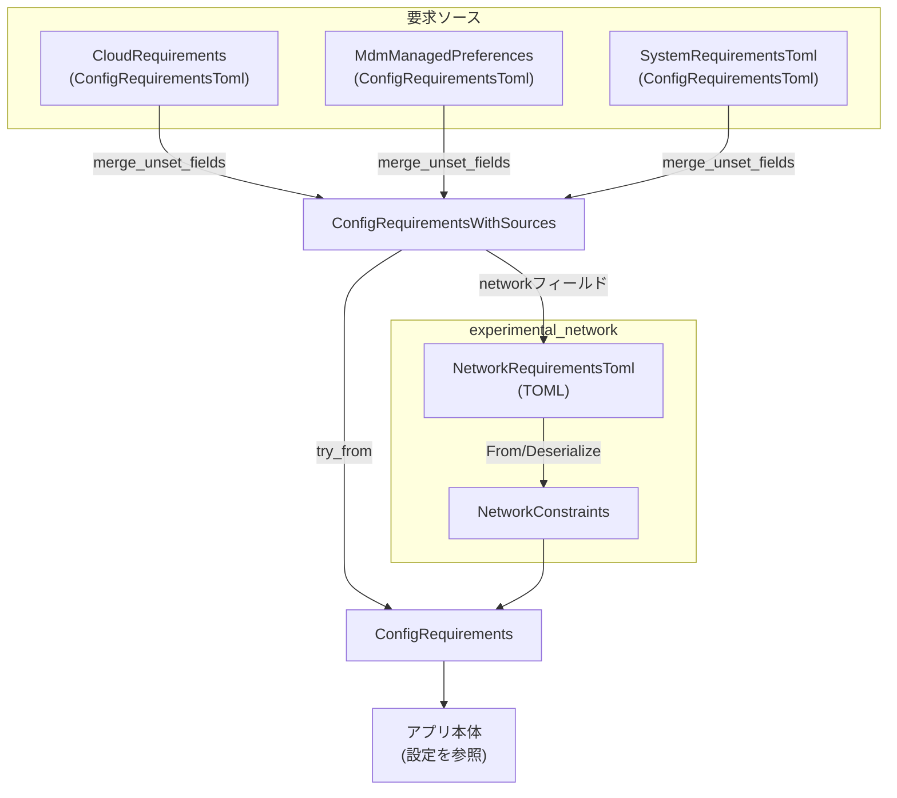
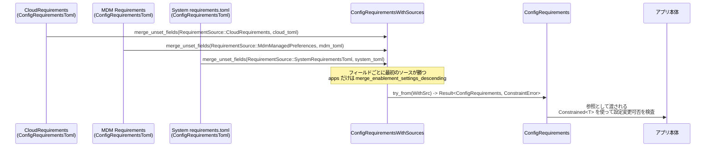
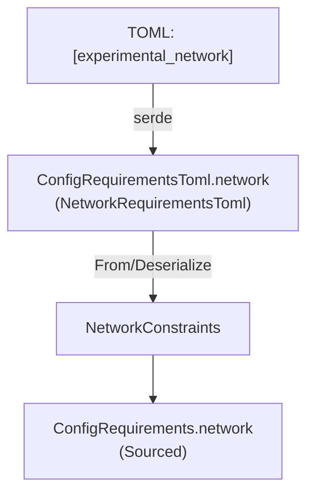

config/src/config_requirements.rs

---

## 0. ざっくり一言

- MDM / クラウド / ローカル `requirements.toml` など複数ソースからの「制約付き設定」を集約し、型安全に検証・正規化した上で `ConfigRequirements` として提供するモジュールです（特にサンドボックス、Web検索、ネットワーク、アプリ有効・無効など）。  
 （根拠: `ConfigRequirements`, `ConfigRequirementsToml`, `ConfigRequirementsWithSources`, `TryFrom` 実装など。config_requirements.rs:L?-?）

---

## 1. このモジュールの役割

### 1.1 概要

このモジュールは次の問題を解決するために存在し、以下の機能を提供します。

- **問題**  
  - 設定が MDM・クラウド・システムファイルなど複数のソースから来る  
  - 設定値は「許可された値の集合」を持ち、その集合から外れる変更は拒否したい  
  - TOML 形式のスキーマが世代によって異なり（レガシー / 新形式）、後方互換性を維持する必要がある  
- **機能**  
  - 複数ソースからの設定 (`ConfigRequirementsToml`) を `ConfigRequirementsWithSources` にマージし、値と「どこから来たか(RequirementSource)」を保持（config_requirements.rs:L?-?）  
  - 許可リストに基づく制約付き値 (`Constrained<T>`) を組み立て、実行時に `can_set` で検証できる `ConfigRequirements` を生成（`impl TryFrom<ConfigRequirementsWithSources> for ConfigRequirements`。config_requirements.rs:L?-?）  
  - `experimental_network` セクションを新旧両方の形から正規化し、`NetworkConstraints` として利用しやすい形に変換（config_requirements.rs:L?-?）  
  - アプリ単位の `enabled` フラグを、複数ソースを考慮してマージ（`merge_enablement_settings_descending`。config_requirements.rs:L?-?）

### 1.2 アーキテクチャ内での位置づけ

主な依存関係とデータの流れを示します（チャンク全体: config_requirements.rs:L?-?）。



- 外部クレートとの主な接点:
  - `codex_protocol::config_types::*`: `AskForApproval`, `ApprovalsReviewer`, `SandboxMode`, `WebSearchMode`（構成要素の列挙値）  
  - `codex_protocol::protocol::*`: `SandboxPolicy`, `AskForApproval`, `NetworkAccess`（動作ポリシー）  
  - `RequirementsExecPolicy`, `RequirementsExecPolicyToml`（実行ポリシー）  
  - `Constrained<T>`, `ConstraintError`（制約付き設定の汎用コンテナとエラー）

### 1.3 設計上のポイント

- **値 + ソースの追跡**
  - `ConstrainedWithSource<T>` と `Sourced<T>` により、「現在の値」と「どの要求ソースから来たか」を一緒に保持し、エラーメッセージにソースを含められるようにしています（config_requirements.rs:L?-?）。
- **制約付き値 (Constrained<T>)**
  - `Constrained::new` / `Constrained::allow_any*` を使い、許される値の集合をクロージャで定義しています。  
    `can_set` での検証時に `ConstraintError::InvalidValue` を返す設計です（挙動はテストから読み取れます。config_requirements.rs:L?-?）。
- **多段ソースのマージ**
  - `ConfigRequirementsWithSources::merge_unset_fields` で、「まだ埋まっていないフィールドだけを下位ソースからコピー」する戦略を採用（apps だけは特別にマージ）（config_requirements.rs:L?-?）。
- **レガシー互換のネットワーク設定**
  - `NetworkRequirementsToml::deserialize` で、新形式 (`domains` / `unix_sockets`) と旧形式 (`allowed_domains` / `denied_domains` / `allow_unix_sockets`) を排他的に扱い、旧形式から新形式構造へのロスのある変換を行います（config_requirements.rs:L?-?）。
- **明示的な空値扱い**
  - 空文字列の `guardian_policy_config` や、空のレガシー `allowed_domains` などは「未設定」と同等に扱う設計です（config_requirements.rs:L?-?）。
- **並行性**
  - このモジュール自体はグローバルな可変状態やスレッド同期を持たず、純粋なデータ変換と検証に限定されています。  
    `ConfigRequirements` 等が `Send` / `Sync` かどうかは依存型に依存するため、コードからは断定できません。

---

## 2. 主要な機能一覧（＋コンポーネントインベントリー）

### 2.1 提供機能の概要

- 許可リスト付きの承認ポリシー・レビュアー・サンドボックスモード・Web検索モードの構成
- アプリごとの `enabled` 設定を、複数ソース間で衝突ルール付きでマージ
- `experimental_network` セクションの新旧形式（ドメイン / UNIX ソケット）を統合し、`NetworkConstraints` に正規化
- 実行ポリシー (`RequirementsExecPolicy`) TOML のパースとエラーラップ
- 各値がどの設定ソース（MDM / クラウド / システム etc.）から来たかの追跡

### 2.2 コンポーネント一覧

主要な構造体・列挙体・関数のインベントリーです（テスト用は後述）。

| 名前 | 種別 | 公開範囲 | 役割 / 用途 |
|------|------|----------|-------------|
| `RequirementSource` | enum | `pub` | 設定値がどのソースから来たかを表す（MDM, Cloud, 系統 TOML など）。Display 実装あり（config_requirements.rs:L?-?）。 |
| `ConstrainedWithSource<T>` | struct | `pub` | `Constrained<T>` にオリジン (`Option<RequirementSource>`) を付加したラッパー。Deref/DerefMut 実装で `Constrained<T>` として扱える（L?-?）。 |
| `ConfigRequirements` | struct | `pub` | すべての要求を正規化した最終形。アプリ側が参照するメイン設定コンテナ（承認 / レビューア / サンドボックス / Web検索 / ネットワークなど）（L?-?）。 |
| `McpServerIdentity` | enum | `pub` | MCP サーバーの識別（`command` か `url`）。`#[serde(untagged)]` で TOML からデシリアライズ（L?-?）。 |
| `McpServerRequirement` | struct | `pub` | MCP サーバー 1 件の要求（`identity` のみを持つ）（L?-?）。 |
| `NetworkDomainPermissionsToml` | struct | `pub` | ドメインパターンごとの `allow/deny` マップ（TOML 表現）。allowed/denied の projection メソッドあり（L?-?）。 |
| `NetworkDomainPermissionToml` | enum | `pub` | ドメインに対する `Allow` / `Deny`（文字列表現 `"allow"` / `"deny"`）（L?-?）。 |
| `NetworkUnixSocketPermissionsToml` | struct | `pub` | UNIX ソケットパスごとの `Allow` / `None` マップ（TOML 表現）（L?-?）。 |
| `NetworkUnixSocketPermissionToml` | enum | `pub` | UNIX ソケットに対する `Allow` / `None`（L?-?）。 |
| `NetworkRequirementsToml` | struct | `pub` | `experimental_network` セクションの TOML 表現（新旧形式をサポートするため、カスタム Deserialize 実装あり）（L?-?）。 |
| `NetworkConstraints` | struct | `pub` | 実際にアプリから参照されるネットワーク制約の正規化形（L?-?）。 |
| `WebSearchModeRequirement` | enum | `pub` | TOML 上の Web 検索モード（Disabled/Cached/Live）。`WebSearchMode` との相互変換と Display 実装あり（L?-?）。 |
| `FeatureRequirementsToml` | struct | `pub` | 任意キー→bool の feature フラグ群（TOML）。`is_empty` あり（L?-?）。 |
| `AppRequirementToml` | struct | `pub` | アプリ 1 件の `enabled` フラグ（TOML）（L?-?）。 |
| `AppsRequirementsToml` | struct | `pub` | アプリ ID → `AppRequirementToml` のマップ。`is_empty` あり（L?-?）。 |
| `merge_enablement_settings_descending` | fn | `pub(crate)` | アプリ `enabled` 設定を高優先度→低優先度でマージするコアロジック（L?-?）。 |
| `ConfigRequirementsToml` | struct | `pub` | 生の要求を表す TOML 表現。allowed\_*、apps、rules、network 等を含む（L?-?）。 |
| `Sourced<T>` | struct | `pub` | 値 `T` と、その値の `RequirementSource` をペアにした汎用コンテナ（L?-?）。 |
| `ConfigRequirementsWithSources` | struct | `pub` | 各フィールドを `Sourced<T>` でラップした、中間表現。マージ処理に使用（L?-?）。 |
| `SandboxModeRequirement` | enum | `pub` | TOML 上でのサンドボックスモード（`read-only` 等）。`SandboxMode` からの変換あり（L?-?）。 |
| `ResidencyRequirement` | enum | `pub` | 現在は `Us` のみ。データレジデンシー要件（L?-?）。 |

---

## 3. 公開 API と詳細解説

### 3.1 型一覧（主要な公開型）

| 名前 | 種別 | 主要フィールド / バリアント | 役割 |
|------|------|----------------------------|------|
| `RequirementSource` | enum | `Unknown`, `MdmManagedPreferences{domain,key}`, `CloudRequirements`, `SystemRequirementsToml{file}`, `LegacyManagedConfigTomlFromFile{file}`, `LegacyManagedConfigTomlFromMdm` | 設定値の由来を表現し、エラーメッセージに含めるために使用（Display 実装あり）。 |
| `ConstrainedWithSource<T>` | struct | `value: Constrained<T>`, `source: Option<RequirementSource>` | 設定値 `T` に対する制約と、その制約を課しているソースの情報。Deref により `Constrained<T>` と同様に扱える。 |
| `ConfigRequirements` | struct | `approval_policy`, `approvals_reviewer`, `sandbox_policy`, `web_search_mode`, `feature_requirements`, `mcp_servers`, `exec_policy`, `enforce_residency`, `network` | アプリが最終的に参照する制約付き設定。`Default` 実装で緩いデフォルトを提供。 |
| `NetworkRequirementsToml` | struct | `enabled`, `http_port`, `socks_port`, `allow_upstream_proxy`, `dangerously_allow_non_loopback_proxy`, `dangerously_allow_all_unix_sockets`, `domains`, `managed_allowed_domains_only`, `danger_full_access_denylist_only`, `unix_sockets`, `allow_local_binding` | `experimental_network` の TOML 表現。カスタム `Deserialize` でレガシー互換。 |
| `NetworkConstraints` | struct | `enabled`, `http_port`, `socks_port`, `allow_upstream_proxy`, `dangerously_allow_non_loopback_proxy`, `dangerously_allow_all_unix_sockets`, `domains`, `managed_allowed_domains_only`, `danger_full_access_denylist_only`, `unix_sockets`, `allow_local_binding` | 実行時に利用するネットワーク制約。`From<NetworkRequirementsToml>` により生成。 |
| `ConfigRequirementsToml` | struct | `allowed_approval_policies`, `allowed_approvals_reviewers`, `allowed_sandbox_modes`, `allowed_web_search_modes`, `feature_requirements`, `mcp_servers`, `apps`, `rules`, `enforce_residency`, `network`, `guardian_policy_config` | システム/クラウド/MDM から読み取る TOML 要求。 |
| `ConfigRequirementsWithSources` | struct | 同上フィールドを `Option<Sourced<...>>` で保持 | ソース別に `ConfigRequirementsToml` をマージするための中間表現。 |
| `WebSearchModeRequirement` / `SandboxModeRequirement` | enum | TOML 上でのモード列挙値 | 実行時の `WebSearchMode` / `SandboxMode` への橋渡し。 |
| `FeatureRequirementsToml` | struct | `entries: BTreeMap<String,bool>` | 機能ごとの enable/disable 設定。 |

### 3.2 関数詳細（重要な 7 件）

#### 1. `ConfigRequirementsWithSources::merge_unset_fields(&mut self, source: RequirementSource, other: ConfigRequirementsToml)`

**概要**

- 指定された `ConfigRequirementsToml` を、`self` がまだ `None` のフィールドにだけコピーしていくマージ関数です。  
- `apps` だけは特別扱いで、存在する場合は `merge_enablement_settings_descending` により統合します。  
- 各値は `Sourced<T>` として保存され、`source` が付与されます。（config_requirements.rs:L?-?）

**引数**

| 引数名 | 型 | 説明 |
|--------|----|------|
| `self` | `&mut ConfigRequirementsWithSources` | マージ先。 `None` のフィールドにだけ値が入る。 |
| `source` | `RequirementSource` | `other` の設定がどこから来たか（MDM / Cloud / System など）。 |
| `other` | `ConfigRequirementsToml` | 新しく取り込む TOML 設定。消費（move）される。 |

**戻り値**

- なし（`()`）。`self` がインプレースに更新されます。

**内部処理の流れ**

1. ローカルマクロ `fill_missing_take!` を定義し、指定されたフィールドのマージ処理を共通化（config_requirements.rs:L?-?）。  
   - `if $base.$field.is_none() && let Some(value) = $other.$field.take() { ... }` の形で、「ベースが None で、incoming に値があるときだけ取り込む」。
2. `ConfigRequirementsToml` をフィールドごとに束縛し、`..` を使わずにパターンマッチすることで、新フィールド追加時にコンパイルエラーで気づけるようにしている（メンテナンス性のため）（L?-?）。
3. `guardian_policy_config` が空白のみの場合は `None` に正規化（`trim().is_empty()` チェック）（L?-?）。
4. `fill_missing_take!` を使って、以下のフィールドを `self` にコピー（L?-?）。
   - `allowed_approval_policies`, `allowed_approvals_reviewers`, `allowed_sandbox_modes`, `allowed_web_search_modes`, `feature_requirements`, `mcp_servers`, `rules`, `enforce_residency`, `network`, `guardian_policy_config`
   - コピー時に `Sourced::new(value, source.clone())` でソース情報を付加。
5. `apps` フィールドは別扱い（L?-?）。
   - `other.apps.take()` が `Some(incoming_apps)` の場合:
     - `self.apps` が `Some(existing_apps)` なら `merge_enablement_settings_descending(&mut existing_apps.value, incoming_apps)` を呼んで統合。`existing_apps.source` は保持。
     - `self.apps` が `None` なら `self.apps = Some(Sourced::new(incoming_apps, source))` としてそのまま採用。

**Examples（使用例）**

複数ソース（Cloud → MDM）のマージ例です（テスト `merge_unset_fields_merges_apps_across_sources_with_enabled_evaluation` を簡略化。config_requirements.rs:L?-?）。

```rust
use crate::config_requirements::{
    ConfigRequirementsToml, ConfigRequirementsWithSources,
    RequirementSource, apps_requirements, // apps_requirements はテスト内 helper 相当
};

// 初期状態は空
let mut merged = ConfigRequirementsWithSources::default(); // すべて None

// 高優先度: Cloud
merged.merge_unset_fields(
    RequirementSource::CloudRequirements,
    ConfigRequirementsToml {
        apps: Some(apps_requirements(&[
            ("connector_high", Some(true)),   // 高優先度で true
            ("connector_shared", Some(true)), // 共有
        ])),
        ..Default::default()
    },
);

// 低優先度: Legacy MDM
merged.merge_unset_fields(
    RequirementSource::LegacyManagedConfigTomlFromMdm,
    ConfigRequirementsToml {
        apps: Some(apps_requirements(&[
            ("connector_low", Some(false)),   // 低優先度のみ
            ("connector_shared", Some(false)),// 共有だが false
        ])),
        ..Default::default()
    },
);

// 結果: enabled = { high: true, low: false, shared: false }
let apps = merged.apps.expect("apps must exist");
// apps.source は CloudRequirements のまま
assert_eq!(apps.source, RequirementSource::CloudRequirements);
```

**Errors / Panics**

- 本関数自体は `Result` を返さず、パニックしうる箇所もありません。
- 入力 `ConfigRequirementsToml` は `serde` で構築済みであることが前提です。

**Edge cases（エッジケース）**

- `guardian_policy_config` が `"   \n\t"` などの空白文字のみの場合、`None` として扱われ、後続ソースの非空設定に上書きされます（テスト `merge_unset_fields_ignores_blank_guardian_override`。L?-?）。
- `apps` の高優先度ソースで空リスト `[]` の場合でも、低優先度ソースの disable 設定で上書き可能です（`merge_unset_fields_apps_empty_higher_source_does_not_block_lower_disables`。L?-?）。

**使用上の注意点**

- **マージ順序が重要**です。高優先度 → 低優先度の順に `merge_unset_fields` を呼び出す前提で設計されています。
- `apps` 以外のフィールドは「最初に埋めたソースが勝つ」ので、順序を誤ると意図しない制約源が残る可能性があります。

---

#### 2. `impl TryFrom<ConfigRequirementsWithSources> for ConfigRequirements`

```rust
fn try_from(toml: ConfigRequirementsWithSources) -> Result<ConfigRequirements, ConstraintError>
```

**概要**

- `ConfigRequirementsWithSources`（各フィールドが `Option<Sourced<...>>`）を、実際にアプリから参照される `ConfigRequirements` に変換します。（config_requirements.rs:L?-?）  
- 許可リストに基づいて `Constrained<T>` を構築し、不正な設定には `ConstraintError` を返します。  
- ネットワーク・実行ポリシーなどもここで正規化されます。

**引数**

| 引数名 | 型 | 説明 |
|--------|----|------|
| `toml` | `ConfigRequirementsWithSources` | マージ済みの要求。各フィールドに値 + ソースが入っている可能性がある。消費される。 |

**戻り値**

- `Ok(ConfigRequirements)`  
  - 各フィールドが適切な `ConstrainedWithSource` / `Option<Sourced<...>>` に変換された最終設定。
- `Err(ConstraintError)`  
  - 許可リストの不整合や実行ポリシーのパース失敗など。

**内部処理の流れ（主な部分）**

1. 各フィールド（approval, reviewer, sandbox, web_search, feature, mcp, apps, rules, enforce_residency, network, guardian_policy_config）を分解（L?-?）。
2. **承認ポリシー `approval_policy`**（L?-?）
   - `allowed_approval_policies` が `Some(Sourced { value: policies, source })` の場合:
     - `policies.first().copied()` を初期値とし、空なら `ConstraintError::empty_field("allowed_approval_policies")`。  
     - `Constrained::new(initial, move |candidate| { if policies.contains(candidate) { Ok(()) } else { Err(ConstraintError::InvalidValue { ... }) } })` で制約付き値を構築。
   - `None` の場合は `Constrained::allow_any_from_default()` による非制約値。
3. **承認レビュアー `approvals_reviewer`** も同様のパターン（空リストは `EmptyField`）。テスト `empty_allowed_approvals_reviewers_is_rejected` 参照（L?-?）。
4. **サンドボックス `sandbox_policy`**（L?-?）
   - デフォルトポリシーは `SandboxPolicy::new_read_only_policy()`。
   - `allowed_sandbox_modes` が `Some` の場合:
     - `ReadOnly` が含まれていなければ `ConstraintError::InvalidValue`（allowed_sandbox_modes 全体を candidate としてエラーに入れる）。
     - `Constrained::new(default_sandbox_policy, move |candidate| { ... })` で、`SandboxPolicy` からモードを抽出 (`ReadOnly` / `WorkspaceWrite` / `DangerFullAccess` / `ExternalSandbox`) し、許可されているかを検証。
   - `None` の場合は「任意の `SandboxPolicy` を許可」する `Constrained::allow_any(default_sandbox_policy)`。
5. **実行ポリシー `exec_policy`**（L?-?）
   - `rules` が `Some(Sourced { value, source })` なら `value.to_requirements_policy()` を呼び、失敗時は `ConstraintError::ExecPolicyParse { requirement_source: source, reason }`。
6. **Web 検索 `web_search_mode`**（L?-?）
   - `allowed_web_search_modes` が `Some(Sourced { value: modes, source })` の場合:
     - `BTreeSet` に詰め、必ず `Disabled` を追加（空リストでも `Disabled` は許可される）。  
     - 初期値は `Cached` があれば `Cached`、なければ `Live` があれば `Live`、それもなければ `Disabled`。
     - `Constrained::new(initial, move |candidate| { if accepted.contains(&(*candidate).into()) { Ok(()) } else { Err(InvalidValue { ... }) } })`。
   - `None` の場合は `Constrained::allow_any(WebSearchMode::Cached)`。
7. **feature_requirements**（L?-?）
   - `Option<Sourced<FeatureRequirementsToml>>` を `filter(|r| !r.value.is_empty())` で空マップなら `None`。  
8. **enforce_residency**（L?-?）
   - `Some(Sourced { value: residency, source })` の場合、`required = Some(residency)` とし、「候補が常に `Some(residency)` でなければならない」制約を持つ `Constrained` を構築。
   - `None` の場合は `Constrained::allow_any(None)`。
9. **network**（L?-?）
   - `Option<Sourced<NetworkRequirementsToml>>` を `Sourced::new(NetworkConstraints::from(value), source)` にマッピング。
10. 最終的に `ConfigRequirements` を構築して返却。

**Examples（使用例）**

基本的な流れ（単一ソースの場合）です。

```rust
use crate::config_requirements::{
    ConfigRequirementsToml, ConfigRequirementsWithSources,
    ConfigRequirements, RequirementSource,
};
use toml::from_str;

// 1. TOML から ConfigRequirementsToml をロードする
let toml_str = r#"
    allowed_approval_policies = ["on-request"]
    allowed_approvals_reviewers = ["guardian_subagent"]
    allowed_sandbox_modes = ["read-only"]
"#;
let raw: ConfigRequirementsToml = from_str(toml_str)?;

// 2. ソース情報付きコンテナに包む
let mut with_sources = ConfigRequirementsWithSources::default();
with_sources.merge_unset_fields(RequirementSource::CloudRequirements, raw);

// 3. TryFrom で正規化
let requirements: ConfigRequirements = ConfigRequirements::try_from(with_sources)?;

// 4. ランタイムで制約を利用
assert!(requirements
    .approval_policy
    .can_set(&codex_protocol::protocol::AskForApproval::OnRequest)
    .is_ok());
```

**Errors / Panics**

- 代表的な `Err(ConstraintError)` 発生条件:
  - `allowed_approval_policies` が `Some([])`（空） → `ConstraintError::EmptyField { field_name: "allowed_approval_policies" }`
  - `allowed_approvals_reviewers` が空 → 同様に `EmptyField`（テスト `empty_allowed_approvals_reviewers_is_rejected`）
  - `allowed_sandbox_modes` に `ReadOnly` が含まれない → `InvalidValue` (`allowed_sandbox_modes` フィールド)  
  - 実行ポリシー TOML が decision を欠いている → `ConstraintError::ExecPolicyParse { reason: "... missing a decision" }`
- パニックするコードはありません（クロージャ内部でも `panic!` は使用していません）。

**Edge cases（エッジケース）**

- `allowed_web_search_modes = []` の場合、`Disabled` のみを許可し、初期値も `Disabled` になります（テスト `allowed_web_search_modes_empty_restricts_to_disabled`）。
- `allowed_web_search_modes = ["cached"]` の場合でも `Disabled` は常に許可されます（テスト `deserialize_allowed_web_search_modes`）。
- `feature_requirements` が空マップのときは、`ConfigRequirements` では `None` になるため、「明示的に空にした feature セット」を区別することはありません。
- `network` が `Some` でも中身の各フィールドは `Option` であり、「このキーはポリシーの一部だが値は指定されていない」状態を持ち得ます。

**使用上の注意点**

- `ConfigRequirements::try_from` は設定全体の妥当性チェックも兼ねているため、**アプリ起動時に一度だけ呼び出し、その結果をキャッシュする**構成が現実的です。
- `ConstraintError` には `requirement_source` が含まれるので、エラー表示時に必ず表示することで、どのソース設定を修正すべきかが分かりやすくなります。

---

#### 3. `NetworkRequirementsToml::deserialize<D>(deserializer: D) -> Result<Self, D::Error>`

**概要**

- `experimental_network` セクションの TOML を `NetworkRequirementsToml` にデシリアライズするためのカスタム実装です。（config_requirements.rs:L?-?）  
- 新形式 (`domains` / `unix_sockets`) とレガシー形式（`allowed_domains` / `denied_domains` / `allow_unix_sockets`）を排他的に扱い、必要に応じてレガシー形式を新形式に変換します。

**引数**

| 引数名 | 型 | 説明 |
|--------|----|------|
| `deserializer` | `D` (`serde::Deserializer<'de>`) | `toml::from_str` 等から渡されるデシリアライザ。 |

**戻り値**

- `Ok(NetworkRequirementsToml)`  
  - フィールドが正規化された `NetworkRequirementsToml`。
- `Err(D::Error)`  
  - 不正な組み合わせ（新旧形式の混在）などで失敗。

**内部処理の流れ**

1. 一旦 `RawNetworkRequirementsToml` にデシリアライズ（新旧すべてのフィールドを持つ）（L?-?）。
2. `RawNetworkRequirementsToml` を分解して各フィールドをローカル変数に束縛（L?-?）。
3. 整合性チェック:
   - `domains.is_some()` かつ `allowed_domains` / `denied_domains` のいずれかが `Some` → `D::Error::custom("...domains cannot be combined with legacy...")`（L?-?）。
   - `unix_sockets.is_some()` かつ `allow_unix_sockets.is_some()` → 同様にエラー（L?-?）。
4. レガシー形式からの変換（L?-?）:
   - `domains: domains.or_else(|| legacy_domain_permissions_from_lists(allowed_domains, denied_domains))`
   - `unix_sockets: unix_sockets.or_else(|| legacy_unix_socket_permissions_from_list(allow_unix_sockets))`
   - 中で使用する `legacy_*` 関数は、空リストの場合は `None` を返す（明示的空リストは「未設定」扱い）。
5. そのほかのフィールド (`enabled`, `http_port` など) はそのままコピーして `Self` を返す。

**Examples（使用例）**

新形式のみを使う TOML:

```rust
use crate::config_requirements::NetworkRequirementsToml;
use toml::from_str;

let toml_str = r#"
[experimental_network]
enabled = true

[experimental_network.domains]
"api.example.com" = "allow"
"blocked.example.com" = "deny"
"#;

// experimental_network セクション部分だけをデシリアライズする例
let network: NetworkRequirementsToml = from_str(toml_str)
    .map(|conf: crate::config_requirements::ConfigRequirementsToml| {
        conf.network.expect("experimental_network must exist")
    })?;
```

レガシー形式を混ぜるとエラーになる例（テスト `mixed_legacy_and_canonical_network_requirements_are_rejected` に対応）:

```rust
let err = toml::from_str::<crate::config_requirements::ConfigRequirementsToml>(r#"
    [experimental_network]
    allowed_domains = ["api.example.com"]

    [experimental_network.domains]
    "*.openai.com" = "allow"
"#).unwrap_err();

assert!(err.to_string().contains("`experimental_network.domains` cannot be combined"));
```

**Errors / Panics**

- 上記のように、新形式とレガシー形式を同時に指定した場合に `D::Error::custom` でエラーになります。
- その他のフィールドは `serde` の通常の検証に従います。
- パニックするコードは含まれていません。

**Edge cases（エッジケース）**

- `allowed_domains = []` / `denied_domains = []` のような明示的空リストは、`legacy_domain_permissions_from_lists` 内の `unwrap_or_default` と `(!entries.is_empty()).then_some(...)` により最終的に `None` として扱われます（L?-?）。
- `allow_unix_sockets = []` も同様に `None`（UNIX ソケット許可なし）になります。
- `domains` や `unix_sockets` をまったく指定しない場合は、ドメイン／UNIX ソケット制限が設定されていない状態になります（後段の利用側のデフォルトに依存）。

**使用上の注意点**

- 新しい形式に移行する際は、**レガシーの `allowed_domains` / `denied_domains` / `allow_unix_sockets` を完全に削除**した上で `[experimental_network.domains]` / `[experimental_network.unix_sockets]` を使う必要があります。
- 逆に、レガシー形式だけを使う場合も、新形式のキーを混ぜないよう注意が必要です。

---

#### 4. `merge_enablement_settings_descending(base: &mut AppsRequirementsToml, incoming: AppsRequirementsToml)`

**概要**

- アプリごとの `enabled` フラグを、高優先度の設定 (`base`) に低優先度の設定 (`incoming`) を「下位から上書き」する形でマージする関数です。（config_requirements.rs:L?-?）  
- 特に `false`（無効）は**どちらの層から来ても優先**されます。

**引数**

| 引数名 | 型 | 説明 |
|--------|----|------|
| `base` | `&mut AppsRequirementsToml` | すでにマージ済みの高優先度側設定。ここに `incoming` を統合する。 |
| `incoming` | `AppsRequirementsToml` | 新たに統合する低優先度側設定。消費される。 |

**戻り値**

- なし。`base` がインプレースで更新されます。

**内部処理の流れ**

1. `for (app_id, incoming_requirement) in incoming.apps` で全アプリを走査（L?-?）。
2. `let base_requirement = base.apps.entry(app_id).or_default();`  
   - `base` にまだアプリがない場合はデフォルト (`enabled: None`) を挿入。
3. `let higher_precedence = base_requirement.enabled; let lower_precedence = incoming_requirement.enabled;` として、それぞれの `Option<bool>` を取り出し（L?-?）。
4. 更新ルール（L?-?）:
   - どちらかが `Some(false)` なら結果は必ず `Some(false)`（無効が勝つ）。
   - そうでなければ `higher_precedence.or(lower_precedence)` で、「上位が `Some` ならそれを保持、そうでなければ下位の値を取り込む」。

**Examples（使用例）**

```rust
use crate::config_requirements::{AppsRequirementsToml, AppRequirementToml, merge_enablement_settings_descending};
use std::collections::BTreeMap;

fn apps(entries: &[(&str, Option<bool>)]) -> AppsRequirementsToml {
    AppsRequirementsToml {
        apps: entries.iter().map(|(id, enabled)| {
            ((*id).to_string(), AppRequirementToml { enabled: *enabled })
        }).collect()
    }
}

// 高優先度の設定
let mut base = apps(&[
    ("connector_high", Some(false)),
    ("connector_shared", Some(true)),
]);

// 低優先度の設定
let incoming = apps(&[
    ("connector_low", Some(true)),
    ("connector_shared", Some(false)),
]);

merge_enablement_settings_descending(&mut base, incoming);

// 結果: high=false (高優先度), low=true (低優先度), shared=false (どちらかが false なので false)
```

**Errors / Panics**

- エラーやパニックはありません。単純なロジックです。

**Edge cases（エッジケース）**

- 上位が `Some(false)` で下位が `None` の場合でも、結果は `Some(false)` のままです（テスト `merge_enablement_settings_descending_preserves_higher_false_when_lower_missing_app`）。
- 上位が `None`、下位が `Some(true)` の場合、結果は `Some(true)` になります（テスト `merge_enablement_settings_descending_uses_lower_value_when_higher_missing`）。
- 両方 `None` の場合は `None` のまま（有効・無効が明示されない）です。

**使用上の注意点**

- 高優先度の設定を `base`、低優先度を `incoming` に渡す前提なので、**呼び出し順序を間違えない**ことが重要です。
- 「どこか一箇所で禁止されていれば必ず禁止にしたい」用途に適したルールです。

---

#### 5. `ConfigRequirementsToml::is_empty(&self) -> bool`

**概要**

- TOML から読み取った `ConfigRequirementsToml` が「実質的に空設定か」を判定します。（config_requirements.rs:L?-?）  
- 空白のみの `guardian_policy_config` は空とみなします。

**引数**

| 引数名 | 型 | 説明 |
|--------|----|------|
| `self` | `&ConfigRequirementsToml` | 判定対象。 |

**戻り値**

- `true` … どのフィールドも実質的に指定されていない。  
- `false` … 少なくとも何かしら有効な設定が含まれる。

**内部処理の流れ**

1. 各フィールドが `None` / `is_empty()` / 空白テキストかどうかをチェック（L?-?）。
2. 次の条件をすべて満たす場合に `true`（空）:
   - `allowed_approval_policies.is_none()`
   - `allowed_approvals_reviewers.is_none()`
   - `allowed_sandbox_modes.is_none()`
   - `allowed_web_search_modes.is_none()`
   - `feature_requirements.as_ref().is_none_or(FeatureRequirementsToml::is_empty)`
   - `mcp_servers.is_none()`
   - `apps.as_ref().is_none_or(AppsRequirementsToml::is_empty)`
   - `rules.is_none()`
   - `enforce_residency.is_none()`
   - `network.is_none()`
   - `guardian_policy_config.as_deref().is_none_or(|v| v.trim().is_empty())`

**Examples（使用例）**

```rust
use crate::config_requirements::ConfigRequirementsToml;
use toml::from_str;

// guardian_policy_config が空白だけの場合
let conf: ConfigRequirementsToml = from_str(r#"
guardian_policy_config = """

"""
"#)?;
assert!(conf.is_empty());

// allowed_approvals_reviewers がある場合は空ではない
let conf2: ConfigRequirementsToml = from_str(r#"
allowed_approvals_reviewers = ["user"]
"#)?;
assert!(!conf2.is_empty());
```

**Errors / Panics**

- ありません。単純な判定関数です。

**Edge cases（エッジケース）**

- 改行やタブのみからなる `guardian_policy_config` は空として扱われるため、「コメントのつもりで空文字列を入れる」といった用途には使えません（テスト `blank_guardian_policy_config_is_empty`）。
- `feature_requirements` や `apps` が `Some` でも、中のマップが実質空なら `is_empty()` により空扱いになります。

**使用上の注意点**

- 「この TOML は何も設定していないか？」の判定に使えますが、**将来フィールドが追加されると条件も増えるため、is_empty の意味は拡張される可能性があります**。

---

#### 6. `NetworkDomainPermissionsToml::{allowed_domains, denied_domains}`

```rust
fn allowed_domains(&self) -> Option<Vec<String>>
fn denied_domains(&self) -> Option<Vec<String>>
```

**概要**

- `entries: BTreeMap<String, NetworkDomainPermissionToml>` から `Allow` と `Deny` に分類し、それぞれのパターンだけを `Vec<String>` として取り出します。（config_requirements.rs:L?-?）

**引数**

| 引数名 | 型 | 説明 |
|--------|----|------|
| `self` | `&NetworkDomainPermissionsToml` | 判定対象。 |

**戻り値**

- `allowed_domains`:
  - `Some(Vec<String>)` … 少なくとも 1 つ `Allow` がある。
  - `None` … `Allow` が 1 つもない。
- `denied_domains`:
  - 同様に `Deny` の有無に応じて `Some` / `None`。

**内部処理の流れ**

1. `self.entries.iter().filter(...)` で `Allow` / `Deny` のみを選択（L?-?）。
2. `map(|(pattern, _)| pattern.clone())` でキー文字列を収集。
3. `(!vec.is_empty()).then_some(vec)` で、空ベクタなら `None` に変換。

**Examples（使用例）**

```rust
use crate::config_requirements::{NetworkDomainPermissionsToml, NetworkDomainPermissionToml};
use std::collections::BTreeMap;

let domains = NetworkDomainPermissionsToml {
    entries: BTreeMap::from([
        ("api.example.com".to_string(), NetworkDomainPermissionToml::Allow),
        ("*.openai.com".to_string(), NetworkDomainPermissionToml::Allow),
        ("blocked.example.com".to_string(), NetworkDomainPermissionToml::Deny),
    ]),
};

assert_eq!(
    domains.allowed_domains(),
    Some(vec![
        "api.example.com".to_string(),
        "*.openai.com".to_string(),
    ])
);
assert_eq!(
    domains.denied_domains(),
    Some(vec!["blocked.example.com".to_string()])
);
```

**Errors / Panics**

- エラーもパニックもありません。

**Edge cases（エッジケース）**

- `Allow` しかない場合、`denied_domains()` は `None` になります（テストで確認済み）。
- ドメインの順序は `BTreeMap` のキー順（辞書順）です。

**使用上の注意点**

- 展開結果は `Vec<String>` なので、後続で `BTreeSet` などに詰め替える場合は重複除去などを行う必要があります（`entries` はそもそも map なので重複キーは存在しませんが、ユーザ側で結合する場合に備えて）。

---

#### 7. `NetworkUnixSocketPermissionsToml::allow_unix_sockets(&self) -> Vec<String>`

**概要**

- `entries` から `Allow` の UNIX ソケットパスだけを抜き出します（config_requirements.rs:L?-?）。

**引数 / 戻り値**

| 引数名 | 型 | 説明 |
|--------|----|------|
| `self` | `&NetworkUnixSocketPermissionsToml` | 判定対象。 |
| 戻り値 | `Vec<String>` | `Allow` のソケットパス。1件もないと空ベクタ。 |

**内部処理**

- `self.entries.iter().filter(|(_, p)| matches!(p, Allow)).map(|(path, _)| path.clone()).collect()` の単純なフィルタリングです。

**使用上の注意点**

- 戻り値が空＝「制限されていない」ではなく、「この構造体の中で許可されている UNIX ソケットがひとつもない」ことを意味します。ポリシー全体の意味づけは、上位のロジックに依存します。

---

### 3.3 その他の関数

テストや補助的な関数を含む一覧です（主要ロジックは上記で説明済み）。

| 関数名 / メソッド | 役割（1 行） |
|-------------------|--------------|
| `ConfigRequirements::exec_policy_source(&self)` | `exec_policy` があれば、その `RequirementSource` を返す簡易アクセサ（config_requirements.rs:L?-?）。 |
| `NetworkDomainPermissionsToml::is_empty` / `NetworkUnixSocketPermissionsToml::is_empty` | 内部マップが空かどうかを返す。 |
| `legacy_domain_permissions_from_lists` | レガシー `allowed_domains` / `denied_domains` から `NetworkDomainPermissionsToml` を組み立てる（空リストは None 扱い）。 |
| `legacy_unix_socket_permissions_from_list` | レガシー `allow_unix_sockets` から `NetworkUnixSocketPermissionsToml` を組み立てる。 |
| `FeatureRequirementsToml::is_empty` | 機能エントリが 1 つもないかどうか。 |
| `AppsRequirementsToml::is_empty` | すべてのアプリについて `enabled.is_none()` なら空とみなす。 |
| `Sourced::new` / `ConstrainedWithSource::new` | 値とソースをまとめて生成するコンストラクタ。 |

---

## 4. データフロー

### 4.1 要求 → 制約付き設定への流れ

`ConfigRequirementsToml` がどのように `ConfigRequirements` に変換されるかの流れです（config_requirements.rs:L?-? 全体に跨る）。



要点:

- `merge_unset_fields` を複数回呼ぶことで、優先度付きのマージを実現しています（どの順で呼ぶかは呼び出し側の責任）。
- `ConfigRequirements::try_from` で、一括して制約付き値・ネットワーク制約・実行ポリシーを構築します。
- エラーがあれば `ConstraintError` として起動時に検出できます。

### 4.2 experimental_network の正規化フロー



- `NetworkRequirementsToml::deserialize` がレガシー / 新形式を排他的に処理し、`domains` / `unix_sockets` を整形します。
- `From<NetworkRequirementsToml> for NetworkConstraints` により、ほぼフィールドコピーで `NetworkConstraints` に変換されます。
- `ConfigRequirements::try_from` 内で `network` は `Sourced<NetworkConstraints>` として保持され、ソース情報が残ります。

---

## 5. 使い方（How to Use）

### 5.1 基本的な使用方法

複数ソース（Cloud と System TOML）から最終的な `ConfigRequirements` を構築し、ランタイムで制約を使う例です。

```rust
use crate::config_requirements::{
    ConfigRequirementsToml, ConfigRequirementsWithSources,
    ConfigRequirements, RequirementSource,
};
use codex_protocol::config_types::{ApprovalsReviewer};
use codex_protocol::protocol::{AskForApproval};
use toml::from_str;

fn load_requirements() -> anyhow::Result<ConfigRequirements> {
    // 1. Cloud 側の TOML 文字列を読み込む（実際は HTTP など）
    let cloud_toml_str = r#"
        allowed_approval_policies = ["on-request"]
        allowed_approvals_reviewers = ["guardian_subagent", "user"]
    "#;

    // 2. System 側の requirements.toml を読み込む
    let system_toml_str = r#"
        allowed_sandbox_modes = ["read-only", "workspace-write"]
    "#;

    // 3. TOML → ConfigRequirementsToml にデシリアライズ
    let cloud_raw: ConfigRequirementsToml = from_str(cloud_toml_str)?;   // Cloud 設定
    let system_raw: ConfigRequirementsToml = from_str(system_toml_str)?; // System 設定

    // 4. 中間表現 ConfigRequirementsWithSources にマージ
    let mut with_sources = ConfigRequirementsWithSources::default();     // 初期はすべて None

    with_sources.merge_unset_fields(
        RequirementSource::CloudRequirements,
        cloud_raw,
    ); // Cloud が優先

    with_sources.merge_unset_fields(
        RequirementSource::SystemRequirementsToml {
            file: /* ここに AbsolutePathBuf を入れる */,
        },
        system_raw,
    ); // System は足りない部分だけ補う

    // 5. 最終形 ConfigRequirements に変換（制約を構築）
    let requirements = ConfigRequirements::try_from(with_sources)?;      // 不正な設定なら ConstraintError

    Ok(requirements)
}

fn main() -> anyhow::Result<()> {
    let requirements = load_requirements()?; // 制約付き設定

    // 6. ランタイムで設定変更可否をチェック
    let can_set_policy = requirements
        .approval_policy
        .can_set(&AskForApproval::OnRequest); // 許可リスト内か検査

    println!("Can set approval policy to OnRequest? {:?}", can_set_policy);

    Ok(())
}
```

### 5.2 よくある使用パターン

- **1 ソースだけを使う**
  - `with_sources.merge_unset_fields(RequirementSource::Unknown, raw_config)` のように 1 回だけマージし、そのまま `ConfigRequirements::try_from` を呼びます。
- **network 制約だけを読む**
  - `ConfigRequirementsToml` から `network` フィールドだけを使い、`NetworkConstraints` に変換して専用のロジックに渡すことも可能です。
- **apps enablement のマージ**
  - 既に `ConfigRequirementsWithSources` に apps が存在する場合、低優先度ソースを `merge_unset_fields` で取り込むと、`merge_enablement_settings_descending` が内部で呼ばれ、Disable 優先のマージが行われます。

### 5.3 よくある間違い

```rust
use crate::config_requirements::{
    ConfigRequirementsToml, ConfigRequirementsWithSources,
    ConfigRequirements, RequirementSource,
};
use toml::from_str;

// 間違い例: allowed_sandbox_modes に read-only を含めない
let bad_toml = r#"
    allowed_sandbox_modes = ["workspace-write"]
"#;
let bad_conf: ConfigRequirementsToml = from_str(bad_toml)?;

// これを with_sources に入れて try_from すると…
let mut with_sources = ConfigRequirementsWithSources::default();
with_sources.merge_unset_fields(RequirementSource::Unknown, bad_conf);

// Err(ConstraintError::InvalidValue { field_name: "allowed_sandbox_modes", ... }) になる
let err = ConfigRequirements::try_from(with_sources).unwrap_err();
println!("Error: {err:?}");

/////////////////////////////////////////////////////////
// 正しい例: read-only を必ず含める
let good_toml = r#"
    allowed_sandbox_modes = ["read-only", "workspace-write"]
"#;
let good_conf: ConfigRequirementsToml = from_str(good_toml)?;
let mut with_sources = ConfigRequirementsWithSources::default();
with_sources.merge_unset_fields(RequirementSource::Unknown, good_conf);
let requirements = ConfigRequirements::try_from(with_sources)?; // OK
```

その他の典型的な誤用:

- `experimental_network` で `allowed_domains` と `[experimental_network.domains]` を同時に指定 → デシリアライズエラー。
- `allowed_approval_policies = []` のように空リストを指定 → `EmptyField` エラーで拒否される。

### 5.4 使用上の注意点（まとめ）

- **エラー処理**
  - 起動時に `ConfigRequirements::try_from` の `Result` を必ずチェックし、`ConstraintError` をユーザーにフィードバックできるようにする必要があります（`requirement_source` の表示が重要）。
- **並行性**
  - このモジュールは内部に共有可変状態を持たないため、`ConfigRequirements` を `Arc` で共有するなどのパターンが一般的です。  
    ただし実際に `Send`/`Sync` であるかは依存型により決まるため、コンパイラの診断に従う必要があります。
- **セキュリティ**
  - `dangerously_allow_all_unix_sockets` / `danger_full_access_denylist_only` など、「危険な許可」系フラグがあるため、  
    設定 UI からこれらを露出する際は十分な説明と確認フローが必要です。
  - `SandboxPolicy::DangerFullAccess` や `ExternalSandbox` の許可制約は `allowed_sandbox_modes` で制御されるため、セキュリティポリシー上はここが重要なゲートになります。

---

## 6. 変更の仕方（How to Modify）

### 6.1 新しい機能を追加する場合

例: `ConfigRequirementsToml` に新しいフィールド `foo_settings` を追加したい場合。

1. **TOML 表現の追加**
   - `ConfigRequirementsToml` に `pub foo_settings: Option<FooSettingsToml>` を追加（config_requirements.rs:L?-? 付近）。
2. **中間表現への反映**
   - `ConfigRequirementsWithSources` に `pub foo_settings: Option<Sourced<FooSettingsToml>>` を追加。
3. **merge_unset_fields の更新**
   - 構造体パターンマッチの箇所に新フィールドを追加し（`let ConfigRequirementsToml { ..., foo_settings, } = &other;`）、  
     `fill_missing_take!` のフィールドリストにも `foo_settings` を追加。
   - テスト `merge_unset_fields_copies_every_field_and_sets_sources` を更新。
4. **ConfigRequirements への反映**
   - `ConfigRequirements` にフィールドを追加し、`TryFrom` 実装内で `foo_settings` を取り出し・変換。
5. **テストの追加**
   - TOML → ConfigRequirements の流れが期待通りかを検証するテストを追加。

### 6.2 既存の機能を変更する場合

- **影響範囲の確認**
  - 対象フィールドが `ConfigRequirementsToml` → `ConfigRequirementsWithSources` → `ConfigRequirements` のどこで使われているかを IDE や `rg` で検索する。
  - 例えば `allowed_web_search_modes` を変更する場合は、`TryFrom` 実装と関連テスト（`deserialize_allowed_web_search_modes` など）を確認。
- **契約の維持**
  - `Constrained<T>` を使っているフィールドでは、「許可リストの空はエラー」「候補の検証ロジック」などが契約としてテストに固定されています。  
    変更時はテストを更新するか契約を維持するかを明確に決める必要があります。
- **レガシー互換性**
  - ネットワーク関連のようにレガシーフィールドを扱う箇所では、`D::Error::custom` のメッセージや `legacy_*` 関数が後方互換性の要となるため、挙動変更には注意が必要です。

---

## 7. 関連ファイル

| パス | 役割 / 関係 |
|------|------------|
| `config/src/requirements_exec_policy.rs` | `RequirementsExecPolicy` と `RequirementsExecPolicyToml` を定義し、本モジュールの `rules` → `exec_policy` の変換で使用されます（config_requirements.rs 冒頭の `use super::requirements_exec_policy::*;`）。 |
| `codex_protocol::config_types`（外部クレート） | `AskForApproval`, `ApprovalsReviewer`, `SandboxMode`, `WebSearchMode` など、構成要素となる列挙体を提供します。 |
| `codex_protocol::protocol`（外部クレート） | `SandboxPolicy`, `NetworkAccess` などの実行時ポリシー型を提供し、`ConfigRequirements` のフィールド型として使われます。 |
| `crate::Constrained`, `crate::ConstraintError` | 制約付き設定と、そのエラー型。`ConfigRequirements` のコアとなる仕組みです。 |
| `tests` モジュール（本ファイル末尾） | マージロジック、制約ロジック、ネットワーク設定のレガシー互換性、エラーにソースが含まれることなどを広範にカバーするテスト群です。 |

---

### Bugs / Security / Tests についての補足

- **顕在化しているバグ**
  - コードとテストから読み取れる範囲では、明らかな論理バグは見当たりません。  
    ただし、仕様の妥当性（例えば「空 allowed_web_search_modes を Disabled のみにする」ポリシーが要件通りか）は外部仕様に依存するため、ここからは判断できません。
- **セキュリティ上の要点**
  - サンドボックスモードとネットワーク設定は安全性に直結するため、`allowed_sandbox_modes` や `experimental_network` の設定を外部入力に開放する場合は慎重な UI/UX が必要です。
  - `ConstraintError` に `requirement_source` が含まれることは、誤設定の早期発見と監査に有用です。
- **テスト範囲**
  - マージロジック (`merge_unset_fields`, `merge_enablement_settings_descending`) の多くのケースがテストで明示されています。
  - ネットワーク設定のレガシー/新形式、エラー条件もテストでカバーされており、挙動が固定されています。
  - `ConfigRequirements::try_from` の主要なエラー条件（空 allowed リスト、ExecPolicy パース失敗、ConstraintError にソースが含まれることなど）もテストされています。
