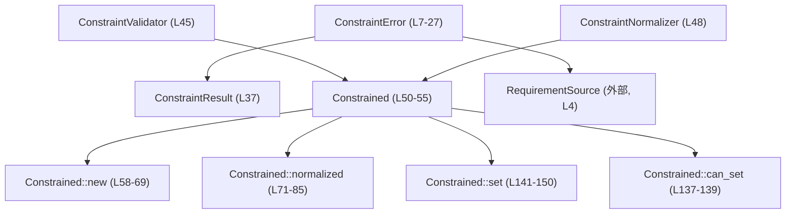
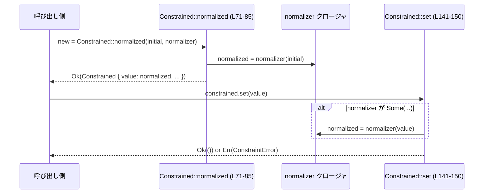

# config/src/constraint.rs

## 0. ざっくり一言

設定値などの任意の値に対して「検証（バリデーション）」と任意の「正規化（ノーマライズ）」を行うための汎用ラッパー `Constrained<T>` と、そのためのエラー型・補助 API を定義するモジュールです（config/src/constraint.rs:L7-55, L57-151）。

---

## 1. このモジュールの役割

### 1.1 概要

このモジュールは、次の問題を解決します。

> 「設定値などの任意の値に対して、安全に制約を課しつつ、値の更新時に毎回検証・正規化を行いたい」

そのために以下の機能を提供します。

- 制約違反を表現する `ConstraintError` 列挙体（config/src/constraint.rs:L7-27）
- `Result<T, ConstraintError>` の型エイリアス `ConstraintResult<T>`（L37）
- 値と検証処理・正規化処理をまとめたジェネリックな `Constrained<T>`（L50-55）
- 全て許可、特定値のみ許可、デフォルト値許可、正規化専用といった初期化パターン（L71-124, L87-124）
- 値の検証だけを行う `can_set` と実際に更新する `set`（L137-150）

### 1.2 アーキテクチャ内での位置づけ

依存関係としては以下が登場します。

- `RequirementSource`（設定要求の出所を表す外部型）  
  `crate::config_requirements::RequirementSource` に依存（L4）。  
  `ConstraintError::InvalidValue` や `ExecPolicyParse` で利用されています（L16, L24）。
- `thiserror::Error`  
  `ConstraintError` のためのエラートレイト実装（L5, L7）。
- `std::sync::Arc`  
  検証関数・正規化関数をスレッド安全に共有するために利用（L2, L53-54, L62, L76-77）。
- `std::io::Error`  
  `ConstraintError` からの変換を提供し、I/O レイヤのエラーとして使えるようにしています（L39-43）。

モジュール内部の主な依存関係を簡略図にすると次のようになります。



### 1.3 設計上のポイント

コードから読み取れる設計上の特徴は次の通りです。

- **検証関数と正規化関数の分離**  
  - 検証は `ConstraintValidator<T> = dyn Fn(&T) -> ConstraintResult<()> + Send + Sync`（L45）  
  - 正規化は `ConstraintNormalizer<T> = dyn Fn(T) -> T + Send + Sync`（L48）  
  - `Constrained<T>` は両者を `Arc` で保持し、バリデーションと値変換の責務を分離しています（L52-54）。
- **初期値の検証**  
  - `Constrained::new` ではコンストラクタ内で初期値を検証し、無効な場合はインスタンスが生成されません（L62-64）。
- **更新時のアトミック性（論理的）**  
  - `set` はまず正規化→検証を行い、検証成功時にのみ内部値を更新します（L141-149）。  
    検証失敗時は内部値は以前のまま残ります（テストで確認、L244-259）。
- **スレッド安全な共有**  
  - 検証関数・正規化関数は `Arc` かつ `Send + Sync` で共有される設計になっています（L45, L48, L53-54, L62, L76-77）。
- **I/O 層との統合**  
  - `ConstraintError` から `std::io::Error` への `From` 実装を提供し（L39-43）、I/O 関連 API と自然に統合できるようにしています。
- **テストカバレッジ**  
  - 典型的な利用パターン（allow_any, allow_only, normalized, new, set, can_set）について単体テストがあります（L189-280）。

---

## 2. 主要な機能一覧（コンポーネントインベントリー）

このチャンク内に現れる型・型エイリアス・主要メソッドの一覧です（テストは別表）。

### 2.1 型・型エイリアス

| 名前 | 種別 | 公開 | 行番号 | 役割 / 用途 |
|------|------|------|--------|-------------|
| `ConstraintError` | enum | `pub` | config/src/constraint.rs:L7-27 | 制約違反・パース失敗などを表すエラー型 |
| `ConstraintResult<T>` | type alias | `pub` | L37 | `Result<T, ConstraintError>` の短縮形 |
| `ConstraintValidator<T>` | type alias | private | L45 | `&T` を受けて検証する関数シグネチャ |
| `ConstraintNormalizer<T>` | type alias | private | L48 | `T` を受けて `T` を返す正規化関数のシグネチャ |
| `Constrained<T>` | struct | `pub` | L50-55 | 値と検証・正規化処理をまとめたラッパー |
| `tests` モジュール | mod | cfg(test) | L175-281 | 単体テスト用モジュール |

### 2.2 メソッド・関数

| 名前 | 種別 | 公開 | 行番号 | 役割（概要） |
|------|------|------|--------|--------------|
| `ConstraintError::empty_field` | 関連関数 | `pub` | L29-35 | 空フィールド用の `EmptyField` 生成ショートカット |
| `From<ConstraintError> for std::io::Error` | トレイト実装 | 公開的 | L39-43 | `ConstraintError` を `std::io::Error` に変換 |
| `Constrained::new` | 関連関数 | `pub` | L58-69 | 初期値と検証関数から `Constrained` を作成（初期値検証あり） |
| `Constrained::normalized` | 関連関数 | `pub` | L71-85 | 正規化関数を用い、検証は全て許可する `Constrained` を作成 |
| `Constrained::allow_any` | 関連関数 | `pub` | L87-93 | 任意の値を許可する `Constrained` を作成 |
| `Constrained::allow_only` | 関連関数 | `pub` | L95-116 | 特定の値のみ許可する `Constrained` を作成 |
| `Constrained::allow_any_from_default` | 関連関数 | `pub` | L118-124 | `T::default()` を初期値にした `allow_any` |
| `Constrained::get` | メソッド | `pub` | L126-128 | 内部値への参照を返す |
| `Constrained::value` | メソッド | `pub` | L130-135 | `Copy` な値をコピーして返す |
| `Constrained::can_set` | メソッド | `pub` | L137-139 | 値を変更せずに検証だけ行う |
| `Constrained::set` | メソッド | `pub` | L141-150 | （必要なら正規化の上）検証して値を更新 |
| `impl Deref for Constrained<T>` | トレイト実装 | 公開的 | L153-159 | `*constrained` や `&*constrained` で内部値にアクセス可能にする |
| `impl Debug for Constrained<T>` | トレイト実装 | 公開的 | L161-167 | デバッグ出力用 |
| `impl PartialEq for Constrained<T>` | トレイト実装 | 公開的 | L169-173 | 内部値同士の比較を提供 |

テスト関数は 2.3 でまとめます。

### 2.3 テスト関数（参考）

| 関数名 | 行番号 | テスト対象 |
|--------|--------|------------|
| `constrained_allow_any_accepts_any_value` | L189-196 | `allow_any` と `set` の挙動 |
| `constrained_allow_any_default_uses_default_value` | L198-202 | `allow_any_from_default` |
| `constrained_allow_only_rejects_different_values` | L204-216 | `allow_only` と `set` のエラー |
| `constrained_normalizer_applies_on_init_and_set` | L218-228 | `normalized` と `set` による正規化 |
| `constrained_new_rejects_invalid_initial_value` | L230-241 | `new` の初期値検証 |
| `constrained_set_rejects_invalid_value_and_leaves_previous` | L243-259 | `set` の失敗時に値が変わらないこと |
| `constrained_can_set_allows_probe_without_setting` | L261-279 | `can_set` が値を変えないこと |

---

## 3. 公開 API と詳細解説

### 3.1 型一覧（構造体・列挙体など）

| 名前 | 種別 | 公開 | 行番号 | 役割 / 用途 |
|------|------|------|--------|-------------|
| `ConstraintError` | enum | `pub` | L7-27 | 制約違反やパースエラーを表現するエラー型 |
| `ConstraintResult<T>` | type alias | `pub` | L37 | `Result<T, ConstraintError>` |
| `Constrained<T>` | struct | `pub` | L50-55 | 値と制約（検証/正規化）を保持するラッパー |

#### `ConstraintError` のバリアント

- `InvalidValue { field_name: &'static str, candidate: String, allowed: String, requirement_source: RequirementSource }`（L12-17）  
  値が許可された集合に含まれない場合のエラー。
- `EmptyField { field_name: String }`（L19-20）  
  フィールド値が空であってはならない場合のエラー。
- `ExecPolicyParse { requirement_source: RequirementSource, reason: String }`（L22-26）  
  requirement のルールパースに失敗した場合のエラー（本ファイルでは生成されていません）。

### 3.2 関数詳細（主要な 7 件）

#### `ConstraintError::empty_field(field_name: impl Into<String>) -> ConstraintError`

**概要**

空であってはならないフィールドに対して `EmptyField` エラー値を生成するヘルパーです（L29-35）。

**引数**

| 引数名 | 型 | 説明 |
|--------|----|------|
| `field_name` | `impl Into<String>` | フィールド名。`String` に変換されて `EmptyField.field_name` に格納されます。 |

**戻り値**

- `ConstraintError::EmptyField { field_name }`

**内部処理の流れ**

1. 引数 `field_name` を `String` に変換（L31-32）。
2. その値を持つ `ConstraintError::EmptyField` を返す（L31-34）。

**Examples（使用例）**

```rust
use crate::config::constraint::{ConstraintError};

fn validate_non_empty(name: &str) -> Result<(), ConstraintError> {
    if name.is_empty() {
        // 空文字列なら EmptyField エラーを返す
        return Err(ConstraintError::empty_field("name"));
    }
    Ok(())
}
```

**Errors / Panics**

- この関数自体は常に `ConstraintError` を生成するだけで、パニックしません。

**Edge cases（エッジケース）**

- フィールド名が空文字列でも、そのまま `field_name` に格納されます。

**使用上の注意点**

- エラーメッセージにはフィールド名がそのまま表示されます（L19）。ログに出す場合は秘匿情報を入れないようにすることが望ましいです。

---

#### `Constrained::new(initial_value: T, validator: impl Fn(&T) -> ConstraintResult<()> + Send + Sync + 'static) -> ConstraintResult<Constrained<T>>`  

（`impl<T: Send + Sync> Constrained<T>` 内, L58-69）

**概要**

任意の初期値と検証関数から `Constrained<T>` を作成します。初期値は必ずコンストラクタ内で検証され、無効なら `Err` で返されます。

**引数**

| 引数名 | 型 | 説明 |
|--------|----|------|
| `initial_value` | `T` | 最初に保持する値。 |
| `validator` | `impl Fn(&T) -> ConstraintResult<()> + Send + Sync + 'static` | 値が有効かどうかをチェックする関数。 `Ok(())` なら有効、`Err(ConstraintError)` なら無効。 |

**戻り値**

- `Ok(Constrained<T>)` : 初期値が有効なとき。
- `Err(ConstraintError)` : 初期値が無効なとき（L62-64）。

**内部処理の流れ**

1. 渡された `validator` を `Arc<ConstraintValidator<T>>` に包む（L62）。
2. `validator(&initial_value)?;` で初期値を検証する（L63）。
   - `Err` の場合この時点で早期リターン。
3. 検証成功なら `Constrained { value: initial_value, validator, normalizer: None }` を返す（L64-68）。

**Examples（使用例）**

```rust
use crate::config::constraint::{Constrained, ConstraintError, ConstraintResult};

fn positive_only(value: i32) -> ConstraintResult<Constrained<i32>> {
    Constrained::new(value, |v| {
        if *v > 0 {
            Ok(())
        } else {
            Err(ConstraintError::InvalidValue {
                field_name: "threads",
                candidate: v.to_string(),
                allowed: "positive values".to_string(),
                requirement_source: crate::config_requirements::RequirementSource::Unknown,
            })
        }
    })
}
```

**Errors / Panics**

- 初期値が検証関数で `Err` となった場合、`Err(ConstraintError)` を返します（テストでも確認, L230-241）。
- パニックは発生しません（コードに `panic!` などは存在しません）。

**Edge cases（エッジケース）**

- 検証関数が常に `Ok(())` を返す場合、どのような初期値でも受け入れます。
- 検証関数内でパニックが起きた場合の挙動は、各検証関数の実装に依存します（このモジュール側では特別扱いしていません）。

**使用上の注意点**

- `T: Send + Sync` 制約があるため（L57）、非スレッドセーフな型では使用できないことがあります。
- 初期値の検証に失敗した場合、`Constrained` は生成されないため、「必ず有効な値だけを持つ」ことが保証されます。

---

#### `Constrained::normalized(initial_value: T, normalizer: impl Fn(T) -> T + Send + Sync + 'static) -> ConstraintResult<Constrained<T>>`  

（L71-85）

**概要**

値を正規化する関数を受け取り、「どんな値でも許可する」検証関数と組み合わせて `Constrained<T>` を作成します。初期値は正規化関数を通してから保存されます。

**引数**

| 引数名 | 型 | 説明 |
|--------|----|------|
| `initial_value` | `T` | 正規化前の初期値。 |
| `normalizer` | `impl Fn(T) -> T + Send + Sync + 'static` | 値を正規化する関数。例: 範囲にクリップする、負数を 0 にするなど。 |

**戻り値**

- `Ok(Constrained<T>)`（現状の実装ではエラーを返しませんが、型としては `ConstraintResult` です）。

**内部処理の流れ**

1. すべての値を許可する検証関数 `|_| Ok(())` を `Arc<ConstraintValidator<T>>` に包む（L76）。
2. 与えられた `normalizer` を `Arc<ConstraintNormalizer<T>>` に包む（L77）。
3. `let normalized = normalizer(initial_value);` で初期値を正規化する（L78）。
4. 検証関数（常に `Ok(())`）で正規化後の値を検証（L79）。
5. 正規化後の値と両 `Arc` を持つ `Constrained` を返す（L80-84）。

**Examples（使用例）**

```rust
use crate::config::constraint::{Constrained, ConstraintResult};

fn non_negative(value: i32) -> ConstraintResult<Constrained<i32>> {
    // 負の値は 0 にクリップする正規化関数
    Constrained::normalized(value, |v| v.max(0))
}

// -1 で初期化しても、内部値は 0 になる
let mut c = non_negative(-1)?;
assert_eq!(c.value(), 0);
```

テストでは `set` 時にも正規化が適用されることが確認されています（L218-228）。

**Errors / Panics**

- 検証関数が常に `Ok(())` のため、このメソッド自身が `Err` を返すのは `normalizer` がパニックする場合など、外部要因のみです。
- パニックの有無は `normalizer` の実装に依存します。

**Edge cases**

- 正規化関数が恒等写像（`|v| v`）の場合、単に検証を行わない `Constrained` と同等になります。
- 正規化関数が極端な値に変換する場合でも、このモジュール側では制限していません。

**使用上の注意点**

- このメソッドでは「検証」は事実上無効化されており、「正規化だけ」で値を整える設計になっています（L76-79）。検証が必要な場合は `Constrained::new` を使います。
- `can_set` は正規化を通さないため（L137-139）、`normalized` で作った `Constrained` に対しては「常に Ok を返す」点に注意が必要です（バリデータが何もしないため）。

---

#### `Constrained::allow_any(initial_value: T) -> Constrained<T>`  

（L87-93）

**概要**

どんな値でも受け入れる `Constrained<T>` を作成します。検証関数は常に `Ok(())` を返します。

**引数**

| 引数名 | 型 | 説明 |
|--------|----|------|
| `initial_value` | `T` | 初期値。検証は行われません。 |

**戻り値**

- `Constrained<T>`（検証関数は `|_| Ok(())`、正規化関数は `None`）

**内部処理の流れ**

1. 値フィールドに `initial_value` をそのまま格納（L89）。
2. 検証関数として `Arc::new(|_| Ok(()))` を設定（L90）。
3. 正規化関数を `None` に設定（L91）。

**Examples（使用例）**

```rust
use crate::config::constraint::Constrained;

let mut c = Constrained::allow_any(5);  // 初期値 5
c.set(-10).unwrap();                    // 任意の値を受け入れる
assert_eq!(c.value(), -10);
```

（上と同等の挙動がテストで確認されています, L189-196）

**Errors / Panics**

- `set`・`can_set` は常に `Ok(())` を返します。パニックは発生しません。

**Edge cases**

- 値の型 `T` に特別な制約はありません（ただし `impl` 全体として `T: Send + Sync` が必要, L57）。

**使用上の注意点**

- バリデーションが完全に無効なため、「制約が不要ながらインターフェースを揃えたい」ケース向けです。
- 実質的に「ただのラッパー」になるので、過剰な抽象化にならないかは設計上検討が必要です。

---

#### `Constrained::allow_only(only_value: T) -> Constrained<T>`  

（L95-116）

**概要**

指定した 1 つの値のみを許可する `Constrained<T>` を作成します。その他すべての値は `ConstraintError::InvalidValue` で拒否されます。

**引数**

| 引数名 | 型 | 説明 |
|--------|----|------|
| `only_value` | `T` | 唯一許可される値。内部に保持され、比較に使われます。 |

**戻り値**

- `Constrained<T>`：初期値および許可値は `only_value` に固定されます。

**内部処理の流れ**

1. `allowed_value` に `only_value.clone()` を保持（L99）。
2. 構造体の `value` に `only_value` を格納（L101）。
3. クロージャ `move |candidate| { ... }` を `Arc` に包んで検証関数とする（L102-113）。
   - `candidate == &allowed_value` なら `Ok(())`（L103-104）。
   - それ以外なら `ConstraintError::InvalidValue { ... }` を生成して `Err` を返す（L106-112）。
4. 正規化関数は `None`（L114）。

**Examples（使用例）**

```rust
use crate::config::constraint::{Constrained, ConstraintError};

let mut c = Constrained::allow_only(5);
// 5 は通る
c.set(5).unwrap();

// 6 は拒否される
let err = c.set(6).unwrap_err();
match err {
    ConstraintError::InvalidValue { candidate, allowed, .. } => {
        assert_eq!(candidate, "6");
        assert_eq!(allowed, "[5]");
    }
    _ => unreachable!(),
}
```

テストでは `value()` が以前の値のままであることも確認されています（L204-216）。

**Errors / Panics**

- `set`・`can_set` に `only_value` 以外を渡すと `Err(ConstraintError::InvalidValue)` になります（L106-112, L204-216）。
- パニックは発生しません。

**Edge cases**

- `T: Clone + fmt::Debug + PartialEq + 'static` が必要です（L96-97）。
- エラーメッセージ中の `allowed` は `"[<debug_repr>]"` 形式で出力されます（L109-110）。
- フィールド名は `"<unknown>"` と固定されています（L107）。

**使用上の注意点**

- `RequirementSource::Unknown` が固定で使われるため（L110）、どこで設定された制約かまでは表現されません。
- 許可値の比較は `PartialEq` に依存するので、浮動小数点などの比較には注意が必要です（型側の仕様）。

---

#### `Constrained::can_set(&self, candidate: &T) -> ConstraintResult<()>`  

（L137-139）

**概要**

実際に値を変更せず、候補値が現在の制約に適合するかどうかだけを検証します。

**引数**

| 引数名 | 型 | 説明 |
|--------|----|------|
| `candidate` | `&T` | 検証したい値の候補。 |

**戻り値**

- `Ok(())` : 候補値が許可される場合。
- `Err(ConstraintError)` : 許可されない場合。

**内部処理の流れ**

1. 単に `self.validator(candidate)` を呼び、その結果を返す（L138）。

**Examples（使用例）**

```rust
use crate::config::constraint::{Constrained, ConstraintResult};

let c = Constrained::new(1, |v| {
    if *v > 0 { Ok(()) } else { Err(crate::config::constraint::ConstraintError::empty_field("dummy")) }
}).unwrap();

// 値を変えずに検証だけ行う
c.can_set(&2).unwrap();   // OK
let result = c.can_set(&-1);
assert!(result.is_err());
assert_eq!(c.value(), 1); // 元の値はそのまま
```

テストでも、`can_set` は内部値を変更しないことが確認されています（L261-279）。

**Errors / Panics**

- 検証関数が `Err` を返すと、そのまま `Err` が返されます。
- 正規化関数は使われないため、`normalized` 由来のインスタンスでは常に `Ok(())` になります（検証関数が `|_| Ok(())` のため）。

**Edge cases**

- 正規化を伴う `Constrained`（`normalized`）でも、`can_set` は正規化を通さない点に注意が必要です。
- エラーメッセージ内容は検証関数の実装に依存します。

**使用上の注意点**

- 「この値に変更できるか」の事前チェックとして有用ですが、「実際に `set` した場合と完全に同じ結果」にはならない可能性があります（正規化がある場合）。

---

#### `Constrained::set(&mut self, value: T) -> ConstraintResult<()>`  

（L141-150）

**概要**

必要に応じて値を正規化し、その結果を検証してから内部値を更新します。検証に失敗した場合、内部値は更新されません。

**引数**

| 引数名 | 型 | 説明 |
|--------|----|------|
| `value` | `T` | 新しく設定したい値。 |

**戻り値**

- `Ok(())` : 正規化と検証が成功し、内部値が更新された場合。
- `Err(ConstraintError)` : 検証に失敗し、内部値は元のままの場合。

**内部処理の流れ**

1. `if let Some(normalizer) = &self.normalizer { ... }` で正規化関数の有無を確認（L142）。
2. 正規化関数があれば `normalizer(value)` により値を変換、なければそのまま使用（L142-145）。
3. 正規化後の値を検証関数に渡す（L147）。
4. 検証が成功した場合のみ `self.value = value;` で内部値を更新（L148）。
5. 成功なら `Ok(())` を返す（L149）。

**Examples（使用例）**

```rust
use crate::config::constraint::{Constrained, ConstraintResult};

fn positive_only_constrained() -> ConstraintResult<Constrained<i32>> {
    Constrained::new(1, |v| {
        if *v > 0 { Ok(()) }
        else { Err(crate::config::constraint::ConstraintError::empty_field("dummy")) }
    })
}

let mut c = positive_only_constrained()?;

// 有効な値は受け入れる
c.set(10)?;

// 無効な値は拒否し、内部値は変わらない
let err = c.set(-5).unwrap_err();
assert_eq!(c.value(), 10);
```

テストでも、「無効な値で `set` した場合に内部値が変わらない」ことが確認されています（L243-259）。

**Errors / Panics**

- 検証関数が `Err` を返すと、そのまま `Err` が返され、内部値は更新されません。
- 正規化関数や検証関数の内部でパニックする可能性はありますが、このモジュールではそれを捕捉していません。

**Edge cases**

- 正規化関数が `value` を大きく変換する場合、その結果に対して検証が行われます。  
  例: 値をクランプする正規化 + 範囲チェック検証。
- 正規化関数が `None` の場合は、単なるバリデーション付き setter として振る舞います。

**使用上の注意点**

- `&mut self` が必要なので、同一インスタンスを複数スレッドから同時に書き換えることはできません（通常の Rust の可変参照ルール通り）。
- エラーを無視して `unwrap` する場合、制約違反時にパニックを招く可能性があります。エラー処理を行うことが推奨されます。

---

### 3.3 その他の関数・実装

| 名称 | 行番号 | 役割（1 行） |
|------|--------|--------------|
| `ConstraintResult<T>` | L37 | `Result<T, ConstraintError>` の共通型エイリアス |
| `impl From<ConstraintError> for std::io::Error` | L39-43 | `ConstraintError` を `std::io::ErrorKind::InvalidInput` に変換 |
| `Constrained::allow_any_from_default` | L118-124 | `T::default()` を初期値とする `allow_any` コンストラクタ |
| `Constrained::get` | L126-128 | 内部値への参照を返す単純なアクセサ |
| `Constrained::value` | L130-135 | `Copy` な値をコピーして返すアクセサ |
| `impl Deref for Constrained<T>` | L153-159 | `Deref` による透過的アクセス（`&*constrained`）を提供 |
| `impl Debug for Constrained<T>` | L161-167 | デバッグ出力で `value` だけを表示 |
| `impl PartialEq for Constrained<T>` | L169-173 | 内部値同士の等価比較 |

---

## 4. データフロー

ここでは、`Constrained::normalized` で生成した値に対して `set` を呼び出す典型的なフローを示します。

1. 呼び出し側が `Constrained::normalized(initial_value, normalizer)` を呼ぶ。
2. `normalized` 内で `normalizer` により初期値を変換し、検証関数（常に `Ok`) を通して `Constrained` を返す（L71-85）。
3. 後から `set` に値を渡すと、必要に応じて同じ `normalizer` が適用され、検証後に内部値が更新される（L141-150）。
4. 呼び出し側は `set` の結果で成功・失敗を判断する。



テスト `constrained_normalizer_applies_on_init_and_set`（L218-228）では、このフローに沿って「初期化時と `set` 時に同じ正規化が適用される」ことが確認されています。

---

## 5. 使い方（How to Use）

### 5.1 基本的な使用方法

例として、「スレッド数は 1 以上の整数に制約したい」ケースを考えます。

```rust
use crate::config::constraint::{Constrained, ConstraintResult, ConstraintError};

fn threads_constrained(initial: u32) -> ConstraintResult<Constrained<u32>> {
    Constrained::new(initial, |v| {
        if *v >= 1 {
            Ok(())
        } else {
            Err(ConstraintError::InvalidValue {
                field_name: "threads",
                candidate: v.to_string(),
                allowed: ">= 1".to_string(),
                requirement_source: crate::config_requirements::RequirementSource::Unknown,
            })
        }
    })
}

fn example() -> ConstraintResult<()> {
    let mut threads = threads_constrained(4)?; // 初期値 4（検証済み）

    // 有効な値に更新
    threads.set(8)?;

    // 無効な値はエラー
    if let Err(err) = threads.set(0) {
        eprintln!("invalid thread count: {err}");
    }

    println!("threads = {}", threads.value());
    Ok(())
}
```

このように `Constrained` を介することで、「常に検証された状態」の値だけを保持できます。

### 5.2 よくある使用パターン

1. **バリデーションのみ（正規化なし）**  
   - `Constrained::new` または `Constrained::allow_only` を使う（L58-69, L95-116）。
2. **正規化のみ（バリデーションなし）**  
   - `Constrained::normalized` を使い、例えば負値を 0 にクリップする（L71-85, L218-228）。
3. **制約なしで `Constrained` を使いたい場合**  
   - `Constrained::allow_any` または `allow_any_from_default`（L87-93, L118-124）。

```rust
// 1. allow_only
let mut flag = Constrained::allow_only(true);
flag.set(true)?;      // OK
assert!(flag.set(false).is_err());

// 2. normalized で範囲 [0, 100] にクリップ
let mut pct = Constrained::normalized(150, |v: i32| v.clamp(0, 100))?;
assert_eq!(pct.value(), 100);

// 3. allow_any_from_default
let counter = Constrained::<u64>::allow_any_from_default();
assert_eq!(counter.value(), 0);
```

### 5.3 よくある間違い

```rust
use crate::config::constraint::Constrained;

// 間違い例: エラーを無視して unwrap し、制約違反時にパニック
let mut c = Constrained::allow_only(5);
let _ = c.set(6).unwrap(); // 6 は許可されないので Err を unwrap して panic する

// 正しい例: Result をチェックしてエラーを処理
let mut c = Constrained::allow_only(5);
if let Err(err) = c.set(6) {
    eprintln!("invalid value: {err}");
}
```

```rust
// 間違い例: can_set を「正規化後の結果も含めたチェック」と誤解する
let norm = Constrained::normalized(-1, |v| v.max(0))?;
norm.can_set(&-5)?; // 実装上は常に Ok だが、「正規化後に 0 になるから OK」とは限らない API 契約

// 現状仕様: normalized では validator が何もしないので、can_set は常に Ok
// 検証が必要な場合は Constrained::new を使う必要がある
```

### 5.4 使用上の注意点（まとめ）

- **エラー処理**  
  - `new`・`set`・`can_set` は `ConstraintResult` を返すため、`?` で伝播させるか、`match` や `if let Err` で処理する必要があります（L58-69, L137-150）。
- **スレッド安全性**  
  - `Constrained<T>` のメソッド `impl` には `T: Send + Sync` 制約があります（L57）。  
    検証関数・正規化関数も `Send + Sync` 必須なので、複数スレッドから共有しても基本的に安全です。  
    ただし、値の更新には `&mut self` が必要なため、同一インスタンスを複数スレッドから同時に書き換えることはできません。
- **ログと秘匿情報**  
  - `InvalidValue` のエラーメッセージには `candidate` がそのまま埋め込まれます（L10, L14）。  
    秘匿情報を持つ値を直接エラーに含める場合はログ出力ポリシーに注意が必要です。
- **can_set と set の違い**  
  - `can_set` は正規化関数を通さず、検証関数だけを呼びます（L137-139）。  
    正規化も含めた「実際に設定した時と同じ挙動」を保証するものではありません。

---

## 6. 変更の仕方（How to Modify）

### 6.1 新しい機能を追加する場合

1. **新しい初期化パターンを追加したい場合**  
   - 例: 「範囲指定のバリデーション付きコンストラクタ」など。  
   - 追加場所: `impl<T: Send + Sync> Constrained<T>` ブロック内（L57-151）。  
   - 既存の `allow_any`, `allow_only`, `allow_any_from_default` の実装を参考に、新しい関連関数を追加します（L87-124, L95-116）。
2. **エラーの種類を増やしたい場合**  
   - `ConstraintError` に新しいバリアントを追加（L7-27）。  
   - `thiserror::Error` の derive を利用しているため、`#[error("...")]` メッセージを合わせて追加します。
3. **検証ロジックを共通化したい場合**  
   - 共通検証関数をモジュール内に追加し、複数の `Constrained::new` 呼び出しで利用できます。

### 6.2 既存の機能を変更する場合の注意点

- **契約の維持**  
  - `Constrained::new` は「初期値が必ず検証される」ことを前提に他コードから使用されている可能性があります（テスト L230-241）。  
    ここを変更すると、呼び出し側が「常に有効な値を保持する」という前提を失うため、影響範囲が広くなります。
- **`set` の挙動**  
  - 「検証に失敗した場合は内部値を更新しない」という挙動（テスト L243-259）は、高い依存性があると考えられます。  
    ここを変更すると、不整合な状態が発生しやすくなります。
- **型制約の変更**  
  - `T: Send + Sync` の制約（L57）を変更すると、並行実行環境での安全性が変わるため、他モジュールとの整合性を確認する必要があります。
- **`ConstraintError` → `std::io::Error` 変換**  
  - `From<ConstraintError> for std::io::Error`（L39-43）のエラー種別（`InvalidInput`）を変更する場合、ファイル I/O などの呼び出し元のエラー処理に影響が出る可能性があります。

---

## 7. 関連ファイル

このモジュールと密接に関係する（コードから確認できる）ファイル・モジュールは次の通りです。

| パス / モジュール | 役割 / 関係 |
|-------------------|------------|
| `crate::config_requirements::RequirementSource` | `ConstraintError::InvalidValue` および `ExecPolicyParse` の `requirement_source` フィールド型として使用されています（L4, L16, L24, L185, L186）。実体の定義はこのチャンクには現れません。 |
| `thiserror::Error`（クレート） | `ConstraintError` にエラー表示用の実装を付与します（L5, L7-27）。 |
| `std::io` | `ConstraintError` を I/O エラーに変換するために使用されています（L39-43）。 |

テストコードは同一ファイル内の `tests` モジュール（L175-281）に含まれており、本モジュールの主要機能すべてについてふるまいを確認する役割を持っています。

---

### バグ・セキュリティ・その他の観点（本チャンクから読み取れる範囲）

- **潜在的な驚きポイント**  
  - `normalized` で作成した `Constrained` に対する `can_set` は常に `Ok(())` となる実装であり（L76, L137-139）、「正規化後の値も含めたチェック」とは異なります。仕様として理解しておく必要があります。
- **セキュリティ**  
  - `ConstraintError::InvalidValue` のエラーメッセージには `candidate` の文字列表現と `allowed` の内容が含まれます（L10, L14-15）。  
    秘匿情報を含む値をそのままエラーに載せるとログなどから漏洩するリスクがあります。
- **安全性**  
  - `unsafe` コードは一切使われておらず、このモジュール内でのメモリ安全性は Rust の型システムにより保証されています。
