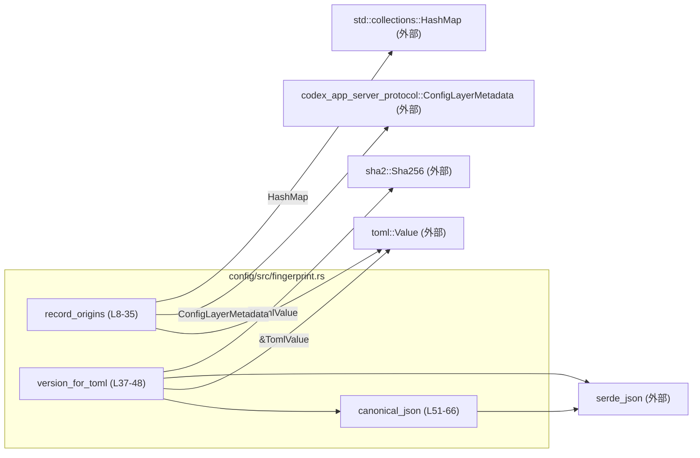
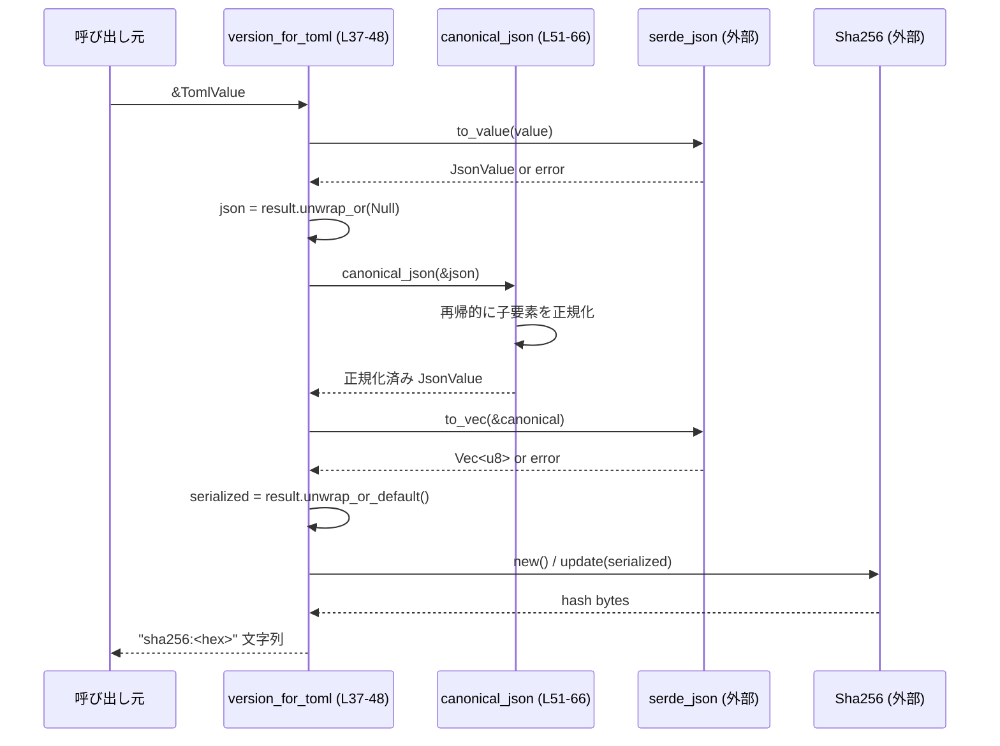
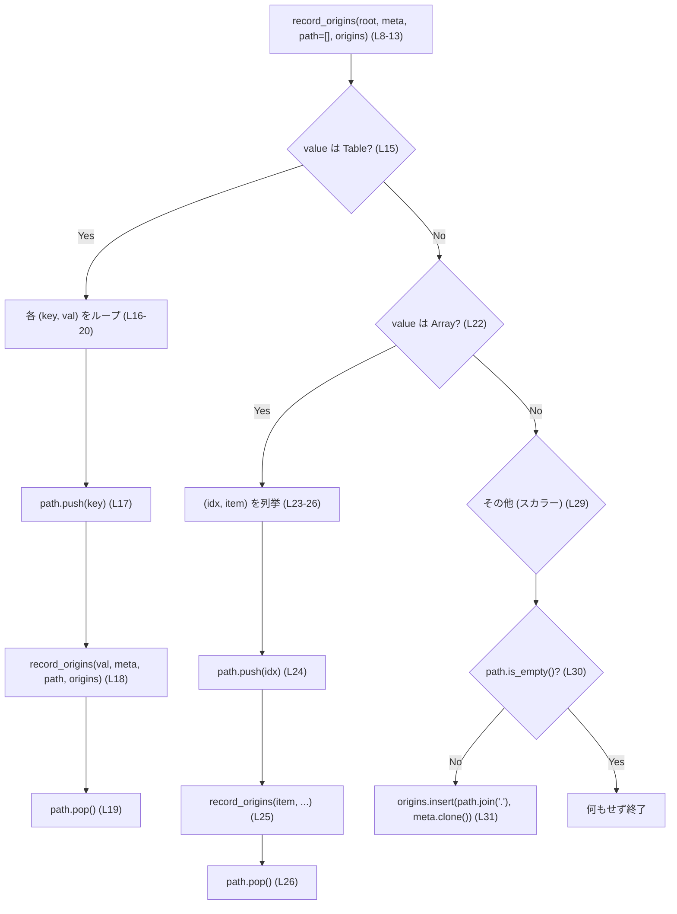

# config/src/fingerprint.rs

## 0. ざっくり一言

TOML 設定値から安定したハッシュ（バージョン文字列）を生成し、TOML 内の各値がどの設定レイヤ由来かを記録するためのユーティリティ関数をまとめたモジュールです。

---

## 1. このモジュールの役割

### 1.1 概要

- TOML (`toml::Value`) を JSON に変換し、「キー順を正規化した JSON」を SHA-256 でハッシュしてバージョン文字列を作成します（`version_for_toml`、`config/src/fingerprint.rs:L37-48`）。
- TOML ツリーを再帰的に走査し、「パス文字列 → 設定レイヤメタデータ」の対応を `HashMap` に記録します（`record_origins`、`config/src/fingerprint.rs:L8-35`）。

### 1.2 アーキテクチャ内での位置づけ

このチャンクには呼び出し元は現れませんが、本モジュールの依存関係と内部の呼び出し関係は次のようになります。



- `record_origins` は設定値の由来を記録する内部ユーティリティ（`pub(super)`）です。
- `version_for_toml` はこのファイル中で唯一 `pub` な関数で、外部モジュールから利用されるバージョン計算 API です。
- `canonical_json` は内部ヘルパー関数で、JSON オブジェクトのキー順を正規化します。

### 1.3 設計上のポイント（コードから読み取れる範囲）

- **状態管理**  
  - グローバル状態は持たず、関数は引数で受け取ったデータのみを操作します。
  - `record_origins` は `&mut Vec<String>` と `&mut HashMap<_, _>` を引数で受け取り、副作用としてそれらを更新します（`config/src/fingerprint.rs:L8-13`）。
- **再帰処理**  
  - TOML/JSON ツリーは再帰関数で走査します（`record_origins` と `canonical_json`、`config/src/fingerprint.rs:L14-34`, `L51-66`）。
- **エラーハンドリング方針**  
  - シリアライズ関連のエラーは `Result` で外に出さず、`unwrap_or` / `unwrap_or_default` で握りつぶしてデフォルト値にフォールバックします（`config/src/fingerprint.rs:L38`, `L40`）。
- **並行性**  
  - いずれの関数もスレッドローカルな変数のみを使用し、グローバル可変状態を持たないため、署名が許す範囲で並行呼び出しが可能です。

---

## 2. コンポーネント一覧（関数・型インベントリー）

### 2.1 関数インベントリー

| 名前 | 可視性 | 役割 / 用途 | 定義位置 |
|------|--------|-------------|----------|
| `record_origins` | `pub(super)` | TOML ツリーを走査し、「パス → ConfigLayerMetadata」の対応を `origins` マップに記録する | `config/src/fingerprint.rs:L8-35` |
| `version_for_toml` | `pub` | TOML 値を正規化済み JSON に変換し、そのバイナリ表現の SHA-256 ハッシュを文字列で返す | `config/src/fingerprint.rs:L37-48` |
| `canonical_json` | `fn`（private） | JSON 値のオブジェクトキーをソートして再帰的に正規化する内部ヘルパー | `config/src/fingerprint.rs:L51-66` |

### 2.2 このファイル内に定義される型

このファイル内で新たに定義される構造体や列挙体はありません。

API で使用される主な外部型（定義はこのチャンクには現れません）:

| 名前 | 出典 | 用途 | 使用箇所（根拠） |
|------|------|------|------------------|
| `ConfigLayerMetadata` | `codex_app_server_protocol` | 設定レイヤのメタデータ。各値の「由来」を表すと考えられますが詳細は不明 | `record_origins` 引数（`config/src/fingerprint.rs:L10`, `L12`, `L31`） |
| `TomlValue` (`toml::Value`) | `toml` クレート | TOML 設定値の木構造 | 全関数で使用（`config/src/fingerprint.rs:L9`, `L37`） |
| `JsonValue` (`serde_json::Value`) | `serde_json` クレート | JSON 値の木構造 | `version_for_toml`, `canonical_json`（`config/src/fingerprint.rs:L2`, `L38`, `L51`） |

---

## 3. 公開 API と詳細解説

### 3.1 関数詳細 1: `record_origins`

```rust
pub(super) fn record_origins(
    value: &TomlValue,
    meta: &ConfigLayerMetadata,
    path: &mut Vec<String>,
    origins: &mut HashMap<String, ConfigLayerMetadata>,
)
```

（`config/src/fingerprint.rs:L8-13`）

#### 概要

- `TomlValue` のツリーを再帰的にたどり、配下の「値」に対応するパス文字列をキーとして、指定された `meta` を `origins` マップに記録します。
- パスは `"親キー.子キー.インデックス.子キー"` のように `.` で連結された文字列になります（`config/src/fingerprint.rs:L16-19`, `L23-26`, `L31`）。

#### 引数

| 引数名 | 型 | 説明 |
|--------|----|------|
| `value` | `&TomlValue` | 走査対象の TOML 値（テーブル・配列・スカラを含む） |
| `meta` | `&ConfigLayerMetadata` | この `value` を含む設定レイヤのメタデータ（各パスに複製されて格納される） |
| `path` | `&mut Vec<String>` | 現在の階層までのキー/インデックスを積んだパス（スタックとして利用） |
| `origins` | `&mut HashMap<String, ConfigLayerMetadata>` | 「パス文字列 → メタデータ」の結果を書き込むマップ |

#### 戻り値

- 戻り値はなく、副作用として `path` と `origins` を更新します。

#### 内部処理の流れ

1. `value` のバリアントに応じて分岐する `match` を行います（`config/src/fingerprint.rs:L14-34`）。
2. `TomlValue::Table(table)` の場合（`config/src/fingerprint.rs:L15-21`）:
   - `for (key, val) in table` で各キーと値を列挙。
   - `path.push(key.clone())` で現在キーをパスに追加（`L17`）。
   - 再帰的に `record_origins(val, meta, path, origins)` を呼び出し（`L18`）。
   - 帰ってきたら `path.pop()` でパスを元に戻す（`L19`）。
3. `TomlValue::Array(items)` の場合（`config/src/fingerprint.rs:L22-28`）:
   - `(0_i32..).zip(items.iter())` で 0 からのインデックスと要素をペアにして列挙（`L23`）。
   - `path.push(idx.to_string())` でインデックス文字列をパスに追加（`L24`）。
   - 再帰的に `record_origins(item, meta, path, origins)` を呼ぶ（`L25`）。
   - `path.pop()` でインデックスを取り除く（`L26`）。
4. それ以外（スカラー値など）の場合（`config/src/fingerprint.rs:L29-33`）:
   - `if !path.is_empty()` の場合のみ、`path.join(".")` でパスを `.` 区切りの文字列にしてキーとし（`L30-31`）、
   - `origins.insert(key, meta.clone())` でマップにメタデータを記録する（`L31`）。

#### Examples（使用例）

TOML からパスごとの由来レイヤを構築する例です（`ConfigLayerMetadata` の具体的な生成方法はこのチャンクから分からないためコメントで表現します）。

```rust
use std::collections::HashMap;
use toml::Value as TomlValue;
use codex_app_server_protocol::ConfigLayerMetadata;
use config::fingerprint::record_origins; // 実際のパスは crate 構成に依存

fn main() {
    // TOML 文字列を Value にパースする
    let toml_src = r#"
        [server]
        host = "localhost"
        ports = [8080, 8081]
    "#;

    let value: TomlValue = toml::from_str(toml_src).unwrap();   // TOML -> TomlValue

    // 由来メタデータ（具体的な作り方はこのチャンクでは不明）
    let meta: ConfigLayerMetadata = /* レイヤを表すメタデータを構築 */;

    let mut path = Vec::<String>::new();                        // 現在のパススタック
    let mut origins = HashMap::<String, ConfigLayerMetadata>::new(); // 結果を入れるマップ

    // ルートから走査を開始
    record_origins(&value, &meta, &mut path, &mut origins);

    // origins 例（キーの形式の例）
    // "server.host" -> meta
    // "server.ports.0" -> meta
    // "server.ports.1" -> meta
}
```

#### Errors / Panics

- この関数内で `unwrap` や `expect` は使用されていません。
- `origins.insert` も標準ライブラリの `HashMap` の通常操作であり、メモリ不足など極端な状況を除きパニックは想定しづらいです。
- 再帰深度が非常に深い TOML を入力した場合は、Rust のスタック上限に達してスタックオーバーフローを引き起こす可能性がありますが、そのような極端な入力は通常の設定ファイルでは想定されないと考えられます（この点は一般論であり、このチャンクだけからは利用状況は分かりません）。

#### Edge cases（エッジケース）

- **パスが空の場合**  
  - ルートの `value` がテーブルや配列ではなくスカラで、かつ `path` も空のままの場合、`!path.is_empty()` が偽となり、`origins` には何も追加されません（`config/src/fingerprint.rs:L29-31`）。
- **キーに `.` を含む場合**  
  - `path.join(".")` により、キー文字列中の `.` と階層区切りの `.` が区別されません。
  - その結果、異なる構造が同じパス文字列に収束する可能性があります。これが問題になるかどうかは利用側の仕様に依存し、このチャンクからは判断できません。
- **配列のインデックス**  
  - 配列要素は常に 0 起点の連番インデックスで参照され、`"親キー.0.子キー"` のようなパスになります（`config/src/fingerprint.rs:L23-24`）。

#### 使用上の注意点（安全性・並行性を含む）

- `path` はスタックとして扱われるため、呼び出し前に適切な初期状態（通常は空）にしておく前提があります。
- `record_origins` は `path` と `origins` を `&mut` で受け取るため、これらを共有して複数スレッドから同時に呼び出すことは Rust の型システム的に許されません（コンパイル時に防止されます）。
- 再帰呼び出しにより大きなツリーでは計算量が増えますが、処理内容は単純な走査とマップ挿入のみです。

---

### 3.2 関数詳細 2: `version_for_toml`

```rust
pub fn version_for_toml(value: &TomlValue) -> String
```

（`config/src/fingerprint.rs:L37`）

#### 概要

- 渡された TOML 値を JSON に変換し、JSON オブジェクトのキー順を正規化したうえでバイト列としてシリアライズし、その SHA-256 ハッシュを `"sha256:<hex>"` 形式の文字列で返します（`config/src/fingerprint.rs:L38-48`）。
- 同じ意味の設定値に対しては、キーの並び順が異なっていても同じバージョン文字列を得ることが目的と考えられます（根拠: `canonical_json` でキーソートしていること、`config/src/fingerprint.rs:L51-61`）。

#### 引数

| 引数名 | 型 | 説明 |
|--------|----|------|
| `value` | `&TomlValue` | バージョンを計算したい TOML 設定値 |

#### 戻り値

- 型: `String`
- 内容: `"sha256:"` に続いて、SHA-256 ダイジェストの 16 進表現 64 桁を連結した文字列（例: `"sha256:3a7bd3..."`）。

#### 内部処理の流れ（アルゴリズム）

1. TOML を JSON に変換  
   - `serde_json::to_value(value)` で `JsonValue` に変換し、失敗した場合は `JsonValue::Null` を使用する（`config/src/fingerprint.rs:L38`）。
2. JSON を正規化  
   - `canonical_json(&json)` を呼び出して、オブジェクトのキー順をソートしながら再帰的に整形する（`config/src/fingerprint.rs:L39`, `L51-61`）。
3. 正規化済み JSON をバイト列にシリアライズ  
   - `serde_json::to_vec(&canonical)` で `Vec<u8>` に変換し、失敗した場合は空の `Vec<u8>` を使用する（`config/src/fingerprint.rs:L40`）。
4. SHA-256 ハッシュ計算  
   - `Sha256::new()` でハッシュコンテキストを生成し（`config/src/fingerprint.rs:L41`）、
   - `hasher.update(serialized)` でバイト列を投入（`L42`）、
   - `hasher.finalize()` で 32 バイトのダイジェストを取得（`L43`）。
5. ダイジェストの 16 進文字列化  
   - `hash.iter().map(|byte| format!("{byte:02x}")).collect::<String>()` で 2 桁ゼロ埋めの 16 進表現に変換し連結（`config/src/fingerprint.rs:L44-47`）。
6. プレフィックス付与  
   - 最後に `format!("sha256:{hex}")` で `"sha256:"` を付けて返す（`config/src/fingerprint.rs:L48`）。

#### Examples（使用例）

簡単な TOML 設定からバージョン文字列を計算する例です。

```rust
use toml::Value as TomlValue;
use config::fingerprint::version_for_toml; // 実際のパスは crate 構成に依存

fn main() {
    // TOML 文字列をパースして toml::Value を得る
    let toml_src = r#"
        [server]
        host = "localhost"
        port = 8080
    "#;

    let value: TomlValue = toml::from_str(toml_src).unwrap(); // ここでエラーなら panic

    // バージョン文字列を計算
    let version = version_for_toml(&value);                   // "sha256:..." 形式の文字列

    println!("config version = {version}");
}
```

同じ設定内容でキー順が異なる TOML であっても、`version_for_toml` が返す文字列は同じになります（キー順は `canonical_json` 内でソートされるため）。

#### Errors / Panics（エラー挙動）

- 関数内部では `unwrap_or` と `unwrap_or_default` を使い、シリアライズ関連のエラーが発生してもパニックにはなりません。
  - TOML→JSON 変換エラー: `JsonValue::Null` として扱います（`config/src/fingerprint.rs:L38`）。
  - JSON→バイト列変換エラー: 空の `Vec<u8>` として扱います（`config/src/fingerprint.rs:L40`）。
- その結果、何らかのシリアライズエラーが起きても必ず `"sha256:..."` 文字列を返しますが、その値が入力 TOML を忠実に反映している保証は弱くなります。
- ハッシュ計算自体は `sha2` クレートの安全な API を使っており、通常の利用でパニックを起こす要素は見当たりません。

#### Edge cases（エッジケース）

- **空の TOML または JSON::Null**  
  - TOML が空だったり、変換エラーで `JsonValue::Null` になった場合も、空または最小限の JSON を元にハッシュが計算されます。
- **シリアライズエラー時の振る舞い**  
  - 変換エラー時に `Null` や空バイト列にフォールバックするため、本来は異なる値でも、同じハッシュ値になる可能性があります。  
    この挙動が許容されている設計なのかどうかは、このチャンクだけからは判断できません。
- **非常に大きな TOML**  
  - 大きな TOML では、JSON 化・正規化・シリアライズ・ハッシュ計算のいずれもメモリ・CPU を多く消費します。
  - 特にネストが深い場合、`canonical_json` の再帰呼び出しが深くなります（`config/src/fingerprint.rs:L51-66`）。

#### 使用上の注意点（安全性・並行性）

- 引数は共有参照 `&TomlValue` のみであり、関数内部でグローバル状態を変更しないため、同じ `TomlValue` に対し複数スレッドから同時に `version_for_toml` を呼んでもデータ競合は発生しません（Rust の型システムにより `&TomlValue` の同時読み取りは安全です）。
- シリアライズエラーが握りつぶされる設計のため、「ハッシュが返ってきた＝必ず意図どおりに TOML が解釈された」という前提は置かないほうが安全です。

---

### 3.3 関数詳細 3: `canonical_json`

```rust
fn canonical_json(value: &JsonValue) -> JsonValue
```

（`config/src/fingerprint.rs:L51`）

#### 概要

- 与えられた `JsonValue` を再帰的に処理し、オブジェクトのキーをソートした「正規化済み JSON」を新しく作って返します。
- 配列の順序は変更されず、配列内の要素に対してのみ再帰的な正規化を行います（`config/src/fingerprint.rs:L64`）。

#### 引数

| 引数名 | 型 | 説明 |
|--------|----|------|
| `value` | `&JsonValue` | 正規化対象の JSON 値 |

#### 戻り値

- 型: `JsonValue`
- 内容: オブジェクトキーが辞書順でソートされた JSON。配列やプリミティブ値は内容を保ったまま、配列要素やオブジェクト値に対してのみ再帰的な正規化が適用されます。

#### 内部処理の流れ

1. `match value` でバリアントを判別（`config/src/fingerprint.rs:L52-66`）。
2. `JsonValue::Object(map)` の場合（`config/src/fingerprint.rs:L53-62`）:
   - 新しい `serde_json::Map` を作成（`L54`）。
   - `map.keys().cloned().collect::<Vec<_>>()` でキーを `Vec<String>` に収集（`L55`）。
   - `keys.sort()` でキーをソート（`L56`）。
   - ソート済みキーを順に走査し（`L57`）、`map.get(&key)` で元の値を取得（`L58`）。
   - 再帰的に `canonical_json(val)` を呼び出して正規化し、新しいマップに `sorted.insert(key, normalized_val)` として格納（`L59`）。
   - 最後に `JsonValue::Object(sorted)` を返す（`L62`）。
3. `JsonValue::Array(items)` の場合（`config/src/fingerprint.rs:L64`）:
   - `items.iter().map(canonical_json).collect()` で各要素を再帰的に正規化し、配列として返す。
4. それ以外（`String`, `Number`, `Bool`, `Null`）:
   - `other.clone()` を返し、値を変更しない（`config/src/fingerprint.rs:L65`）。

#### 使用上の注意点

- この関数は `version_for_toml` からのみ使用されており（`config/src/fingerprint.rs:L39`）、外部には公開されていません。
- オブジェクトのキー順のみを正規化するため、配列の順序や重複要素はそのままハッシュ計算に影響します。

---

## 4. データフローと呼び出し関係

### 4.1 `version_for_toml` によるバージョン計算フロー

`version_for_toml (L37-48)` を中心としたデータフローを sequence diagram で示します。



### 4.2 `record_origins` によるパス→メタデータ集約フロー

`record_origins (L8-35)` の再帰的な動きを簡単なフローで示します。



---

## 5. 使い方（How to Use）

### 5.1 基本的な使用方法

#### バージョン文字列の計算

```rust
use toml::Value as TomlValue;
use config::fingerprint::version_for_toml; // 実際のパスは crate 構成に依存

fn main() {
    // TOML 設定を文字列として用意する
    let toml_src = r#"
        [db]
        url = "postgres://localhost/db"
        pool_size = 10
    "#;

    // TOML 文字列を toml::Value にパースする
    let value: TomlValue = toml::from_str(toml_src).unwrap();

    // バージョン文字列を計算する
    let version = version_for_toml(&value);

    // 例: "sha256:3a7bd3..." のような文字列が出力される
    println!("config version = {version}");
}
```

#### 由来マップの構築

```rust
use std::collections::HashMap;
use toml::Value as TomlValue;
use codex_app_server_protocol::ConfigLayerMetadata;
use config::fingerprint::record_origins; // 実際のパスは crate 構成に依存

fn build_origins(value: &TomlValue, meta: ConfigLayerMetadata)
    -> HashMap<String, ConfigLayerMetadata>
{
    let mut path = Vec::<String>::new();                         // パススタックを初期化
    let mut origins = HashMap::<String, ConfigLayerMetadata>::new(); // 結果マップ

    record_origins(value, &meta, &mut path, &mut origins);       // 再帰的に走査

    origins                                                       // 呼び出し元に返す
}
```

### 5.2 よくある使用パターン

- **設定ファイルの変更検知**  
  - 設定読み込み後に `version_for_toml` を呼び、前回のバージョン文字列と比較して差分を検知する。
- **複数レイヤのマージと由来管理**  
  - 各設定レイヤ（例: デフォルト、ファイル、環境変数）ごとに `record_origins` を呼び、`ConfigLayerMetadata` にレイヤ種別を持たせておくことで、最終的な設定値の「由来」を追跡できる設計が考えられます（この設計自体は推測であり、このチャンクには具体的な利用例は現れません）。

### 5.3 よくある間違い（想定されるもの）

```rust
use std::collections::HashMap;
use toml::Value as TomlValue;
use codex_app_server_protocol::ConfigLayerMetadata;
use config::fingerprint::record_origins;

// 間違い例: path を事前にクリアしない / 途中から再利用してしまう
fn wrong_usage(value: &TomlValue, meta: &ConfigLayerMetadata,
               path: &mut Vec<String>,
               origins: &mut HashMap<String, ConfigLayerMetadata>)
{
    path.push("prefix".to_string());                 // 既に何か入っている状態
    record_origins(value, meta, path, origins);      // 全てのパスが "prefix." 付きになる
}

// 正しい例: ルートから走査したい場合は空パスで開始する
fn correct_usage(value: &TomlValue, meta: &ConfigLayerMetadata,
                 origins: &mut HashMap<String, ConfigLayerMetadata>)
{
    let mut path = Vec::<String>::new();             // 空で初期化する
    record_origins(value, meta, &mut path, origins); // ルートからのパスが得られる
}
```

### 5.4 使用上の注意点（まとめ）

- `version_for_toml` は常に何らかの文字列を返しますが、内部でシリアライズエラーを握りつぶしているため、「バージョン文字列が存在する ≒ 設定が正しく解釈されている」とは限りません。
- `record_origins` のパス文字列は `.` 区切りであり、キー中の `.` と区別されません。このフォーマットを既存のコードが前提にしている可能性があるため、変更する場合は影響範囲に注意が必要です。
- いずれの関数もスレッドセーフな設計ですが（グローバル状態を持たない）、`record_origins` の `path` や `origins` を複数スレッドで共有するような設計は Rust の所有権ルール上そもそも許されません。

---

## 6. 変更の仕方（How to Modify）

### 6.1 新しい機能を追加する場合の入口

例: 「ハッシュアルゴリズムを切り替え可能にしたい」場合

1. **インターフェースを決める**  
   - `version_for_toml` にハッシュアルゴリズムを指定する引数を追加するか、別名関数（例: `version_for_toml_with_hasher`）を定義するのが自然です。
2. **現在の処理位置**  
   - ハッシュ処理は `Sha256::new()` 〜 `finalize()` に集中しているため（`config/src/fingerprint.rs:L41-43`）、この部分を抽象化するのが変更ポイントになります。
3. **canonical_json との関係**  
   - 正規化ロジック（`canonical_json`）はハッシュアルゴリズムに依存していないため、そのまま再利用できます（`config/src/fingerprint.rs:L51-66`）。

### 6.2 既存の機能を変更する場合の注意点

- **パス形式の変更 (`record_origins`)**
  - `path.join(".")` の挙動を変更すると、既存のコードが前提としているキー形式が変わる可能性があります（`config/src/fingerprint.rs:L31`）。
  - 変更する際は、`origins` を利用している箇所を全検索して影響範囲を確認する必要があります（このチャンクには利用側のコードは現れません）。
- **ハッシュ文字列のフォーマット変更 (`version_for_toml`)**
  - `"sha256:<hex>"` というフォーマットは外部に公開されているため（`config/src/fingerprint.rs:L48`）、これを変更するとロギングやキャッシュキーなど、文字列を解釈している部分が壊れる可能性があります。
- **エラーハンドリング方針**
  - 現在はエラーを握りつぶしてデフォルト値にフォールバックしています（`config/src/fingerprint.rs:L38`, `L40`）。
  - これを `Result` 返却に変える場合は、既存の呼び出し元がすべて対応できるか確認する必要があります（呼び出し元はこのチャンクには現れません）。

---

## 7. 関連ファイル・外部コンポーネント

| パス / クレート | 役割 / 関係 |
|-----------------|------------|
| `codex_app_server_protocol::ConfigLayerMetadata` | 各設定値の由来レイヤを表すメタデータ型。`record_origins` でパスとともに `HashMap` に格納されます（`config/src/fingerprint.rs:L10`, `L12`, `L31`）。定義内容はこのチャンクには現れません。 |
| `toml::Value` | TOML 設定の抽象構文木。`record_origins` と `version_for_toml` の入力として使用されます（`config/src/fingerprint.rs:L9`, `L37`）。 |
| `serde_json::Value` | JSON 値。TOML の正規化とハッシュの中間表現として使用されます（`config/src/fingerprint.rs:L2`, `L38`, `L51`）。 |
| `sha2::Sha256` | SHA-256 ハッシュ計算の実装。「バージョン文字列」の基礎となるダイジェストを生成します（`config/src/fingerprint.rs:L3-4`, `L41-43`）。 |

このファイルにはテストコードは含まれていません（`#[cfg(test)]` モジュール等は存在しません）。テストがある場合は別ファイルまたは別モジュールに定義されていると考えられますが、このチャンクには現れないため詳細は不明です。

---
