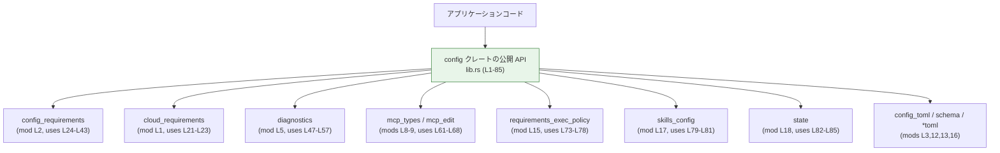
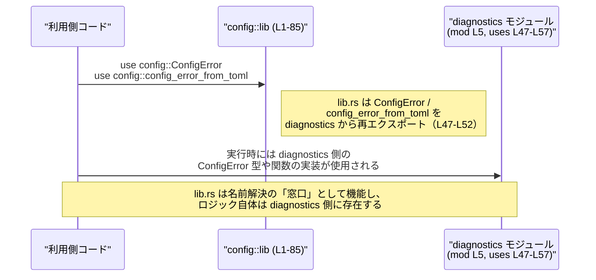

# config/src/lib.rs

## 0. ざっくり一言

`config` クレート全体の公開 API をひとまとめにする「ファサード（入口）」となるモジュールで、各種設定・要件・制約・診断などを扱うサブモジュールを宣言し、その主要なシンボルをトップレベルから再エクスポートしています（`lib.rs:L1-L19`, `L21-L85`）。

---

## 1. このモジュールの役割

### 1.1 概要

- このモジュールは、設定関連の複数のサブモジュール
  （例: `cloud_requirements`, `config_requirements`, `diagnostics` など）を宣言し（`lib.rs:L1-L19`）、
  そこからエラー型・設定型・ポリシー・補助関数などを再エクスポートします（`lib.rs:L21-L85`）。
- 利用側はサブモジュール名を意識せずに、`config::ConfigRequirements` や
  `config::ConfigError` のようにトップレベルから直接アクセスできるようになります（`lib.rs:L23-L28`, `L49-L50`）。

### 1.2 アーキテクチャ内での位置づけ

このファイルは `config` ライブラリクレートのルート（`lib.rs`）であり、外部コードから見たときの「公開窓口」となります。  
内部では複数の責務ごとのモジュールに分割されていて、そのシンボルを集約して再エクスポートしています（`lib.rs:L1-L19`, `L21-L85`）。

依存関係の概略は次のようになります。



- 外部コードは `lib.rs` を通して各種型・関数にアクセスします。
- `lib.rs` 自体はロジックを持たず、**名前の再エクスポートと 1 つの定数定義のみ**を行っています（`lib.rs:L20-L21`）。
- 実際の処理・安全性・エラーハンドリングは、各サブモジュール側の実装に依存します（このチャンクには現れません）。

### 1.3 設計上のポイント

コードから読み取れる設計上の特徴は次のとおりです。

- **ファサードとしての再エクスポート集中**  
  - ほぼすべての公開シンボルは `pub use` による再エクスポートで提供されています（`lib.rs:L21-L85`）。
  - 利用側はサブモジュール構成を知らなくてもよい構造になっています。
- **責務ごとのモジュール分割**  
  - 要件・制約: `cloud_requirements`, `config_requirements`, `requirements_exec_policy`, `constraint`（`lib.rs:L1-L2`, `L4`, `L15`）。
  - エラー・診断: `diagnostics`（`lib.rs:L5`, `L47-L57`）。
  - MCP 関連: `mcp_edit`, `mcp_types`, `marketplace_edit`（`lib.rs:L7-L9`, `L59-L68`）。
  - TOML 設定やプロファイル: `config_toml`, `permissions_toml`, `profile_toml`, `schema`（`lib.rs:L3`, `L12-L13`, `L16`）。
  - スキル設定: `skills_config`（`lib.rs:L17`, `L79-L81`）。
  - コンフィグレイヤー管理: `state`（`lib.rs:L18`, `L82-L85`）。
- **グローバルな定数の定義**  
  - `CONFIG_TOML_FILE` によって設定ファイル名 `"config.toml"` を一元的に定義しています（`lib.rs:L20`）。
- **状態や並行性に関するコードは無し**  
  - このファイルには構造体・関数・スレッドを扱うコードが一切なく、**スレッド安全性・同期処理などはすべてサブモジュール側に委ねられています**（`lib.rs:L1-L85`）。

---

## 2. 主要な機能一覧

このファイル自体は「機能の実装」ではなく「API の集約」が主目的ですが、公開されている機能群は次のように分類できます。

- **設定要件（requirements）関連の型・ローダー**  
  - 例: `CloudRequirementsLoader`, `ConfigRequirements`, 各種 `*Requirement*` 型などを再エクスポートしています（`lib.rs:L21-L23`, `L24-L45`）。
- **制約・制約評価関連**  
  - `Constrained`, `ConstraintError`, `ConstraintResult` や `RequirementsExecPolicy*` 一式を公開しています（`lib.rs:L44-L46`, `L73-L78`）。
- **設定ファイルの診断・エラーハンドリング**  
  - `ConfigError`, `ConfigLoadError` と、`config_error_from_toml`, `format_config_error_with_source` など診断用の関数と思われるシンボルを公開しています（`lib.rs:L47-L57`）。
- **設定ファイル／TOML 関連ユーティリティ**  
  - `CONFIG_TOML_FILE` 定数、`merge_toml_values`, `version_for_toml` などを公開しています（`lib.rs:L20`, `L58`, `L69`）。
- **MCP サーバー設定と編集・マーケットプレース連携関連**  
  - `McpServerConfig`, `RawMcpServerConfig`, `ConfigEditsBuilder`, `record_user_marketplace` など MCP 周辺の設定を扱うシンボルを公開しています（`lib.rs:L59-L62`, `L63-L68`）。
- **権限／プロファイル／スキルの設定**  
  - `permissions_toml`, `profile_toml`, `skills_config` モジュールのシンボルを公開しています（`lib.rs:L12-L13`, `L79-L81`）。
- **設定レイヤー管理**  
  - `ConfigLayerEntry`, `ConfigLayerStack`, `ConfigLayerStackOrdering`, `LoaderOverrides` を再エクスポートし、複数レイヤーからの設定読み込みを表現していると考えられます（`lib.rs:L82-L85`）。

※ 上記のうち、**具体的なロジックやフィールド構造はこのチャンクには現れず**、詳細は各サブモジュールの実装に依存します。

---

## 3. 公開 API と詳細解説

### 3.1 公開シンボル一覧（コンポーネントインベントリー）

#### 3.1.1 定数

| 名前 | 種別 | 役割 / 用途 | 根拠 |
|------|------|-------------|------|
| `CONFIG_TOML_FILE` | 定数 `&'static str` | 設定ファイル名 `"config.toml"` を表す定数。クレート内外で共通のファイル名として参照できるようにするための一元定義。 | `lib.rs:L20` |

#### 3.1.2 再エクスポートされるシンボル

> 種別（構造体／列挙体／関数など）は `pub use` の記述だけからは判別できないため、**「実体種別は不明」**としています。  
> 役割は「トップレベルへの再エクスポート」であることのみが確実に言えます。

| 名前 | 出典モジュール | 種別（このファイルから分かる範囲） | 役割 / 用途（このファイルから分かる範囲） | 根拠 |
|------|----------------|--------------------------------------|--------------------------------------------|------|
| `CloudRequirementsLoadError` | `cloud_requirements` | 不明 | `cloud_requirements::CloudRequirementsLoadError` をトップレベルから利用可能にする再エクスポート。 | `lib.rs:L21` |
| `CloudRequirementsLoadErrorCode` | `cloud_requirements` | 不明 | 同上。`CloudRequirementsLoadErrorCode` の再エクスポート。 | `lib.rs:L22` |
| `CloudRequirementsLoader` | `cloud_requirements` | 不明 | 同上。`CloudRequirementsLoader` の再エクスポート。 | `lib.rs:L23` |
| `AppRequirementToml` | `config_requirements` | 不明 | `config_requirements::AppRequirementToml` の再エクスポート。 | `lib.rs:L24` |
| `AppsRequirementsToml` | `config_requirements` | 不明 | 同上。`AppsRequirementsToml` の再エクスポート。 | `lib.rs:L25` |
| `ConfigRequirements` | `config_requirements` | 不明 | 同上。`ConfigRequirements` の再エクスポート。 | `lib.rs:L26` |
| `ConfigRequirementsToml` | `config_requirements` | 不明 | 同上。`ConfigRequirementsToml` の再エクスポート。 | `lib.rs:L27` |
| `ConfigRequirementsWithSources` | `config_requirements` | 不明 | 同上。`ConfigRequirementsWithSources` の再エクスポート。 | `lib.rs:L28` |
| `ConstrainedWithSource` | `config_requirements` | 不明 | 同上。`ConstrainedWithSource` の再エクスポート。 | `lib.rs:L29` |
| `FeatureRequirementsToml` | `config_requirements` | 不明 | 同上。`FeatureRequirementsToml` の再エクスポート。 | `lib.rs:L30` |
| `McpServerIdentity` | `config_requirements` | 不明 | 同上。`McpServerIdentity` の再エクスポート。 | `lib.rs:L31` |
| `McpServerRequirement` | `config_requirements` | 不明 | 同上。`McpServerRequirement` の再エクスポート。 | `lib.rs:L32` |
| `NetworkConstraints` | `config_requirements` | 不明 | 同上。`NetworkConstraints` の再エクスポート。 | `lib.rs:L33` |
| `NetworkDomainPermissionToml` | `config_requirements` | 不明 | 同上。`NetworkDomainPermissionToml` の再エクスポート。 | `lib.rs:L34` |
| `NetworkDomainPermissionsToml` | `config_requirements` | 不明 | 同上。`NetworkDomainPermissionsToml` の再エクスポート。 | `lib.rs:L35` |
| `NetworkRequirementsToml` | `config_requirements` | 不明 | 同上。`NetworkRequirementsToml` の再エクスポート。 | `lib.rs:L36` |
| `NetworkUnixSocketPermissionToml` | `config_requirements` | 不明 | 同上。`NetworkUnixSocketPermissionToml` の再エクスポート。 | `lib.rs:L37` |
| `NetworkUnixSocketPermissionsToml` | `config_requirements` | 不明 | 同上。`NetworkUnixSocketPermissionsToml` の再エクスポート。 | `lib.rs:L38` |
| `RequirementSource` | `config_requirements` | 不明 | 同上。`RequirementSource` の再エクスポート。 | `lib.rs:L39` |
| `ResidencyRequirement` | `config_requirements` | 不明 | 同上。`ResidencyRequirement` の再エクスポート。 | `lib.rs:L40` |
| `SandboxModeRequirement` | `config_requirements` | 不明 | 同上。`SandboxModeRequirement` の再エクスポート。 | `lib.rs:L41` |
| `Sourced` | `config_requirements` | 不明 | 同上。`Sourced` の再エクスポート。 | `lib.rs:L42` |
| `WebSearchModeRequirement` | `config_requirements` | 不明 | 同上。`WebSearchModeRequirement` の再エクスポート。 | `lib.rs:L43` |
| `Constrained` | `constraint` | 不明 | `constraint::Constrained` の再エクスポート。 | `lib.rs:L44` |
| `ConstraintError` | `constraint` | 不明 | 同上。`ConstraintError` の再エクスポート。 | `lib.rs:L45` |
| `ConstraintResult` | `constraint` | 不明 | 同上。`ConstraintResult` の再エクスポート。 | `lib.rs:L46` |
| `ConfigError` | `diagnostics` | 不明 | `diagnostics::ConfigError` の再エクスポート。 | `lib.rs:L47` |
| `ConfigLoadError` | `diagnostics` | 不明 | 同上。`ConfigLoadError` の再エクスポート。 | `lib.rs:L48` |
| `TextPosition` | `diagnostics` | 不明 | 同上。`TextPosition` の再エクスポート。 | `lib.rs:L49` |
| `TextRange` | `diagnostics` | 不明 | 同上。`TextRange` の再エクスポート。 | `lib.rs:L50` |
| `config_error_from_toml` | `diagnostics` | 不明（関数名のように見えるが未確認） | `diagnostics::config_error_from_toml` の再エクスポート。 | `lib.rs:L51` |
| `config_error_from_typed_toml` | `diagnostics` | 不明 | 同上。`config_error_from_typed_toml` の再エクスポート。 | `lib.rs:L52` |
| `first_layer_config_error` | `diagnostics` | 不明 | 同上。`first_layer_config_error` の再エクスポート。 | `lib.rs:L53` |
| `first_layer_config_error_from_entries` | `diagnostics` | 不明 | 同上。`first_layer_config_error_from_entries` の再エクスポート。 | `lib.rs:L54` |
| `format_config_error` | `diagnostics` | 不明 | 同上。`format_config_error` の再エクスポート。 | `lib.rs:L55` |
| `format_config_error_with_source` | `diagnostics` | 不明 | 同上。`format_config_error_with_source` の再エクスポート。 | `lib.rs:L56` |
| `io_error_from_config_error` | `diagnostics` | 不明 | 同上。`io_error_from_config_error` の再エクスポート。 | `lib.rs:L57` |
| `version_for_toml` | `fingerprint` | 不明 | `fingerprint::version_for_toml` の再エクスポート。 | `lib.rs:L58` |
| `MarketplaceConfigUpdate` | `marketplace_edit` | 不明 | `marketplace_edit::MarketplaceConfigUpdate` の再エクスポート。 | `lib.rs:L59` |
| `record_user_marketplace` | `marketplace_edit` | 不明 | 同上。`record_user_marketplace` の再エクスポート。 | `lib.rs:L60` |
| `ConfigEditsBuilder` | `mcp_edit` | 不明 | `mcp_edit::ConfigEditsBuilder` の再エクスポート。 | `lib.rs:L61` |
| `load_global_mcp_servers` | `mcp_edit` | 不明 | 同上。`load_global_mcp_servers` の再エクスポート。 | `lib.rs:L62` |
| `AppToolApproval` | `mcp_types` | 不明 | `mcp_types::AppToolApproval` の再エクスポート。 | `lib.rs:L63` |
| `McpServerConfig` | `mcp_types` | 不明 | 同上。`McpServerConfig` の再エクスポート。 | `lib.rs:L64` |
| `McpServerDisabledReason` | `mcp_types` | 不明 | 同上。`McpServerDisabledReason` の再エクスポート。 | `lib.rs:L65` |
| `McpServerToolConfig` | `mcp_types` | 不明 | 同上。`McpServerToolConfig` の再エクスポート。 | `lib.rs:L66` |
| `McpServerTransportConfig` | `mcp_types` | 不明 | 同上。`McpServerTransportConfig` の再エクスポート。 | `lib.rs:L67` |
| `RawMcpServerConfig` | `mcp_types` | 不明 | 同上。`RawMcpServerConfig` の再エクスポート。 | `lib.rs:L68` |
| `merge_toml_values` | `merge` | 不明 | `merge::merge_toml_values` の再エクスポート。 | `lib.rs:L69` |
| `build_cli_overrides_layer` | `overrides` | 不明 | `overrides::build_cli_overrides_layer` の再エクスポート。 | `lib.rs:L70` |
| `default_project_root_markers` | `project_root_markers` | 不明 | `project_root_markers::default_project_root_markers` の再エクスポート。 | `lib.rs:L71` |
| `project_root_markers_from_config` | `project_root_markers` | 不明 | 同上。`project_root_markers_from_config` の再エクスポート。 | `lib.rs:L72` |
| `RequirementsExecPolicy` | `requirements_exec_policy` | 不明 | `requirements_exec_policy::RequirementsExecPolicy` の再エクスポート。 | `lib.rs:L73` |
| `RequirementsExecPolicyDecisionToml` | `requirements_exec_policy` | 不明 | 同上。`RequirementsExecPolicyDecisionToml` の再エクスポート。 | `lib.rs:L74` |
| `RequirementsExecPolicyParseError` | `requirements_exec_policy` | 不明 | 同上。`RequirementsExecPolicyParseError` の再エクスポート。 | `lib.rs:L75` |
| `RequirementsExecPolicyPatternTokenToml` | `requirements_exec_policy` | 不明 | 同上。`RequirementsExecPolicyPatternTokenToml` の再エクスポート。 | `lib.rs:L76` |
| `RequirementsExecPolicyPrefixRuleToml` | `requirements_exec_policy` | 不明 | 同上。`RequirementsExecPolicyPrefixRuleToml` の再エクスポート。 | `lib.rs:L77` |
| `RequirementsExecPolicyToml` | `requirements_exec_policy` | 不明 | 同上。`RequirementsExecPolicyToml` の再エクスポート。 | `lib.rs:L78` |
| `BundledSkillsConfig` | `skills_config` | 不明 | `skills_config::BundledSkillsConfig` の再エクスポート。 | `lib.rs:L79` |
| `SkillConfig` | `skills_config` | 不明 | 同上。`SkillConfig` の再エクスポート。 | `lib.rs:L80` |
| `SkillsConfig` | `skills_config` | 不明 | 同上。`SkillsConfig` の再エクスポート。 | `lib.rs:L81` |
| `ConfigLayerEntry` | `state` | 不明 | `state::ConfigLayerEntry` の再エクスポート。 | `lib.rs:L82` |
| `ConfigLayerStack` | `state` | 不明 | 同上。`ConfigLayerStack` の再エクスポート。 | `lib.rs:L83` |
| `ConfigLayerStackOrdering` | `state` | 不明 | 同上。`ConfigLayerStackOrdering` の再エクスポート。 | `lib.rs:L84` |
| `LoaderOverrides` | `state` | 不明 | 同上。`LoaderOverrides` の再エクスポート。 | `lib.rs:L85` |

### 3.2 代表的な API 詳細

`lib.rs` が定義している実体としては `CONFIG_TOML_FILE` だけがあり、それ以外はすべて別モジュールの再エクスポートです（`lib.rs:L20-L21`）。  
ここでは **このファイル内で唯一定義されている API** である `CONFIG_TOML_FILE` について詳しく説明します。

#### `CONFIG_TOML_FILE: &str`

**概要**

- 設定ファイルの標準ファイル名 `"config.toml"` を表すグローバル定数です（`lib.rs:L20`）。
- 他のモジュールや外部コードが、ハードコードせずに同じファイル名を参照できるようにするための一元的な定義と考えられます。

**値と型**

- 型: `&'static str`（`"config.toml"` 文字列リテラルへの参照）（`lib.rs:L20`）。
- 内容: `"config.toml"`（`lib.rs:L20`）。

**内部処理の流れ**

- コンパイル時に `"config.toml"` という文字列リテラルが埋め込まれ、その参照が `CONFIG_TOML_FILE` として公開されます（`lib.rs:L20`）。
- 実行時に動的な処理やメモリアロケーションは発生しません（`&'static str` のため）。

**Examples（使用例）**

この定数を使って、`config.toml` ファイルを開く簡単な例です。  
クレート名をここでは便宜上 `config` としますが、実際のクレート名は `Cargo.toml` を確認する必要があります（このチャンクには現れません）。

```rust
use std::fs::File;
use std::io::Read;

// この例ではクレート名を "config" と仮定しています。
// 実際の名前は Cargo.toml を参照してください。
use config::CONFIG_TOML_FILE;

fn main() -> std::io::Result<()> {
    // CONFIG_TOML_FILE は "config.toml" を指す &'static str（lib.rs:L20）
    let mut file = File::open(CONFIG_TOML_FILE)?;  // "config.toml" を開く

    let mut contents = String::new();
    file.read_to_string(&mut contents)?;          // ファイル内容を読み込む

    println!("Loaded config from {}:\n{}", CONFIG_TOML_FILE, contents);
    Ok(())
}
```

**Errors / Panics**

- `CONFIG_TOML_FILE` 自体がエラーや panic を引き起こすことはありません。単なる文字列定数です（`lib.rs:L20`）。
- 上記の例で発生し得るエラー（ファイルが存在しない、権限がないなど）は、`std::fs::File::open` など標準ライブラリ側の挙動に依存します。

**Edge cases（エッジケース）**

- 空文字列になることはありません（値はコンパイル時に `"config.toml"` に固定されています、`lib.rs:L20`）。
- ロケールや OS に依存したパスではなく、単純な相対パス名です。  
  - 実行ディレクトリに `config.toml` が存在しない場合、ファイルアクセスは失敗します（ただしそれは呼び出し側の責務です）。

**使用上の注意点**

- パス解決は呼び出し側が行う必要があります。  
  たとえばプロジェクトルートを基準にしたい場合は、`project_root_markers` 関連の API などと組み合わせることが想定されますが、詳細はこのチャンクからは分かりません（`lib.rs:L71-L72`）。
- ファイル名を変更したい場合は、この定数を変更するだけではなく、周辺の設定ローダー処理（各サブモジュール）との整合性も確認する必要があります（実装はこのチャンクには現れません）。

### 3.3 その他の関数・型

- この `lib.rs` には、関数や構造体の**定義**は含まれていません（`lib.rs:L1-L85`）。
- すべてのロジックは、`mod` で宣言されたサブモジュール側で定義されており（`lib.rs:L1-L19`）、`pub use` によってトップレベルにエイリアスが張られています（`lib.rs:L21-L85`）。
- したがって、
  - **エラー型の詳細**（例: `ConfigError`, `RequirementsExecPolicyParseError`）  
  - **関数のシグネチャや戻り値**（例: `merge_toml_values`, `build_cli_overrides_layer`）  
  - **スレッド安全性やライフタイムの制約**  
  は、このチャンクだけからは分かりません。各モジュール（`diagnostics`, `merge`, `overrides` など）を参照する必要があります。

---

## 4. データフロー

このファイル自体に実行時ロジックはありませんが、**API 利用におけるシンボル解決の流れ**は次のようになります。

1. 外部コードが `use` 文などで `config` クレートのシンボルを参照する。
2. コンパイラは `config::X` という名前を `lib.rs` の `pub use` から該当サブモジュールのシンボルに解決する（`lib.rs:L21-L85`）。
3. 実行時には、各サブモジュールの実装が実際の処理（ファイル読み込み、検証、エラーレポートなど）を行う。

この流れを簡易なシーケンス図で示します。



- 上記は `diagnostics` を例にした図ですが、**`merge`, `overrides`, `mcp_types` など他のモジュールでも同様の構造**になります（`lib.rs:L58-L85`）。
- 並行性・I/O・エラー処理の実際のデータフローは、サブモジュールの実装に依存し、このチャンクには現れていません。

---

## 5. 使い方（How to Use）

### 5.1 基本的な使用方法

このファイルの意図は、利用側に「トップレベルからのシンプルなインポート」を提供することです（`lib.rs:L21-L85`）。

クレート名を仮に `config` とすると、典型的な利用は次のようになります（クレート名は実際の `Cargo.toml` を要確認）。

```rust
// 代表的な型や関数をトップレベルからインポート
use config::{
    CONFIG_TOML_FILE,       // 設定ファイル名（lib.rs:L20）
    ConfigRequirements,     // 設定要件関連（lib.rs:L26）
    ConfigError,            // 設定エラー（lib.rs:L47）
    ConfigLayerStack,       // 設定レイヤーのスタック（lib.rs:L83）
    // 必要に応じて他の再エクスポートも追加
};

fn main() {
    // CONFIG_TOML_FILE を使って設定ファイルのパスを組み立てる（lib.rs:L20）
    println!("Using default config file: {}", CONFIG_TOML_FILE);

    // ConfigRequirements や ConfigLayerStack を使った処理は
    // それぞれのモジュールの API 定義に依存するため、
    // ここでは詳細は省略します（lib.rs:L26, L83）。
}
```

このように、「どのサブモジュールがどの型を提供しているか」を意識せず、  
**`config::型名` / `config::関数名` という形で利用できる**のがこの `lib.rs` の提供する主な利点です。

### 5.2 よくある使用パターン

このチャンクから具体的なメソッド名や関数シグネチャは分からないため、あくまで利用パターンの**抽象的なイメージ**になります。

- **設定の読み込みと検証**  
  - `CONFIG_TOML_FILE` を使って TOML ファイルを読み込む。
  - 読み込んだ内容を、`ConfigRequirements` や `RequirementsExecPolicy*` 系の型を使って検証する（`lib.rs:L26`, `L73-L78`）。
  - エラーがあれば `ConfigError` や `ConfigLoadError` を用いて報告する（`lib.rs:L47-L48`）。

- **MCP サーバー設定の扱い**  
  - `RawMcpServerConfig` → `McpServerConfig` のような型変換や検証、
    `load_global_mcp_servers` によるグローバル設定のロードなどが名前から想像されますが、
    実装はこのチャンクには現れません（`lib.rs:L61-L68`）。

- **設定レイヤーのマージ・オーバーライド**  
  - `ConfigLayerStack` と `merge_toml_values`、`build_cli_overrides_layer` などの組み合わせで、
    ベース設定＋ CLI オーバーライドなどを表現していると考えられますが、詳細は各モジュールの実装次第です（`lib.rs:L69-L70`, `L83`）。

### 5.3 よくある間違い（推測されるもの）

`lib.rs` の構造から想像される誤用パターンと、その回避方法を記します。  
※ここでの内容は設計意図の**推測**を含みます。

```rust
// （推測される誤用例）サブモジュール経由で名前を直接参照する
// use config::diagnostics::ConfigError; // diagnostics モジュールを直接インポート

// 推奨される例: lib.rs の再エクスポート経由で参照する
use config::ConfigError; // lib.rs:L47 で再エクスポートされた名前を利用
```

- `lib.rs` が多数の再エクスポートを提供していること（`lib.rs:L21-L85`）から、
  **サブモジュールの階層を隠蔽し、トップレベル API を安定させたい**意図があると考えられます。
- そのため、利用側コードでは `config::ConfigError` のように、  
  **トップレベルの名前を使うほうが将来のモジュール再構成に強い**と考えられます。

### 5.4 使用上の注意点（まとめ）

この `lib.rs` に関して言える注意点は次のとおりです。

- **並行性・スレッド安全性**  
  - このファイルは定数と名前の再エクスポートのみを行い、グローバルな可変状態やスレッド操作を含みません（`lib.rs:L1-L85`）。
  - したがって、このファイル単体が並行性の問題を引き起こすことはありません。  
    並行性に関する制約は各サブモジュールの実装に依存します（このチャンクには現れません）。
- **エラーハンドリング**  
  - 多数の `*Error` や診断関連シンボルが再エクスポートされていますが（`lib.rs:L21-L22`, `L45`, `L47-L48`, `L75`）、  
    実際にどのような条件でエラーが発生し、どのように扱うべきかはサブモジュールの実装を確認する必要があります。
- **セキュリティ**  
  - このファイル自体には I/O や認可ロジックが存在せず（`lib.rs:L1-L85`）、  
    セキュリティ上の判断や検証はすべてサブモジュール側で行われると考えられます。
- **バージョン管理・互換性**  
  - 再エクスポートされた名前を API と見なすなら、これらのシンボル名や存在は外部利用者との「契約」です（`lib.rs:L21-L85`）。
  - 型名や関数名を変更する場合は、`lib.rs` 側の `pub use` を通じて互換性を保つかどうかを検討する必要があります。

---

## 6. 変更の仕方（How to Modify）

### 6.1 新しい機能を追加する場合

このファイルの役割は「モジュール宣言＋再エクスポート」です（`lib.rs:L1-L19`, `L21-L85`）。  
新しい機能を追加する典型的な手順は次のようになります。

1. **新しいサブモジュールを追加する**  
   - 例: `src/new_feature.rs` を作成し、その中に型や関数を定義する（このチャンクには現れません）。
   - `lib.rs` に `mod new_feature;` を追加してモジュールを登録する（`lib.rs:L1-L19` と同じ形式）。
2. **公開したいシンボルを再エクスポートする**  
   - `lib.rs` に `pub use new_feature::NewTypeOrFunc;` を追加する（`lib.rs:L21-L85` と同じ形式）。
3. **外部 API としての位置づけを意識する**  
   - ここで再エクスポートしたシンボルは「公開 API」となり、将来の変更に互換性の配慮が必要になります。

### 6.2 既存の機能を変更する場合

- **サブモジュール側の変更**  
  - ある型や関数のシグネチャや名前を変更した場合、`lib.rs` の対応する `pub use` も更新が必要です（`lib.rs:L21-L85`）。
- **API の削除・非推奨化**  
  - あるシンボルを外部公開しないようにしたい場合は、`pub use` を削除するか、  
    一旦 `pub use` は残したままサブモジュール側で非推奨属性（`#[deprecated]`）を付与するなどの対応が考えられますが、  
    具体的な戦略はこのチャンクからは分かりません。
- **影響範囲の確認**  
  - `lib.rs` が再エクスポートしているため、**利用側コードは `config::X` という形で広く依存している可能性があります**（`lib.rs:L21-L85`）。
  - 変更時には、クレート全体での参照箇所検索（`rg`, `cargo fix` など）で影響範囲を確認することが重要です。

---

## 7. 関連ファイル

`mod` 宣言から、この `lib.rs` と密接に関係するファイル（またはディレクトリ）は次の通りです（`lib.rs:L1-L19`）。

| パス（推定） | 役割 / 関係 |
|-------------|-------------|
| `config/src/cloud_requirements.rs` または `config/src/cloud_requirements/mod.rs` | `CloudRequirements*` 系シンボルの定義元。クラウド環境における要件読み込み関連と考えられますが、詳細は不明です。 |
| `config/src/config_requirements.rs` | `ConfigRequirements` や各種 `*Requirement*` 型の定義元。設定要件全般を扱うモジュール。 |
| `config/src/config_toml.rs` | `pub mod config_toml;` の定義先。`config.toml` に特化した読み書き機能があると推測されますが、このチャンクには現れません。 |
| `config/src/constraint.rs` | `Constrained`, `ConstraintError` などの定義元。制約表現と評価ロジックに関与していると考えられます。 |
| `config/src/diagnostics.rs` | `ConfigError` や各種診断関数の定義元。設定ファイルのエラーレポートや位置情報（`TextPosition`, `TextRange`）を扱うモジュール。 |
| `config/src/fingerprint.rs` | `version_for_toml` の定義元。設定やスキーマの fingerprint（版管理）に関する機能を持つと推測されます。 |
| `config/src/marketplace_edit.rs` | `MarketplaceConfigUpdate`, `record_user_marketplace` の定義元。マーケットプレース関連の設定更新処理に関与していると考えられます。 |
| `config/src/mcp_edit.rs` | `ConfigEditsBuilder`, `load_global_mcp_servers` の定義元。MCP サーバー関連の設定編集・ロード機構。 |
| `config/src/mcp_types.rs` | `McpServerConfig` など MCP サーバー設定型の定義元。 |
| `config/src/merge.rs` | `merge_toml_values` の定義元。TOML 値のマージロジック。 |
| `config/src/overrides.rs` | `build_cli_overrides_layer` の定義元。CLI 引数による設定オーバーライドのレイヤー構築に関与していると考えられます。 |
| `config/src/permissions_toml.rs` | `pub mod permissions_toml;` の定義先。権限設定用 TOML を扱うモジュール。 |
| `config/src/profile_toml.rs` | `pub mod profile_toml;` の定義先。プロファイル設定用 TOML を扱うモジュール。 |
| `config/src/project_root_markers.rs` | プロジェクトルートを検出するためのマーカー設定を扱うモジュール。`default_project_root_markers` 等の定義元。 |
| `config/src/requirements_exec_policy.rs` | `RequirementsExecPolicy*` 系の定義元。要件の実行ポリシーとその TOML 表現を扱うモジュール。 |
| `config/src/schema.rs` | `pub mod schema;` の定義先。設定スキーマ関連の定義が含まれると考えられます。 |
| `config/src/skills_config.rs` | `SkillsConfig` などスキル設定関連の定義元。 |
| `config/src/state.rs` | `ConfigLayerStack` 等の定義元。設定レイヤーのスタック管理やオーバーライド状態を表現するモジュール。 |
| `config/src/types.rs` | `pub mod types;` の定義先。設定全体を通じて使われる共通型群を提供するモジュールと考えられます。 |

※ 上記パスは Rust の標準的なモジュール構造に基づく推定であり、実際には `mod.rs` 構成など別の構造である可能性もあります。その場合でも、**いずれかの場所に対応するモジュールが存在すること自体は `mod` 宣言から確実です**（`lib.rs:L1-L19`）。

---

### このファイルに関するバグ・セキュリティ・性能などのまとめ

- **バグの可能性**  
  - `lib.rs` 自体はロジックを持たないため、典型的なバグ（計算ミス、境界チェック漏れなど）は存在しません（`lib.rs:L1-L85`）。
  - 唯一注意すべき点は、`CONFIG_TOML_FILE` の値と実際に期待される設定ファイル名が乖離した場合、  
    利用側が誤ったファイルを参照する可能性があることです（`lib.rs:L20`）。
- **セキュリティ**  
  - このファイルに直接 I/O や権限制御のロジックはなく、セキュリティ上の影響はサブモジュールに委ねられています（`lib.rs:L1-L85`）。
- **テスト**  
  - `lib.rs` 内にはテストコード（`#[cfg(test)]` 等）は存在しません（`lib.rs:L1-L85`）。  
    再エクスポートの正しさは、通常はコンパイラの型チェックとサブモジュール側のテストで保証されます。
- **性能・スケーラビリティ**  
  - 再エクスポートと定数定義のみであり、実行時のオーバーヘッドは事実上ありません（`lib.rs:L1-L85`）。  
    性能特性はすべてサブモジュールの実装に依存します。
- **観測性（ログ・メトリクス）**  
  - このファイルにはログ出力やメトリクス送信に関するコードは含まれていません（`lib.rs:L1-L85`）。  
    観測性に関する設計は各サブモジュールレベルで確認する必要があります。
