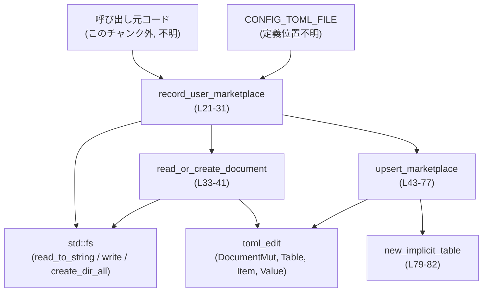
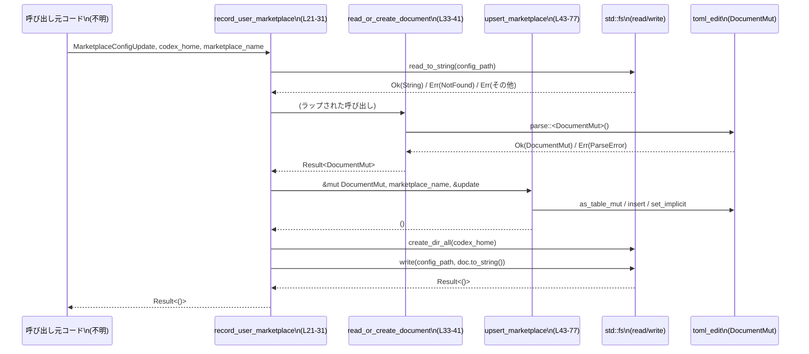

config\src\marketplace_edit.rs

---

## 0. ざっくり一言

ユーザー指定のマーケットプレイス情報を、TOML 形式の設定ファイル（`CONFIG_TOML_FILE`）内の `marketplaces` テーブルに「作成 or 更新」して書き戻すためのユーティリティです（`record_user_marketplace` と `upsert_marketplace` が中心）（config\src\marketplace_edit.rs:L21-31, L43-77）。

---

## 1. このモジュールの役割

### 1.1 概要

- このモジュールは、設定ディレクトリ（`codex_home`）以下にある TOML 設定ファイル（`CONFIG_TOML_FILE`）を読み込み、ユーザーのマーケットプレイス設定を追記・更新するために存在しています（L21-27）。
- TOML の編集には `toml_edit::DocumentMut` を用い、`marketplaces` テーブル以下にマーケットプレイス名をキーとするサブテーブルを作成し、メタ情報（`last_updated`, `source_type`, `source`, `ref`, `sparse_paths`）を書き込みます（L43-52, L63-76）。
- 設定ファイルが存在しない場合は空の TOML ドキュメントを生成し、存在するが TOML として不正な場合は `std::io::ErrorKind::InvalidData` としてエラーを返します（L33-39）。

### 1.2 アーキテクチャ内での位置づけ

このファイル内の関数の呼び出し関係と外部依存を簡略化して示します。



- 外部から直接呼ばれるのは `record_user_marketplace` です（pub 関数, L21）。
- ファイル I/O はすべて `std::fs` を通じて行われます（`read_to_string`, `write`, `create_dir_all`, L34, L29-30）。
- TOML のパース・編集は `toml_edit` クレートに依存しています（L5-9, L33-37, L43-76, L79-82）。
- `CONFIG_TOML_FILE` はクレート内のどこかで定義された定数であり、このチャンクには定義が現れません（L11）。

### 1.3 設計上のポイント

- **読み込みと編集の分離**  
  - 設定ファイルの読み込み / 新規作成は `read_or_create_document` に分離されています（L33-41）。
  - 実際の TOML 構造の更新は `upsert_marketplace` に切り出されています（L43-77）。
- **エラーハンドリング**  
  - I/O と TOML パースの結果は `std::io::Result` で扱い、`?` 演算子で呼び出し元へ伝播します（L25-27, L33-39）。
  - ファイルが存在しない場合のみ正常扱いとして新規ドキュメントを返し、それ以外の I/O エラーはそのまま返却します（L34-39）。
- **TOML テーブルの防御的な扱い**  
  - `marketplaces` キーが存在しない場合には新しい「暗黙テーブル」を挿入し（L49-51, L79-82）、存在してもテーブルでなければテーブルに置き換えます（L56-58）。
  - `get_mut` / `as_table_mut` の結果を `let Some(...) else { return; }` でチェックし、取得に失敗した場合は静かに何もせず戻ります（L53-55, L60-62）。
- **所有権とライフタイム**  
  - 更新内容は `MarketplaceConfigUpdate<'a>` として借用 (`&str`, `&[String]`) で受け取り、必要なところで `String` に変換しています（L13-19, L65-67）。  
    これにより、呼び出し側のデータをコピーし過ぎないようにしつつ、TOML 側には所有権付きの文字列を保存します。

---

## 2. 主要な機能一覧

このモジュールが提供する主な機能です。

- マーケットプレイス設定の記録・更新: `record_user_marketplace` で、指定マーケットプレイスのエントリを TOML 設定に upsert（作成 or 更新）します（L21-31, L43-77）。
- 設定ファイルの読み込みまたは新規生成: `read_or_create_document` で、既存ファイルを TOML としてパースし、なければ空ドキュメントを返します（L33-41）。
- `marketplaces` テーブルの整形・初期化: `upsert_marketplace` と `new_implicit_table` で、`marketplaces` テーブルとそのサブテーブルを適切な implicit/explicit 設定で構築します（L43-52, L63-76, L79-82）。

---

## 3. 公開 API と詳細解説

### 3.1 型一覧（構造体・列挙体など）

| 名前 | 種別 | 役割 / 用途 | 定義位置 |
|------|------|-------------|----------|
| `MarketplaceConfigUpdate<'a>` | 構造体 | マーケットプレイスの更新内容（タイムスタンプ、ソース種別・場所、参照名、スパースパス群）を借用参照としてまとめて渡すためのコンテナです。 | config\src\marketplace_edit.rs:L13-19 |

フィールドの概要:

- `last_updated: &'a str` – 更新時刻などを表す文字列（フォーマットはこのチャンクからは不明）（L14）。
- `source_type: &'a str` – ソースの種別（例: git, local などが想定されますが、このチャンクからは断定できません）（L15）。
- `source: &'a str` – 実際のソース位置（URL やパスなどが想定されますが、同上）（L16）。
- `ref_name: Option<&'a str>` – Git のブランチ/タグ名のような参照名を任意で格納（L17）。
- `sparse_paths: &'a [String]` – スパースチェックアウトや部分取得に使うパスの配列（L18）。

### 3.2 関数詳細

#### `record_user_marketplace(codex_home: &Path, marketplace_name: &str, update: &MarketplaceConfigUpdate<'_>) -> std::io::Result<()>`

**概要**

- 設定ディレクトリ `codex_home` 以下の `CONFIG_TOML_FILE` を読み込み（または新規作成）し、`marketplaces` テーブル内の `marketplace_name` エントリを `update` の内容で作成または更新したあと、ファイルに書き戻します（L21-31）。

**引数**

| 引数名 | 型 | 説明 |
|--------|----|------|
| `codex_home` | `&Path` | 設定ファイルを含むディレクトリのパス。`codex_home.join(CONFIG_TOML_FILE)` が実際のファイルパスになります（L22, L26）。 |
| `marketplace_name` | `&str` | `marketplaces` テーブル内のキーとして使われるマーケットプレイス名です（L23, L76）。 |
| `update` | `&MarketplaceConfigUpdate<'_>` | 書き込むマーケットプレイス情報（L24, L65-72）。 |

**戻り値**

- `std::io::Result<()>`  
  - 成功時: `Ok(())` を返します。  
  - 失敗時: ファイルの読み書きや TOML パース時のエラーを `std::io::Error` として返します（L25-27, L30, L33-39）。

**内部処理の流れ（アルゴリズム）**

1. `config_path = codex_home.join(CONFIG_TOML_FILE)` で設定ファイルのパスを組み立てます（L26）。
2. `read_or_create_document(&config_path)?` を呼び出し、既存ファイルを読み込むか、なければ新規ドキュメントを取得します（L27, L33-39）。
3. `upsert_marketplace(&mut doc, marketplace_name, update)` で TOML ドキュメント内の `marketplaces` テーブルにエントリを書き込みます（L28, L43-77）。
4. `fs::create_dir_all(codex_home)?` で `codex_home` ディレクトリの存在を保証します（L29）。
5. `fs::write(config_path, doc.to_string())` で TOML ドキュメント全体を文字列化してファイルに書き戻します（L30）。

**Examples（使用例）**

以下は、マーケットプレイスを 1 件記録する呼び出し例です。  
モジュールパスはプロジェクト構成に依存するため、`use` のパスは仮のものとします（このチャンクからは不明）。

```rust
use std::path::PathBuf;
// 仮のモジュールパス。実際にはプロジェクトの構成に合わせて変更する必要があります。
use crate::marketplace_edit::{MarketplaceConfigUpdate, record_user_marketplace};

fn main() -> std::io::Result<()> {
    // 設定ディレクトリのパス（例）
    let codex_home = PathBuf::from("/home/user/.codex");

    // 更新情報の元となるデータ
    let last_updated = "2024-01-01T12:00:00Z";     // 更新日時
    let source_type = "git";                       // ソース種別
    let source = "https://example.com/repo.git";   // リポジトリURL
    let ref_name = Some("main");                   // ブランチ名
    let sparse_paths_vec = vec![
        "path/one".to_string(),
        "path/two".to_string(),
    ];

    // MarketplaceConfigUpdate は借用を保持する構造体なので、
    // 先に元データを用意し、その参照を渡す必要があります。
    let update = MarketplaceConfigUpdate {
        last_updated,
        source_type,
        source,
        ref_name,
        sparse_paths: &sparse_paths_vec,
    };

    // "my-marketplace" という名前のマーケットプレイス設定を記録/更新する
    record_user_marketplace(&codex_home, "my-marketplace", &update)
}
```

**Errors / Panics**

- エラーになりうる条件（いずれも `Err(std::io::Error)`）:
  - `read_or_create_document` 内の `fs::read_to_string` が `NotFound` 以外の I/O エラーを返した場合（L34, L39）。
  - `read_or_create_document` 内で TOML パースに失敗した場合、`ErrorKind::InvalidData` でラップされたエラーが返ります（L35-37）。
  - `fs::create_dir_all(codex_home)` がディレクトリ作成に失敗した場合（L29）。
  - `fs::write(config_path, doc.to_string())` が書き込みに失敗した場合（L30）。
- panic:
  - この関数自体には `unwrap` や `expect` などの明示的な panic 要因は含まれていません（L21-31）。  
    外部クレート内部の panic 可能性については、このチャンクだけからは判断できません。

**Edge cases（エッジケース）**

- 設定ファイルが存在しない場合  
  - `ErrorKind::NotFound` が返ってくると `DocumentMut::new()` を返し、そのまま新規ファイルとして書き出します（L34, L38）。
- 設定ファイルが存在するが TOML として不正な場合  
  - `parse::<DocumentMut>()` がエラーになり、`ErrorKind::InvalidData` として呼び出し元にエラーが伝播します（L35-37）。
- `codex_home` が存在しないディレクトリの場合  
  - `create_dir_all` によってディレクトリごと作成されます（L29）。
- `codex_home` が実際にはファイルパスだった場合  
  - `create_dir_all` はファイルパスに対してもディレクトリ作成を試みるため、エラーになる可能性があります。この挙動は `std::fs::create_dir_all` に依存し、このチャンクから詳細は分かりません（L29）。
- `marketplace_name` が既存エントリと同じ場合  
  - `TomlTable::insert(marketplace_name, ...)` による挙動に従います（通常のマップと同様であれば上書きになる想定ですが、厳密な挙動は toml_edit の仕様に依存し、このチャンクからは断定できません）（L76）。

**使用上の注意点**

- `codex_home` は「設定ディレクトリのパス」であることが前提です。  
  ファイルパスを渡すと `create_dir_all` の挙動と期待が食い違う可能性があります（L26, L29）。
- `MarketplaceConfigUpdate` のフィールドはすべて借用（`&str`, `&[String]`）であり、構造体のライフタイム `'a` 中は元のデータが有効である必要があります（L13-19）。
- ファイル I/O を伴うため、高頻度で呼び出すとパフォーマンスに影響する可能性があります。特に `doc.to_string()` によって TOML 全体を毎回シリアライズしている点に注意が必要です（L30）。
- 複数スレッドや複数プロセスから同じ `codex_home` / `CONFIG_TOML_FILE` に対して同時に呼び出すと、ファイルの同時書き込みによる race condition が起き得ます。排他制御はこのモジュールでは行っていません（L26-30）。

---

#### `read_or_create_document(config_path: &Path) -> std::io::Result<DocumentMut>`

**概要**

- 指定されたパスから TOML ファイルを読み込み `DocumentMut` としてパースします。  
  ファイルが存在しない場合は空の `DocumentMut` を返し、それ以外のエラーはそのまま返します（L33-41）。

**引数**

| 引数名 | 型 | 説明 |
|--------|----|------|
| `config_path` | `&Path` | 読み込む設定ファイルのパス（L33-34）。 |

**戻り値**

- `std::io::Result<DocumentMut>`  
  - 成功時: パース済み TOML ドキュメント `DocumentMut` を返します（L35-38）。
  - 失敗時: `std::io::Error` を返します（L34, L39）。

**内部処理の流れ**

1. `fs::read_to_string(config_path)` でファイルの内容を文字列として読み込みます（L34）。
2. `match` で結果を分岐します（L34-40）。
   - `Ok(raw)` の場合: `raw.parse::<DocumentMut>()` で TOML パースを試み、失敗した場合には `ErrorKind::InvalidData` を持つ `std::io::Error` に変換します（L35-37）。
   - `Err(err)` で、`err.kind() == ErrorKind::NotFound` の場合は `DocumentMut::new()` で新しい空ドキュメントを返します（L38）。
   - それ以外の `Err(err)` の場合は、そのまま `Err(err)` を返します（L39）。

**Examples（使用例）**

```rust
use std::path::Path;
use toml_edit::DocumentMut;

// 仮のモジュールパス
use crate::marketplace_edit::read_or_create_document;

fn load_config(path: &Path) -> std::io::Result<DocumentMut> {
    // ファイルがなければ空ドキュメントが返る
    let doc = read_or_create_document(path)?;
    Ok(doc)
}
```

**Errors / Panics**

- エラー条件:
  - `fs::read_to_string` が `NotFound` 以外の I/O エラーを返した場合、それがそのまま返されます（L34, L39）。
  - 文字列からの `parse::<DocumentMut>()` が失敗した場合は、`ErrorKind::InvalidData` の `std::io::Error` として返されます（L35-37）。
- panic:
  - 明示的な panic はありません。`match` で網羅的に分岐しており、`unwrap` 等も利用していません（L33-40）。

**Edge cases**

- ファイルが存在しない (`ErrorKind::NotFound`)  
  - `Ok(DocumentMut::new())` を返すため、呼び出し元からは「空の設定ファイルを扱う」形になります（L38）。
- 空ファイルまたは内容が空文字列  
  - `parse::<DocumentMut>()` の成否は `toml_edit` の仕様に依存します。このチャンクでは、成功するかどうかまでは分かりません（L35-37）。
- 大きなファイル  
  - 全体を `String` に読み込んでからパースする実装のため、ファイルサイズに比例したメモリを一度に確保します（L34-37）。

**使用上の注意点**

- 設定ファイルのフォーマットが TOML であることが前提です。  
  そうでない場合 `InvalidData` エラーが発生します（L35-37）。
- 存在しない場合に新規ドキュメントを返す挙動が「正常ケース」として扱われるため、「ファイルがあること」を前提にした存在チェックは呼び出し側で行う必要があります（L38）。

---

#### `upsert_marketplace(doc: &mut DocumentMut, marketplace_name: &str, update: &MarketplaceConfigUpdate<'_>)`

**概要**

- `doc` のルートテーブルに `marketplaces` テーブルを確保し、その中に `marketplace_name` サブテーブルを `update` の内容で作成または更新します（L43-52, L63-76）。

**引数**

| 引数名 | 型 | 説明 |
|--------|----|------|
| `doc` | `&mut DocumentMut` | 更新対象となる TOML ドキュメント（L44, L48）。 |
| `marketplace_name` | `&str` | `marketplaces` テーブルのキーとなるマーケットプレイス名（L45, L76）。 |
| `update` | `&MarketplaceConfigUpdate<'_>` | 書き込むマーケットプレイス情報（L46, L65-72）。 |

**戻り値**

- なし（`()`）。  
  エラーは返さず、異常な状態の場合は早期 `return` して何も更新しない実装になっています（L53-55, L60-62）。

**内部処理の流れ**

1. `let root = doc.as_table_mut();` でルートテーブルへの可変参照を取得します（L48）。
2. ルートに `marketplaces` キーがなければ、新しい暗黙テーブルを挿入します（`new_implicit_table()` 利用）（L49-51, L79-82）。
3. `root.get_mut("marketplaces")` で `marketplaces` の `Item` を取得し、`None` なら何もせず `return;` します（L53-55）。
4. 取得した `Item` がテーブルでなければ、新しい暗黙テーブルで上書きします（L56-58）。
5. `marketplaces_item.as_table_mut()` でテーブルとしての可変参照を取得し、`None` の場合は同様に `return;` します（L60-62）。
6. 新しい `TomlTable` を作成し、暗黙フラグを `false` に設定します（L63-64）。
7. `entry["last_updated"]`, `entry["source_type"]`, `entry["source"]` に `update` の値を `String` 化して `value(...)` 経由で設定します（L65-67）。
8. `update.ref_name` が `Some` の場合、`entry["ref"]` として書き込みます（L68-70）。
9. `update.sparse_paths` が空でない場合、`TomlValue::Array` として `entry["sparse_paths"]` に設定します（L71-74）。
10. 最後に、`marketplaces.insert(marketplace_name, TomlItem::Table(entry));` で `marketplaces` テーブルにこのエントリを登録します（L76）。

**Examples（使用例）**

以下は既存の `DocumentMut` に対して `upsert_marketplace` のみを利用する例です。

```rust
use toml_edit::DocumentMut;
// 仮のモジュールパス
use crate::marketplace_edit::{upsert_marketplace, MarketplaceConfigUpdate};

fn add_marketplace(doc: &mut DocumentMut) {
    let sparse_paths_vec = vec!["a".to_string(), "b".to_string()];

    let update = MarketplaceConfigUpdate {
        last_updated: "2024-01-01T00:00:00Z",
        source_type: "git",
        source: "https://example.com/repo.git",
        ref_name: None,
        sparse_paths: &sparse_paths_vec,
    };

    upsert_marketplace(doc, "my-marketplace", &update);
    // doc には [marketplaces.my-marketplace] テーブルが追加・更新されている
}
```

**Errors / Panics**

- エラー型は返さない設計です（戻り値が `()`、L43-47）。
- panic:
  - `unwrap` などを使わず、`let Some(...) else { return; }` による防御的な分岐を行っているため、この関数内での明示的な panic はありません（L53-55, L60-62）。

**Edge cases**

- ルートに `marketplaces` キーがまったくない場合  
  - `new_implicit_table()` で新規テーブルを挿入した後、通常は `get_mut` 成功が期待されます（L49-51, L53）。  
    もし `get_mut` が `None` を返した場合は、何もせず `return` します（L53-55）。
- `marketplaces` キーが存在するがテーブルではない場合  
  - `marketplaces_item.is_table()` が `false` のため、新しい暗黙テーブルに置き換えます（L56-58）。
- `marketplaces_item.as_table_mut()` が `None` を返す場合  
  - このケースでは何もせず `return` します（L60-62）。通常の実装では `is_table()` が `true` ならば `as_table_mut()` も `Some` が期待されますが、ここでは念のため早期リターンで防御しています。
- `update.ref_name` が `None` の場合  
  - `ref` キーは作成されません（L68-70）。
- `update.sparse_paths` が空スライスの場合  
  - `sparse_paths` キーは作成されません（L71-72）。
- 既存の `marketplace_name` エントリがある場合  
  - `insert` の挙動（上書きかどうか）は `TomlTable::insert` の仕様に従います（L76）。  
    一般的なマップでは上書きされますが、ここでは仕様を断定しません。

**使用上の注意点**

- この関数はエラーを返さず、異常ケースでは黙って何もしない（早期 `return`）ため、エラー検出は呼び出し側からはできません（L53-55, L60-62）。  
  TOML 構造が予想通りであることを前提に使う設計です。
- フィールド名（`last_updated`, `source_type`, `source`, `ref`, `sparse_paths`）は設定ファイルのスキーマになります。変更すると既存ファイルとの互換性に影響します（L65-72）。

---

#### `new_implicit_table() -> TomlTable`

**概要**

- `toml_edit::Table` を新規作成し、`implicit` フラグを `true` に設定して返します（L79-82）。  
  これは `marketplaces` などの中間テーブルを暗黙的なテーブルとして扱うために使われます（L49-51, L56-58）。

**引数**

- なし。

**戻り値**

- `TomlTable` – `toml_edit::Table` 型。`implicit` フラグが `true` に設定された新しい空テーブルです（L79-82）。

**内部処理の流れ**

1. `TomlTable::new()` で新しいテーブルを作成します（L80）。
2. `table.set_implicit(true);` で暗黙テーブルとしてマークします（L81）。
3. テーブルを返します（L82）。

**Examples（使用例）**

`upsert_marketplace` 内部での利用例のみがこのファイルにあります（L49-51, L56-58）。外部から直接呼ぶ必然性は低いヘルパー関数です。

```rust
use toml_edit::Table as TomlTable;
// 仮のモジュールパス
use crate::marketplace_edit::new_implicit_table;

fn make_table() -> TomlTable {
    let t = new_implicit_table();
    // t は暗黙テーブルとして扱われる
    t
}
```

**Errors / Panics**

- エラーも panic も起こしません（単純な構築のみ、L79-82）。

**Edge cases**

- 特筆すべきエッジケースはありません。常に新しい空テーブルを返します（L79-82）。

**使用上の注意点**

- 暗黙テーブル（`implicit = true`）と明示テーブル（`implicit = false`）の違いは `toml_edit` のフォーマット・シリアライズ結果に影響します。  
  この関数はルート直下などの中間テーブル用として使われています（L49-51）。

---

### 3.3 その他の関数

このファイル内の関数は、すべて 3.2 節で詳細解説済みです。補助的な未解説関数はありません（L21-31, L33-41, L43-77, L79-82）。

---

## 4. データフロー

典型的なシナリオ: 「ユーザーがマーケットプレイスを登録する」場合のデータフローを示します。

1. 呼び出し元が `MarketplaceConfigUpdate` を構築し、`record_user_marketplace` を呼び出します（L13-19, L21-24）。
2. `record_user_marketplace` が `codex_home` と `CONFIG_TOML_FILE` から設定ファイルパスを組み立て、`read_or_create_document` で `DocumentMut` を取得します（L26-27, L33-41）。
3. `upsert_marketplace` が `DocumentMut` を編集し、`marketplaces.<marketplace_name>` サブテーブルに情報を書き込みます（L43-52, L63-76）。
4. `record_user_marketplace` が `codex_home` ディレクトリを作成（必要なら）し、更新された `DocumentMut` を TOML 文字列へ変換してファイルに書き戻します（L29-30）。



この図は、主にこのチャンクの関数 `record_user_marketplace (L21-31)`, `read_or_create_document (L33-41)`, `upsert_marketplace (L43-77)` の相互作用を表しています。

---

## 5. 使い方（How to Use）

### 5.1 基本的な使用方法

`record_user_marketplace` を用いてマーケットプレイスを登録する典型的なコードフローです。

```rust
use std::path::PathBuf;
// 仮のモジュールパス。実際のパスはプロジェクト構成に依存します。
use crate::marketplace_edit::{MarketplaceConfigUpdate, record_user_marketplace};

fn configure_marketplace() -> std::io::Result<()> {
    // 設定ディレクトリのパス
    let codex_home = PathBuf::from("/home/user/.codex");

    // 元データを用意する（update はこれらへの参照を保持する）
    let last_updated = "2024-01-01T00:00:00Z";
    let source_type = "git";
    let source = "https://example.com/repo.git";
    let ref_name = Some("main");
    let sparse_paths_vec = vec![
        "crates/foo".to_string(),
        "crates/bar".to_string(),
    ];

    // 更新内容を構築
    let update = MarketplaceConfigUpdate {
        last_updated,
        source_type,
        source,
        ref_name,
        sparse_paths: &sparse_paths_vec,
    };

    // 設定ファイルを読み書きし、マーケットプレイス設定を upsert
    record_user_marketplace(&codex_home, "example-marketplace", &update)
}
```

- 呼び出し側では、`MarketplaceConfigUpdate` のフィールドとなる文字列やベクタを、構造体よりも長く生存させる必要があります（借用のため, L13-19）。
- I/O エラーは `std::io::Result` として返るため、`?` で呼び出し元へ伝播するか、`match` で明示的に処理することができます（L21-31）。

### 5.2 よくある使用パターン

1. **参照名を持たないマーケットプレイス**

```rust
let sparse_paths_vec = Vec::<String>::new(); // スパースパスなし

let update = MarketplaceConfigUpdate {
    last_updated: "2024-01-01T00:00:00Z",
    source_type: "local",
    source: "/path/to/local/dir",
    ref_name: None,                    // ref キーを出力しない
    sparse_paths: &sparse_paths_vec,   // 空 -> sparse_paths キーも出力されない（L71-72）
};
record_user_marketplace(&codex_home, "local-marketplace", &update)?;
```

1. **複数回の更新（同じ `marketplace_name`）**

```rust
let update1 = /* ... */;
record_user_marketplace(&codex_home, "my-marketplace", &update1)?;

// 後から別のソースで上書き（または insert の仕様に従った挙動）
let update2 = /* ... */;
record_user_marketplace(&codex_home, "my-marketplace", &update2)?;
```

- 2 回目の呼び出しでは、`upsert_marketplace` が再度 `marketplace_name` のエントリを設定します（L76）。  
  その結果が「上書き」になるかどうかは `TomlTable::insert` の仕様に依存します。

### 5.3 よくある間違い

1. **`codex_home` にファイルパスを渡してしまう**

```rust
// 間違い例: ファイルパスを直接渡している
let codex_home = PathBuf::from("/home/user/.codex/config.toml");
let res = record_user_marketplace(&codex_home, "x", &update);
// create_dir_all が "…/config.toml" ディレクトリ作成を試みるため意図しない動作になる可能性（L26, L29）

// 正しい例: ディレクトリを渡し、CONFIG_TOML_FILE との join は関数に任せる
let codex_home = PathBuf::from("/home/user/.codex");
let res = record_user_marketplace(&codex_home, "x", &update);
```

1. **`MarketplaceConfigUpdate` に一時値の参照を渡そうとする**

```rust
// 間違い例（コンパイルエラーになる）
let update = MarketplaceConfigUpdate {
    last_updated: &String::from("2024-01-01"), // 一時的な String への参照
    // ...
};
// 一時値はこの行の終わりでドロップされるため、ライフタイムが足りずコンパイルできない

// 正しい例
let last_updated_owned = String::from("2024-01-01");
let update = MarketplaceConfigUpdate {
    last_updated: &last_updated_owned, // 所有者は外側の変数で、update より長く生存
    // ...
};
```

### 5.4 使用上の注意点（まとめ）

- **I/O エラーの取り扱い**  
  - すべての I/O は `std::io::Result` を通して表現されるため、呼び出し側で確実にハンドリングする必要があります（L21-31, L33-41）。
- **ライフタイムと所有権**  
  - `MarketplaceConfigUpdate` は借用を保持するため、元データを十分に長く生存させる必要があります（L13-19）。
- **並行アクセス**  
  - 同じ設定ファイルに対して複数のスレッドやプロセスから同時に `record_user_marketplace` を呼ぶ場合、最後に書いたものだけが残るなどの race condition が起こり得ます。  
    このモジュールはロックなどの排他制御を実装していません（L26-30）。
- **パフォーマンス**  
  - 設定ファイル全体を毎回読み込み、再シリアライズして書き戻す設計のため、大きな設定ファイルではオーバーヘッドが増加します（L34-37, L30）。
- **ロギング・観測性**  
  - このモジュール自体はログ出力やメトリクスを一切行っていません（L1-83）。  
    失敗時に得られる情報は `std::io::Error` の内容に限られます。

---

## 6. 変更の仕方（How to Modify）

### 6.1 新しい機能を追加する場合

例: マーケットプレイス設定に `priority` フィールドを追加したい場合。

1. **構造体へのフィールド追加**  
   - `MarketplaceConfigUpdate` に `pub priority: i64` などのフィールドを追加します（L13-19 を修正）。
2. **TOML への書き込みロジック追加**  
   - `upsert_marketplace` 内で `entry["priority"] = value(update.priority);` のようにフィールドを追加します（L63-67 あたりに追記）。
3. **呼び出し側の更新**  
   - `MarketplaceConfigUpdate` を構築している全ての呼び出し箇所で、新フィールドを設定するように修正します（このチャンクには呼び出し側のコードは含まれていません）。
4. **互換性の確認**  
   - 既存設定ファイルに新フィールドがない場合でも問題なく読み込めるか（通常は問題ありませんが、他のロジックとの連携次第です）を確認します。

### 6.2 既存の機能を変更する場合

- **フィールド名の変更（例: `source_type` → `kind`）**
  - `MarketplaceConfigUpdate` のフィールド名と型を変更します（L13-19）。
  - `upsert_marketplace` で使用しているキー名 (`entry["source_type"]`) を新しいキー名に合わせて変更します（L66）。
  - 呼び出し側で構築しているフィールド名も合わせて修正します（呼び出し側コードはこのチャンクにはありません）。
- **エラーハンドリング方針の変更**
  - `upsert_marketplace` がエラーを返すようにしたい場合は、戻り値を `std::io::Result<()>` などに変更し、`None` ケースで `Err` を返すような実装に書き換えます（L43-47, L53-55, L60-62）。
  - それに伴い `record_user_marketplace` からの呼び出しも `?` によってエラーを伝播できるようになります（L28）。
- **設定ファイルパスの変更**
  - `CONFIG_TOML_FILE` の値を変更する場合、このファイルのコードには手を入れる必要はありません（L11, L26）。  
    ただし、他のモジュールで `CONFIG_TOML_FILE` を前提にしている箇所がないか確認する必要があります。

変更時には、`marketplaces` テーブルのスキーマ（キー名・型）が他のモジュールや既存ファイルから参照されていないかを確認することが重要です。

---

## 7. 関連ファイル

このモジュールと密接に関係する要素をまとめます。

| パス / シンボル | 役割 / 関係 |
|-----------------|------------|
| `crate::CONFIG_TOML_FILE` | 設定ファイル名（またはパスの一部）を表す定数。`codex_home.join(CONFIG_TOML_FILE)` でファイルパスが組み立てられます（config\src\marketplace_edit.rs:L11, L26）。定義場所はこのチャンクには現れません。 |
| `toml_edit` クレート | TOML ドキュメントのパース・編集を提供する外部クレート。`DocumentMut`, `Item`, `Table`, `Value`, `value` を利用しています（L5-9, L33-37, L43-76, L79-82）。 |
| `std::fs` モジュール | 設定ファイルの読み書き、およびディレクトリ作成を行います（L1, L29-30, L34）。 |

### 関数・構造体インベントリー（行番号付き）

| 種別 | 名前 | 役割概要 | 定義位置 |
|------|------|----------|----------|
| 構造体 | `MarketplaceConfigUpdate<'a>` | マーケットプレイス設定の更新内容を保持するデータコンテナ | config\src\marketplace_edit.rs:L13-19 |
| 関数 (pub) | `record_user_marketplace` | 設定ファイルの読み込み・マーケットプレイスの upsert・ファイル書き戻しを行う公開 API | config\src\marketplace_edit.rs:L21-31 |
| 関数 (private) | `read_or_create_document` | 設定ファイルを読み込み、なければ空の `DocumentMut` を返す | config\src\marketplace_edit.rs:L33-41 |
| 関数 (private) | `upsert_marketplace` | `DocumentMut` 内の `marketplaces` テーブルにマーケットプレイスエントリを作成・更新する | config\src\marketplace_edit.rs:L43-77 |
| 関数 (private) | `new_implicit_table` | 暗黙テーブル (`implicit = true`) を作成するヘルパー関数 | config\src\marketplace_edit.rs:L79-82 |

### テストに関する補足

- このファイルにはテストコード（`#[test]` 関数やテストモジュール）は含まれていません（config\src\marketplace_edit.rs:L1-83）。  
  テストが存在する場合は別ファイルか別モジュールになると考えられますが、このチャンクからは場所は分かりません。

### 潜在的なバグ・セキュリティ上の注意（このチャンクから読み取れる範囲）

- **ファイルの同時書き込み**  
  - 排他制御がないため、同じ設定ファイルに対する同時書き込みで内容が競合する可能性があります（L26-30）。
- **パス検証の欠如**  
  - `codex_home` と `CONFIG_TOML_FILE` は信頼された入力であることを前提としており、このモジュール内ではパスの検証やサニタイズは行っていません（L22, L26）。  
    呼び出し側で安全なパスのみを渡す必要があります。
- **TOML 構造異常時のサイレント失敗**  
  - `upsert_marketplace` は `marketplaces` が取得できない場合やテーブルに変換できない場合に黙って `return` します（L53-55, L60-62）。  
    これにより、設定が書き込まれなかったことに気付きにくい可能性があります。
