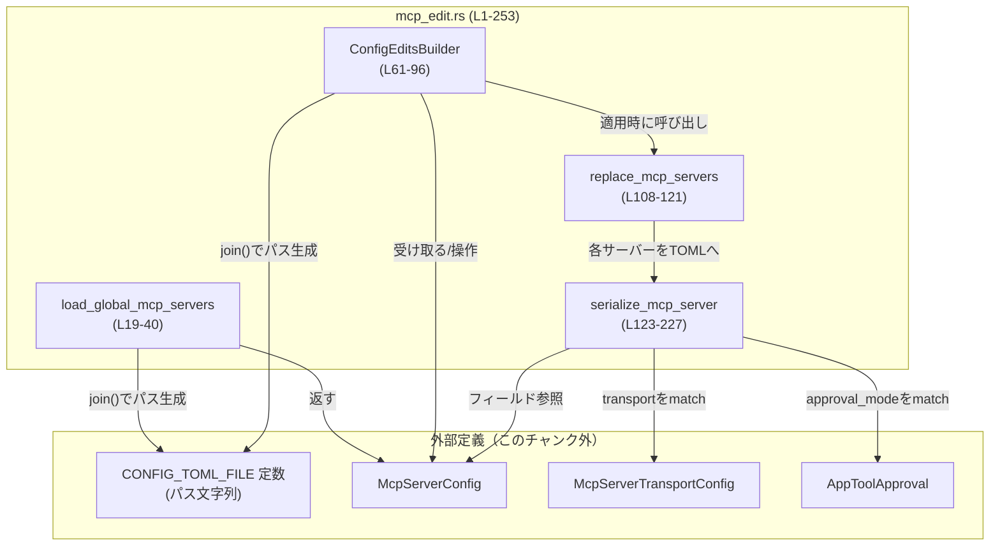
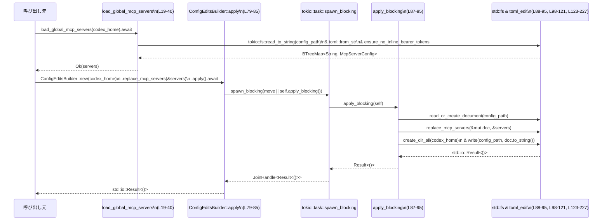

# config/src/mcp_edit.rs コード解説

## 0. ざっくり一言

- `config.toml` に記録された **MCP サーバー（`mcp_servers`）設定の読み込みと書き込み** を行うモジュールです。
- TOML から `BTreeMap<String, McpServerConfig>` への変換と、`McpServerConfig` から TOML へのシリアライズ、および設定ファイルの永続化を担当します。

---

## 1. このモジュールの役割

### 1.1 概要

- このモジュールは **MCP サーバー設定をファイルから読み取り・ファイルへ書き戻す問題** を解決するために存在し、次の機能を提供します。
  - `config.toml` の `mcp_servers` テーブルを非同期に読み取り、`BTreeMap<String, McpServerConfig>` として返す機能（`load_global_mcp_servers`）。  
    （`config/src/mcp_edit.rs:L19-40`）
  - `McpServerConfig` の集合を TOML ドキュメントに反映し、`config.toml` に書き戻すビルダー型 `ConfigEditsBuilder`。  
    （`config/src/mcp_edit.rs:L61-96, L108-121, L123-227`）
  - TOML 内に **インラインの `bearer_token`** が存在しないことを検査するバリデーション（`ensure_no_inline_bearer_tokens`）。  
    （`config/src/mcp_edit.rs:L42-59`）

### 1.2 アーキテクチャ内での位置づけ

このモジュールは「設定ファイル（TOML）」と「アプリケーション内部の構造体 (`McpServerConfig`)」の間を変換するレイヤです。非同期ランタイム（Tokio）を利用した読み込みと、ブロッキング I/O を別スレッドで実行する書き込みで、アプリケーションの他部分からはシンプルな API として見えます。



- `load_global_mcp_servers` は `tokio::fs::read_to_string` を使って非同期に TOML を読み込みます（`config/src/mcp_edit.rs:L23-27`）。
- `ConfigEditsBuilder::apply` は `tokio::task::spawn_blocking` により、ブロッキングな `std::fs` 処理を専用スレッド上で実行します（`config/src/mcp_edit.rs:L79-85, L87-95`）。
- `McpServerConfig` / `McpServerTransportConfig` / `AppToolApproval` / `CONFIG_TOML_FILE` はこのチャンクには定義がなく、別ファイルで定義されています（`config/src/mcp_edit.rs:L14-17`）。

### 1.3 設計上のポイント

- **非同期と同期 I/O の分離**  
  - 読み込みは `tokio::fs::read_to_string` を用いた非同期 I/O（`config/src/mcp_edit.rs:L23-27`）。  
  - 書き込みは `spawn_blocking` + `std::fs` で、ブロッキング I/O をワーカスレッドに隔離（`config/src/mcp_edit.rs:L79-85, L87-95`）。
- **TOML 編集ライブラリの利用**  
  - `toml_edit::DocumentMut` を使い、TOML ドキュメントを構造化したオブジェクトとして編集しています（`config/src/mcp_edit.rs:L9, L88-95, L98-106, L108-121`）。
- **決定的（ソート済み）な出力**  
  - `BTreeMap`（`config/src/mcp_edit.rs:L1, L61-63, L74-76, L108-121`）と、`Vec::sort_by`（`config/src/mcp_edit.rs:L209-211, L241-242`）を利用して、サーバー名やヘッダー名の順序を安定させています。
- **セキュリティ配慮**  
  - `ensure_no_inline_bearer_tokens` により、設定ファイル内に平文の `bearer_token` が含まれていればエラーにします（`config/src/mcp_edit.rs:L42-55`）。  
    代わりに `bearer_token_env_var` を使うことを要求するメッセージを返します（`config/src/mcp_edit.rs:L51-53`）。
- **部分的な編集・ビルダーパターン**  
  - `ConfigEditsBuilder` は現在 `mcp_servers` の置き換えのみをサポートし、必要な変更だけを詰めて `apply` で一括適用する形になっています（`config/src/mcp_edit.rs:L61-77, L87-95`）。

---

## 2. 主要な機能一覧

- `load_global_mcp_servers`: `config.toml` から `mcp_servers` を非同期に読み取り `BTreeMap<String, McpServerConfig>` として返す。
- `ConfigEditsBuilder`: 設定ファイルへの変更（主に `mcp_servers` の置き換え）を構築し、ファイルに反映するビルダー。
- `ensure_no_inline_bearer_tokens`: TOML の `mcp_servers` テーブルにセキュリティ上問題となる `bearer_token` キーがないか検査する。
- `read_or_create_document`: 設定ファイルを `DocumentMut` として読み込むか、存在しない場合は空ドキュメントを作成する。
- `replace_mcp_servers`: `DocumentMut` のルートにある `mcp_servers` テーブルを、与えられた `BTreeMap` から再構築する。
- `serialize_mcp_server`: 1 件の `McpServerConfig` を TOML テーブル (`TomlItem::Table`) に変換する。
- `array_from_strings`, `table_from_pairs`: 文字列配列やキー・値のペアから TOML の Array / Table を生成するヘルパー。

### 2.1 コンポーネント一覧（行番号付き）

| 名前 | 種別 | 公開 | 行範囲 | 説明 |
|------|------|------|--------|------|
| `load_global_mcp_servers` | 関数 | 公開 | `config/src/mcp_edit.rs:L19-40` | 非同期に `mcp_servers` を読み込み、`BTreeMap<String, McpServerConfig>` を返す |
| `ensure_no_inline_bearer_tokens` | 関数 | 非公開 | `config/src/mcp_edit.rs:L42-59` | `mcp_servers` 内の `bearer_token` キー有無を検査する |
| `ConfigEditsBuilder` | 構造体 | 公開 | `config/src/mcp_edit.rs:L61-64` | 設定ファイル編集のためのビルダー。ホームディレクトリとオプションの `mcp_servers` を保持 |
| `ConfigEditsBuilder::new` | メソッド | 公開 | `config/src/mcp_edit.rs:L67-72` | `codex_home` を指定してビルダーを生成する |
| `ConfigEditsBuilder::replace_mcp_servers` | メソッド | 公開 | `config/src/mcp_edit.rs:L74-77` | 渡された `BTreeMap` で `mcp_servers` を置き換える指定をビルダーにセット |
| `ConfigEditsBuilder::apply` | メソッド | 公開 | `config/src/mcp_edit.rs:L79-85` | 非同期に設定ファイルへの変更を適用する（内部で `spawn_blocking` を使用） |
| `ConfigEditsBuilder::apply_blocking` | メソッド | 非公開 | `config/src/mcp_edit.rs:L87-95` | ブロッキング I/O で設定ファイルを読み書きする本体 |
| `read_or_create_document` | 関数 | 非公開 | `config/src/mcp_edit.rs:L98-106` | 設定ファイルを `DocumentMut` として読み込むか、新規に作成する |
| `replace_mcp_servers` | 関数 | 非公開 | `config/src/mcp_edit.rs:L108-121` | TOML ドキュメントの `mcp_servers` テーブルを再構築する |
| `serialize_mcp_server` | 関数 | 非公開 | `config/src/mcp_edit.rs:L123-227` | `McpServerConfig` を TOML テーブルにシリアライズする |
| `array_from_strings` | 関数 | 非公開 | `config/src/mcp_edit.rs:L229-235` | `&[String]` から TOML Array を生成する |
| `table_from_pairs` | 関数 | 非公開 | `config/src/mcp_edit.rs:L237-249` | `(key, value)` のイテレータから TOML Table を生成する |
| `tests` モジュール | モジュール | 非公開（テスト時のみ） | `config/src/mcp_edit.rs:L251-253` | `mcp_edit_tests.rs` にあるテストを読み込む |

---

## 3. 公開 API と詳細解説

### 3.1 型一覧（構造体・列挙体など）

| 名前 | 種別 | 役割 / 用途 | 定義位置 |
|------|------|-------------|----------|
| `ConfigEditsBuilder` | 構造体 | MCP サーバー設定などの変更を構築し、`config.toml` に書き戻すためのビルダー。`codex_home` と、置き換え対象の `mcp_servers` を保持する。 | `config/src/mcp_edit.rs:L61-64` |

※ `McpServerConfig`, `McpServerTransportConfig`, `AppToolApproval` はこのチャンクには定義がなく、別ファイルで定義されています（`config/src/mcp_edit.rs:L14-17`）。

### 3.2 関数詳細（重要な 7 件）

#### `load_global_mcp_servers(codex_home: &Path) -> std::io::Result<BTreeMap<String, McpServerConfig>>`

**概要**

- `codex_home/CONFIG_TOML_FILE` を非同期に読み込み、TOML から `mcp_servers` テーブルを取得して `BTreeMap<String, McpServerConfig>` に変換する関数です（`config/src/mcp_edit.rs:L19-40`）。
- ファイルが存在しない場合や `mcp_servers` セクションがない場合は、空の `BTreeMap` を返します（`config/src/mcp_edit.rs:L22-27, L30-32`）。
- `mcp_servers` に `bearer_token` キーが含まれている場合はエラーを返します（`config/src/mcp_edit.rs:L34-35, L42-55`）。

**引数**

| 引数名 | 型 | 説明 |
|--------|----|------|
| `codex_home` | `&Path` | 設定ファイル `CONFIG_TOML_FILE` が置かれているディレクトリへのパス |

**戻り値**

- `Ok(BTreeMap<String, McpServerConfig>)`  
  `mcp_servers` テーブルの内容をサーバー名をキーとする `BTreeMap` で返します。  
- `Err(std::io::Error)`  
  ファイルの読み込み・TOML のパース・構造の変換、または `bearer_token` 検査で問題があった場合に返されます。

**内部処理の流れ**

1. `config_path = codex_home.join(CONFIG_TOML_FILE)` で設定ファイルのパスを組み立てます（`config/src/mcp_edit.rs:L22`）。
2. `tokio::fs::read_to_string(&config_path).await` でファイルを読み込みます（`config/src/mcp_edit.rs:L23-27`）。  
   - `ErrorKind::NotFound` の場合は空の `BTreeMap` を返して終了します（`config/src/mcp_edit.rs:L25`）。
3. 読み込んだ文字列 `raw` を `toml::from_str::<TomlValue>(&raw)` でパースし、`TomlValue` に変換します（`config/src/mcp_edit.rs:L28`）。  
   - パースエラーは `ErrorKind::InvalidData` の `std::io::Error` に変換されます（`config/src/mcp_edit.rs:L28-29`）。
4. ルートの `mcp_servers` 値を `parsed.get("mcp_servers")` で取り出します（`config/src/mcp_edit.rs:L30`）。  
   見つからない場合は空の `BTreeMap` を返します（`config/src/mcp_edit.rs:L30-32`）。
5. `ensure_no_inline_bearer_tokens(servers_value)?` を呼び出し、`bearer_token` が使われていないことを確認します（`config/src/mcp_edit.rs:L34-35`）。
6. `servers_value.clone().try_into()` で `BTreeMap<String, McpServerConfig>` に変換します（`config/src/mcp_edit.rs:L36-39`）。  
   エラー時は `ErrorKind::InvalidData` として `std::io::Error` に変換されます（`config/src/mcp_edit.rs:L38-39`）。

**Examples（使用例）**

```rust
use std::path::Path;
use std::collections::BTreeMap;

// 非同期コンテキスト内を想定
async fn list_mcp_servers(codex_home: &Path) -> std::io::Result<()> {
    // config.toml から mcp_servers を読み込む
    let servers: BTreeMap<String, McpServerConfig> =
        load_global_mcp_servers(codex_home).await?;

    // 読み込んだサーバー名を列挙する（BTreeMap なのでキー順に並ぶ）
    for (name, _config) in &servers {
        println!("MCP server: {name}");
    }

    Ok(())
}
```

**Errors / Panics**

- `Err(std::io::Error)` になる主な条件:
  - ファイル読み込み中の I/O エラー（`ErrorKind::NotFound` 以外）（`config/src/mcp_edit.rs:L23-27`）。
  - TOML パースエラー（`ErrorKind::InvalidData`）（`config/src/mcp_edit.rs:L28-29`）。
  - `mcp_servers` の構造が `BTreeMap<String, McpServerConfig>` に変換できない場合（`config/src/mcp_edit.rs:L36-39`）。
  - `mcp_servers` 内に `bearer_token` キーが含まれており、`ensure_no_inline_bearer_tokens` がエラーを返した場合（`config/src/mcp_edit.rs:L34-35, L42-55`）。
- panic を明示的に発生させるコードはこの関数内にはありません。

**Edge cases（エッジケース）**

- 設定ファイルが存在しない場合:  
  `ErrorKind::NotFound` を検出し、`Ok(BTreeMap::new())` を返します（`config/src/mcp_edit.rs:L25`）。
- TOML は存在するが `mcp_servers` が未定義の場合:  
  `parsed.get("mcp_servers")` が `None` となり、空の `BTreeMap` を返します（`config/src/mcp_edit.rs:L30-32`）。
- `mcp_servers` がテーブル以外の型の場合:  
  `ensure_no_inline_bearer_tokens` は `as_table()` が `None` の場合はそのまま `Ok(())` を返すため、  
  その後の `try_into()` のタイミングで `InvalidData` エラーになる可能性があります（`config/src/mcp_edit.rs:L42-45, L36-39`）。
- サーバー名が 0 件の場合（空テーブル）:  
  `try_into()` は空の `BTreeMap` を返します。

**使用上の注意点**

- 非同期関数のため、Tokio などの非同期ランタイムの中から `.await` 付きで呼び出す必要があります（`config/src/mcp_edit.rs:L19-23`）。
- `mcp_servers` に `bearer_token` を書いた TOML は `InvalidData` エラーになります。代わりに `bearer_token_env_var` を使用する前提の設計です（`config/src/mcp_edit.rs:L51-53`）。
- ファイルの存在有無と `mcp_servers` の有無を「エラー」ではなく「空のマップ」で表現する契約になっているため、呼び出し側でその違いを区別したい場合は別途対処が必要です。

---

#### `ConfigEditsBuilder::new(codex_home: &Path) -> ConfigEditsBuilder`

**概要**

- 設定ファイルの編集処理を行う `ConfigEditsBuilder` を初期化するコンストラクタです（`config/src/mcp_edit.rs:L67-72`）。
- MCP サーバー設定の変更をあとから付加していく起点となります。

**引数**

| 引数名 | 型 | 説明 |
|--------|----|------|
| `codex_home` | `&Path` | `CONFIG_TOML_FILE` が存在する（または作成される）ホームディレクトリのパス |

**戻り値**

- `ConfigEditsBuilder` インスタンス。  
  - `codex_home` フィールドは `to_path_buf()` でコピーされ（`config/src/mcp_edit.rs:L69`）、  
  - `mcp_servers` フィールドは `None` に初期化されます（`config/src/mcp_edit.rs:L70`）。

**内部処理の流れ**

1. `codex_home.to_path_buf()` で所有権を持つ `PathBuf` を生成し、`codex_home` フィールドに格納します（`config/src/mcp_edit.rs:L69`）。
2. `mcp_servers` フィールドを `None` に設定します（`config/src/mcp_edit.rs:L70`）。

**Examples（使用例）**

```rust
use std::path::Path;

fn build_editor(codex_home: &Path) -> ConfigEditsBuilder {
    // codex_home を指定してビルダーを生成する
    ConfigEditsBuilder::new(codex_home)
}
```

**Errors / Panics**

- このメソッドは `std::io::Result` を返さず、内部で I/O も行わないため、エラーや panic を発生させる要因はありません（このチャンクのコードから読み取れる範囲では）。

**Edge cases**

- `codex_home` が存在しないパスであっても問題なくビルダーは生成されます。実際にディレクトリが作成されるのは `apply_blocking` 内の `fs::create_dir_all` 呼び出し時です（`config/src/mcp_edit.rs:L93`）。

**使用上の注意点**

- この段階では何の変更も指定されていないため、`apply` の前に `replace_mcp_servers` 等で変更内容を設定することが一般的です。

---

#### `ConfigEditsBuilder::replace_mcp_servers(mut self, servers: &BTreeMap<String, McpServerConfig>) -> Self`

**概要**

- ビルダーに「`mcp_servers` テーブルを指定の内容で置き換える」変更を設定します（`config/src/mcp_edit.rs:L74-77`）。
- `self` を返すため、メソッドチェーンで利用できます。

**引数**

| 引数名 | 型 | 説明 |
|--------|----|------|
| `self` | `ConfigEditsBuilder` | 所有権を持つビルダーインスタンス |
| `servers` | `&BTreeMap<String, McpServerConfig>` | 設定ファイルに書き出す `mcp_servers` の内容 |

**戻り値**

- 更新された `ConfigEditsBuilder`。  
  - `mcp_servers` フィールドは `Some(servers.clone())` に設定されます（`config/src/mcp_edit.rs:L75`）。

**内部処理の流れ**

1. 引数 `servers` を `clone()` し、`Some(...)` として `self.mcp_servers` に代入します（`config/src/mcp_edit.rs:L75`）。
2. 更新された `self` を返します（`config/src/mcp_edit.rs:L76`）。

**Examples（使用例）**

```rust
use std::collections::BTreeMap;
use std::path::Path;

async fn save_servers(
    codex_home: &Path,
    servers: &BTreeMap<String, McpServerConfig>,
) -> std::io::Result<()> {
    ConfigEditsBuilder::new(codex_home)       // ビルダーを作成
        .replace_mcp_servers(servers)        // mcp_servers を置き換える指示を追加
        .apply()                             // 実際にファイルに書き出す
        .await
}
```

**Errors / Panics**

- このメソッド自体は I/O を行わず、単に `BTreeMap` を `clone` するだけなので、I/O エラーは発生しません（`config/src/mcp_edit.rs:L74-77`）。
- panic を発生させるコードも含まれていません（このチャンクの範囲で見る限り）。

**Edge cases**

- `servers` が空の場合でも `Some(empty_map)` として保存されます。  
  実際の動作は `apply_blocking` 内で `replace_mcp_servers` に渡されたときに、`mcp_servers` キーが削除される挙動になります（`config/src/mcp_edit.rs:L90-92, L108-113`）。

**使用上の注意点**

- `servers` 全体を `clone` するため、サーバー数が多い場合はメモリコピーのコストが発生します。  
  必要に応じて呼び出し回数を抑えるなどの考慮が必要になる場合があります。

---

#### `ConfigEditsBuilder::apply(self) -> std::io::Result<()>`

**概要**

- ビルダーに指定された変更を、非同期にファイルへ適用するメインメソッドです（`config/src/mcp_edit.rs:L79-85`）。
- 内部で `tokio::task::spawn_blocking` を使用し、ブロッキング I/O を専用スレッドで実行します。

**引数**

| 引数名 | 型 | 説明 |
|--------|----|------|
| `self` | `ConfigEditsBuilder` | 適用すべき変更を含むビルダーインスタンス（所有権が move されます） |

**戻り値**

- `Ok(())`  
  ファイルへの書き込みが成功した場合。
- `Err(std::io::Error)`  
  `apply_blocking` 内の I/O エラー、またはスレッドの panic をラップしたエラーが返されます。

**内部処理の流れ**

1. `task::spawn_blocking(move || self.apply_blocking())` でクロージャを別スレッドで実行するタスクを生成します（`config/src/mcp_edit.rs:L80`）。
2. `await` で `JoinHandle` の完了を待ちます（`config/src/mcp_edit.rs:L81`）。
3. `JoinHandle` がエラー（panic 等）で終了した場合は `std::io::Error::other` でラップして返します（`config/src/mcp_edit.rs:L81-84`）。
4. 正常終了した場合は `apply_blocking` が返した `std::io::Result<()>` がそのまま返されます（`config/src/mcp_edit.rs:L84-85`）。

**Examples（使用例）**

```rust
use std::collections::BTreeMap;
use std::path::Path;

// MCP サーバー設定を更新して保存する例
async fn enable_all_servers(
    codex_home: &Path,
) -> std::io::Result<()> {
    let mut servers = load_global_mcp_servers(codex_home).await?; // 既存設定を読み込み

    // ここで servers の各 McpServerConfig を書き換える処理があるとする
    for (_name, config) in servers.iter_mut() {
        config.enabled = true; // フィールド名はこのチャンク内の使用から推測されます（config/src/mcp_edit.rs:L174）
    }

    ConfigEditsBuilder::new(codex_home)
        .replace_mcp_servers(&servers)
        .apply()        // 非同期にファイルへ書き出し
        .await
}
```

> フィールド `enabled` 等の詳細な型定義はこのチャンクには現れませんが、`serialize_mcp_server` 内で使用されていることから存在することが分かります（`config/src/mcp_edit.rs:L174-177`）。

**Errors / Panics**

- `spawn_blocking` 内部で呼ばれる `apply_blocking` が返した I/O エラー（読み込み、ディレクトリ作成、書き込み）が、そのまま `Err` として返されます（`config/src/mcp_edit.rs:L87-95`）。
- `spawn_blocking` のタスクが panic した場合、`JoinHandle::await` はエラーとなり、それを `std::io::Error::other` でラップしたエラー文字列（`"config persistence task panicked: {err}"`）が返されます（`config/src/mcp_edit.rs:L81-84`）。
- このメソッド自身は panic を明示的には起こしません。

**Edge cases**

- `ConfigEditsBuilder` が何も変更を持っていない（`mcp_servers` が `None`）場合でも、`apply_blocking` はディレクトリ作成とファイル書き込みを行う可能性があります（`config/src/mcp_edit.rs:L90-95`）。  
  その結果、空のドキュメントが書き込まれたり、既存の内容がそのまま上書きされる場合があります。
- ランタイム外で `apply().await` を呼ぶと、Tokio の要件により動作しません。  
  ただしこれはモジュール外（Tokio ランタイム）に依存するため、このチャンクのコードからは詳細は分かりません。

**使用上の注意点**

- `spawn_blocking` のクロージャには `'static + Send` な値しかキャプチャできないため、`ConfigEditsBuilder` とその内部フィールドも同様の制約を満たす必要があります（一般的な Tokio の制約）。  
  これにより、非スレッドセーフなデータを閉じ込めることはコンパイル段階で防がれます。
- 同一ファイルに対して複数の `apply` を同時に呼んだ場合のロック制御は行っていないため、最後に書き込まれた内容が残る形になります（`config/src/mcp_edit.rs:L87-95`）。

---

#### `ConfigEditsBuilder::apply_blocking(self) -> std::io::Result<()>`

**概要**

- ブロッキング I/O を使って実際に TOML ドキュメントを読み込み、`mcp_servers` を置き換えたうえでファイルに書き戻す処理の本体です（`config/src/mcp_edit.rs:L87-95`）。
- 非同期コンテキストからは直接呼ばれず、`apply` 内から専用スレッドで呼び出されます。

**引数**

| 引数名 | 型 | 説明 |
|--------|----|------|
| `self` | `ConfigEditsBuilder` | 適用するべき変更と `codex_home` を含むビルダー |

**戻り値**

- `Ok(())`  
  ファイルの読み込み・編集・書き込みが全て成功した場合。
- `Err(std::io::Error)`  
  いずれかの段階で I/O エラーもしくは TOML パースエラーが発生した場合。

**内部処理の流れ**

1. `config_path = self.codex_home.join(CONFIG_TOML_FILE)` で設定ファイルパスを得ます（`config/src/mcp_edit.rs:L88`）。
2. `read_or_create_document(&config_path)?` を呼び、既存のファイルを `DocumentMut` として読むか、存在しない場合は空の `DocumentMut` を作成します（`config/src/mcp_edit.rs:L89, L98-106`）。
3. `self.mcp_servers.as_ref()` が `Some(servers)` の場合は `replace_mcp_servers(&mut doc, servers)` を呼び、TOML ドキュメントの `mcp_servers` テーブルを差し替えます（`config/src/mcp_edit.rs:L90-92, L108-121`）。
4. `fs::create_dir_all(&self.codex_home)?` でディレクトリを作成（すでに存在する場合は成功扱い）します（`config/src/mcp_edit.rs:L93`）。
5. `fs::write(config_path, doc.to_string())` で TOML ドキュメントを文字列化して書き込みます（`config/src/mcp_edit.rs:L94-95`）。

**Examples（使用例）**

- 通常は `apply` 経由でのみ使用されます。直接呼び出すケースは想定されていません（可視性が `fn` であり `pub` ではないため、モジュール外からは呼べません）。

**Errors / Panics**

- `read_or_create_document` 内の I/O / パースエラーがそのまま伝播します（`config/src/mcp_edit.rs:L89-90, L98-106`）。
- `fs::create_dir_all` と `fs::write` が返す I/O エラーがそのまま返されます（`config/src/mcp_edit.rs:L93-95`）。
- panic を起こすコードは含まれていません。

**Edge cases**

- `mcp_servers` が `None` の場合、`doc` は変更されず、そのまま `doc.to_string()` を書き戻します（`config/src/mcp_edit.rs:L90-92`）。
- `read_or_create_document` が新規の空ドキュメントを返し（NotFound）、その後も `mcp_servers` が `None` のままの場合、空の TOML 文字列がファイルに書き込まれる挙動が考えられます（`config/src/mcp_edit.rs:L98-105, L90-95`）。

**使用上の注意点**

- ブロッキング I/O を行うため、必ず `spawn_blocking` 等の専用スレッドから実行する前提で設計されています（実際には `apply` からのみ呼び出されています）。

---

#### `serialize_mcp_server(config: &McpServerConfig) -> TomlItem`

**概要**

- 1 台の MCP サーバー設定 (`McpServerConfig`) を TOML テーブル (`TomlItem::Table`) に変換します（`config/src/mcp_edit.rs:L123-227`）。
- `transport` の種類（`Stdio` / `StreamableHttp`）や、`enabled` / `required` / 各種タイムアウト / ツール設定など、複数のフィールドを TOML キーにマッピングします。

**引数**

| 引数名 | 型 | 説明 |
|--------|----|------|
| `config` | `&McpServerConfig` | シリアライズ対象の MCP サーバー設定 |

**戻り値**

- `TomlItem::Table` として `mcp_servers.<name>` の値になるべきテーブルを返します。

**内部処理の流れ**

1. 新しい `TomlTable` を作成し、暗黙（implicit）ではないテーブルとして設定します（`config/src/mcp_edit.rs:L123-125`）。
2. `config.transport` を `match` し、種別ごとに異なるフィールドを書き出します（`config/src/mcp_edit.rs:L127-172`）。

   - `McpServerTransportConfig::Stdio { command, args, env, env_vars, cwd }` の場合（`config/src/mcp_edit.rs:L128-150`）:
     - `command` を `"command"` キーとして書き出し（`L135`）。
     - `args` が非空なら `"args"` を配列として書き出し（`L136-138, L229-235`）。
     - `env` が `Some` かつ非空なら `"env"` をキー・値テーブルとして書き出し（`L139-143, L237-249`）。
     - `env_vars` が非空なら `"env_vars"` を配列として書き出し（`L144-146`）。
     - `cwd` が `Some` なら `"cwd"` を文字列として書き出し（`L147-149`）。

   - `McpServerTransportConfig::StreamableHttp { url, bearer_token_env_var, http_headers, env_http_headers }` の場合（`config/src/mcp_edit.rs:L151-171`）:
     - `url` を `"url"` として書き出し（`L157`）。
     - `bearer_token_env_var` が `Some` なら `"bearer_token_env_var"` として書き出し（`L158-160`）。
     - `http_headers` が `Some` かつ非空なら `"http_headers"` をキー・値テーブルとして書き出し（`L161-165, L237-249`）。
     - `env_http_headers` が `Some` かつ非空なら `"env_http_headers"` をキー・値テーブルとして書き出し（`L166-170`）。

3. 共通フィールドを追加します（`config/src/mcp_edit.rs:L174-224`）。
   - `enabled` が `false` の場合のみ `"enabled" = false` を書き出し（`L174-176`）。
   - `required` が `true` の場合のみ `"required" = true` を書き出し（`L177-179`）。
   - `startup_timeout_sec` が `Some(timeout)` なら `"startup_timeout_sec" = timeout.as_secs_f64()`（`L180-182`）。
   - `tool_timeout_sec` が `Some(timeout)` なら `"tool_timeout_sec" = timeout.as_secs_f64()`（`L183-185`）。
   - `enabled_tools` が `Some` かつ非空なら `"enabled_tools"` を配列として書き出し（`L186-190`）。
   - `disabled_tools` が `Some` かつ非空なら `"disabled_tools"` を配列として書き出し（`L191-195`）。
   - `scopes` が `Some` かつ非空なら `"scopes"` を配列として書き出し（`L196-200`）。
   - `oauth_resource` が `Some` かつ非空なら `"oauth_resource"` を文字列として書き出し（`L201-205`）。
   - `tools` が非空なら `"tools"` テーブルを作り、ツール名でソートしたサブテーブルに `approval_mode` を書き出し（`L206-224`）。  
     - `AppToolApproval::Auto` → `"auto"`、`Prompt` → `"prompt"`、`Approve` → `"approve"`（`L214-219`）。

4. 最終的に `TomlItem::Table(entry)` を返します（`config/src/mcp_edit.rs:L226-227`）。

**Examples（使用例）**

- この関数は `replace_mcp_servers` からのみ呼び出され、モジュール外に公開されていません（`config/src/mcp_edit.rs:L117-118`）。  
  外部から直接利用する場面は想定されていません。

**Errors / Panics**

- この関数自体は `std::io::Result` を返さず、失敗を表す値や panic を明示的に発生させるコードもありません（`config/src/mcp_edit.rs:L123-227`）。

**Edge cases**

- `enabled` が `true` の場合は `"enabled"` キー自体が出力されません（`config/src/mcp_edit.rs:L174-176`）。  
  そのため、設定ファイル上のデフォルト値は「有効」であると解釈されます。
- `required` が `false` の場合も同様に `"required"` が出力されず、「必須ではない」がデフォルト値になります（`config/src/mcp_edit.rs:L177-179`）。
- タイムアウト秒は `as_secs_f64()` で書き出されるため、内部の Duration 精度に対して TOML 上は浮動小数で表現されます（`config/src/mcp_edit.rs:L180-185`）。
- `tools` テーブル内のツールや、ヘッダーのようなキー・値のペアはソートされるため、入力順ではなく名前順で出力されます（`config/src/mcp_edit.rs:L209-211, L241-242`）。

**使用上の注意点**

- `serialize_mcp_server` で書き出されないフィールドは、設定ファイルに保存されません。`McpServerConfig` に新しいフィールドを追加した場合、それを永続化したければこの関数に対応するキーを追加する必要があります。
- 出力フォーマット（キー名や条件付き出力の有無）は、このモジュールを利用する他コンポーネントとの契約となるため、変更する場合は既存設定との互換性を確認する必要があります。

---

#### `ensure_no_inline_bearer_tokens(value: &TomlValue) -> std::io::Result<()>`

**概要**

- `mcp_servers` テーブル中に、セキュリティ上問題となる `bearer_token` キーが含まれていないかチェックします（`config/src/mcp_edit.rs:L42-59`）。
- 見つかった場合は `ErrorKind::InvalidData` の `std::io::Error` を返します。

**引数**

| 引数名 | 型 | 説明 |
|--------|----|------|
| `value` | `&TomlValue` | `mcp_servers` に対応する TOML 値（通常はテーブル） |

**戻り値**

- `Ok(())`  
  `bearer_token` が見つからない、もしくは `value` がテーブルでない場合。
- `Err(std::io::Error)`  
  いずれかのサーバー設定内に `bearer_token` キーが見つかった場合。

**内部処理の流れ**

1. `value.as_table()` を呼び、テーブルとして解釈できなければ `Ok(())` で戻ります（`config/src/mcp_edit.rs:L42-45`）。
2. 各 `(server_name, server_value)` についてループします（`config/src/mcp_edit.rs:L47`）。
3. `server_value.as_table()` が `Some(server_table)` かつ `server_table.contains_key("bearer_token")` の場合（`config/src/mcp_edit.rs:L48-50`）:
   - `"mcp_servers.{server_name} uses unsupported ... set 'bearer_token_env_var'."` というメッセージを構築し（`config/src/mcp_edit.rs:L51-53`）、  
   - `ErrorKind::InvalidData` の `std::io::Error` として返します（`config/src/mcp_edit.rs:L54-55`）。
4. ループを抜ければ `Ok(())` を返します（`config/src/mcp_edit.rs:L58-59`）。

**Examples（使用例）**

- 実際には `load_global_mcp_servers` 内からのみ呼ばれており（`config/src/mcp_edit.rs:L34-35`）、外部から直接使用することは想定されていません。

**Errors / Panics**

- `bearer_token` を使っているサーバーエントリがある場合に `Err(std::io::Error::new(ErrorKind::InvalidData, message))` を返します（`config/src/mcp_edit.rs:L51-55`）。
- panic を起こすコードは含まれていません。

**Edge cases**

- `value` がテーブルでない場合（例: 配列やスカラーなど）、チェックはスキップされ、常に `Ok(())` となります（`config/src/mcp_edit.rs:L42-45`）。
- サーバーエントリがテーブルでない場合も `as_table()` が `None` となり、検査対象から外れます（`config/src/mcp_edit.rs:L48-50`）。

**使用上の注意点**

- この関数は **読み込み時** の検査にのみ使われており、書き込み側（`serialize_mcp_server`）では `bearer_token` フィールドを書き出さないことで整合性を保っています（`config/src/mcp_edit.rs:L151-171` に `bearer_token` は登場しません）。
- 設定ファイルを手で編集する運用をする場合、`bearer_token` を書くとロードが失敗する契約です。

---

### 3.3 その他の関数一覧

| 関数名 | 役割（1 行） | 行範囲 |
|--------|--------------|--------|
| `read_or_create_document(config_path: &Path) -> std::io::Result<DocumentMut>` | 設定ファイルを文字列として読み取り `DocumentMut` にパースし、ファイルがない場合は空の `DocumentMut` を返す。パースエラーは `InvalidData` に変換。 | `config/src/mcp_edit.rs:L98-106` |
| `replace_mcp_servers(doc: &mut DocumentMut, servers: &BTreeMap<String, McpServerConfig>)` | `mcp_servers` テーブルを、与えられた `BTreeMap` から構築し直す。空なら `mcp_servers` キーを削除。 | `config/src/mcp_edit.rs:L108-121` |
| `array_from_strings(values: &[String]) -> TomlItem` | `&[String]` から TOML 配列 (`TomlItem::Value(Array)`) を構築する。 | `config/src/mcp_edit.rs:L229-235` |
| `table_from_pairs<'a, I>(pairs: I) -> TomlItem` | `(key, value)` のイテレータをキー順にソートして TOML テーブルを構築する。 | `config/src/mcp_edit.rs:L237-249` |

### 3.4 安全性・セキュリティ・並行性上の注意点（横断的）

- **インライントークン禁止**  
  - `ensure_no_inline_bearer_tokens` により、`bearer_token` を含む設定は読み込み時に拒否されます（`config/src/mcp_edit.rs:L42-55`）。  
    これにより、アクセストークンを平文でファイルに保存しない運用を強制しています。
- **ブロッキング I/O の隔離**  
  - 書き込み処理は `spawn_blocking` で隔離されており、非同期ランタイム上のスレッドをブロックしません（`config/src/mcp_edit.rs:L79-85`）。
- **ファイルロック無しの書き込み**  
  - `fs::write` を直接呼んでおり（`config/src/mcp_edit.rs:L94-95`）、ファイルロックやアトミック書き込み（テンポラリファイル + rename）の仕組みは見られません。  
    複数プロセス / 複数タスクから同時に書き込むと、最後に書いた内容で上書きされる可能性があります。
- **エラーの伝播**  
  - ほぼすべての I/O やパースエラーは `std::io::Error` として呼び出し元に返され、内部で握り潰されることはありません（`config/src/mcp_edit.rs:L28-29, L36-39, L80-85, L98-106, L93-95`）。

---

## 4. データフロー

### 4.1 代表的なシナリオ：`mcp_servers` の更新と永続化

ここでは、「`mcp_servers` を書き換えて `config.toml` に保存する」シナリオのデータフローを示します。  
呼び出し元コードとしては、`load_global_mcp_servers` で読み込み、`ConfigEditsBuilder` で書き込みという流れが想定されます。



要点:

- 読み込みは完全に非同期で行われ、書き込みは `spawn_blocking` により別スレッドにオフロードされます（`config/src/mcp_edit.rs:L23-27, L79-85`）。
- データ構造としては、`TomlValue` → `BTreeMap<String, McpServerConfig>` → `DocumentMut` → 文字列 TOML という方向で変換されています（`config/src/mcp_edit.rs:L28-39, L89-90, L108-121, L123-227`）。

---

## 5. 使い方（How to Use）

### 5.1 基本的な使用方法

典型的なフローは「読み込み → 設定を変更 → 書き込み」です。

```rust
use std::collections::BTreeMap;
use std::path::Path;

// MCP サーバーを 1 つ追加して保存する例
async fn add_mcp_server(
    codex_home: &Path,
    name: String,
    new_config: McpServerConfig,
) -> std::io::Result<()> {
    // 1. 既存の mcp_servers を読み込む
    let mut servers: BTreeMap<String, McpServerConfig> =
        load_global_mcp_servers(codex_home).await?; // (L19-40)

    // 2. 新しいサーバー設定を挿入する
    servers.insert(name, new_config); // BTreeMap なのでキー順で保持される

    // 3. ConfigEditsBuilder を使って mcp_servers を置き換え、ファイルに保存する
    ConfigEditsBuilder::new(codex_home)   // (L67-72)
        .replace_mcp_servers(&servers)    // (L74-77)
        .apply()                          // (L79-85)
        .await
}
```

この例では、`load_global_mcp_servers` がファイル → メモリ構造への変換、`ConfigEditsBuilder` がメモリ構造 → ファイルへの変換を担っています。

### 5.2 よくある使用パターン

1. **読み取り専用（一覧表示など）**

```rust
async fn print_all_servers(codex_home: &Path) -> std::io::Result<()> {
    let servers = load_global_mcp_servers(codex_home).await?;
    for (name, _cfg) in servers {
        println!("{name}");
    }
    Ok(())
}
```

1. **部分的な更新（例: 特定サーバーだけ無効化）**

```rust
async fn disable_server(codex_home: &Path, target: &str) -> std::io::Result<()> {
    let mut servers = load_global_mcp_servers(codex_home).await?;

    if let Some(cfg) = servers.get_mut(target) {
        cfg.enabled = false; // serialize_mcp_server で enabled=false が書き出される（L174-176）
    }

    ConfigEditsBuilder::new(codex_home)
        .replace_mcp_servers(&servers)
        .apply()
        .await
}
```

> `McpServerConfig` のフィールド `enabled` は、このチャンク内で書き込みに使われていることから推測されます（`config/src/mcp_edit.rs:L174-176`）。

### 5.3 よくある間違い

```rust
// 間違い例: replace_mcp_servers を呼ばずに apply だけ行う
async fn wrong_usage(codex_home: &Path) -> std::io::Result<()> {
    ConfigEditsBuilder::new(codex_home)
        // .replace_mcp_servers(&servers); を忘れている
        .apply()
        .await // mcp_servers の内容は変更されないが、ファイルの書き込みは行われる可能性がある
}
```

```rust
// 正しい例: 必要な変更を指定してから apply を呼ぶ
async fn correct_usage(
    codex_home: &Path,
    servers: &BTreeMap<String, McpServerConfig>,
) -> std::io::Result<()> {
    ConfigEditsBuilder::new(codex_home)
        .replace_mcp_servers(servers) // 変更を指定
        .apply()                      // その変更をファイルに反映
        .await
}
```

### 5.4 使用上の注意点（まとめ）

- **非同期コンテキストが必要**  
  - `load_global_mcp_servers` と `ConfigEditsBuilder::apply` はどちらも `async fn` であり、Tokio などのランタイムから `.await` 付きで呼び出す必要があります（`config/src/mcp_edit.rs:L19-23, L79-82`）。
- **設定ファイルの場所**  
  - 実際に読み書きされるパスは `codex_home.join(CONFIG_TOML_FILE)` です（`config/src/mcp_edit.rs:L22, L88`）。  
    `CONFIG_TOML_FILE` の具体的な値はこのチャンクには現れませんが、一般には `"config.toml"` のようなファイル名であると推測されます。
- **同時書き込みの扱い**  
  - `fs::write` を直接呼んでおり、ファイルロックを行っていないため、複数タスク / プロセスから同時に書き込むと最後の書き込みが優先されます（`config/src/mcp_edit.rs:L94-95`）。
- **セキュリティの前提**  
  - `bearer_token` を設定ファイル内に書くことは許されません。代わりに環境変数名（`bearer_token_env_var`）を記録する運用です（`config/src/mcp_edit.rs:L51-53, L158-160`）。

---

## 6. 変更の仕方（How to Modify）

### 6.1 新しい機能を追加する場合

1. **`McpServerConfig` にフィールドを追加し、それを永続化したい場合**
   - 型定義はこのチャンクには現れませんが、`serialize_mcp_server` 内に対応する書き出しロジックを追加する必要があります（`config/src/mcp_edit.rs:L174-224`）。
   - 例: 新しい設定 `retry_count: Option<u32>` を追加したい場合  
     - `serialize_mcp_server` に `"retry_count"` キーを書き出す分岐を追加します。
   - 読み込み側（`load_global_mcp_servers`）は `toml::from_str` による自動デシリアライズに依存していると考えられるため、`McpServerConfig` に適切なフィールドがあれば自動的に読み込まれる可能性がありますが、定義がこのチャンクにないため詳細は不明です。

2. **新しい transport 種類を `McpServerTransportConfig` に追加する場合**
   - `serialize_mcp_server` の `match &config.transport` に新しいバリアントの分岐を追加し、TOML へのマッピングを定義する必要があります（`config/src/mcp_edit.rs:L127-172`）。
   - 一方で、読み込み側のデシリアライズも別ファイルで対応が必要です。

3. **`mcp_servers` 以外のセクションも編集可能にするビルダー機能の追加**
   - `ConfigEditsBuilder` に新しいフィールド（例: `other_section_edits`）と対応するメソッド（例: `replace_other_section`）を追加します（`config/src/mcp_edit.rs:L61-77`）。
   - `apply_blocking` 内で `replace_mcp_servers` と同様の編集関数を呼び出す処理を追加します（`config/src/mcp_edit.rs:L87-95`）。

### 6.2 既存の機能を変更する場合

- **`load_global_mcp_servers` の契約（NotFound → 空マップ）を変更したい場合**
  - `tokio::fs::read_to_string` の `match` 部分を修正し、`ErrorKind::NotFound` でも `Err` を返すようにします（`config/src/mcp_edit.rs:L23-27`）。
  - その場合、呼び出し側ですべて `Result` をハンドリングするコードの修正が必要になります。

- **`mcp_servers` が空のときにキーを削除せず、空テーブルを残したい場合**
  - `replace_mcp_servers` 内の `if servers.is_empty() { root.remove("mcp_servers"); return; }` を変更し（`config/src/mcp_edit.rs:L110-113`）、空の `TomlTable` を挿入するようにします。

- **ツールのソート順を変更したい場合**
  - `serialize_mcp_server` 内の `tool_entries.sort_by`（`config/src/mcp_edit.rs:L209-211`）や、`table_from_pairs` 内の `entries.sort_by`（`config/src/mcp_edit.rs:L241-242`）を修正します。
  - これにより、設定ファイルの出力順序が変わるため、差分ツールなどを使ったレビューに影響が出る可能性があります。

- **変更時に注意すべき契約**
  - `load_global_mcp_servers` が「NotFound や `mcp_servers` 欠如を空マップで表現する」こと（`config/src/mcp_edit.rs:L25, L30-32`）。
  - `bearer_token` を TOML 上で禁止し、`bearer_token_env_var` による運用を前提としていること（`config/src/mcp_edit.rs:L42-55, L157-160`）。
  - `ConfigEditsBuilder::apply` が `spawn_blocking` による非同期ラッパーであること（`config/src/mcp_edit.rs:L79-85`）。

変更を行う際には、`mcp_edit_tests.rs` にあるテスト（`config/src/mcp_edit.rs:L251-253`）を合わせて確認・更新する必要があります。

---

## 7. 関連ファイル

| パス | 役割 / 関係 |
|------|------------|
| `config/src/mcp_edit_tests.rs` | `#[cfg(test)]` と `#[path = "mcp_edit_tests.rs"]` で参照されるテストモジュールです。`mcp_edit.rs` の読み書きロジックを検証するテストが定義されていると考えられますが、このチャンクにはその内容は現れません（`config/src/mcp_edit.rs:L251-253`）。 |
| （不明）`AppToolApproval` 定義ファイル | `serialize_mcp_server` でツールの `approval_mode` を `"auto"`, `"prompt"`, `"approve"` に変換するために使用される列挙体です（`config/src/mcp_edit.rs:L14, L214-219`）。ファイルパスはこのチャンクには現れません。 |
| （不明）`McpServerConfig` 定義ファイル | MCP サーバーの設定構造体。`transport`, `enabled`, `required`, `startup_timeout_sec`, `tool_timeout_sec`, `enabled_tools`, `disabled_tools`, `scopes`, `oauth_resource`, `tools` などのフィールドを持つことがこのチャンクから分かります（`config/src/mcp_edit.rs:L127-172, L174-224`）。定義ファイルのパスはこのチャンクからは分かりません。 |
| （不明）`McpServerTransportConfig` 定義ファイル | `Stdio` / `StreamableHttp` などのバリアントを持つトランスポート設定列挙体です（`config/src/mcp_edit.rs:L16, L127-172`）。 |
| （不明）`CONFIG_TOML_FILE` 定義ファイル | `codex_home.join(CONFIG_TOML_FILE)` で設定ファイル名として使われる定数です（`config/src/mcp_edit.rs:L15, L22, L88`）。具体的な文字列値や定義場所はこのチャンクには現れません。 |

このレポートは、このチャンクに含まれるコードのみを根拠としており、それ以外のファイルの内容や挙動については「不明」または「このチャンクには現れない」と明示しました。
