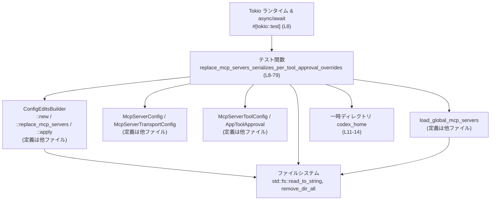
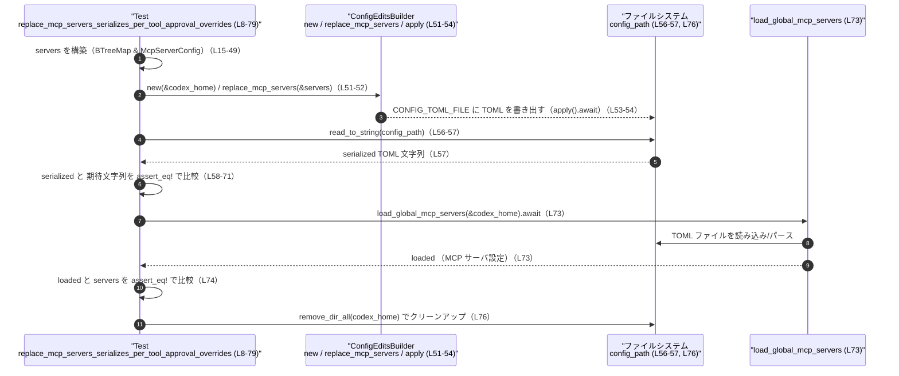

# config/src/mcp_edit_tests.rs コード解説

## 0. ざっくり一言

MCP サーバ設定の編集処理（`ConfigEditsBuilder::replace_mcp_servers`）が、**ツール単位の `approval_mode` を正しく TOML にシリアライズし、再読み込みしても同じ構造になるか**を検証する非同期テストです。

---

## 1. このモジュールの役割

### 1.1 概要

- このテストモジュールは、MCP サーバ設定編集機能のうち  
  「`tools.<tool_name>.approval_mode` の上書きが TOML ファイルにどのように出力されるか」を確認します。  
- TOML ファイルへの書き込みと、その後の読み込み（ラウンドトリップ）を行い、**メモリ上の構造とディスク上の表現が整合していること**を保証します（`assert_eq!` による比較, `config/src/mcp_edit_tests.rs:L58-71, L73-74`）。

### 1.2 アーキテクチャ内での位置づけ

このテスト関数は、設定編集ロジックとファイル I/O・デシリアライズの間の整合性を検証する「統合テスト」に近い役割を持ちます。



- テスト関数は `ConfigEditsBuilder` を通じて TOML ファイルを書き出し（`L51-54`）、  
  `std::fs::read_to_string` でその内容を検証し（`L56-57, L58-71`）、  
  `load_global_mcp_servers` で再読み込みしてオブジェクト比較を行います（`L73-74`）。

### 1.3 設計上のポイント

- **一時ディレクトリの分離**
  - OS のテンポラリディレクトリ配下に、プロセス ID とナノ秒精度のタイムスタンプを含むサブディレクトリ `codex_home` を作成しています（`L10-14`）。
  - これによりテストごとに独立した作業ディレクトリが確保され、他のテストや実際の設定ファイルと干渉しません。

- **完全ラウンドトリップ検証**
  - シリアライズ結果の TOML テキストを文字列として厳密に比較（`assert_eq!(serialized, expected_str)`）し（`L58-71`）、  
    さらに `load_global_mcp_servers` で再読み込みしてオブジェクト比較を行う二重チェック構成になっています（`L73-74`）。

- **非同期テスト & エラー伝播**
  - `#[tokio::test]` と `async fn ... -> anyhow::Result<()>` を用い、非同期処理（`.await`）と `?` によるエラー伝播を組み合わせています（`L8-9, L10, L51-54, L57, L73, L76`）。
  - テスト内でエラーが発生した場合は `anyhow::Error` として上位に返り、テストが失敗します。

- **Rust の安全性**
  - 一時ディレクトリパス `codex_home` は `&codex_home` として関数に借用で渡されており、所有権はテスト関数内に保持されたままです（`ConfigEditsBuilder::new(&codex_home)`, `load_global_mcp_servers(&codex_home)`、`L51, L73`）。
  - `std::fs::remove_dir_all(&codex_home)` により最後にディレクトリを削除しますが（`L76`）、削除後に `codex_home` 自体はパス値としてのみ残り、ファイル I/O は行われません。

---

## 2. 主要な機能一覧

- MCP サーバ設定 `servers` を構築し、`ConfigEditsBuilder::replace_mcp_servers` を通じて設定ファイルに反映する（`L15-49, L51-54`）。
- 出力された TOML ファイルの内容が期待どおりであることを文字列比較で検証する（`L56-57, L58-71`）。
- `load_global_mcp_servers` で再読み込みし、元の `servers` と同一であることを検証する（`L73-74`）。
- テスト完了後に一時ディレクトリを削除し、環境をクリーンアップする（`L76`）。

### 2.1 コンポーネント一覧（このファイル内で定義）

| 名前 | 種別 | 役割 / 用途 | 定義位置 |
|------|------|-------------|----------|
| `replace_mcp_servers_serializes_per_tool_approval_overrides` | 非公開 `async` テスト関数 | MCP サーバ `tools.*.approval_mode` のシリアライズと再読み込み結果が期待どおりになるか検証する | `config/src/mcp_edit_tests.rs:L8-79` |

### 2.2 主要な外部コンポーネント（参照のみ）

このチャンクでは利用のみを確認でき、定義は現れません。

| 名前 | 種別 | 役割 / 用途 | 定義の所在 |
|------|------|-------------|------------|
| `ConfigEditsBuilder` | 構造体/ビルダ（推測） | `new(&codex_home)` → `replace_mcp_servers(&servers)` → `apply().await` で MCP 設定をファイルに書き出す（`L51-54`） | 不明（このチャンクには現れない） |
| `McpServerConfig` | 構造体 | `servers` マップ内のサーバ設定要素（`L17-48`） | 不明（このチャンクには現れない） |
| `McpServerTransportConfig::Stdio` | 列挙体バリアント | MCP サーバの起動方法（標準入出力ベース）を示す（`L18-24`） | 不明 |
| `McpServerToolConfig` | 構造体 | ツール単位の設定。ここでは `approval_mode` のみ設定（`L37-39, L43-45`） | 不明 |
| `AppToolApproval::{Approve, Prompt}` | 列挙体バリアント | ツールごとの承認モードを表す（`L38, L44`） | 不明 |
| `McpServerToolConfig`（フィールド `approval_mode`） | フィールド | `Some(AppToolApproval::...)` の形でツールごとのモードを指定（`L37-39, L43-45`） | 不明 |
| `load_global_mcp_servers` | 非同期関数 | `codex_home` を基準に MCP サーバ設定を読み込む（`L73`） | 不明 |
| `CONFIG_TOML_FILE` | 定数 | `codex_home` 配下の設定ファイル名を表す（`L56`） | 不明 |
| `BTreeMap::from` | 関数 | サーバ名 → `McpServerConfig` の有序マップ `servers` を構築（`L15-49`） | 不明（use 経由またはプレリュード） |
| `HashMap::from` | 関数 | ツール名 → `McpServerToolConfig` のマップを構築（`L34-47`） | `std::collections::HashMap`（`L4`） |
| `SystemTime`, `UNIX_EPOCH` | 構造体・定数 | 一時ディレクトリ名用のナノ秒精度タイムスタンプ生成に使用（`L10`） | `std::time`（`L5-6`） |
| `assert_eq!` | マクロ | 文字列と構造体の等価性を検証（`L58-71, L74`） | `pretty_assertions::assert_eq`（`L3`） |
| `anyhow::Result` | 型エイリアス | テスト関数の戻り値型として汎用エラーを扱う（`L9`） | 不明（外部 crate） |
| `#[tokio::test]` | マクロ属性 | 非同期テストとして Tokio ランタイム上で実行するための属性（`L8`） | `tokio` crate |

---

## 3. 公開 API と詳細解説

### 3.1 型一覧（構造体・列挙体など）

このファイル内で **新たに定義される型はありません**。  
すべての型は他モジュール／標準ライブラリからの利用です（`use` 文, `L1-6`）。

### 3.2 関数詳細

#### `replace_mcp_servers_serializes_per_tool_approval_overrides() -> anyhow::Result<()>`

**概要**

- MCP サーバ `docs` とそのツール `search`, `read` の `approval_mode` を含む設定を構築し、  
  `ConfigEditsBuilder::replace_mcp_servers` で設定ファイルに書き出します（`L15-49, L51-54`）。
- 書き出された TOML テキストが期待どおりであること、および `load_global_mcp_servers` での再読み込み結果が元の設定と等しいことを検証します（`L56-57, L58-71, L73-74`）。

**引数**

このテスト関数は引数を取りません。

| 引数名 | 型 | 説明 |
|--------|----|------|
| なし | - | - |

**戻り値**

- `anyhow::Result<()>`  
  - 成功時: `Ok(())` を返します（`L78`）。  
  - 失敗時: 内部で `?` によって発生したエラーが `anyhow::Error` としてラップされて返り、テストは失敗します。

**内部処理の流れ（アルゴリズム）**

1. **一意な一時ディレクトリ名の生成**  
   - `SystemTime::now().duration_since(UNIX_EPOCH)?.as_nanos()` でナノ秒単位のタイムスタンプを生成し `unique_suffix` に格納します（`L10`）。  
   - ここでの `?` により、時間計算に失敗した場合は即座に `Err` を返します。

2. **一時ディレクトリ `codex_home` の決定**  
   - `std::env::temp_dir()` で OS のテンポラリディレクトリを取得し（外部知識、コードでは `temp_dir()` 呼び出し, `L11`）、  
     `"codex-config-mcp-edit-test-{}-{unique_suffix}"` というフォーマットのサブディレクトリを結合して `codex_home` とします（`L11-14`）。

3. **MCP サーバ設定 `servers` の構築**  
   - `BTreeMap::from` により、キー `"docs"` に対応する `McpServerConfig` を一つ持つマップ `servers` を作成します（`L15-16, L17-48`）。
   - `McpServerConfig` では以下を設定しています（`L17-33, L34-47`）:
     - `transport: McpServerTransportConfig::Stdio { command: "docs-server", args: Vec::new(), env: None, env_vars: Vec::new(), cwd: None }`（`L18-24`）
     - `enabled: true`（`L25`）、`required: false`（`L26`）、その他のオプションフィールドは `None` または `None` 相当（`L27-33`）。
     - `tools: HashMap::from([...])` としてツール設定を二つ定義（`L34-47`）:
       - `"search"`: `approval_mode: Some(AppToolApproval::Approve)`（`L35-40`）
       - `"read"`: `approval_mode: Some(AppToolApproval::Prompt)`（`L41-46`）

4. **設定の書き出し**  
   - `ConfigEditsBuilder::new(&codex_home)` でビルダを初期化し（`L51`）、  
     `.replace_mcp_servers(&servers)` で MCP サーバ設定の置き換えを指定（`L52`）、  
     `.apply().await?` で実際に設定ファイルへの書き込みを行います（`L53-54`）。
   - `.await?` により、非同期処理のエラーは `?` を通じて呼び出し元に伝播します。

5. **TOML テキストの読み取りと検証**  
   - `config_path = codex_home.join(CONFIG_TOML_FILE)` で設定ファイルパスを構成（`L56`）。
   - `std::fs::read_to_string(&config_path)?` でファイルを同期的に読み込み、`serialized` に格納（`L57`）。
   - `assert_eq!(serialized, r#"...TOML..."#)` で、**期待する TOML テキストと完全一致すること**を検証します（`L58-71`）。

6. **再読み込みと構造体比較**  
   - `let loaded = load_global_mcp_servers(&codex_home).await?;` で TOML ファイルから MCP サーバ設定を読み込み（`L73`）、  
     `assert_eq!(loaded, servers);` で元の `servers` と等しいことを検証します（`L74`）。

7. **クリーンアップと終了**  
   - `std::fs::remove_dir_all(&codex_home)?;` で `codex_home` ディレクトリごと削除します（`L76`）。
   - 最後に `Ok(())` を返してテストを成功終了とします（`L78`）。

**Examples（使用例）**

この関数はテスト用ですが、同じパターンで別の MCP サーバ設定を検証するテストの例を簡略化して示します。

```rust
#[tokio::test] // Tokio ランタイムで実行される非同期テスト
async fn my_mcp_server_config_roundtrip() -> anyhow::Result<()> {
    // 一時ディレクトリを用意（本ファイルと同様のパターン）
    let codex_home = std::env::temp_dir().join("my-mcp-config-test"); // 実際は一意な名前を付ける

    // サーバ設定を構築（ここでは詳細は省略）
    let servers = /* BTreeMap<String, McpServerConfig> を構築する */;

    // 設定を書き出す
    ConfigEditsBuilder::new(&codex_home) // 所有権ではなく参照を渡す
        .replace_mcp_servers(&servers)   // MCP サーバ定義を置き換える
        .apply()
        .await?;                         // エラーがあればここで ? により戻る

    // 再読み込みして同一性を検証
    let loaded = load_global_mcp_servers(&codex_home).await?; // 非同期にロード
    assert_eq!(loaded, servers);                              // 構造体レベルで比較

    // 後片付け
    std::fs::remove_dir_all(&codex_home)?;                    // 一時ディレクトリを削除

    Ok(())
}
```

**Errors / Panics**

このテスト関数が `Err` を返しうる箇所と panic しうる箇所は次のとおりです。

- **`Err` を返しうる箇所（`?` を通じた伝播）**
  - `SystemTime::now().duration_since(UNIX_EPOCH)?`（`config/src/mcp_edit_tests.rs:L10`）  
    - 時刻計算でエラーとなった場合に `Err` が返ります。
  - `ConfigEditsBuilder::new(&codex_home)...apply().await?`（`L51-54`）  
    - 設定ファイルの書き込み時のエラー（I/O エラーなど）が `?` 経由で伝播します。
  - `std::fs::read_to_string(&config_path)?`（`L57`）  
    - ファイルが存在しない、読み取り不能などで `Err` が返る可能性があります。
  - `load_global_mcp_servers(&codex_home).await?`（`L73`）  
    - 読み込みやパース時のエラーが `?` で返されます。
  - `std::fs::remove_dir_all(&codex_home)?`（`L76`）  
    - ディレクトリ削除に失敗した場合に `Err` が返ります。

- **panic の可能性**
  - `assert_eq!(serialized, expected_toml)`（`L58-71`）  
    - シリアライズされた TOML テキストが期待値と異なる場合、`assert_eq!` が panic します。
  - `assert_eq!(loaded, servers)`（`L74`）  
    - 再読み込みした構造が元の `servers` と異なる場合に panic します。

**Edge cases（エッジケース）**

このテストから読み取れる範囲でのエッジケースと、その扱いです。

- **ツールごとの `approval_mode` の組み合わせ**
  - テストでは `"search"`: `Approve`, `"read"`: `Prompt` の 2 パターンのみを検証しています（`L35-46`）。  
    他の `AppToolApproval` バリアントや `approval_mode = None` の挙動は、このチャンクからは分かりません。

- **シリアライズされるフィールドの範囲**
  - `McpServerConfig` には `enabled`, `required`, いくつかの `*_timeout_sec`, `scopes`, `oauth_resource` 等が設定されていますが（`L25-33`）、  
    期待 TOML には `command` と `tools.*.approval_mode` しか含まれていません（`L60-69`）。  
    → このテストは **「最低限これらのフィールドが期待どおり出力されること」** のみを保証しており、  
      他フィールドがどのようにシリアライズされるかはテスト対象外です。

- **ツールセクションの順序**
  - `HashMap::from([...])` では `"search"` → `"read"` の順で指定されていますが（`L34-47`）、  
    期待 TOML では `[mcp_servers.docs.tools.read]` → `[mcp_servers.docs.tools.search]` の順となっています（`L65-69`）。  
    → シリアライザ側が何らかの順序（例えばキーのソート）で出力している可能性がありますが、  
      テストからは実装詳細は分からず、**順序がこの期待値に一致することだけが前提**です。

- **一時ディレクトリのクリーンアップ**
  - `remove_dir_all` はテストの最後でのみ呼ばれているため（`L76`）、  
    それ以前にエラーや `assert_eq!` の失敗が起きた場合、一時ディレクトリは削除されません。  
    → これはテスト失敗時に内容が残るという意味で、デバッグには有用ですが、  
      長期的に一時ディレクトリが蓄積する可能性があります。

**使用上の注意点**

- **非同期コンテキストでの同期 I/O の使用**
  - テスト内では `std::fs::read_to_string` および `std::fs::remove_dir_all` の同期 I/O を `async` 関数内で呼び出しています（`L57, L76`）。  
  - テストコードとしては一般的ですが、同様のパターンを本番の非同期処理に持ち込む場合は、  
    ブロッキング I/O によるスレッド占有に注意が必要です。

- **ディレクトリ名の一意性**
  - `unique_suffix`（`L10`）とプロセス ID（`L13`）をディレクトリ名に含めているため、  
    テスト間や実行プロセス間でディレクトリ名が衝突しにくい構成です（`L11-14`）。  
    一方で、ファイル名のフォーマットに依存するコードを追加する場合は、この命名規則を前提にしてしまわないよう注意が必要です。

- **テストの脆さ（文字列比較）**
  - 期待値を生の TOML 文字列として比較しているため（`L58-71`）、空行やコメント、フィールドの並び順といった**フォーマットの細部の変更**でもテストが失敗します。  
  - シリアライザの仕様変更（例: セクションの順序変更）を行う場合は、このテストの期待文字列も同時に更新する必要があります。

### 3.3 その他の関数

このファイル内に、上記以外の関数定義はありません。

---

## 4. データフロー

このテストにおけるデータの流れは、「メモリ上の設定 → ファイル → メモリ上の設定（再読み込み）」というラウンドトリップです。

1. テスト関数が `servers: BTreeMap<String, McpServerConfig>` を構築します（`L15-49`）。
2. `ConfigEditsBuilder::replace_mcp_servers(...).apply().await` により、`servers` が TOML ファイルとして `codex_home/CONFIG_TOML_FILE` に書き出されます（`L51-54, L56`）。
3. そのファイルから `std::fs::read_to_string` で TOML テキストを取得し（`L56-57`）、期待文字列と比較します（`L58-71`）。
4. さらに `load_global_mcp_servers(&codex_home).await` により TOML が再パースされ、`loaded` としてメモリ上に再構築されます（`L73`）。
5. `loaded` と `servers` を比較し、構造レベルでの一致を確認します（`L74`）。



---

## 5. 使い方（How to Use）

### 5.1 基本的な使用方法（テストパターンとして）

このファイルは「MCP 設定のシリアライズ/デシリアライズ」が意図どおりかを検証するテストのサンプルとして利用できます。  
典型的な流れは次の通りです。

```rust
#[tokio::test]                         // 非同期テストとして宣言（L8）
async fn my_mcp_test() -> anyhow::Result<()> {
    // 1. 一時ディレクトリを準備（L10-14 と同様）
    let unique_suffix = SystemTime::now().duration_since(UNIX_EPOCH)?.as_nanos();
    let codex_home = std::env::temp_dir().join(format!(
        "codex-config-mcp-edit-test-{}-{unique_suffix}",
        std::process::id(),
    ));

    // 2. MCP サーバ設定を構築（L15-49 と同様のパターン）
    let servers = /* BTreeMap<String, McpServerConfig> を構築 */;

    // 3. ConfigEditsBuilder 経由でファイルに書き出す（L51-54）
    ConfigEditsBuilder::new(&codex_home)
        .replace_mcp_servers(&servers)
        .apply()
        .await?;

    // 4. 必要に応じて TOML テキストを検証（L56-57, L58-71）
    let config_path = codex_home.join(CONFIG_TOML_FILE);
    let serialized = std::fs::read_to_string(&config_path)?;
    // 期待される出力を assert_eq! で比較するなど

    // 5. 再読み込みの結果も検証（L73-74）
    let loaded = load_global_mcp_servers(&codex_home).await?;
    assert_eq!(loaded, servers);

    // 6. クリーンアップ（L76）
    std::fs::remove_dir_all(&codex_home)?;

    Ok(())
}
```

### 5.2 よくある使用パターン（テスト拡張の例）

このテストパターンは、次のようなバリエーションに拡張できます（コードから自然に導かれる利用形態です）。

- **別の `approval_mode` の組み合わせを検証する**
  - 例: すべてのツールを `Approve` にした場合の TOML 出力を検証する。
  - `servers` の `McpServerToolConfig { approval_mode: ... }` 部分を変更し、期待 TOML と読み込み結果を比較する（`L34-47, L58-71` を参考）。

- **追加フィールドのシリアライズを検証する**
  - 新たに `startup_timeout_sec` などを利用する場合、期待 TOML に該当フィールドを追加し、  
    `assert_eq!(serialized, r#"...")` を更新してフォーマットを固定する（`L28-29, L58-71`）。

### 5.3 よくある間違い（想定される誤用パターン）

コードから自然に起こりうる誤りは次のようなものです。

```rust
// 間違い例: ConfigEditsBuilder::apply を await していない
ConfigEditsBuilder::new(&codex_home)
    .replace_mcp_servers(&servers);
// この時点ではファイルは書き出されていない可能性が高い

// 正しい例: apply().await? まで呼び出す（L51-54）
ConfigEditsBuilder::new(&codex_home)
    .replace_mcp_servers(&servers)
    .apply()
    .await?;
```

```rust
// 間違い例: 設定を書き出す前に読み込もうとしている
let loaded = load_global_mcp_servers(&codex_home).await?; // 書き出し前だと失敗しうる

// 正しい例: まず apply().await? でファイルを書き出し、その後に読み込む（L51-54, L73）
ConfigEditsBuilder::new(&codex_home)
    .replace_mcp_servers(&servers)
    .apply()
    .await?;
let loaded = load_global_mcp_servers(&codex_home).await?;
```

### 5.4 使用上の注意点（まとめ）

- 非同期テスト内で同期 I/O（`std::fs::read_to_string`, `remove_dir_all`）を用いていることを理解した上で、  
  本番コードでは適切な非同期 I/O を検討する必要があります（`L57, L76`）。
- 文字列比較による検証はフォーマット変更に敏感なため、  
  シリアライズロジックを大きく変更する際は、このテストの期待文字列も合わせて更新する必要があります（`L58-71`）。
- 一時ディレクトリの削除はテスト成功時にしか行われないため、  
  長期的なテスト環境の運用では不要なディレクトリが溜まっていないか確認が必要です（`L76`）。

---

## 6. 変更の仕方（How to Modify）

### 6.1 新しい機能（テストケース）を追加する場合

1. **検証したいシナリオを定義する**
   - 例: 新しい `approval_mode` バリアント追加時のシリアライズ結果を確認したい、  
     新しいフィールド（例: `scopes`）がどのように TOML に出力されるか確認したい、など。

2. **新しいテスト関数を追加**
   - `#[tokio::test] async fn ... -> anyhow::Result<()>` の形で、本ファイルのテスト関数と同様のシグネチャで追加します。

3. **`servers` の構築部分を調整**
   - 対象とする MCP サーバやツールの構成、`McpServerToolConfig` のフィールドを変更します（`L15-49` を参考）。

4. **期待 TOML 文字列を作成**
   - `assert_eq!(serialized, r#"...TOML..."#);` 形式で、新たなシナリオに対応する期待値を書きます（`L58-71` と同じパターン）。

5. **再読み込みと構造体比較を追加**
   - 必要に応じて `load_global_mcp_servers` での再読み込みと `assert_eq!(loaded, servers)` による構造体比較を追加します（`L73-74`）。

### 6.2 既存の機能（テスト）を変更する場合

- **シリアライズ仕様の変更時**
  - `ConfigEditsBuilder` やシリアライザ側で TOML 出力形式を変更した場合、  
    本テストの期待文字列（`L60-69`）を新仕様に合わせて更新する必要があります。
  - その際、`servers` の構築（`L15-49`）と期待 TOML が矛盾していないか確認します。

- **`McpServerConfig` 構造の変更時**
  - フィールド追加・削除を行った場合、`servers` の初期化コード（`L17-33`）を更新する必要があります。
  - テストが対象とするフィールドがどれか（現在は `command` と `tools.*.approval_mode`）を再確認し、  
    必要に応じて検証対象フィールドを拡張します。

- **エラーハンドリングや非同期ランタイムの変更時**
  - `anyhow::Result<()>` 以外のエラー型を使うように変更する場合、関数シグネチャと `?` の利用箇所（`L9-10, L51-54, L57, L73, L76`）をまとめて見直す必要があります。
  - Tokio 以外のランタイムへ移行する場合は、`#[tokio::test]` 属性（`L8`）を対応するマクロへ置き換えることになります。

---

## 7. 関連ファイル

このテストが密接に依存しているが、このチャンクには定義が現れないコンポーネントをまとめます。パスはコードからは読み取れないため「不明」とします。

| パス | 役割 / 関係 |
|------|------------|
| 不明（`ConfigEditsBuilder` の定義ファイル） | `ConfigEditsBuilder::new`, `replace_mcp_servers`, `apply` を提供し、本テストから呼び出されます（`config/src/mcp_edit_tests.rs:L51-54`）。 |
| 不明（`McpServerConfig` / `McpServerTransportConfig` の定義ファイル） | MCP サーバの設定構造を提供し、本テストで `servers` を構築する際に使用されています（`L17-24`）。 |
| 不明（`McpServerToolConfig` / `AppToolApproval` の定義ファイル） | MCP ツールごとの承認モードなどを表現する型で、本テストでは `approval_mode` を設定しています（`L34-47`）。 |
| 不明（`load_global_mcp_servers` の定義ファイル） | `codex_home` 以下の設定ファイルから MCP サーバ定義を読み込む処理を担い、本テストでのラウンドトリップ検証に利用されています（`L73-74`）。 |
| 不明（`CONFIG_TOML_FILE` の定義ファイル） | MCP 設定の TOML ファイル名を表す定数で、`codex_home.join(CONFIG_TOML_FILE)` の形で使用されています（`L56`）。 |

このチャンクからは、これらのコンポーネントがどのモジュール階層・ファイルに定義されているかは分かりませんが、  
**MCP 設定の永続化と読み込みを担う中核モジュール**と本テストが密接に結合していることが読み取れます。
