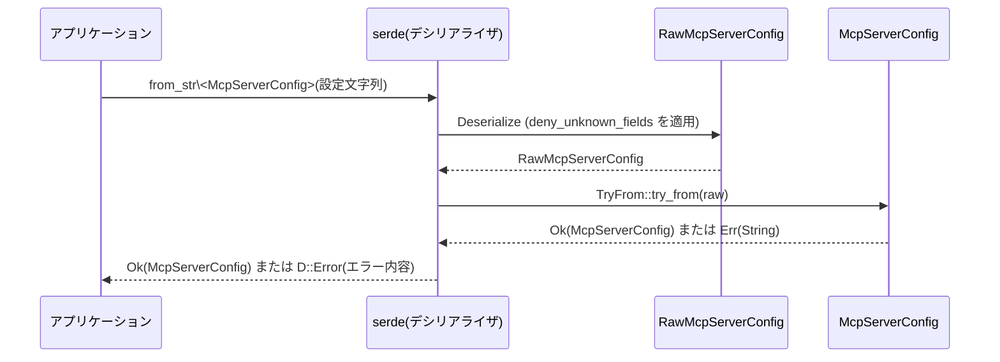

# config/src/mcp_types.rs コード解説

## 0. ざっくり一言

MCP（Model Context Protocol）サーバーの設定を表現するための型群と、それらへのデシリアライズ／バリデーションロジックをまとめたモジュールです。  
特に、**生の設定（Raw）→検証済みの設定（McpServerConfig）への変換**と、**タイムアウト秒数のカスタムシリアライズ**がコアになっています。

---

## 1. このモジュールの役割

### 1.1 概要

- このモジュールは、MCP サーバーの設定を安全かつ一貫した形で扱うための型と変換ロジックを提供します。
- TOML/JSON 等から読み込まれる「生の設定」[`RawMcpServerConfig`] を、利用側が使いやすい [`McpServerConfig`] に変換する際の**検証とデフォルト補完**を担当します（`TryFrom<RawMcpServerConfig> for McpServerConfig` 実装, `config/src/mcp_types.rs:L163-253`）。
- MCP サーバーの**接続方法（stdin/stdout 経由 or HTTP）**や**タイムアウト・ツールの許可設定**など、MCP サーバーに関する主要な設定項目をひとまとめにしています。

### 1.2 アーキテクチャ内での位置づけ

このモジュールが直接依存している要素は次の通りです。

- 標準ライブラリ:
  - `std::collections::HashMap`（環境変数・ヘッダ・ツール設定のマップ, `L3`）
  - `std::path::PathBuf`（カレントディレクトリ, `L5`）
  - `std::time::Duration`（タイムアウト値, `L6`）
- 外部クレート:
  - `serde`（シリアライズ／デシリアライズ, `L9-L12`）
  - `schemars`（JSON Schema 生成, `L8`）
- 同一クレート内:
  - `crate::RequirementSource`（サーバーが無効化された理由で使用, `L14`, `L36`）

依存関係を簡略図にすると、以下のようになります。

```mermaid
%% モジュール内の主な依存関係 (config/src/mcp_types.rs:L3-14, L31-37, L163-253, L271-301)
graph LR
  subgraph "このモジュール"
    A[McpServerConfig]
    B[RawMcpServerConfig]
    C[McpServerTransportConfig]
    D[McpServerDisabledReason]
    E[AppToolApproval / McpServerToolConfig]
  end

  A --> B:::conv   %% DeserializeでRaw→McpServerConfig変換
  A --> C          %% transportフィールド
  A --> E          %% toolsフィールド
  D --> Req[RequirementSource]
  A --> Serde[serde]
  B --> Serde
  C --> Serde
  A --> Schem[schemars]

  classDef conv fill:#eef,stroke:#00f;
```

> このチャンクには、`McpServerConfig` がどこから呼ばれているか（利用側のコード）は出てきません。

### 1.3 設計上のポイント

- **Raw と確定値の分離**  
  - ファイルから直接デシリアライズされる `RawMcpServerConfig`（`L116-161`）と、利用側が使う `McpServerConfig`（`L59-107`）を分けています。
  - 変換ロジックを `TryFrom<RawMcpServerConfig> for McpServerConfig` に集中させることで、**検証・デフォルト・互換性**を一箇所に集約しています（`L163-253`）。

- **厳密な入力検証**  
  - `#[schemars(deny_unknown_fields)]` により、`RawMcpServerConfig` に未知のフィールドがあるとエラーになります（`L115`）。
  - 運搬方法（stdio / streamable_http）によって**使えないフィールドを明示的にエラーにする**ヘルパー `throw_if_set` を内部に定義しています（`L199-204`）。

- **タイムアウトの型安全な扱い**  
  - 内部表現は `Duration` 型で統一しつつ、シリアライズ時には秒数 `f64` として出力するためのモジュール `option_duration_secs` を用意しています（`L303-327`）。
  - 秒数から `Duration` への変換には `Duration::try_from_secs_f64` を使い、オーバーフローや NaN をエラーとして扱っています（`L191-195`, `L323-325`）。

- **Rust 言語特有の安全性・エラー・並行性**
  - このファイルには `unsafe` ブロックはなく、すべて安全な Rust で記述されています。
  - 失敗の可能性がある処理は `Result` 経由で表現されます:
    - `TryFrom<RawMcpServerConfig>` → `Result<McpServerConfig, String>`（`L163-165`）
    - `McpServerConfig` の `Deserialize` 実装 → `Result<Self, D::Error>`（`L256-264`）
    - `option_duration_secs::deserialize` → `Result<Option<Duration>, D::Error>`（`L319-326`）
  - 並行処理や共有可変状態は出てこず、**純粋なデータ型と変換ロジックのみ**で構成されています。

---

## 2. 主要な機能一覧

このモジュールが提供する主な機能は次の通りです。

- MCP サーバーツールの承認モードの定義: [`AppToolApproval`]（`L16-23`）
- MCP サーバーが無効化された理由の表現: [`McpServerDisabledReason`] とその `Display` 実装（`L31-37`, `L39-47`）
- ツール単位の承認設定: [`McpServerToolConfig`]（`L50-57`）
- MCP サーバー全体の確定済み設定: [`McpServerConfig`]（`L59-107`）
- 生の設定（ファイル入力）: [`RawMcpServerConfig`]（`L116-161`）
- MCP サーバーのトランスポート種別（stdio / HTTP）: [`McpServerTransportConfig`]（`L271-301`）
- Raw 設定から確定設定への変換と検証: `TryFrom<RawMcpServerConfig> for McpServerConfig`（`L163-253`）
- `Duration` を秒数 `f64` としてシリアライズ／デシリアライズするユーティリティ: `option_duration_secs` モジュール（`L303-327`）

---

## 3. 公開 API と詳細解説

### 3.1 型一覧（構造体・列挙体など）

#### 公開型インベントリ

| 名前 | 種別 | 公開範囲 | 役割 / 用途 | 定義行 |
|------|------|----------|------------|--------|
| `AppToolApproval` | enum | `pub` | 各 MCP ツールの承認モード（自動／プロンプト／常に承認）を表します。Serde では `auto` / `prompt` / `approve` の snake_case 文字列としてシリアライズされます。 | `config/src/mcp_types.rs:L16-23` |
| `McpServerDisabledReason` | enum | `pub` | 要件適用後に MCP サーバーが無効化された理由を、人間向けに表現します。 | `L31-37` |
| `McpServerToolConfig` | struct | `pub` | ツール単位の承認設定を保持します（`approval_mode`）。 | `L50-57` |
| `McpServerConfig` | struct | `pub` | 実際にアプリケーションから利用される MCP サーバー設定。トランスポート、タイムアウト、ツールの allow/deny リストなどを含みます。 | `L59-107` |
| `RawMcpServerConfig` | struct | `pub` | デシリアライズおよび JSON Schema 生成用の「生」設定。トランスポートごとに利用可能なフィールドを含みます。 | `L116-161` |
| `McpServerTransportConfig` | enum | `pub` | MCP サーバーへの接続方式（`Stdio` / `StreamableHttp`）を表します。untagged enum として serde で扱われます。 | `L271-301` |

#### 非公開モジュール・補助

| 名前 | 種別 | 公開範囲 | 役割 / 用途 | 定義行 |
|------|------|----------|------------|--------|
| `option_duration_secs` | module | private | `Option<Duration>` を serde で `Option<f64>` （秒数）としてシリアライズ／デシリアライズするためのユーティリティです。 | `L303-327` |
| `tests` | module | private（`cfg(test)`） | このモジュールのテストを `mcp_types_tests.rs` に分離するためのモジュール宣言です。 | `L329-331` |

#### 関数 / メソッド一覧（インベントリ）

| 関数名 | 所属 | シグネチャ（概略） | 役割 | 定義行 |
|--------|------|--------------------|------|--------|
| `fmt` | `impl fmt::Display for McpServerDisabledReason` | `fn fmt(&self, f: &mut fmt::Formatter<'_>) -> fmt::Result` | 無効化理由を人間向けの短い文字列に整形します。 | `L39-47` |
| `try_from` | `impl TryFrom<RawMcpServerConfig> for McpServerConfig` | `fn try_from(raw: RawMcpServerConfig) -> Result<Self, String>` | 生の設定を検証・変換して `McpServerConfig` を生成します。 | `L166-253` |
| `deserialize` | `impl<'de> Deserialize<'de> for McpServerConfig` | `fn deserialize<D>(deserializer: D) -> Result<Self, D::Error>` | 直接 `McpServerConfig` へデシリアライズするためのエントリポイントです（内部で Raw を経由）。 | `L256-264` |
| `default_enabled` | free function | `const fn default_enabled() -> bool` | `enabled` フィールドのデフォルト（`true`）を返します。 | `L267-269` |
| `serialize` | `option_duration_secs` | `pub fn serialize<S>(value: &Option<Duration>, serializer: S) -> Result<S::Ok, S::Error>` | `Option<Duration>` を `Option<f64>`（秒）としてシリアライズします。 | `L309-317` |
| `deserialize` | `option_duration_secs` | `pub fn deserialize<'de, D>(deserializer: D) -> Result<Option<Duration>, D::Error>` | `Option<f64>`（秒）から `Option<Duration>` へデシリアライズします。 | `L319-326` |
| `throw_if_set` | `try_from` 内部関数 | `fn throw_if_set<T>(transport: &str, field: &str, value: Option<&T>) -> Result<(), String>` | トランスポートに対してサポートされないフィールドが設定されていないかをチェックします。 | `L199-204` |

---

### 3.2 関数詳細

#### `McpServerDisabledReason::fmt(&self, f: &mut fmt::Formatter<'_>) -> fmt::Result`

**概要**

- `McpServerDisabledReason` を CLI/TUI で表示しやすい短い文字列に変換します（`L39-47`）。
- `Debug` 表現ではなく、**ユーザー向けのメッセージ**を一定に保つことが意図されています（コメント `L28-30`）。

**引数**

| 引数名 | 型 | 説明 |
|--------|----|------|
| `self` | `&McpServerDisabledReason` | 出力したい無効化理由。 |
| `f` | `&mut fmt::Formatter<'_>` | フォーマッタ（`println!` や `format!` から渡されます）。 |

**戻り値**

- `fmt::Result`  
  - 書き込み成功時は `Ok(())`、失敗時は `Err(fmt::Error)`。

**内部処理の流れ**

1. `match self` でバリアントを分岐（`L41-44`）。
2. `Unknown` の場合は `"unknown"` を書き込み（`L42`）。
3. `Requirements { source }` の場合は `"requirements ({source})"` を書き込み（`L43-44`）。`source` は `RequirementSource` の `Display` に依存します。

**Examples（使用例）**

```rust
use std::fmt::Write; // for write! on String

let reason_unknown = McpServerDisabledReason::Unknown; // unknown 理由
let reason_req = McpServerDisabledReason::Requirements {
    source: RequirementSource::ConfigFile,             // 仮のバリアント名（実際の定義はこのチャンクにはありません）
};

let mut s = String::new();
write!(&mut s, "{reason_unknown}").unwrap();           // "unknown" が書き込まれる
assert_eq!(s, "unknown");

s.clear();
write!(&mut s, "{reason_req}").unwrap();               // "requirements (...)" 形式
// 実際の文字列は RequirementSource の Display 実装に依存します。
```

> `RequirementSource` の具体的なバリアント名は、このチャンクには現れません。

**Errors / Panics**

- `fmt::Result` のエラーは、`write!` が `f` への書き込みに失敗したときに返ります（I/O エラーなど）。
- 自身では `panic!` は行いません。

**Edge cases（エッジケース）**

- 具体的なバリアントは 2 つのみ（`Unknown` / `Requirements`）であり、`match` は網羅的です（`L32-37`, `L41-45`）。
- `Requirements` の `source` がどのような表示になるかは `RequirementSource` 依存です。

**使用上の注意点**

- CLI/TUI などユーザーに見える場所では `Debug` ではなく、この `Display` を使うことがコメントで推奨されています（`L28-30`）。

---

#### `McpServerConfig::try_from(raw: RawMcpServerConfig) -> Result<McpServerConfig, String>`

**概要**

- 生の設定 `RawMcpServerConfig` を**検証しつつ**、利用側が使う `McpServerConfig` に変換します（`L163-253`）。
- 不正な組み合わせ（例: stdio なのに HTTP 専用フィールドが設定されている、transport が指定されていない等）を検出し、`Err(String)` として返します。

**引数**

| 引数名 | 型 | 説明 |
|--------|----|------|
| `raw` | `RawMcpServerConfig` | デシリアライズ直後の生設定。全フィールドが `Option` になっており、運搬方法ごとに使えるフィールドが異なります。 |

**戻り値**

- `Result<McpServerConfig, String>`  
  - 正常時: `Ok(McpServerConfig)` – 検証済みの設定。
  - 異常時: `Err(String)` – エラー内容を説明するメッセージ（英語）。

**内部処理の流れ（アルゴリズム）**

1. **構造体の分解**  
   `let RawMcpServerConfig { ... } = raw;` で全フィールドをローカル変数に展開します（`L167-189`）。  
   コメントに「この分解を網羅的に維持すること」とあり、新しいフィールド追加時に変換ロジックの更新漏れを防ぐ意図が示されています（`L109-113`）。

2. **起動タイムアウトの統合**  
   `startup_timeout_sec: Option<f64>` と `startup_timeout_ms: Option<u64>` の 2 つの入力表現から、`Option<Duration>` を計算します（`L191-197`）。
   - `Some(sec)` が指定されていれば、それを優先し `Duration::try_from_secs_f64(sec)` で変換。
   - `secs` が `None` かつ `ms` が `Some` なら `Duration::from_millis(ms)`。
   - 両方 `None` なら `None`。
   - `try_from_secs_f64` が失敗した場合は `err.to_string()` をして `Err(String)` を返します。

3. **サポートされないフィールドのチェック (`throw_if_set`)**  
   内部関数 `throw_if_set` を定義し（`L199-204`）:
   - `value` が `Some` なら `"field is not supported for transport"` の形式でエラー。
   - `None` なら OK。

4. **transport の決定**（`L206-238`）
   - `command` が `Some` → `stdio` とみなし `McpServerTransportConfig::Stdio` を生成（`L206-223`）。
     - stdio ではサポートされないフィールド（`url`, `bearer_token_env_var`, `bearer_token`, `http_headers`, `env_http_headers`, `oauth_resource`）に値が設定されていないか `throw_if_set` でチェック（`L207-216`）。
     - `args` は `unwrap_or_default()` で `Vec::new()` にフォールバック（`L219`）。
     - `env_vars` も `unwrap_or_default()` で空ベクタにフォールバック（`L221`）。
   - そうでなく `url` が `Some` → `streamable_http` とみなし `McpServerTransportConfig::StreamableHttp` を生成（`L224-235`）。
     - この場合、`args`, `env`, `env_vars`, `cwd`, `bearer_token` はサポートされないため、`throw_if_set` でエラーに（`L225-229`）。
     - `bearer_token_env_var`, `http_headers`, `env_http_headers` はそのまま保持（`L231-235`）。
   - `command` も `url` も `None` の場合 → `"invalid transport"` というエラー文字列で `Err`（`L236-238`）。

5. **その他のフィールドのマッピングとデフォルト**（`L240-252`）
   - `enabled`: `enabled.unwrap_or_else(default_enabled)` → `Some` ならその値、`None` なら `true`（`L244`, `L267-269`）。
   - `required`: `required.unwrap_or_default()` → `Some` ならその値、`None` なら `false`（`L245`）。
   - `tool_timeout_sec`: そのままコピー（`L243`）。`Raw` 側のフィールドはすでに `Duration` 型（`L141-143`）。
   - `disabled_reason`: 変換時点では常に `None`（`L246`）。
   - `enabled_tools`, `disabled_tools`, `scopes`, `oauth_resource`: いずれも `Option` のまま移譲（`L247-250`）。
   - `tools`: `tools.unwrap_or_default()` で `None` の場合は空 `HashMap` に（`L251`）。

**Examples（使用例）**

```rust
use serde::Deserialize;

// 生の設定を直接 McpServerConfig にデシリアライズする例。
// 実際のパスはクレート構成に依存します（例: crate::mcp_types::McpServerConfig など）。
let json = r#"
{
  "command": "my-mcp-server",
  "args": ["--port", "8080"],
  "startup_timeout_sec": 5.0,
  "tool_timeout_sec": 30.0,
  "enabled": true,
  "required": false
}
"#;

let server: McpServerConfig = serde_json::from_str(json)?; // 内部で RawMcpServerConfig → McpServerConfig 変換が行われる
assert!(matches!(server.transport, McpServerTransportConfig::Stdio { .. }));
assert_eq!(server.enabled, true);
```

**Errors / Panics**

- `startup_timeout_sec` が非常に大きい値や NaN/負数などで `Duration::try_from_secs_f64` が失敗すると、`Err("<error_string>")` が返ります（`L191-195`）。
- stdio で HTTP 専用フィールドが指定されている等、不正な組み合わせの場合 `"{field} is not supported for {transport}"` というエラー文字列が返ります（`L199-204`, `L207-216`, `L225-229`）。
- `command` と `url` のどちらも指定されていない場合 `"invalid transport"` エラーになります（`L236-238`）。
- この関数自体は `panic!` を行いません。

**Edge cases（エッジケース）**

- `startup_timeout_sec` と `startup_timeout_ms` が両方 `Some` の場合、`startup_timeout_sec`（秒）の方が優先され、`ms` は無視されます（`L191-195`）。
- `command` と `url` が両方 `Some` の場合、コード上は `command` 分岐が優先され、`url` は未使用のままとなります（`L206-207`）。`throw_if_set` では `url` はチェックせず、そのまま無視されます。
- `enabled` が未指定の場合、`default_enabled` により `true` になります（`L244`, `L267-269`）。
- `tools` が未指定の場合、空の `HashMap` になります（`L251`）。

**使用上の注意点**

- 新たなフィールドを `RawMcpServerConfig` に追加する場合、コメントにある通り `TryFrom<RawMcpServerConfig> for McpServerConfig` のパターン分解とマッピングを**必ず更新する必要があります**（`L109-113`, `L167-189`）。
- `Err(String)` は serde の `Deserialize` 実装経由で `SerdeError::custom` に変換されるため（`L261-263`）、設定ファイル読み込み時のエラーメッセージとして利用されます。

---

#### `impl<'de> Deserialize<'de> for McpServerConfig::deserialize<D>(deserializer: D)`

**概要**

- `McpServerConfig` を直接デシリアライズできるようにするためのカスタム `Deserialize` 実装です（`L256-264`）。
- 内部では一度 `RawMcpServerConfig` としてデシリアライズし、その後 `TryFrom` を使って変換します。

**引数**

| 引数名 | 型 | 説明 |
|--------|----|------|
| `deserializer` | `D`（`serde::Deserializer<'de>` を実装） | serde が提供するデシリアライザ。JSON/TOML/YAML などフォーマットに依存しません。 |

**戻り値**

- `Result<McpServerConfig, D::Error>`  
  - 正常時は検証済みの `McpServerConfig`。
  - 異常時は `serde` のデシリアライズエラー。

**内部処理の流れ**

1. `RawMcpServerConfig::deserialize(deserializer)?` で一度 Raw を生成（`L261`）。
2. `.try_into()` で `McpServerConfig` に変換（`L262`）。
3. `TryFrom` 由来の `Err(String)` を `SerdeError::custom` で `D::Error` に変換（`L262-263`）。

**Examples（使用例）**

```rust
// TOML から直接 McpServerConfig を読む例（パスはクレート構成に依存）
let toml_str = r#"
command = "my-mcp-server"
startup_timeout_sec = 3.0
"#;

let server: McpServerConfig = toml::from_str(toml_str)?; // RawMcpServerConfig → McpServerConfig が自動で行われる
```

**Errors / Panics**

- フォーマット上のエラー（型不一致など）は `RawMcpServerConfig::deserialize` で検出され、`D::Error` として返ります。
- 構造が正しくても、`try_into()` で検証エラー（不正な組み合わせやタイムアウト値の異常など）があれば、`SerdeError::custom` によって同じく `D::Error` になります（`L262-263`）。
- `panic!` は行いません。

**Edge cases**

- `RawMcpServerConfig` に `deny_unknown_fields` が付いているため（`L115`）、設定ファイルに未定義キーが含まれているとデシリアライズ時点でエラーになります。

**使用上の注意点**

- ライブラリ利用側からは `McpServerConfig` を直接デシリアライズすればよく、通常は `RawMcpServerConfig` を直接扱う必要はありません。

---

#### `const fn default_enabled() -> bool`

**概要**

- `McpServerConfig.enabled` のデフォルト値（`true`）を返します（`L267-269`, `L65-66`）。

**引数**

- 引数なし。

**戻り値**

- `bool` – 常に `true`。

**内部処理**

- 実装は単に `true` を返すだけです（`L268`）。

**使用箇所**

- `McpServerConfig::enabled` の serde 属性 `#[serde(default = "default_enabled")]` により（`L65-66`）、設定ファイルで `enabled` が省略された場合に使用されます。

**Edge cases / 注意点**

- `const fn` なのでコンパイル時定数としても使用可能ですが、このファイル内では serde のデフォルト指定にのみ使われています。

---

#### `option_duration_secs::serialize<S>(value: &Option<Duration>, serializer: S) -> Result<S::Ok, S::Error>`

**概要**

- `Option<Duration>` を serde でシリアライズする際に、**秒数 `f64`** として書き出すカスタムシリアライザです（`L309-317`）。

**引数**

| 引数名 | 型 | 説明 |
|--------|----|------|
| `value` | `&Option<Duration>` | シリアライズしたい値。 |
| `serializer` | `S: Serializer` | serde のシリアライザ。 |

**戻り値**

- `Result<S::Ok, S::Error>` – serde 由来の結果。

**内部処理**

1. `match value` で `Some` / `None` を分岐（`L313-316`）。
2. `Some(duration)` の場合:
   - `duration.as_secs_f64()` で `f64` 秒に変換し、`serializer.serialize_some(&secs)` で書き出す（`L313-314`）。
3. `None` の場合:
   - `serializer.serialize_none()` を呼び、`null` や未設定として扱う（`L315-316`）。

**Examples（使用例）**

このモジュール内では、例えば `McpServerConfig::startup_timeout_sec` の serde 属性で使用されています（`L76-82`）。

```rust
#[serde(
    default,
    with = "option_duration_secs",
    skip_serializing_if = "Option::is_none"
)]
pub startup_timeout_sec: Option<Duration>,
```

これにより JSON などでは次のように出力されます。

```json
{
  "startup_timeout_sec": 3.5
}
```

**Errors / Panics**

- シリアライズ対象が `Some` の場合、`serializer.serialize_some` がエラーを返す可能性があります（I/O エラーなど）。
- 関数自体は `panic!` を行いません。

**Edge cases**

- 非常に大きな `Duration` を `as_secs_f64` する場合、`f64` の精度限界により丸め誤差が生じる可能性はありますが、関数内で特別な対処はしていません。

**使用上の注意点**

- このモジュールは「表現形式」を揃えるためのものです。バリデーション（負の値禁止など）はデシリアライズ側で行われます。

---

#### `option_duration_secs::deserialize<'de, D>(deserializer: D) -> Result<Option<Duration>, D::Error>`

**概要**

- シリアライズ側と対になる形で、`Option<f64>`（秒数）から `Option<Duration>` を復元します（`L319-326`）。

**引数**

| 引数名 | 型 | 説明 |
|--------|----|------|
| `deserializer` | `D: Deserializer<'de>` | serde デシリアライザ。 |

**戻り値**

- `Result<Option<Duration>, D::Error>` – 正常時は `Some(Duration)` または `None`。

**内部処理**

1. `let secs = Option::<f64>::deserialize(deserializer)?;` でまず `Option<f64>` として読み込み（`L323`）。
2. `secs.map(|secs| Duration::try_from_secs_f64(secs).map_err(serde::de::Error::custom)).transpose()` を返す（`L324-325`）。
   - `secs` が `Some(sec)` の場合:
     - `Duration::try_from_secs_f64(sec)` を試み、成功なら `Some(Duration)`。
     - 失敗時は `serde::de::Error::custom` でエラー化。
   - `secs` が `None` の場合:
     - そのまま `Ok(None)`。

**Examples（使用例）**

`RawMcpServerConfig::tool_timeout_sec` に `#[serde(default, with = "option_duration_secs")]` として使われています（`L141-143`）。

設定側では次のような形で指定できます。

```toml
tool_timeout_sec = 30.5  # 30.5 秒
```

**Errors / Panics**

- `Duration::try_from_secs_f64` が NaN / 負数 / オーバーフローなどで失敗した場合、`serde::de::Error::custom` に変換され、デシリアライズエラーになります（`L324-325`）。
- この関数自体に `panic!` はありません。

**Edge cases**

- `null` や未指定の場合、`Option::<f64>` は `None` になるため、`Ok(None)` となります。
- `0.0` は有効で、`Duration::from_secs(0)` 相当になります。

**使用上の注意点**

- 入力を `f64` として扱うため、非常に大きな値や高精度な小数は丸め誤差の影響を受ける可能性があります。
- 値域のチェックは `Duration::try_from_secs_f64` に委ねられており、ここでは追加の制限は設けていません。

---

### 3.3 その他の関数

| 関数名 | 役割（1 行） | 備考 |
|--------|--------------|------|
| `throw_if_set<T>(transport: &str, field: &str, value: Option<&T>) -> Result<(), String>` | 指定されたフィールドが `Some` の場合に `"field is not supported for transport"` 形式のエラーを返し、不正な組み合わせを検出します。 | `try_from` 内部にのみ定義されており、外部からは呼び出せません（`L199-204`）。 |

---

## 4. データフロー

ここでは「設定ファイルから `McpServerConfig` を得るまで」の典型的なフローを説明します。

1. アプリケーションが設定ファイル（TOML/JSON 等）を読み込み、serde を使って `McpServerConfig` にデシリアライズしようとする。
2. serde は `impl Deserialize for McpServerConfig` を見つけ、まず `RawMcpServerConfig` にデシリアライズする（`L256-261`）。
3. 次に `TryFrom<RawMcpServerConfig> for McpServerConfig` を呼び出し、トランスポート種別やタイムアウトの統合・検証を行う（`L163-253`）。
4. 成功すれば `McpServerConfig` がアプリケーションに返され、失敗すればデシリアライズエラーとして報告される。



タイムアウトフィールドのフロー（例: `tool_timeout_sec`）は次のようになります。

```mermaid
%% tool_timeout_sec のシリアライズ/デシリアライズ (config/src/mcp_types.rs:L141-143, L309-326)
graph LR
  A[設定ファイルの数値 (f64 秒)] -->|Deserialize+option_duration_secs::deserialize| B[Duration]
  B -->|McpServerConfig に格納| C[McpServerConfig.tool_timeout_sec]
  C -->|Serialize+option_duration_secs::serialize| D[数値 (f64 秒)]
```

---

## 5. 使い方（How to Use）

### 5.1 基本的な使用方法

典型的には、設定ファイルから `McpServerConfig` を直接デシリアライズして使用します。

```rust
use serde::Deserialize;
// 実際のモジュールパスはクレート構成によって異なります。
// 例として crate::mcp_types::McpServerConfig というパスを仮定します。
use crate::mcp_types::{McpServerConfig, McpServerTransportConfig};

fn load_server_config(toml_str: &str) -> Result<McpServerConfig, Box<dyn std::error::Error>> {
    // TOML 文字列から McpServerConfig に直接デシリアライズ
    let config: McpServerConfig = toml::from_str(toml_str)?; // L256-264 の Deserialize 実装が使われる
    Ok(config)
}

fn use_config(config: McpServerConfig) {
    match config.transport {
        McpServerTransportConfig::Stdio { ref command, ref args, .. } => {
            // stdio で MCP サーバーを起動するロジックに渡す
            println!("Launch stdio server: {command} {:?}", args);
        }
        McpServerTransportConfig::StreamableHttp { ref url, .. } => {
            // HTTP 経由で MCP サーバーに接続するロジックに渡す
            println!("Connect to MCP over HTTP: {url}");
        }
    }

    if !config.enabled {
        println!("Server is disabled");
    }
}
```

### 5.2 よくある使用パターン

1. **stdio トランスポートの設定**

```toml
# 例: stdio 型 MCP サーバー
command = "my-mcp-server"
args = ["--port", "8080"]

startup_timeout_sec = 5.0   # 起動タイムアウト (秒)
tool_timeout_sec = 30.0     # ツール呼び出しタイムアウト (秒)
enabled = true              # 明示的に有効（省略時も true）
required = false            # 起動失敗時にもプロセスを落とさない

enabled_tools = ["search", "summarize"]
disabled_tools = ["experimental"]

[tools.search]
approval_mode = "auto"      # AppToolApproval::Auto

[tools.experimental]
approval_mode = "prompt"    # AppToolApproval::Prompt
```

1. **HTTP トランスポートの設定**

```toml
# 例: streamable_http 型 MCP サーバー
url = "https://mcp.example.com"
bearer_token_env_var = "MCP_TOKEN"

tool_timeout_sec = 20.0
scopes = ["read", "write"]
oauth_resource = "https://resource.example.com"

[http_headers]
X-Client = "codex"

[env_http_headers]
X-Token = "MCP_TOKEN_HEADER"
```

このような設定を `McpServerConfig` にデシリアライズすると、`transport` フィールドには `McpServerTransportConfig::StreamableHttp` が入り、`bearer_token_env_var` や `http_headers` も適切にセットされます（`L224-235`, `L287-299`）。

### 5.3 よくある間違い

```toml
# 間違い例: stdio と HTTP 用のフィールドを混在させている
command = "my-mcp-server"
url = "https://mcp.example.com"      # command と url を同時に指定

http_headers = { X-Client = "codex" } # stdio ではサポートされない
```

上記のような設定に対しては、次のような挙動になります。

- `command` が `Some` のため stdio 分岐が選ばれます（`L206-207`）。
- `http_headers` など HTTP 用フィールドは `throw_if_set("stdio", "http_headers", ...)` によりエラーになります（`L214-215`, `L199-204`）。
- `url` は stdio 分岐ではチェックされておらず、そのまま無視されます（この点は仕様としてそう振る舞っています）。

**正しい例**

```toml
# stdio のみ
command = "my-mcp-server"
args = ["--port", "8080"]

# または HTTP のみ
url = "https://mcp.example.com"
bearer_token_env_var = "MCP_TOKEN"
```

### 5.4 使用上の注意点（まとめ）

- `RawMcpServerConfig` には `deny_unknown_fields` が付いており、設定ファイルに未知のキーがあるとエラーになります（`L115`）。  
  → キー名の typo は即座に検出されます。
- `startup_timeout_sec` と `startup_timeout_ms` を両方指定すると、秒数の方が優先されミリ秒は無視されます（`L191-195`）。
- stdio / HTTP のトランスポート毎にサポートされるフィールドが異なり、不適切なフィールドはエラーになります（`L207-216`, `L225-229`）。
- タイムアウト値を負数や異常に大きな値にすると、`Duration::try_from_secs_f64` がエラーを返し、設定読み込みが失敗します（`L191-195`, `L323-325`）。

---

## 6. 変更の仕方（How to Modify）

### 6.1 新しい機能を追加する場合

**例: 新しいトランスポート種別を追加する**

1. **新しいフィールドを Raw に追加**  
   - `RawMcpServerConfig` に必要なフィールドを `Option<...>` で追加します（`L116-161`）。
   - `#[schemars(deny_unknown_fields)]` のため、追加は安全ですが、変換ロジックを忘れないようにする必要があります。

2. **`McpServerTransportConfig` に新しいバリアントを追加**  
   - 既存の `Stdio` / `StreamableHttp` と同様に、新バリアントのフィールドと serde 属性を定義します（`L271-301`）。

3. **`TryFrom<RawMcpServerConfig> for McpServerConfig` を更新**  
   - 構造体分解部分（`L167-189`）を更新し、新しいフィールドをローカル変数として展開します。
   - `transport` を決定する `if let` / `else if let` チェーンに新しい分岐を追加します（`L206-238`）。
   - 新トランスポートに対してサポートされないフィールドがあれば `throw_if_set` を追加で呼び出します（`L199-204`）。

4. **テストを追加**  
   - `mcp_types_tests.rs`（`L329-331`）で、新トランスポートの正常系／異常系テストを追加するのが自然です（ファイル内容はこのチャンクにはありません）。

### 6.2 既存の機能を変更する場合

- **フィールドの意味やデフォルト値を変更する場合**
  - `RawMcpServerConfig` と `McpServerConfig` の両方を確認し、型・デフォルト・serde 属性に齟齬がないか確認します（`L59-107`, `L116-161`）。
  - `TryFrom` 実装で明示的にデフォルトを補完している箇所（`enabled`, `required`, `tools` など, `L240-252`）は特に注意が必要です。

- **エラーメッセージの変更**
  - `throw_if_set` や `"invalid transport"` のメッセージ（`L199-204`, `L236-238`）は、設定エラー時にそのままユーザーに表示される可能性があります（`L261-263`）。互換性への影響を考慮します。

- **タイムアウト表現の変更**
  - `option_duration_secs` モジュール（`L303-327`）を変更する際は、既存の設定ファイルとの互換性（秒数 → ミリ秒など）に注意が必要です。

---

## 7. 関連ファイル

| パス | 役割 / 関係 |
|------|------------|
| `config/src/mcp_types_tests.rs` | `#[cfg(test)] mod tests;` で参照されているテストモジュールです。`McpServerConfig` および関連型のデシリアライズ・変換ロジックのテストが置かれていると考えられますが、具体的な内容はこのチャンクには現れません（`L329-331`）。 |
| `crate::RequirementSource` 定義ファイル | `McpServerDisabledReason::Requirements { source: RequirementSource }` で使用される型の定義元です（`L14`, `L36`）。ファイルパスはこのチャンクには出てきません。 |

このモジュールは MCP サーバー設定の「型と検証ロジック」を集約した中心的な場所になっており、設定の読み込み・バリデーション処理から広く利用されることが想定されます。ただし、実際にどのコンポーネントから参照されているかは、このチャンクだけでは分かりません。
