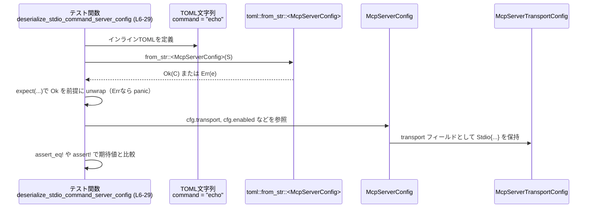
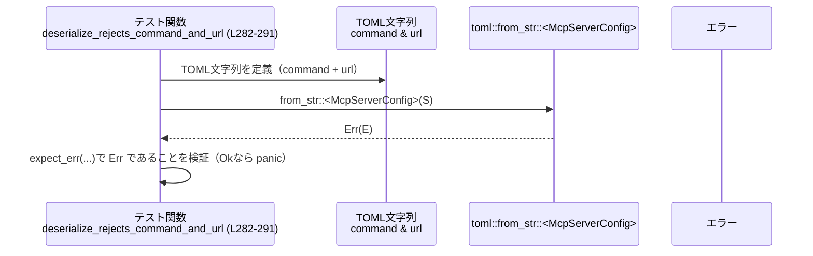

config\src\mcp_types_tests.rs コード解説
======================================

## 0. ざっくり一言

このファイルは、`McpServerConfig` と `McpServerTransportConfig` の **TOML デシリアライズ仕様**（標準入出力／HTTP それぞれの設定、デフォルト値、不正な組み合わせ時のエラーなど）を検証する単体テスト群です（config\src\mcp_types_tests.rs:L6-351）。

---

## 1. このモジュールの役割

### 1.1 概要

- TOML 文字列から `McpServerConfig` を `toml::from_str` で読み込み、その結果が期待どおりの構造体・列挙体になるかをテストしています（config\src\mcp_types_tests.rs:L8-13, L151-156）。
- ストリーム I/O ベース（`Stdio`）と HTTP ベース（`StreamableHttp`）の 2 種類のトランスポート設定について、利用可能なフィールドとデフォルト値を確認しています（config\src\mcp_types_tests.rs:L15-24, L158-166, L203-213）。
- 無効な組み合わせ（`command` と `url` の同時指定、HTTP での `env` 利用、stdio での HTTP ヘッダなど）で `toml::from_str` がエラーになることも検証しています（config\src\mcp_types_tests.rs:L282-291, L293-302, L304-335, L337-350）。

### 1.2 アーキテクチャ内での位置づけ

このファイルは **テストモジュール** であり、実際の設定型は `use super::*;` で親モジュールから取り込んでいます（config\src\mcp_types_tests.rs:L1）。外部クレート `toml` を使って TOML 文字列から設定を生成しています（config\src\mcp_types_tests.rs:L8, L151, L284 など）。

```mermaid
graph TD
    subgraph "config::mcp_types_tests (L1-351)"
        T[テスト関数群]
    end

    T -->|use super::*| C[McpServerConfig<br/>McpServerTransportConfig]
    T -->|TOMLデシリアライズ| Toml[toml::from_str]
    T -->|環境変数マップなど| HM[std::collections::HashMap]
    T -->|作業ディレクトリ| PB[std::path::PathBuf]

    C --> Tr[McpServerTransportConfig<br/>(Stdio / StreamableHttp)]
```

> 親モジュール（`super`）がどのファイルに対応しているかは、このチャンクからは分かりません。

### 1.3 設計上のポイント

- **トランスポート別にテストを分離**  
  `Stdio` 用のテスト（config\src\mcp_types_tests.rs:L6-120）と `StreamableHttp` 用のテスト（config\src\mcp_types_tests.rs:L149-231）が、それぞれ専用の関数としてまとめられています。

- **フィールドごとの振る舞いを個別テスト**  
  `args` / `env` / `env_vars` / `cwd` / `enabled` / `required` / `enabled_tools` / `disabled_tools` / `oauth_resource` など、各フィールドの有無・値を変えたテストが用意されています（config\src\mcp_types_tests.rs:L31-76, L78-120, L122-147, L217-231, L233-246）。

- **エラー条件を明示的に検証**  
  `expect_err` を利用して、構成上許可されない組み合わせが `Err` になることを保証しています（config\src\mcp_types_tests.rs:L282-291, L293-302, L304-335, L337-350）。一部のテストではエラーメッセージ文字列の一部まで確認しています（config\src\mcp_types_tests.rs:L330-333, L347-348）。

- **未知フィールドの扱いをテスト**  
  未知の TOML フィールド（`trust_level`）が存在しても、デシリアライズが成功し、構造体には保持されない（無視される）ことを `assert_eq!` で検証しています（config\src\mcp_types_tests.rs:L248-280）。

- **Rust の安全性・並行性**  
  - `unsafe` ブロックは一切登場せず、処理はすべて安全な Rust で実装されています。
  - テストは純粋なデータ変換のみで、スレッド生成や非同期処理は含まれていません。そのため、並行性に関する注意点は特にありません。

---

## 2. 主要な機能一覧

このモジュール（テスト）がカバーしている主な振る舞いは次のとおりです。

- Stdio トランスポート設定の基本デシリアライズ  
  - `command` のみ指定した場合のデフォルト値（args/env/env_vars/cwd, enabled/required）確認（config\src\mcp_types_tests.rs:L6-29）。
- Stdio トランスポートのオプション項目  
  - `args`（引数リスト）、`env`（環境変数マップ）、`env_vars`（環境変数名リスト）、`cwd`（作業ディレクトリ）の読み取り（config\src\mcp_types_tests.rs:L31-120）。
- サーバー有効/必須フラグ  
  - `enabled` / `required` フラグのデフォルトと明示指定の動作（config\src\mcp_types_tests.rs:L122-147）。
- HTTP トランスポート設定のデシリアライズ  
  - `url` のみ指定した場合、および `bearer_token_env_var`、`http_headers`、`env_http_headers` の併用（config\src\mcp_types_tests.rs:L149-215）。
- OAuth 関連フィールド  
  - HTTP トランスポートで `oauth_resource` フィールドを指定した場合に `McpServerConfig.oauth_resource` が `Some(...)` になる動作（config\src\mcp_types_tests.rs:L217-231）。
- ツールフィルタリング  
  - `enabled_tools` / `disabled_tools` フィールドによる許可・禁止ツールのリストのデシリアライズ（config\src\mcp_types_tests.rs:L233-246）。
- 未知フィールドの扱い  
  - 未知フィールド `trust_level` が無視され、その他のフィールドが既定値になることの確認（config\src\mcp_types_tests.rs:L248-280）。
- 不正な構成の拒否  
  - `command` と `url` の同時指定の拒否（config\src\mcp_types_tests.rs:L282-291）。
  - HTTP トランスポートでの `env` 使用の拒否（config\src\mcp_types_tests.rs:L293-302）。
  - Stdio トランスポートでの `http_headers` / `env_http_headers` / `oauth_resource` 使用の拒否（config\src\mcp_types_tests.rs:L304-335）。
  - HTTP トランスポートでのインライン `bearer_token` フィールドの拒否（config\src\mcp_types_tests.rs:L337-350）。

---

## 3. 公開 API と詳細解説

このファイル自身はテスト用で公開 API を定義していませんが、テスト対象の型・関数の振る舞いを理解する助けになります。

### 3.1 型一覧（構造体・列挙体など）

| 名前 | 種別 | 役割 / 用途 | 根拠 |
|------|------|-------------|------|
| `McpServerConfig` | 構造体（`super` モジュール） | MCP サーバーの設定全体を表す。少なくとも `transport`, `enabled`, `required`, `disabled_reason`, `startup_timeout_sec`, `tool_timeout_sec`, `enabled_tools`, `disabled_tools`, `scopes`, `oauth_resource`, `tools` フィールドを持つことがテストから読み取れます。 | `cfg.transport` へのアクセス（config\src\mcp_types_tests.rs:L16, L42, L89, L111, L159, L181, L204）、フィールド比較（config\src\mcp_types_tests.rs:L258-279）、`cfg.enabled` / `cfg.required` / `cfg.enabled_tools` / `cfg.disabled_tools` / `cfg.oauth_resource` へのアクセス（config\src\mcp_types_tests.rs:L25-28, L132-133, L146, L227-229, L244-245）。 |
| `McpServerTransportConfig` | 列挙体（`super` モジュール） | サーバーのトランスポート方式を表す。テストから `Stdio` と `StreamableHttp` という 2 つのバリアントと、そのフィールド（`command` / `args` / `env` / `env_vars` / `cwd`、`url` / `bearer_token_env_var` / `http_headers` / `env_http_headers`）の存在が分かります。 | `McpServerTransportConfig::Stdio { ... }` および `McpServerTransportConfig::StreamableHttp { ... }` との比較（config\src\mcp_types_tests.rs:L17-23, L43-49, L90-96, L112-118, L160-165, L182-187, L205-213, L261-267）。 |
| `HashMap` | 構造体（標準ライブラリ） | 環境変数マップ、HTTP ヘッダマップ、`tools` フィールドなど、キー/値形式の設定を表現するために利用されています。 | `env` や `http_headers`, `env_http_headers` などで `HashMap::from([...])` を構築（config\src\mcp_types_tests.rs:L70, L208-212）、`tools: HashMap::new()`（config\src\mcp_types_tests.rs:L277）。 |
| `PathBuf` | 構造体（標準ライブラリ） | Stdio トランスポートの作業ディレクトリ (`cwd`) を表します。 | `cwd: Some(PathBuf::from("/tmp"))` の比較（config\src\mcp_types_tests.rs:L117）。 |

> `McpServerConfig` や `McpServerTransportConfig` の完全な定義（derive 属性やライフタイムなど）は、このファイルには現れないため不明です。

### 3.2 関数詳細（代表的なテスト 7 件）

以下はいずれも **テスト関数** で、引数はなく、戻り値は `()` です。

---

#### `deserialize_stdio_command_server_config() -> ()`（L6-29）

**概要**

- `command = "echo"` だけが書かれた TOML から `McpServerConfig` がデシリアライズされる際、`Stdio` トランスポートが選択され、関連フィールドと基本フラグのデフォルト値が正しく設定されることを検証します（config\src\mcp_types_tests.rs:L6-29）。

**引数**

- なし。

**戻り値**

- `()`（テストに成功すれば何も返さず終了、失敗時は panic）。

**内部処理の流れ**

1. インライン TOML 文字列として `command = "echo"` を定義します（config\src\mcp_types_tests.rs:L8-11）。
2. `toml::from_str::<McpServerConfig>` で `cfg` を生成し、失敗した場合は `.expect("should deserialize command config")` により panic になります（config\src\mcp_types_tests.rs:L8-13）。
3. `cfg.transport` が `McpServerTransportConfig::Stdio` であり、内部フィールドが既定値であることを `assert_eq!` で比較します（config\src\mcp_types_tests.rs:L15-24）。
   - `command = "echo"`
   - `args = []`
   - `env = None`
   - `env_vars = []`
   - `cwd = None`
4. `enabled` が `true`、`required` が `false` であることを確認します（config\src\mcp_types_tests.rs:L25-26）。
5. `enabled_tools` / `disabled_tools` が `None` であることを確認します（config\src\mcp_types_tests.rs:L27-28）。

**Examples（使用例）**

このテストは、そのまま **最小限の Stdio 設定** の例になっています。

```rust
// McpServerConfig のパスはこのチャンクからは不明のため仮のパスです。
use crate::McpServerConfig; // 実際のパスはコードベースを確認する必要があります

let cfg: McpServerConfig = toml::from_str(r#"
    command = "echo"
"#)?;

// Stdio トランスポートで、デフォルト値が入っていることを前提に処理できる
assert!(cfg.enabled);          // デフォルトで有効
assert!(!cfg.required);        // デフォルトで必須ではない
```

**Errors / Panics**

- TOML の構文が不正、あるいは `McpServerConfig` のデシリアライズに失敗した場合は `.expect` により panic します（config\src\mcp_types_tests.rs:L12-13）。
- 成功時は `Result::Ok` となり panic は発生しません。

**Edge cases（エッジケース）**

- `command` 以外を指定しない場合、`args`, `env`, `env_vars`, `cwd`, `enabled_tools`, `disabled_tools` はすべて「空」または `None` になります（config\src\mcp_types_tests.rs:L17-23, L25-28）。
- `enabled` は明示的に指定しなくても `true`、`required` は `false` であることが確認できます（config\src\mcp_types_tests.rs:L25-26）。

**使用上の注意点**

- 実運用コードでは `.expect` ではなく `match` や `?` 演算子で `Result` を処理すると、エラーをユーザーに適切に伝えやすくなります。
- `command` が指定されていれば、自動的に `Stdio` トランスポートになる契約が存在すると読み取れますが、これはテストからの推測であり、正確な判定ロジックは親モジュールの実装を確認する必要があります。

---

#### `deserialize_stdio_command_server_config_with_arg_with_args_and_env() -> ()`（L54-76）

**概要**

- Stdio トランスポートで `args` と `env` を同時に指定した場合に、それらが `McpServerTransportConfig::Stdio` の対応フィールドに正しくマッピングされることを確認します（config\src\mcp_types_tests.rs:L55-76）。

**引数**

- なし。

**戻り値**

- `()`。

**内部処理の流れ**

1. TOML 文字列に `command`, `args`, `env` を定義します（config\src\mcp_types_tests.rs:L57-60）。
2. `toml::from_str` で `McpServerConfig` にデシリアライズし、`.expect` で成功を前提とします（config\src\mcp_types_tests.rs:L56-63）。
3. `cfg.transport` が `Stdio` であり、次の値であることを確認します（config\src\mcp_types_tests.rs:L65-73）。
   - `command = "echo"`
   - `args = ["hello", "world"]`
   - `env = Some(HashMap::from([("FOO", "BAR")]))`
   - `env_vars = []`
   - `cwd = None`
4. `cfg.enabled` が `true` であることを確認します（config\src\mcp_types_tests.rs:L75）。

**Examples（使用例）**

```rust
let cfg: McpServerConfig = toml::from_str(r#"
    command = "echo"
    args = ["hello", "world"]
    env = { "FOO" = "BAR" }
"#)?;

// env はキーと値が String のマップとして扱える
if let McpServerTransportConfig::Stdio { args, env, .. } = cfg.transport {
    assert_eq!(args, vec!["hello".to_string(), "world".to_string()]);
    assert_eq!(env.unwrap()["FOO"], "BAR".to_string());
}
```

**Errors / Panics**

- `.expect` により、デシリアライズ失敗時は panic します（config\src\mcp_types_tests.rs:L62-63）。

**Edge cases**

- `env` は `Option<HashMap<String, String>>` のような型で、指定しない場合は `None` になる一方、このテストでは `Some(...)` になることが確認できます（config\src\mcp_types_tests.rs:L70）。
- `env_vars` は `env` を指定しても自動的には埋まらず、明示しない限り空の `Vec` です（config\src\mcp_types_tests.rs:L71）。

**使用上の注意点**

- Stdio トランスポートでの環境変数は、**キー/値マップとして指定する方法 (`env`)** と、**名前だけを列挙する方法 (`env_vars`)** が区別されているように見えますが、両者の意味的な違いはこのチャンクからは分かりません。
- HTTP トランスポートと異なり、Stdio では `env` の使用が許可されていることを、後述の `deserialize_rejects_env_for_http_transport` との対比で確認できます（config\src\mcp_types_tests.rs:L293-302）。

---

#### `deserialize_streamable_http_server_config() -> ()`（L149-168）

**概要**

- `url` のみを指定した TOML を HTTP トランスポートとしてデシリアライズし、`StreamableHttp` バリアントのデフォルト値を確認します（config\src\mcp_types_tests.rs:L149-168）。

**引数**

- なし。

**戻り値**

- `()`。

**内部処理の流れ**

1. TOML 文字列 `url = "https://example.com/mcp"` を用意します（config\src\mcp_types_tests.rs:L152-154）。
2. `toml::from_str::<McpServerConfig>` で `cfg` を生成し、`.expect` で成功を前提とします（config\src\mcp_types_tests.rs:L151-156）。
3. `cfg.transport` が `McpServerTransportConfig::StreamableHttp` であり、`url` 以外のフィールド（`bearer_token_env_var`, `http_headers`, `env_http_headers`）が `None` であることを `assert_eq!` で確認します（config\src\mcp_types_tests.rs:L158-165）。
4. `cfg.enabled` が `true` であることを確認します（config\src\mcp_types_tests.rs:L167）。

**Examples（使用例）**

```rust
let cfg: McpServerConfig = toml::from_str(r#"
    url = "https://example.com/mcp"
"#)?;

// HTTP トランスポートが選択される
if let McpServerTransportConfig::StreamableHttp { url, bearer_token_env_var, .. } = cfg.transport {
    assert_eq!(url, "https://example.com/mcp".to_string());
    assert!(bearer_token_env_var.is_none()); // 未指定なら None
}
```

**Errors / Panics**

- `url` の形式が不正、または `McpServerConfig` 側のデシリアライズに失敗した場合に panic となります（config\src\mcp_types_tests.rs:L155-156）。

**Edge cases**

- `bearer_token_env_var` やヘッダ関連のフィールドを指定しない場合は、すべて `None` になることが確認できます（config\src\mcp_types_tests.rs:L161-164）。
- `enabled` のデフォルトが HTTP トランスポートでも `true` であることが分かります（config\src\mcp_types_tests.rs:L167）。

**使用上の注意点**

- HTTP トランスポートを利用するには、少なくとも `url` を指定する必要があります。`command` と併記するとエラーになる点は別テストで確認されています（config\src\mcp_types_tests.rs:L282-291）。

---

#### `deserialize_streamable_http_server_config_with_headers() -> ()`（L192-215）

**概要**

- HTTP トランスポートで、固定の HTTP ヘッダおよび環境変数由来の HTTP ヘッダを指定できることを確認します（config\src\mcp_types_tests.rs:L193-215）。

**引数**

- なし。

**戻り値**

- `()`。

**内部処理の流れ**

1. TOML 文字列に `url`, `http_headers`, `env_http_headers` を定義します（config\src\mcp_types_tests.rs:L195-199）。
2. `toml::from_str` により `McpServerConfig` を生成し、`.expect` により成功を前提とします（config\src\mcp_types_tests.rs:L194-201）。
3. `cfg.transport` が `StreamableHttp` であり、次の値であることを検証します（config\src\mcp_types_tests.rs:L203-213）。
   - `url = "https://example.com/mcp"`
   - `bearer_token_env_var = None`
   - `http_headers = Some(HashMap::from([("X-Foo", "bar")]))`
   - `env_http_headers = Some(HashMap::from([("X-Token", "TOKEN_ENV")]))`

**Examples（使用例）**

```rust
let cfg: McpServerConfig = toml::from_str(r#"
    url = "https://example.com/mcp"
    http_headers = { "X-Foo" = "bar" }
    env_http_headers = { "X-Token" = "TOKEN_ENV" }
"#)?;

// 通常ヘッダと、環境変数から展開されるヘッダが分かれている
if let McpServerTransportConfig::StreamableHttp { http_headers, env_http_headers, .. } = cfg.transport {
    assert_eq!(http_headers.unwrap()["X-Foo"], "bar".to_string());
    assert_eq!(env_http_headers.unwrap()["X-Token"], "TOKEN_ENV".to_string());
}
```

**Errors / Panics**

- `.expect` により、設定が不正でデシリアライズに失敗した場合は panic します（config\src\mcp_types_tests.rs:L200-201）。

**Edge cases**

- `http_headers` と `env_http_headers` を両方指定しても構成上は許可されていることが、テストから読み取れます（config\src\mcp_types_tests.rs:L195-201, L203-213）。
- Stdio トランスポートでは同じフィールドが禁止されているため（config\src\mcp_types_tests.rs:L304-320）、**トランスポート種別に応じた許可／禁止フィールドの制約** が存在します。

**使用上の注意点**

- セキュリティや秘密情報の扱いとして、固定値ヘッダ（`http_headers`）と環境変数由来のヘッダ（`env_http_headers`）を分けている点から、後者にはトークン等の秘密情報を載せることが想定されている可能性がありますが、その意図はコードからは断定できません。
- Stdio トランスポートでこれらのフィールドを使うとエラーになることに注意が必要です（config\src\mcp_types_tests.rs:L304-320）。

---

#### `deserialize_ignores_unknown_server_fields() -> ()`（L248-280）

**概要**

- 未知の設定フィールド `trust_level` が TOML に現れた場合でも、デシリアライズが成功し、その値が `McpServerConfig` には保持されない（無視される）ことを確認します（config\src\mcp_types_tests.rs:L249-280）。

**引数**

- なし。

**戻り値**

- `()`。

**内部処理の流れ**

1. `command = "echo"` と未知フィールド `trust_level = "trusted"` を含む TOML 文字列を用意します（config\src\mcp_types_tests.rs:L251-254）。
2. `toml::from_str` で `McpServerConfig` を生成し、`.expect` により成功することを前提とします（config\src\mcp_types_tests.rs:L250-256）。
3. `cfg` 全体を `McpServerConfig { ... }` リテラルと `assert_eq!` で比較します（config\src\mcp_types_tests.rs:L258-279）。
   - `transport` 以下は Stdio のデフォルト値と同じ（`command = "echo"`, 他は空または `None`）。
   - `enabled = true`, `required = false`。
   - `disabled_reason`, `startup_timeout_sec`, `tool_timeout_sec`, `enabled_tools`, `disabled_tools`, `scopes`, `oauth_resource` はすべて `None`。
   - `tools = HashMap::new()`。

**Examples（使用例）**

```rust
let cfg: McpServerConfig = toml::from_str(r#"
    command = "echo"
    trust_level = "trusted" # McpServerConfig に存在しないフィールド
"#)?;

// trust_level は無視され、構造体には現れない
assert!(cfg.disabled_reason.is_none());
assert!(cfg.scopes.is_none());
```

**Errors / Panics**

- 未知フィールドが存在してもエラーとはならない仕様であることが、このテストから分かります（`expect` が成功しているため、config\src\mcp_types_tests.rs:L255-256）。

**Edge cases**

- 未知フィールドがあっても **デシリアライズに成功し、構造体には保持されない** という仕様です（config\src\mcp_types_tests.rs:L258-279）。
- これにより、将来的な設定拡張やバージョン違いの設定ファイルを、古いクライアントが読み込む際の互換性が確保されます。

**使用上の注意点**

- 設定ファイルに誤ったキーを書いてしまってもエラーにならないため、ユーザーが typo に気付きにくいというトレードオフがあります。
- 重要な設定キーについては、別途バリデーション層を設ける必要があるかもしれませんが、その有無はこのチャンクからは分かりません。

---

#### `deserialize_rejects_command_and_url() -> ()`（L282-291）

**概要**

- `command`（Stdio 用）と `url`（HTTP 用）を同時に指定した TOML をデシリアライズした場合、エラーになることを確認します（config\src\mcp_types_tests.rs:L283-290）。

**引数**

- なし。

**戻り値**

- `()`。

**内部処理の流れ**

1. TOML 文字列で `command = "echo"` と `url = "https://example.com"` を両方指定します（config\src\mcp_types_tests.rs:L285-288）。
2. `toml::from_str::<McpServerConfig>` を呼び出し、`.expect_err("should reject command+url")` で **必ず `Err` になる** ことを検証します（config\src\mcp_types_tests.rs:L284-290）。

**Examples（使用例）**

```rust
let result = toml::from_str::<McpServerConfig>(r#"
    command = "echo"
    url = "https://example.com"
"#);

assert!(result.is_err()); // トランスポートを一意に決定できないためエラー
```

**Errors / Panics**

- `toml::from_str` が `Ok` を返した場合、`.expect_err` により panic します（config\src\mcp_types_tests.rs:L289-290）。
- 正常な動作では `Err` が返り、panic は発生しません。

**Edge cases**

- トランスポート種別を決定するためのフィールド（少なくとも `command` と `url`）は **相互排他的** であることが、このテストから分かります。
- 「両方とも指定しない」ケースがどう扱われるかは、このチャンクには現れません（不明）。

**使用上の注意点**

- 設定ファイルでは `command` と `url` のどちらか一方のみを指定する必要があります。
- どちらも指定しなかった場合の動作は不明なため、親モジュールの実装や他のテストを確認する必要があります。

---

#### `deserialize_rejects_headers_for_stdio() -> ()`（L304-335）

**概要**

- Stdio トランスポートを選択する `command` 指定と同時に、HTTP 専用の設定フィールド（`http_headers`, `env_http_headers`, `oauth_resource`）を指定した場合にデシリアライズがエラーになることを検証します（config\src\mcp_types_tests.rs:L305-335）。

**引数**

- なし。

**戻り値**

- `()`。

**内部処理の流れ**

1. `command = "echo"` と `http_headers` を含む TOML を `toml::from_str::<McpServerConfig>` に渡し、`.expect_err` でエラーを期待します（config\src\mcp_types_tests.rs:L306-312）。
2. 同様に `env_http_headers` を含む TOML でも `expect_err` を呼びます（config\src\mcp_types_tests.rs:L314-320）。
3. `oauth_resource` を含む TOML については、`let err = toml::from_str::<McpServerConfig>(...) .expect_err(...)` としてエラー値を取得します（config\src\mcp_types_tests.rs:L322-328）。
4. `err.to_string()` に `"oauth_resource is not supported for stdio"` という文言が含まれていることを確認します（config\src\mcp_types_tests.rs:L330-333）。

**Examples（使用例）**

```rust
let err = toml::from_str::<McpServerConfig>(r#"
    command = "echo"
    oauth_resource = "https://api.example.com"
"#).expect_err("should reject oauth_resource for stdio transport");

assert!(err.to_string().contains("oauth_resource is not supported for stdio"));
```

**Errors / Panics**

- `http_headers` および `env_http_headers`, `oauth_resource` を Stdio と組み合わせると `toml::from_str` が `Err` を返す仕様です（config\src\mcp_types_tests.rs:L305-320, L322-328）。
- 仮に `Ok` が返った場合は `.expect_err` により panic します（config\src\mcp_types_tests.rs:L312, L320, L328）。

**Edge cases**

- エラーメッセージ文字列の内容に `"oauth_resource is not supported for stdio"` が含まれることをテストしており、**エラーがユーザーにとって意味のあるメッセージを返すこと** が契約の一部になっています（config\src\mcp_types_tests.rs:L330-333）。
- `http_headers` と `env_http_headers` についてはメッセージ内容まではチェックしていませんが、少なくとも `Err` になることだけは保証されています（config\src\mcp_types_tests.rs:L306-312, L314-320）。

**使用上の注意点**

- Stdio トランスポートで HTTP 固有のフィールドを使うことはできません。
- この仕様により、構成ファイルの誤用を早期に発見しやすくなっています。

---

#### `deserialize_rejects_inline_bearer_token_field() -> ()`（L337-350）

**概要**

- HTTP トランスポート（`url` 指定）で、インラインの `bearer_token` フィールドを指定した場合にデシリアライズがエラーになり、エラーメッセージに `"bearer_token is not supported"` が含まれることを確認します（config\src\mcp_types_tests.rs:L338-349）。

**引数**

- なし。

**戻り値**

- `()`。

**内部処理の流れ**

1. `url = "https://example.com"` と `bearer_token = "secret"` を含む TOML を `toml::from_str::<McpServerConfig>` に渡します（config\src\mcp_types_tests.rs:L340-343）。
2. `.expect_err("should reject bearer_token field")` でエラーになることを前提とし、エラー値を取得します（config\src\mcp_types_tests.rs:L339-345）。
3. `err.to_string()` に `"bearer_token is not supported"` が含まれていることを `assert!` で検証します（config\src\mcp_types_tests.rs:L347-348）。

**Examples（使用例）**

```rust
let err = toml::from_str::<McpServerConfig>(r#"
    url = "https://example.com"
    bearer_token = "secret"
"#).expect_err("should reject bearer_token field");

assert!(err.to_string().contains("bearer_token is not supported"));
```

**Errors / Panics**

- インラインの `bearer_token` フィールドは常に拒否される仕様とテストから読み取れます（config\src\mcp_types_tests.rs:L339-345）。
- `Err` ではなく `Ok` を返した場合、`.expect_err` により panic します。

**Edge cases**

- 別テストで、`bearer_token_env_var = "GITHUB_TOKEN"` のように **環境変数名を指定するフィールド** は許可されているため（config\src\mcp_types_tests.rs:L171-189）、**トークン値を直接書くことは不可だが、環境変数経由で指定することは可能** という仕様が見て取れます。
- セキュリティ上、設定ファイルに秘密情報を直書きすることを防ぐ意図が推測できますが、これはテストからの推測であり、公式なポリシーはこのチャンクからは分かりません。

**使用上の注意点**

- 認証トークンを設定する場合は、`bearer_token` の代わりに `bearer_token_env_var` を利用する必要があります（config\src\mcp_types_tests.rs:L175-176, L183-185）。
- エラーメッセージに「not supported」と明示されるため、ユーザーにとって原因が分かりやすくなっています。

---

### 3.3 その他の関数

残りのテスト関数は、上記で説明した仕様のバリエーションを個別に確認する単純なテストです。

| 関数名 | 行範囲 | 役割（1 行） |
|--------|--------|--------------|
| `deserialize_stdio_command_server_config_with_args` | L31-52 | Stdio で `args = ["hello", "world"]` 指定時に `args` フィールドが正しく設定されることを検証（config\src\mcp_types_tests.rs:L31-52）。 |
| `deserialize_stdio_command_server_config_with_env_vars` | L78-98 | Stdio で `env_vars = ["FOO", "BAR"]` を指定した場合に `env_vars` がベクタに格納されることを検証（config\src\mcp_types_tests.rs:L79-97）。 |
| `deserialize_stdio_command_server_config_with_cwd` | L100-120 | Stdio で `cwd = "/tmp"` を指定した場合に `cwd` が `Some(PathBuf::from("/tmp"))` になることを確認（config\src\mcp_types_tests.rs:L101-119）。 |
| `deserialize_disabled_server_config` | L122-134 | `enabled = false` を指定した場合に `cfg.enabled == false` かつ `cfg.required == false` であることを検証（config\src\mcp_types_tests.rs:L123-133）。 |
| `deserialize_required_server_config` | L136-147 | `required = true` 指定時に `cfg.required == true` になることを検証（config\src\mcp_types_tests.rs:L137-146）。 |
| `deserialize_streamable_http_server_config_with_env_var` | L170-190 | HTTP で `bearer_token_env_var = "GITHUB_TOKEN"` を指定した場合に `Some("GITHUB_TOKEN")` になることを確認（config\src\mcp_types_tests.rs:L171-189）。 |
| `deserialize_streamable_http_server_config_with_oauth_resource` | L217-231 | HTTP で `oauth_resource` を指定した場合に `cfg.oauth_resource` が `Some(...)` になることを検証（config\src\mcp_types_tests.rs:L218-230）。 |
| `deserialize_server_config_with_tool_filters` | L233-246 | `enabled_tools` / `disabled_tools` が `Option<Vec<String>>` として正しく読み込まれることを確認（config\src\mcp_types_tests.rs:L235-245）。 |
| `deserialize_rejects_env_for_http_transport` | L293-302 | HTTP トランスポートで `env` フィールドを指定するとエラーになることを `expect_err` で確認（config\src\mcp_types_tests.rs:L294-301）。 |

---

## 4. データフロー

このファイルの典型的な処理フローは、**「TOML 文字列 → `toml::from_str` → `McpServerConfig` → アサーション」** という単純なものです。

### 正常系（Stdio トランスポート）のデータフロー

以下のシーケンスは `deserialize_stdio_command_server_config` の流れを表します（config\src\mcp_types_tests.rs:L6-29）。



### エラー系（不正な構成）のデータフロー

`deserialize_rejects_command_and_url` の流れを示します（config\src\mcp_types_tests.rs:L282-291）。



> すべてのテスト関数で、この「TOML → `from_str` → `McpServerConfig` → 検証」というパターンが共通しています。

---

## 5. 使い方（How to Use）

このファイルはテストコードですが、`McpServerConfig` を TOML から読み込み、正しく利用するための具体例としても役立ちます。

### 5.1 基本的な使用方法

基本的な流れは、テキスト（ファイル内容など）から `McpServerConfig` を読み込んでトランスポート種別に応じて処理する、というものです。

```rust
// McpServerConfig / McpServerTransportConfig の実際のパスは
// このチャンクからは分からないため、仮のパスを置いています。
use crate::McpServerConfig;
use crate::McpServerTransportConfig;

fn load_config(toml_text: &str) -> Result<McpServerConfig, toml::de::Error> {
    // TOML 文字列から設定をデシリアライズする
    toml::from_str::<McpServerConfig>(toml_text) // config\src\mcp_types_tests.rs:L8, L151, L284 参照
}

fn main_logic(cfg: McpServerConfig) {
    match cfg.transport {
        McpServerTransportConfig::Stdio { command, args, .. } => {
            // コマンドをローカルで起動する、など
            println!("run {} with {:?}", command, args);
        }
        McpServerTransportConfig::StreamableHttp { url, .. } => {
            // HTTP 経由で MCP サーバーに接続する、など
            println!("connect to {}", url);
        }
    }
}
```

> 実際のクレート名やモジュールパスは、コードベース全体を参照する必要があります。この例では簡略化のため `crate::` 直下にあるものと仮定しています。

### 5.2 よくある使用パターン

#### (1) Stdio ベースの MCP サーバー

```toml
# mcp_server.toml（例）
command = "echo"
args = ["hello", "world"]
env = { "FOO" = "BAR" }
env_vars = ["FOO", "BAR"]
cwd = "/tmp"
```

- 上記は `deserialize_stdio_command_server_config_with_args`、`_with_arg_with_args_and_env`、`_with_env_vars`、`_with_cwd` が別々にテストしている内容をまとめた形です（config\src\mcp_types_tests.rs:L31-120）。
- Rust 側では `McpServerTransportConfig::Stdio` として読み取れます。

#### (2) HTTP ベースの MCP サーバー（環境変数トークン＋ヘッダ）

```toml
url = "https://example.com/mcp"
bearer_token_env_var = "GITHUB_TOKEN"
http_headers = { "X-Foo" = "bar" }
env_http_headers = { "X-Token" = "TOKEN_ENV" }
oauth_resource = "https://api.example.com"
```

- `bearer_token_env_var` の指定は `deserialize_streamable_http_server_config_with_env_var`（config\src\mcp_types_tests.rs:L171-189）。
- `http_headers` / `env_http_headers` は `deserialize_streamable_http_server_config_with_headers`（config\src\mcp_types_tests.rs:L193-215）。
- `oauth_resource` は `deserialize_streamable_http_server_config_with_oauth_resource` でカバーされています（config\src\mcp_types_tests.rs:L218-230）。

#### (3) ツールのフィルタリング

```toml
command = "echo"
enabled_tools = ["allowed"]
disabled_tools = ["blocked"]
```

- `enabled_tools` / `disabled_tools` が `Some(vec![...])` として読み込まれることを `deserialize_server_config_with_tool_filters` が確認しています（config\src\mcp_types_tests.rs:L235-245）。
- どのようにツールフィルタが使用されるかはこのファイルからは分かりません。

### 5.3 よくある間違い

テストで明示的にエラーとして扱われている「誤った構成例」と、その正しい形を対比します。

```toml
# 間違い例: command と url を同時に指定（エラーになる）
command = "echo"
url = "https://example.com"
```

```toml
# 正しい例: Stdio を使うなら command のみ
command = "echo"
```

```toml
# 正しい例: HTTP を使うなら url のみ
url = "https://example.com/mcp"
```

対応するテスト: `deserialize_rejects_command_and_url`（config\src\mcp_types_tests.rs:L282-291）。

---

```toml
# 間違い例: HTTP トランスポートで env を指定（エラー）
url = "https://example.com"
env = { "FOO" = "BAR" }
```

```toml
# 正しい例: 環境変数は env_http_headers や bearer_token_env_var などを利用
url = "https://example.com/mcp"
env_http_headers = { "X-Token" = "TOKEN_ENV" }
```

対応するテスト: `deserialize_rejects_env_for_http_transport`（config\src\mcp_types_tests.rs:L293-302）。

---

```toml
# 間違い例: Stdio で HTTP 向けのフィールドを指定（エラー）
command = "echo"
http_headers = { "X-Foo" = "bar" }        # エラー
env_http_headers = { "X-Foo" = "BAR_ENV" }# エラー
oauth_resource = "https://api.example.com"# エラー
```

対応するテスト: `deserialize_rejects_headers_for_stdio`（config\src\mcp_types_tests.rs:L305-335）。

---

```toml
# 間違い例: bearer_token に秘密情報を直書き（エラー）
url = "https://example.com"
bearer_token = "secret"
```

```toml
# 正しい例: bearer_token_env_var に環境変数名を指定
url = "https://example.com"
bearer_token_env_var = "MY_TOKEN_ENV"
```

対応するテスト:  

- `deserialize_rejects_inline_bearer_token_field`（config\src\mcp_types_tests.rs:L337-350）  
- `deserialize_streamable_http_server_config_with_env_var`（config\src\mcp_types_tests.rs:L171-189）。

### 5.4 使用上の注意点（まとめ）

このテストから読み取れる契約とエッジケースを整理します。

- **トランスポート種別の決定**
  - `command` を指定すると Stdio トランスポートが選ばれます（config\src\mcp_types_tests.rs:L6-29, L31-120, L122-147）。
  - `url` を指定すると HTTP トランスポートが選ばれます（config\src\mcp_types_tests.rs:L149-215, L217-231）。
  - `command` と `url` を同時に指定するとエラーになります（config\src\mcp_types_tests.rs:L282-291）。
  - 「どちらも指定しない」ケースの扱いは不明です。

- **Stdio トランスポートで許可されるフィールド**
  - 許可: `command`, `args`, `env`, `env_vars`, `cwd`（それぞれのテストが存在, config\src\mcp_types_tests.rs:L6-120）。
  - 許可されない: `http_headers`, `env_http_headers`, `oauth_resource`（エラーになる, config\src\mcp_types_tests.rs:L304-335）。
  - `bearer_token_env_var` や他の HTTP 専用フィールドが Stdio でどう扱われるかは、このチャンクには現れません。

- **HTTP トランスポートで許可されるフィールド**
  - 許可: `url`, `bearer_token_env_var`, `http_headers`, `env_http_headers`, `oauth_resource`（config\src\mcp_types_tests.rs:L149-215, L217-231）。
  - 許可されない: `env`（config\src\mcp_types_tests.rs:L293-302）、インライン `bearer_token`（config\src\mcp_types_tests.rs:L337-350）。
  - Stdio 専用と思われる `cwd` や `args` などの扱いは、このチャンクからは不明です。

- **フラグとデフォルト値**
  - `enabled` のデフォルト: `true`（config\src\mcp_types_tests.rs:L25-26, L268-269）。
  - `required` のデフォルト: `false`（config\src\mcp_types_tests.rs:L26, L269）。
  - `enabled_tools` / `disabled_tools`: 指定しない場合は `None`、配列を指定すると `Some(vec![...])`（config\src\mcp_types_tests.rs:L27-28, L244-245, L273-274）。
  - `startup_timeout_sec`, `tool_timeout_sec`, `scopes`, `oauth_resource`（Stdio の場合）, `disabled_reason` は指定しない場合 `None`（config\src\mcp_types_tests.rs:L270-276）。
  - `tools` は指定しない場合 `HashMap::new()`（config\src\mcp_types_tests.rs:L277）。

- **未知フィールド**
  - 未知フィールドはデシリアライズ時に無視され、エラーにはなりません（config\src\mcp_types_tests.rs:L248-280）。
  - そのため、設定の typo 等に注意が必要です。

- **安全性・エラー・並行性**
  - すべての処理は安全な Rust で記述されており、`unsafe` は使われていません。
  - エラー処理は `Result` ベースですが、テストでは `.expect` / `.expect_err` によって panic を利用した検証を行っています（config\src\mcp_types_tests.rs:L12-13, L155-156, L289-290, L301, L312, L320, L328, L345）。
  - 並行処理は行われておらず、グローバルなミュータブル状態も扱っていないため、スレッド安全性に関する注意点は特にありません。

---

## 6. 変更の仕方（How to Modify）

### 6.1 新しい機能を追加する場合

`McpServerConfig` に新しいフィールドや新しいトランスポート種別を追加する場合、このテストファイルの役割は、その振る舞いを仕様として固定することです。

1. **親モジュールで型・デシリアライズロジックを追加**
   - `McpServerConfig` に新しいフィールドを追加し、`Deserialize` 実装を更新します（親モジュール側。ファイルパスはこのチャンクからは不明）。
   - トランスポート種別に依存する制約がある場合は、既存の制約と同様に `command` / `url` との組み合わせを設計します。

2. **正常系テストを追加**
   - このファイルに新しいテスト関数を追加し、インライン TOML 文字列から期待どおりの構造体が生成されることを `assert_eq!` などで確認します。
   - 既存のテストパターン（`deserialize_*_config_with_○○`）に合わせると読みやすくなります（config\src\mcp_types_tests.rs:L31-120, L171-215 などを参考）。

3. **エラー系テストを追加**
   - 不正な組み合わせや禁止されているフィールド使用については、`.expect_err` を用いたテストを追加し、必要に応じてエラーメッセージの内容もチェックします（config\src\mcp_types_tests.rs:L282-291, L304-335, L337-350）。

4. **未知フィールドの扱いを確認**
   - 既存の「未知フィールドを無視する」仕様を維持するかどうかを決め、必要であれば追加テストを行います（config\src\mcp_types_tests.rs:L248-280）。

### 6.2 既存の機能を変更する場合

設定仕様の変更（例: あるフィールドを廃止する、禁止フィールドを許可するなど）を行う際は、以下の点に注意が必要です。

- **影響範囲の確認**
  - 親モジュールで `McpServerConfig` / `McpServerTransportConfig` を参照している箇所を検索し、どのフィールドに依存しているかを把握します（テストからは依存箇所は分かりません）。
  - このファイルの該当テスト関数を更新または削除します（例: `deserialize_rejects_inline_bearer_token_field` を変更する場合、config\src\mcp_types_tests.rs:L337-350 を確認）。

- **契約の変更**
  - ここでエラーとして扱っているものを許可するように変更する場合（例: Stdio で `http_headers` を許可する）には、対応する `.expect_err` テストを `.expect` に変更し、正常系として仕様を再定義します（config\src\mcp_types_tests.rs:L304-320）。
  - 逆に、現在は許可されているが将来禁止したいフィールドがある場合、新たに `.expect_err` テストを追加します。

- **エッジケースと後方互換性**
  - 未知フィールドを無視する仕様を変えると後方互換性に影響が出る可能性があるため、`deserialize_ignores_unknown_server_fields` の意図を踏まえた上で慎重に検討する必要があります（config\src\mcp_types_tests.rs:L248-280）。

---

## 7. 関連ファイル

このテストモジュールと密接に関係するファイル・コンポーネントをまとめます。

| パス / コンポーネント | 役割 / 関係 |
|------------------------|------------|
| `super` モジュール（実ファイルパス不明） | `use super::*;` により `McpServerConfig` と `McpServerTransportConfig` の定義を提供している親モジュールです（config\src\mcp_types_tests.rs:L1, L8, L16-23, L159-166, L260-277）。通例から `mcp_types.rs` のような名前である可能性はありますが、このチャンクからは断定できません。 |
| 外部クレート `toml` | TOML テキストから `McpServerConfig` にデシリアライズするために使用されています（config\src\mcp_types_tests.rs:L8, L56, L80, L102, L124, L138, L151, L172, L194, L219, L235, L250, L284, L295, L306, L314, L322, L339）。 |
| 外部クレート `pretty_assertions` | `assert_eq!` の出力を改善するために使われています（config\src\mcp_types_tests.rs:L2, L15, L41, L88, L110, L158, L180, L203, L258）。テスト専用の依存関係です。 |
| 標準ライブラリ `std::collections::HashMap` | 環境変数マップ (`env`)、HTTP ヘッダマップ (`http_headers`, `env_http_headers`)、`tools` フィールドのデフォルト値として使用されています（config\src\mcp_types_tests.rs:L3, L70, L208-212, L277）。 |
| 標準ライブラリ `std::path::PathBuf` | Stdio トランスポートの `cwd`（カレントディレクトリ）フィールドの型として使用されています（config\src\mcp_types_tests.rs:L4, L117）。 |

> このファイル単体では、親モジュール側のロジック（プロセス起動や HTTP 通信など）は一切登場せず、あくまで **構成データのデシリアライズ仕様** にフォーカスしたテストであることが特徴です。
