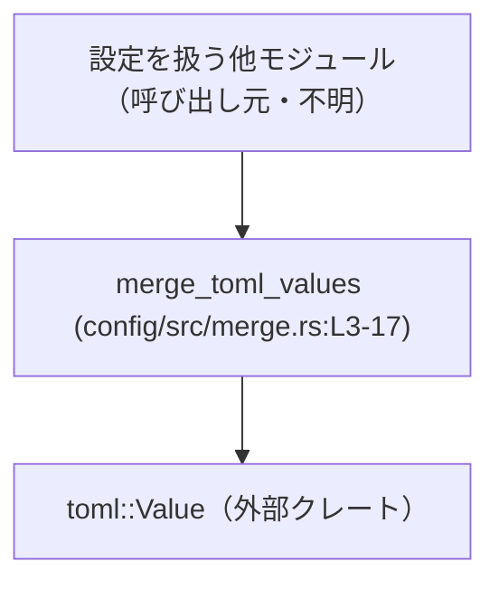
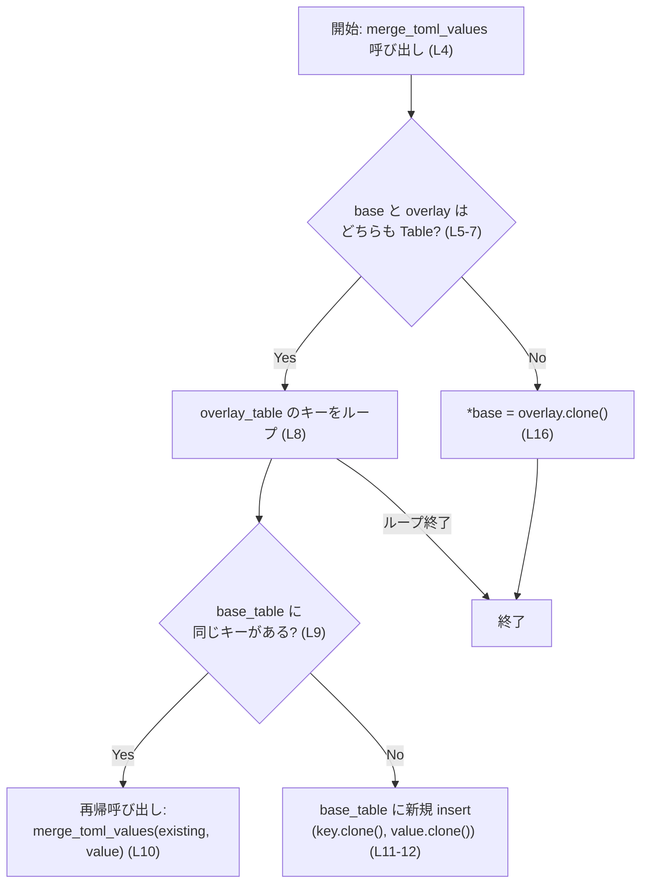
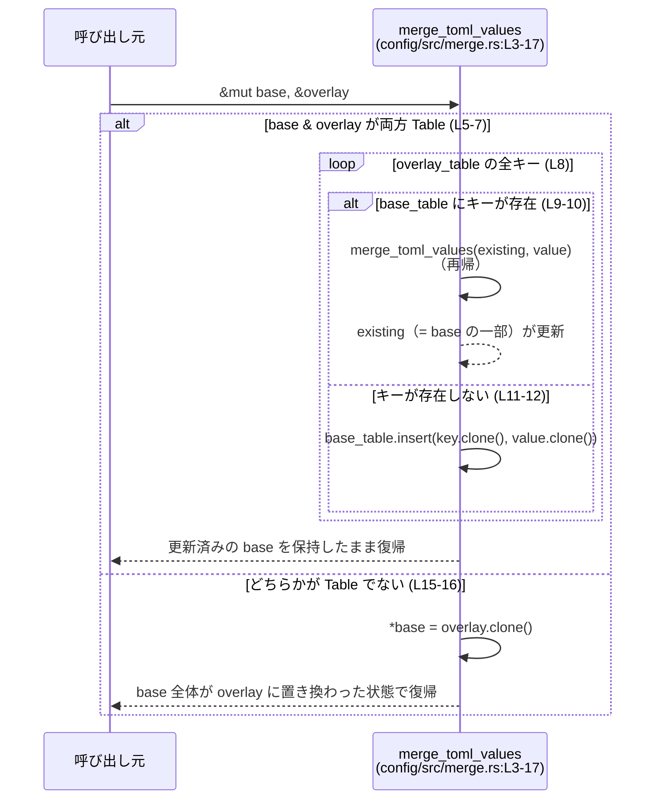

# config/src/merge.rs コード解説

## 0. ざっくり一言

`toml::Value` 同士をマージするためのユーティリティ関数を 1 つ提供しており、  
「ベース設定」に「上書き用設定（オーバーレイ）」を重ねる処理を実装しています。

---

## 1. このモジュールの役割

### 1.1 概要

このモジュールは、2 つの TOML 設定値（`toml::Value`）をマージし、

- **`overlay` 側に優先権を与える**
- **TOML のテーブル（辞書型）同士はネストを保ったまま再帰的にマージする**

というルールで、`base` の内容を書き換えるための関数を提供します  
（`merge_toml_values`、config/src/merge.rs:L3-17）。

### 1.2 アーキテクチャ内での位置づけ

このファイルからわかる依存関係は次のとおりです。

- 依存先
  - `toml::Value` 型（`toml` クレート）を `TomlValue` として使用（config/src/merge.rs:L1）
- 依存元（この関数を呼ぶ側）
  - このチャンクには呼び出し元は現れません（不明）

推定される位置づけ（命名からの推測であり、このファイル単体からは断定できません）としては、
「設定読み込みロジックの中で利用される TOML マージ用ユーティリティ関数」です。

依存関係を簡易に表すと次のようになります。



### 1.3 設計上のポイント

コードから読み取れる設計上の特徴は次のとおりです。

- **再帰的なテーブルマージ**  
  - `base` と `overlay` がどちらも `TomlValue::Table` のときだけ、各キーごとに再帰マージします  
    （config/src/merge.rs:L5-13）。
- **それ以外は「丸ごと置き換え」**  
  - どちらか一方でもテーブルでない場合、`base` 全体を `overlay` のクローンで置き換えます  
    （config/src/merge.rs:L15-16）。
- **インプレース更新**  
  - 戻り値はなく、`&mut TomlValue` として受け取った `base` をその場で更新します  
    （config/src/merge.rs:L4）。
- **クローンによるコピー**  
  - マージに際して `key.clone()` と `value.clone()` を行うため、値はコピーされます  
    （config/src/merge.rs:L12）。
- **エラーを返さない単純 API**  
  - 戻り値が `Result` などではなく `()`（暗黙）であり、エラー状態を返さない設計です  
    （config/src/merge.rs:L4-17）。
- **並行性**  
  - 引数に `&mut TomlValue` を取り、Rust の所有権・借用ルールにより同時に複数の可変参照は存在できないため、データ競合が発生しない設計です（一般的な Rust の性質）。  
    この関数自体はスレッド生成やロックなどは行いません（全体にそのようなコードは存在しません）。

---

## 2. 主要な機能一覧（コンポーネントインベントリー）

このファイルに現れる関数・型の一覧です。

### 2.1 関数インベントリー

| 名前 | 種別 | 役割 / 用途 | 定義位置 |
|------|------|-------------|----------|
| `merge_toml_values` | 関数 | `base` の TOML 値に `overlay` の内容をマージし、`overlay` を優先して `base` を更新する | `config/src/merge.rs:L3-17` |

### 2.2 型インベントリー

このファイル内で新たに定義されている型はありません。外部の型として次が使われます。

| 名前 | 種別 | 役割 / 用途 | 定義位置（本ファイル内での使用） |
|------|------|-------------|----------------------------------|
| `TomlValue` | 型エイリアス（`toml::Value`） | TOML の任意の値（テーブル・配列・文字列など）を表す型 | `config/src/merge.rs:L1, L4-16` |

※ `toml::Value` 自体の定義は `toml` クレート側にあり、このチャンクには現れません。

---

## 3. 公開 API と詳細解説

### 3.1 型一覧（構造体・列挙体など）

このファイル内で宣言された公開型はありません。  
利用している型は前節 2.2 のとおりです。

### 3.2 関数詳細

#### `merge_toml_values(base: &mut TomlValue, overlay: &TomlValue)`

**概要**

- `base` と `overlay` をマージし、結果を `base` に書き戻す関数です（config/src/merge.rs:L3-4）。
- 両方がテーブル（`TomlValue::Table`）の場合は各キーごとに再帰的にマージし、それ以外の場合は `base` を `overlay` で完全に置き換えます（config/src/merge.rs:L5-16）。
- `overlay` 側の値が常に優先される挙動になっています（doc コメントと条件分岐から判断できます。config/src/merge.rs:L3, L9-16）。

**引数**

| 引数名 | 型 | 説明 |
|--------|----|------|
| `base` | `&mut TomlValue` | マージ対象のベース設定です。関数はこの値を書き換えます（config/src/merge.rs:L4）。 |
| `overlay` | `&TomlValue` | ベースに重ねるオーバーレイ設定です。こちらの内容が優先されます（config/src/merge.rs:L3-4）。 |

**戻り値**

- 戻り値は `()`（何も返さない）です。  
  結果は `base` が直接更新されることで表現されます（config/src/merge.rs:L4-17）。

**内部処理の流れ（アルゴリズム）**

1. `overlay` が `TomlValue::Table` かつ `base` も `TomlValue::Table` かどうかを、一つの `if let` 文で判定します（config/src/merge.rs:L5-7）。  
   - どちらもテーブルなら `overlay_table` と `base_table` という参照を取得します。
2. **両方テーブルの場合**（`if` ブロック、config/src/merge.rs:L7-14）:
   1. `overlay_table` に含まれるすべての `(key, value)` についてループします（config/src/merge.rs:L8）。
   2. `base_table` に同じ `key` が存在するかを `get_mut(key)` で確認します（config/src/merge.rs:L9）。
      - 存在する場合（`Some(existing)`）:
        - `existing`（`base` 側の値）と `value`（`overlay` 側の値）に対して、再帰的に `merge_toml_values(existing, value)` を呼び出します（config/src/merge.rs:L9-10）。
      - 存在しない場合:
        - `base_table.insert(key.clone(), value.clone())` で、`overlay` 側の値を `base` 側に新規追加します（config/src/merge.rs:L11-12）。
3. **どちらか一方でもテーブルでない場合**（`else` ブロック、config/src/merge.rs:L15-16）:
   - `*base = overlay.clone();` により、`base` の中身全体を `overlay` のクローンで置き換えます。
   - これにより、型が異なる場合や片方だけがテーブルの場合でも、`overlay` が完全に優先されます。

このロジックのフローを簡易図にすると次のようになります。



**Examples（使用例）**

次の例では、ベース設定とオーバーレイ設定の TOML を文字列から読み込み、  
`merge_toml_values` でマージしています。

```rust
use toml::Value as TomlValue;                           // TOML の値型をインポート（config/src/merge.rs:L1 と同じ）
use config::merge::merge_toml_values;                   // このファイルで定義された関数（モジュールパスはプロジェクト依存・例示）

fn main() -> Result<(), Box<dyn std::error::Error>> {   // 簡単な例として main 関数を定義
    // ベース設定: デフォルト値など                          // base 側の TOML 文字列
    let base_toml = r#"
        [server]
        host = "127.0.0.1"
        port = 8080

        [feature]
        enabled = false
    "#;

    // オーバーレイ設定: 上書き用設定                        // overlay 側の TOML 文字列
    let overlay_toml = r#"
        [server]
        port = 9090

        [feature]
        enabled = true
        name = "experimental"
    "#;

    // TOML 文字列を TomlValue にパース                      // 文字列 -> TomlValue
    let mut base: TomlValue = toml::from_str(base_toml)?;      // base を可変にする（&mut で渡すため）
    let overlay: TomlValue = toml::from_str(overlay_toml)?;    // overlay は参照のみ

    // マージを実行                                          // base に overlay をマージ
    merge_toml_values(&mut base, &overlay);                    // config/src/merge.rs:L4 のシグネチャに対応

    // 結果を表示（例: 確認用）                              // マージ結果を表示
    println!("{}", base.to_string());                          // server.port=9090, feature.enabled=true などに更新される

    Ok(())
}
```

この例では、`server.port` や `feature.enabled` など、オーバーレイ側に指定された値がベース側を上書きし、  
かつ `feature.name` のようにベースに存在しないキーは新たに追加されます。

**Errors / Panics**

- この関数は `Result` 型や `Option` を返さず、エラー状態を表現しません（config/src/merge.rs:L4-17）。
- 関数内では `unwrap` や `expect` など、明示的に `panic!` を発生させるコードは使用されていません（config/src/merge.rs:L1-17）。
- 使用している操作は
  - パターンマッチング (`if let`)、ループ、`get_mut`、`insert`、`clone`
  などであり、このチャンクからは特別なパニック条件は読み取れません。
- ただし、`toml::Value` やその内部で使用されるコレクションが持つパニック条件（メモリ不足など）は、このファイルからは分かりません。

**Edge cases（エッジケース）**

コードから読み取れる代表的なエッジケースと挙動は次のとおりです。

- **片方だけがテーブルの場合**  
  - `overlay` がテーブル・`base` が非テーブル、またはその逆の場合、`else` ブロックが実行され、`base` は `overlay` で丸ごと上書きされます（config/src/merge.rs:L5-7, L15-16）。
- **どちらも非テーブルの場合**  
  - 例えば両方とも文字列や数値などの場合も、同様に `base` は `overlay` のクローンで置き換えられます（config/src/merge.rs:L15-16）。
- **ネストしたテーブル**  
  - `base` と `overlay` の同じキーにテーブルが入っている場合、再帰呼び出しにより、そのテーブル内部も同じルールでマージされます（config/src/merge.rs:L8-10）。
- **`overlay` にしかないキー**  
  - `base_table.get_mut(key)` が `None` の場合、`overlay` の値が新規挿入されます（config/src/merge.rs:L9, L11-12）。
- **`base` にのみ存在するキー**  
  - `overlay_table` 側にキーが存在しない場合、そのキーは変更されずに `base` に残ります（config/src/merge.rs:L8-13 のループがそのキーを触らないため）。
- **空のテーブル**  
  - `overlay` が空のテーブルの場合、ループ内の処理は実行されず、`base` は変更されません（config/src/merge.rs:L8-14）。
  - `base` が空のテーブルで `overlay` に値がある場合、そのまま `overlay` の内容が挿入されます（config/src/merge.rs:L8, L11-12）。

**使用上の注意点**

- **契約（前提条件）**
  - `base` は有効な `TomlValue` への唯一の可変参照である必要があります（シグネチャ上、コンパイラが保証します。config/src/merge.rs:L4）。
  - `overlay` は読み取り専用であり、この関数によって変更されません（config/src/merge.rs:L4-17）。
- **仕様上の重要ポイント**
  - 「テーブル同士は再帰マージ」「それ以外は完全上書き」という 2 段構えのルールを前提として設計されています（config/src/merge.rs:L5-16）。
  - 配列（TOML の `[]`）やスカラー値（文字列・数値など）は特別扱いされず、`overlay` で丸ごと上書きされます。
- **潜在的なバグ・セキュリティ上の注意**
  - この関数は値の内容の妥当性チェック（例: 許可されていないキーや危険な値の検証）は一切行いません（config/src/merge.rs:L4-17）。
    - そのため、「信頼できない入力（ユーザー入力など）をそのまま overlay に渡す」と、ベース側の安全なデフォルト値が上書きされる可能性があります。
    - 値の検証やフィルタリングは呼び出し元で行う必要があります。
- **パフォーマンス面の注意**
  - 深くネストした大きなテーブルをマージすると、再帰呼び出しと `clone` によるコストが増加します（config/src/merge.rs:L8-12, L16）。
  - 配列やスカラー値は差分マージされず完全に上書きされるため、意図しない大量のコピーを避けたい場合は注意が必要です。
- **並行性**
  - 関数自体はスレッドを生成しませんが、`&mut TomlValue` を共有することはできないため、同じ `base` を複数スレッドから同時にマージすることはできません（Rust の借用規則による制約です）。
  - 必要であれば、呼び出し側で `Mutex` や `RwLock` などの同期プリミティブを使ってシリアライズする設計が必要になります（このファイルにはそのようなコードはありません）。

### 3.3 その他の関数

- このファイルに他の関数定義はありません（config/src/merge.rs:L1-17 全体を確認）。

---

## 4. データフロー

### 4.1 代表的なマージ処理のデータフロー

`merge_toml_values` が呼び出されたとき、データは次のように流れます。

- 呼び出し元から `base`（可変参照）と `overlay`（不変参照）が渡される（config/src/merge.rs:L4）。
- 関数内で `base` / `overlay` の型（テーブルかどうか）に応じて分岐し、必要に応じて再帰呼び出しを行う（config/src/merge.rs:L5-10）。
- 最終的に、`base` の内部構造が更新されて呼び出し元に返されます（config/src/merge.rs:L8-16）。

この流れをシーケンス図で表すと次のようになります。



---

## 5. 使い方（How to Use）

### 5.1 基本的な使用方法

典型的な使用フローは次のようになります。

1. TOML 文字列やファイルから `TomlValue` を 2 つ読み込む（`base` と `overlay`）。
2. `base` を `mut` 変数として用意し、`merge_toml_values(&mut base, &overlay)` を呼び出す。
3. マージされた `base` を利用する。

```rust
use std::fs;                                             // ファイル読み込みに使用
use toml::Value as TomlValue;                            // TOML の値型
use config::merge::merge_toml_values;                    // マージ関数（モジュールパスは例示）

fn load_and_merge_configs() -> Result<TomlValue, Box<dyn std::error::Error>> {
    // デフォルト設定をファイルから読み込む                      // base 側
    let base_str = fs::read_to_string("config/default.toml")?;  // ファイル内容を文字列として取得
    let mut base: TomlValue = toml::from_str(&base_str)?;       // 文字列 -> TomlValue

    // 環境ごとの上書き設定を読み込む（存在しない場合は空テーブルとするなどは呼び出し側で対応）
    let overlay_str = fs::read_to_string("config/local.toml")?; // overlay 側
    let overlay: TomlValue = toml::from_str(&overlay_str)?;     // 文字列 -> TomlValue

    // base に overlay をマージ                                  // config/src/merge.rs:L4 の関数を利用
    merge_toml_values(&mut base, &overlay);

    // マージ済みの設定を返す
    Ok(base)
}
```

### 5.2 よくある使用パターン

1. **複数レイヤーの設定マージ**

   デフォルト → プロファイル別設定 → ローカル上書き → 環境変数由来の設定、といった複数レイヤーを段階的にマージする使い方です。

   ```rust
   let mut config = default_config;                      // デフォルト設定
   merge_toml_values(&mut config, &profile_config);      // プロファイル設定をマージ
   merge_toml_values(&mut config, &local_config);        // ローカル設定をマージ
   merge_toml_values(&mut config, &env_config);          // 環境変数などからの設定をマージ
   ```

2. **特定セクションだけをマージ**

   `TomlValue` がテーブルであることが分かっている場合、特定のキーだけを取り出してマージすることも可能です（`TomlValue` の操作はこのファイルには出てこないため、ここでは概念的な例にとどめます）。

### 5.3 よくある間違い

- **`base` を `mut` にし忘れる**

  ```rust
  let base: TomlValue = toml::from_str(base_str)?;       // 誤: mut をつけていない
  merge_toml_values(&mut base, &overlay);                // コンパイルエラー: base は mutable ではない
  ```

  正しくは次のように `mut` を付ける必要があります（config/src/merge.rs:L4 のシグネチャが `&mut TomlValue` であるため）。

  ```rust
  let mut base: TomlValue = toml::from_str(base_str)?;   // 正: mut を付ける
  merge_toml_values(&mut base, &overlay);                // OK
  ```

- **配列やスカラー値も「差分マージ」されると誤解する**

  - 実際には、テーブル以外の型は `overlay` で丸ごと上書きされます（config/src/merge.rs:L15-16）。
  - 例: `base` の配列 `[1, 2, 3]` と `overlay` の配列 `[4]` をマージすると、結果は `[4]` になります。

- **型が違う場合の挙動を想定していない**

  - `base` でテーブル、`overlay` で文字列など、型が違う場合でも `overlay` がそのまま `base` を上書きします（config/src/merge.rs:L5-7, L15-16）。

### 5.4 使用上の注意点（まとめ）

- `overlay` 側の値が常に優先される設計であり、ベース側の安全なデフォルト値が簡単に上書きされるため、  
  どの入力を overlay として許容するかを呼び出し側で慎重に決める必要があります（セキュリティ・安全性の観点）。
- 非テーブル型は差分マージされず完全に置き換えられることから、  
  「部分的に上書きしたいが他の要素は残したい」という要件にはそのままでは適合しません（仕様として理解しておく必要があります）。
- 再帰呼び出しを使っているため、非常に深くネストした構造をマージするとスタック使用量が増えます。  
  一般的な設定ファイルの深さであれば問題になりにくいですが、大量のネストを持つケースでは注意が必要です（config/src/merge.rs:L8-10）。
- ログ出力やトレースなどの観測可能性（Observability）に関する処理は一切含まれていません（config/src/merge.rs:L1-17）。  
  マージ過程を観測したい場合は、呼び出し元でラップしてログを挟むなどの対応が必要です。

---

## 6. 変更の仕方（How to Modify）

### 6.1 新しい機能を追加する場合

例として、「配列を特別なルールでマージしたい」などの要件を追加する場合の観点です。

- 変更すべき場所
  - 型に応じた挙動の切り替えは、現在 `if let TomlValue::Table(...)` と `else` だけで行われています（config/src/merge.rs:L5-16）。
  - 配列や他の型にも個別のロジックを入れたい場合は、この条件分岐を拡張するのが自然です。
- 具体的な手順の例
  1. `if let` の代わりに `match` などを使い、`TomlValue` の全バリエーションに応じた分岐を構成する。
  2. 配列用のマージ関数などを別途定義し、そこから呼び出す構造にする。
  3. 既存の「テーブル同士は再帰マージ」「それ以外は上書き」という契約が変わる場合は、  
     それに依存している呼び出し元がないかを確認する必要があります（このチャンクには呼び出し元は現れません）。

### 6.2 既存の機能を変更する場合

- 影響範囲の確認
  - `merge_toml_values` はこのファイル内で唯一の公開関数であり（config/src/merge.rs:L3-4）、  
    挙動を変えるとこの関数を呼び出しているすべての箇所に影響します。  
    呼び出し元はこのチャンクには現れないため、プロジェクト全体を検索して確認する必要があります。
- 契約（前提条件・返り値の意味）
  - 現在の契約は「`overlay` が常に `base` より優先」「テーブル同士は再帰マージ」「それ以外は完全上書き」です（config/src/merge.rs:L5-16）。
  - この契約を変更すると、既存コードが暗黙に期待している挙動が壊れる可能性があります。
- テスト
  - このファイル内にテストコードは含まれていません（config/src/merge.rs:L1-17）。
  - 挙動を変更する場合は、テーブル同士／非テーブル混在／型が違うケースなど、代表的なパターンごとにテストを追加することが望ましいです。

---

## 7. 関連ファイル

このチャンクから分かる直接の関連は外部クレート `toml` のみです。  
プロジェクト内の他ファイルとの関係は、このチャンクには現れません。

| パス / モジュール | 役割 / 関係 |
|------------------|------------|
| `toml::Value`（外部クレート） | TOML の値を表す型。`TomlValue` としてインポートされ、マージ対象データの型として使用されます（config/src/merge.rs:L1, L4-16）。 |
| `config/src/merge.rs`（本ファイル） | TOML 値のマージ処理（`merge_toml_values`）を提供します。 |

このファイルを利用する設定読み込みやアプリケーション本体のコードは、このチャンクには含まれていないため不明です。
