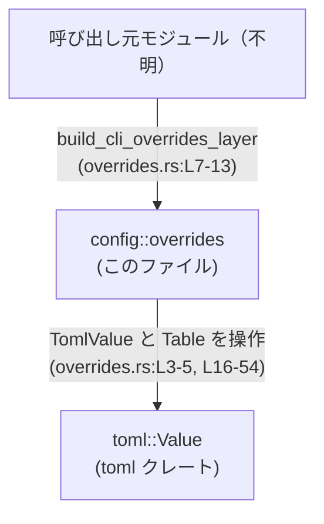
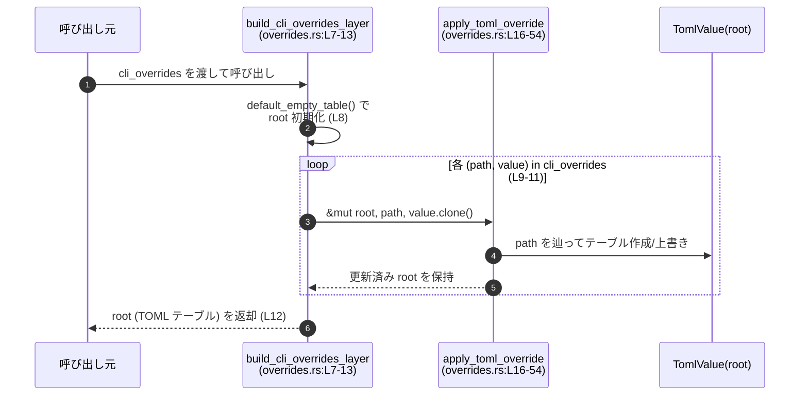

# config/src/overrides.rs

## 0. ざっくり一言

`toml::Value` を用いて、`"a.b.c"` のようなドット区切りのキー列からネストした TOML テーブルを構築・更新するユーティリティです（overrides.rs:L1-54）。

---

## 1. このモジュールの役割

### 1.1 概要

- このモジュールは **ドット区切りのパス文字列と TOML 値の組から、入れ子の TOML テーブル構造を生成する** ために存在します。
- 主な機能は、`&[(String, TomlValue)]` を 1 つの `TomlValue::Table` にまとめる `build_cli_overrides_layer` と、その中で使われる単一パス適用ロジック `apply_toml_override` です（overrides.rs:L7-13, L16-54）。
- 関数名から CLI 用の設定オーバーライド層に使われることが想定されますが、呼び出し元はこのチャンクには現れません。

### 1.2 アーキテクチャ内での位置づけ

このファイル単体で確認できる依存関係は下記の通りです。

- 外部依存:
  - `toml::Value`（`TomlValue` として使用, overrides.rs:L1）
  - `toml::value::Table`（TOML テーブル型, overrides.rs:L17）
- 内部構造:
  - `build_cli_overrides_layer` が公開 API として、複数のオーバーライドをまとめて適用します（overrides.rs:L7-13）。
  - `apply_toml_override` は非公開関数で、1 つのパスと値を `TomlValue` に適用するコアロジックです（overrides.rs:L16-54）。
  - `default_empty_table` は空のテーブルを生成する小さなヘルパーです（overrides.rs:L3-5）。



### 1.3 設計上のポイント

- 状態管理  
  - グローバル状態は持たず、すべての状態は引数（`&mut TomlValue` やローカル変数）として明示的に渡されます（overrides.rs:L7-12, L16-54）。
- パス表現  
  - キー階層は `path.split('.')` による **ドット区切り文字列** として扱われます（overrides.rs:L20）。
- 衝突時の方針  
  - 途中のノードや最終ノードがテーブル以外の値だった場合は、テーブルに置き換えて新しい値を挿入します（既存の非テーブル値は捨てられます, overrides.rs:L25-35, L39-52）。
- エラーハンドリング  
  - すべての関数は `Result` を返さず、想定外のパスであっても例外や panic を起こさずに、決められたルールで構造を書き換える設計です。
- 並行性  
  - `&mut TomlValue` を介したミュータブル参照のみを使っており、Rust の借用規則により同時に複数スレッドから同じ値を更新することはコンパイル時に防がれます。

---

## 2. 主要な機能一覧

### 2.1 機能の箇条書き

- 空の TOML テーブル値の生成
- ドット区切りパスと値のリストから、1 つの TOML テーブル層を構築
- 一つのドット区切りパスを既存の `TomlValue` に適用（ネストしたテーブルを作成・上書き）

### 2.2 コンポーネント（関数）インベントリー

| 名前 | 種別 | 公開範囲 | 役割 / 用途 | 定義位置 |
|------|------|----------|-------------|----------|
| `default_empty_table()` | 関数 | `pub(crate)` | 空の `TomlValue::Table` を生成するヘルパー | overrides.rs:L3-5 |
| `build_cli_overrides_layer(cli_overrides: &[(String, TomlValue)])` | 関数 | `pub` | 複数の `(パス, 値)` を 1 つの TOML テーブルに適用してオーバーライド層を構築 | overrides.rs:L7-13 |
| `apply_toml_override(root: &mut TomlValue, path: &str, value: TomlValue)` | 関数 | `fn`（モジュール内 private） | 1 つのドット区切りパスを `root` に適用し、必要に応じてネストしたテーブルを作成・上書き | overrides.rs:L16-54 |

---

## 3. 公開 API と詳細解説

### 3.1 型一覧（構造体・列挙体など）

このファイルで新たに定義される型はありませんが、外部クレートの型を別名で利用しています。

| 名前 | 種別 | 役割 / 用途 | 定義位置 |
|------|------|-------------|----------|
| `TomlValue` | 外部型（型エイリアス導入） | `toml::Value` の別名。TOML の値（テーブル、文字列、整数など）を表現する共通型として使用されます。 | overrides.rs:L1 |
| `Table` | 外部型（ローカル use） | `toml::value::Table`。キーを文字列とするマップ型で、TOML テーブルを表します。`apply_toml_override` 内でのみ使用されます。 | overrides.rs:L17 |

### 3.2 関数詳細

#### `default_empty_table() -> TomlValue`

**概要**

- 空の TOML テーブル（キーのない `TomlValue::Table`）を生成します（overrides.rs:L3-4）。
- `build_cli_overrides_layer` の初期値として使用されます（overrides.rs:L8）。

**引数**

- なし

**戻り値**

- `TomlValue`  
  常に空のテーブルを表す `TomlValue::Table` を返します。

**内部処理の流れ**

1. `TomlValue::Table(Default::default())` を生成し、そのまま返します（overrides.rs:L3-4）。
   - `Default::default()` は空の `Table` を生成します。

**Examples（使用例）**

```rust
use toml::Value as TomlValue;

// 空の TOML テーブルを作成する
let table: TomlValue = config::overrides::default_empty_table(); // モジュールパスは仮定。実際のパスはプロジェクト構成に依存します。

// 期待される状態: テーブル型でキーが何も入っていない
assert!(matches!(table, TomlValue::Table(_)));
```

**Errors / Panics**

- 明示的にエラーや panic を発生させるコードは含まれていません（overrides.rs:L3-5）。
- 失敗しうるのはメモリ確保に失敗した場合など、通常の Rust ランタイム要因のみです。

**Edge cases（エッジケース）**

- 特筆すべきエッジケースはありません。常に空テーブルを返します。

**使用上の注意点**

- 戻り値は必ずテーブル型なので、他の型を期待している箇所に渡すと、後続処理が想定とずれる可能性があります。
- 既存の `TomlValue` をクリアしたい場合、この関数の戻り値を代入することで「初期化」できます。

---

#### `build_cli_overrides_layer(cli_overrides: &[(String, TomlValue)]) -> TomlValue`

**概要**

- `(path, value)` のスライスから、1 つの TOML テーブル値を構築します（overrides.rs:L7-13）。
- 各 `path` はドット区切りのキー列（例: `"server.port"`）として扱われ、`value` がその位置に書き込まれます。
- 内部で `apply_toml_override` を呼び出し、ルートテーブルに順次適用していきます（overrides.rs:L8-11）。

**引数**

| 引数名 | 型 | 説明 |
|--------|----|------|
| `cli_overrides` | `&[(String, TomlValue)]` | ドット区切りパスと `TomlValue` のペアのスライス。各ペアが 1 つのオーバーライドを表します（overrides.rs:L7）。 |

**戻り値**

- `TomlValue`  
  すべてのオーバーライドを適用した結果のルート値を返します。実装上、常にテーブル型 (`TomlValue::Table`) になります（`default_empty_table` で初期化し、`apply_toml_override` も必ずテーブルを維持するため, overrides.rs:L3-5, L16-54）。

**内部処理の流れ（アルゴリズム）**

1. `default_empty_table()` を呼び出して、空のテーブルを持つ `root` を生成します（overrides.rs:L8）。
2. `cli_overrides` の各 `(path, value)` に対してループ処理を行います（overrides.rs:L9）。
3. それぞれのペアに対して `apply_toml_override(&mut root, path, value.clone())` を呼び出します（overrides.rs:L10）。
   - `value.clone()` により、元の配列の `TomlValue` は消費されずに保持されます。
4. 全てのオーバーライド適用後、`root` を返します（overrides.rs:L12）。

**Examples（使用例）**

ドット区切りパスからオーバーライド層を生成する例です。

```rust
use toml::Value as TomlValue;
// 仮のパス。実際には crate 名やモジュール構成に応じて調整が必要です。
use crate::overrides::build_cli_overrides_layer;

fn main() {
    // CLI 等から得たオーバーライドを表現した配列（例）
    let cli_overrides: Vec<(String, TomlValue)> = vec![
        ("server.host".to_string(), TomlValue::String("localhost".into())),
        ("server.port".to_string(), TomlValue::Integer(8080)),
        ("log.level".to_string(), TomlValue::String("debug".into())),
    ];

    // オーバーライド層を構築
    let overrides_layer = build_cli_overrides_layer(&cli_overrides);

    // 確認: ここでは単に文字列表現を出力する
    println!("{}", toml::to_string_pretty(&overrides_layer).unwrap());
}
```

この例では、結果として次のような構造の TOML テーブルが得られます（イメージ）:

```toml
[server]
host = "localhost"
port = 8080

[log]
level = "debug"
```

**Errors / Panics**

- `build_cli_overrides_layer` 自身は `Result` を返さず、エラー条件のチェックや panic 呼び出しも含みません（overrides.rs:L7-13）。
- 内部で呼び出す `apply_toml_override` も、通常入力に対して panic を発生させる処理は行っていません（overrides.rs:L16-54）。
- したがって、入力パスが空文字や想定外の形式でも、決められたルールで構造を書き換えるだけです。

**Edge cases（エッジケース）**

- `cli_overrides` が空の場合  
  - ループ本体が一度も実行されず、空のテーブルがそのまま返ります（overrides.rs:L8-12）。
- 同じ `path` が複数回現れる場合  
  - 後から現れた値で上書きされます。`apply_toml_override` が単純な代入を行うためです（overrides.rs:L25-35）。
- 異なるパスが同じ中間ノードを異なる型で要求する場合  
  - 途中のノードがスカラー値などテーブル以外であっても、`apply_toml_override` がテーブルに置き換えるため、後のオーバーライドが優先され、前の値は破棄されます（overrides.rs:L39-52）。

**使用上の注意点**

- `value.clone()` によって、`cli_overrides` から `TomlValue` をコピーしています（overrides.rs:L10）。  
  大きな構造を多数渡すときはコピーコストに注意が必要です。
- 戻り値の型は `TomlValue` ですが、実質的にはテーブルであることを前提として扱うことができます。
- パスの意味付け（例: CLI フラグの仕様）はこのモジュール外に依存し、このファイルからは分かりません。

---

#### `apply_toml_override(root: &mut TomlValue, path: &str, value: TomlValue)`

**概要**

- 1 つのドット区切りパス（例: `"a.b.c"`）と `TomlValue` を、`root` で表される TOML 構造に適用します（overrides.rs:L16-54）。
- 途中のノードが存在しない場合は、新たにテーブルを作成して掘り進めます。
- 途中のノードや最終ノードがテーブル以外の値だった場合、その値をテーブルに置き換えてから新しい値を挿入します。

**引数**

| 引数名 | 型 | 説明 |
|--------|----|------|
| `root` | `&mut TomlValue` | 更新対象となる TOML ルート値へのミュータブル参照。内容はこの関数内で書き換えられます（overrides.rs:L16, L19）。 |
| `path` | `&str` | ドット区切りのパス文字列。各セグメントがテーブルのキーとして扱われます（overrides.rs:L16, L20, L22-23）。 |
| `value` | `TomlValue` | パスの最終セグメントに対応して挿入される値。所有権はこの関数に移動します（overrides.rs:L16, L28, L32）。 |

**戻り値**

- なし（`()`）  
  書き換えはすべて `root` 引数を通じて行われます。

**内部処理の流れ（アルゴリズム）**

1. `toml::value::Table` 型をインポートします（overrides.rs:L17）。
2. `current` を `root` へのミュータブル参照として初期化します（overrides.rs:L19）。
3. `path.split('.')` でパスをセグメントに分割し、`peekable()` で「次があるか」を見られるイテレータを作ります（overrides.rs:L20）。
4. `while let Some(segment) = segments_iter.next()` で各セグメントを順に処理します（overrides.rs:L22）。
5. そのセグメントが最後のものであるかを `segments_iter.peek().is_none()` で判定します（overrides.rs:L23）。
   - **最後のセグメント (`is_last == true`) の場合**（overrides.rs:L25-37）:
     - `current` が `TomlValue::Table` なら、そのテーブルに `segment.to_string()` をキーとして `value` を挿入します（overrides.rs:L25-29）。
     - それ以外の場合は、新しい空の `Table` を生成し、そのテーブルにキーと `value` を挿入した上で、`*current` 全体を `TomlValue::Table(table)` に置き換えます（overrides.rs:L30-34）。
     - 挿入が完了したら `return` して関数を終了します（overrides.rs:L36）。
   - **最後のセグメントでない場合**（overrides.rs:L39-53）:
     - `current` が `TomlValue::Table(table)` なら、そのテーブルの `segment` エントリを取得し、存在しなければ新たに空テーブルを挿入したうえで、そのエントリを次の `current` とします（overrides.rs:L39-44）。
     - `current` がテーブル以外なら、`*current` を空のテーブルに置き換えた後、そのテーブルへのミュータブル参照を取り出し（`if let TomlValue::Table(tbl)`）、同様に `segment` エントリを取得して次の `current` とします（overrides.rs:L45-51）。
6. 全セグメントを処理し終えるとループを抜け、関数が終了します（overrides.rs:L54）。

**Examples（使用例）**

単一パスを既存の `TomlValue` に適用する例です。

```rust
use toml::Value as TomlValue;
// apply_toml_override はこのファイル内の private 関数なので、
// 実際には同一モジュール内からのみ呼び出せます。
// ここでは同一ファイル内のコード例として扱います。

fn example_apply() {
    let mut root = TomlValue::Table(Default::default()); // 空テーブルを用意

    // "database.host" に "localhost" を設定
    super::apply_toml_override(
        &mut root,
        "database.host",
        TomlValue::String("localhost".into()),
    );

    // "database.port" に 5432 を設定
    super::apply_toml_override(
        &mut root,
        "database.port",
        TomlValue::Integer(5432),
    );

    // 結果は概念的には次のような構造になる:
    // [database]
    // host = "localhost"
    // port = 5432
}
```

**Errors / Panics**

- 関数内には明示的な panic を起こすコード（`unwrap` など）は存在しません（overrides.rs:L16-54）。
- `path` が空文字や、`.` の連続を含んでいても、`split('.')` の仕様により空文字セグメントとして扱われるだけで、エラーにはなりません（overrides.rs:L20, L22-23）。
- 主な失敗要因は、メモリ確保の失敗など Rust ランタイムレベルの問題に限られます。

**Edge cases（エッジケース）**

- `path` が空文字 `""` の場合  
  - `split('.')` は 1 つの空セグメント `""` を生成します。その結果、テーブルのキーとして空文字 `""` が使われます（overrides.rs:L20, L22-35）。
- `path` が `"a."` のように末尾に `.` を持つ場合  
  - セグメントは `"a"` と `""` になり、`"a"` の下にキー `""` を持つテーブルが作られます。
- `path` が `"a..b"` のように `..` を含む場合  
  - セグメントは `"a"`, `""`, `"b"` となり、途中のキー `""` に対してもテーブルが作られます。
- 途中のノードがテーブル以外の値である場合  
  - その値は捨てられ、空のテーブルに置き換えられた上で、子ノードが作成されます（overrides.rs:L45-51）。
- 既に値が存在するキーに対して最終セグメントで値を挿入した場合  
  - 既存の値は新しい `value` で上書きされます（テーブルであれば `insert` により置き換え, overrides.rs:L25-29）。

**使用上の注意点**

- `root` がテーブル以外の値であっても利用できますが、その場合はテーブルに置き換えられ、元の値は失われます（overrides.rs:L30-34, L45-47）。
- パスの中で `.` は区切りとして使われるため、「キー名に `.` を含めたい」という要件には対応していません。この仕様は `path.split('.')` に由来します（overrides.rs:L20）。
- 関数は `&mut TomlValue` を受け取るため、同じ `root` を複数スレッドから同時に更新するような使い方は Rust のコンパイルエラーとなり、実行時のデータ競合が起きない設計になっています。

---

### 3.3 その他の関数

- このファイルに存在する関数はすべて上記 3.2 で解説済みです（overrides.rs:L3-13, L16-54）。
- 補助的なラッパー関数や単純なヘルパーは他に存在しません。

---

## 4. データフロー

このモジュールの代表的な処理シナリオは、`build_cli_overrides_layer` が複数の `(path, value)` を `root` に適用して 1 つのテーブル構造を生成する流れです（overrides.rs:L7-13, L16-54）。

1. 呼び出し元が `cli_overrides` を構築し、`build_cli_overrides_layer` を呼び出します。
2. `build_cli_overrides_layer` は `default_empty_table` で空の `root` を準備します（overrides.rs:L8）。
3. 各 `(path, value)` に対して `apply_toml_override` を呼び出し、`root` の中身を更新します（overrides.rs:L9-11）。
4. 最終的に構築された `root` が呼び出し元に返されます（overrides.rs:L12）。



このシーケンス図は、`build_cli_overrides_layer` と `apply_toml_override` の実装範囲に対応します（overrides.rs:L7-13, L16-54）。

---

## 5. 使い方（How to Use）

### 5.1 基本的な使用方法

典型的なフローは「オーバーライドの一覧を用意 → `build_cli_overrides_layer` で層を構築 → 結果を他の設定とマージ」となります。このファイルにはマージ処理は含まれないため、ここではオーバーライド層の構築までを示します。

```rust
use toml::Value as TomlValue;
// 実際のパスはプロジェクト構成に依存します。
// ここでは crate 直下に overrides モジュールがあると仮定します。
use crate::overrides::build_cli_overrides_layer;

fn main() {
    // 1. オーバーライドの一覧を用意する
    let overrides: Vec<(String, TomlValue)> = vec![
        ("app.theme".to_string(), TomlValue::String("dark".into())),
        ("app.window.width".to_string(), TomlValue::Integer(1280)),
        ("app.window.height".to_string(), TomlValue::Integer(720)),
    ];

    // 2. オーバーライド層を構築する
    let layer = build_cli_overrides_layer(&overrides);

    // 3. 結果を利用する（ここではデバッグ出力のみ）
    println!("{}", toml::to_string_pretty(&layer).unwrap());
}
```

### 5.2 よくある使用パターン

- **CLI オプションからの変換**  
  CLI 解析ライブラリ（例: clap）で得たキーと値を `(String, TomlValue)` に変換し、本関数に渡すパターンが考えられます。  
  変換ロジック（文字列から適切な `TomlValue` への変換）はこのファイルには含まれません。

- **環境変数からのオーバーライド**  
  環境変数名をドット区切りパスにマッピングし、その値を `TomlValue` に変換して適用することもできます。

### 5.3 よくある間違い

```rust
use toml::Value as TomlValue;

// 間違い例: root をテーブル以外の値として初期化してしまう
let mut root = TomlValue::String("original".into());

// これ自体はコンパイル・実行ともに可能
super::apply_toml_override(&mut root, "a.b", TomlValue::Integer(1));

// しかし、root は "original" ではなく、次のようなテーブルに置き換えられる:
// [a]
// b = 1
// 元の "original" という値は失われる（overrides.rs:L45-51）。
```

正しい（意図が明確な）利用例:

```rust
let mut root = super::default_empty_table(); // 最初からテーブルとして初期化する

super::apply_toml_override(&mut root, "a.b", TomlValue::Integer(1));
// ここで root がテーブルであることは明確で、元の値を失う心配もない。
```

また、空文字や意図しない `.` が入ったパスをそのまま渡すと、空キー `""` を含むテーブルが作られる可能性がある点にも注意が必要です（overrides.rs:L20-23）。

### 5.4 使用上の注意点（まとめ）

- **パス仕様**  
  - ドット `.` は階層区切りとして扱われ、キー名に `.` を含める方法はありません（overrides.rs:L20）。
  - 空文字や連続した `.` を含むパスは、そのまま空キーや空階層として扱われます。
- **型の上書き**  
  - 途中ノード・最終ノードがテーブル以外の値であっても、テーブルに置き換えて新しい値を挿入します（overrides.rs:L30-34, L45-47）。  
    元の値が必要な場合は、呼び出し前に退避する必要があります。
- **コピーコスト**  
  - `build_cli_overrides_layer` は `value.clone()` を行うため、大きな値を多数渡すとメモリコピーやアロケーションのコストが増えます（overrides.rs:L10）。
- **スレッド安全性**  
  - 関数は `&mut TomlValue` を用いる純粋な Rust の安全なコードで、`unsafe` は含まれていません。  
    同じ `TomlValue` を複数スレッドから同時に更新するのはコンパイルできないため、データ競合は防がれます。
- **セキュリティ観点**  
  - このモジュールは入力文字列を構造化データの鍵として使うだけで、外部コマンド実行やファイルアクセスなどは行っていません。  
    悪意ある入力による直接的なコード実行リスクは、このファイルからは見られません（overrides.rs:L1-55）。

---

## 6. 変更の仕方（How to Modify）

### 6.1 新しい機能を追加する場合

- **パス構文を拡張したい場合**  
  - 例: `"array[0].field"` のような配列インデックス対応など。
  - 変更箇所:
    - パスの分割と走査部分（`path.split('.')` とそのループ, overrides.rs:L20-23）。
    - セグメントの解釈（文字列か数値かなど）に応じて、テーブルだけでなく配列 (`TomlValue::Array`) を扱うロジックを追加する必要があります。
- **上書きポリシーの変更**  
  - 現在は常に最後の値で上書きされます（overrides.rs:L25-29）。  
    マージ（例: テーブルのマージ）をしたい場合は、最終セグメントの処理分岐（`is_last` ブロック, overrides.rs:L25-35）を拡張するのが自然です。
- **ログやデバッグ情報の追加**  
  - 上書きや型変換（スカラー → テーブルなど）が発生したときにログを出す等の観測性を高めたい場合、`apply_toml_override` の分岐部分にログ出力を追加する形になります（overrides.rs:L25-35, L39-52）。

### 6.2 既存の機能を変更する場合

- **影響範囲の確認**  
  - コアロジックは `apply_toml_override` に集中しており（overrides.rs:L16-54）、`build_cli_overrides_layer` は単にそれを繰り返し呼ぶだけです（overrides.rs:L7-13）。  
    パス解釈や上書きルールを変更する場合は、主に `apply_toml_override` の変更で済みます。
- **契約（前提条件）の確認**  
  - `build_cli_overrides_layer` は「`cli_overrides` の順にオーバーライドを適用する」という契約を暗黙に持っています（overrides.rs:L9-11）。  
    並び順に意味がある場合、この挙動を変えると呼び出し側に影響します。
  - `apply_toml_override` は「途中ノードが非テーブルならテーブルに置き換える」という挙動を契約としています（overrides.rs:L45-47）。  
    ここを変えると、同じパスでも結果構造が変わるため、利用者の期待とずれないか確認が必要です。
- **テストについて**  
  - このファイル内には `#[cfg(test)]` やテスト関数は存在しません（overrides.rs:L1-55）。  
    仕様変更時には、少なくとも以下のようなケースをテストすることが推奨されます（例示であり、このファイル内には存在しません）:
    - 単純な 1 セグメントパス（`"key"`）
    - 深いネストパス（`"a.b.c"`）
    - 途中ノードが既にスカラーのケース
    - 空文字や `..` を含むパス

---

## 7. 関連ファイル

このチャンクから直接参照できる関連ファイル・モジュールは限られています。

| パス / モジュール | 役割 / 関係 |
|------------------|------------|
| `toml::Value` / `toml::value::Table` | TOML データを表現する外部クレートの型。`TomlValue` および `Table` として本モジュールで使用され、テーブル構造の生成・更新に利用されています（overrides.rs:L1, L17）。 |
| （自前の設定読み込みモジュール） | `build_cli_overrides_layer` の呼び出し元になると想定されますが、このチャンクには現れず、具体的なパスや構造は不明です。 |

このファイル内にテストモジュールや他の内部モジュールへの `mod` / `use` は見当たらないため（overrides.rs:L1-55）、関連するテストコードやユーティリティはこのチャンクからは特定できません。
