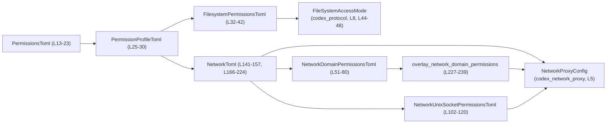
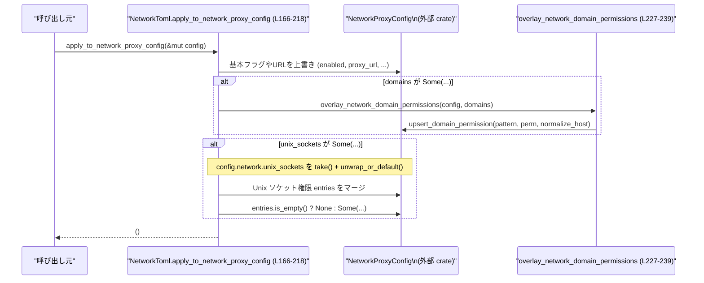

# config/src/permissions_toml.rs

## 0. ざっくり一言

TOML から読み書きできる権限設定（ファイルシステムとネットワーク）の型を定義し、特にネットワーク設定を `NetworkProxyConfig` に適用するためのユーティリティを提供するモジュールです（`config/src/permissions_toml.rs` 全体）。

---

## 1. このモジュールの役割

### 1.1 概要

- このモジュールは **権限プロファイルのTOML表現** を定義し、それを内部の **ネットワークプロキシ設定 (`NetworkProxyConfig`) に反映する** ために存在しています。
- ファイルシステム権限は `codex_protocol::permissions::FileSystemAccessMode` を使って表現し（L44-48）、ネットワーク権限はドメインとUnixソケットの allow/deny 型で表現します（L83-90, L122-129）。
- ネットワーク設定については、`NetworkToml` から `NetworkProxyConfig` へオーバーレイするメソッドを提供します（L166-224）。

### 1.2 アーキテクチャ内での位置づけ

主な依存関係と役割は次のとおりです。

- 入力側：TOML からデシリアライズされる権限設定  
  - `PermissionsToml` … プロファイル名 → `PermissionProfileToml` のマップ（L13-17）
  - `PermissionProfileToml` … ファイルシステムとネットワークの設定を束ねる（L25-30）
- ネットワーク側：`NetworkToml` … TOML に対応するネットワーク設定（L141-157）
- 出力側：`NetworkProxyConfig`（外部 crate）へ適用（L166-224, L227-239）



### 1.3 設計上のポイント

- **マップ＋flattenで可変長プロファイル**  
  - プロファイル名やパス/ドメインはすべて `BTreeMap<String, ...>` で管理し（L13-17, L32-36, L51-55, L102-106）、`#[serde(flatten)]` により TOML 上はフラットなキーとして表現されます（L15, L34, L53, L104）。
- **Option によるオーバーレイ設計**  
  - `NetworkToml` の各フィールドは `Option` で定義されており（L141-157）、`Some` の項目だけが既存の `NetworkProxyConfig` を上書きします（L166-218）。
- **allow/deny 型の明示的な権限表現**  
  - ドメイン・Unixソケット権限は `Allow` / `Deny` / `None` の enum で表現され（L83-90, L122-129）、フィルタ関数がそれぞれのリストを生成します（L62-80, L113-119）。
- **型安全性とスキーマ生成**  
  - すべての設定型は `Serialize`, `Deserialize`, `JsonSchema` を derive し、TOML/JSON シリアライズとスキーマ生成に対応しています（例: L13, L25, L32, L51, L83, L102, L122, L141）。
- **安全性 / 並行性**  
  - このモジュールは `unsafe` を使用しておらず、操作はすべて所有権・可変参照（`&mut`）に基づくため、コンパイル時にメモリ安全性とデータ競合の防止が保証されます（特に `apply_to_network_proxy_config(&mut NetworkProxyConfig)` のシグネチャ, L166-218）。

---

## 2. 主要な機能一覧

- 権限プロファイル集合の表現: `PermissionsToml` によるプロファイル名→権限設定のマップ（L13-17）。
- プロファイル単位の設定: `PermissionProfileToml` によるファイルシステム/ネットワーク設定の束ね（L25-30）。
- ファイルシステム権限の定義: `FilesystemPermissionToml` による単一/スコープ付き権限表現（L44-49）。
- ドメイン権限の定義・抽出:  
  - `NetworkDomainPermissionsToml` によるドメインパターン→許可/拒否のマップ（L51-55）。
  - `allowed_domains` / `denied_domains` で許可/拒否ドメインリストを抽出（L62-80）。
- Unixソケット権限の定義・抽出:  
  - `NetworkUnixSocketPermissionsToml` によるパス→許可/無効のマップ（L102-106, L122-129）。
  - `allow_unix_sockets` で許可されているソケットパスを抽出（L113-119）。
- ネットワーク設定の適用:  
  - `NetworkToml::apply_to_network_proxy_config` による既存 `NetworkProxyConfig` へのオーバーレイ（L166-218）。
  - `NetworkToml::to_network_proxy_config` による新規 `NetworkProxyConfig` の生成（L220-223）。
- ドメイン権限のプロキシ設定への反映:  
  - `overlay_network_domain_permissions` による `NetworkDomainPermissionsToml` → `NetworkProxyConfig` 変換（L227-239）。

---

## 3. 公開 API と詳細解説

### 3.1 型一覧（構造体・列挙体など / コンポーネントインベントリー）

| 名前 | 種別 | 公開性 | 役割 / 用途 | 定義位置 |
|------|------|--------|-------------|----------|
| `PermissionsToml` | 構造体 | `pub` | プロファイル名 (`String`) → `PermissionProfileToml` のマップ。全体の権限設定を表現します。 | `config/src/permissions_toml.rs:L13-23` |
| `PermissionProfileToml` | 構造体 | `pub` | 単一プロファイルのファイルシステム/ネットワーク設定をまとめるコンテナです。 | `config/src/permissions_toml.rs:L25-30` |
| `FilesystemPermissionsToml` | 構造体 | `pub` | パス文字列 → `FilesystemPermissionToml` のマップ。ファイルシステム権限の集合です。 | `config/src/permissions_toml.rs:L32-42` |
| `FilesystemPermissionToml` | 列挙体 | `pub` | ファイルシステム権限を「単一モード」または「サブパスごとのモード」で表現します。 | `config/src/permissions_toml.rs:L44-49` |
| `NetworkDomainPermissionsToml` | 構造体 | `pub` | ドメイン/ホストパターン文字列 → `NetworkDomainPermissionToml` のマップ。ドメインごとの allow/deny を保持します。 | `config/src/permissions_toml.rs:L51-80` |
| `NetworkDomainPermissionToml` | 列挙体 | `pub` | ドメインに対する `Allow` / `Deny` 権限を表現します。Display 実装あり。 | `config/src/permissions_toml.rs:L83-100` |
| `NetworkUnixSocketPermissionsToml` | 構造体 | `pub` | Unixソケットパス文字列 → `NetworkUnixSocketPermissionToml` のマップ。 | `config/src/permissions_toml.rs:L102-120` |
| `NetworkUnixSocketPermissionToml` | 列挙体 | `pub` | Unixソケットに対する `Allow` / `None` 権限を表現します。Display 実装あり。 | `config/src/permissions_toml.rs:L122-139` |
| `NetworkToml` | 構造体 | `pub` | ネットワークに関する各種フラグ・URL・モード・ドメイン/Unixソケット権限を保持し、`NetworkProxyConfig` へ適用する役割を持ちます。 | `config/src/permissions_toml.rs:L141-157, L166-224` |
| `NetworkModeSchema` | 列挙体 | 非公開 | JSON Schema 生成用の限定的なモード表現（`limited` / `full`）。`NetworkToml.mode` フィールドのスキーマ用に使われます。 | `config/src/permissions_toml.rs:L159-164` |

### 3.2 関数詳細（コア 7 件）

#### `PermissionsToml::is_empty(&self) -> bool`

**概要**

- 権限プロファイルが 1 件も登録されていないかどうかを返します（L19-23）。

**引数**

| 引数名 | 型 | 説明 |
|--------|----|------|
| `self` | `&PermissionsToml` | チェック対象の全体権限設定です。 |

**戻り値**

- `bool` – `entries` が空なら `true`、1件以上あれば `false` です（L20-22）。

**内部処理の流れ**

1. `self.entries.is_empty()` を返すだけのラッパーです（L20-21）。

**Examples（使用例）**

```rust
use std::collections::BTreeMap;
use config::permissions_toml::{PermissionsToml, PermissionProfileToml};

// 空の設定を作成
let perms = PermissionsToml {
    entries: BTreeMap::new(), // プロファイルなし
};

// true が返る
assert!(perms.is_empty());
```

**Errors / Panics**

- エラーや panic を発生させるコードは含まれていません（`is_empty` は panic しない標準メソッドです, L20-21）。

**Edge cases（エッジケース）**

- `entries` が `BTreeMap::new()` の場合: `true`。
- 非常に多くのプロファイルが登録されていても `is_empty` のコストは一定です。

**使用上の注意点**

- 判定は「0件かどうか」だけで、プロファイル内部の空/未設定を考慮しません。

---

#### `NetworkDomainPermissionsToml::allowed_domains(&self) -> Option<Vec<String>>`

**概要**

- ドメイン権限マップのうち `Allow` とマークされたパターンだけを抽出し、`Vec<String>` として返します（L62-70）。
- 許可されたドメインが 1 件もない場合は `None` を返します（L69-70）。

**引数**

| 引数名 | 型 | 説明 |
|--------|----|------|
| `self` | `&NetworkDomainPermissionsToml` | ドメイン権限マップです。 |

**戻り値**

- `Option<Vec<String>>` –  
  - `Some(vec)` : `Allow` のパターンが 1 件以上ある場合、そのパターン文字列のリスト。  
  - `None` : `Allow` が 1 件もない場合（L69-70）。

**内部処理の流れ**

1. `self.entries.iter()` で `BTreeMap<String, NetworkDomainPermissionToml>` を走査（L63-65）。
2. `matches!(permission, NetworkDomainPermissionToml::Allow)` で `Allow` のエントリのみをフィルタ（L66）。
3. パターン文字列 (`pattern`) を `clone` して `Vec<String>` に `collect`（L67-68）。
4. ベクタが空なら `None`、そうでなければ `Some(vec)` を返すために `(!vec.is_empty()).then_some(vec)` を使用（L69-70）。

**Examples（使用例）**

```rust
use std::collections::BTreeMap;
use config::permissions_toml::{
    NetworkDomainPermissionsToml, NetworkDomainPermissionToml,
};

let mut entries = BTreeMap::new();
entries.insert("example.com".to_string(), NetworkDomainPermissionToml::Allow);
entries.insert("bad.example.com".to_string(), NetworkDomainPermissionToml::Deny);

let domains = NetworkDomainPermissionsToml { entries };

// Some(vec!["example.com"]) が返る
let allowed = domains.allowed_domains().unwrap();
assert_eq!(allowed, vec!["example.com".to_string()]);
```

**Errors / Panics**

- `matches!` と `BTreeMap::iter` / `collect` の組み合わせのみであり、panic を起こす操作は含まれていません（L62-69）。

**Edge cases（エッジケース）**

- `entries` が空: `allowed_domains()` は `None` を返します。
- `Allow` が 1件もない: `Deny` のみの場合も `None` を返します（L69-70）。
- 同一パターン名の重複は `BTreeMap` のキー上許されないため、各パターンは一意です。

**使用上の注意点**

- ここで返される文字列は、`overlay_network_domain_permissions` で使われる `normalize_host` を通っていません（L227-239）。  
  正規化されたドメイン名が必要な場合は別途処理が必要です（この関数からは得られません）。

---

#### `NetworkDomainPermissionsToml::denied_domains(&self) -> Option<Vec<String>>`

**概要**

- `allowed_domains` と対になる関数で、`Deny` とマークされたドメインパターンのみを抽出します（L72-80）。
- 拒否ドメインが 1 件もない場合は `None` を返します（L79-80）。

**引数 / 戻り値**

- 引数・戻り値は `allowed_domains` と同様ですが、条件が `Allow` ではなく `Deny` である点のみ異なります（L76）。

**内部処理の流れ**

1. `self.entries.iter()` で全エントリを走査（L73-75）。
2. `matches!(permission, NetworkDomainPermissionToml::Deny)` で `Deny` のみフィルタ（L76）。
3. パターンを `Vec<String>` に収集し（L77-78）、空かどうかで `Some`/`None` を切り替え（L79-80）。

**Examples（使用例）**

```rust
use std::collections::BTreeMap;
use config::permissions_toml::{
    NetworkDomainPermissionsToml, NetworkDomainPermissionToml,
};

let mut entries = BTreeMap::new();
entries.insert("example.com".to_string(), NetworkDomainPermissionToml::Allow);
entries.insert("bad.example.com".to_string(), NetworkDomainPermissionToml::Deny);

let domains = NetworkDomainPermissionsToml { entries };

// Some(vec!["bad.example.com"]) が返る
let denied = domains.denied_domains().unwrap();
assert_eq!(denied, vec!["bad.example.com".to_string()]);
```

**Errors / Panics / Edge cases / 使用上の注意点**

- `allowed_domains` と同様に panic の可能性はありません（L72-80）。
- `Deny` が 1 件もない場合は `None` を返すことに注意してください。

---

#### `NetworkUnixSocketPermissionsToml::allow_unix_sockets(&self) -> Vec<String>`

**概要**

- Unix ソケット権限マップのうち、`Allow` に設定されているソケットパスのみを `Vec<String>` で返します（L113-119）。
- `None` など他の値は無視されます。

**引数**

| 引数名 | 型 | 説明 |
|--------|----|------|
| `self` | `&NetworkUnixSocketPermissionsToml` | Unix ソケット権限マップです。 |

**戻り値**

- `Vec<String>` – `Allow` のソケットパス一覧。`Allow` がなくても空ベクタを返します（L113-119）。

**内部処理の流れ**

1. `self.entries.iter()` でマップを走査（L114-115）。
2. `matches!(permission, NetworkUnixSocketPermissionToml::Allow)` で `Allow` のみフィルタ（L116）。
3. パス文字列を `clone` して `Vec<String>` に収集（L117-118）。

**Examples（使用例）**

```rust
use std::collections::BTreeMap;
use config::permissions_toml::{
    NetworkUnixSocketPermissionsToml, NetworkUnixSocketPermissionToml,
};

let mut entries = BTreeMap::new();
entries.insert("/var/run/app.sock".to_string(), NetworkUnixSocketPermissionToml::Allow);
entries.insert("/var/run/other.sock".to_string(), NetworkUnixSocketPermissionToml::None);

let sockets = NetworkUnixSocketPermissionsToml { entries };

let allowed = sockets.allow_unix_sockets();
assert_eq!(allowed, vec!["/var/run/app.sock".to_string()]);
```

**Errors / Panics**

- `Vec::collect` 以外に危険な操作はなく、panic を起こしません（L113-119）。

**Edge cases**

- `entries` が空でも `Vec::new()` を返すだけです。
- `None` のエントリはすべて無視されます。

**使用上の注意点**

- 返り値が空でも「すべて禁止」なのか「設定がないだけ」なのかは、この構造体単体からは区別できません。  
  それを区別したい場合は `entries.is_empty()` などと併用する必要があります（L108-111）。

---

#### `NetworkToml::apply_to_network_proxy_config(&self, config: &mut NetworkProxyConfig)`

**概要**

- `NetworkToml` に設定された `Some` のフィールドのみを、既存の `NetworkProxyConfig` に上書き適用します（L166-218）。
- ドメイン権限・Unixソケット権限については、既存設定への「マージ」を行います（L198-214）。

**引数**

| 引数名 | 型 | 説明 |
|--------|----|------|
| `self` | `&NetworkToml` | TOML から読み込まれたネットワーク設定です（L141-157）。 |
| `config` | `&mut NetworkProxyConfig` | オーバーレイ対象となる既存のネットワークプロキシ設定です（L167）。 |

**戻り値**

- なし（`()`）。`config` をインプレースで変更します（L167-217）。

**内部処理の流れ（アルゴリズム）**

1. 各スカラー/文字列フィールドのオーバーレイ（L168-181, L183-185, L186-191, L192-197, L215-216）  
   - `enabled`, `proxy_url`, `enable_socks5`, `socks_url`, `enable_socks5_udp`,  
     `allow_upstream_proxy`, `dangerously_allow_*`, `mode`, `allow_local_binding` それぞれについて、  
     `if let Some(value) = self.field` なら `config.network.field = value` と上書き。
2. ドメイン権限のオーバーレイ（L198-200）  
   - `self.domains` が `Some(domains)` の場合、`overlay_network_domain_permissions(config, domains)` を呼び出し（L198-200, L227-239）。
3. Unix ソケット権限のマージ（L201-214）  
   - `self.unix_sockets` が `Some(unix_sockets)` の場合のみ処理。
   - 既存の `config.network.unix_sockets` を `take()` して取り出し、`unwrap_or_default()` で `None` を空の構造体に変換（L202）。
   - `unix_sockets.entries` を走査し（L203-210）、  
     `NetworkUnixSocketPermissionToml` を `ProxyNetworkUnixSocketPermission` に変換して（L204-209）、  
     `proxy_unix_sockets.entries.insert(path.clone(), permission)` で上書き/追加（L210）。
   - 最後に `proxy_unix_sockets.entries` が空でなければ `Some(proxy_unix_sockets)` を代入し、空なら `None` に戻します（L212-213）。

**Rust の安全性 / 並行性**

- `&mut NetworkProxyConfig` による排他的な可変参照のため、この関数を呼び出している間は他スレッドから同じ `config` を同時に書き換えることはできません（Rust の所有権ルールによりコンパイル時に禁止）。
- `take().unwrap_or_default()` は `Option` の所有権移動＋デフォルト値であり、panic しない安全なパターンです（L202）。

**Examples（使用例）**

```rust
use config::permissions_toml::{
    NetworkToml, NetworkDomainPermissionsToml, NetworkDomainPermissionToml,
};
use codex_network_proxy::NetworkProxyConfig;
use std::collections::BTreeMap;

// NetworkToml を手動で構築（本来は TOML から Deserialize される想定）
let mut domain_entries = BTreeMap::new();
domain_entries.insert(
    "example.com".to_string(),
    NetworkDomainPermissionToml::Allow,
);
let domains = NetworkDomainPermissionsToml { entries: domain_entries };

let net_toml = NetworkToml {
    enabled: Some(true),
    proxy_url: Some("http://127.0.0.1:8080".to_string()),
    enable_socks5: None,
    socks_url: None,
    enable_socks5_udp: None,
    allow_upstream_proxy: Some(true),
    dangerously_allow_non_loopback_proxy: Some(false),
    dangerously_allow_all_unix_sockets: Some(false),
    mode: None,               // 既存値を維持
    domains: Some(domains),
    unix_sockets: None,       // 既存値を維持
    allow_local_binding: Some(true),
};

let mut cfg = NetworkProxyConfig::default();
// 既存設定にオーバーレイ
net_toml.apply_to_network_proxy_config(&mut cfg);
```

**Errors / Panics**

- この関数内には明示的な `panic!` や `unwrap()` はありません。
- ただし、`config.network.upsert_domain_permission` や `NetworkProxyConfig` の内部実装でのエラー/パニックの可能性については、このチャンクからは分かりません（L236-238）。

**Edge cases（エッジケース）**

- すべてのフィールドが `None` の `NetworkToml` を適用した場合、`config` は一切変更されません（L168-197, L198-216）。
- `domains` が `Some` だが `entries` が空の場合、`overlay_network_domain_permissions` は呼ばれますが、ループが何もせず終了します（L198-200, L231-239）。
- `unix_sockets` が `Some` だが `entries` が空の場合、`proxy_unix_sockets.entries` は空のままで、`config.network.unix_sockets` は `None` に設定されます（L201-214）。

**使用上の注意点**

- 「オーバーレイ」動作であり、`None` は「変更しない」を意味します。既存の値をリセットしたい場合は、その概念が `NetworkProxyConfig` 側に存在するかどうかを確認する必要があります。
- Unix ソケットのマージ処理は既存エントリを上書きするため、同じパスの設定が複数回適用された場合は最後の設定が有効になります（L203-211）。

---

#### `NetworkToml::to_network_proxy_config(&self) -> NetworkProxyConfig`

**概要**

- `NetworkProxyConfig::default()` から新しい設定を作り、`apply_to_network_proxy_config` を適用した結果を返します（L220-223）。
- 「この `NetworkToml` だけで完結するネットワーク設定」を得たい場合に使うヘルパーです。

**引数**

| 引数名 | 型 | 説明 |
|--------|----|------|
| `self` | `&NetworkToml` | 適用したいネットワーク設定です。 |

**戻り値**

- `NetworkProxyConfig` – `Default` をベースに `self` の値がオーバーレイされた設定（L220-223）。

**内部処理の流れ**

1. `NetworkProxyConfig::default()` を生成（L221）。
2. `self.apply_to_network_proxy_config(&mut config)` を呼び出し（L222）。
3. 変更済みの `config` を返します（L223）。

**Examples（使用例）**

```rust
use config::permissions_toml::NetworkToml;

let net_toml = NetworkToml {
    enabled: Some(true),
    proxy_url: None,
    enable_socks5: Some(false),
    socks_url: None,
    enable_socks5_udp: None,
    allow_upstream_proxy: None,
    dangerously_allow_non_loopback_proxy: None,
    dangerously_allow_all_unix_sockets: None,
    mode: None,
    domains: None,
    unix_sockets: None,
    allow_local_binding: None,
};

// default + この NetworkToml の設定で NetworkProxyConfig を生成
let cfg = net_toml.to_network_proxy_config();
```

**Errors / Panics / Edge cases / 使用上の注意点**

- `apply_to_network_proxy_config` と同じ性質を持ちます。  
- デフォルト設定に上書きするため、「全体設定の生成」に向いていますが、「差分適用」には `apply_to_network_proxy_config` を使用する必要があります。

---

#### `overlay_network_domain_permissions(config: &mut NetworkProxyConfig, domains: &NetworkDomainPermissionsToml)`

**概要**

- `NetworkDomainPermissionsToml` に記述されたドメイン権限を、`NetworkProxyConfig` のネットワーク設定に統合します（L227-239）。
- ドメインパターンごとに `upsert_domain_permission` を呼び出し、`Allow` / `Deny` を `ProxyNetworkDomainPermission` に変換して適用します（L231-238）。

**引数**

| 引数名 | 型 | 説明 |
|--------|----|------|
| `config` | `&mut NetworkProxyConfig` | 更新対象のネットワークプロキシ設定です。 |
| `domains` | `&NetworkDomainPermissionsToml` | 適用するドメイン権限マップです。 |

**戻り値**

- なし（`()`）。`config` をインプレースで変更します。

**内部処理の流れ**

1. `for (pattern, permission) in &domains.entries` でマップを走査（L231）。
2. `NetworkDomainPermissionToml` を `ProxyNetworkDomainPermission` に変換（`Allow` / `Deny` の 1:1 対応, L232-235）。
3. `config.network.upsert_domain_permission(pattern.clone(), permission, normalize_host)` を呼び出し、ドメイン権限を更新（L236-238）。  
   - `normalize_host`（外部関数）を第 3 引数として渡しています（L7, L236-238）。

**Examples（使用例）**

```rust
use std::collections::BTreeMap;
use config::permissions_toml::{
    NetworkDomainPermissionsToml, NetworkDomainPermissionToml,
    overlay_network_domain_permissions,
};
use codex_network_proxy::NetworkProxyConfig;

let mut entries = BTreeMap::new();
entries.insert("example.com".to_string(), NetworkDomainPermissionToml::Allow);
entries.insert("bad.example.com".to_string(), NetworkDomainPermissionToml::Deny);

let domains = NetworkDomainPermissionsToml { entries };

let mut cfg = NetworkProxyConfig::default();

// ドメイン権限を cfg にマージ
overlay_network_domain_permissions(&mut cfg, &domains);
```

**Errors / Panics**

- ループと `match` のみであり、この関数自身に panic の要素はありません（L231-239）。
- ただし、`upsert_domain_permission` や `normalize_host` の内部挙動は、このチャンクからは不明です。

**Edge cases**

- `domains.entries` が空マップの場合、何も変更せずに終了します（L231-239）。

**使用上の注意点**

- `NetworkToml::apply_to_network_proxy_config` からも呼ばれており（L198-200）、直接呼び出す場合は二重適用に注意が必要です。  
  同じ `NetworkDomainPermissionsToml` を複数回適用すると、内部の `upsert` の仕様によっては最後の設定が勝つことになります。

---

### 3.3 その他の関数

| 関数名 | 所属型 / モジュール | 役割（1 行） | 定義位置 |
|--------|----------------------|--------------|----------|
| `FilesystemPermissionsToml::is_empty(&self) -> bool` | `FilesystemPermissionsToml` | 登録されたファイルシステム権限エントリが 0 件かどうかを返します。 | `config/src/permissions_toml.rs:L38-42` |
| `NetworkDomainPermissionsToml::is_empty(&self) -> bool` | `NetworkDomainPermissionsToml` | ドメイン権限エントリが 0 件かどうかを返します。 | `config/src/permissions_toml.rs:L57-60` |
| `NetworkUnixSocketPermissionsToml::is_empty(&self) -> bool` | `NetworkUnixSocketPermissionsToml` | Unix ソケット権限エントリが 0 件かどうかを返します。 | `config/src/permissions_toml.rs:L108-111` |
| `impl Display for NetworkDomainPermissionToml::fmt` | `NetworkDomainPermissionToml` | `Allow` / `Deny` を `"allow"` / `"deny"` の小文字文字列として表示します。 | `config/src/permissions_toml.rs:L92-100` |
| `impl Display for NetworkUnixSocketPermissionToml::fmt` | `NetworkUnixSocketPermissionToml` | `Allow` / `None` を `"allow"` / `"none"` の小文字文字列として表示します。 | `config/src/permissions_toml.rs:L131-138` |

---

## 4. データフロー

ここでは、`NetworkToml` を用いて `NetworkProxyConfig` を更新する代表的な処理フローを示します。

1. 呼び出し元が `NetworkToml` を構築（通常は TOML からデシリアライズ）。
2. 既存の `NetworkProxyConfig` を保有している。
3. `NetworkToml::apply_to_network_proxy_config` を呼び出し、`Some` のフィールドだけが上書きされる（L166-218）。
4. `domains` が設定されていれば `overlay_network_domain_permissions` が呼ばれ、`upsert_domain_permission` 経由でドメイン権限が更新される（L198-200, L227-239）。
5. `unix_sockets` が設定されていれば既存エントリをマージして再設定される（L201-214）。



**要点**

- `NetworkToml` は **差分設定** として設計されており、`None` の項目は既存 `NetworkProxyConfig` を変更しません（L168-197, L215-216）。
- ドメインと Unix ソケットについては「マージ動作」となり、既存の設定を置き換えず、項目ごとに上書き/追加します（L203-211, L231-238）。

---

## 5. 使い方（How to Use）

### 5.1 基本的な使用方法

「TOML から読み込んだ権限プロファイルの一つを使って、ネットワークプロキシ設定を構成する」という典型的な流れの例です。

```rust
use std::collections::BTreeMap;
use config::permissions_toml::{
    PermissionsToml, PermissionProfileToml,
    NetworkToml, NetworkDomainPermissionsToml, NetworkDomainPermissionToml,
};
use codex_network_proxy::NetworkProxyConfig;

// 1. プロファイルを定義（ここでは手動構築）
let mut domain_entries = BTreeMap::new();
domain_entries.insert(
    "example.com".to_string(),
    NetworkDomainPermissionToml::Allow,
);
let domains = NetworkDomainPermissionsToml { entries: domain_entries };

let profile = PermissionProfileToml {
    filesystem: None,               // ファイルシステム権限は未設定
    network: Some(NetworkToml {
        enabled: Some(true),
        proxy_url: Some("http://127.0.0.1:8080".to_string()),
        enable_socks5: None,
        socks_url: None,
        enable_socks5_udp: None,
        allow_upstream_proxy: Some(true),
        dangerously_allow_non_loopback_proxy: Some(false),
        dangerously_allow_all_unix_sockets: Some(false),
        mode: None,
        domains: Some(domains),
        unix_sockets: None,
        allow_local_binding: Some(true),
    }),
};

let mut perms = PermissionsToml {
    entries: BTreeMap::new(),
};
perms.entries.insert("default".to_string(), profile);

// 2. 既存の NetworkProxyConfig を用意
let mut cfg = NetworkProxyConfig::default();

// 3. 特定プロファイルの network 設定だけを適用
if let Some(profile) = perms.entries.get("default") {
    if let Some(net) = profile.network.as_ref() {
        net.apply_to_network_proxy_config(&mut cfg);
    }
}

// 4. cfg を使ってプロキシを起動する、等
```

### 5.2 よくある使用パターン

- **全体設定を一発で構築する**  
  - `NetworkToml::to_network_proxy_config` を使い、デフォルト + プロファイル定義から新しい `NetworkProxyConfig` を生成（L220-223）。
- **既存設定に対する差分適用**  
  - 設定リロードなどで、「一部だけ変更したい」場合は `apply_to_network_proxy_config` を使用（L166-218）。

### 5.3 よくある間違い

```rust
use config::permissions_toml::NetworkToml;
use codex_network_proxy::NetworkProxyConfig;

// 間違い例: apply_to_network_proxy_config の結果を無視している
let net = NetworkToml::default();
let mut cfg = NetworkProxyConfig::default();
net.apply_to_network_proxy_config(&mut cfg); // cfg に適用されるが、戻り値は () なので代入されない

// 正しい例: &mut cfg を渡し、その cfg をそのまま使う
let mut cfg = NetworkProxyConfig::default();
net.apply_to_network_proxy_config(&mut cfg);
// ここで cfg を利用する
```

### 5.4 使用上の注意点（まとめ）

- **Option フィールドの意味**  
  - `NetworkToml` の `None` は「変更しない」を意味します（L141-157, L166-197）。明示的な「リセット」ではありません。
- **権限の実際の enforcement**  
  - このモジュールは「設定の表現と転送」だけを担い、実際のアクセス制御は `codex_network_proxy` 側の実装に依存します（L3-7, L227-238）。
- **セキュリティ上のフラグ**  
  - `dangerously_allow_non_loopback_proxy`, `dangerously_allow_all_unix_sockets` といったフラグは、このモジュールでは単に値をコピーしているだけですが（L150-151, L186-193）、名前からして強力な権限緩和を意図していると考えられます。値の設定には注意が必要です。

---

## 6. 変更の仕方（How to Modify）

### 6.1 新しい機能を追加する場合

例として、`NetworkToml` に新しいネットワークフラグを追加する場合の流れです。

1. **フィールドの追加**  
   - `NetworkToml` 構造体に `pub new_flag: Option<bool>,` のようなフィールドを追加します（L141-157 周辺）。
   - 必要に応じて `#[schemars(...)]` 属性を追加し、スキーマ定義を更新します。
2. **適用ロジックの追加**  
   - `apply_to_network_proxy_config` 内に、他フィールドと同様の `if let Some(value) = self.new_flag { config.network.new_flag = value; }` を追加します（L166-197）。
3. **`NetworkProxyConfig` 側の対応**  
   - 新しいフラグが `NetworkProxyConfig` 側にも存在することを確認し、型・意味が一致しているかを確認する必要があります（このファイルからはその詳細は分かりません）。

### 6.2 既存の機能を変更する場合

- **影響範囲の確認方法**
  - 例えばドメイン権限処理を変更する場合は、`NetworkDomainPermissionsToml`, `NetworkDomainPermissionToml`, `overlay_network_domain_permissions` の 3 つの定義（L51-80, L83-100, L227-239）を確認します。
  - `NetworkToml::apply_to_network_proxy_config` からの呼び出しも影響を受けるため（L198-200）、こちらも参照する必要があります。
- **契約（前提条件）の維持**
  - `allowed_domains` / `denied_domains` は、「空の場合は `None` を返す」という契約を持っています（L69-70, L79-80）。  
    `Option<Vec<String>>` の意味が変わると依存する呼び出し側に影響が出ます。
- **テスト・使用箇所の再確認**
  - このチャンクにはテストコードは含まれていませんが、追加・変更時には  
    - 個々の関数のユニットテスト（空/単一/複数エントリ）  
    - 実際の TOML をデシリアライズして `NetworkProxyConfig` まで通す統合テスト  
    を用意するのが妥当です（推奨であり、このファイルには記述されていません）。

---

## 7. 関連ファイル

このモジュールと密接に関係する外部型・モジュールは、インポートから次のように読み取れます。

| パス / 型名 | 役割 / 関係 |
|-------------|------------|
| `codex_network_proxy::NetworkProxyConfig` | ネットワークプロキシの設定本体。`NetworkToml` からのオーバーレイ対象です（L5, L166-224, L227-239）。 |
| `codex_network_proxy::NetworkMode` | ネットワークモード（例えば limited/full）を表す enum。`NetworkToml.mode` フィールドの実体です（L4, L152-153）。 |
| `codex_network_proxy::NetworkDomainPermission` | プロキシ側のドメイン権限型。`NetworkDomainPermissionToml` から変換されます（L3, L232-235）。 |
| `codex_network_proxy::NetworkUnixSocketPermission` | プロキシ側の Unix ソケット権限型。`NetworkUnixSocketPermissionToml` から変換されます（L6, L205-209）。 |
| `codex_network_proxy::normalize_host` | ドメイン名の正規化関数。`overlay_network_domain_permissions` 内で `upsert_domain_permission` の引数として渡されます（L7, L236-238）。 |
| `codex_protocol::permissions::FileSystemAccessMode` | ファイルシステム権限モードを表す型。`FilesystemPermissionToml::Access` や `Scoped` の値として利用されます（L8, L44-48）。 |

---

## 安全性・バグ・テスト・性能に関する補足（横断的な観点）

このセクション名はガイドライン上の制約を避けるために包括的な名前としています。

- **メモリ安全性 / 並行性**  
  - `unsafe` を一切使用しておらず、すべて所有権と借用に基づく安全なコードです。  
  - 可変操作は `&mut NetworkProxyConfig` を通じて行われるため、コンパイル時にデータ競合が防がれます（L166-218, L227-239）。
- **セキュリティ上の注意点**  
  - このモジュール自体は権限の「表現と伝搬」だけを行い、実際のアクセス制御は別モジュールに依存します。  
  - `dangerously_*` 系フィールドは、その名前から高リスク設定であることが示唆されますが、このファイルから挙動は判別できません（L150-151, L186-193）。
- **潜在的なバグの観点（コードから読み取れる範囲）**  
  - Unix ソケットのマージ時に `entries.is_empty()` で `None` を設定する挙動（L212-213）は、「エントリが一つもないなら設定自体を消す」という仕様です。これが意図に沿っているかは、呼び出し側の仕様を確認する必要があります。
- **テストの観点**  
  - 各 `is_empty` / `allowed_domains` / `denied_domains` / `allow_unix_sockets` について、空・1件・複数件のケースをテストすることで、フィルタロジックの信頼性を高められます（L20-22, L39-41, L57-60, L62-80, L108-119）。
- **性能面**  
  - すべての処理はマップ走査と簡単なフィルタ/コピーであり、計算量は O(N)（エントリ数に比例）です。  
  - 一般的な設定ファイルサイズでは問題になりにくいですが、非常に多くのドメイン/パスを持つ設定では適用コストが増加する可能性があります。

このファイルから読み取れる事実は以上です。それ以外の挙動（プロキシが実際にどうトラフィックを制御するか等）は、このチャンクには現れないため不明です。
