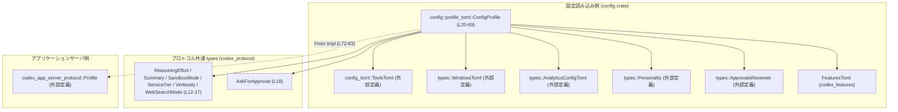
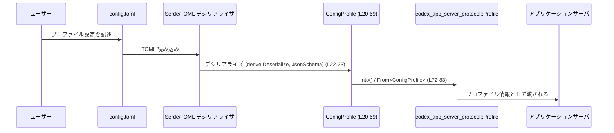

# config/src/profile_toml.rs

## 0. ざっくり一言

`config.toml` 内の「プロファイル」設定を表す `ConfigProfile` 構造体と、それをアプリケーションサーバ側の `Profile` 型へ変換するための `From` 実装を提供するモジュールです（`ConfigProfile` 定義: `profile_toml.rs:L20-69`, `impl From`: `profile_toml.rs:L72-83`）。

---

## 1. このモジュールの役割

### 1.1 概要

- このモジュールは、ユーザーが `config.toml` でまとめて指定できる一群の設定項目を `ConfigProfile` として表現します（`profile_toml.rs:L20-69`）。
- また、その一部の項目を `codex_app_server_protocol::Profile` に変換するための `From<ConfigProfile>` 実装を提供します（`profile_toml.rs:L72-83`）。

### 1.2 アーキテクチャ内での位置づけ

このファイルは「設定読み込みレイヤ」と「アプリケーションサーバプロトコルレイヤ」を橋渡しする位置づけです。



### 1.3 設計上のポイント

- **責務の分割**  
  - `ConfigProfile` は「TOML 由来の設定値のまとまり」を保持するだけのデータ構造です（`profile_toml.rs:L20-69`）。
  - 実行時に利用される `Profile` への変換は `impl From<ConfigProfile>` に切り出されています（`profile_toml.rs:L72-83`）。
- **スキーマ／バリデーション連携**  
  - `#[derive(JsonSchema)]` と `#[schemars(deny_unknown_fields)]` により、JSON Schema 生成時に未知フィールドを許可しないプロファイル定義が作られます（`profile_toml.rs:L22-23`）。
  - `features` フィールドには `#[schemars(schema_with = "crate::schema::features_schema")]` が付与されており、コメントによると「既知の feature キーをスキーマに注入し、未知キーを禁止」するようなスキーマが適用されます（コメント: `profile_toml.rs:L66-67`）。
- **シリアライズ／デシリアライズ**  
  - `Serialize` / `Deserialize` の derive により、Serde ベースで TOML/JSON などへの変換が可能です（`profile_toml.rs:L22`）。
- **安全性とエラーハンドリング**  
  - `unsafe` ブロック、`Result` 型、`panic!` 呼び出し等はなく、型システムと `Option` による「値の有無」の表現に留まります（`profile_toml.rs:L20-83` 全体）。
- **並行性**  
  - スレッドや `async` 関連の API はこのファイルには登場せず、純粋なデータ構造と単純な変換のみです（`profile_toml.rs:L1-83`）。

---

## 2. 主要な機能一覧

- `ConfigProfile` 構造体: プロファイルに関する設定値のまとまりを表す（`profile_toml.rs:L20-69`）。
- `From<ConfigProfile> for codex_app_server_protocol::Profile`: 設定プロファイルからアプリケーションサーバ用 `Profile` への変換（`profile_toml.rs:L72-83`）。

### 2.1 コンポーネントインベントリー

このファイル内で定義される主要コンポーネントの一覧です。

| 名前 | 種別 | 公開 | 役割 / 用途 | 根拠行 |
|------|------|------|-------------|--------|
| `ConfigProfile` | 構造体 | `pub` | TOML によるプロファイル設定を表現するデータ構造 | `profile_toml.rs:L20-69` |
| `impl From<ConfigProfile> for codex_app_server_protocol::Profile` | トレイト実装 | - | `ConfigProfile` をサーバプロトコルの `Profile` に変換する | `profile_toml.rs:L72-83` |

---

## 3. 公開 API と詳細解説

### 3.1 型一覧（構造体・列挙体など）

| 名前 | 種別 | フィールド概要 | 関連するトレイト / 属性 | 根拠行 |
|------|------|----------------|--------------------------|--------|
| `ConfigProfile` | 構造体 | モデル種別、サービスティア、サンドボックスモード、ツール設定、Web 検索、解析設定、Windows 向け設定、機能トグルなど多数の Optional 項目を保持 | `Debug`, `Clone`, `Default`, `PartialEq`, `Serialize`, `Deserialize`, `JsonSchema` derive / `#[schemars(deny_unknown_fields)]` | `profile_toml.rs:L20-69` |

`ConfigProfile` の主なフィールド（抜粋）と用途:

| フィールド名 | 型 | 説明 | 根拠行 |
|--------------|----|------|--------|
| `model` | `Option<String>` | 使用するモデル名 | `profile_toml.rs:L25` |
| `service_tier` | `Option<ServiceTier>` | サービスティア設定（詳細は外部型） | `profile_toml.rs:L26` |
| `model_provider` | `Option<String>` | `model_providers` マップ内のキー（`ModelProviderInfo` を指す） | `profile_toml.rs:L27-29` |
| `approval_policy` | `Option<AskForApproval>` | 承認要求ポリシー | `profile_toml.rs:L30` |
| `approvals_reviewer` | `Option<ApprovalsReviewer>` | レビュワー設定 | `profile_toml.rs:L31` |
| `sandbox_mode` | `Option<SandboxMode>` | サンドボックスのモード | `profile_toml.rs:L32` |
| `model_reasoning_effort` | `Option<ReasoningEffort>` | モデル推論の effort レベル | `profile_toml.rs:L33` |
| `plan_mode_reasoning_effort` | `Option<ReasoningEffort>` | 「plan モード」時の推論 effort | `profile_toml.rs:L34` |
| `model_reasoning_summary` | `Option<ReasoningSummary>` | 推論内容のサマリ出力設定 | `profile_toml.rs:L35` |
| `model_verbosity` | `Option<Verbosity>` | 出力の詳細度 | `profile_toml.rs:L36` |
| `model_catalog_json` | `Option<AbsolutePathBuf>` | JSON 形式のモデルカタログのパス（起動時のみ適用） | `profile_toml.rs:L37-38` |
| `personality` | `Option<Personality>` | 応答の性格/スタイル設定 | `profile_toml.rs:L39` |
| `chatgpt_base_url` | `Option<String>` | ChatGPT サービスのベース URL | `profile_toml.rs:L40` |
| `model_instructions_file` | `Option<AbsolutePathBuf>` | モデルへ渡す命令文ファイルのパス | `profile_toml.rs:L41-42` |
| `js_repl_node_path` | `Option<AbsolutePathBuf>` | JS REPL 用 Node 実行ファイルパス | `profile_toml.rs:L43` |
| `js_repl_node_module_dirs` | `Option<Vec<AbsolutePathBuf>>` | JS REPL で Node モジュールを探索するディレクトリ | `profile_toml.rs:L44-45` |
| `zsh_path` | `Option<AbsolutePathBuf>` | zsh-exec-bridge 用のパッチ済み zsh へのパス | `profile_toml.rs:L46-47` |
| `experimental_instructions_file` | `Option<AbsolutePathBuf>` | 非推奨: `model_instructions_file` を代わりに使用（スキーマ生成からは除外） | `profile_toml.rs:L48-50` |
| `experimental_compact_prompt_file` | `Option<AbsolutePathBuf>` | プロンプトに関する実験的設定ファイル | `profile_toml.rs:L51` |
| `include_apply_patch_tool` | `Option<bool>` | apply-patch ツールを含めるかどうか | `profile_toml.rs:L52` |
| `include_permissions_instructions` | `Option<bool>` | 権限説明の指示文を含めるか | `profile_toml.rs:L53` |
| `include_apps_instructions` | `Option<bool>` | アプリ関連の指示文を含めるか | `profile_toml.rs:L54` |
| `include_environment_context` | `Option<bool>` | 環境コンテキストを含めるか | `profile_toml.rs:L55` |
| `experimental_use_unified_exec_tool` | `Option<bool>` | 実験的な unified exec ツールの使用 | `profile_toml.rs:L56` |
| `experimental_use_freeform_apply_patch` | `Option<bool>` | 自由形式 apply-patch の使用 | `profile_toml.rs:L57` |
| `tools_view_image` | `Option<bool>` | 画像ビュー関連ツールの使用有無 | `profile_toml.rs:L58` |
| `tools` | `Option<ToolsToml>` | ツール群の詳細設定 | `profile_toml.rs:L59` |
| `web_search` | `Option<WebSearchMode>` | Web 検索の使用モード | `profile_toml.rs:L60` |
| `analytics` | `Option<AnalyticsConfigToml>` | 解析・トラッキング設定 | `profile_toml.rs:L61` |
| `windows` | `Option<WindowsToml>` | Windows 向け設定（`serde(default)` により省略時 `None`） | `profile_toml.rs:L62-63` |
| `features` | `Option<FeaturesToml>` | プロファイル単位の feature トグル | `profile_toml.rs:L64-68` |
| `oss_provider` | `Option<String>` | OSS 向けプロバイダ指定 | `profile_toml.rs:L69` |

> 外部型 (`ServiceTier`, `SandboxMode`, `FeaturesToml` など) の具体的な中身は、このチャンクには現れません。

### 3.2 関数詳細

#### `impl From<ConfigProfile> for codex_app_server_protocol::Profile { fn from(config_profile: ConfigProfile) -> Self }`

**概要**

`ConfigProfile` の一部のフィールドを `codex_app_server_protocol::Profile` にコピーする形で変換を行う関数です（`profile_toml.rs:L72-83`）。

**引数**

| 引数名 | 型 | 説明 | 根拠行 |
|--------|----|------|--------|
| `config_profile` | `ConfigProfile` | 変換元となる設定プロファイル。所有権をムーブして受け取る。 | `profile_toml.rs:L72-73` |

**戻り値**

- 型: `codex_app_server_protocol::Profile`（`Self` として表現）（`profile_toml.rs:L72-73`）。
- 意味: `config_profile` に含まれる一部フィールドを反映したサーバ向けプロファイルインスタンス（`profile_toml.rs:L74-81`）。

**内部処理の流れ**

コードは非常に単純で、以下のステップになります（`profile_toml.rs:L74-81`）。

1. `Self { ... }` 構文で `codex_app_server_protocol::Profile` を構築。
2. 下記フィールドについて、`config_profile` からそのままムーブして代入:
   - `model` → `model`（`profile_toml.rs:L75`）
   - `model_provider` → `model_provider`（`profile_toml.rs:L76`）
   - `approval_policy` → `approval_policy`（`profile_toml.rs:L77`）
   - `model_reasoning_effort` → `model_reasoning_effort`（`profile_toml.rs:L78`）
   - `model_reasoning_summary` → `model_reasoning_summary`（`profile_toml.rs:L79`）
   - `model_verbosity` → `model_verbosity`（`profile_toml.rs:L80`）
   - `chatgpt_base_url` → `chatgpt_base_url`（`profile_toml.rs:L81`）
3. 他のフィールド（たとえば `tools`, `analytics`, `features` など）は、この変換では渡されません（`profile_toml.rs:L74-81` から存在しないことが確認できます）。

**Examples（使用例）**

以下は、TOML から `ConfigProfile` を読み込んで `Profile` に変換する例です。  
（`toml` クレートや `codex_app_server_protocol::Profile` 型はこのファイル外で定義されています。）

```rust
use config::profile_toml::ConfigProfile;          // このファイルで定義されている型
use codex_app_server_protocol::Profile;          // 変換先の型（外部定義）

fn load_profile_from_toml(src: &str) -> Result<Profile, toml::de::Error> {
    // TOML 文字列から ConfigProfile にデシリアライズする
    let cfg: ConfigProfile = toml::from_str(src)?;  // Serde + toml による変換

    // From 実装によって自動的に Profile に変換
    let profile: Profile = cfg.into();              // cfg の所有権はここでムーブされる

    Ok(profile)
}
```

このコードでは、`cfg.into()` により `From<ConfigProfile> for Profile` が呼び出されます（`profile_toml.rs:L72-83` が根拠）。

**Errors / Panics**

- `from` 関数自体は `Result` ではなく、エラーを返しません（戻り値型が `Self` のみ: `profile_toml.rs:L72-73`）。
- 関数内に `panic!` や `unwrap`、`expect` 等は存在しません（`profile_toml.rs:L74-81`）。
- したがって、**この変換処理自体でランタイムエラーが発生することはありません**（対象フィールドは単純なムーブのみです）。

**Edge cases（エッジケース）**

- 任意のフィールドが `None` の場合  
  - そのまま `None` として `Profile` 側にコピーされます（`Option` のムーブ: `profile_toml.rs:L75-81`）。
  - `None` に対する特別な補正やデフォルト値の付与は行われません。
- `ConfigProfile` の他フィールド（例: `tools`, `features`）  
  - `From` 実装では参照しておらず（`profile_toml.rs:L74-81`）、`Profile` には反映されません。
- 所有権  
  - `config_profile` を値で受け取るため（`profile_toml.rs:L73`）、呼び出し側で同じインスタンスを `into()` 後に再利用することはできません（Rust の所有権ルールに基づくコンパイルエラーになります）。

**使用上の注意点**

- 変換後に `ConfigProfile` を使う必要がある場合は、`clone()` するか、`&ConfigProfile` を受け取る別の変換関数を用意する必要があります。`from` は所有権を消費します（`profile_toml.rs:L73`）。
- `Profile` 側で必要とされるフィールドが `From` 実装内で設定されていない場合、`Profile` のデフォルト値や後続処理に依存するため、その仕様を別途確認する必要があります（`profile_toml.rs:L74-81` に含まれないフィールドは未設定であることが根拠）。
- 並行性に関する特別な制約はこの関数にはありません。`ConfigProfile` が `Send` / `Sync` かどうかは依存フィールドの型に依存しますが、このチャンクにはその情報は現れません。

### 3.3 その他の関数

- このファイル内には、補助関数やラッパー関数は定義されていません（`profile_toml.rs:L1-83` を通覧して不在であることを確認）。

---

## 4. データフロー

ここでは、「TOML 設定 → `ConfigProfile` → `Profile` → サーバ」の典型的なデータフローを示します。



要点:

- デシリアライズは `ConfigProfile` の `Deserialize` derive に基づき、各フィールドへ値をマッピングします（`profile_toml.rs:L22, L25-69`）。
- `From<ConfigProfile>` 実装（`profile_toml.rs:L72-83`）は、このうち一部のフィールドだけを `Profile` に転送します。
- スキーマ (`JsonSchema`, `schemars`) 設定は、外部ツールや検証ステップが `config.toml` の妥当性を事前にチェックする際に利用されることが想定されますが、その実行タイミングはこのファイルからは分かりません。

---

## 5. 使い方（How to Use）

### 5.1 基本的な使用方法

`ConfigProfile` を使って TOML ベースの設定を読み込み、`Profile` に変換する典型的な流れです。

```rust
use std::fs;
use config::profile_toml::ConfigProfile;           // このファイルの型
use codex_app_server_protocol::Profile;           // 変換先（外部定義）

fn main() -> Result<(), Box<dyn std::error::Error>> {
    // 1. TOML ファイルを読み込む
    let toml_str = fs::read_to_string("config.toml")?; // ファイル I/O

    // 2. TOML から ConfigProfile へデシリアライズ
    let profile_cfg: ConfigProfile = toml::from_str(&toml_str)?; // Deserialize (L22)

    // 3. ConfigProfile から Profile へ変換
    let profile: Profile = profile_cfg.into();        // From<ConfigProfile> (L72-83)

    // 4. 変換された profile をサーバ等へ渡して利用
    // server.start_with_profile(profile);

    Ok(())
}
```

### 5.2 よくある使用パターン

1. **部分的なプロファイル指定**

   すべてのフィールドは `Option` のため、必要な項目だけ TOML に記述し、他は `None`／デフォルトに任せる使い方が想定されます（`profile_toml.rs:L25-69` で全て `Option` 型であることが根拠）。

   ```toml
   # config.toml の一部
   [profile.default]
   model = "gpt-4.1"
   model_provider = "openai"
   model_verbosity = "normal"
   ```

   ```rust
   let cfg: ConfigProfile = toml::from_str(toml_str)?; // 未指定のフィールドは None になる
   let profile: Profile = cfg.into();
   ```

2. **複数プロファイルの切り替え**

   アプリケーション側で、`ConfigProfile` を複数読み込み、ユーザー操作や環境に応じて `into()` で `Profile` を切り替える、という構造が組みやすいデザインです。  
   これは、`ConfigProfile` が単なるデータ構造であり、副作用を持たないためです（`profile_toml.rs:L20-69`）。

### 5.3 よくある間違い

**例: `into()` 後に `ConfigProfile` を再利用しようとする**

```rust
let cfg: ConfigProfile = /* ... */;

// Profile に変換（所有権をムーブ）
let profile: codex_app_server_protocol::Profile = cfg.into();

// ここで cfg を再利用しようとするとコンパイルエラー
// println!("{:?}", cfg); // エラー: move の後で値を使用している
```

正しい例（必要なら `clone()` する）:

```rust
let cfg: ConfigProfile = /* ... */;

// どうしても cfg をその後も使いたい場合は Clone する（L22: Clone derive）
let profile: codex_app_server_protocol::Profile = cfg.clone().into();

// cfg はこの後も利用可能
println!("{:?}", cfg);
```

### 5.4 使用上の注意点（まとめ）

- `ConfigProfile` はすべて `Option` フィールドで構成されているため、実際に必須とすべき項目が何かは、呼び出し側や `Profile` 側の仕様に依存します。このファイルだけでは必須性は判別できません（`profile_toml.rs:L25-69`）。
- `From<ConfigProfile>` は一部のフィールドしか渡していません。`ConfigProfile` に追加したフィールドを `Profile` にも反映させたい場合は、`impl From` の更新が必要です（`profile_toml.rs:L74-81`）。
- スキーマ (`JsonSchema`, `schemars`) で未知フィールドが禁止される設定になっているため、スキーマを使ったバリデーションを利用する場合は、`config.toml` に未定義のキーを追加するとエラーになる可能性があります（スキーマ設定: `profile_toml.rs:L22-23`）。

---

## 6. 変更の仕方（How to Modify）

### 6.1 新しい機能を追加する場合

**例: プロファイルに新しい設定項目 `max_tokens` を追加したい場合**

1. **フィールドの追加**

   `ConfigProfile` に新しいフィールドを追加します（`profile_toml.rs:L20-69` に倣う）。

   ```rust
   pub struct ConfigProfile {
       // 既存フィールド...
       pub oss_provider: Option<String>,                // 既存 (L69)
       pub max_tokens: Option<u32>,                     // 新規フィールド例
   }
   ```

2. **`From<ConfigProfile>` の更新**

   新フィールドを `Profile` にも渡す必要があれば、`Self { ... }` 初期化式にフィールドを追加します（`profile_toml.rs:L74-81` を編集）。

3. **スキーマ関連の確認**

   - `JsonSchema` の derive によって、新フィールドは自動的にスキーマに含まれます（`profile_toml.rs:L22`）。
   - `features` フィールドのスキーマは `crate::schema::features_schema` によって決まるため、feature 関連の追加の場合はそちらも確認する必要があります（`profile_toml.rs:L66-67`）。

4. **TOML との対応**

   新フィールド名に合わせて、`config.toml` 側のキーも追加します。

### 6.2 既存の機能を変更する場合

- **`From` 実装の仕様変更**

  - 例えば `model_provider` を `Profile` に渡さないようにしたい場合、`Self { ... }` から該当フィールドを削除します（`profile_toml.rs:L76`）。
  - その場合、`Profile` 側でのデフォルト動作がどうなるかを確認する必要があります（`Profile` の定義はこのチャンクには現れません）。

- **フィールド名や型の変更**

  - フィールドの型を変えると、Serde によるデシリアライズ挙動も変わるため、既存の `config.toml` との互換性が失われる可能性があります。
  - 特に `Option<T>` から `T` への変更などは、「必須項目化」になるため慎重な検討が必要です（現在は全て Optional であることが `profile_toml.rs:L25-69` から読み取れます）。

- **バグ / セキュリティ観点**

  - このファイルにはファイル I/O やネットワークアクセス、`unsafe` コードが存在せず（`profile_toml.rs:L1-83`）、直接的なセキュリティリスクは見当たりません。
  - ただし、設定値（例えば `chatgpt_base_url` や `zsh_path`）がどのように後続処理で使用されるか次第で、コマンドインジェクション等のリスクは別ファイルに存在しうるため、設定値の利用側も合わせて確認する必要があります。

---

## 7. 関連ファイル

このモジュールから参照されている外部型・モジュール一覧です（型名や use 句を根拠とします: `profile_toml.rs:L1-18, L59-68`）。

| パス / モジュール | 型 / 要素 | 役割 / 関係 | 根拠行 |
|-------------------|-----------|-------------|--------|
| `codex_utils_absolute_path::AbsolutePathBuf` | `AbsolutePathBuf` | 各種ファイルパス（モデルカタログ、指示ファイル、Node パス、zsh パスなど）の型として使用 | `profile_toml.rs:L1, L38, L42-47, L50-51` |
| `crate::config_toml::ToolsToml` | `ToolsToml` | `tools` フィールドとしてツール設定を表す | `profile_toml.rs:L6, L59` |
| `crate::types::AnalyticsConfigToml` | `AnalyticsConfigToml` | `analytics` フィールドの型 | `profile_toml.rs:L7, L61` |
| `crate::types::ApprovalsReviewer` | `ApprovalsReviewer` | `approvals_reviewer` フィールドの型 | `profile_toml.rs:L8, L31` |
| `crate::types::Personality` | `Personality` | `personality` フィールドの型 | `profile_toml.rs:L9, L39` |
| `crate::types::WindowsToml` | `WindowsToml` | Windows 向け設定（`windows` フィールド） | `profile_toml.rs:L10, L63` |
| `codex_features::FeaturesToml` | `FeaturesToml` | プロファイル単位で有効化する feature トグル群 | `profile_toml.rs:L11, L68` |
| `codex_protocol::config_types` | `ReasoningSummary`, `SandboxMode`, `ServiceTier`, `Verbosity`, `WebSearchMode` | 推論設定、サンドボックスモード、サービスティア、出力詳細度、Web 検索モードの型 | `profile_toml.rs:L12-16, L32, L35-36, L60` |
| `codex_protocol::openai_models::ReasoningEffort` | `ReasoningEffort` | 推論 effort レベルの指定に使用 | `profile_toml.rs:L17, L33-34` |
| `codex_protocol::protocol::AskForApproval` | `AskForApproval` | 承認ポリシーの指定 | `profile_toml.rs:L18, L30` |
| `codex_app_server_protocol::Profile` | `Profile` | `ConfigProfile` から変換されるサーバ側プロファイル型 | `profile_toml.rs:L72` |
| `crate::schema::features_schema` | 関数（推定） | `FeaturesToml` の JSON Schema を生成する関数として参照されている。コメントによると既知キーの注入・未知キー禁止を行う。 | `profile_toml.rs:L66-67` |

> これら外部ファイルの具体的な実装内容は、このチャンクには含まれていないため不明です。
