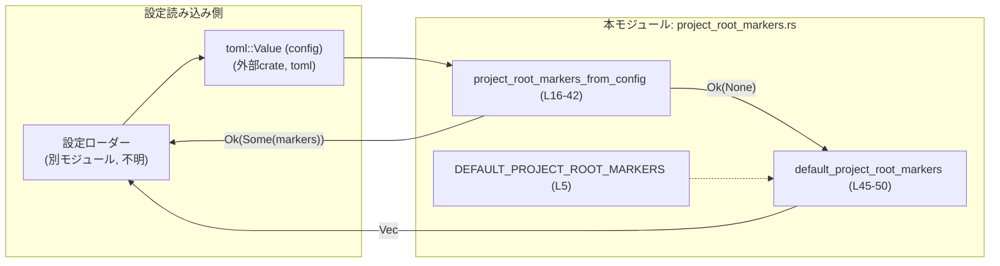
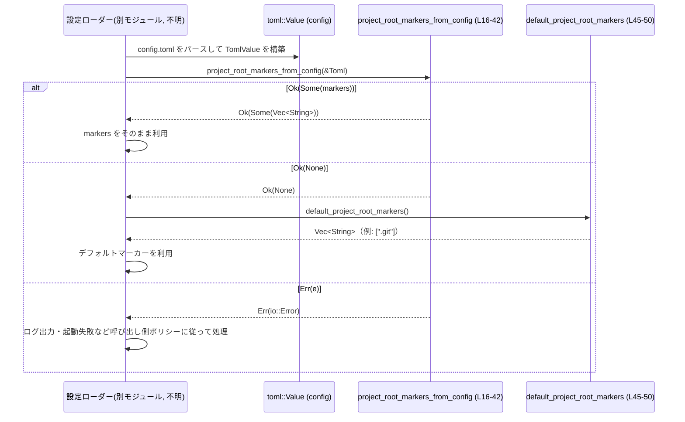

# config/src/project_root_markers.rs

## 0. ざっくり一言

`config.toml` を表す `toml::Value` から `project_root_markers` 設定を読み取り、  

- 未指定 / 型不一致 / 空配列  
といったケースを区別して扱うためのヘルパ関数と、デフォルトマーカー一覧を生成する関数を提供するモジュールです。

---

## 1. このモジュールの役割

### 1.1 概要

- このモジュールは、設定ファイル（`config.toml`）からプロジェクトルート検出に用いる「マーカー文字列の配列」を安全に取り出すために存在します（根拠: ドキュメントコメントの「root detection should be disabled」記述 `config/src/project_root_markers.rs:L7-15`）。  
- TOML の汎用値 `toml::Value` から `project_root_markers` キーを探し、妥当な配列であれば `Vec<String>` に変換し、未指定・無効な値・空配列を区別して返します（`project_root_markers_from_config` の実装 `L16-42`）。  
- また、`project_root_markers` が未指定だった場合に利用する「組み込みのデフォルトマーカー（現在は `.git` のみ）」を返す関数も提供します（`DEFAULT_PROJECT_ROOT_MARKERS` と `default_project_root_markers` `L5, L45-50`）。

### 1.2 アーキテクチャ内での位置づけ

このモジュール自身は、I/O やファイルシステムには直接触れず、純粋に「TOML 値 → Rust の型（`Option<Vec<String>>`）」への変換とバリデーションを行います。

主要な依存関係と利用イメージは次のようになります。



※ 設定ローダーや「プロジェクトルート検出処理」はこのチャンクには現れず、具体的な実装は不明です。

### 1.3 設計上のポイント

- **責務の限定**  
  - TOML の型チェックおよび `project_root_markers` の構造の検証に責務を限定しています（`as_table`, `Array` マッチング, `as_str` によるチェック `L16-24, L33-40`）。
- **明示的な不在・無効・空の区別**  
  - 未指定: `Ok(None)`  
  - 指定され、かつ配列が空: `Ok(Some(Vec::new()))`（ルート検出の無効化を示すとコメントされている `L12-13, L29-31`）  
  - 指定されているが配列/文字列でない: `Err(io::Error)`（`L23-27, L33-38`）
- **エラーハンドリング**  
  - エラーは `io::Error` として返され、`io::ErrorKind::InvalidData` で「設定値が型制約を満たさない」状態を表現します（`L24-27, L35-38`）。
- **状態を持たない純粋関数**  
  - グローバルな可変状態は持たず、引数から戻り値が決まる純粋関数として実装されています（`project_root_markers_from_config`, `default_project_root_markers` ともに外部状態を参照しない `L16-42, L45-50`）。
- **並行性**  
  - 共有可変状態がないため、同じ `TomlValue` を複数スレッドから共有参照（`&TomlValue`）する場合でも、Rust の所有権ルールにより安全に使用できます（本ファイル内に `mut static` などは存在しません）。

---

## コンポーネントインベントリー（本チャンク）

このファイル内で定義・使用されている主なコンポーネント一覧です。

| 名称 | 種別 | 公開性 | 役割 / 要約 | 定義位置 |
|------|------|--------|-------------|----------|
| `TomlValue` | 型エイリアス（インポート） | 非公開（内部使用） | 外部 crate `toml` の `toml::Value` 型の別名。設定全体を表す汎用 TOML 値として利用。 | `config/src/project_root_markers.rs:L3` |
| `DEFAULT_PROJECT_ROOT_MARKERS` | 定数 `&[&str]` | 非公開 | デフォルトのプロジェクトルートマーカー（現在は `[".git"]`）。`default_project_root_markers` からのみ利用される。 | `config/src/project_root_markers.rs:L5` |
| `project_root_markers_from_config` | 関数 | 公開 (`pub`) | `TomlValue` から `project_root_markers` を読み取り、`Option<Vec<String>>` として返す。型検証とエラーハンドリングを含むコアロジック。 | `config/src/project_root_markers.rs:L16-42` |
| `default_project_root_markers` | 関数 | 公開 (`pub`) | `DEFAULT_PROJECT_ROOT_MARKERS` から `Vec<String>` を生成して返す。未指定時のデフォルト値生成を担当。 | `config/src/project_root_markers.rs:L45-50` |

---

## 2. 主要な機能一覧

- `project_root_markers_from_config`:  
  `toml::Value` から `project_root_markers` 設定を読み取り、  
  - 未指定 → `Ok(None)`  
  - 妥当な配列 → `Ok(Some(Vec<String>))`  
  - 型不整合 → `Err(io::Error)`  
  として返すバリデーション関数です（`L16-42`）。

- `default_project_root_markers`:  
  組み込みのデフォルトマーカー（現在は `.git`）の `Vec<String>` を生成して返す関数です（`L5, L45-50`）。

---

## 3. 公開 API と詳細解説

### 3.1 型一覧（構造体・列挙体など）

このモジュールは、新しい公開構造体や列挙体は定義していません。

外部から直接使う主な型は、関数シグネチャに現れる次のものです。

| 型名 | 出典 | 用途 |
|------|------|------|
| `toml::Value`（`TomlValue`） | 外部 crate `toml` | マージ済み `config.toml` 全体を表す汎用 TOML 値（`&TomlValue` として受け取る） |
| `io::Result<T>` | `std::io` | 設定値の不正などを `io::Error` として返すための結果型 |
| `Option<Vec<String>>` | 標準ライブラリ | `project_root_markers` の存在／不在を区別するための型 |

### 3.2 関数詳細

#### `project_root_markers_from_config(config: &TomlValue) -> io::Result<Option<Vec<String>>>`

**概要**

- マージ済みの `config.toml` を表す `toml::Value` から `project_root_markers` キーを探し、  
  妥当な場合は `Vec<String>` として返します（`L16-42`）。
- 未指定の場合は `Ok(None)`、空配列は `Ok(Some(Vec::new()))`（root detection の無効化）、  
  型不整合（配列でない・配列要素が文字列でない）は `Err(io::Error)` になります。

**引数**

| 引数名 | 型 | 説明 |
|--------|----|------|
| `config` | `&TomlValue` | マージ済み `config.toml` を表す TOML 値全体。呼び出し側で構築済みの参照を受け取ります（`L16`）。 |

**戻り値**

- `io::Result<Option<Vec<String>>>`  
  - `Ok(None)`  
    - `config` がテーブルでない、または `project_root_markers` キー自体が存在しない場合（`L16-22`）。  
  - `Ok(Some(markers))`  
    - キーが存在し、配列かつ要素がすべて文字列の場合（`L23-42`）。  
    - 配列が空の場合は `markers` は空 `Vec`（`L29-31`）。  
  - `Err(io::Error)`  
    - `project_root_markers` が配列でない、または配列要素のいずれかが文字列でない場合（`L23-27, L33-38`）。  
    - エラー種別は `io::ErrorKind::InvalidData` です（`L25, L36`）。

**内部処理の流れ（アルゴリズム）**

1. `config` をテーブルとして解釈可能か確認し、テーブルでなければ `Ok(None)` を返す（`as_table` を利用 `L16-19`）。
2. テーブルから `"project_root_markers"` キーを取得できない場合も `Ok(None)` を返す（`L20-22`）。
3. キーが存在する場合、その値が `TomlValue::Array` かどうかをパターンマッチで判定する（`L23`）。  
   - 配列でなければ `Err(io::ErrorKind::InvalidData, "...must be an array of strings")` を返す（`L24-27`）。
4. 配列が空であれば、`Ok(Some(Vec::new()))` を返す（`L29-31`）。  
   コメント上、この「空配列」は「ルート検出を無効化する」という意味を持ちます（`L12-13`）。
5. 配列が非空の場合、各要素を走査するループに入り、`entry.as_str()` で文字列かどうかを検査する（`L32-35`）。  
   - 文字列でない要素が一つでもあれば、同じメッセージの `InvalidData` エラーとして `Err` を返す（`L35-38`）。
   - すべて文字列であれば `marker.to_string()` で `String` に変換して `markers` ベクタに push する（`L40`）。
6. すべての要素の検証と変換が終わったら、`Ok(Some(markers))` を返す（`L42`）。

**内部処理簡易フローチャート**

```mermaid
flowchart TD
    A["呼び出し\nproject_root_markers_from_config (L16-42)"] --> B{"config.as_table() ?"}
    B -->|None| R1["Ok(None) (L18-19)"]
    B -->|Some(table)| C{"table.get(\"project_root_markers\") ? (L20-21)"}
    C -->|None| R2["Ok(None) (L21-22)"]
    C -->|Some(value)| D{"value is Array? (L23)"}
    D -->|No| E["Err(InvalidData) (L24-27)"]
    D -->|Yes: entries| F{"entries.is_empty()? (L29)"}
    F -->|Yes| R3["Ok(Some(Vec::new())) (L29-31)"]
    F -->|No| G["for entry in entries (L33)"]
    G --> H{"entry.as_str()? (L34)"}
    H -->|None| E2["Err(InvalidData) (L35-38)"]
    H -->|Some(marker)| I["markers.push(marker.to_string()) (L40)"]
    I --> G
    G -->|ループ完了| R4["Ok(Some(markers)) (L42)"]
```

**Examples（使用例）**

※ サンプルコードでは一般的な `toml` crate の使い方を想定しています。

1. **設定でマーカーを明示的に指定する**

```rust
use std::io;
use toml::Value as TomlValue;
use std::fs;

// 仮の config.toml 内容:
// [project]
// project_root_markers = [".git", ".hg"]

fn load_markers_from_file(path: &str) -> io::Result<Vec<String>> {
    // ファイルを文字列として読み込む
    let content = fs::read_to_string(path)?; // I/O エラーはそのまま伝播

    // TOML をパースして TomlValue を得る
    let config: TomlValue = content.parse().expect("TOML parse failed");

    // project_root_markers_from_config を呼ぶ
    match project_root_markers_from_config(&config)? {
        Some(markers) => Ok(markers),           // 設定値をそのまま利用
        None => Ok(default_project_root_markers()), // 未指定の場合はデフォルトにフォールバック
    }
}
```

1. **空配列でルート検出を無効化する**

```rust
use toml::Value as TomlValue;

fn markers_or_disabled(config: &TomlValue) -> io::Result<Option<Vec<String>>> {
    // 設定値を読み取る
    let result = project_root_markers_from_config(config)?; // 型不整合はここで Err

    // result:
    // - None: project_root_markers 未指定（呼び出し側のポリシー次第でデフォルト使用など）
    // - Some(vec) かつ vec.is_empty(): ルート検出を無効化するサイン
    // - Some(vec) かつ !vec.is_empty(): カスタムマーカーを利用
    Ok(result)
}
```

1. **エラーケース（配列・文字列以外が混じっている）**

```rust
use toml::Value as TomlValue;
use std::io;

fn try_read_invalid(config: &TomlValue) {
    match project_root_markers_from_config(config) {
        Ok(_) => println!("markers 読み取り成功"),
        Err(e) if e.kind() == io::ErrorKind::InvalidData => {
            eprintln!("project_root_markers の型が不正です: {e}");
        }
        Err(e) => {
            eprintln!("その他の I/O エラー: {e}");
        }
    }
}
```

**Errors / Panics**

- **Errors**
  - `io::ErrorKind::InvalidData`  
    - `project_root_markers` が配列 (`Array`) ではない場合（`L23-27`）。  
    - `project_root_markers` が配列だが、その要素のいずれかが文字列以外の場合（`L33-38`）。  
  - それ以外の `io::Error` はこの関数内からは返されません（`io::Error::new` のみを使用）。
- **Panics**
  - 明示的な `panic!` 呼び出しはなく、添字アクセス等も行っていないため、通常の使用においてパニック要因は見当たりません。

**Edge cases（エッジケース）**

- `config` がテーブルでない（例: ルートが配列や文字列）  
  → 早期に `Ok(None)` を返し、`project_root_markers` は「未指定」と同様に扱われます（`L16-19`）。
- テーブルだが `"project_root_markers"` キーが存在しない  
  → `Ok(None)`（`L20-22`）。
- `"project_root_markers"` の値が配列でない（例: 文字列や整数）  
  → `Err(io::ErrorKind::InvalidData)`（`L23-27`）。
- `"project_root_markers"` が空配列 `[]`  
  → `Ok(Some(Vec::new()))`（`L29-31`）。  
    コメント上、この状態は「ルート検出を無効化する」ことを示すものとされています（`L12-13`）。
- 配列内に文字列以外の値が含まれる（例: `[ ".git", 123 ]`）  
  → 最初に検出された非文字列要素で `Err(io::ErrorKind::InvalidData)`（`L33-38`）。
- 非 UTF-8 など、より低レベルの問題はこの関数以前の TOML パース時に処理されるため、本関数では扱われません（このチャンクには TOML パース処理は現れません）。

**使用上の注意点**

- `None` と `Some(Vec::new())` の意味の違い
  - `None`: 設定自体が存在しない（呼び出し側ポリシーでデフォルトを用いるかどうかを判断する必要があります）。  
  - `Some(Vec::new())`: ユーザーが明示的に「空配列」を指定しており、コメント上は「ルート検出の無効化」を意図していると解釈できます（`L12-13`）。
- 文字列の内容は検証しない
  - この関数は「文字列であるかどうか」だけを検証し、その中身（空文字列・先頭のドット有無など）は検証しません（`L33-40`）。  
    文字列の意味づけは上位レイヤーで行う必要があります。
- エラーメッセージ
  - 配列でない場合と、配列内要素が文字列でない場合で同じメッセージ  
    `"project_root_markers must be an array of strings"` が使われているため（`L26-27, L37-38`）、ログ上ではどちらのケースかを区別できません。必要なら上位で追加情報を付加する必要があります。
- 並行性
  - `&TomlValue` のイミュータブル参照しか扱わず、グローバル可変状態を持たないため、複数スレッドから同一 `config` を参照してこの関数を呼び出しても Rust の型システムにより安全に扱えます。

---

#### `default_project_root_markers() -> Vec<String>`

**概要**

- 埋め込み定数 `DEFAULT_PROJECT_ROOT_MARKERS`（現在は `[".git"]`）から `Vec<String>` を生成して返します（`L5, L45-50`）。
- `project_root_markers` が未指定 (`Ok(None)`) のときなどにフォールバックとして利用されることを想定した関数です（呼び出し側の実装はこのチャンクには現れません）。

**引数**

- 引数はありません。

**戻り値**

- `Vec<String>`  
  - 現在の実装では要素 `".git".to_string()` を 1 件だけ持つ `Vec` が返ります（`L5, L46-49`）。

**内部処理の流れ**

1. `DEFAULT_PROJECT_ROOT_MARKERS`（型 `&[&str]`）を `.iter()` で走査する（`L46-47`）。
2. 各 `&str` 要素に対して `ToString::to_string` を呼び出し、`String` に変換する（`L48`）。
3. それらを `collect()` により `Vec<String>` にまとめて返す（`L49`）。

**Examples（使用例）**

1. **未指定時のフォールバックとして使う**

```rust
use std::io;
use toml::Value as TomlValue;

fn effective_markers(config: &TomlValue) -> io::Result<Vec<String>> {
    match project_root_markers_from_config(config)? {
        Some(markers) => Ok(markers),                 // 設定値がある場合
        None => Ok(default_project_root_markers()),   // 未指定ならデフォルト
    }
}
```

**Errors / Panics**

- **Errors**  
  - `Result` 型を返さないため、ここで `Err` が返ることはありません。  
- **Panics**  
  - 通常の `Vec` の生成と `String` 化のみであり、明示的な `panic!` 呼び出しはありません。  
  - メモリ確保に失敗した場合など、極端な状況を除けばパニック要因はありません。

**Edge cases**

- 現状、`DEFAULT_PROJECT_ROOT_MARKERS` が `[".git"]` のみであり（`L5`）、そのまま `[".git".to_string()]` が返ります。  
- 定数側に要素が追加されても、この関数は自動的にそれらを含んだ `Vec<String>` を返します（`iter().map().collect()` という汎用実装 `L46-49`）。

**使用上の注意点**

- この関数は「未指定時のデフォルト」を提供するだけであり、「空配列を指定してルート検出を無効化する」ケース（`Some(Vec::new())`）には関与しません。  
- 呼び出し側は `project_root_markers_from_config` の戻り値を見て、`None` と `Some(Vec::new())` を区別したうえで、この関数を使うかどうかを判断する必要があります。

### 3.3 その他の関数

- 本ファイル内には、上記 2 つ以外の関数は定義されていません。

---

## 4. データフロー

ここでは、「設定ファイルから効果的なプロジェクトルートマーカー一覧を得る」という典型シナリオのデータフローを説明します。  

具体的な設定ローダーやルート検出ロジックはこのチャンクには現れないため、概念的な呼び出し関係のみを示します。



要点:

- `TomlValue` の構築（ファイル読み込み・パース）は本モジュールの外で行われます（このチャンクには現れません）。  
- `project_root_markers_from_config` は「設定の存在・型の妥当性・空配列」を判定し、`Option<Vec<String>>` で結果を返します。  
- 未指定時のみ `default_project_root_markers` の結果にフォールバックするのが自然な使用パターンです。  
- 空配列（`Some(Vec::new())`）の場合はフォールバックせず、「検出を無効化する」といった上位ポリシーで扱う必要があります（コメントより）。

---

## 5. 使い方（How to Use）

### 5.1 基本的な使用方法

次の例は、`config.toml` から設定を読み込み、効果的なマーカー一覧を得る典型的なコードフローです。

```rust
use std::fs;
use std::io;
use toml::Value as TomlValue;

// 本モジュールの関数
use crate::project_root_markers::{
    project_root_markers_from_config,
    default_project_root_markers,
};

fn load_effective_markers(config_path: &str) -> io::Result<Vec<String>> {
    // 1. 設定ファイルを文字列として読み込む
    let content = fs::read_to_string(config_path)?; // 読み込み失敗時は Err をそのまま返す

    // 2. TOML をパースして TomlValue を得る
    let config: TomlValue = content
        .parse()
        .map_err(|e| io::Error::new(io::ErrorKind::InvalidData, e.to_string()))?;

    // 3. project_root_markers を取得
    match project_root_markers_from_config(&config)? {
        Some(markers) => Ok(markers),               // 設定されていればそれを利用
        None => Ok(default_project_root_markers()), // 未指定ならデフォルトを利用
    }
}
```

### 5.2 よくある使用パターン

1. **デフォルト優先、必要なときだけ上書き**

```rust
fn markers_with_default(config: &TomlValue) -> io::Result<Vec<String>> {
    Ok(match project_root_markers_from_config(config)? {
        Some(markers) => markers,                 // 明示設定を優先
        None => default_project_root_markers(),   // 明示設定がなければデフォルト
    })
}
```

1. **空配列を検出無効のシグナルとして扱う**

```rust
fn markers_or_disabled(config: &TomlValue) -> io::Result<Option<Vec<String>>> {
    match project_root_markers_from_config(config)? {
        Some(markers) if markers.is_empty() => Ok(None), // None を「無効」として扱う
        Some(markers) => Ok(Some(markers)),              // カスタムマーカー
        None => Ok(Some(default_project_root_markers())),// 未指定 → デフォルト
    }
}
```

1. **設定のバリデーション専用に使う**

```rust
use std::io;

fn validate_markers_section(config: &TomlValue) -> io::Result<()> {
    // 戻り値は捨てて、エラーが出ないことだけを確認
    match project_root_markers_from_config(config) {
        Ok(_) => Ok(()),
        Err(e) => Err(e), // エラーがあれば呼び出し元でまとめて報告
    }
}
```

### 5.3 よくある間違い

```rust
// 間違い例: 空配列を「デフォルト扱い」としてしまう
fn wrong_handling(config: &TomlValue) -> io::Result<Vec<String>> {
    let markers = project_root_markers_from_config(config)?
        .unwrap_or_else(default_project_root_markers); // ← 空配列もデフォルトで上書きされてしまう
    Ok(markers)
}

// 正しい例: None と Some(Vec::new()) を区別する
fn correct_handling(config: &TomlValue) -> io::Result<Vec<String>> {
    match project_root_markers_from_config(config)? {
        Some(markers) => Ok(markers),               // 空配列は「無効化」などポリシーに沿って扱う
        None => Ok(default_project_root_markers()), // 未指定時のみデフォルトを適用
    }
}
```

```rust
// 間違い例: TOML 側で数値を混ぜてしまう (config.toml の例)
//
// project_root_markers = [".git", 123]  // 123 が数値
//
// → project_root_markers_from_config は Err(InvalidData) を返す
```

### 5.4 使用上の注意点（まとめ）

- `None` と `Some(Vec::new())` を区別すること（仕様上意味が異なります）。  
- エラーはすべて `io::ErrorKind::InvalidData` として返るため、呼び出し側で「設定ファイルが不正」という扱いをまとめて行うのが自然です。  
- このモジュールはパス存在確認やファイルシステムアクセスを行わないため、マーカー文字列自体の妥当性チェック（例えば空文字かどうか）は上位層で行う必要があります。  
- 並行な呼び出しは安全ですが、`TomlValue` の所有権/借用（`&TomlValue`）の扱いは呼び出し側の設計に従います。

---

## 6. 変更の仕方（How to Modify）

### 6.1 新しい機能を追加する場合

例: `project_root_markers` を配列だけでなく、単一の文字列 `"project_root_markers = '.git'"` も受け付けたい場合。

1. **型判定部分に分岐を追加する**
   - 現在は `TomlValue::Array(entries)` にしかマッチしていません（`L23`）。  
   - ここに `TomlValue::String(s)` のケースを追加し、`vec![s.clone()]` のように変換するのが自然です。
2. **エラー条件の更新**
   - エラーメッセージ `"project_root_markers must be an array of strings"` （`L26-27, L37-38`）は、  
     新しい仕様に合わせて更新する必要があります。
3. **コメント（Invariants）の更新**
   - 関数冒頭のドキュメントコメント（`L7-15`）に、新しい許容フォーマットを反映させます。
4. **呼び出し側の期待値確認**
   - `None` / `Some(Vec::new())` / `Some(non-empty)` それぞれの意味づけは、  
     外部コードとの「契約」の一部になっている可能性があります。仕様変更時は呼び出し側の挙動を確認する必要があります。

### 6.2 既存の機能を変更する場合

- **`None` の意味を変えない**
  - 現状、`None` は「設定が存在しない」ケースに限定されています（`L16-22`）。  
    ここを変更すると、フォールバックロジック全体に影響します。
- **`Some(Vec::new())` の意味を維持する**
  - コメント上、「空配列は検出の無効化を示す」とされているため（`L12-13`）、  
    これを別の意味（例えば「デフォルトと同等」）に変更する場合は、仕様変更として十分な検討が必要です。
- **エラー種別 (`InvalidData`) を維持する**
  - 設定ファイルのバリデーションエラーを検出する上位レイヤーが `InvalidData` を前提にしている可能性があります。  
    種別を変える場合は、エラーハンドリング全体を見直す必要があります。
- **テストや使用箇所の再確認**
  - このチャンクにはテストコードは現れませんが、別ファイルにテストや呼び出し箇所が存在するはずです（詳細は不明）。  
    変更後はそれらを実行し、挙動が期待通りかを確認することが望ましいです。

---

## 7. 関連ファイル

このチャンクには他ファイルへの明示的な参照はなく、以下の情報以外は不明です。

| パス / コンポーネント | 役割 / 関係 |
|-----------------------|------------|
| `toml::Value`（外部 crate） | `use toml::Value as TomlValue;` により利用される TOML 値型。`config.toml` の抽象表現として本モジュールに渡されます（`L3`）。 |
| `std::io` | エラーを `io::Result` / `io::Error` として表現するために利用されます（`L1, L16, L24-27, L35-38`）。 |
| `config/src/project_root_markers.rs` 以外のプロジェクトファイル | このモジュールの呼び出し元やルート検出ロジック、テストコードなどは存在すると推測できますが、このチャンクには現れないため詳細は不明です。 |

---

## Bugs / Security / テスト / パフォーマンス（簡潔なまとめ）

- **既知のバグ**:  
  - このチャンクから見える範囲では、明確なバグは確認できません。
- **セキュリティ観点**:  
  - 入力は TOML 設定であり、ここでは文字列リストへの変換のみを行うため、直接的なセキュリティリスク（任意コード実行など）は見当たりません。  
  - 設定値の内容（長大な文字列や特殊文字を含むパス）については上位レイヤーでの対処が必要です。
- **テスト**:  
  - このファイル内にテストコード（`#[test]`）は存在しません。  
    典型的には、以下のケースをカバーするテストが別ファイルにあることが望ましいです（実在するかは不明）：  
    - 未指定 → `Ok(None)`  
    - 空配列 → `Ok(Some(Vec::new()))`  
    - 文字列配列 → `Ok(Some(vec![".git", ...]))`  
    - 配列以外/非文字列 → `Err(InvalidData)`  
- **パフォーマンス / スケーラビリティ**:  
  - 配列要素数に対して線形時間・線形メモリで動作する単純な処理であり、通常の設定サイズではボトルネックになる可能性は低いです。  
  - `default_project_root_markers` は呼び出し毎に小さな `Vec<String>` を生成しますが、要素数が少ないためオーバーヘッドは軽微です。
