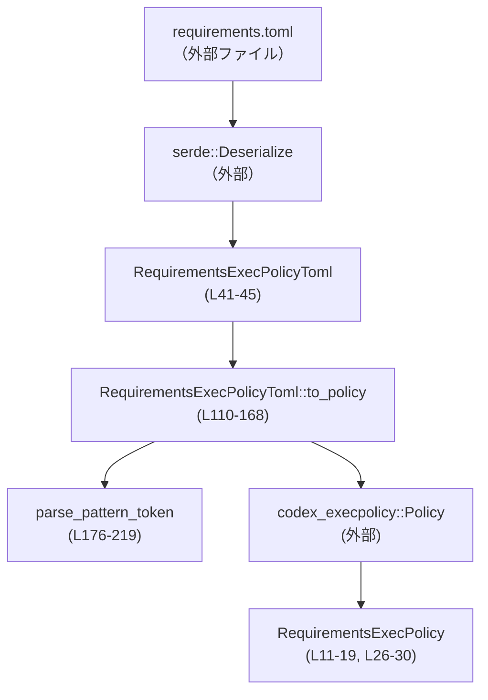
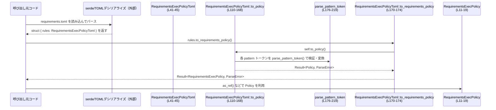

config/src/requirements_exec_policy.rs

---

## 0. ざっくり一言

`requirements.toml` の `[rules]` セクションから、`codex_execpolicy` クレートの `Policy` / `Rule` 群を生成し、実行ポリシー (`RequirementsExecPolicy`) として扱うための変換ロジックと、対応する TOML 表現・エラー型を定義するモジュールです。

---

## 1. このモジュールの役割

### 1.1 概要

- このモジュールは **requirements.toml のルール定義を安全にパースし、内部の exec-policy 表現に変換する** ために存在します。
- 具体的には、TOML から `RequirementsExecPolicyToml` にデシリアライズし、それを `Policy`（`codex_execpolicy`）へ変換する `to_policy` を提供します（`requirements_exec_policy.rs:L41-45, L107-168`）。
- 変換時には入力の妥当性を検証し、詳細なエラー情報を `RequirementsExecPolicyParseError` として返します（`L79-106`）。
- さらに、`Policy` をラップした `RequirementsExecPolicy` 型と、その等価性判定・参照取得 API も定義しています（`L11-30`）。

### 1.2 アーキテクチャ内での位置づけ

`requirements.toml` → TOML 構造体 → 内部ポリシー → ラッパー型、という流れでデータが変換されます。



- `RequirementsExecPolicyToml` は、serde による TOML デシリアライズの受け皿です（`L41-45`）。
- `to_policy` が、TOML 表現を内部の `Policy` に変換します（`L110-168`）。
- `parse_pattern_token` は、個々のパターントークン（`token` / `any_of`）を `PatternToken` に変換する補助関数です（`L176-219`）。
- 最後に `RequirementsExecPolicy` が `Policy` をラップし、等価性や参照取得の API を提供します（`L11-30`）。

### 1.3 設計上のポイント

- **ラッパー型による抽象化**  
  - `RequirementsExecPolicy` は `Policy` を隠蔽しつつ、`AsRef<Policy>` を実装して必要に応じて内部へアクセスできる構造になっています（`L11-14, L26-30`）。
- **等価性の定義**  
  - `RequirementsExecPolicy` の `PartialEq` は `policy_fingerprint` という関数を通じて、ルール群を文字列リストに変換して比較します（`L20-23, L31-40`）。  
    これにより、ルールの順序に依存しない等価判定を行っています（`entries.sort()` によりソート、`L38`）。
- **詳細なパースエラー情報**  
  - `RequirementsExecPolicyParseError` が、どのルール／どのパターントークンで何が問題だったのかを保持します（`rule_index`, `token_index`, `reason` など、`L79-105`）。
- **TOML ↔ 実行ポリシーの責務分離**
  - TOML 用の型（`RequirementsExecPolicy*Toml`）と、実行時ポリシー（`Policy`, `RequirementsExecPolicy`）が明確に分離されています。
- **所有権と並行性**
  - `Arc<[PatternToken]>` や `Arc<String>` を使用しており、生成されたルールは読み取り専用で共有しやすい構造になっています（`L152-159`）。
  - このモジュール内ではスレッド生成や `unsafe` は使用されていません。

---

## 2. コンポーネントと機能

### 2.1 コンポーネント一覧（型・関数インベントリ）

| 名前 | 種別 | 公開範囲 | 役割 / 用途 | 定義位置 |
|------|------|----------|-------------|----------|
| `RequirementsExecPolicy` | 構造体 | `pub` | `Policy` をラップし、等価性と `AsRef<Policy>` を提供 | `requirements_exec_policy.rs:L11-14` |
| `RequirementsExecPolicy::new` | 関数（メソッド） | `pub` | 既存の `Policy` からラッパーを生成 | `L15-19` |
| `RequirementsExecPolicy` の `PartialEq::eq` | メソッド | 公開（トレイト） | 2 つの `RequirementsExecPolicy` の規則集合が等しいか判定 | `L20-23` |
| `RequirementsExecPolicy` の `AsRef<Policy>::as_ref` | メソッド | 公開（トレイト） | 内部の `Policy` への参照を取得 | `L26-29` |
| `policy_fingerprint` | 関数 | private | `Policy` を文字列の一覧に変換し、等価性判定に使用 | `L31-40` |
| `RequirementsExecPolicyToml` | 構造体 | `pub` | `[rules]` セクションの TOML 表現（`prefix_rules` を保持） | `L41-45` |
| `RequirementsExecPolicyPrefixRuleToml` | 構造体 | `pub` | 1 件の `prefix_rule(...)` の TOML 表現。`pattern`, `decision`, `justification` を保持 | `L48-53` |
| `RequirementsExecPolicyPatternTokenToml` | 構造体 | `pub` | パターンの 1 トークンを表現。`token` または `any_of` を保持 | `L58-62` |
| `RequirementsExecPolicyDecisionToml` | 列挙体 | `pub` | TOML 上の決定値（`allow` / `prompt` / `forbidden`） | `L63-69` |
| `RequirementsExecPolicyDecisionToml::as_decision` | メソッド | private | TOML 決定値を `Decision`（execpolicy）へ変換 | `L70-77` |
| `RequirementsExecPolicyParseError` | 列挙体 | `pub` | requirements.toml のルール変換時に発生しうるエラーの種類 | `L79-106` |
| `RequirementsExecPolicyToml::to_policy` | メソッド | `pub` | TOML ルールを `Policy` に変換 | `L110-168` |
| `RequirementsExecPolicyToml::to_requirements_policy` | メソッド | `pub(crate)` | `Policy` へ変換後、`RequirementsExecPolicy` へラップ | `L170-174` |
| `parse_pattern_token` | 関数 | private | `RequirementsExecPolicyPatternTokenToml` を `PatternToken` へ変換 | `L176-219` |

### 2.2 主要な機能一覧

- TOML ルール定義の表現: `RequirementsExecPolicyToml` とその下位構造体により、requirements.toml の `[rules]` を表現します（`L41-62`）。
- TOML 決定値のマッピング: `RequirementsExecPolicyDecisionToml` → `Decision` への変換（`L63-77`）。
- パターン定義の検証と変換: `parse_pattern_token` および `to_policy` により、`token` / `any_of` の組み合わせ妥当性をチェックしつつ `PatternToken` に変換します（`L176-219`, `L128-133`）。
- ポリシー構築: `RequirementsExecPolicyToml::to_policy` で `MultiMap<String, RuleRef>` を構築し、`Policy::new` によって内部ポリシーを生成します（`L115-167`）。
- ラッパー型の提供: `RequirementsExecPolicy` が `Policy` のラッパーとして、等価性判定と `AsRef<Policy>` を提供します（`L11-30`）。
- パースエラーの詳細報告: `RequirementsExecPolicyParseError` により、どのルール・どのトークンが問題だったかを詳細に返します（`L79-106`）。

---

## 3. 公開 API と詳細解説

### 3.1 型一覧（構造体・列挙体など）

| 名前 | 種別 | 役割 / 用途 | 主なフィールド | 定義位置 |
|------|------|-------------|----------------|----------|
| `RequirementsExecPolicy` | 構造体 | `Policy` をラップし、等価性や参照 API を提供 | `policy: Policy` | `L11-14` |
| `RequirementsExecPolicyToml` | 構造体 | `[rules]` 内の TOML 表現 | `prefix_rules: Vec<RequirementsExecPolicyPrefixRuleToml>` | `L41-45` |
| `RequirementsExecPolicyPrefixRuleToml` | 構造体 | Starlark の `prefix_rule(...)` の TOML 版 | `pattern: Vec<RequirementsExecPolicyPatternTokenToml>`, `decision: Option<RequirementsExecPolicyDecisionToml>`, `justification: Option<String>` | `L48-53` |
| `RequirementsExecPolicyPatternTokenToml` | 構造体 | パターンの 1 トークン。単一か複数候補かを表現 | `token: Option<String>`, `any_of: Option<Vec<String>>` | `L58-62` |
| `RequirementsExecPolicyDecisionToml` | 列挙体 | TOML 表現上の決定値 | `Allow`, `Prompt`, `Forbidden` | `L63-69` |
| `RequirementsExecPolicyParseError` | 列挙体 | TOML から `Policy` への変換時のエラー | `EmptyPrefixRules`, `EmptyPattern`, `InvalidPatternToken { .. }`, `EmptyJustification { .. }`, `MissingDecision { .. }`, `AllowDecisionNotAllowed { .. }` | `L79-106` |

### 3.2 関数詳細（主要 7 件）

#### RequirementsExecPolicy::new(policy: Policy) -> RequirementsExecPolicy

**定義位置**: `requirements_exec_policy.rs:L15-19`

**概要**

- 既存の `Policy` インスタンスを受け取り、それを内部に保持する `RequirementsExecPolicy` を構築します。

**引数**

| 引数名 | 型 | 説明 |
|--------|----|------|
| `policy` | `Policy` | `codex_execpolicy` クレートのポリシーオブジェクト |

**戻り値**

- `RequirementsExecPolicy`  
  引数の `policy` をそのまま内部フィールドに格納したラッパーです。

**内部処理の流れ**

1. 構造体リテラル `Self { policy }` でフィールドに代入するだけです（`L17`）。

**Examples（使用例）**

```rust
// 既にどこかで Policy を構築済みとする
fn wrap_policy(policy: Policy) -> RequirementsExecPolicy {
    // Policy の所有権を RequirementsExecPolicy に移す
    RequirementsExecPolicy::new(policy)
}
```

**Errors / Panics**

- エラーも panic も発生しません（単純なフィールド代入のみ、`L17`）。

**Edge cases（エッジケース）**

- `policy` が空（ルールなし）であっても、そのままラップされます。妥当性チェックは行いません。

**使用上の注意点**

- 等価性判定やシリアライズなどは内部の `Policy` の実装に依存します。この関数はそれらには関与しません。

---

#### RequirementsExecPolicy の PartialEq::eq(&self, other: &Self) -> bool

**定義位置**: `requirements_exec_policy.rs:L20-23`  
（内部で `policy_fingerprint` を使用: `L31-40`）

**概要**

- 2 つの `RequirementsExecPolicy` が同じルール集合を持つかどうかを、`policy_fingerprint` による文字列リスト比較で判定します。

**引数**

| 引数名 | 型 | 説明 |
|--------|----|------|
| `self` | `&RequirementsExecPolicy` | 左辺 |
| `other` | `&RequirementsExecPolicy` | 右辺 |

**戻り値**

- `bool` – ルールの fingerprint が等しければ `true`、そうでなければ `false`。

**内部処理の流れ**

1. `policy_fingerprint(&self.policy)` と `policy_fingerprint(&other.policy)` をそれぞれ計算します（`L22`）。
2. 2 つの `Vec<String>` の等価性を比較して結果を返します。

`policy_fingerprint(policy: &Policy)` の処理（`L31-40`）:

1. 空の `Vec<String>` を生成（`L32`）。
2. `policy.rules().iter_all()` で `program` ごとのルール列挙を取得（`L33`）。
3. 各 `(program, rule)` について `format!("{program}:{rule:?}")` を `entries` に push（`L35`）。
4. `entries.sort()` で辞書順ソート（`L38`）。
5. ソート済みベクタを返す（`L39`）。

**Examples（使用例）**

```rust
fn policies_equal(p1: Policy, p2: Policy) -> bool {
    let r1 = RequirementsExecPolicy::new(p1);
    let r2 = RequirementsExecPolicy::new(p2);
    r1 == r2  // `policy_fingerprint` に基づいて比較される
}
```

**Errors / Panics**

- ここからはエラーを返しません。
- `policy.rules().iter_all()` や `format!` が panic する条件はコードからは読み取れません（外部実装です）。

**Edge cases**

- 同じルール集合でも、追加順序が異なる場合:  
  `entries.sort()` により順序差は吸収され、等しいと判定されます（`L38`）。
- `Policy` にルール以外の状態がある場合:  
  fingerprint は `policy.rules()` の内容のみから計算されるため、それ以外の状態差は無視されます（`L33-35`）。  
  これはコード上の *事実* ですが、それが意図かどうかはコードからは分かりません。

**使用上の注意点**

- `RequirementsExecPolicy` の等価性は `Policy` の持つ「ルールの Debug 表現」に依存します（`format!("{rule:?}")`, `L35`）。  
  `Rule` の `Debug` 実装が変わると等価判定結果に影響しうる点に注意が必要です。

---

#### RequirementsExecPolicy の AsRef<Policy>::as_ref(&self) -> &Policy

**定義位置**: `requirements_exec_policy.rs:L26-29`

**概要**

- 内部に保持している `Policy` への不変参照を返します。

**引数**

| 引数名 | 型 | 説明 |
|--------|----|------|
| `self` | `&RequirementsExecPolicy` | ポリシーラッパー |

**戻り値**

- `&Policy` – 内部フィールド `policy` への参照。

**内部処理の流れ**

1. そのまま `&self.policy` を返します（`L28`）。

**Examples（使用例）**

```rust
fn use_raw_policy(wrapper: &RequirementsExecPolicy) {
    let policy: &Policy = wrapper.as_ref(); // &Policy を取得
    // policy を exec-engine などに渡すことができる
}
```

**Errors / Panics**

- エラーや panic は発生しません。

**Edge cases**

- 返されるのは共有参照 (`&Policy`) であり、変更はできません（`mut` ではない）。

**使用上の注意点**

- `Policy` が巨大な場合でも、参照のみを返すためコストは一定です。
- `AsRef<Policy>` トレイトを使うコードから、型を抽象化して受け取ることができます。

---

#### RequirementsExecPolicyDecisionToml::as_decision(self) -> Decision

**定義位置**: `requirements_exec_policy.rs:L70-77`

**概要**

- TOML からデシリアライズされた `RequirementsExecPolicyDecisionToml` を、内部の `codex_execpolicy::Decision` に変換します。

**引数**

| 引数名 | 型 | 説明 |
|--------|----|------|
| `self` | `RequirementsExecPolicyDecisionToml` | TOML 上の決定値 |

**戻り値**

- `Decision` – 対応する内部の決定値。

**内部処理の流れ**

1. `match self { ... }` により、`Allow`, `Prompt`, `Forbidden` をそれぞれ `Decision::Allow`, `Decision::Prompt`, `Decision::Forbidden` にマッピングします（`L72-76`）。

**Examples（使用例）**

通常は `to_policy` 内部でのみ使用されるため、外部から直接呼ぶ場面は想定されていません（`L135-142`）。  
コードからも公開されていない（`fn` が `pub` でない）ため、外部から利用はできません。

**Errors / Panics**

- すべての列挙子を exhaustively にマッチしているため、panic は発生しません（`L72-76`）。

**Edge cases**

- 列挙値が増えた場合は、この関数も更新する必要があります。  
  現在は 3 種類（Allow, Prompt, Forbidden）のみを扱います（`L65-69`）。

**使用上の注意点**

- `Allow` は後段の `to_policy` で禁止されています（`AllowDecisionNotAllowed`, `L135-140`）。  
  したがって、`Allow` を受け取っても、最終的にはパースエラーとなります。

---

#### RequirementsExecPolicyToml::to_policy(&self) -> Result<Policy, RequirementsExecPolicyParseError>

**定義位置**: `requirements_exec_policy.rs:L107-168`

**概要**

- `RequirementsExecPolicyToml`（TOML 表現）を、内部使用される `Policy` に変換します。
- 入力の妥当性を細かく検証し、問題があれば `RequirementsExecPolicyParseError` として返します。

**引数**

| 引数名 | 型 | 説明 |
|--------|----|------|
| `self` | `&RequirementsExecPolicyToml` | TOML からデシリアライズされた `[rules]` |

**戻り値**

- `Result<Policy, RequirementsExecPolicyParseError>`  
  正常時は `Policy`、異常時は詳細なエラーを返します。

**内部処理の流れ**

1. **全体の空チェック**  
   - `prefix_rules` が空なら `EmptyPrefixRules` を返して終了（`L110-113`）。
2. **MultiMap 準備**  
   - `rules_by_program: MultiMap<String, RuleRef>` を作成（`L115`）。
3. **各 prefix_rule の処理**（`for (rule_index, rule) in self.prefix_rules.iter().enumerate()`、`L117`）:
   1. `justification` が Some かつ `trim().is_empty()` の場合、`EmptyJustification { rule_index }` を返す（`L118-122`）。
   2. `pattern` が空なら `EmptyPattern { rule_index }` を返す（`L124-126`）。
   3. `pattern` の各トークンを `parse_pattern_token` で `PatternToken` に変換し、`pattern_tokens` を構築（`L128-133`）。  
      - ここで `parse_pattern_token` が返すエラーは `?` によってそのまま伝播します（`L133`）。
   4. `decision` を判定（`L135-145`）:
      - `Some(Allow)` → `AllowDecisionNotAllowed { rule_index }` エラー（`L136-140`）。
      - `Some(他)` → `as_decision()` で `Decision` に変換（`L141-142`）。
      - `None` → `MissingDecision { rule_index }` エラー（`L142-144`）。
   5. `pattern_tokens` の先頭要素と残りを分離（`split_first()`, `L148-150`）。  
      - ここが `None` なら `EmptyPattern { rule_index }` エラー（`ok_or(...)` により、`L150`）。
   6. 残りトークン `remaining_tokens` を `Arc<[PatternToken]>` に変換し、共有可能なスライス `rest` を作成（`L152`）。
   7. 先頭トークン `first_token` の各候補 `head` についてループ（`first_token.alternatives()`, `L154`）:
      - `PrefixRule { pattern: PrefixPattern { first, rest }, decision, justification }` を `Arc` で包み `RuleRef` として生成（`L155-162`）。
      - `rules_by_program.insert(head.clone(), rule)` により、`program` → `rules` のマップに登録（`L163`）。
4. ループ完了後、`Policy::new(rules_by_program)` で `Policy` を生成し、`Ok(...)` で返す（`L167`）。

**Examples（使用例）**

※ TOML パーサとして `toml` クレートを使う例です。このクレートはこのファイルには現れませんが、一般的な利用例として示します。

```rust
use serde::Deserialize;
// use toml; // 仮に toml クレートを利用する場合

#[derive(Deserialize)]
struct RequirementsFile {
    // requirements.toml の [rules] セクションを表す
    rules: RequirementsExecPolicyToml,
}

fn load_policy(toml_text: &str) -> Result<Policy, RequirementsExecPolicyParseError> {
    // requirements.toml 全体をパース（エラー型は toml 側）
    let file: RequirementsFile = toml::from_str(toml_text).unwrap();

    // [rules] セクションから Policy を生成
    file.rules.to_policy()
}
```

**Errors / Panics**

- `Result::Err` で返りうるエラー（`RequirementsExecPolicyParseError`）:
  - `EmptyPrefixRules` – `prefix_rules` が空（`L110-113`）。
  - `EmptyJustification { rule_index }` – `justification` が存在するが空文字（空白のみ含む）だった場合（`L118-122`）。
  - `EmptyPattern { rule_index }` – `pattern` が空、または `split_first()` が失敗した場合（`L124-126, L148-150`）。
  - `InvalidPatternToken { .. }` – `parse_pattern_token` からのエラー（`L128-133`）。
  - `MissingDecision { rule_index }` – `decision` が `None` の場合（`L142-144`）。
  - `AllowDecisionNotAllowed { rule_index }` – `decision` が `Some(Allow)` の場合（`L135-140`）。
- この関数自身が panic するコードパスはありません（明示的な `panic!` なし）。

**Edge cases（エッジケース）**

- `justification` が `None` の場合は許容されます（チェック対象は Some かつ空文字の場合のみ、`L118-121`）。
- `pattern` には 1 要素のみでもよいが、空は許容されません（`L124-126, L148-150`）。
- `first_token.alternatives()` が複数の候補を持つ場合、同じ残りトークン列 `rest` を共有する複数の `PrefixRule` が生成されます（`L154-163`）。
- `rules_by_program` のキーには `head.clone()` が使われるため、先頭トークンの文字列がプログラム名として扱われます（`L155-157, L163`）。

**使用上の注意点**

- `Allow` 決定はこのレイヤーでは禁止されており、必ずエラーになります（`AllowDecisionNotAllowed`, `L135-140`）。  
  コメントにも理由が明記されています: 他の設定とマージする際に最も restrictive な結果を取るため、`prompt` または `forbidden` を使うべきとされています（`L102-105`）。
- この関数は I/O を行わず、すべて CPU 上の処理です。複数スレッドから並行に呼び出しても、共有状態を持たないため安全です（`rules_by_program` はローカル変数、`L115`）。

---

#### RequirementsExecPolicyToml::to_requirements_policy(&self) -> Result<RequirementsExecPolicy, RequirementsExecPolicyParseError>

**定義位置**: `requirements_exec_policy.rs:L170-174`

**概要**

- `to_policy` で生成した `Policy` を `RequirementsExecPolicy` でラップして返す補助関数です。
- `pub(crate)` のため、同一クレート内からのみ利用できます。

**引数**

| 引数名 | 型 | 説明 |
|--------|----|------|
| `self` | `&RequirementsExecPolicyToml` | TOML からデシリアライズされた `[rules]` |

**戻り値**

- `Result<RequirementsExecPolicy, RequirementsExecPolicyParseError>`  
  正常時はラップされたポリシー、異常時は `to_policy` と同じエラー。

**内部処理の流れ**

1. `self.to_policy()` を呼び出し（`L173`）。
2. `map(RequirementsExecPolicy::new)` により `Policy` を `RequirementsExecPolicy` に変換（`L173`）。

**Examples（使用例）**

```rust
fn load_wrapped_policy(toml_text: &str) -> Result<RequirementsExecPolicy, RequirementsExecPolicyParseError> {
    let file: RequirementsFile = toml::from_str(toml_text).unwrap();
    file.rules.to_requirements_policy() // to_policy + RequirementsExecPolicy::new
}
```

**Errors / Panics**

- エラーの種類と条件は `to_policy` と完全に同じです（`L170-174`）。  
  この関数自身はエラーの追加・変換を行いません。

**Edge cases**

- `to_policy()` が返す `Policy` が空であっても、そのままラップされます。

**使用上の注意点**

- 返り値が `RequirementsExecPolicy` であるため、`AsRef<Policy>` を通じて `Policy` を取り出すことができます（`L26-29`）。

---

#### parse_pattern_token(token, rule_index, token_index) -> Result<PatternToken, RequirementsExecPolicyParseError>

**定義位置**: `requirements_exec_policy.rs:L176-219`

**概要**

- 1 個の `RequirementsExecPolicyPatternTokenToml` を検証し、`PatternToken` に変換します。
- `token` / `any_of` のどちらが設定されているかを確認し、不正な組み合わせや空文字を弾きます。

**引数**

| 引数名 | 型 | 説明 |
|--------|----|------|
| `token` | `&RequirementsExecPolicyPatternTokenToml` | TOML 上のパターントークン |
| `rule_index` | `usize` | どの `prefix_rule` 内のトークンか（エラー報告用） |
| `token_index` | `usize` | その `prefix_rule` 内でのトークンの位置（エラー報告用） |

**戻り値**

- `Result<PatternToken, RequirementsExecPolicyParseError>`  
  正常時は `PatternToken::Single(String)` または `PatternToken::Alts(Vec<String>)`、異常時は `InvalidPatternToken { .. }`。

**内部処理の流れ**

`match (&token.token, &token.any_of)` による 4 パターン分岐（`L181-218`）:

1. `(Some(single), None)` – 単一トークン:
   - `single.trim().is_empty()` なら `InvalidPatternToken { reason: "token cannot be empty" }`（`L183-188`）。
   - そうでなければ `PatternToken::Single(single.clone())` を返す（`L190`）。
2. `(None, Some(alternatives))` – 複数候補:
   - `alternatives.is_empty()` なら `"any_of cannot be empty"` エラー（`L193-198`）。
   - `alternatives.iter().any(|alt| alt.trim().is_empty())` なら `"any_of cannot include empty tokens"` エラー（`L200-205`）。
   - 問題がなければ `PatternToken::Alts(alternatives.clone())` を返す（`L207`）。
3. `(Some(_), Some(_))` – 両方指定されている:
   - `"set either token or any_of, not both"` エラー（`L209-213`）。
4. `(None, None)` – どちらも未指定:
   - `"set either token or any_of"` エラー（`L214-218`）。

**Examples（使用例）**

`to_policy` 内での使用例（`L128-133`）:

```rust
let pattern_tokens = rule
    .pattern
    .iter()
    .enumerate()
    .map(|(token_index, token)| parse_pattern_token(token, rule_index, token_index))
    .collect::<Result<Vec<_>, _>>()?;
```

このように、`?` 演算子を用いてエラーをそのまま外へ伝播しています。

**Errors / Panics**

- 返りうるエラーはすべて `RequirementsExecPolicyParseError::InvalidPatternToken { rule_index, token_index, reason }`（`L90-94`）です。
- panic を起こすコードはありません。

**Edge cases**

- `token = Some("  ")` のように空白のみの場合はエラー（`"token cannot be empty"`, `L183-188`）。
- `any_of = Some(vec![])` はエラー（`"any_of cannot be empty"`, `L193-198`）。
- `any_of` 内に空文字や空白のみの要素がある場合もエラー（`"any_of cannot include empty tokens"`, `L200-205`）。
- `token` と `any_of` の両方が指定されている／どちらも指定されていない場合もエラー（`L209-218`）。

**使用上の注意点**

- エラーの位置特定のために `rule_index` と `token_index` を必ず適切に渡す必要があります（`L178-179`）。
- この関数は `PatternToken` の所有権を返すため、呼び出し側は `Vec<PatternToken>` などに格納して再利用します（`L128-133`）。

---

### 3.3 その他の関数

| 関数名 | 役割（1 行） | 定義位置 |
|--------|--------------|----------|
| `policy_fingerprint(policy: &Policy) -> Vec<String>` | `Policy` のルールを `"{program}:{rule:?}"` 形式の文字列に変換し、ソートした一覧を返す（等価判定用） | `L31-40` |

---

## 4. データフロー

ここでは、`requirements.toml` の `[rules]` セクションから `RequirementsExecPolicy` が得られるまでの典型的なフローを示します。



要点:

- **入力**: `RequirementsExecPolicyToml` は serde によって自動的に構築されます（`Deserialize` 派生、`L42, L48, L58, L63`）。
- **検証**: `to_policy` がルールの存在・パターンの非空・決定値の存在と制約（`Allow` 禁止）などを検証します（`L110-145`）。
- **トークン変換**: `parse_pattern_token` が各要素を `PatternToken` に変換しつつ、不正な組み合わせをエラーにします（`L176-219`）。
- **出力**: 成功時に `Policy` → `RequirementsExecPolicy` が構築され、アプリケーションから実行ポリシーとして利用されます（`L170-174`）。

---

## 5. 使い方（How to Use）

### 5.1 基本的な使用方法

requirements.toml の `[rules]` セクションを使って実行ポリシーを読み込む例です。  
（ファイル全体の構造体は仮の例です。）

```rust
use serde::Deserialize;
// 仮に toml クレートを利用する例
// use toml;

#[derive(Deserialize)]
struct RequirementsFile {
    rules: RequirementsExecPolicyToml, // [rules] セクション（L41-45）
}

fn load_requirements_policy(path: &str)
    -> Result<RequirementsExecPolicy, Box<dyn std::error::Error>>
{
    // 1. TOML ファイルを読み込む
    let text = std::fs::read_to_string(path)?; // ここは I/O なので ? でエラー伝播

    // 2. TOML を構造体にデシリアライズ
    let file: RequirementsFile = toml::from_str(&text)?; // serde + tomlクレート側のエラー

    // 3. [rules] から RequirementsExecPolicy を生成
    let req_policy = file.rules.to_requirements_policy()?; // L170-174

    Ok(req_policy)
}
```

このあと `req_policy.as_ref()` で `&Policy` を取り出し、exec-engine などへ渡して利用できます（`L26-29`）。

### 5.2 よくある使用パターン

1. **`Policy` だけが欲しい場合**

```rust
fn load_raw_policy(path: &str) -> Result<Policy, RequirementsExecPolicyParseError> {
    let text = std::fs::read_to_string(path).unwrap();
    let file: RequirementsFile = toml::from_str(&text).unwrap();
    file.rules.to_policy() // RequirementsExecPolicy には包まず、そのまま Policy を使う
}
```

1. **等価性比較が必要な場合**

```rust
fn compare_policies(p1: &RequirementsExecPolicy, p2: &RequirementsExecPolicy) -> bool {
    // ルール集合が同じかどうかを順序非依存で比較
    p1 == p2 // PartialEq::eq + policy_fingerprint を利用（L20-23, L31-40）
}
```

### 5.3 よくある間違い

```toml
# 間違い例1: decision が "allow"
[[rules.prefix_rules]]
pattern = [{ token = "pip" }, { token = "install" }]
decision = "allow"                   # => AllowDecisionNotAllowed エラー（L135-140）
justification = "safe to run"

# 間違い例2: justification が空 (空白のみを含む)
[[rules.prefix_rules]]
pattern = [{ token = "pip" }]
decision = "prompt"
justification = "   "                 # => EmptyJustification エラー（L118-122）

# 間違い例3: pattern が空
[[rules.prefix_rules]]
pattern = []                          # => EmptyPattern エラー（L124-126）
decision = "prompt"
```

```toml
# 正しい例
[[rules.prefix_rules]]
pattern = [
  { token = "pip" },
  { token = "install" },
  { any_of = ["requests", "numpy"] }
]
decision = "prompt"
justification = "Allow installing selected packages"
```

### 5.4 使用上の注意点（まとめ）

- **decision に `allow` は使えない**  
  - `AllowDecisionNotAllowed` としてエラーになります（`L135-140`）。
- **`justification` を書くなら空にしない**  
  - 空文字や空白のみは `EmptyJustification` になります（`L118-122`）。
- **pattern の各トークンは `token` / `any_of` のどちらか一方のみ**  
  - 両方指定・両方未指定は `InvalidPatternToken` です（`L209-218`）。
- **並行性**  
  - このモジュール自体は共有状態を持たず、`Arc` を通じてイミュータブルなデータを共有します（`L152-159`）。  
    `to_policy` や `parse_pattern_token` を複数スレッドから呼び出しても、Rust の所有権・借用規則により安全です。
- **エラー処理**  
  - 変換エラーはすべて `RequirementsExecPolicyParseError` で表現されるため、ログやユーザー向けエラーメッセージに使いやすい構造になっています（`L79-106`）。

---

## 6. 変更の仕方（How to Modify）

### 6.1 新しい機能を追加する場合

例: 新しい decision 種類を追加したい場合（`"audit"` など）。

1. **TOML 決定値の拡張**
   - `RequirementsExecPolicyDecisionToml` に新しい列挙子を追加（`L65-69`）。
   - `serde(rename_all = "kebab-case")` が付いているため、TOML 側の表記は自動的に `kebab-case` になります（`L64`）。
2. **内部 Decision へのマッピング**
   - `RequirementsExecPolicyDecisionToml::as_decision` に新しい分岐を追加（`L72-76`）。
3. **制約ロジックの更新**
   - `to_policy` の `decision` マッチ部（`L135-145`）で、その新しい決定値を許可するか、禁止してエラーにするかを定義します。
4. **エラー型が必要なら追加**
   - 必要に応じて `RequirementsExecPolicyParseError` に新しいバリアントを追加し（`L79-106`）、`to_policy` から返します。
5. **関連テストの追加**
   - 新しい decision を含む TOML 例を用意し、正常・異常ケースの双方を検証します。

### 6.2 既存の機能を変更する場合

例: `allow` を許可したくなった場合。

- **変更箇所の特定**
  - `AllowDecisionNotAllowed` エラー定義（`L102-105`）。
  - `to_policy` 内の `Some(RequirementsExecPolicyDecisionToml::Allow)` 分岐（`L135-140`）。
- **影響範囲**
  - `AllowDecisionNotAllowed` を利用している呼び出し元（このチャンクには現れません）に影響します。「allow がエラーになる」という前提ロジックをすべて確認する必要があります。
- **契約（前提条件）の維持**
  - 既存コメントは「requirements.toml では allow を使わない」という前提を書いています（`L102-105`）。  
    仕様を変更する場合は、このコメントも含めて仕様書との整合性を取る必要があります。
- **テスト**
  - `allow` を含む TOML がエラーから正常に変わること、および既存の `prompt` / `forbidden` の挙動が変わっていないことを確認するテストを追加・修正します。
- **性能・スケーラビリティ**
  - ルール数が増えた場合、`policy_fingerprint` での `entries.sort()`（`L38`）のコストが増えます。  
    ルール数が非常に多い環境では、この比較コストが問題になりうるため、等価性判定の利用頻度を考慮する必要があります。

---

## 7. 関連ファイル

| パス / モジュール | 役割 / 関係 |
|------------------|------------|
| `config/src/requirements_exec_policy.rs` | 本レポートの対象ファイル。requirements.toml の `[rules]` を exec-policy に変換するロジックを提供。 |
| `execpolicy/src/parser.rs` | コメントによれば、Starlark 側の `prefix_rule(...)` builtin を定義しており、本ファイルの `RequirementsExecPolicyPrefixRuleToml` がこれをミラーしています（`L46-48`）。 |
| クレート `codex_execpolicy` | `Policy`, `RuleRef`, `Decision`, `PatternToken`, `PrefixPattern`, `PrefixRule` を定義する外部クレート。`to_policy` などから利用されています（`L1-6`）。 |
| クレート `multimap` | `MultiMap<String, RuleRef>` によるプログラム名→ルール集合の構造を提供（`L7, L115`）。 |
| クレート `serde` | TOML からのデシリアライズに使われる `Deserialize` 派生を提供（`L8, L42, L48, L58, L63`）。 |

---

### バグ・セキュリティ・観測性に関するメモ（このファイルから読み取れる範囲）

- **バグの可能性**
  - `RequirementsExecPolicy` の等価性は `"{program}:{rule:?}"` という Debug 表現に依存しています（`L35`）。  
    `Rule` の `Debug` 実装が非決定的な情報（アドレスなど）を含む場合、同じルールでも等価でないと判定される可能性があります。  
    ただし、`Rule` の実装はこのチャンクには現れないため、実際にそうなっているかどうかは不明です。
- **セキュリティ**
  - `RequirementsExecPolicyParseError` のメッセージはユーザーにそのまま表示可能な、比較的安全な内容になっています（インデックスと簡潔な理由のみ、`L79-105`）。  
    内部構造や機密情報は含まれていません。
- **観測性**
  - エラー型に `rule_index` / `token_index` / `reason` が含まれており、ログに出すことで設定ファイルのどこが問題かを特定しやすい設計です（`L90-94`）。  
  - 正常系のログやメトリクス出力はこのファイルには含まれませんが、`RequirementsExecPolicyParseError` を集計することで設定ミスの傾向を観測できます。
