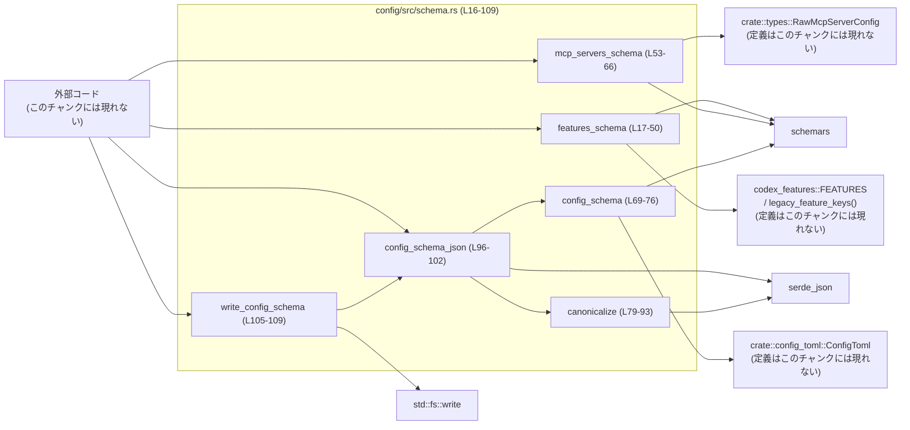
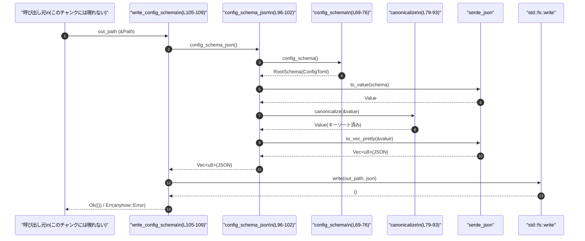

# config/src/schema.rs

## 0. ざっくり一言

`config.toml` 用の JSON Schema を生成し、JSON をキー順に正規化してから、スキーマを JSON として出力／ファイル書き込みするためのユーティリティ群です。

---

## 1. このモジュールの役割

### 1.1 概要

このモジュールは **設定ファイル `config.toml` の構造を JSON Schema で表現し、そのスキーマを安定した（キー順が一定の）JSON として生成・保存する**ために存在します。

- `[features]` セクションと `[mcp_servers]` セクション専用のサブスキーマを構築します（`features_schema`, `mcp_servers_schema`、schema.rs:L16-66）。
- `ConfigToml` 全体のルートスキーマ（`RootSchema`）を生成します（`config_schema`, schema.rs:L69-76）。
- 任意の `serde_json::Value` のキーをソートして正規化します（`canonicalize`, schema.rs:L79-93）。
- スキーマを pretty-print された JSON `Vec<u8>` として得たり、ファイルへ書き出したりします（`config_schema_json`, `write_config_schema`, schema.rs:L96-109）。

### 1.2 アーキテクチャ内での位置づけ

このファイルから見える依存関係と、想定される呼び出し関係を図示します（**呼び出し元はこのチャンクには現れないので「外部コード」として表現**します）。



### 1.3 設計上のポイント

コードから読み取れる設計上の特徴です。

- **スキーマ生成ロジックの分離**  
  - `[features]` 用と `[mcp_servers]` 用のスキーマ構築を別関数に切り出しています（schema.rs:L17-66）。
- **純粋関数中心 + I/O を末端に集約**  
  - `features_schema`, `mcp_servers_schema`, `config_schema`, `canonicalize`, `config_schema_json` は副作用を持たず、`write_config_schema` のみがファイル書き込みを行います（schema.rs:L105-107）。
- **エラー処理の一元化**  
  - I/O やシリアライズのエラーは `anyhow::Result` でラップし、`?` 演算子で呼び出し元に伝播します（schema.rs:L96-101, L105-107）。
- **JSON の正規化**  
  - スキーマ JSON を `canonicalize` でキーソートしてから出力することで、生成物が安定し比較しやすくなっています（schema.rs:L96-100）。
- **Rust の安全性**  
  - `&mut SchemaGenerator` を引数に取ることで、スキーマ生成時のミュータブルな状態は呼び出し元で一元管理され、同時に 1 つのミュータブル参照だけが存在する Rust の所有権ルールを守っています（schema.rs:L17, L53）。

---

## 2. 主要な機能一覧

### 2.1 機能の要約

- `[features]` セクションの JSON Schema 構築（既知 + レガシーキーのみ許可）。
- `[mcp_servers]` セクションの JSON Schema 構築（値に `RawMcpServerConfig` スキーマを適用）。
- `ConfigToml` 全体の JSON Schema（Draft 7）の生成。
- JSON 値のキーソートによる正規化。
- スキーマの pretty-printed JSON 生成。
- スキーマ JSON のファイル書き出し。

### 2.2 コンポーネントインベントリー（関数一覧）

| 名前 | 種別 | 公開 | 役割 / 用途 | 定義位置 |
|------|------|------|-------------|----------|
| `features_schema` | 関数 | `pub` | `[features]` マップの JSON Schema を構築。既知の feature とレガシーキーのみ許可し、それ以外のキーを禁止します。 | `schema.rs:L17-50` |
| `mcp_servers_schema` | 関数 | `pub` | `[mcp_servers]` マップの JSON Schema を構築。値の型として `RawMcpServerConfig` のサブスキーマを適用します。 | `schema.rs:L53-66` |
| `config_schema` | 関数 | `pub` | `ConfigToml` 型から JSON Schema Draft 7 の `RootSchema` を生成します。 | `schema.rs:L69-76` |
| `canonicalize` | 関数 | `pub` | `serde_json::Value` のすべてのオブジェクトのキーをソートして新しい `Value` を返します。 | `schema.rs:L79-93` |
| `config_schema_json` | 関数 | `pub` | `config_schema` の結果を JSON にシリアライズし、`canonicalize` したうえで pretty-print された `Vec<u8>` として返します。 | `schema.rs:L96-102` |
| `write_config_schema` | 関数 | `pub` | `config_schema_json` の結果を指定パスへ書き出します。スキーマのフィクスチャ生成用途が想定されます。 | `schema.rs:L105-109` |

---

## 3. 公開 API と詳細解説

### 3.1 型一覧（構造体・列挙体など）

このファイル内で新たに定義されている構造体・列挙体はありません。

ただし、公開 API のシグネチャに現れる主要な型は以下です（定義はいずれもこのチャンクには現れません）。

| 名前 | 種別 | 出典 | 役割 / 用途 | 根拠 |
|------|------|------|-------------|------|
| `ConfigToml` | 構造体（推定） | `crate::config_toml` | アプリケーション設定全体を表す TOML 対応の設定型。`config_schema` で JSON Schema に変換されます。 | `schema.rs:L1, L75` |
| `RawMcpServerConfig` | 構造体（推定） | `crate::types` | `[mcp_servers]` の各要素の「生の」入力形を表す設定型。 | `schema.rs:L2, L60` |
| `SchemaGenerator` | 構造体 | `schemars::gen` | JSON Schema を構築するためのコンテキスト。 | `schema.rs:L5, L17, L53` |
| `SchemaSettings` | 構造体 | `schemars::gen` | Schema 生成に関する設定。ここでは Draft 7 固定。 | `schema.rs:L6, L70` |
| `SchemaObject`, `ObjectValidation`, `InstanceType`, `Schema`, `RootSchema` | 構造体等 | `schemars::schema` | JSON Schema 要素を表現する型群。 | `schema.rs:L7-11` |
| `Value`, `Map` | 構造体 | `serde_json` | JSON データの汎用表現、およびオブジェクトのキー→値マッピング。 | `schema.rs:L12-13, L79-93` |
| `Path` | 構造体 | `std::path` | ファイルシステム上のパス。`write_config_schema` に渡されます。 | `schema.rs:L14, L105` |

※ `ConfigToml` や `RawMcpServerConfig` のフィールド構成や意味は、このチャンクには現れないため不明です。

---

### 3.2 関数詳細

#### `features_schema(schema_gen: &mut SchemaGenerator) -> Schema`

**概要**

`[features]` セクションの JSON Schema を構築します。  
`codex_features::FEATURES` に含まれる既知の feature キーと `legacy_feature_keys()` によるレガシーキーだけをブール値（または特定の設定構造）として許可し、それ以外のキーを禁止します（schema.rs:L17-50）。

**引数**

| 引数名 | 型 | 説明 |
|--------|----|------|
| `schema_gen` | `&mut SchemaGenerator` | スキーマを生成するための `schemars` のジェネレータ。ミュータブル参照として受け取り、サブスキーマ生成に使用します（schema.rs:L17, L31-33）。 |

**戻り値**

- `Schema`  
  `[features]` マップの JSON Schema を表す `schemars::schema::Schema`。  
  具体的には `Schema::Object(SchemaObject { ... })` の形で返されます（schema.rs:L18-21, L49）。

**内部処理の流れ**

1. `SchemaObject` をオブジェクト型 (`InstanceType::Object`) として初期化します（schema.rs:L18-21）。
2. `ObjectValidation::default()` で検証設定を作成します（schema.rs:L23）。
3. `FEATURES` 配列をループし、各 feature ごとにプロパティ定義を追加します（schema.rs:L24-40）。
   - `Feature::Artifact` はスキップ（schema.rs:L25-27）。
   - `Feature::MultiAgentV2` は、値として `codex_features::FeatureToml<MultiAgentV2ConfigToml>` のサブスキーマを使用（schema.rs:L28-35）。
   - それ以外の feature は `bool` 型のサブスキーマを設定（schema.rs:L37-39）。
4. `legacy_feature_keys()` に含まれる各レガシーキーにも `bool` スキーマを付与します（schema.rs:L41-45）。
5. `additional_properties` を `Schema::Bool(false)` に設定し、列挙されたキー以外のプロパティを禁止します（schema.rs:L46）。
6. 最終的な `ObjectValidation` を `SchemaObject` に詰め、`Schema::Object` として返します（schema.rs:L47-49）。

**Examples（使用例）**

以下は独自に `SchemaGenerator` を作成し、`features_schema` を利用して `[features]` セクション用のスキーマを取得する例です。

```rust
use schemars::gen::SchemaSettings;                         // SchemaSettings をインポート
use schemars::gen::SchemaGenerator;                        // SchemaGenerator をインポート
use schemars::schema::Schema;                              // Schema 型をインポート
use config::schema::features_schema;                       // このモジュールの関数をインポート

fn build_features_schema() -> Schema {                     // features 用スキーマを構築する関数
    let mut gen: SchemaGenerator = SchemaSettings::draft07() // Draft 7 の設定でジェネレータを作成
        .into_generator();                                 // SchemaGenerator を生成

    let schema = features_schema(&mut gen);                // &mut gen を渡してスキーマを構築

    schema                                                 // 構築したスキーマを呼び出し元に返す
}
```

**Errors / Panics**

- この関数内で `Result` や `?` は使用していません。  
- 通常の `schemars` の利用前提では panic を発生させるコードは含まれていません（明示的な `unwrap` などが無い: schema.rs:L17-50）。

**Edge cases（エッジケース）**

- `FEATURES` に `Feature::Artifact` が含まれていても、該当するキーはスキーマから完全に除外されます（schema.rs:L25-27）。
- `Feature::MultiAgentV2` のキーだけは `bool` ではなく、構造的な設定スキーマを持ちます（schema.rs:L28-35）。
- `legacy_feature_keys()` が空の場合、レガシーキー用の追加プロパティは一切生成されません（schema.rs:L41-45）。
- `FEATURES` や `legacy_feature_keys()` に同じキーが重複して含まれていた場合、最後に挿入された定義で上書きされる挙動になります（標準の `Map` の insert の仕様からの推論であり、このチャンクには重複有無は現れません）。

**使用上の注意点**

- `schema_gen` はミュータブル参照であるため、同じ `SchemaGenerator` を複数スレッドから同時に渡すことはできません（Rust の所有権ルールによりコンパイルエラーになります）。
- このスキーマは「既知の feature キーのみ許可し、それ以外をエラーにする」というポリシーを前提としているため、新しい feature を追加するときは `codex_features::FEATURES`／`legacy_feature_keys()` 側の更新が必要になります（このチャンクにはそれらの定義は現れません）。

---

#### `mcp_servers_schema(schema_gen: &mut SchemaGenerator) -> Schema`

**概要**

`[mcp_servers]` セクションの JSON Schema を構築します。  
任意の文字列キーに対して、値の型として `RawMcpServerConfig` のサブスキーマを適用したマップ型スキーマを返します（schema.rs:L53-66）。

**引数**

| 引数名 | 型 | 説明 |
|--------|----|------|
| `schema_gen` | `&mut SchemaGenerator` | `RawMcpServerConfig` のサブスキーマを生成するためのジェネレータ（schema.rs:L53, L60）。 |

**戻り値**

- `Schema`  
  `[mcp_servers]` マップの JSON Schema (`Schema::Object`)。

**内部処理の流れ**

1. `SchemaObject` をオブジェクト型として初期化します（schema.rs:L54-57）。
2. `ObjectValidation` を作成し、`additional_properties` に `schema_gen.subschema_for::<RawMcpServerConfig>()` を設定します（schema.rs:L59-61）。
   - これにより、任意のキーの値が `RawMcpServerConfig` 型の形に従うことが要求されます。
3. `SchemaObject` の `object` に検証ルールを設定し、`Schema::Object` として返します（schema.rs:L63-65）。

**Examples（使用例）**

```rust
use schemars::gen::SchemaSettings;                         // SchemaSettings のインポート
use schemars::gen::SchemaGenerator;                        // SchemaGenerator のインポート
use schemars::schema::Schema;                              // Schema 型
use config::schema::mcp_servers_schema;                    // 対象関数のインポート

fn build_mcp_servers_schema() -> Schema {                  // mcp_servers 用のスキーマを作る関数
    let mut gen = SchemaSettings::draft07()                // Draft 7 設定を使用
        .into_generator();                                 // SchemaGenerator を作成

    let schema = mcp_servers_schema(&mut gen);             // &mut gen を渡してスキーマを構築

    schema                                                 // スキーマを返却
}
```

**Errors / Panics**

- この関数自体はエラーを返さず、panic を発生させるコードも含まれていません（schema.rs:L53-66）。

**Edge cases**

- `RawMcpServerConfig` のスキーマ内容はこのチャンクには現れないため、値に何が許可されるかは不明です。
- `additional_properties` を設定しているだけで、`properties` や `pattern_properties` は設定していないため、キー名の制約は特にありません（schema.rs:L59-63）。

**使用上の注意点**

- `[mcp_servers]` セクションで**特定のキー名のみ許可したい**場合は、この関数ではなく別途 `properties` を設定する必要があります。
- `RawMcpServerConfig` 側の変更は、このスキーマに直接影響します。値のチェックロジックを変更する際はスキーマとの整合性に注意が必要です。

---

#### `config_schema() -> RootSchema`

**概要**

`ConfigToml` 型の定義に基づき、JSON Schema Draft 7 準拠の `RootSchema` を生成します（schema.rs:L69-76）。  
`schemars` による自動スキーマ生成をラップする薄い関数です。

**引数**

- なし。

**戻り値**

- `RootSchema`  
  `ConfigToml` の JSON Schema ルートオブジェクト。

**内部処理の流れ**

1. `SchemaSettings::draft07()` を呼び出し、Draft 7 用設定を取得（schema.rs:L70）。
2. `.with(|settings| settings.option_add_null_type = false; )` で、`Option<T>` に `null` 型を追加しないように設定（schema.rs:L71-72）。  
   - これにより、`Option<T>` は「`T` か欠損」であり、「`T` または `null`」ではなくなります。
3. `.into_generator()` で `SchemaGenerator` を作成（schema.rs:L74）。
4. `.into_root_schema_for::<ConfigToml>()` で `ConfigToml` 型の `RootSchema` を生成して返します（schema.rs:L75）。

**Examples（使用例）**

```rust
use config::schema::config_schema;                         // 関数をインポート
use schemars::schema::RootSchema;                          // RootSchema 型をインポート

fn get_config_root_schema() -> RootSchema {                // RootSchema を取得する関数
    let root_schema = config_schema();                     // ConfigToml 用 RootSchema を生成

    root_schema                                           // 生成した RootSchema を返す
}
```

**Errors / Panics**

- この関数内でエラー処理や `Result` は使用しておらず、通常の `schemars` の利用では panic を発生させない構造です（schema.rs:L69-76）。
- ただし `ConfigToml` の型定義が `schemars` と非互換な場合など、外部ライブラリ内部で panic する可能性は否定できませんが、このチャンクからは判断できません。

**Edge cases**

- `ConfigToml` に `Option<T>` が含まれる場合でも、`null` を許すスキーマにはなりません（`option_add_null_type = false` の設定による: schema.rs:L71-72）。
- Draft 7 固定であるため、Draft 2020-12 等の新しい仕様に依存したバリデータにはそのままでは適合しません。

**使用上の注意点**

- Draft バージョンを変更したい場合は、この関数を変更する必要があります（`SchemaSettings::draft07()` 部分: schema.rs:L70）。
- Schema を JSON として利用する場合は、`config_schema_json` を使うと canonicalize 処理も含めて一括で行われます。

---

#### `canonicalize(value: &Value) -> Value`

**概要**

`serde_json::Value` のオブジェクト（`Value::Object`）に対し、キーをソートした新しい `Value` を再帰的に生成します。  
これにより JSON のキー順を安定化し、差分比較などを行いやすくします（schema.rs:L79-93）。

**引数**

| 引数名 | 型 | 説明 |
|--------|----|------|
| `value` | `&Value` | 正規化したい JSON 値。配列・オブジェクト・プリミティブ全てに対応します（schema.rs:L79-81）。 |

**戻り値**

- `Value`  
  キーがソートされた JSON。元の `value` は変更されず、新しい値が返されます。

**内部処理の流れ**

1. `match value` で JSON の種類ごとに分岐（schema.rs:L80）。
2. `Value::Array(items)` の場合  
   - 各要素に対して `canonicalize` を再帰的に呼び、新しい配列を作成（schema.rs:L81）。
3. `Value::Object(map)` の場合  
   - `map.iter().collect()` で `(key, value)` のベクタを作成（schema.rs:L83）。
   - `entries.sort_by(|(left, _), (right, _)| left.cmp(right))` でキーの文字列順にソート（schema.rs:L84）。
   - 新しい `Map` を作成し、ソート順に従ってキー→値を挿入（値側は再帰的に `canonicalize` 済み）（schema.rs:L85-88）。
4. その他（数値・文字列・`bool`・`null` 等）の場合は `value.clone()` をそのまま返す（schema.rs:L91）。

**Examples（使用例）**

```rust
use serde_json::{json, Value};                             // JSON マクロと Value 型
use config::schema::canonicalize;                          // 関数をインポート

fn demo_canonicalize() {                                   // 正規化の挙動を確認する関数
    let v: Value = json!({                                 // キー順がバラバラな JSON オブジェクト
        "b": 1,
        "a": { "d": 4, "c": 3 },
    });

    let canonical = canonicalize(&v);                      // キーをソートして新しい JSON を得る

    // canonical は {"a": {"c": 3, "d": 4}, "b": 1} のように
    // 各オブジェクトのキー順がソートされた形になります
    println!("{}", canonical);                             // 結果を表示
}
```

**Errors / Panics**

- エラーは発生しません。`Result` を返さず、`?` も使用していません（schema.rs:L79-93）。
- `serde_json::Value` は循環参照を持たないツリー構造のため、通常の JSON に対しては再帰が無限に続くことはありません。

**Edge cases**

- 非常に深いネストや巨大な JSON に対しては、再帰呼び出しとソートによりスタック消費や計算コストが増大します。
- すでにソート済みのオブジェクトでも、新しい `Map` を作り直しているため、完全に no-op ではありません（schema.rs:L83-89）。

**使用上の注意点**

- **元の `Value` は変更されない** ため、インプレースな変更を期待していると動きが変わります。結果の `Value` を必ず受け取る必要があります（`value` は `&Value` で受けている: schema.rs:L79）。
- JSON の整形やテストのスナップショット比較など、「キー順の違いを無視したい」場面で有用です。

---

#### `config_schema_json() -> anyhow::Result<Vec<u8>>`

**概要**

`config_schema()` で生成した `RootSchema` を JSON にシリアライズし、`canonicalize` でキーソートした上で pretty-print された JSON のバイト列を返します（schema.rs:L96-102）。

**引数**

- なし。

**戻り値**

- `anyhow::Result<Vec<u8>>`  
  成功時は UTF-8 エンコードされた JSON のバイト列。失敗時は `anyhow::Error`。

**内部処理の流れ**

1. `config_schema()` を呼び出し、`RootSchema` を取得（schema.rs:L97）。
2. `serde_json::to_value(schema)?` で JSON 値に変換（schema.rs:L98）。
3. `canonicalize(&value)` でキーソートされた `Value` を生成（schema.rs:L99）。
4. `serde_json::to_vec_pretty(&value)?` でインデント付き JSON にシリアライズ（schema.rs:L100）。
5. `Ok(json)` で `Vec<u8>` を返します（schema.rs:L101）。

**Examples（使用例）**

```rust
use config::schema::config_schema_json;                    // 関数をインポート
use std::str;                                              // バイト列を文字列に変換するため

fn print_config_schema_json() -> anyhow::Result<()> {      // スキーマ JSON を表示する関数
    let bytes = config_schema_json()?;                     // スキーマ JSON を取得（エラーは ? で伝播）

    let s = str::from_utf8(&bytes)?;                       // UTF-8 文字列に変換（ここでも ? でエラー伝播）
    println!("{}", s);                                     // スキーマ JSON を表示

    Ok(())                                                 // 正常終了
}
```

**Errors / Panics**

- 2 回の `?` 演算子があり、以下の箇所で `serde_json::Error` などが `anyhow::Error` として返る可能性があります（schema.rs:L98, L100）。
  - `serde_json::to_value(schema)` のシリアライズ時。
  - `serde_json::to_vec_pretty(&value)` のシリアライズ時。
- `config_schema()` と `canonicalize()` 自体は `Result` を返さず、ここでは失敗しない前提です（schema.rs:L97, L99）。

**Edge cases**

- スキーマが非常に大きい場合、生成される JSON も大きくなり、メモリ消費と処理時間が増えます。
- `Vec<u8>` 形式で返されるため、文字列として扱うには UTF-8 としてのデコードが必要です。

**使用上の注意点**

- エラーを `anyhow::Result` でまとめているため、エラーの詳細原因 (`serde_json::Error` など) を必要とする場合は `anyhow` の downcast 機能を使う必要があります（このチャンクでは downcast の使用例は現れません）。
- スキーマ JSON を比較したい場合は、この関数を利用することで canonicalize によるキー順の安定化を自動的に得られます。

---

#### `write_config_schema(out_path: &Path) -> anyhow::Result<()>`

**概要**

`config_schema_json()` の結果を指定されたファイルパスに書き込みます。  
テスト用フィクスチャや配布用スキーマファイルの生成が想定されます（schema.rs:L105-109）。

**引数**

| 引数名 | 型 | 説明 |
|--------|----|------|
| `out_path` | `&Path` | スキーマ JSON を書き出すファイルパス（schema.rs:L105）。 |

**戻り値**

- `anyhow::Result<()>`  
  成功時は `Ok(())`。失敗時は `anyhow::Error`。

**内部処理の流れ**

1. `config_schema_json()?` を呼び出し、JSON バイト列を取得（schema.rs:L106）。
2. `std::fs::write(out_path, json)?` でファイルに書き込み（schema.rs:L107）。
3. `Ok(())` を返して終了（schema.rs:L108）。

**Examples（使用例）**

```rust
use config::schema::write_config_schema;                   // 関数をインポート
use std::path::Path;                                       // Path 型をインポート

fn generate_schema_file() -> anyhow::Result<()> {          // スキーマファイルを生成する関数
    let path = Path::new("config.schema.json");            // 出力先ファイルパスを指定

    write_config_schema(path)?;                            // スキーマを生成して書き出し（エラーは ? で伝播）

    Ok(())                                                 // 正常終了
}
```

**Errors / Panics**

- `config_schema_json()?` からのエラー（前述のシリアライズエラーなど）がそのまま `anyhow::Error` として伝播します（schema.rs:L106）。
- `std::fs::write(out_path, json)?` で I/O エラー（パーミッション拒否、ディスクフル、ディレクトリが存在しない等）が起こり得ます（schema.rs:L107）。
- この関数自身には明示的な panic の可能性はありません。

**Edge cases**

- `out_path` が存在しないディレクトリを指している場合、`std::fs::write` がエラーになります（schema.rs:L107）。
- 既存ファイルパスを指定した場合、内容は上書きされます。

**使用上の注意点**

- `out_path` にユーザ入力をそのまま渡す場合は、パス・トラバーサルや予期しないファイル上書きに注意が必要です（このファイルではパスの検証は行っていません）。
- ファイルパスのエンコーディングや OS 依存のセパレータの扱いは `Path` 依存であり、この関数側では特別な処理をしていません。

---

### 3.3 その他の関数

すべての公開関数について詳細解説を行ったため、このセクションに追加で説明すべき補助関数はありません。

---

## 4. データフロー

ここでは、「スキーマ JSON を生成してファイルに書き出す」という典型シナリオにおけるデータの流れを説明します。

1. 呼び出し元が `write_config_schema` に出力パスを渡します（schema.rs:L105）。
2. `write_config_schema` は `config_schema_json` を呼び出して JSON バイト列を取得します（schema.rs:L106）。
3. `config_schema_json` は `config_schema` によって `RootSchema` を生成し（schema.rs:L97）、`serde_json` で `Value` に変換します（schema.rs:L98）。
4. `canonicalize` により `Value` のキーをソートして正規化します（schema.rs:L99）。
5. 正規化された `Value` を pretty-print された JSON `Vec<u8>` に変換します（schema.rs:L100）。
6. `write_config_schema` は `std::fs::write` でファイルに書き込みます（schema.rs:L107）。



※ `features_schema` / `mcp_servers_schema` の呼び出し元はこのチャンクには現れないため、図には含めていません。

---

## 5. 使い方（How to Use）

### 5.1 基本的な使用方法

最も典型的なフローは、「ルートスキーマを JSON ファイルとして出力する」使い方です。

```rust
use std::path::Path;                                       // Path 型をインポート
use config::schema::write_config_schema;                   // スキーマ書き出し関数
// 他にも必要なら config_schema_json などをインポート

fn main() -> anyhow::Result<()> {                          // anyhow::Result を戻り値とする main
    let out = Path::new("config.schema.json");             // 出力先ファイルを決める

    write_config_schema(out)?;                             // スキーマを生成してファイルへ書き出す

    Ok(())                                                 // 正常終了
}
```

- エラーは `anyhow::Result` を通じて main まで伝播させる形が自然です。

### 5.2 よくある使用パターン

1. **メモリ上でスキーマ JSON を取得し、HTTP レスポンスとして返す**

```rust
use config::schema::config_schema_json;                    // スキーマ JSON を取得する関数

fn get_schema_body() -> anyhow::Result<String> {           // HTTP ボディに載せる文字列を返す
    let bytes = config_schema_json()?;                     // バイト列でスキーマ JSON を取得
    let body = String::from_utf8(bytes)?;                  // UTF-8 文字列に変換
    Ok(body)                                               // 呼び出し元で HTTP レスポンスとして利用
}
```

1. **カスタムツールで features/mcp_servers 部分のサブスキーマだけを取得**

```rust
use schemars::gen::SchemaSettings;                         // SchemaSettings
use config::schema::{features_schema, mcp_servers_schema}; // サブスキーマ生成関数

fn dump_partial_schemas() {
    let mut gen = SchemaSettings::draft07()                // Draft 7 ジェネレータを作成
        .into_generator();

    let features = features_schema(&mut gen);              // [features] 用スキーマ
    let mcp_servers = mcp_servers_schema(&mut gen);        // [mcp_servers] 用スキーマ

    // features, mcp_servers を任意のフォーマットで出力するなどの処理を行う
}
```

1. **テストコードで canonicalize を使って JSON 比較を安定化**

```rust
use serde_json::Value;
use config::schema::canonicalize;

fn assert_json_eq_ignoring_key_order(left: &Value, right: &Value) { // キー順を無視して比較する関数
    let left_c = canonicalize(left);                                // 左側を正規化
    let right_c = canonicalize(right);                              // 右側を正規化
    assert_eq!(left_c, right_c);                                    // 比較
}
```

### 5.3 よくある間違い

コードから推測できる誤用例と、その修正例です。

```rust
// 誤り例: エラーを無視して実行してしまう
use config::schema::write_config_schema;
use std::path::Path;

fn generate_schema_ignored_error() {
    let path = Path::new("config.schema.json");

    let _ = write_config_schema(path);                  // 戻り値を無視してしまっている
    // エラーが発生しても気づけない
}

// 正しい例: エラーを呼び出し元に伝播させる
fn generate_schema_propagate_error() -> anyhow::Result<()> {
    let path = Path::new("config.schema.json");
    write_config_schema(path)?;                         // ? でエラーを伝播
    Ok(())                                              // 正常終了
}
```

```rust
// 誤り例: canonicalize の戻り値を使わない
use serde_json::json;
use config::schema::canonicalize;

fn wrong_canonicalize_usage() {
    let value = json!({ "b": 1, "a": 2 });
    canonicalize(&value);                               // 戻り値を捨てているので、value は変化しない
}

// 正しい例: 戻り値を受け取って利用する
fn correct_canonicalize_usage() {
    let value = json!({ "b": 1, "a": 2 });
    let canon = canonicalize(&value);                   // 戻り値を受け取る
    println!("{}", canon);                              // ソート済みの JSON を使用
}
```

### 5.4 使用上の注意点（まとめ）

- **エラー処理**  
  - `config_schema_json` と `write_config_schema` は `anyhow::Result` を返すため、`?` などで必ずエラーを処理する必要があります（schema.rs:L96-102, L105-109）。
- **ファイル I/O**  
  - `write_config_schema` は出力先を検証しません。システムファイルなどを誤って上書きしないように、呼び出し側で `out_path` を適切に制御する必要があります。
- **並行性**  
  - このファイルの関数はすべてスレッドセーフなシグネチャ（共有ミュータブル状態を持たない）を持ちますが、`&mut SchemaGenerator` を共有しようとするとコンパイルエラーになります。各スレッドで独立したジェネレータを用意するのが安全です。
- **パフォーマンス**  
  - 大規模なスキーマや JSON に対して `canonicalize` は全体を再帰的にコピー・ソートするため、コストが高くなります。必要な場面に限定して使用するのが望ましいです。

---

## 6. 変更の仕方（How to Modify）

### 6.1 新しい機能を追加する場合

例: 新しい設定セクション `[new_section]` のスキーマを追加したい場合。

1. **新しいスキーマ関数の追加**
   - このファイルに `pub fn new_section_schema(schema_gen: &mut SchemaGenerator) -> Schema` のような関数を追加します。
   - `features_schema` や `mcp_servers_schema` と同様に、`SchemaObject` と `ObjectValidation` を組み立てます。

2. **ConfigToml との接続**
   - `ConfigToml` 側に `[new_section]` に対応するフィールドを追加し、`schemars` の derive 属性などで新関数を使うよう設定します。  
     （`ConfigToml` の定義はこのチャンクには現れないため、具体的な方法は不明です。）

3. **スキーマ利用箇所の確認**
   - `config_schema`, `config_schema_json`, `write_config_schema` は `ConfigToml` の変更を自動的に反映するため、通常は追加の変更は不要です。

### 6.2 既存の機能を変更する場合

- **`features_schema` のポリシー変更**
  - 例えば「未知のキーも許可したい」場合、`validation.additional_properties = Some(Box::new(Schema::Bool(false)));`（schema.rs:L46）を削除または `Schema::Bool(true)` に変更します。
  - 影響として、既存の JSON Schema に依存するバリデーション（テストやクライアント側バリデータ）が変わる点に注意が必要です。

- **Draft バージョンを変えたい場合**
  - `SchemaSettings::draft07()`（schema.rs:L70）を別のメソッド（`draft2019_09` など）に変更します。  
    対応するバリデータやツールが新しい Draft をサポートしているか確認する必要があります。

- **canonicalize の挙動を変えたい場合**
  - 例えば「配列の順序までソートしたい」などの要望がある場合は、`Value::Array` 分岐（schema.rs:L81）を変更します。
  - ただし、配列の順序を変えることは JSON の意味を変えるため、既存のコードへの影響が大きい可能性があります。

- 変更時の共通注意:
  - `config_schema_json` と `write_config_schema` に依存するテストや CI のスナップショットファイルがある場合、変更に応じて更新が必要になります（このチャンクにはテストコードは現れません）。

---

## 7. 関連ファイル

このモジュールと密接に関係するであろうモジュール／型です。具体的なファイルパスはこのチャンクには現れないため、モジュールパスで記載します。

| パス / モジュール | 役割 / 関係 |
|-------------------|------------|
| `crate::config_toml::ConfigToml` | `config_schema` の対象となる設定型。どのフィールドがスキーマに含まれるかはこの型に依存します（schema.rs:L1, L75）。 |
| `crate::types::RawMcpServerConfig` | `[mcp_servers]` セクションの値の型。`mcp_servers_schema` がこの型のサブスキーマを利用します（schema.rs:L2, L60）。 |
| `codex_features::FEATURES` | 利用可能な feature 一覧。`features_schema` がこの配列を走査してプロパティを定義します（schema.rs:L3, L24-40）。 |
| `codex_features::legacy_feature_keys` | レガシーな feature キーの一覧。`features_schema` で追加プロパティとして許可されます（schema.rs:L4, L41-45）。 |
| `schemars` 関連 (`SchemaGenerator`, `SchemaSettings`, `SchemaObject` など) | JSON Schema の生成と表現を行う外部ライブラリ。すべてのスキーマ生成処理がこのライブラリを通じて行われます（schema.rs:L5-11, L69-76）。 |
| `serde_json` | JSON へのシリアライズ／デシリアライズ、および `Value` 型を提供します。`canonicalize`, `config_schema_json` で使用されます（schema.rs:L12-13, L79-93, L98-100）。 |
| `std::fs` / `std::path::Path` | ファイルシステムとのやり取り、およびファイルパス表現。`write_config_schema` がスキーマファイルを書き出すために使用します（schema.rs:L14, L105-107）。 |

このチャンクにはテストコードや呼び出し元のロジックは含まれていないため、実際にどのような CI やコマンドから `write_config_schema` が呼ばれているかは不明です。
