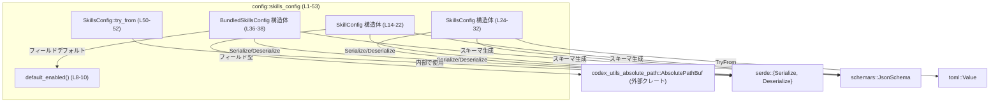
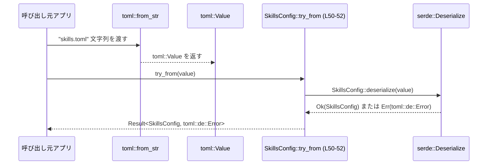

# config/src/skills_config.rs

## 0. ざっくり一言

スキル機能に関する設定情報（個別スキル設定と「バンドルされたスキル」の設定）を、他クレートから共有して使えるように定義したシリアライズ／デシリアライズ可能な型群です（`toml::Value` からの変換も提供します）。

---

## 1. このモジュールの役割

### 1.1 概要

- このモジュールは、**スキル関連の設定値を構造化された型として扱う**ための定義を提供します。
- 個々のスキルごとの設定（`SkillConfig`）、スキル全体の設定（`SkillsConfig`）、および「バンドルされたスキル」の有効・無効設定（`BundledSkillsConfig`）を表現します（`config/src/skills_config.rs:L14-22,L24-32,L36-38`）。
- 設定は `serde` によりシリアライズ／デシリアライズ可能であり、`toml::Value` から `SkillsConfig` への変換も `TryFrom` 実装として提供されます（`config/src/skills_config.rs:L24-32,L47-52`）。

### 1.2 アーキテクチャ内での位置づけ

このモジュールは「設定定義」の層に属し、外部クレート・ライブラリとの関係は次のようになります。



- 上位層（ここには記載されていません）が `SkillsConfig` を用いて設定を保持・参照する構造になっていると考えられますが、このチャンクには呼び出し元は現れません。

### 1.3 設計上のポイント

- **データ主導の設計**  
  すべて構造体定義とシリアライズ属性が中心で、ロジックは最小限（`default_enabled` と `try_from` の薄いラッパー）の構成です（`config/src/skills_config.rs:L8-10,L47-52`）。
- **シリアライズ／スキーマ対応**  
  各構造体は `serde` と `schemars::JsonSchema` を derive し、JSON/TOML 等の設定ファイルとの相互変換やスキーマ生成が可能です（`config/src/skills_config.rs:L12,L24,L34`）。
- **オプションとデフォルトの活用**  
  `Option` や `#[serde(default, skip_serializing_if = ...)]` を利用し、「未指定」と「空」を区別しつつ、シリアライズ時に冗長なフィールドを省略する設計になっています（`config/src/skills_config.rs:L16-21,L27-31,L37-38`）。
- **エラー処理の方針**  
  `SkillsConfig` への変換は `TryFrom<toml::Value>` として実装され、失敗時は `toml::de::Error` を返す形で表現されています（`config/src/skills_config.rs:L47-52`）。

---

## 2. 主要な機能一覧とコンポーネントインベントリー

### 2.1 コンポーネント一覧（型・関数）

#### 型（構造体）

| 名前 | 種別 | 公開 | 役割 / 用途 | 定義位置 |
|------|------|------|-------------|----------|
| `SkillConfig` | 構造体 | `pub` | 個々のスキルに対する設定（パス／名前によるセレクタと有効フラグ）を表現します。 | `config/src/skills_config.rs:L14-22` |
| `SkillsConfig` | 構造体 | `pub` | 全体のスキル設定。オプションのバンドル設定と、複数の `SkillConfig` の集合を持ちます。 | `config/src/skills_config.rs:L24-32` |
| `BundledSkillsConfig` | 構造体 | `pub` | 「バンドルされたスキル」を一括で有効化／無効化する設定を表現します。 | `config/src/skills_config.rs:L36-38` |

#### 関数・メソッド

| 名前 | 種別 | 公開 | 役割 / 用途 | 定義位置 |
|------|------|------|-------------|----------|
| `default_enabled() -> bool` | 関数（`const fn`） | モジュール内のみ（`pub` ではない） | `BundledSkillsConfig.enabled` のデフォルト値として `true` を返します。serde の `default` 属性から参照されます。 | `config/src/skills_config.rs:L8-10` |
| `BundledSkillsConfig::default() -> Self` | メソッド（`Default` 実装） | `pub`（`Default` の標準 API 経由） | `BundledSkillsConfig` の明示的なデフォルト値を提供し、`enabled: true` を設定します。 | `config/src/skills_config.rs:L41-45` |
| `SkillsConfig::try_from(value: toml::Value)` | 関数（`TryFrom` 実装） | `pub`（`TryFrom` の標準 API 経由） | `toml::Value` を `serde::Deserialize` を通して `SkillsConfig` に変換します。設定ロード時の入口になりえます。 | `config/src/skills_config.rs:L47-52` |

> 備考: `SkillsConfig` 自体にも `Default` が derive されていますが、その実装は自動生成のため、このチャンク内に明示的なコードは現れません（`config/src/skills_config.rs:L24`）。

### 2.2 主要な機能一覧（要約）

- スキル単位設定の保持: `SkillConfig` によるパス／名前ベースのスキル選択と有効フラグ（`config/src/skills_config.rs:L14-22`）。
- スキル全体設定の保持: `SkillsConfig` によるバンドル設定＋個別設定リストの管理（`config/src/skills_config.rs:L24-32`）。
- バンドルされたスキルの有効化制御: `BundledSkillsConfig.enabled` による一括 ON/OFF（`config/src/skills_config.rs:L36-38`）。
- TOML からの読み込み: `TryFrom<toml::Value>` を通じた `SkillsConfig` への変換（`config/src/skills_config.rs:L47-52`）。

---

## 3. 公開 API と詳細解説

### 3.1 型一覧（構造体）

| 名前 | 種別 | フィールド概要 | 関連する関数 / 特徴 |
|------|------|----------------|----------------------|
| `SkillConfig` | 構造体 | `path: Option<AbsolutePathBuf>`（パスベースのセレクタ）、`name: Option<String>`（名前ベースのセレクタ）、`enabled: bool`（有効フラグ）。すべてシリアライズ／スキーマ生成対応。 | `serde` による `default` + `skip_serializing_if` で、未指定フィールドの扱いとシリアライズ最適化を行います（`config/src/skills_config.rs:L16-21`）。 |
| `SkillsConfig` | 構造体 | `bundled: Option<BundledSkillsConfig>` と `config: Vec<SkillConfig>` を持つコンテナ型。 | `Default` derive により `bundled: None`, `config: vec![]` がデフォルトになります（`config/src/skills_config.rs:L24-32`）。 `TryFrom<toml::Value>` 実装あり（`config/src/skills_config.rs:L47-52`）。 |
| `BundledSkillsConfig` | 構造体 | `enabled: bool` のみ。バンドルされたスキル群の有効/無効を表現します。 | `serde(default = "default_enabled")` および `impl Default` の両方でデフォルト値 `true` を設定します（`config/src/skills_config.rs:L37-38,L41-45`）。 |

### 3.2 関数詳細

#### `impl TryFrom<toml::Value> for SkillsConfig::try_from(value: toml::Value) -> Result<SkillsConfig, toml::de::Error>`

**概要**

- TOML の中間表現である `toml::Value` から `SkillsConfig` を構築するための変換関数です（`config/src/skills_config.rs:L47-52`）。
- 内部では `SkillsConfig::deserialize(value)` を呼び出すだけの薄いラッパーになっています。

**引数**

| 引数名 | 型 | 説明 |
|--------|----|------|
| `value` | `toml::Value` | スキル設定を含む TOML の値。通常は `toml::from_str` などで文字列からパースした結果になります。 |

**戻り値**

- `Result<SkillsConfig, toml::de::Error>`  
  - `Ok(SkillsConfig)` : `value` が `SkillsConfig` のフィールド構造と型に適合した場合。  
  - `Err(toml::de::Error)` : 型の不一致や、TOML 側の構造が `SkillsConfig` にマッピングできない場合。

**内部処理の流れ**

1. `SkillsConfig::deserialize(value)` を呼び出し、`serde` のデシリアライズ機構に処理を委譲します（`config/src/skills_config.rs:L51`）。
2. デシリアライズに成功すれば `Ok(SkillsConfig)`、失敗すれば `Err(toml::de::Error)` が返ります。
3. 独自の検証ロジックやフィールド変換などは、このチャンク内には実装されていません。

**使用例**

以下は、TOML 文字列から `SkillsConfig` を読み込む一連の例です。

```rust
use toml;                                              // TOML パーサクレートをインポート
use config::skills_config::SkillsConfig;               // SkillsConfig 型をインポート

fn load_skills_config_from_str(src: &str)              // 文字列から設定を読み込む関数
    -> Result<SkillsConfig, toml::de::Error>           // 成功時は SkillsConfig、失敗時は toml::de::Error
{
    let value: toml::Value = toml::from_str(src)?;     // 文字列を toml::Value にパース（失敗時は ? で早期リターン）
    SkillsConfig::try_from(value)                      // TryFrom 実装を使って SkillsConfig に変換
}
```

**Errors / Panics**

- `Err(toml::de::Error)` となる代表的なケース:
  - `value` の構造がオブジェクト（TOML テーブル）でない、またはネスト構造が `SkillsConfig` と一致しない場合。
  - `config` フィールドが配列でない、あるいは配列要素が `SkillConfig` と整合しない場合（例: `enabled` に文字列が入っているなど）。
  - `bundled` フィールドがテーブルでない、または `enabled` に `bool` 以外が入っている場合。
- この関数自体は `panic!` を呼び出しておらず、パニック条件はありません（`config/src/skills_config.rs:L50-52`）。

**Edge cases（エッジケース）**

- `value` に `bundled` フィールドが存在しない場合  
  → `SkillsConfig.bundled` は `None` になります（`#[serde(default)]` による）（`config/src/skills_config.rs:L27-28`）。
- `value` に `bundled = {}` のような空テーブルがある場合  
  → `BundledSkillsConfig.enabled` は `default_enabled()` の適用により `true` になります（`config/src/skills_config.rs:L37-38`）。
- `config` フィールドが存在しない場合  
  → `SkillsConfig.config` はデフォルトの空ベクタとなります（`config/src/skills_config.rs:L24,30-31`）。
- `SkillConfig` の `path` や `name` が TOML に存在しない場合  
  → 対応するフィールドは `None` になります（`config/src/skills_config.rs:L16-20`）。

**使用上の注意点**

- TOML 構造が `SkillsConfig` のフィールド定義と一致している必要があります。特に、ブーリアンフィールドに文字列や数値を入れるとデシリアライズエラーになります。
- `serde` 側には `deny_unknown_fields` 属性は付与されていないため、**未知のフィールドはエラーではなく無視される可能性が高い**点に注意が必要です。`#[schemars(deny_unknown_fields)]` はスキーマ生成時のメタ情報であり、serde の振る舞いとは独立です（`config/src/skills_config.rs:L13,L25,L35`）。
- 並行性については、この関数自体はスレッドローカルな処理のみで、グローバル状態を共有しません。スレッド安全性は主に `toml::Value` および `SkillsConfig` のフィールド型に依存します。

---

#### `impl Default for BundledSkillsConfig::default() -> BundledSkillsConfig`

**概要**

- `BundledSkillsConfig` 構造体のデフォルト値を返すための実装です（`config/src/skills_config.rs:L41-45`）。
- `enabled: true` を設定したインスタンスを返します。

**引数**

- なし（関連関数 `BundledSkillsConfig::default()` として呼び出されます）。

**戻り値**

- `BundledSkillsConfig`  
  - `enabled` フィールドが `true` に設定された値。

**内部処理の流れ**

1. `Self { enabled: true }` というリテラルを構築して返します（`config/src/skills_config.rs:L42-43`）。

**使用例**

```rust
use config::skills_config::BundledSkillsConfig;        // BundledSkillsConfig をインポート

fn create_default_bundled() -> BundledSkillsConfig {   // デフォルトの BundledSkillsConfig を返す関数
    BundledSkillsConfig::default()                     // Default 実装を利用して enabled: true の値を生成
}
```

**Errors / Panics**

- この関数はエラーやパニックを発生させません。単純な構造体生成のみです。

**Edge cases**

- 特記事項はありません。常に `enabled: true` を返します。
- `serde` デシリアライズでは、`BundledSkillsConfig` 自体が生成される場合に `default_enabled()` が用いられるため、**`Default` 実装とは別経路**で同じ値が設定されます（`config/src/skills_config.rs:L37-38`）。

**使用上の注意点**

- `SkillsConfig.bundled` は `Option<BundledSkillsConfig>` であり、フィールドが存在しない場合は `None` になる点に注意が必要です。  
  - TOML 設定が `bundled = {}` の場合は `Some(BundledSkillsConfig { enabled: true })`  
  - `bundled` セクション自体が存在しない場合は `None`
- 「バンドル設定の省略」と「明示的にデフォルト値で指定」の挙動が異なるため、アプリケーション側で意味づけを整理する必要があります（意味自体はこのチャンクからは分かりません）。

---

#### `const fn default_enabled() -> bool`

**概要**

- `BundledSkillsConfig.enabled` フィールドのデフォルト値を提供するための補助関数です（`config/src/skills_config.rs:L8-10,L37-38`）。
- 常に `true` を返し、`serde(default = "...")` 属性から参照されます。

**引数**

- なし。

**戻り値**

- `bool`  
  - 常に `true`。

**内部処理の流れ**

1. 定数関数 `const fn` として定義されており、`true` を返すだけです（`config/src/skills_config.rs:L8-10`）。

**使用例**

- 通常は直接呼び出さず、`serde` の `default` 属性経由で使用されます。
- テストなどで直接使う場合の例:

```rust
use config::skills_config::default_enabled;            // （この関数は pub ではないため、実際には同モジュール内専用です）

fn is_enabled_by_default() -> bool {                   // デフォルト有効状態かを返す関数
    default_enabled()                                  // true を返す
}
```

> 注: 実際には `default_enabled` は `pub` ではないため、このような呼び出しは同一モジュール内に限られます（可視性はこのチャンクのシグネチャから確認できます: `config/src/skills_config.rs:L8`）。

**Errors / Panics**

- エラーやパニックは発生しません。

**Edge cases**

- ありません。常に `true` を返すため、入力や状態に依存しません。

**使用上の注意点**

- デフォルト値を変更したくなった場合、`BundledSkillsConfig` の `Default` 実装とこの関数の両方を同時に変更する必要があります。一方だけ変更すると、`serde` 経由のデシリアライズ結果と `Default::default()` の結果が食い違う可能性があります。

---

### 3.3 その他の関数

- このファイルには、上記以外の補助関数やラッパーは存在しません。
- `SkillsConfig` の `Default` 実装は derive による自動生成であり、コードとしては本チャンクには現れていません（`config/src/skills_config.rs:L24`）。

---

## 4. データフロー

### 4.1 代表的な処理シナリオ: TOML から `SkillsConfig` への変換

主なデータフローは、「TOML テキスト → `toml::Value` → `SkillsConfig`」という流れです。



要点:

- パースおよび構造チェックは、すべて `toml` と `serde` に委譲されています（`config/src/skills_config.rs:L47-52`）。
- `SkillsConfig` のフィールド構造（`bundled`, `config`、その内部の `SkillConfig` 等）に従って再帰的にデシリアライズが行われます（`config/src/skills_config.rs:L14-22,L24-32,L36-38`）。
- どのフィールドが `Option` か、`Vec` か、`bool` かによって、TOML 側の型要求が決まります。

---

## 5. 使い方（How to Use）

### 5.1 基本的な使用方法

TOML ファイルから `SkillsConfig` を読み込んで利用する典型的なコードフローの例です。

```rust
use std::fs;                                            // ファイル読み込みのために fs を使用
use toml;                                               // TOML パーサ
use config::skills_config::SkillsConfig;                // SkillsConfig 型をインポート

fn load_skills_config(path: &str)                       // 設定ファイルパスを受け取る関数
    -> Result<SkillsConfig, Box<dyn std::error::Error>> // 任意のエラーを返せるように Box<dyn Error> を使用
{
    let toml_str = fs::read_to_string(path)?;           // ファイルから文字列として読み込み（I/O エラー時は ? で早期リターン）
    let value: toml::Value = toml::from_str(&toml_str)?;// 文字列を toml::Value にパース（TOML 構文エラー時も ?）
    let config = SkillsConfig::try_from(value)?;        // TryFrom 実装を使って SkillsConfig に変換
    Ok(config)                                          // 成功したら設定を返す
}
```

このコードを使うと、呼び出し側は `SkillsConfig` を経由して個々のスキル設定にアクセスできます。

### 5.2 よくある使用パターン

1. **個別スキル設定の走査**

```rust
use config::skills_config::SkillsConfig;                // SkillsConfig 型をインポート

fn dump_enabled_skills(cfg: &SkillsConfig) {            // 有効なスキルを出力する関数
    for skill in &cfg.config {                          // config ベクタを借用して反復
        if skill.enabled {                              // enabled が true のものだけを対象
            println!("enabled skill: path={:?}, name={:?}",
                skill.path,                             // Option<AbsolutePathBuf> をそのまま表示
                skill.name);                            // Option<String> をそのまま表示
        }
    }
}
```

1. **バンドル設定の解釈**

```rust
use config::skills_config::SkillsConfig;                // SkillsConfig 型をインポート

fn is_bundled_enabled(cfg: &SkillsConfig) -> bool {     // バンドルされたスキルが有効かどうかを返す関数
    match &cfg.bundled {                                // bundled フィールドを参照
        Some(b) => b.enabled,                           // Some の場合はその enabled を返す
        None => false,                                  // None の場合の扱い（ここでは false としている）
    }
}
```

> `None` の扱いはアプリケーション側の設計に依存します。このチャンクからは「未指定」が「無効」かどうかは分かりません。

### 5.3 よくある間違い

```rust
use config::skills_config::SkillsConfig;                // SkillsConfig 型をインポート
use toml;

// 間違い例: TOML 文字列を直接 Deserialize しようとしている
fn wrong_load(src: &str) -> Result<SkillsConfig, toml::de::Error> {
    toml::from_str(src)                                 // SkillsConfig ではなく toml::Value を介さずにパース
    // ↑ これはコンパイルは通りますが、
    //   SkillsConfig のために serde を直接使っており、
    //   TryFrom 実装を活用していません。
}

// 正しい例: まず toml::Value にパースしてから TryFrom を使う
fn correct_load(src: &str) -> Result<SkillsConfig, toml::de::Error> {
    let value: toml::Value = toml::from_str(src)?;      // toml::Value にパース
    SkillsConfig::try_from(value)                       // SkillsConfig::try_from を使用
}
```

どちらも機能的には同様の結果になりえますが、**このモジュールが提供している公開 API（`TryFrom`）を利用することが意図された使い方**と考えられます（ただし、設計意図自体はコードからは断定できません）。

### 5.4 使用上の注意点（まとめ）

- `bundled` は `Option<BundledSkillsConfig>` であり、「省略」と「存在するが enabled が true/false」の区別が重要になります。
- `path` / `name` フィールドはいずれも `Option` であるため、「どちらも `None`」の場合の意味づけ（全スキルにマッチする／無効な設定など）はこのチャンクからは分かりません。利用側で契約を定義する必要があります（`config/src/skills_config.rs:L16-21`）。
- 不正な型の値（例: `enabled = "yes"`）は `toml::de::Error` を通じてエラーになります。
- 並行アクセスに関してはこのモジュール自身は状態を持たず、`SkillsConfig` などの構造体は `Clone` を実装しているため、スレッド間でコピーして使うといった利用がしやすい構造になっています（`config/src/skills_config.rs:L12,L24,L34`）。ただし、`Send` / `Sync` であるかどうかはフィールド型（特に `AbsolutePathBuf`）に依存し、このチャンクからは判定できません。

---

## 6. 変更の仕方（How to Modify）

### 6.1 新しい機能を追加する場合

例: `SkillConfig` に追加の属性（例: `priority: u32`）を追加したい場合。

1. **構造体定義の変更**  
   - `SkillConfig` に新しいフィールドを追加します（`config/src/skills_config.rs:L14-22`）。
   - 必要に応じて `#[serde(default)]` や `skip_serializing_if` を付与し、未指定・省略時の挙動を定義します。
2. **スキーマへの反映**  
   - `JsonSchema` が derive されているため、新フィールドは自動的にスキーマに反映されます（`config/src/skills_config.rs:L12`）。
3. **利用側の更新**  
   - 新フィールドを必要とする箇所でアクセスするコードを追加します。
4. **TOML 設定側の更新**  
   - 設定ファイルに新フィールドを追加し、必要であればマイグレーション／互換性の説明を整備します。

### 6.2 既存の機能を変更する場合

- `enabled` のデフォルト値を変更したい場合:
  - `default_enabled()` の戻り値（`true`）を変更すると、serde デシリアライズ経由のデフォルトが変わります（`config/src/skills_config.rs:L8-10,L37-38`）。
  - 同時に `impl Default for BundledSkillsConfig` 内の `enabled: true` も更新し、両者を一致させる必要があります（`config/src/skills_config.rs:L41-45`）。
- `SkillsConfig` の構造（例: `bundled` を非オプションにしたい）を変更する場合:
  - フィールドの型や `serde` 属性を変更すると、TOML 側の必須／任意フィールドが変わります。
  - 既存の設定ファイルとの互換性に影響するため、`TryFrom` 経由のデシリアライズが失敗しないかをテストする必要があります。

---

## 7. 関連ファイル

このチャンクから直接参照される外部コンポーネント・関連ファイルは次の通りです。

| パス / クレート | 役割 / 関係 |
|-----------------|------------|
| `codex_utils_absolute_path::AbsolutePathBuf` | `SkillConfig.path` の型として使用される絶対パス表現です（`config/src/skills_config.rs:L17`）。具体的な挙動は別クレートに依存するため、このチャンクには現れません。 |
| `schemars::JsonSchema` | 各構造体のスキーマ生成トレイト。`#[schemars(deny_unknown_fields)]` により、スキーマ上では未知フィールドを許可しない方針が設定されています（`config/src/skills_config.rs:L12,L24,L34`）。 |
| `serde::{Serialize, Deserialize}` | 設定構造体をシリアライズ／デシリアライズするためのトレイト。TOML や JSON との変換に利用されます（`config/src/skills_config.rs:L3-6,L12,L24,L34`）。 |
| `toml` クレート | `toml::Value` 型と `toml::de::Error` 型を提供し、`SkillsConfig` の `TryFrom` 実装で利用されます（`config/src/skills_config.rs:L47-52`）。 |

---

## 補足: Bugs / Security / Tests / パフォーマンスの観点（このチャンクから読み取れる範囲）

- **バグの可能性**  
  - `BundledSkillsConfig` には `serde` のデフォルト（`default_enabled`）と `Default` 実装の両方が定義されており、現状はどちらも `true` で一致しています（`config/src/skills_config.rs:L8-10,L37-38,L41-45`）。片方だけ変更すると挙動が分かれる可能性があります。
- **セキュリティ**  
  - このファイル自体は I/O を行わず、純粋なデータ変換のみのため、直接的なセキュリティ上のリスク（コマンドインジェクションなど）は読み取れません。
  - パスを表す `AbsolutePathBuf` の扱い方（存在確認やアクセス権チェックなど）は利用側の責務です。
- **Contracts / Edge Cases**  
  - 「全フィールドが `None` の `SkillConfig`」など、構造的には受け入れられるが意味的に妥当か不明なケースがあります。意味づけは上位ロジックに依存します。
- **Tests**  
  - このファイル内に `#[cfg(test)]` などのテストコードは存在しません。
- **パフォーマンス / スケーラビリティ**  
  - 定義されているのは単純な構造体と薄い変換関数のみであり、このモジュール単体で顕著なパフォーマンス問題やスケーラビリティ問題が生じる要素は見当たりません（繰り返し処理や重い計算は存在しません）。

以上が、`config/src/skills_config.rs` のコードから読み取れる範囲での客観的な構造と利用方法の整理です。
