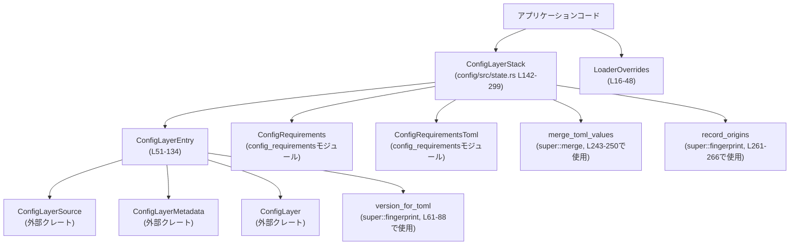
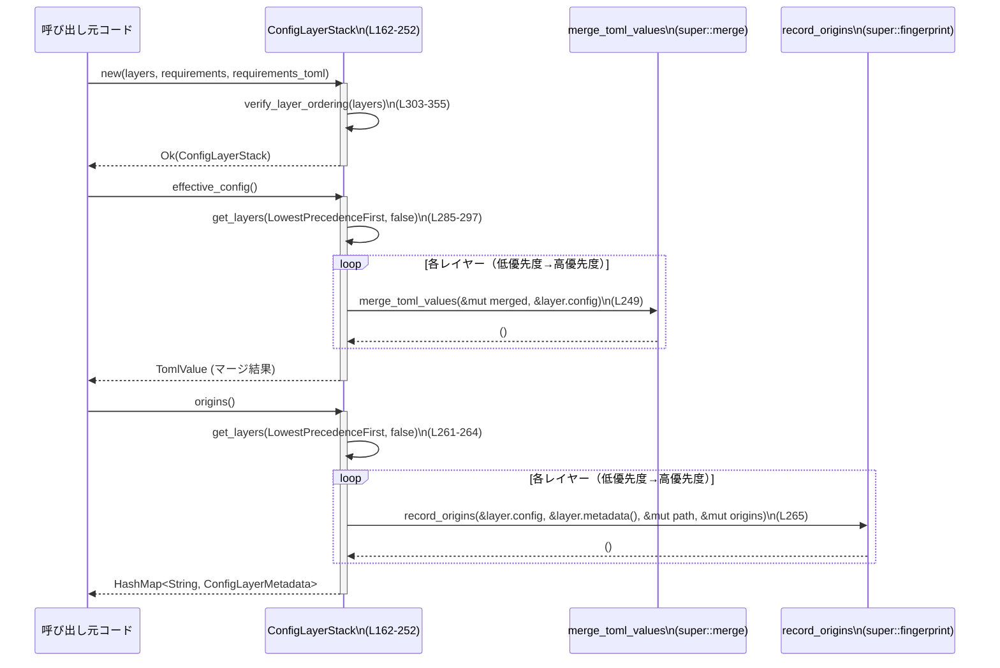

# config/src/state.rs コード解説

## 0. ざっくり一言

複数の設定ソース（システム・ユーザー・プロジェクト・MDMなど）を「レイヤー」として管理し、正しい優先順位でスタック・マージするための状態管理モジュールです。あわせてテスト用の設定入力上書き機構も定義されています。

---

## 1. このモジュールの役割

### 1.1 概要

- このモジュールは **複数の設定ファイル／設定ソースを優先順位付きで統合する問題** を扱います。
- `ConfigLayerEntry` で単一レイヤー（1つの設定ソース）を表現し、`ConfigLayerStack` でそれらをスタックとして管理します（config/src/state.rs:L51-58, L142-159）。
- スタック生成時にレイヤー順序の妥当性を検証し、マージ結果（`effective_config`）や各設定項目の出どころ（`origins`）を取得する API を提供します（L243-252, L257-269）。
- テスト用に、ホスト管理設定を無効化／差し替えする `LoaderOverrides` も定義されています（L16-24, L26-48）。

### 1.2 アーキテクチャ内での位置づけ

このファイル単体で見ると、次のような依存関係になっています。



- `ConfigLayerSource`, `ConfigLayer`, `ConfigLayerMetadata` は `codex_app_server_protocol` クレート由来です（L7-9）。
- 実際のマージ処理は `super::merge::merge_toml_values` に委譲され（L6, L243-250）、フィールドの由来トラッキングは `super::fingerprint::record_origins` に委譲されています（L4, L261-266）。
- このファイルは「設定スタックの状態と整合性」を担当し、入出力形式や具体的なマージアルゴリズムは他モジュールに依存しています。

### 1.3 設計上のポイント

- **不変なスタック構造**
  - `ConfigLayerStack` は内部に `Vec<ConfigLayerEntry>` を持ちますが、公開メソッドは `&self` のみで、スタックを更新する操作も新しい `ConfigLayerStack` を返す純粋関数的な設計になっています（L196-237）。
- **構築時の厳格な検証**
  - `ConfigLayerStack::new` の内部で `verify_layer_ordering` が呼ばれ、レイヤーの優先順位とプロジェクトレイヤーのパス階層が妥当か検証されます（L162-168, L303-355）。
- **エラーハンドリング**
  - 構築時の不正状態は `std::io::ErrorKind::InvalidData` として返します（L304-308, L320-323, L334-337, L345-348）。
  - `as_layer` では TOML→JSON 変換エラーをパニックではなく `JsonValue::Null` にフォールバックします（L113-120）。
- **要件情報の保持**
  - 実際の制約ロジック用の `ConfigRequirements` と、元の TOML 形式の `ConfigRequirementsToml` の両方を保持し、API から元情報を参照可能にしています（L153-158, L184-190）。
- **テスト容易性**
  - `LoaderOverrides` により、実環境の MDM/ホスト管理設定をテスト時に簡単に無効化または差し替えできるようになっています（L16-24, L26-48）。

---

## 2. 主要な機能一覧

- 設定レイヤー表現 (`ConfigLayerEntry`): 単一の設定ソースとメタデータの保持（L51-58）。
- 設定レイヤースタック (`ConfigLayerStack`): レイヤー集合と要件の管理、および検証（L142-159, L161-299）。
- スタックの構築と検証: `ConfigLayerStack::new` + `verify_layer_ordering`（L162-174, L303-355）。
- ユーザー設定の注入／差し替え: `ConfigLayerStack::with_user_config`（L192-237）。
- 有効設定のマージビュー: `ConfigLayerStack::effective_config`（L243-252）。
- 設定値の由来情報の取得: `ConfigLayerStack::origins`（L257-269）。
- レイヤー列挙: `ConfigLayerStack::get_layers`, `layers_high_to_low`（L281-297, L271-279）。
- テスト用の管理設定オーバーライド: `LoaderOverrides` とそのコンストラクタ群（L16-24, L26-48）。

### 2.1 コンポーネント一覧（型・関数インベントリ）

**型**

| 名前 | 種別 | 公開 | 定義箇所 | 役割 / 用途 |
|------|------|------|----------|-------------|
| `LoaderOverrides` | 構造体 | `pub` | config/src/state.rs:L16-24 | テスト時などにホスト管理設定入力を差し替えるためのオーバーライド情報（パスや base64 文字列）を保持します。 |
| `ConfigLayerEntry` | 構造体 | `pub` | L51-58 | 個々の設定レイヤー（ソース種別・TOML値・生TOML文字列・バージョン・無効化理由）を表現します。 |
| `ConfigLayerStackOrdering` | 列挙体 | `pub` | L136-140 | レイヤー列挙時の順序（低→高 / 高→低）を指定するためのフラグです。 |
| `ConfigLayerStack` | 構造体 | `pub` | L142-159 | 複数の `ConfigLayerEntry` と要件情報をまとめて持ち、マージや由来トラッキングなどの操作を提供します。 |

**関数・メソッド**

| 名前 | 公開 | 定義箇所 | 概要 |
|------|------|----------|------|
| `LoaderOverrides::without_managed_config_for_tests()` | `pub` | L30-36 | ホスト管理設定を無視し、一時ディレクトリ配下のダミー `managed_config.toml` を指すオーバーライドを生成します。 |
| `LoaderOverrides::with_managed_config_path_for_tests(PathBuf)` | `pub` | L41-48 | MDM を無効化しつつ、指定パスから管理設定をロードするようなオーバーライドを生成します。 |
| `ConfigLayerEntry::new(ConfigLayerSource, TomlValue)` | `pub` | L61-70 | 生TOMLなし・無効化理由なしのレイヤーエントリを生成し、TOML からバージョン文字列を算出します。 |
| `ConfigLayerEntry::new_with_raw_toml(ConfigLayerSource, TomlValue, String)` | `pub` | L72-81 | 元の TOML 文字列も保持するレイヤーエントリを生成します。 |
| `ConfigLayerEntry::new_disabled(ConfigLayerSource, TomlValue, impl Into<String>)` | `pub` | L83-96 | 無効化理由付きのレイヤーエントリを生成します。 |
| `ConfigLayerEntry::is_disabled(&self)` | `pub` | L98-100 | 無効化フラグ（`disabled_reason` の有無）を返します。 |
| `ConfigLayerEntry::raw_toml(&self)` | `pub` | L102-104 | 生 TOML 文字列の参照を `Option<&str>` で返します。 |
| `ConfigLayerEntry::metadata(&self)` | `pub` | L106-111 | `ConfigLayerMetadata`（名前＋バージョン）のみを抽出したメタデータを返します。 |
| `ConfigLayerEntry::as_layer(&self)` | `pub` | L113-120 | JSON 化された設定値とともに `ConfigLayer` プロトコル型に変換します。 |
| `ConfigLayerEntry::config_folder(&self)` | `pub` | L123-133 | レイヤーに紐づく `.codex/` フォルダ（あれば）を返します。 |
| `ConfigLayerStack::new(Vec<ConfigLayerEntry>, ConfigRequirements, ConfigRequirementsToml)` | `pub` | L162-174 | レイヤー順序を検証しつつ新しいスタックを構築します。 |
| `ConfigLayerStack::get_user_layer(&self)` | `pub` | L179-182 | スタック内のユーザー設定レイヤー（あれば）の参照を返します。 |
| `ConfigLayerStack::requirements(&self)` | `pub` | L184-186 | `ConfigRequirements` への参照を返します。 |
| `ConfigLayerStack::requirements_toml(&self)` | `pub` | L188-190 | `ConfigRequirementsToml` への参照を返します。 |
| `ConfigLayerStack::with_user_config(&self, &AbsolutePathBuf, TomlValue)` | `pub` | L196-237 | `User` レイヤーを新たに差し込む／差し替えた新しいスタックを返します。 |
| `ConfigLayerStack::effective_config(&self)` | `pub` | L243-252 | 有効な（無効化されていない）レイヤーを優先順位順にマージした TOML を返します。 |
| `ConfigLayerStack::origins(&self)` | `pub` | L257-269 | 各設定キーに対する `ConfigLayerMetadata`（どのレイヤー由来か）を `HashMap<String, ConfigLayerMetadata>` として返します。 |
| `ConfigLayerStack::layers_high_to_low(&self)` | `pub` | L274-279 | 有効レイヤーを高優先度→低優先度の順で列挙します。 |
| `ConfigLayerStack::get_layers(&self, ConfigLayerStackOrdering, bool)` | `pub` | L285-297 | （オプションで無効レイヤーを含めつつ）指定順序でレイヤーを列挙します。 |
| `verify_layer_ordering(&[ConfigLayerEntry])` | `fn`（モジュール内プライベート） | L303-355 | レイヤーが優先順位順に並んでいることと、ユーザー／プロジェクトレイヤーの制約を検証し、ユーザーレイヤーのインデックスを返します。 |

---

## 3. 公開 API と詳細解説

### 3.1 型一覧（構造体・列挙体）

| 名前 | 種別 | 役割 / 用途 | 主な関連メソッド | 定義箇所 |
|------|------|-------------|------------------|----------|
| `LoaderOverrides` | 構造体 | テストなどでホスト管理設定を無効化・差し替えするためのオーバーライド情報（パスや base64 文字列）を保持します。 | `without_managed_config_for_tests`, `with_managed_config_path_for_tests` | L16-24, L26-48 |
| `ConfigLayerEntry` | 構造体 | 個々の設定レイヤー（ソース種類・TOML 値・元TOML・バージョン・無効化理由）を表す基本単位です。 | `new`, `new_with_raw_toml`, `new_disabled`, `is_disabled`, `raw_toml`, `metadata`, `as_layer`, `config_folder` | L51-58, L60-134 |
| `ConfigLayerStackOrdering` | enum | `get_layers` でレイヤーを列挙する際の順序（低→高 / 高→低）を表します。 | - | L136-140 |
| `ConfigLayerStack` | 構造体 | 複数レイヤーをまとめ、順序検証・マージ・由来トラッキングといった高レベル操作を提供します。 | `new`, `with_user_config`, `effective_config`, `origins`, `get_layers`, `layers_high_to_low`, ほか | L142-159, L161-299 |

### 3.2 関数詳細（7件）

以下では、特に中核となる 7 つの関数／メソッドについて詳しく説明します。

---

#### `ConfigLayerEntry::as_layer(&self) -> ConfigLayer`

**定義**: config/src/state.rs:L113-120

**概要**

- 内部表現である `ConfigLayerEntry` を、外部プロトコル型 `ConfigLayer` に変換します。
- TOML 値を JSON (`serde_json::Value`) に変換し、名前・バージョン・無効化理由と共に返します。

**引数**

| 引数名 | 型 | 説明 |
|--------|----|------|
| `&self` | `&ConfigLayerEntry` | 変換対象のレイヤーエントリです。 |

**戻り値**

- `ConfigLayer`（`codex_app_server_protocol` からの型）
  - `name`: `ConfigLayerSource` のクローン（L115-116）
  - `version`: 事前に `version_for_toml` で計算された文字列（L116-117, L61-62）
  - `config`: TOML を JSON に変換した `serde_json::Value`。変換失敗時は `JsonValue::Null`（L117）
  - `disabled_reason`: 無効化理由（`Option<String>`）のクローン（L118）

**内部処理の流れ**

1. `self.name.clone()` と `self.version.clone()` を取得（L115-117）。
2. `serde_json::to_value(&self.config)` で TOML 値を JSON に変換し、エラー時には `JsonValue::Null` にフォールバック（L117）。
3. 上記フィールドをまとめて `ConfigLayer` 構造体を生成し返却（L114-119）。

**Examples（使用例）**

```rust
// あるレイヤーを JSON ベースの API レスポンスに含めたいケース
fn layer_to_api_response(entry: &ConfigLayerEntry) -> codex_app_server_protocol::ConfigLayer {
    // ConfigLayerEntry から ConfigLayer に変換
    entry.as_layer() // name / version / config(JSON) / disabled_reason がセットされる
}
```

**Errors / Panics**

- `serde_json::to_value` が失敗した場合でもパニックせず、`config` フィールドは `JsonValue::Null` になります（L117）。
- その他のパニックや `Result` 返却はありません。

**Edge cases（エッジケース）**

- `self.config` が JSON にシリアライズ不能な場合:
  - `config` が `Null` となり、値の中身は失われます（L117）。
- `self.disabled_reason` が `Some(...)` の場合:
  - そのまま `ConfigLayer.disabled_reason` にコピーされます（L118）。

**使用上の注意点**

- JSON 化に失敗してもエラーが表に出ないため、「`config` が `Null` = シリアライズ失敗の可能性」も考慮する必要があります。
- セキュリティ上の観点では、ここではシリアライズのみで外部入力の評価や実行はしていないため、直接的な危険は読み取れません。

---

#### `ConfigLayerEntry::config_folder(&self) -> Option<AbsolutePathBuf>`

**定義**: config/src/state.rs:L123-133

**概要**

- レイヤーソースに対応する `.codex/` フォルダ（あれば）を取得します。
- プロジェクト設定レイヤーなら `.codex/` フォルダの絶対パスを返し、その他多くのレイヤーでは `None` を返します。

**引数**

| 引数名 | 型 | 説明 |
|--------|----|------|
| `&self` | `&ConfigLayerEntry` | 対象レイヤーエントリです。 |

**戻り値**

- `Option<AbsolutePathBuf>`
  - `Some(path)`：`.codex/` フォルダに相当する絶対パス。
  - `None`：該当フォルダがない場合（MDM・セッションフラグ・レガシーレイヤーなど）。

**内部処理の流れ**

1. `self.name` のバリアントに応じて `match` 分岐（L124-132）。
2. 各バリアントの処理:
   - `Mdm { .. }` / `SessionFlags` / レガシー MDM 系: `None`（L125, L129-131）。
   - `System { file }` / `User { file }`: `file.parent()`（親ディレクトリ）を返す（L126-127）。
   - `Project { dot_codex_folder }`: `dot_codex_folder.clone()` を `Some(...)` で返す（L128）。

**Examples（使用例）**

```rust
fn maybe_project_root(entry: &ConfigLayerEntry) {
    if let Some(folder) = entry.config_folder() {
        // プロジェクトの .codex/ ディレクトリを使って何かする
        println!("Config folder: {}", folder);
    } else {
        println!("This layer has no associated .codex/ folder");
    }
}
```

**Errors / Panics**

- パニックや `Result` はありません。
- `file.parent()` から `None` が返る可能性がありますが、その場合はそのまま `None` を返します（L126-127）。

**Edge cases**

- ルートディレクトリ直下などで `parent()` が存在しない `AbsolutePathBuf` が与えられた場合、`System` / `User` でも `None` が返ります。
- MDM・セッションフラグ・レガシー managed config は常に `None` です（L125, L129-131）。

**使用上の注意点**

- 返り値が `None` になりうる前提で呼び出す必要があります。
- `.codex/` フォルダを必ず持つと仮定したコードを書くと、`None` ケースでバグにつながります。

---

#### `ConfigLayerStack::new(layers, requirements, requirements_toml) -> std::io::Result<Self>`

**定義**: config/src/state.rs:L162-174

**概要**

- 既に構築されたレイヤー一覧と要件オブジェクトから、新たな `ConfigLayerStack` を生成します。
- レイヤーの順序やプロジェクトレイヤーのパス階層などの整合性を `verify_layer_ordering` を通じて検証します（L167, L303-355）。

**引数**

| 引数名 | 型 | 説明 |
|--------|----|------|
| `layers` | `Vec<ConfigLayerEntry>` | 優先順位順に並べられていることが期待されるレイヤー一覧。 |
| `requirements` | `ConfigRequirements` | 設定から `Config` を導出する際に適用される制約情報。 |
| `requirements_toml` | `ConfigRequirementsToml` | 元の TOML ベースの制約情報（API で参照できるよう保持）。 |

**戻り値**

- `std::io::Result<ConfigLayerStack>`
  - `Ok(stack)`：検証に成功し、ユーザーレイヤーの位置情報付きでスタックを構築。
  - `Err(e)`：レイヤー順序やプロジェクトレイヤーの階層に問題がある場合（`ErrorKind::InvalidData`）。

**内部処理の流れ**

1. `verify_layer_ordering(&layers)` を呼び出し、ユーザーレイヤーのインデックスと整合性を検証（L167, L303-355）。
2. 検証に成功した場合、その結果（`user_layer_index`）と引数をそのままフィールドに詰めた `Self` を生成して返します（L168-173）。

**Examples（使用例）**

```rust
fn build_stack(
    layers: Vec<ConfigLayerEntry>,
    requirements: ConfigRequirements,
    requirements_toml: ConfigRequirementsToml,
) -> std::io::Result<ConfigLayerStack> {
    // レイヤー順序の検証も含めてスタックを構築
    ConfigLayerStack::new(layers, requirements, requirements_toml)
}
```

**Errors / Panics**

- `verify_layer_ordering` が以下の条件で `Err(std::io::ErrorKind::InvalidData)` を返します（L304-308, L320-323, L334-337, L345-348）。
  - `layers` が `ConfigLayerSource` の優先順位順になっていない。
  - `User` レイヤーが複数存在する。
  - プロジェクトレイヤーの `.codex` フォルダが親ディレクトリを持たない。
  - プロジェクトレイヤーがルート→カレントディレクトリの順で並んでいない。
- パニックは使用されていません。

**Edge cases**

- `layers` が空でも `verify_layer_ordering` は問題なく通過し、`user_layer_index` は `None` で返ります（L315-326, L355）。
- ユーザーレイヤーが存在しない場合でも `Ok` となり、その場合 `get_user_layer` は常に `None` を返します（L179-182）。

**使用上の注意点**

- `layers` の順序を適切にソートしてから `new` を呼ぶ必要があります。順序が曖昧なままだと `InvalidData` エラーになります。
- このメソッドを通じて構築された `ConfigLayerStack` は、内部不変条件（レイヤー順序など）が守られている前提で後続のメソッドが実装されています。

---

#### `ConfigLayerStack::with_user_config(&self, config_toml: &AbsolutePathBuf, user_config: TomlValue) -> Self`

**定義**: config/src/state.rs:L192-237

**概要**

- 既存のスタックに対し、「ユーザー設定レイヤー」を挿入または置き換えた新しい `ConfigLayerStack` を返します。
- 元のスタックは変更せず、イミュータブルな操作として実装されています。

**引数**

| 引数名 | 型 | 説明 |
|--------|----|------|
| `&self` | `&ConfigLayerStack` | 元となる設定スタック。 |
| `config_toml` | `&AbsolutePathBuf` | ユーザー設定 TOML ファイルの絶対パス。 |
| `user_config` | `TomlValue` | ユーザー設定の TOML 値。 |

**戻り値**

- `ConfigLayerStack`
  - `layers`: ユーザーレイヤーが追加／差し替えされた新しいベクタ。
  - `user_layer_index`: ユーザーレイヤーのインデックス（Some）または既存値。
  - `requirements` / `requirements_toml`: 元のスタックから `clone` された値（L211-213, L232-233）。

**内部処理の流れ**

1. `ConfigLayerSource::User { file: config_toml.clone() }` と `user_config` から新しい `ConfigLayerEntry` を生成（L197-202）。
2. 既存のレイヤーベクタを `self.layers.clone()` でコピー（L204）。
3. `self.user_layer_index` の有無で分岐（L205-236）。
   - **既にユーザーレイヤーがある場合 (`Some(index)`)**:
     - `layers[index]` を新しい `user_layer` に置き換え（L207）。
     - `user_layer_index` は元の値をそのまま使用（L210）。
   - **ユーザーレイヤーがない場合 (`None`)**:
     - 既存レイヤーの中で `name.precedence()` がユーザーより大きい最初の位置を探し（L216-219）、
       - 見つかればそこに挿入し、そのインデックスを `user_layer_index` とする（L220-223）。
       - 見つからなければ末尾に追加し、そのインデックスを `user_layer_index` とする（L224-227）。
4. 新しい `ConfigLayerStack` 構造体を構築し返却（L208-213, L229-234）。

**Examples（使用例）**

```rust
fn add_or_replace_user_config(
    stack: &ConfigLayerStack,
    user_path: &AbsolutePathBuf,
    user_toml: TomlValue,
) -> ConfigLayerStack {
    // 元の stack は変更されず、新しい stack が返る
    stack.with_user_config(user_path, user_toml)
}
```

**Errors / Panics**

- このメソッド自体は `Result` を返さず、エラーもパニックも発生しない実装になっています（L196-237）。
- 内部で `precedence()` を呼んでいますが、その実装は `ConfigLayerSource` 側にあり、このチャンクからはエラー条件は読み取れません（L218）。

**Edge cases**

- 元のスタックにユーザーレイヤーが存在しない場合、適切な優先順位位置に挿入されます（L216-227）。
- `self.layers` が空の場合でも、ユーザーレイヤーが唯一のエントリとして追加されます。
- `precedence()` のロジックはこのチャンクには出てこないため、誤った順序付けが行われないかどうかは外部型次第です。

**使用上の注意点**

- `ConfigLayerStack::new` で保証された順序不変条件を壊さないように実装されていますが、新たなレイヤー種別を `ConfigLayerSource` に追加する場合は、`precedence()` の実装とこの挿入ロジックの関係に注意が必要です。
- このメソッドは requirements を変更しないため、「ユーザー設定に応じて要件を動的に変える」といった用途には向きません。

---

#### `ConfigLayerStack::effective_config(&self) -> TomlValue`

**定義**: config/src/state.rs:L243-252

**概要**

- 無効化されていないレイヤーのみを対象に、低優先度→高優先度の順で TOML をマージした「有効設定ビュー」を返します。
- 要件 (`ConfigRequirements`) による制約はここでは適用されません（コメントより, L241-242）。

**引数**

| 引数名 | 型 | 説明 |
|--------|----|------|
| `&self` | `&ConfigLayerStack` | 対象となる設定スタック。 |

**戻り値**

- `TomlValue`
  - ベースとして空の `Table` を用意し（L244）、各レイヤーの `config` を `merge_toml_values` で順番にマージした結果です（L245-251）。

**内部処理の流れ**

1. `TomlValue::Table(toml::map::Map::new())` で空のテーブルを初期化（L244）。
2. `self.get_layers(ConfigLayerStackOrdering::LowestPrecedenceFirst, false)` で無効化されていないレイヤーを低→高の順に取得（L245-248, L285-297）。
3. 各レイヤーについて `merge_toml_values(&mut merged, &layer.config)` を呼び、後続のレイヤーの値で前の値を上書き（L249）。
4. 最終的な `merged` を返却（L251）。

**Examples（使用例）**

```rust
fn print_effective_config(stack: &ConfigLayerStack) {
    let config = stack.effective_config(); // 全レイヤーをマージ

    // ここでは単純に TOML をデバッグ出力している例
    println!("{:#?}", config);
}
```

**Errors / Panics**

- このメソッド自体にエラーはありません。
- `merge_toml_values` の内部挙動（エラーやパニックの有無）はこのチャンクには含まれていません（L6）。

**Edge cases**

- レイヤーが 0 個の場合: 空の `Table` が返ります（L244-251）。
- すべてのレイヤーが `is_disabled() == true` の場合: `get_layers` が空 `Vec` を返すため、空の `Table` になります（L289-297, L98-100）。
- 同じキーが複数レイヤーで定義されている場合: より高優先度のレイヤーが最終値を上書きします。

**使用上の注意点**

- コメントにもある通り、クラウド要件など `ConfigRequirements` に基づく制約は一切適用されない「生の」マージ結果です（L241-242）。
  - 要件を反映した最終 `Config` 型が別途存在する場合、そちらを利用する必要があります（このチャンクには出現しません）。
- `include_disabled` を `false` にしているため、無効化レイヤーの内容は完全に無視されます。無効化レイヤーも含めてデバッグしたい場合は `get_layers` を直接使う必要があります。

---

#### `ConfigLayerStack::origins(&self) -> HashMap<String, ConfigLayerMetadata>`

**定義**: config/src/state.rs:L257-269

**概要**

- マージ後の設定項目ごとに、「どのレイヤーから来たか」を表すメタデータ (`ConfigLayerMetadata`) を返します。
- 要件（requirements）由来の情報は含まれず、純粋に TOML レイヤー由来のもののみが対象です（L254-256）。

**引数**

| 引数名 | 型 | 説明 |
|--------|----|------|
| `&self` | `&ConfigLayerStack` | 対象となる設定スタック。 |

**戻り値**

- `HashMap<String, ConfigLayerMetadata>`
  - キー: 設定値の「パス」を表す文字列（`record_origins` の仕様に依存、詳細はこのチャンクにはありません）。
  - 値: そのキーの最終値が出自とするレイヤーの `ConfigLayerMetadata`（名前・バージョン）。

**内部処理の流れ**

1. `HashMap::new()` で空のマップを用意（L258）。
2. 一時的にパス表現を積むための `Vec` を `path` 名で用意（L259）。
3. `self.get_layers(LowestPrecedenceFirst, false)` で有効レイヤーを低→高順に取得（L261-264）。
4. 各レイヤーに対し `record_origins(&layer.config, &layer.metadata(), &mut path, &mut origins)` を呼び出し、キーごとのメタデータを更新（L265）。
5. 最終的な `origins` マップを返却（L268）。

**Examples（使用例）**

```rust
fn debug_origins(stack: &ConfigLayerStack) {
    let origins = stack.origins();

    for (key, meta) in origins {
        println!("{} is from layer {:?} (version {})", key, meta.name, meta.version);
    }
}
```

**Errors / Panics**

- このメソッド自体にエラーはなく、`record_origins` の内部実装に依存します（L4, L261-266）。
- `record_origins` がパニックするかどうかはこのチャンクからは分かりません。

**Edge cases**

- レイヤーが 0 個・あるいはすべて無効化されている場合は、空の `HashMap` が返ります（L257-269）。
- 同一キーを複数レイヤーで定義している場合、より高優先度レイヤー由来のメタデータで上書きされると考えられますが、この挙動は `record_origins` の実装次第であり、このチャンクからは断定できません。

**使用上の注意点**

- 要件由来の値（例: デフォルトやクラウドポリシー）は、このマップには含まれません（コメント, L254-256）。
- キー文字列のフォーマットは `record_origins` に依存するため、このモジュール単体では具体的な構造（例: `"editor.font.size"` のようなドット区切りかどうか）は不明です。

---

#### `verify_layer_ordering(layers: &[ConfigLayerEntry]) -> std::io::Result<Option<usize>>`

**定義**: config/src/state.rs:L303-355（プライベート関数）

**概要**

- `ConfigLayerStack::new` から呼ばれ、レイヤーの順序とプロジェクトレイヤーのパス階層、ユーザーレイヤーの一意性を検証します（L162-168）。
- 検証に成功すれば、ユーザーレイヤーのインデックス（存在しない場合は `None`）を返します。

**引数**

| 引数名 | 型 | 説明 |
|--------|----|------|
| `layers` | `&[ConfigLayerEntry]` | 検証対象のレイヤー配列。優先順位順に並んでいることが期待されます。 |

**戻り値**

- `std::io::Result<Option<usize>>`
  - `Ok(Some(idx))`: ユーザーレイヤーが存在し、そのインデックスが `idx`。
  - `Ok(None)`: ユーザーレイヤーが存在しない。
  - `Err(e)`: 順序や階層に問題がある場合（`ErrorKind::InvalidData`）。

**内部処理の流れ**

1. **優先順位順であることの検証**（L304-308）
   - `layers.iter().map(|layer| &layer.name).is_sorted()` で、`ConfigLayerSource` に対する全体の順序が昇順（低→高優先度）になっているか確認。
   - そうでない場合、`InvalidData` エラーを返却。

2. **ユーザーレイヤーとプロジェクトレイヤーの検証**（L315-352）
   - `user_layer_index`（Option<usize>）と `previous_project_dot_codex_folder`（Option<&AbsolutePathBuf>）を初期化。
   - `for (index, layer) in layers.iter().enumerate()` でループ（L317）。
   - 各レイヤーについて:
     - `User` レイヤーの場合:
       - 既に `user_layer_index` が `Some(_)` なら「multiple user config layers found」でエラー（L318-323）。
       - そうでなければ `user_layer_index = Some(index)` に設定（L325）。
     - `Project { dot_codex_folder: current }` レイヤーの場合（L328-331）:
       - `previous_project_dot_codex_folder` が `Some(previous)` なら以下を検証:
         1. `previous.as_path().parent()` が存在するか。なければ `"project layer has no parent directory"` でエラー（L333-337）。
         2. `previous == current` でないこと、および `current` の祖先のどれかが `parent` と等しいことを確認（L339-343）。
            - 条件を満たさなければ `"project layers are not ordered from root to cwd"` でエラー（L345-348）。
       - 問題なければ `previous_project_dot_codex_folder = Some(current)` に更新（L351）。

3. ループ終了後、`Ok(user_layer_index)` を返す（L355）。

**Examples（使用例）**

通常は直接呼び出されず、`ConfigLayerStack::new` 経由で使用されますが、擬似的な例を示します。

```rust
fn validate_layers(layers: &[ConfigLayerEntry]) -> std::io::Result<Option<usize>> {
    // レイヤー順序とプロジェクト階層を検証
    verify_layer_ordering(layers)
}
```

**Errors / Panics**

- 以下の条件で `Err(std::io::ErrorKind::InvalidData)` を返します（L304-308, L320-323, L334-337, L345-348）。
  - `ConfigLayerSource` の順序に従ってソートされていない。
  - `ConfigLayerSource::User` バリアントが 2 つ以上存在する。
  - 連続する 2 つのプロジェクトレイヤーで、前者の `.codex` フォルダに親ディレクトリが存在しない。
  - プロジェクトレイヤーが、親→子（ルート→カレントディレクトリ）という階層順に並んでいない。
- パニックはありません。`parent()` が `None` の場合もエラーとして返します（L333-337）。

**Edge cases**

- プロジェクトレイヤーが 1 つだけの場合: `previous_project_dot_codex_folder` が `Some` にならないため、階層チェックは行われません（L332-350）。
- プロジェクトレイヤーが存在しない場合: プロジェクト関連の検証はスキップされます。
- `ConfigLayerSource` 側の `Ord` 実装次第で、`is_sorted()` の意味は変わり得ますが、このモジュールからはその詳細は分かりません。

**使用上の注意点**

- ここでのエラーは「構成ファイルが論理的におかしい」ことを示すものであり、I/O 障害ではありませんが、`std::io::Error` で表現されています（L304-308 など）。
- 呼び出し側でメッセージ文字列をそのままユーザーに見せるかどうかは、エラーハンドリングポリシーに依存します。

---

### 3.3 その他の関数（概要）

上記で詳細説明していない公開メソッドについて、簡潔にまとめます。

| 関数名 | 役割（1 行） | 定義箇所 |
|--------|--------------|----------|
| `LoaderOverrides::without_managed_config_for_tests()` | ホスト管理設定を一切読まないようにするテスト用オーバーライドを生成します。 | L30-36 |
| `LoaderOverrides::with_managed_config_path_for_tests(PathBuf)` | 指定したファイルパスからのみ managed config を読むようなテスト用オーバーライドを生成します（macOS では MDM 無効化フィールドも設定）。 | L41-48 |
| `ConfigLayerEntry::new(...)` | 生TOMLなし・有効なレイヤーエントリを作成し、TOML からバージョン文字列を算出します。 | L61-70 |
| `ConfigLayerEntry::new_with_raw_toml(...)` | 元の TOML 文字列を併せて保持するレイヤーエントリを作成します。 | L72-81 |
| `ConfigLayerEntry::new_disabled(...)` | 無効化理由付きのレイヤーエントリを作成します。 | L83-96 |
| `ConfigLayerEntry::is_disabled(&self)` | `disabled_reason` が `Some` かどうかで無効状態を判定します。 | L98-100 |
| `ConfigLayerEntry::raw_toml(&self)` | 生 TOML 文字列を `Option<&str>` で返します。 | L102-104 |
| `ConfigLayerEntry::metadata(&self)` | `ConfigLayerMetadata`（名前＋バージョン）のみを構築して返します。 | L106-111 |
| `ConfigLayerStack::get_user_layer(&self)` | スタック内のユーザーレイヤーへの参照（あれば）を返します。 | L179-182 |
| `ConfigLayerStack::requirements(&self)` | `ConfigRequirements` への参照を返します。 | L184-186 |
| `ConfigLayerStack::requirements_toml(&self)` | `ConfigRequirementsToml` への参照を返します。 | L188-190 |
| `ConfigLayerStack::layers_high_to_low(&self)` | 高優先度→低優先度順のレイヤー一覧を返します。 | L274-279 |
| `ConfigLayerStack::get_layers(&self, ordering, include_disabled)` | 指定した順序・無効レイヤー含有フラグに応じてレイヤー一覧を返します。 | L285-297 |

---

## 4. データフロー

`ConfigLayerStack` を構築し、有効設定とフィールドの由来を取得するまでの代表的な処理フローを示します。



要点:

- スタック構築時に整合性チェックが一度行われ、その後の操作はエラーなしで利用できる前提になります（L162-168, L303-355）。
- マージと由来トラッキングは、同じ順序（低→高）でレイヤーを走査して行われます（L245-248, L261-264）。
- このモジュールでは実際の I/O は行わず、純粋にメモリ上のデータ構造を操作しています。

---

## 5. 使い方（How to Use）

### 5.1 基本的な使用方法

以下は、外部で構築したレイヤー一覧と要件からスタックを作成し、マージした設定と由来情報を取得する典型的なフロー例です。

```rust
use codex_app_server_protocol::ConfigLayerSource;
use codex_utils_absolute_path::AbsolutePathBuf;
use toml::Value as TomlValue;
use std::io;

fn main_flow() -> io::Result<()> {
    // 1. 各レイヤー用の TOML データとファイルパスを用意する
    let system_path: AbsolutePathBuf = /* システム設定のパス */;
    let user_path: AbsolutePathBuf = /* ユーザー設定のパス */;
    let system_toml: TomlValue = /* システム設定 TOML */;
    let user_toml: TomlValue = /* ユーザー設定 TOML */;

    // 2. ConfigLayerEntry を作成（L61-70）
    let system_layer = ConfigLayerEntry::new(
        ConfigLayerSource::System { file: system_path.clone() },
        system_toml,
    );
    let user_layer = ConfigLayerEntry::new(
        ConfigLayerSource::User { file: user_path.clone() },
        user_toml,
    );

    // 3. 優先順位順に Vec を組み立てる
    //    （ConfigLayerSource の Ord 実装に従ってソートする必要があります）
    let layers = vec![system_layer, user_layer];

    // 4. 要件情報を用意（生成方法はこのチャンクには出てこないため省略）
    let requirements: ConfigRequirements = /* ... */;
    let requirements_toml: ConfigRequirementsToml = /* ... */;

    // 5. スタックを構築（順序検証付き, L162-174）
    let stack = ConfigLayerStack::new(layers, requirements, requirements_toml)?;

    // 6. 有効設定のマージ結果を取得（L243-252）
    let effective = stack.effective_config();

    // 7. 各フィールドの由来情報を取得（L257-269）
    let origins = stack.origins();

    // 8. 必要に応じて利用
    println!("Effective config: {:#?}", effective);
    println!("Origins: {:#?}", origins);

    Ok(())
}
```

### 5.2 よくある使用パターン

1. **ユーザー設定の差し替え（編集後に再ロード）**

```rust
fn reload_user_config(
    stack: &ConfigLayerStack,
    user_path: &AbsolutePathBuf,
    new_user_toml: TomlValue,
) -> ConfigLayerStack {
    // 既存 stack をベースに User レイヤーだけ差し替える（L196-237）
    stack.with_user_config(user_path, new_user_toml)
}
```

1. **ユーザーレイヤーの存在確認**

```rust
fn has_user_layer(stack: &ConfigLayerStack) -> bool {
    stack.get_user_layer().is_some() // L179-182
}
```

1. **レイヤーのデバッグ列挙**

```rust
fn dump_layers(stack: &ConfigLayerStack) {
    // 高優先度→低優先度で列挙（L274-279）
    for layer in stack.layers_high_to_low() {
        println!("{:?} (disabled: {})", layer.name, layer.is_disabled());
    }
}
```

### 5.3 よくある間違い

```rust
// 間違い例: 順序を意識せずに Vec に詰めて new を呼んでしまう
fn build_stack_unsorted(layers: Vec<ConfigLayerEntry>,
                        requirements: ConfigRequirements,
                        requirements_toml: ConfigRequirementsToml)
    -> std::io::Result<ConfigLayerStack>
{
    // verify_layer_ordering が InvalidData エラーを返す可能性が高い（L304-308）
    ConfigLayerStack::new(layers, requirements, requirements_toml)
}

// 正しい例: ConfigLayerSource の Ord 実装に従ってソートしてから new を呼ぶ
fn build_stack_sorted(mut layers: Vec<ConfigLayerEntry>,
                      requirements: ConfigRequirements,
                      requirements_toml: ConfigRequirementsToml)
    -> std::io::Result<ConfigLayerStack>
{
    // ここで ConfigLayerEntry.name.precedence() などを使ってソートする必要があります
    // （具体的なソート手順はこのチャンクには記載がありません）
    // layers.sort_by_key(|layer| layer.name.precedence());

    ConfigLayerStack::new(layers, requirements, requirements_toml)
}
```

```rust
// 間違い例: effective_config() によって requirements が適用されると思い込む
fn use_effective_config(stack: &ConfigLayerStack) {
    let cfg = stack.effective_config();
    // cfg は requirements を適用していない「生のマージ結果」に過ぎない（L241-242）
}
```

### 5.4 使用上の注意点（まとめ）

- **前提条件**
  - `ConfigLayerStack::new` に渡す `layers` は、`ConfigLayerSource` の優先順位順にソートされている必要があります（L304-308）。
  - プロジェクトレイヤーの `.codex` フォルダは、ルートからカレントディレクトリに向かう階層順に並べる必要があります（L311-314, L339-348）。
- **禁止事項に近いもの**
  - 順序を無視してレイヤーを追加し、`verify_layer_ordering` を迂回するようなコンストラクタを別途作るのは危険です。
- **エラー条件**
  - 上記条件を満たさないと `InvalidData` エラーが返され、スタックが構築されません（L304-308, L320-323, L334-337, L345-348）。
- **パフォーマンス**
  - `effective_config` や `origins` はレイヤー数と設定サイズに比例してコストが増えます。ループ内で多用する場合はキャッシュなどを検討する価値がありますが、そのようなキャッシュはこのモジュールにはありません。

---

## 6. 変更の仕方（How to Modify）

### 6.1 新しい機能を追加する場合

例: 新しいレイヤー種別を導入し、それをスタックに組み込みたい場合。

1. **`ConfigLayerSource` 側の拡張**  
   - このファイルには定義がないため、`codex_app_server_protocol::ConfigLayerSource` に新しいバリアントを追加する必要があります（このチャンクには現れません）。
   - 併せて `precedence()` 実装（このチャンクには未記載）がある場合は新バリアントを考慮します。

2. **`ConfigLayerEntry::config_folder` の更新**  
   - 新しいバリアントに対して `.codex/` フォルダが紐づくなら、`match &self.name` に分岐を追加します（L124-132）。

3. **スタック構築ロジックの確認**
   - 新バリアントが入った際のソート順が `verify_layer_ordering` の前提を壊さないか確認します（L303-355）。

4. **API の追加**
   - 例えば、特定種別のレイヤーだけをフィルタリングするヘルパーを追加する場合は `ConfigLayerStack` にメソッドを追加し、`get_layers` を再利用する形にすると整合性が保ちやすくなります（L285-297）。

### 6.2 既存の機能を変更する場合

- **レイヤー優先順位ルールを変更する**
  - `ConfigLayerSource` の `Ord` / `precedence()` 実装（このチャンク外）を変更する。
  - 変更後のルールに基づき、`verify_layer_ordering` のエラーメッセージやプロジェクト階層チェック（L339-348）を見直す必要があります。
- **ユーザーレイヤーの挿入位置ルールを変更する**
  - `with_user_config` 内の `.position(|layer| layer.name.precedence() > user_layer.name.precedence())` の条件（L216-219）を変更することで調整できます。
  - ただし、`ConfigLayerStack::new` の検証と矛盾しないよう注意が必要です。
- **シリアライズエラーの扱いを厳格にする**
  - `ConfigLayerEntry::as_layer` で `serde_json::to_value` のエラーを無視している部分（L117）を、`Result` を返すように変更すると、呼び出し側でエラーを把握できるようになります。
  - それに伴い、`ConfigLayerStack` を使っている上位 API の型も変更が必要となります。

---

## 7. 関連ファイル

このモジュールと密接に関連するファイル・モジュール（このチャンクから参照できる範囲）をまとめます。

| パス / モジュール | 役割 / 関係 |
|-------------------|------------|
| `config/src/fingerprint.rs` | `record_origins` と `version_for_toml` を提供し、設定値の由来トラッキングと TOML からのバージョン抽出を担います（L4-5, L61-62, L261-266）。実装詳細はこのチャンクには現れません。 |
| `config/src/merge.rs` | `merge_toml_values` を提供し、TOML 値同士のマージアルゴリズムを実装していると考えられます（L6, L243-250）。 |
| `crate::config_requirements` モジュール | `ConfigRequirements` と `ConfigRequirementsToml` の定義とロジックを持ち、スタックから最終 `Config` を導出する際の制約を表します（L1-2, L142-158）。このファイルでは保持と参照のみを行い、適用ロジックは含まれていません。 |
| `codex_app_server_protocol` クレート | `ConfigLayer`, `ConfigLayerMetadata`, `ConfigLayerSource` の定義を提供し、外部プロトコル／API との橋渡しを行う役割を持ちます（L7-9）。 |
| `codex_utils_absolute_path::AbsolutePathBuf` | 絶対パスを表すユーティリティ型で、設定ファイルや `.codex` フォルダのパスを扱うために使用されます（L10, L123-133, L196-201, L316-352）。 |

### テストコードについて

- このファイルにはテスト用の関数や `#[cfg(test)]` モジュールは含まれていません（config/src/state.rs:L1-355）。
- テストでは `LoaderOverrides`（L16-48）を通じてホスト管理設定を差し替えることが想定されていると考えられますが、具体的なテストコードはこのチャンクには現れません。
