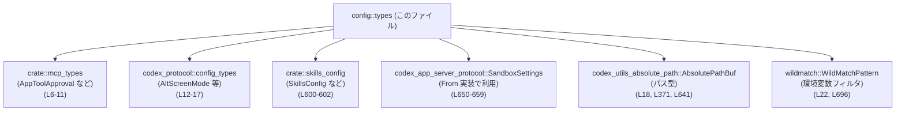
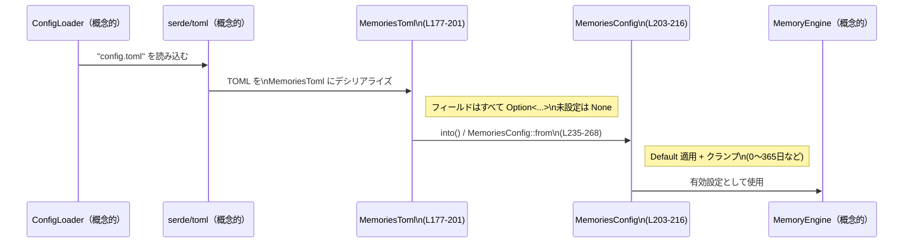

config/src/types.rs コード解説
================================

## 0. ざっくり一言

Codex の設定ファイル（主に `config.toml`）から読み込まれる値と、アプリ内部で使う「有効設定」を表現するための **各種設定用の型定義と、それらへの変換ロジック** をまとめたモジュールです（`//!` コメントと型一覧より: config/src/types.rs:L1-L4）。

---

## 1. このモジュールの役割

### 1.1 概要

- このモジュールは **Codex の各種機能（認証、メモリ、OTEL、TUI、サンドボックスなど）の設定を構造化して扱うための型** を定義します。
- 設定ファイルから直接デシリアライズされる `XXXToml` 型と、アプリ内部で利用する「有効設定」型（例: `MemoriesConfig`, `OtelConfig`, `ShellEnvironmentPolicy`）を分離し、**デフォルト値の適用や値のクランプ（範囲制限）** を行います（config/src/types.rs:L177-L216, L421-L429, L676-L725）。
- また、他モジュールの設定型を `pub use` で再公開し、設定関連の型を一箇所に集約するハブ的な役割も持ちます（config/src/types.rs:L6-L17, L600-L602）。

### 1.2 アーキテクチャ内での位置づけ

このモジュールは「設定の型レイヤー」として、他の設定読み込みロジックから利用されます。外部クレートや内部モジュールとの依存関係は概ね次の通りです。



- **外部依存**  
  - `AbsolutePathBuf`: 設定内で扱う絶対パス型に使用（config/src/types.rs:L18, L371, L641）。
  - `WildMatchPattern`: シェル環境変数名のフィルタパターンに利用（config/src/types.rs:L22, L696）。
  - `serde`, `schemars`: 設定のシリアライズ／デシリアライズと JSON スキーマ生成用（config/src/types.rs:L24-L26）。
- **内部依存**  
  - `mcp_types`, `skills_config`, `codex_app_server_protocol`: 設定値として他モジュールの型を利用・再公開します。

このモジュール自身は I/O やスレッドを扱わず、**純粋なデータ定義と変換処理のみ**を行います。

### 1.3 設計上のポイント

コードから読み取れる特徴をまとめます。

- **Toml 型と実効設定型の分離**  
  - `MemoriesToml` → `MemoriesConfig`（config/src/types.rs:L177-L201, L203-L268）
  - `OtelConfigToml` → `OtelConfig`（config/src/types.rs:L401-L419, L421-L441）
  - `ShellEnvironmentPolicyToml` → `ShellEnvironmentPolicy`（config/src/types.rs:L676-L694, L705-L755）  
  読み込み時に `Option<T>` を多用し、`From` 実装や `Default` 実装で **デフォルト値の適用・範囲制限** を行います。

- **安全側のデフォルトとクランプ処理**
  - `MemoriesConfig::from` では `clamp` や `min` を使い、日数等に上限・下限を設定（config/src/types.rs:L244-L263）。
  - `SandboxWorkspaceWrite` はネットワークアクセスや `/tmp` 書き込み許可がデフォルトで `false`（config/src/types.rs:L639-L647）。
  - 一方で `ShellEnvironmentPolicy` の `ignore_default_excludes` はデフォルト `true` で、環境変数のデフォルト除外を**スキップする側がデフォルト**になっています（config/src/types.rs:L705-L712, L758-L767）。

- **ビジネスロジックを避ける方針**
  - 冒頭コメントで「このファイルはビジネスロジックを含まないシンプルな struct/enum に限定すべき」と明記されています（config/src/types.rs:L3-L4）。
  - 実際のロジックは、デフォルト値の適用と単純なフィールド変換程度に留まっています。

- **言語特性の利用**
  - `Default`, `From`, `Deserialize` などのトレイト実装により、**型レベルで「常に妥当な設定状態」を表現**しやすくしています。
  - すべて安全な Rust（`unsafe` なし）で書かれており、このモジュール単体ではメモリ安全性・スレッド安全性の観点で特別な注意は見当たりません。

---

## 2. 主要な機能一覧

このモジュールが提供する主要な機能を一覧化します。

- 認証設定:
  - `AuthCredentialsStoreMode`, `OAuthCredentialsStoreMode` による CLI/MCP 資格情報の保存場所設定（ファイル／キーチェーン／メモリ）（config/src/types.rs:L39-L67）。
- OS/GUI 関連設定:
  - `WindowsToml`, `WindowsSandboxModeToml` による Windows サンドボックス設定（config/src/types.rs:L69-L83）。
  - `UriBasedFileOpener` による VSCode 等への URI ベースのファイルオープナー選択（config/src/types.rs:L85-L113）。
- 履歴とアナリティクス:
  - `History`, `HistoryPersistence` による履歴保存のオン／オフとサイズ制限（config/src/types.rs:L116-L136）。
  - `AnalyticsConfigToml`, `FeedbackConfigToml` による分析・フィードバック機能の有効化設定（config/src/types.rs:L140-L153）。
- ツールサジェスト:
  - `ToolSuggestConfig`, `ToolSuggestDiscoverable` による「発見可能なツール」の定義（config/src/types.rs:L155-L175）。
- メモリ機能:
  - `MemoriesToml` → `MemoriesConfig` によるスレッドメモリ機能のパラメータ制御（web 検索との相互作用、ロールアウト条件など）（config/src/types.rs:L177-L268）。
- アプリ・ツール設定:
  - `AppsDefaultConfig`, `AppConfig`, `AppToolConfig`, `AppToolsConfig`, `AppsConfigToml` によるアプリ／コネクタ単位のツール有効化・承認モード制御（config/src/types.rs:L270-L355）。
- OTEL（計測・トレース）設定:
  - `OtelHttpProtocol`, `OtelTlsConfig`, `OtelExporterKind`, `OtelConfigToml`, `OtelConfig` によるロギング・メトリクス・トレース exporter の選択と TLS 設定（config/src/types.rs:L357-L441）。
- TUI 通知・外観:
  - `Notifications`, `NotificationMethod`, `NotificationCondition`, `TuiNotificationSettings`, `ModelAvailabilityNuxConfig`, `Tui` による TUI 通知・アニメーション・ステータスラインなどの設定（config/src/types.rs:L443-L573）。
- Notice 管理:
  - `Notice` による各種警告／NUX（初回体験）表示の既読状態管理（config/src/types.rs:L579-L597）。
- プラグイン／マーケットプレイス:
  - `PluginConfig`, `MarketplaceConfig`, `MarketplaceSourceType` によるプラグイン／マーケットプレイス管理設定（config/src/types.rs:L604-L635）。
- サンドボックス／シェル環境:
  - `SandboxWorkspaceWrite` → `codex_app_server_protocol::SandboxSettings` によるサンドボックスの書き込み範囲・ネットワーク許可設定（config/src/types.rs:L637-L659）。
  - `ShellEnvironmentPolicyToml` → `ShellEnvironmentPolicy` によるシェル実行時の環境変数継承・フィルタ・上書きポリシー（config/src/types.rs:L676-L768）。

---

## 3. 公開 API と詳細解説

### 3.1 型一覧（構造体・列挙体など）

代表的な公開型と役割の一覧です（行番号は定義範囲）。

#### 再公開される型

| 名前 | 種別 | 役割 / 用途 | 定義場所（再エクスポート） |
|------|------|-------------|----------------------------|
| `AppToolApproval` | 外部型 | アプリツールの承認モード | config/src/types.rs:L6 |
| `McpServerConfig` など | 外部型 | MCP サーバ関連設定（有効／無効理由／トランスポートなど） | config/src/types.rs:L7-L11 |
| `AltScreenMode` ほか (`ApprovalsReviewer`, `ModeKind`, `Personality`, `ServiceTier`, `WebSearchMode`) | 外部型 | プロトコルレベルの設定種別 | config/src/types.rs:L12-L17 |
| `BundledSkillsConfig`, `SkillConfig`, `SkillsConfig` | 外部型 | スキル定義とバンドル設定 | config/src/types.rs:L600-L602 |

> これらの実体定義は他ファイルにあり、このチャンクからは詳細は分かりません。

#### 認証・OS 関連

| 名前 | 種別 | 役割 / 用途 | 場所 |
|------|------|-------------|------|
| `AuthCredentialsStoreMode` | enum | CLI 認証情報の保存場所（ファイル／キーチェーン／自動／プロセス内のみ） | config/src/types.rs:L39-L52 |
| `OAuthCredentialsStoreMode` | enum | MCP 資格情報の保存場所（Auto/File/Keyring） | config/src/types.rs:L54-L67 |
| `WindowsSandboxModeToml` | enum | Windows サンドボックスの昇格状態 | config/src/types.rs:L69-L74 |
| `WindowsToml` | struct | Windows 固有設定（サンドボックスモードと private desktop 使用） | config/src/types.rs:L76-L83 |
| `UriBasedFileOpener` | enum | VSCode など URI ベースファイルオープナーの選択 | config/src/types.rs:L85-L102 |

#### 履歴・アナリティクス・ツールサジェスト

| 名前 | 種別 | 役割 / 用途 | 場所 |
|------|------|-------------|------|
| `History` | struct | 履歴の永続化可否と最大サイズ | config/src/types.rs:L116-L126 |
| `HistoryPersistence` | enum | 履歴を保存するかどうかのポリシー | config/src/types.rs:L128-L136 |
| `AnalyticsConfigToml` | struct | アナリティクス有効フラグ | config/src/types.rs:L140-L146 |
| `FeedbackConfigToml` | struct | フィードバックフロー有効フラグ | config/src/types.rs:L148-L153 |
| `ToolSuggestDiscoverableType` | enum | サジェスト対象の種別（Connector/Plugin） | config/src/types.rs:L155-L160 |
| `ToolSuggestDiscoverable` | struct | サジェスト対象の種別と ID | config/src/types.rs:L162-L168 |
| `ToolSuggestConfig` | struct | サジェスト候補一覧 | config/src/types.rs:L170-L175 |

#### メモリ機能

| 名前 | 種別 | 役割 / 用途 | 場所 |
|------|------|-------------|------|
| `MemoriesToml` | struct | TOML から読み込むメモリ機能の生設定 | config/src/types.rs:L177-L201 |
| `MemoriesConfig` | struct | デフォルト適用後の有効メモリ設定 | config/src/types.rs:L203-L216 |

#### アプリ／ツール設定

| 名前 | 種別 | 役割 / 用途 | 場所 |
|------|------|-------------|------|
| `AppsDefaultConfig` | struct | 全アプリ共通のデフォルト設定 | config/src/types.rs:L270-L291 |
| `AppToolConfig` | struct | 単一ツール単位の有効／承認設定 | config/src/types.rs:L293-L304 |
| `AppToolsConfig` | struct | アプリ内ツール名 → `AppToolConfig` のマップ | config/src/types.rs:L306-L313 |
| `AppConfig` | struct | 単一アプリの有効フラグ・ツールポリシー・デフォルト承認設定 | config/src/types.rs:L315-L342 |
| `AppsConfigToml` | struct | TOML から読み込むアプリ設定の全体（`_default` + 各アプリ） | config/src/types.rs:L344-L355 |

#### OTEL 関連

| 名前 | 種別 | 役割 / 用途 | 場所 |
|------|------|-------------|------|
| `OtelHttpProtocol` | enum | OTLP HTTP のペイロード形式（Binary/Json） | config/src/types.rs:L359-L366 |
| `OtelTlsConfig` | struct | OTEL exporter 用の TLS 証明書パス群 | config/src/types.rs:L368-L375 |
| `OtelExporterKind` | enum | None / Statsig / OTLP HTTP / OTLP gRPC exporter の種類と設定 | config/src/types.rs:L377-L399 |
| `OtelConfigToml` | struct | TOML から読み込む OTEL 設定 | config/src/types.rs:L401-L419 |
| `OtelConfig` | struct | デフォルト適用後の OTEL 有効設定 | config/src/types.rs:L421-L429 |

#### TUI / 通知 / NUX

| 名前 | 種別 | 役割 / 用途 | 場所 |
|------|------|-------------|------|
| `Notifications` | enum | 通知のオン／オフ or カスタム通知コマンド列 | config/src/types.rs:L443-L448 |
| `NotificationMethod` | enum | TUI からの通知方法（auto/osc9/bel） | config/src/types.rs:L456-L463 |
| `NotificationCondition` | enum | 通知を unfocused のみ／常時行うか | config/src/types.rs:L475-L483 |
| `TuiNotificationSettings` | struct | TUI の通知に関する設定 | config/src/types.rs:L494-L510 |
| `ModelAvailabilityNuxConfig` | struct | モデル availability NUX の表示回数管理 | config/src/types.rs:L513-L518 |
| `Tui` | struct | TUI 全体設定（通知、アニメーション、ステータスライン等） | config/src/types.rs:L521-L573 |

#### Notice / プラグイン / マーケット / サンドボックス

| 名前 | 種別 | 役割 / 用途 | 場所 |
|------|------|-------------|------|
| `Notice` | struct | 各種警告・NUX 表示の既読状態等 | config/src/types.rs:L579-L597 |
| `PluginConfig` | struct | プラグインの有効フラグ | config/src/types.rs:L604-L609 |
| `MarketplaceConfig` | struct | マーケットプレイスのインストール元・最終更新時刻など | config/src/types.rs:L611-L628 |
| `MarketplaceSourceType` | enum | マーケットプレイスのソース種別（現在は git のみ） | config/src/types.rs:L631-L635 |
| `SandboxWorkspaceWrite` | struct | サンドボックス内の書き込み可能パスとネットワーク等 | config/src/types.rs:L637-L647 |

#### シェル環境ポリシー

| 名前 | 種別 | 役割 / 用途 | 場所 |
|------|------|-------------|------|
| `ShellEnvironmentPolicyInherit` | enum | シェル起動時にどの環境変数を継承するか（Core/All/None） | config/src/types.rs:L661-L674 |
| `ShellEnvironmentPolicyToml` | struct | TOML から読み込むシェル環境ポリシー | config/src/types.rs:L676-L694 |
| `EnvironmentVariablePattern` | type alias | `WildMatchPattern` による環境変数名のワイルドカードパターン | config/src/types.rs:L696 |
| `ShellEnvironmentPolicy` | struct | デフォルト・フィルタ・上書きを適用した有効ポリシー | config/src/types.rs:L705-L725 |

### 3.2 関数詳細（主要 7 件）

ここでは「デフォルトや変換を行うロジック」を中心に 7 件を解説します。

---

#### `UriBasedFileOpener::get_scheme(&self) -> Option<&str>`

**定義場所**: config/src/types.rs:L104-L113  

**概要**

- `UriBasedFileOpener` のバリアントに対応する URI スキーム文字列（例: `"vscode"`）を返します。
- `None` バリアントの場合は `None` を返し、URI ベースのオープナーを無効化します。

**引数**

| 引数名 | 型 | 説明 |
|--------|----|------|
| `&self` | `&UriBasedFileOpener` | 現在のオープナー種別 |

**戻り値**

- `Option<&str>`  
  - `Some("vscode")` など: 対応するスキーム名。  
  - `None`: `UriBasedFileOpener::None` の場合で、URI を使ったオープンを行わないことを示唆します。

**内部処理の流れ**

1. `match self` で各バリアントを分岐（config/src/types.rs:L106-L111）。
2. 各バリアントに対応するリテラル文字列を `Some("...")` として返す。
3. `None` バリアントのみ `None` を返す。

**Examples（使用例）**

URI を生成してエディタにファイルを開かせる例です。

```rust
// 設定から UriBasedFileOpener を取得したと仮定する                     // ここでは VSCode を使う想定
let opener = UriBasedFileOpener::VsCode;                                  // VSCode バリアントを選択

if let Some(scheme) = opener.get_scheme() {                               // スキームがある場合のみ
    // "vscode://file/path/to/file.rs:10" のような URI を組み立てる
    let uri = format!("{scheme}://file/{}:{}", "/path/to/file.rs", 10);   // scheme を文字列組み込み
    // 実際の URI 起動処理はこのモジュール外（不明）                    // このファイルには起動ロジックはない
    println!("Open via: {uri}");
} else {
    // None の場合は URI ベースのオープンを行わない                      // 無効化されているケース
}
```

**Errors / Panics**

- この関数自体は `Result` を返さず、`panic!` を行うコードもありません。
- 返り値の `Option` を無視すると「オープナーが無効化されている」ケースのハンドリング漏れが起こり得ます。

**Edge cases（エッジケース）**

- `UriBasedFileOpener::None` のとき `None` を返します（config/src/types.rs:L110-L111）。  
  呼び出し側がこれを考慮しないと、「何も起きない」ように見える状態になります。

**使用上の注意点**

- 返り値が `None` の場合を必ず考慮する必要があります。
- 新しいエディタ種別を enum に追加する場合は、この関数も忘れずに更新する必要があります。

---

#### `impl From<MemoriesToml> for MemoriesConfig`（`fn from(toml: MemoriesToml) -> MemoriesConfig`）

**定義場所**: config/src/types.rs:L235-L268  

**概要**

- TOML から読み込んだオプション付き設定 `MemoriesToml` から、**デフォルト値と制約を適用した `MemoriesConfig` を生成**します。
- 不適切な値（極端に大きい値や負値）をクランプ／上限設定することで、メモリ機能が安全に動作するよう調整します。

**引数**

| 引数名 | 型 | 説明 |
|--------|----|------|
| `toml` | `MemoriesToml` | 設定ファイルからデシリアライズされたメモリ設定（すべて `Option`） |

**戻り値**

- `MemoriesConfig`  
  - すべてのフィールドが非 `Option` で、利用可能な状態の設定値。

**内部処理の流れ**

1. `let defaults = Self::default();` で `MemoriesConfig::default()` を取得（config/src/types.rs:L237, L218-L233）。
2. 各フィールドについて、`toml` 側の値が `Some` ならそれを、`None` なら `defaults` の値を使う。
3. さらに一部フィールドには制約を適用（config/src/types.rs:L244-L263）:
   - `max_raw_memories_for_consolidation`: `.min(4096)` で上限 4096 に制限。
   - `max_unused_days`: `.clamp(0, 365)` で 0〜365 に制限。
   - `max_rollout_age_days`: `.clamp(0, 90)` で 0〜90 に制限。
   - `max_rollouts_per_startup`: `.min(128)` で上限 128 に制限。
   - `min_rollout_idle_hours`: `.clamp(1, 48)` で 1〜48 時間に制限。
4. モデル名フィールドはそのまま `Option<String>` としてコピー（config/src/types.rs:L264-L265）。

**Examples（使用例）**

TOML から読み込んだ設定に対して有効設定を作る例です。

```rust
// TOML から MemoriesToml を読み込んだと仮定する                             // どこかで serde + toml クレートを使っている想定
let toml_settings: MemoriesToml = /* ... */;                                    // 読み込まれたオプション付き設定

// From トレイトにより、into() で MemoriesConfig に変換できる                 // Self::from(toml) が呼ばれる
let effective: MemoriesConfig = toml_settings.into();                           // デフォルトとクランプ適用済み設定

// 例: 上限 4096 を超える場合は 4096 に丸められている                         // 入力値がわからなくても安全な範囲内
println!(
    "max_raw_memories_for_consolidation = {}",
    effective.max_raw_memories_for_consolidation
);
```

**Errors / Panics**

- `Result` を返さず、関数内に明示的な `panic!` はありません。
- すべての異常／極端な値に対しては、**エラーにせずクランプやデフォルト適用で吸収**する設計です。
  - 例: 負の `max_unused_days` は 0 に丸められます（config/src/types.rs:L248-L251）。

**Edge cases（エッジケース）**

- `toml` の各フィールドが `None` の場合:
  - `MemoriesConfig::default()`（config/src/types.rs:L218-L233）で定義された値が使用されます。
- **極端に大きい値**:
  - `max_raw_memories_for_consolidation = 1000000` → 有効設定では 4096 になります。
  - `max_rollouts_per_startup = 1000` → 有効設定では 128 になります。
- **負の値**（i64 フィールド）:
  - `max_unused_days = -10` → `clamp(0, 365)` により 0 になります。
  - `min_rollout_idle_hours = 0` → `clamp(1, 48)` により 1 になります。

**使用上の注意点**

- 読み込み時に「バリデーションエラー」にしたい場合でも、この層ではエラーを返さず丸め込みます。  
  → エラーとして扱いたい値は **別レイヤーで検査**する必要があります。
- 上限値やクランプ範囲（4096, 365, 90, 128, 1〜48 等）は本実装にハードコードされているため、仕様変更時はここを確認する必要があります。

---

#### `impl Default for OtelConfig`（`fn default() -> OtelConfig`）

**定義場所**: config/src/types.rs:L431-L441  

**概要**

- `OtelConfig` のデフォルト値を定義します。
- ログ／トレース exporter は無効、メトリクス exporter のみ `Statsig` をデフォルト有効にし、環境名は `"dev"` に設定します。

**引数**

- なし（関連関数 `OtelConfig::default()` として呼び出されます）。

**戻り値**

- `OtelConfig`  
  - `log_user_prompt: false`  
  - `environment: DEFAULT_OTEL_ENVIRONMENT` (`"dev"`)  
  - `exporter: OtelExporterKind::None`  
  - `trace_exporter: OtelExporterKind::None`  
  - `metrics_exporter: OtelExporterKind::Statsig`

**内部処理の流れ**

1. `DEFAULT_OTEL_ENVIRONMENT`（`"dev"`）を `to_owned()` して環境名に設定（config/src/types.rs:L435）。
2. それ以外のフィールドに、上記の固定バリアントを代入し `OtelConfig` を返します（config/src/types.rs:L433-L439）。

**Examples（使用例）**

```rust
// TOML に OTEL 設定が無い場合などにデフォルトを利用する                       // デフォルト環境は "dev"
let otel_config = OtelConfig::default();                                        // Default トレイトから作成

println!("env = {}", otel_config.environment);                                  // "dev"
```

**Errors / Panics**

- エラーやパニックを起こす操作は含まれていません。

**Edge cases（エッジケース）**

- 特定のエッジケースはなく、常に同じ固定値を返します。

**使用上の注意点**

- 「metrics のみデフォルト有効」にする設計になっています。  
  トレースやログ exporter をデフォルト有効にしたい場合、この実装を変更する必要があります。

---

#### `impl From<SandboxWorkspaceWrite> for codex_app_server_protocol::SandboxSettings`

**定義場所**: config/src/types.rs:L650-L659  

**概要**

- `SandboxWorkspaceWrite` で表現されたサンドボックス設定を、`codex_app_server_protocol::SandboxSettings` に変換します。
- 主に **Serde で読み込んだ設定を RPC 用のプロトコル型へマッピング**する役割です。

**引数**

| 引数名 | 型 | 説明 |
|--------|----|------|
| `sandbox_workspace_write` | `SandboxWorkspaceWrite` | 設定ファイル由来のサンドボックス設定 |

**戻り値**

- `codex_app_server_protocol::SandboxSettings`  
  - 各フィールドに `Some(...)` を設定し、`writable_roots` はそのままコピーされます（config/src/types.rs:L652-L656）。

**内部処理の流れ**

1. 受け取った `SandboxWorkspaceWrite` から各フィールドを取り出す（config/src/types.rs:L651-L656）。
2. `SandboxSettings` の対応するフィールドにコピー:
   - `writable_roots`: そのまま移動。
   - `network_access`: `Some(sandbox_workspace_write.network_access)` として `Option<bool>` に変換。
   - `exclude_tmpdir_env_var`, `exclude_slash_tmp` も同様に `Some(...)` 化。

**Examples（使用例）**

```rust
// TOML から SandboxWorkspaceWrite を読み込んだと仮定                        // serde を使って構築される
let sandbox_cfg: SandboxWorkspaceWrite = SandboxWorkspaceWrite {
    writable_roots: vec![AbsolutePathBuf::from("/workspace")],               // 書き込み許可ディレクトリ
    network_access: false,                                                  // ネットワークアクセス禁止
    exclude_tmpdir_env_var: true,                                           // TMPDIR を除外
    exclude_slash_tmp: true,                                                // /tmp を除外
};

// プロトコル型へ変換（From トレイト）                                        // into() で SandboxSettings に変換
let sandbox_settings: codex_app_server_protocol::SandboxSettings =
    sandbox_cfg.into();
```

**Errors / Panics**

- 変換処理は単純なフィールドコピーと `Some` 包みのみであり、エラーやパニックは発生しません。

**Edge cases（エッジケース）**

- `SandboxWorkspaceWrite` 側は `#[serde(default)]` により、未設定の場合:
  - `writable_roots` → 空ベクタ。
  - `network_access`/`exclude_tmpdir_env_var`/`exclude_slash_tmp` → `false`。  
  その結果、`SandboxSettings` 側ではこれらが `Some(false)` になります。

**使用上の注意点**

- `SandboxSettings` 型の実装はこのチャンクにないため、`None` と `Some(false)` の意味の違いは不明です。  
  → 「明示的に無効」を表現したいのか、「デフォルトに委ねる」のかは `SandboxSettings` の仕様に依存します。
- セキュリティ的には、`network_access` や `/tmp` 書き込みのデフォルトが `false` になっている点は安全側の初期値です。

---

#### `impl From<ShellEnvironmentPolicyToml> for ShellEnvironmentPolicy`

**定義場所**: config/src/types.rs:L727-L755  

**概要**

- TOML から読み込んだ `ShellEnvironmentPolicyToml` を、**環境変数名のワイルドカードパターンを解決した `ShellEnvironmentPolicy`** に変換します。
- シェルツール実行時の `env` 構築ポリシー（継承範囲、除外パターン、上書き値、include-only パターン、profile 使用）を統合します。

**引数**

| 引数名 | 型 | 説明 |
|--------|----|------|
| `toml` | `ShellEnvironmentPolicyToml` | TOML からデシリアライズされた設定 |

**戻り値**

- `ShellEnvironmentPolicy`  
  - すべてのフィールドが `Option` ではない形に確定したポリシー。

**内部処理の流れ**

1. `inherit` の決定（config/src/types.rs:L729-L731）:
   - `toml.inherit.unwrap_or(ShellEnvironmentPolicyInherit::All)`  
     → 設定がなければ「親プロセスの全環境を継承 (`All`)」。
2. `ignore_default_excludes` の決定（config/src/types.rs:L731）:
   - `toml.ignore_default_excludes.unwrap_or(true)`  
     → 未指定時は **「デフォルト除外パターンの適用をスキップする」**（`true`）。
3. `exclude` リストの構築（config/src/types.rs:L732-L737）:
   - `toml.exclude.unwrap_or_default().into_iter()` で `Vec<String>` を取得。
   - 各文字列から `EnvironmentVariablePattern::new_case_insensitive(&s)` を生成。
   - `collect()` で `Vec<EnvironmentVariablePattern>` にまとめる。
4. `r#set` の決定（config/src/types.rs:L738）:
   - `toml.r#set.unwrap_or_default()` で `HashMap<String, String>` を取得。
5. `include_only` リストの構築（config/src/types.rs:L739-L744）:
   - `exclude` と同様に、`Option<Vec<String>>` をパターンに変換。
6. `use_profile` の決定（config/src/types.rs:L745）:
   - `toml.experimental_use_profile.unwrap_or(false)` で未指定時は `false`。

**Examples（使用例）**

シェルツールの環境変数から、秘密情報を除外しつつ一部変数だけ残す設定の例です。

```rust
// TOML から ShellEnvironmentPolicyToml を読み込んだと仮定                      // 例: [shell_environment_policy] テーブル
let toml_policy = ShellEnvironmentPolicyToml {
    inherit: Some(ShellEnvironmentPolicyInherit::All),                        // 全環境を継承
    ignore_default_excludes: Some(false),                                     // "*KEY*" などのデフォルト除外を有効化
    exclude: Some(vec!["*_DEBUG".into()]),                                    // DEBUG 系を除外
    r#set: Some(HashMap::from([("FOO".into(), "BAR".into())])),               // FOO=BAR を上書き
    include_only: Some(vec!["PATH".into(), "FOO".into()]),                    // PATH と FOO のみ最終的に残す
    experimental_use_profile: Some(true),                                     // プロファイル経由でシェル実行
};

// 有効ポリシーへ変換
let policy: ShellEnvironmentPolicy = toml_policy.into();                      // パターンは WildMatchPattern に変換済み
```

**Errors / Panics**

- `Result` を返さず、明示的な `panic!` もありません。
- `EnvironmentVariablePattern::new_case_insensitive` の内部実装はこのチャンクからは不明ですが、戻り値が `Result` ではなく直接値なので、エラーを表現する手段はありません。

**Edge cases（エッジケース）**

- `inherit` 未設定:
  - 自動的に `ShellEnvironmentPolicyInherit::All` になり、**すべての環境変数を継承**します（config/src/types.rs:L729-L731）。
- `ignore_default_excludes` 未設定:
  - `true` になり、「`*KEY*`, `*SECRET*`, `*TOKEN*` を含む変数名を除外する既定のフィルタ」をスキップすることになります（コメント: config/src/types.rs:L698-L704, デフォルト値: L731, L758-L767）。
- `exclude` / `include_only` 未設定:
  - 空リストとして扱われ、対応するフィルタ段階は実質的にスキップされます。
- 非常に長いまたは多数のパターン:
  - メモリ使用やフィルタの計算コストが増加しますが、このモジュール内での制限は行っていません。

**使用上の注意点**

- コメントでは `exclude` / `include_only` を「List of regular expressions」と記述していますが、実際には `WildMatchPattern` による **ワイルドカードマッチング** が行われます（config/src/types.rs:L685-L691, L696）。  
  正規表現ではない点に注意が必要です。
- セキュリティ観点では、`ignore_default_excludes` のデフォルトが `true` であるため、特に指定しないと秘密情報を含む環境変数（`*KEY*`, `*SECRET*`, `*TOKEN*`）がそのまま渡される可能性があります。  
  安全側に倒したい場合は、TOML 側で `ignore_default_excludes = false` と明示する必要があります。

---

#### `impl Default for ShellEnvironmentPolicy`（`fn default() -> ShellEnvironmentPolicy`）

**定義場所**: config/src/types.rs:L758-L768  

**概要**

- `ShellEnvironmentPolicy` のデフォルト値を定義します。
- TOML 側の設定が全くない場合に適用される **基底ポリシー** です。

**引数**

- なし。

**戻り値**

- `ShellEnvironmentPolicy`  
  - `inherit: All`  
  - `ignore_default_excludes: true`  
  - `exclude: []`  
  - `r#set: {}`  
  - `include_only: []`  
  - `use_profile: false`

**内部処理の流れ**

- 各フィールドに上記の固定値を代入した構造体を返します（config/src/types.rs:L760-L767）。

**Examples（使用例）**

```rust
// シェル環境ポリシーが設定されていない場合に Default を利用                 // 既定では全環境変数を継承
let default_policy = ShellEnvironmentPolicy::default();

assert!(matches!(
    default_policy.inherit,
    ShellEnvironmentPolicyInherit::All
));                                                                             // All が選ばれている
```

**Errors / Panics**

- エラーやパニックはありません。

**Edge cases（エッジケース）**

- 特定のエッジケースはなく、常に同じ固定値を返します。
- ただし、`ignore_default_excludes: true` という値は、コメントに記載された「デフォルト除外」を**デフォルトで無効化**することを意味します（config/src/types.rs:L710-L712, L761-L762）。

**使用上の注意点**

- セキュアなデフォルトを求める場合、`ignore_default_excludes` の初期値はアプリ全体のポリシーと合致しているか検討が必要です。
- TOML 側の `ShellEnvironmentPolicyToml` と `Default` 実装の食い違いがないかを確認することが重要です。

---

#### `impl Default for Notifications`（`fn default() -> Notifications`）

**定義場所**: config/src/types.rs:L450-L454  

**概要**

- `Notifications` のデフォルトを `Enabled(true)` に設定します。
- TUI 通知が特に設定されていない場合に、デスクトップ通知を有効にする挙動になります（`TuiNotificationSettings` の `#[serde(default)]` と併用: config/src/types.rs:L496-L500）。

**引数**

- なし。

**戻り値**

- `Notifications::Enabled(true)`。

**内部処理の流れ**

- `Self::Enabled(true)` を直接返すだけです（config/src/types.rs:L451-L453）。

**Examples（使用例）**

```rust
// TUI 設定が TOML に存在しない場合などに Default が用いられる
let notifications = Notifications::default();                                   // Enabled(true)

if let Notifications::Enabled(flag) = notifications {
    println!("Notifications enabled: {}", flag);                                // true
}
```

**Errors / Panics**

- エラーやパニックはありません。

**Edge cases（エッジケース）**

- 常に `Enabled(true)` を返すため、カスタムコマンド形式（`Custom(Vec<String>)`）にはなりません。
- TOML で `notifications = false` などと明示しない限り通知は有効になります。

**使用上の注意点**

- 通知をデフォルトで無効にしたい場合は、この `Default` 実装の変更が必要になります。
- TUI 設定周りでは `#[serde(default)]` が多用されているため、構造体の Default と Serde のデフォルト値が一貫しているかを確認することが大切です。

---

### 3.3 その他の関数・メソッド

上記以外の関数やメソッドは、以下のような補助的・定数的な役割を持ちます。

| 関数/メソッド名 | 役割 | 場所 |
|-----------------|------|------|
| `const fn default_enabled() -> bool` | 各設定での `enabled` のデフォルト値を `true` として共有 | config/src/types.rs:L35-L37 |
| `const fn default_true() -> bool` | TUI の `animations` / `show_tooltips` 等で用いる `true` デフォルト | config/src/types.rs:L575-L577 |
| `impl Default for MemoriesConfig::default()` | メモリ機能のデフォルト設定（クランプ前の基準値） | config/src/types.rs:L218-L233 |
| `impl fmt::Display for NotificationMethod` | `auto` / `osc9` / `bel` の文字列表現を返す | config/src/types.rs:L465-L472 |
| `impl fmt::Display for NotificationCondition` | `unfocused` / `always` の文字列表現を返す | config/src/types.rs:L485-L491 |

Display 実装はすべて単純な `match` と `write!` 呼び出しであり、`fmt::Result` のエラーはフォーマッタ側から伝播します。

---

## 4. データフロー

ここでは代表例として「TOML からメモリ設定を読み込み、有効設定として使用する」フローを示します。

### 4.1 概要

1. 外部の設定ローダが `config.toml` を読み込み、`MemoriesToml` にデシリアライズします（`serde` 利用、実装はこのチャンクにはありません）。
2. `MemoriesToml` を `MemoriesConfig` に変換し（`From` 実装: config/src/types.rs:L235-L268）、デフォルト／クランプを適用します。
3. アプリケーションのメモリ機能コンポーネントが `MemoriesConfig` を利用します。

### 4.2 シーケンス図



> `ConfigLoader` や `MemoryEngine` はこのモジュール外の概念的コンポーネントです。  
> 実際の型名・実装はこのチャンクには現れません。

---

## 5. 使い方（How to Use）

### 5.1 基本的な使用方法

設定ファイルから TOML を読み込み、このモジュールの型を通して有効設定を得るのが典型的な使い方です。

```rust
use serde::Deserialize;                                                    // TOML デシリアライズ用
use std::fs;                                                               // ファイル読み込み用

// 設定ファイル全体の一部として MemoriesToml が埋め込まれていると仮定         // ここでは簡略化のため MemoriesToml のみ
#[derive(Deserialize)]
struct ConfigFile {
    #[serde(default)]
    memories: MemoriesToml,                                                // 未設定ならデフォルトの空 MemoriesToml
}

fn load_config(path: &str) -> Result<MemoriesConfig, Box<dyn std::error::Error>> {
    let text = fs::read_to_string(path)?;                                  // TOML ファイルを読み込む
    let config_file: ConfigFile = toml::from_str(&text)?;                  // TOML を構造体にデシリアライズ

    // MemoriesToml から有効設定へ
    let memories_cfg: MemoriesConfig = config_file.memories.into();        // From 実装が呼ばれる

    Ok(memories_cfg)                                                       // 呼び出し元に返す
}
```

### 5.2 よくある使用パターン

1. **TUI 通知設定の利用**

```rust
// TOML から Tui 設定を読み込んだと仮定                                        // #[serde(default)] により未設定は Default
let tui_cfg: Tui = /* ... */;

match tui_cfg.notification_settings.notifications {
    Notifications::Enabled(flag) => {
        // flag が true のときデスクトップ通知を有効化
    }
    Notifications::Custom(commands) => {
        // commands で定義されたカスタム通知コマンドを実行する（実装は別）
    }
}
```

1. **シェルツールの環境ポリシー適用**

```rust
// TOML から ShellEnvironmentPolicyToml を取得
let toml_policy: ShellEnvironmentPolicyToml = /* ... */;

// 有効ポリシーへ変換
let policy: ShellEnvironmentPolicy = toml_policy.into();

// 以降、プロセス起動時に policy に従って env を構築する                   // 実際の env 構築ロジックは別モジュール
```

### 5.3 よくある間違い

```rust
// 間違い例: ignore_default_excludes を指定し忘れる                         // シークレットのデフォルト除外が無効のまま
let toml_policy = ShellEnvironmentPolicyToml {
    inherit: None,
    ignore_default_excludes: None,                                          // デフォルトで true になる
    exclude: None,
    r#set: None,
    include_only: None,
    experimental_use_profile: None,
};

// 正しい例: デフォルト除外を有効にする
let toml_policy = ShellEnvironmentPolicyToml {
    inherit: None,
    ignore_default_excludes: Some(false),                                   // "*KEY*" 等を除外する
    exclude: None,
    r#set: None,
    include_only: None,
    experimental_use_profile: None,
};
```

### 5.4 使用上の注意点（まとめ）

- このモジュールの変換処理は **基本的に失敗しない（Result を返さない）設計** です。  
  →「設定が不正なら起動エラーにしたい」といった要件は、別途バリデーション層を設ける必要があります。
- シェル環境ポリシーにおいて、秘密情報を含む環境変数の除外は **デフォルトで無効** になっています（`ignore_default_excludes = true`）。  
  セキュリティ要件に応じて TOML 側で明示設定することが重要です。
- URI ベースのファイルオープナー（`UriBasedFileOpener`）は `None` バリアントで無効化されます。呼び出し側は `Option` を適切に扱う必要があります。

---

## 6. 変更の仕方（How to Modify）

### 6.1 新しい機能を追加する場合

たとえば、メモリ機能に新しいパラメータ `max_threads` を追加する場合のステップ例です。

1. **Toml 型にフィールド追加**
   - `MemoriesToml` に `pub max_threads: Option<u32>,` を追加（config/src/types.rs:L177-L201 付近）。
2. **有効設定型にフィールド追加**
   - `MemoriesConfig` に `pub max_threads: u32,` を追加（config/src/types.rs:L203-L216）。
3. **`Default` 実装更新**
   - `MemoriesConfig::default()` に `max_threads` の基準値を追加（config/src/types.rs:L218-L233）。
4. **`From<MemoriesToml>` 実装更新**
   - `MemoriesToml` から `MemoriesConfig` への変換ロジック内で、`unwrap_or(defaults.max_threads)` やクランプ処理を追加（config/src/types.rs:L235-L268）。
5. **スキーマとテストの更新**
   - `JsonSchema` の自動生成によりスキーマは基本的に更新されますが、利用側の期待と整合しているか確認します。
   - `types_tests.rs`（config/src/types.rs:L771-L773）で該当箇所のテストを追加します（テスト内容はこのチャンクには現れません）。

### 6.2 既存の機能を変更する場合

- **影響範囲の確認**
  - 変更したい型の利用箇所を `rg`/`grep` 等で検索し、他モジュールへの影響を確認します。
  - 特に `From` や `Default` を変更する場合、**呼び出し側が暗黙に依存しているデフォルト値／クランプ範囲** が変わるため注意が必要です。
- **契約の維持**
  - 例: `MemoriesConfig::from` が「常に 0〜365 日にクランプする」という事実に依存するコードがあれば、その前提が崩れないようにするか、呼び出し側も同時に更新します。
- **テストの確認**
  - `mod tests;` で参照されている `types_tests.rs` に、変更に対応するテストケースがあるか／追加が必要か確認します。

---

## 7. 関連ファイル

このモジュールと特に関係が深いファイル・モジュールです。

| パス / モジュール | 役割 / 関係 |
|-------------------|------------|
| `crate::mcp_types` | `AppToolApproval`, `McpServerConfig` など、MCP 関連設定型を提供し、このファイルで `pub use` されています（config/src/types.rs:L6-L11）。 |
| `codex_protocol::config_types` | `AltScreenMode` など TUI やモード関連の共通設定型を提供し、このファイルで再公開されています（config/src/types.rs:L12-L17）。 |
| `crate::skills_config` | スキル／バンドル設定型を提供し、`SkillsConfig` 等が再公開されています（config/src/types.rs:L600-L602）。 |
| `codex_app_server_protocol::SandboxSettings` | `SandboxWorkspaceWrite` からの `From` 変換先として利用されます（config/src/types.rs:L650-L659）。定義はこのチャンクにはありません。 |
| `codex_utils_absolute_path` | 設定で使用する絶対パス型 `AbsolutePathBuf` を提供します（config/src/types.rs:L18, L371, L641）。 |
| `wildmatch` | 環境変数名のワイルドカードフィルタ `EnvironmentVariablePattern` を提供します（config/src/types.rs:L22, L696）。 |
| `config/src/types_tests.rs` | `#[cfg(test)] mod tests;` から参照されるテストモジュールです（config/src/types.rs:L771-L773）。内容はこのチャンクには現れません。 |

このモジュールは、設定値の「型」と「デフォルト・クランプロジック」を集中管理するための基盤となっており、実際のビジネスロジックや I/O を行うモジュールから広く利用される前提の構造になっています。
