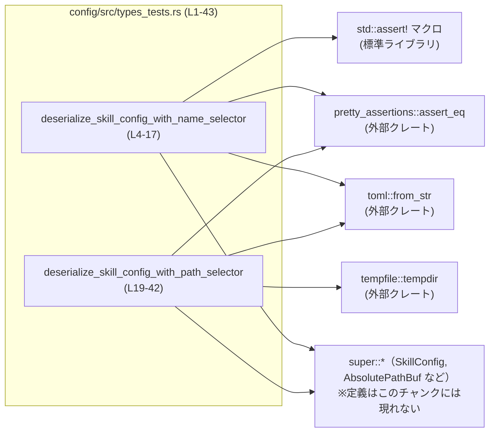
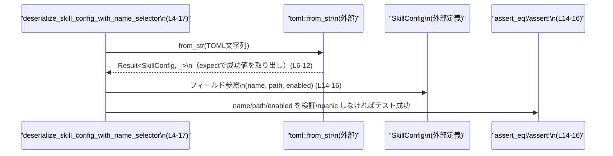
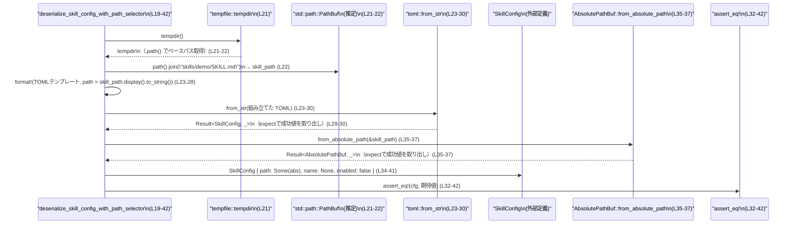

# config/src/types_tests.rs コード解説

## 0. ざっくり一言

`SkillConfig` 型の TOML デシリアライズ挙動を検証するためのテストコードです。名前指定とパス指定の 2 パターンについて、フィールドの値が期待通りにセットされることを確認しています（config/src/types_tests.rs:L4-17,19-42）。

---

## 1. このモジュールの役割

### 1.1 概要

- このファイルは、設定モジュール（`super::*`）で定義されている `SkillConfig` のデシリアライズロジックが期待どおりであることを確認するための **単体テスト** を提供します（config/src/types_tests.rs:L1,4,19）。
- TOML 文字列から `SkillConfig` に変換した結果について、
  - **名前セレクタのみ指定された場合**（`name` フィールド）（config/src/types_tests.rs:L6-16）
  - **パスセレクタのみ指定された場合**（`path` フィールド）（config/src/types_tests.rs:L23-42）
  の 2 ケースを検証します。

### 1.2 アーキテクチャ内での位置づけ

このファイルは `config` クレート（またはモジュール）内のテストモジュールであり、上位モジュール（`super::*`）で定義された型と、外部クレートを組み合わせてテストを構成しています（config/src/types_tests.rs:L1-2）。

主な依存関係を図示すると次のようになります。



- `super::*` から `SkillConfig` および `AbsolutePathBuf` がインポートされていることが、構造体リテラルと関連メソッド呼び出しから分かります（config/src/types_tests.rs:L1,6,23,34-38）。
- `pretty_assertions::assert_eq` を利用して差分の見やすい `assert_eq!` を使用しています（config/src/types_tests.rs:L2,14-15,32-42）。
- `toml::from_str` で TOML 文字列を `SkillConfig` にデシリアライズしています（config/src/types_tests.rs:L6-12,23-30）。
- パス指定テストでは、一時ディレクトリを `tempfile::tempdir()` で生成し、そこからパスを構築しています（config/src/types_tests.rs:L21-22）。

### 1.3 設計上のポイント

コードから読み取れる設計上の特徴は次のとおりです。

- **責務の分割**  
  - 本ファイルは **テスト専用** であり、設定の定義や実装は上位モジュールに任せ、ここでは **デシリアライズ結果の検証のみ** を行っています（config/src/types_tests.rs:L1,4,19）。
- **状態の扱い**  
  - 各テストはローカル変数のみを使用しており、グローバル状態や共有可変状態は持っていません（config/src/types_tests.rs:L5-16,20-42）。
  - パス指定テストでは `tempfile::tempdir()` の返す一時ディレクトリをローカルに保持し、そのスコープ内でのみ利用します（config/src/types_tests.rs:L21-22）。
- **エラーハンドリング方針**  
  - デシリアライズやパス変換の失敗は `expect` により **即座に panic させる** 方針です。これはテストコードとして典型的で、失敗時に原因を明示したいという意図が読み取れます（config/src/types_tests.rs:L11-12,29-30,36-37）。
- **型安全性**  
  - `SkillConfig` に対して直接フィールドアクセス（`name`, `path`, `enabled`）や構造体リテラルでの比較を行っており、フィールドと型の整合性をコンパイル時にチェックできる形になっています（config/src/types_tests.rs:L14-16,34-41）。

---

## 2. 主要な機能一覧（コンポーネントインベントリー）

このファイルで定義されている関数（テスト）とその役割の一覧です。

| 名前 | 種別 | 役割 / 用途 | 定義位置 |
|------|------|-------------|----------|
| `deserialize_skill_config_with_name_selector` | テスト関数 | `name` フィールドのみを持つ TOML 文字列が `SkillConfig` に正しくデシリアライズされ、`name` が `"github:yeet"`, `path` が `None`, `enabled` が `false` になることを検証します。 | `config/src/types_tests.rs:L4-17` |
| `deserialize_skill_config_with_path_selector` | テスト関数 | `path` フィールドのみを持つ TOML 文字列が `SkillConfig` に正しくデシリアライズされ、`path` に期待した `AbsolutePathBuf` が入り、`name` が `None`, `enabled` が `false` になることを検証します。 | `config/src/types_tests.rs:L19-42` |

---

## 3. 公開 API と詳細解説

このファイル自身は公開 API を定義していませんが、テストを通じて外部型の使われ方が分かります。

### 3.1 型一覧（構造体・列挙体など）

このファイル内で **利用されている** 主要な型をまとめます（定義自体は `super::*` 側にあります）。

| 名前 | 種別 | 役割 / 用途 | このファイル内での利用箇所 |
|------|------|-------------|----------------------------|
| `SkillConfig` | 構造体（外部定義） | スキルの設定を表す型です。少なくとも `name`, `path`, `enabled` の 3 フィールドを持ち、`toml::from_str` のデシリアライズ対象になっています。また、`PartialEq` を実装しており、構造体リテラルとの比較に使用されています。 | `config/src/types_tests.rs:L6-16,23-30,34-41` |
| `AbsolutePathBuf` | 構造体（外部定義） | 絶対パスを表現するバッファ型であると考えられますが、詳細はこのチャンクには現れません。`from_absolute_path(&Path)` の戻り値として使用されています。 | `config/src/types_tests.rs:L35-38` |

> 補足: `SkillConfig` および `AbsolutePathBuf` の定義そのもの（フィールド型やメソッドの実装）は、このファイルには含まれていません。

### 3.2 関数詳細

#### `deserialize_skill_config_with_name_selector()`

**概要**

`name` フィールドのみを含む TOML 文字列を `SkillConfig` にデシリアライズし、各フィールドが期待どおりの値になることを検証するテストです（config/src/types_tests.rs:L4-17）。

**引数**

- なし（テスト関数のため、引数は取りません）。

**戻り値**

- 戻り値は `()` です（テスト関数の標準的な形）。（型は明示されていませんが、戻り値を返さない `fn` は `()` を返すとみなされます。config/src/types_tests.rs:L5-17）

**内部処理の流れ**

1. `toml::from_str` を呼び出し、埋め込み TOML 文字列から `SkillConfig` を生成します（config/src/types_tests.rs:L6-12）。
   - TOML 文字列は原文で次のような内容です（インデントは無視されます）（config/src/types_tests.rs:L7-10）。

     ```toml
     name = "github:yeet"
     enabled = false
     ```

   - 返り値に対して `.expect("should deserialize skill config with name selector")` を呼んでおり、デシリアライズが失敗した場合は panic します（config/src/types_tests.rs:L11-12）。
2. デシリアライズされた `cfg: SkillConfig` に対し、フィールドごとのアサーションを行います（config/src/types_tests.rs:L14-16）。
   - `cfg.name.as_deref()` が `Some("github:yeet")` であることを `assert_eq!` で検証します（config/src/types_tests.rs:L14）。
   - `cfg.path` が `None` であることを検証します（config/src/types_tests.rs:L15）。
   - `cfg.enabled` が `false` であることを `assert!(!cfg.enabled)` で検証します（config/src/types_tests.rs:L16）。

**Examples（使用例）**

テスト内のコードはそのまま `SkillConfig` のデシリアライズ使用例にもなっています。簡略化した例を示します。

```rust
// SkillConfig の定義や toml クレートの依存は別途必要です。
use toml;                         // toml クレートをインポートする
// use crate::SkillConfig;        // 実際の定義位置に応じて適宜インポート

fn load_skill_from_str() {
    // TOML 文字列から SkillConfig をデシリアライズする
    let cfg: SkillConfig = toml::from_str(
        r#"
            name = "github:yeet"
            enabled = false
        "#,
    )
    .expect("failed to deserialize SkillConfig from TOML"); // 失敗時は panic させる

    assert_eq!(cfg.name.as_deref(), Some("github:yeet"));   // name フィールドを確認
    assert_eq!(cfg.path, None);                             // path は None の前提
    assert!(!cfg.enabled);                                  // enabled は false の前提
}
```

**Errors / Panics**

- `toml::from_str` の結果に対して `.expect(...)` を呼んでいるため、パースに失敗した場合は panic します（config/src/types_tests.rs:L11-12）。
- 3 つのアサーション（`assert_eq!`, `assert!`）のうちいずれかが失敗した場合も panic します（config/src/types_tests.rs:L14-16）。

**Edge cases（エッジケース）**

このテストから分かる範囲のエッジケースは次のとおりです。

- `name` フィールドが文字列でない、または `enabled` が真偽値でない TOML を渡した場合の挙動は、このチャンクには現れません。
- `name` と `path` を同時に指定した場合、あるいは両方とも指定しなかった場合の挙動も、このチャンクには現れません。

**使用上の注意点**

- テスト内で `expect` を使用しているため、デシリアライズ失敗時の詳細なエラー型は得られず、メッセージ付きの panic になります（config/src/types_tests.rs:L11-12）。
- フィールド検証では `name` を `Option<String>` として扱っており、`as_deref()` を用いて `Option<&str>` に変換しています。これは所有権を移動させずに文字列値を参照する安全な方法です（config/src/types_tests.rs:L14）。

---

#### `deserialize_skill_config_with_path_selector()`

**概要**

`path` フィールドのみを含む TOML 文字列を `SkillConfig` にデシリアライズし、`path` フィールドが期待した `AbsolutePathBuf` に設定されること、および `name` が `None`, `enabled` が `false` であることを検証するテストです（config/src/types_tests.rs:L19-42）。

**引数**

- なし（テスト関数のため、引数は取りません）。

**戻り値**

- 戻り値は `()` です（config/src/types_tests.rs:L20-42）。

**内部処理の流れ**

1. 一時ディレクトリを生成します（config/src/types_tests.rs:L21）。

   ```rust
   let tempdir = tempfile::tempdir().expect("tempdir");
   ```

   - `tempfile::tempdir()` の戻り値に対して `expect("tempdir")` を呼んでいるため、ディレクトリ作成が失敗すると panic します（config/src/types_tests.rs:L21）。
2. 一時ディレクトリの下に `skills/demo/SKILL.md` というパスを構築します（config/src/types_tests.rs:L22）。

   ```rust
   let skill_path = tempdir.path().join("skills").join("demo").join("SKILL.md");
   ```

3. 構築したパスを TOML 文字列に埋め込み、`toml::from_str` で `SkillConfig` にデシリアライズします（config/src/types_tests.rs:L23-30）。
   - フォーマット文字列:

     ```rust
     r#"
         path = {path:?}
         enabled = false
     "#
     ```

     （config/src/types_tests.rs:L24-27）
   - `path = {path:?}` の `path` には `skill_path.display().to_string()` で得た文字列が代入され、`{:?}` によりデバッグ表現として埋め込まれます（config/src/types_tests.rs:L28）。
   - `toml::from_str` の結果に対して `.expect("should deserialize skill config with path selector")` を呼んでおり、デシリアライズ失敗時は panic します（config/src/types_tests.rs:L29-30）。
4. 得られた `cfg: SkillConfig` 全体を、手書きの構造体リテラルと `assert_eq!` で比較します（config/src/types_tests.rs:L32-42）。
   - 期待値の構造体リテラルは次のとおりです（config/src/types_tests.rs:L34-41）。

     ```rust
     SkillConfig {
         path: Some(
             AbsolutePathBuf::from_absolute_path(&skill_path)
                 .expect("skill path should be absolute"),
         ),
         name: None,
         enabled: false,
     }
     ```

   - `AbsolutePathBuf::from_absolute_path(&skill_path)` の戻り値に対して `expect("skill path should be absolute")` を呼んでおり、何らかの条件で失敗した場合は panic します（config/src/types_tests.rs:L35-37）。

**Examples（使用例）**

テストで行っている処理をもとに、パス指定の設定を読み込むイメージコードは次のようになります。

```rust
use toml;                            // toml クレート
// use crate::{SkillConfig, AbsolutePathBuf}; // 実際の定義位置に応じてインポート

fn load_skill_from_path(path: &std::path::Path) {
    // AbsolutePathBuf を生成する（実装はこのチャンクには現れません）
    let abs = AbsolutePathBuf::from_absolute_path(path)
        .expect("skill path should be absolute");       // 失敗時は panic する

    // TOML 文字列を構築する（ここでは簡略化して直接書いています）
    let toml_str = format!(
        r#"
            path = {path:?}
            enabled = false
        "#,
        path = path.display().to_string(),              // パスを文字列化して埋め込む
    );

    // TOML から SkillConfig をデシリアライズする
    let cfg: SkillConfig = toml::from_str(&toml_str)
        .expect("failed to deserialize SkillConfig from TOML");

    assert_eq!(cfg.path, Some(abs));                    // path が期待通りであることを検証
    assert_eq!(cfg.name, None);                         // name は None の想定
    assert!(!cfg.enabled);                              // enabled は false の想定
}
```

**Errors / Panics**

- `tempfile::tempdir()` が失敗した場合、`expect("tempdir")` により panic します（config/src/types_tests.rs:L21）。
- `toml::from_str` によるデシリアライズが失敗すると `expect("should deserialize skill config with path selector")` で panic します（config/src/types_tests.rs:L29-30）。
- `AbsolutePathBuf::from_absolute_path(&skill_path)` の結果が失敗状態だった場合、`expect("skill path should be absolute")` により panic します（config/src/types_tests.rs:L35-37）。
- `assert_eq!(cfg, SkillConfig { ... })` の比較が失敗した場合も panic します（config/src/types_tests.rs:L32-42）。

**Edge cases（エッジケース）**

- `skill_path` がどのような条件で `AbsolutePathBuf::from_absolute_path` に受け付けられないか（つまり `expect` が panic する条件）は、このチャンクには現れません。
- TOML 内の `path` のフォーマットが期待と異なる場合（例: 空文字列、相対パスなど）の挙動も、このチャンクには現れません。
- `enabled` フィールドを TOML で省略した場合／他の値を入れた場合のデフォルトやエラー挙動も、このチャンクには現れません。

**使用上の注意点**

- テストでは、`cfg` 全体を構造体リテラルと比較しているため、`SkillConfig` にフィールドを追加した場合、このテストがコンパイルエラーになる可能性があります（config/src/types_tests.rs:L34-41）。これは型の変更に追従してテストを更新するための「早期検知」として働きます。
- `AbsolutePathBuf::from_absolute_path` の戻り値に対して `expect` を使っているため、失敗条件での詳細なエラー情報は取得していません（config/src/types_tests.rs:L35-37）。

### 3.3 その他の関数

このファイルには、上記 2 つのテスト関数以外の関数定義はありません（config/src/types_tests.rs:L1-43）。

---

## 4. データフロー

### 4.1 名前セレクタ・テストのデータフロー

このシナリオでは、TOML 文字列から `SkillConfig` へのデシリアライズと、それに対するフィールド検証が行われます（config/src/types_tests.rs:L4-17）。



要点:

- 入力はハードコードされた TOML 文字列です（config/src/types_tests.rs:L7-10）。
- `toml::from_str` が `SkillConfig` を生成し、そのフィールド値が検証されます（config/src/types_tests.rs:L6-16）。

### 4.2 パスセレクタ・テストのデータフロー

こちらは一時ディレクトリから生成したパスを TOML に埋め込み、その結果を `SkillConfig` と比較します（config/src/types_tests.rs:L19-42）。



要点:

- 一時ディレクトリ配下にスキルファイルのパスを構築し、それを TOML の `path` フィールドとして埋め込みます（config/src/types_tests.rs:L21-28）。
- デシリアライズされた `SkillConfig` と、同じ `skill_path` から生成した `AbsolutePathBuf` を持つ期待値構造体を比較することで、**パスの変換ロジックと等価性** を検証しています（config/src/types_tests.rs:L32-42）。

---

## 5. 使い方（How to Use）

ここでは、このテストから読み取れる `SkillConfig` の典型的な利用方法を整理します。

### 5.1 基本的な使用方法

**名前でスキルを指定する TOML の例**（config/src/types_tests.rs:L7-10）:

```toml
name = "github:yeet"
enabled = false
```

この TOML は次のように読み込まれます（テストと同様のコード）:

```rust
use toml;
// use crate::SkillConfig; // 実際の定義位置に応じてインポート

fn load_from_name_toml(toml_src: &str) -> SkillConfig {
    let cfg: SkillConfig = toml::from_str(toml_src)
        .expect("failed to deserialize SkillConfig from TOML");  // 失敗時は panic

    // cfg.name は Some("github:yeet") のような形で入ることがテストから分かります (L14)
    cfg
}
```

**パスでスキルを指定する TOML の例**（`path` の具体的な文字列は実行時に生成、config/src/types_tests.rs:L24-28）:

```toml
path = "/tmp/.../skills/demo/SKILL.md"
enabled = false
```

この形式は、テストでは `format!` を用いて次のように組み立てられています（config/src/types_tests.rs:L23-28）。

```rust
let toml_str = format!(
    r#"
        path = {path:?}
        enabled = false
    "#,
    path = skill_path.display().to_string(),
);
```

### 5.2 よくある使用パターン

このファイルから読み取れるパターンは主に次の 2 つです。

1. **名前セレクタのみを使うパターン**（config/src/types_tests.rs:L7-10,14-16）
   - TOML 内に `name` と `enabled` を記述し、`path` は指定しない。
   - デシリアライズ後は `name: Some(String)`, `path: None`, `enabled: bool` になることが期待されます。

2. **パスセレクタのみを使うパターン**（config/src/types_tests.rs:L24-28,32-41）
   - TOML 内に `path` と `enabled` を記述し、`name` は指定しない。
   - デシリアライズ後は `path: Some(AbsolutePathBuf)`, `name: None`, `enabled: bool` になることが期待されます。

### 5.3 よくある間違い（このファイルから分かる範囲）

このファイル自体には誤用例は出てきませんが、テストコードの形から次のような注意点が挙げられます。

```rust
// （誤りの可能性がある例）TOML 文字列を組み立てる際にクォートを忘れる
let path = "/tmp/skills/demo/SKILL.md".to_string();
let toml_str = format!(
    r#"
        path = {path}
        enabled = false
    "#,
    path = path,              // {path:?} ではなく {path} のままだと、TOML として不正になる可能性
);

// テストでは {path:?} としており、デバッグ表現経由でクォートされた文字列を埋め込んでいる点が異なります (L24-28)。
```

> 上記の「誤り例」は、テストコードの `path = {path:?}` という書き方と比較するための一般的な注意点であり、実際にどう扱われるかの詳細な挙動は、このチャンクには現れません。

### 5.4 使用上の注意点（まとめ）

- **エラー処理**  
  どちらのテストでも `expect` を多用しているため、テストが失敗すると panic で即座に停止します（config/src/types_tests.rs:L11-12,21,29-30,35-37）。実運用コードでは、必要に応じて `match` や `?` 演算子を用いたエラー伝播を検討する必要があります。
- **スレッド安全性 / 並行性**  
  - 各テストはローカル変数のみを使用し、共有可変状態を持っていません（config/src/types_tests.rs:L5-16,20-42）。  
    そのため、テストハーネスがテスト関数を並列実行する場合でも、このファイル内だけを見る限りデータ競合の心配はありません。
- **パス操作**  
  - `tempfile::tempdir()` で生成される一時ディレクトリの性質（どこに作られるか、クリーンアップタイミングなど）は、このチャンクには現れませんが、少なくともパスは `skill_path` のようにローカル変数としてのみ使われています（config/src/types_tests.rs:L21-22,35-37）。

---

## 6. 変更の仕方（How to Modify）

### 6.1 新しい機能を追加する場合（例: 新しいセレクタの追加）

`SkillConfig` に新しい選択方法（たとえば別のフィールド）を追加したとき、このファイルにテストを追加する自然な流れは次のとおりです。

1. `SkillConfig` 側に新しいフィールドやロジックを実装する（定義はこのチャンクには現れません）。
2. このファイルに、新しいパターン用のテスト関数を追加する。
   - `#[test]` 属性を付ける（config/src/types_tests.rs:L4,19 を参考）。
   - `toml::from_str` に渡す TOML 文字列に、新しいフィールドを含める。
   - `assert_eq!` や `assert!` を使って、新フィールドの値を検証する。
3. 既存のテストとの整合性を確認し、名前セレクタ・パスセレクタとの組み合わせ時の仕様に合わせて検証内容を調整する。

### 6.2 既存の機能を変更する場合

`SkillConfig` の既存フィールドの仕様を変更する場合、このテストファイルに対して注意すべき点は次のとおりです。

- **フィールドの有無・名称の変更**
  - `SkillConfig` のフィールド名や型を変更すると、構造体リテラル（config/src/types_tests.rs:L34-41）やフィールド参照（config/src/types_tests.rs:L14-16）がコンパイルエラーになります。
  - これは、テストが仕様変更に追従しているかどうかを明確にする役に立ちます。
- **デフォルト値・バリデーションの変更**
  - `enabled` のデフォルト値や `name/path` の必須性を変更した場合、TOML 文字列の内容とアサーションを見直す必要があります（config/src/types_tests.rs:L7-10,24-27,14-16,34-41）。
- **エラー条件の変更**
  - `AbsolutePathBuf::from_absolute_path` の仕様変更により、以前は成功していたパスが失敗するようになると、このテストは `expect("skill path should be absolute")` の箇所で panic するようになります（config/src/types_tests.rs:L35-37）。

---

## 7. 関連ファイル

このチャンクから分かる範囲で、このテストと関係が深いファイル・モジュールを整理します。

| パス | 役割 / 関係 |
|------|------------|
| `config/src/types_tests.rs` | 本レポートの対象。`SkillConfig` および `AbsolutePathBuf` のデシリアライズ挙動を検証するテストを定義します（config/src/types_tests.rs:L1-43）。 |
| `super` モジュール（具体的なファイルパスはこのチャンクには現れない） | `SkillConfig` と `AbsolutePathBuf` の定義を提供します。本ファイルでは `use super::*;` によってこれらの型がインポートされています（config/src/types_tests.rs:L1）。 |
| 外部クレート `toml` | TOML 文字列から `SkillConfig` へのデシリアライズを行うために使用されています（config/src/types_tests.rs:L6-12,23-30）。 |
| 外部クレート `tempfile` | 一時ディレクトリを生成するために使用されています（config/src/types_tests.rs:L21-22）。 |
| 外部クレート `pretty_assertions` | `assert_eq` マクロの拡張版を提供し、テストの差分表示を分かりやすくするために使用されています（config/src/types_tests.rs:L2,14-15,32-42）。 |

> `SkillConfig` や `AbsolutePathBuf` の具体的な定義ファイル（例: `config/src/types.rs` など）は、このチャンクには現れないため特定できません。
