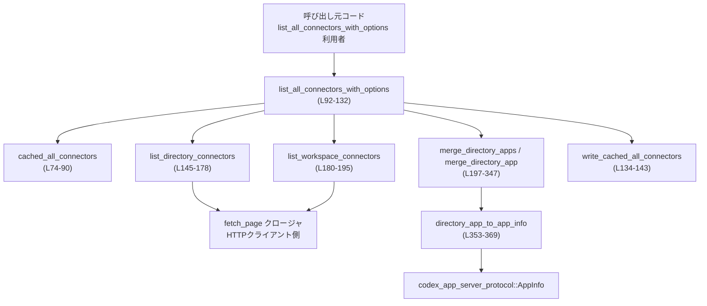
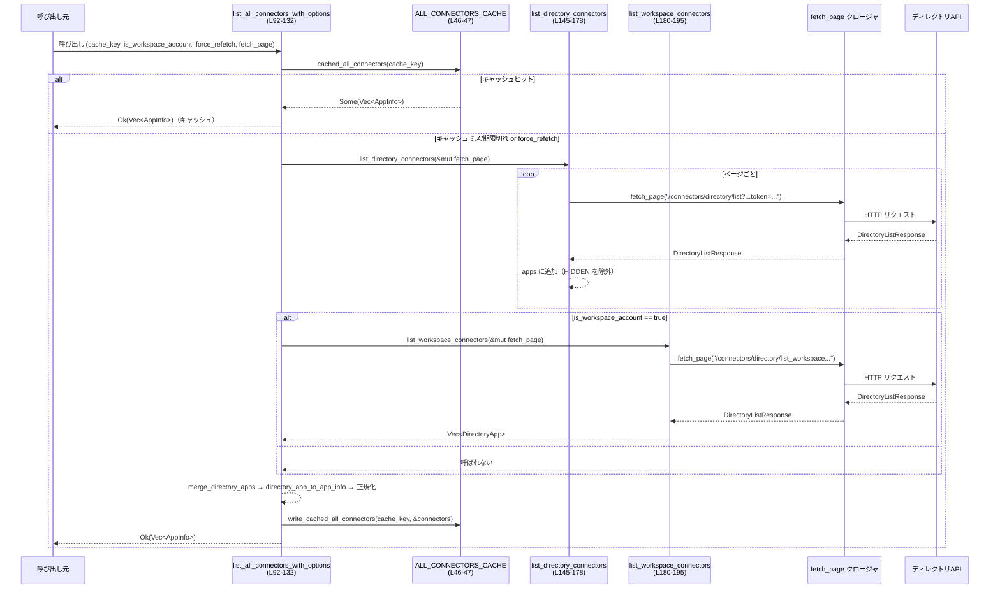

# connectors/src/lib.rs

## 0. ざっくり一言

ChatGPT の「コネクタ」（アプリ）一覧を外部ディレクトリ API からページング取得し、  
統合・正規化・キャッシュして `AppInfo` の一覧として返すモジュールです（`lib.rs` 全体）。

---

## 1. このモジュールの役割

### 1.1 概要

- このモジュールは **外部のアプリディレクトリ API** からアプリ一覧を取得し、  
  ChatGPT 内部表現である `AppInfo` に変換して返す役割を持ちます（`list_all_connectors_with_options` / `lib.rs:L92-132`）。
- ディレクトリ（一般公開）とワークスペース専用コネクタの両方を統合し、  
  重複アプリをマージ・フィールド補完します（`merge_directory_apps` / `merge_directory_app` / `lib.rs:L197-347`）。
- 結果はグローバルなメモリキャッシュに 1 時間保持され、同じキーでの再取得を省略します  
  （`CONNECTORS_CACHE_TTL` / `lib.rs:L13`, `ALL_CONNECTORS_CACHE` / `lib.rs:L46-47`）。

### 1.2 アーキテクチャ内での位置づけ

- 呼び出し元（Web サーバ等）は `list_all_connectors_with_options` を通じてこのモジュールを利用します。
- 実際の HTTP 呼び出しは、この関数に渡す `fetch_page` クロージャ側に委譲されます。
- 取得した生データ `DirectoryApp` を、このモジュール内でマージ・フィルタ・正規化して `AppInfo` に変換します。

依存関係の概略を Mermaid 図で示します。



### 1.3 設計上のポイント

- **グローバルキャッシュ**
  - `LazyLock<StdMutex<Option<CachedAllConnectors>>>` により、プロセス全体で 1 つのキャッシュエントリを保持します（`lib.rs:L39-47`）。
  - TTL は 1 時間（`CONNECTORS_CACHE_TTL` / `lib.rs:L13`）。
- **HTTP クライアント非依存**
  - HTTP 呼び出し部分は `F: FnMut(String) -> Fut` という抽象化されたクロージャで受け取り、  
    このモジュールはパス文字列を作るだけで、実際の通信は知りません（`lib.rs:L92-100`, `L145-148`, `L180-183`）。
- **マージロジック**
  - 同じ `id` の `DirectoryApp` は `merge_directory_app` で統合し、  
    既存値が空のときのみ新しい値で補完する、などのルールが明示されています（`lib.rs:L209-347`）。
- **非同期処理と同期ロック**
  - 主要な API `list_all_connectors_with_options` は `async fn` ですが、  
    キャッシュアクセスには `std::sync::Mutex` を使っています（`cached_all_connectors` / `lib.rs:L74-90` など）。
- **エラーハンドリング**
  - ほとんどの関数は `anyhow::Result` を返し、HTTP 層からのエラーを呼び出し元に伝搬します。
  - ただしワークスペースコネクタ取得はエラーを握りつぶして空配列を返す設計になっています（`list_workspace_connectors` / `lib.rs:L180-195`）。

### 1.4 コンポーネント一覧（インベントリー）

#### 型・定数・静的値

| 名前 | 種別 | 公開 | 用途 / 役割 | 定義位置 |
|------|------|------|-------------|----------|
| `CONNECTORS_CACHE_TTL` | `Duration` 定数 | `pub` | コネクタ一覧キャッシュの有効期限（1 時間） | `lib.rs:L13` |
| `AllConnectorsCacheKey` | 構造体 | `pub` | キャッシュキー（ベース URL / アカウント / ユーザー / ワークスペース種別） | `lib.rs:L15-21` |
| `AllConnectorsCacheKey::new` | 関連関数 | `pub` | `AllConnectorsCacheKey` のコンストラクタ | `lib.rs:L23-36` |
| `CachedAllConnectors` | 構造体 | 非公開 | 実際にキャッシュされるデータ（キー・有効期限・`Vec<AppInfo>`） | `lib.rs:L39-44` |
| `ALL_CONNECTORS_CACHE` | `LazyLock<StdMutex<Option<CachedAllConnectors>>>` | 非公開 | グローバルな単一キャッシュスロット | `lib.rs:L46-47` |
| `DirectoryListResponse` | 構造体 | `pub` | ディレクトリ API のレスポンス（アプリ一覧とページングトークン） | `lib.rs:L49-54` |
| `DirectoryApp` | 構造体 | `pub` | ディレクトリ API から取得する 1 アプリ情報 | `lib.rs:L56-72` |

#### 関数（プロダクションコード）

| 関数名 | 公開 | async | 役割 (1 行) | 定義位置 |
|--------|------|-------|-------------|----------|
| `cached_all_connectors` | `pub` | いいえ | キャッシュからコネクタ一覧を読み出す | `lib.rs:L74-90` |
| `list_all_connectors_with_options` | `pub` | はい | ディレクトリ＋ワークスペースコネクタを取得・マージ・正規化し、キャッシュするメイン API | `lib.rs:L92-132` |
| `write_cached_all_connectors` | 非公開 | いいえ | コネクタ一覧をキャッシュに書き込む | `lib.rs:L134-143` |
| `list_directory_connectors` | 非公開 | はい | ページング付きのディレクトリ一覧 API を呼び出す | `lib.rs:L145-178` |
| `list_workspace_connectors` | 非公開 | はい | ワークスペースコネクタ一覧 API を 1 回呼び出す | `lib.rs:L180-195` |
| `merge_directory_apps` | 非公開 | いいえ | `id` ごとに `DirectoryApp` を統合する | `lib.rs:L197-207` |
| `merge_directory_app` | 非公開 | いいえ | 2 つの `DirectoryApp` のフィールドをマージする | `lib.rs:L209-347` |
| `is_hidden_directory_app` | 非公開 | いいえ | visibility が `"HIDDEN"` のアプリ判定 | `lib.rs:L349-351` |
| `directory_app_to_app_info` | 非公開 | いいえ | `DirectoryApp` から `AppInfo` への変換 | `lib.rs:L353-369` |
| `connector_install_url` | 非公開 | いいえ | コネクタのインストール URL を組み立てる | `lib.rs:L371-374` |
| `connector_name_slug` | 非公開 | いいえ | コネクタ名から URL スラッグを生成する | `lib.rs:L376-391` |
| `normalize_connector_name` | 非公開 | いいえ | 空／空白だけの名前を ID で補う | `lib.rs:L393-400` |
| `normalize_connector_value` | 非公開 | いいえ | Option 文字列をトリムし空文字なら None にする | `lib.rs:L402-407` |

---

## 2. 主要な機能一覧

- コネクタ一覧のキャッシュ読み出し (`cached_all_connectors`)
- コネクタ一覧の取得・マージ・正規化・キャッシュ (`list_all_connectors_with_options`)
- ディレクトリ API（ページング）からのコネクタ取得 (`list_directory_connectors`)
- ワークスペースコネクタ API からの取得 (`list_workspace_connectors`)
- 複数 `DirectoryApp` のマージロジック (`merge_directory_apps` / `merge_directory_app`)
- ディレクトリモデルから内部モデル `AppInfo` への変換 (`directory_app_to_app_info`)
- コネクタ名・説明などの文字列正規化 (`connector_name_slug`, `normalize_connector_name`, `normalize_connector_value`)

---

## 3. 公開 API と詳細解説

### 3.1 型一覧（構造体・列挙体など）

| 名前 | 種別 | 公開 | フィールド概要 | 定義位置 |
|------|------|------|---------------|----------|
| `AllConnectorsCacheKey` | 構造体 | `pub` | `chatgpt_base_url`, `account_id`, `chatgpt_user_id`, `is_workspace_account` からなるキャッシュキー | `lib.rs:L15-21` |
| `DirectoryListResponse` | 構造体 | `pub` | `apps: Vec<DirectoryApp>` と `next_token: Option<String>`（`nextToken` エイリアス） | `lib.rs:L49-54` |
| `DirectoryApp` | 構造体 | `pub` | アプリ ID、名前、説明、`AppMetadata`、`AppBranding`、ラベル類、ロゴ URL、配信チャネル、visibility 等 | `lib.rs:L56-72` |

`AllConnectorsCacheKey::new` は単純なコンストラクタです（`lib.rs:L23-36`）。

---

### 3.2 重要関数の詳細

ここでは特に重要な 7 関数を詳しく説明します。

---

#### `list_all_connectors_with_options<F, Fut>(cache_key: AllConnectorsCacheKey, is_workspace_account: bool, force_refetch: bool, fetch_page: F) -> anyhow::Result<Vec<AppInfo>>`  （`pub async`）

**定義位置**: `lib.rs:L92-132`

**概要**

- コネクタ一覧取得のメイン API です。
- キャッシュをチェックし、必要に応じてディレクトリ・ワークスペース両方の API を呼び、  
  アプリ情報をマージ・正規化して `Vec<AppInfo>` として返します。

**引数**

| 引数名 | 型 | 説明 |
|--------|----|------|
| `cache_key` | `AllConnectorsCacheKey` | キャッシュキー。ベース URL / アカウント / ユーザー / ワークスペース種別を識別（`lib.rs:L15-21`）。 |
| `is_workspace_account` | `bool` | ワークスペースコネクタも取得するかどうか。`true` の場合のみ workspace API を呼びます（`lib.rs:L107-109`）。 |
| `force_refetch` | `bool` | `true` のときキャッシュを無視して必ず再取得します（`lib.rs:L102-104`）。 |
| `fetch_page` | `F: FnMut(String) -> Fut` | 指定パスに対して `DirectoryListResponse` を返す非同期関数オブジェクト（HTTP クライアント側に実装）。 |

**戻り値**

- `Ok(Vec<AppInfo>)`:
  - 正常に取得・マージ・正規化されたコネクタ一覧。
- `Err(anyhow::Error)`:
  - ディレクトリ一覧取得など `fetch_page` 起因のエラー。
  - ワークスペース側のエラーは `list_workspace_connectors` 内で握りつぶされるためここでは発生しません（`lib.rs:L180-195`）。

**内部処理の流れ**

1. **キャッシュチェック**  
   - `force_refetch` が `false` で、`cached_all_connectors(&cache_key)` が `Some` を返す場合は、そのまま返します（`lib.rs:L102-104`）。
2. **ディレクトリ一覧取得**  
   - `list_directory_connectors(&mut fetch_page).await?` で、ページングしながら可視アプリをすべて収集します（`lib.rs:L106`）。
3. **ワークスペースコネクタ取得（必要な場合）**  
   - `is_workspace_account == true` の場合のみ `list_workspace_connectors` を呼び、結果を `apps.extend(...)` で追加します（`lib.rs:L107-109`）。
4. **マージと変換**  
   - `merge_directory_apps(apps)` で `id` ごとの重複をマージ（`lib.rs:L111`）。
   - `.map(directory_app_to_app_info)` で `AppInfo` に変換し `Vec<AppInfo>` に収集（`lib.rs:L111-114`）。
5. **フィールド正規化**（各コネクタごと）
   - `install_url` が未設定なら `connector_install_url` で URL を生成（`lib.rs:L116-119`）。
   - `name` をトリムし、空なら `connector_id` で補う（`normalize_connector_name` / `lib.rs:L120`）。
   - `description` をトリムし、空なら `None` にする（`normalize_connector_value` / `lib.rs:L121`）。
   - `is_accessible` を `false` に固定（`lib.rs:L123`）。
6. **ソートとキャッシュ書き込み**
   - `name` → 同一名なら `id` で安定ソート（`lib.rs:L125-129`）。
   - `write_cached_all_connectors(cache_key, &connectors)` でキャッシュ更新（`lib.rs:L130`）。

**Examples（使用例）**

テストコードに近い形での使用例です（`tests::list_all_connectors_merges_and_normalizes_directory_apps` / `lib.rs:L479-548`）。

```rust
// 非同期コンテキスト内（tokio 等）で実行する例
use crate::{
    AllConnectorsCacheKey,
    DirectoryListResponse,
    DirectoryApp,
    list_all_connectors_with_options,
};

async fn fetch_page_mock(path: String) -> anyhow::Result<DirectoryListResponse> {
    // path に応じて DirectoryListResponse を返す
    // 実際にはここで HTTP クライアントを使って API を呼び出す
    let apps = vec![
        DirectoryApp {
            id: "alpha".to_string(),
            name: " Alpha ".to_string(),
            description: None,
            app_metadata: None,
            branding: None,
            labels: None,
            logo_url: None,
            logo_url_dark: None,
            distribution_channel: None,
            visibility: None,
        },
    ];
    Ok(DirectoryListResponse { apps, next_token: None })
}

async fn example() -> anyhow::Result<()> {
    let cache_key = AllConnectorsCacheKey::new(
        "https://chatgpt.example".to_string(),
        Some("account-1".to_string()),
        Some("user-1".to_string()),
        /* is_workspace_account */ false,
    );

    let connectors = list_all_connectors_with_options(
        cache_key,
        /* is_workspace_account */ false,
        /* force_refetch */ false,
        fetch_page_mock,
    ).await?;

    // connectors[0].name は "Alpha" に正規化されている
    assert_eq!(connectors[0].name, "Alpha");
    Ok(())
}
```

**Errors / Panics**

- `Err` になる条件
  - `list_directory_connectors` 内で `fetch_page(path).await?` がエラーを返した場合（`lib.rs:L162`）。
  - `write_cached_all_connectors` 自体は `Result` を返さず、ここからはエラーを発生させません。
- パニック
  - 直接の `panic!` 呼び出しはありません。
  - キャッシュアクセスで `Mutex::lock()` が失敗した場合も `unwrap_or_else(PoisonError::into_inner)` で復帰するため、ここではパニックしません（`lib.rs:L75-77`, `L135-137`）。

**Edge cases（エッジケース）**

- `force_refetch == true` の場合、キャッシュは無条件で無視され、API 再取得が行われます（`lib.rs:L102-104`）。
- ディレクトリ API が 0 件を返しても、空 `Vec` がそのまま返ります。
- `is_workspace_account == true` でも、workspace API 呼び出しがエラーの場合は workspace コネクタは 1 つも入らず、ディレクトリ分だけが返ります（`list_workspace_connectors` 参照）。
- `DirectoryApp` の `name` が空／空白のみの場合、そのコネクタの `AppInfo.name` は `id` で補われます（`normalize_connector_name` / `lib.rs:L393-400`）。

**使用上の注意点**

- `cache_key` に含まれる情報と `is_workspace_account` 引数の整合性はこの関数内ではチェックされません。
  - 同じ `cache_key` で `is_workspace_account` の値を変えて呼ぶと、キャッシュが期待通りでない可能性があります。
- グローバルキャッシュは 1 スロットだけであり、最後に書き込んだ `cache_key` のデータのみが保持されます（`ALL_CONNECTORS_CACHE` / `lib.rs:L46-47`）。
- 非同期関数ですが、キャッシュアクセスに同期 `Mutex` を使っているため、高頻度アクセス時にはロック競合による待ちが発生しえます。

---

#### `cached_all_connectors(cache_key: &AllConnectorsCacheKey) -> Option<Vec<AppInfo>>` （`pub`）

**定義位置**: `lib.rs:L74-90`

**概要**

- グローバルキャッシュ `ALL_CONNECTORS_CACHE` から、指定キーに対応するコネクタ一覧を取り出す関数です。
- 有効期限切れの場合はキャッシュをクリアし、`None` を返します。

**引数**

| 引数名 | 型 | 説明 |
|--------|----|------|
| `cache_key` | `&AllConnectorsCacheKey` | 検索に使うキャッシュキー。構造体の全フィールドで一致する必要があります。 |

**戻り値**

- `Some(Vec<AppInfo>)`:
  - キャッシュに有効なエントリがあり、キーが一致した場合。`Vec` は複製された値です（`clone()` / `lib.rs:L82`）。
- `None`:
  - キャッシュが空、またはキー不一致、または有効期限切れの場合。

**内部処理の流れ**

1. `ALL_CONNECTORS_CACHE.lock()` で `Mutex` を取得し、ポイズンされていた場合も `into_inner` で中身を取り出します（`lib.rs:L75-77`）。
2. 現在時刻 `Instant::now()` を取得（`lib.rs:L78`）。
3. キャッシュエントリが存在する場合：
   - `now < cached.expires_at && cached.key == *cache_key` なら `Some(cached.connectors.clone())` を返却（`lib.rs:L80-83`）。
   - 期限切れ (`now >= cached.expires_at`) の場合は `*cache_guard = None;` でキャッシュクリア（`lib.rs:L84-86`）。
4. 上記以外の場合は `None` を返す（`lib.rs:L89`）。

**Examples**

```rust
use crate::{AllConnectorsCacheKey, cached_all_connectors};

// 既にどこかで write_cached_all_connectors が実行されている前提
fn read_from_cache_example(key: &AllConnectorsCacheKey) {
    if let Some(connectors) = cached_all_connectors(key) {
        println!("Cached connectors: {}", connectors.len());
    } else {
        println!("Cache miss or expired");
    }
}
```

**Errors / Panics**

- ロック取得時のポイズンは `unwrap_or_else(PoisonError::into_inner)` によって回復され、パニックにはなりません（`lib.rs:L75-77`）。
- 他に `panic!` はありません。

**Edge cases**

- 有効期限切れの場合、読み出しと同時にキャッシュがクリアされます（`lib.rs:L84-86`）。
- `cache_key` が異なる場合、キャッシュが存在しても `None` になります（単一スロットキャッシュであるため）。

**使用上の注意点**

- キャッシュは 1 エントリのみなので、複数アカウント・ユーザーを同一プロセスで扱う場合、  
  どの条件でキャッシュを上書きするかを呼び出し側で考慮する必要があります。
- 返される `Vec<AppInfo>` はコピーなので、呼び出し側で変更してもキャッシュには影響しません。

---

#### `list_directory_connectors<F, Fut>(fetch_page: &mut F) -> anyhow::Result<Vec<DirectoryApp>>` （非公開 `async`）

**定義位置**: `lib.rs:L145-178`

**概要**

- ページング対応のディレクトリ一覧 API を呼び出し、visibility が `"HIDDEN"` でないアプリだけを集めて返します。

**引数**

| 引数名 | 型 | 説明 |
|--------|----|------|
| `fetch_page` | `&mut F` | ディレクトリ API を叩くクロージャ。パス文字列を受け取り `DirectoryListResponse` を返す。 |

**戻り値**

- `Ok(Vec<DirectoryApp>)`:
  - すべてのページを走査し、`HIDDEN` 以外の全アプリを集めたリスト。
- `Err(anyhow::Error)`:
  - 途中で `fetch_page(path).await?` がエラーを返した場合（`lib.rs:L162`）。

**内部処理の流れ**

1. `apps` を空ベクタで初期化（`lib.rs:L150`）。
2. `next_token: Option<String>` を `None` で開始（`lib.rs:L151`）。
3. 無限ループ内で：
   - `next_token` に応じてリクエストパスを組み立て（`lib.rs:L153-161`）  
     - `Some(token)` の場合は `urlencoding::encode` で URL エンコードしたトークンを `token` クエリに付加（`lib.rs:L155-158`）。
     - `None` の場合は最初のページパス。
   - `fetch_page(path).await?` でレスポンス取得（`lib.rs:L162`）。
   - `response.apps` を `into_iter()` し、`is_hidden_directory_app` で `HIDDEN` でないものだけ `apps` に `extend`（`lib.rs:L163-168`）。
   - `response.next_token` をトリムし、空文字列なら `None` にする（`lib.rs:L169-172`）。
   - `next_token.is_none()` なら `break` してループ終了（`lib.rs:L173-175`）。
4. 最終的に `Ok(apps)` を返却（`lib.rs:L177`）。

**Examples**

テストでの `fetch_page` モックは `list_all_connectors_merges_and_normalizes_directory_apps` 内にあります（`lib.rs:L489-521`）。  
そこでは、`path` が workspace 用かどうかで返すアプリを切り替えています。

**Errors / Panics**

- `fetch_page` がエラーを返した場合にのみ `Err(anyhow::Error)` になります。
- `panic!` はありません。

**Edge cases**

- `next_token` が空文字列の場合は次ページがないと見なされます（`trim()` → `.filter(|token| !token.is_empty())` / `lib.rs:L169-172`）。
- `visibility` フィールドが `None` のアプリは `HIDDEN` とは見なされず、そのまま結果に含まれます（`is_hidden_directory_app` / `lib.rs:L349-351`）。

**使用上の注意点**

- `fetch_page` は `FnMut` であるため、内部状態を持つ HTTP クライアントなども扱えますが、  
  再入可能性（同時に複数回呼ばれない前提）を守る必要があります。

---

#### `list_workspace_connectors<F, Fut>(fetch_page: &mut F) -> anyhow::Result<Vec<DirectoryApp>>` （非公開 `async`）

**定義位置**: `lib.rs:L180-195`

**概要**

- ワークスペース専用コネクタ一覧 API を 1 回だけ呼び出し、`HIDDEN` 以外を返します。
- エラー時は空リストを返す設計です。

**引数 / 戻り値**

- 引数 `fetch_page` は `list_directory_connectors` と同様です。
- 戻り値は `Ok(Vec<DirectoryApp>)`。`Err` は返さず、エラー時は `Ok(Vec::new())` になります（`lib.rs:L187-194`）。

**内部処理の流れ**

1. 固定パス `"/connectors/directory/list_workspace?external_logos=true"` で `fetch_page` を呼び出し（`lib.rs:L185-186`）。
2. `match response` で分岐：
   - `Ok(response)` の場合は `response.apps` から `HIDDEN` 以外をフィルタして `collect`（`lib.rs:L188-192`）。
   - `Err(_)` の場合は `Ok(Vec::new())` を返す（`lib.rs:L193`）。

**Edge cases / 使用上の注意点**

- API エラーがあっても呼び出し側はそれを検知できず、「workspace アプリが 0 件」という扱いになります。
- どのようなエラー内容であっても一律で無視される点に注意が必要です。

---

#### `merge_directory_apps(apps: Vec<DirectoryApp>) -> Vec<DirectoryApp>` （非公開）

**定義位置**: `lib.rs:L197-207`

**概要**

- `Vec<DirectoryApp>` を `id` ごとにまとめて 1 つにマージします。
- 実際のフィールドマージロジックは `merge_directory_app` に委譲します。

**引数 / 戻り値**

- 引数：`apps` — ディレクトリ＋ワークスペースなど、複数ソースから集めた `DirectoryApp` 一覧。
- 戻り値：`id` ごとに 1 件に統合された `Vec<DirectoryApp>`。

**内部処理の流れ**

1. `HashMap<String, DirectoryApp>` を用意（`merged` / `lib.rs:L198`）。
2. それぞれの `app` について:
   - `merged.get_mut(&app.id)` が `Some(existing)` なら `merge_directory_app(existing, app)` を実行（`lib.rs:L200-201`）。
   - それ以外は `merged.insert(app.id.clone(), app)`（`lib.rs:L203-204`）。
3. 最後に `merged.into_values().collect()` で `Vec<DirectoryApp>` に変換（`lib.rs:L206`）。

**使用上の注意点**

- `apps` 内の順序は維持されません。`HashMap::into_values()` による任意順序になります。
- マージポリシーは `merge_directory_app` の実装に依存します。

---

#### `merge_directory_app(existing: &mut DirectoryApp, incoming: DirectoryApp)` （非公開）

**定義位置**: `lib.rs:L209-347`

**概要**

- 2 つの `DirectoryApp` を 1 つに統合する関数です。
- 既存の値が空／`None` のときだけ新しい値を採用する、などのフィールドごとのルールが実装されています。

**引数**

| 引数名 | 型 | 説明 |
|--------|----|------|
| `existing` | `&mut DirectoryApp` | マージ結果を書き込む側。`id` は保持されます。 |
| `incoming` | `DirectoryApp` | 新しくマージされる側。所有権ごと受け取り、内容に応じて `existing` を更新します。 |

**主なマージルール（抜粋）**

- `id` は `existing` 側を維持し、`incoming.id` は無視（パターンマッチ時に `_` で破棄 / `lib.rs:L210-221`）。
- `name`:
  - `existing.name` が空白のみで、`incoming.name` が空でない場合にのみ上書き（`lib.rs:L223-226`）。
- `description`:
  - `incoming.description` が `Some` かつトリムして空でない場合に、`existing.description` を上書き（`lib.rs:L228-234`）。
- 画像・チャネル関連:
  - `logo_url`, `logo_url_dark`, `distribution_channel` は `existing` が `None` で `incoming` が `Some` の場合のみ上書き（`lib.rs:L236-244`）。
- `branding` (`AppBranding`):
  - `existing.branding` が `Some` なら、各フィールドごとに `None` → `Some` へのみ更新（`category`, `developer`, `website`, `privacy_policy`, `terms_of_service`, `is_discoverable_app` / `lib.rs:L246-269`）。
  - `existing.branding` が `None` の場合は `Some(incoming_branding)` を丸ごと採用（`lib.rs:L270-272`）。
- `app_metadata` (`AppMetadata`):
  - `existing.app_metadata` が `Some` の場合、各フィールドごとに `None` → `Some` のみ更新（`review`, `categories`, `sub_categories` 等多数 / `lib.rs:L275-338`）。
  - `existing.app_metadata` が `None` の場合は `Some(incoming_app_metadata)` を採用（`lib.rs:L339-341`）。
- `labels`:
  - `existing.labels` が `None` で、`incoming.labels` が `Some` の場合のみ採用（`lib.rs:L344-345`）。

**Edge cases / 使用上の注意点**

- `incoming` 側が空文字列や `None` の場合、基本的に `existing` を変更しません（`description` のように「非空なら上書き」のパターン）。
- `labels` は単純に丸ごと置き換えるだけで、マージ（キーごとの統合）は行いません。

---

#### `connector_name_slug(name: &str) -> String` （非公開）

**定義位置**: `lib.rs:L376-391`

**概要**

- コネクタ名から URL パスフレンドリーなスラッグ文字列を生成します。
- 英数字は小文字へ、その他の文字は `-` に変換し、前後の `-` は削除します。

**引数 / 戻り値**

- 引数 `name`: 任意の UTF-8 文字列。
- 戻り値:
  - 変換後のスラッグ。結果が空の場合は `"app"` を返します（`lib.rs:L386-388`）。

**内部処理の流れ**

1. `String::with_capacity(name.len())` でバッファを用意（`lib.rs:L377`）。
2. `for character in name.chars()` で文字ごとに処理（`lib.rs:L378`）。
   - `character.is_ascii_alphanumeric()` なら `to_ascii_lowercase()` で小文字化して push（`lib.rs:L379-380`）。
   - それ以外は `'-'` を push（`lib.rs:L381-382`）。
3. `trim_matches('-')` で前後の `-` を削除（`lib.rs:L385`）。
4. 空文字列なら `"app".to_string()`、それ以外は `normalized.to_string()` を返却（`lib.rs:L386-390`）。

**Examples**

```rust
use crate::connector_name_slug;

fn slug_examples() {
    assert_eq!(connector_name_slug("Alpha Beta"), "alpha-beta");
    assert_eq!(connector_name_slug("  *** "), "app"); // すべて非英数字 → "-" → トリムで空 → "app"
}
```

**使用上の注意点**

- 非 ASCII 文字（日本語など）はすべて `'-'` に変換されます。
- `connector_id` は別途 URL に埋め込まれるため、全体の URL 安全性は ID の値にも依存します（`connector_install_url` / `lib.rs:L371-374`）。

---

### 3.3 その他の関数

| 関数名 | 役割（1 行） | 定義位置 |
|--------|--------------|----------|
| `write_cached_all_connectors` | グローバルキャッシュに `CachedAllConnectors` を保存する | `lib.rs:L134-143` |
| `is_hidden_directory_app` | `visibility == "HIDDEN"` かどうかを判定する | `lib.rs:L349-351` |
| `directory_app_to_app_info` | `DirectoryApp` から `AppInfo` へフィールドをコピーして変換する | `lib.rs:L353-369` |
| `connector_install_url` | `https://chatgpt.com/apps/{slug}/{connector_id}` の形式でインストール URL を作る | `lib.rs:L371-374` |
| `normalize_connector_name` | `name` をトリムし、空なら `connector_id` で補う | `lib.rs:L393-400` |
| `normalize_connector_value` | `Option<&str>` をトリムし、空文字を `None` に変換する | `lib.rs:L402-407` |

---

## 4. データフロー

ここでは、`list_all_connectors_with_options` を呼び出したときの代表的なデータフローを示します。

### 4.1 コネクタ一覧取得のシーケンス



**ポイント**

- キャッシュヒット時は HTTP 呼び出しが行われません。
- キャッシュミス時は、ディレクトリ API をページングし、必要に応じて workspace API を 1 回呼びます。
- `list_workspace_connectors` のエラーは握りつぶされるため、workspace API の障害は静かに無視されます（結果が減るだけ）。

---

## 5. 使い方（How to Use）

### 5.1 基本的な使用方法

`list_all_connectors_with_options` を使ってコネクタ一覧を取得する最小構成の例です。

```rust
use crate::{
    AllConnectorsCacheKey,
    DirectoryListResponse,
    DirectoryApp,
    list_all_connectors_with_options,
};

// HTTP 呼び出しを抽象化した fetch_page 実装の例
async fn fetch_page(path: String) -> anyhow::Result<DirectoryListResponse> {
    // 実運用ではここで HTTP クライアントを使って
    // ベースURL + path にリクエストを送り、レスポンスをパースする。
    // ここでは簡略化のため固定レスポンスを返す。
    let apps = vec![
        DirectoryApp {
            id: "alpha".to_string(),
            name: " Alpha ".to_string(),
            description: Some("  Example app ".to_string()),
            app_metadata: None,
            branding: None,
            labels: None,
            logo_url: None,
            logo_url_dark: None,
            distribution_channel: None,
            visibility: None,
        },
    ];
    Ok(DirectoryListResponse { apps, next_token: None })
}

#[tokio::main]
async fn main() -> anyhow::Result<()> {
    let cache_key = AllConnectorsCacheKey::new(
        "https://chatgpt.example".to_string(),
        Some("account-1".to_string()),
        Some("user-1".to_string()),
        /* is_workspace_account */ false,
    );

    let connectors = list_all_connectors_with_options(
        cache_key,
        /* is_workspace_account */ false,
        /* force_refetch */ false,
        fetch_page,
    ).await?;

    // 正規化された結果を利用
    for app in connectors {
        println!("{}: {:?}", app.id, app.name);
    }

    Ok(())
}
```

### 5.2 よくある使用パターン

1. **ワークスペースコネクタを含めないパターン**
   - `is_workspace_account = false` とし、ディレクトリ API だけを使う。
2. **ワークスペースコネクタを含めるパターン**
   - `is_workspace_account = true` とし、workspace API からのコネクタも統合されるようにする。
3. **キャッシュを強制的に更新するパターン**
   - `force_refetch = true` とし、最新の情報を必ず取得する。

```rust
// ディレクトリ＋ワークスペース両方を取得し、毎回最新情報を取りたい場合
let connectors = list_all_connectors_with_options(
    cache_key,
    /* is_workspace_account */ true,
    /* force_refetch */ true,
    fetch_page,
).await?;
```

### 5.3 よくある間違い

```rust
// 間違い例: is_workspace_account の違いを cache_key に反映していない
let cache_key = AllConnectorsCacheKey::new(
    base_url.clone(),
    Some(account_id.clone()),
    Some(user_id.clone()),
    /* is_workspace_account */ false,
);

// 1回目: workspace を含めない
let _ = list_all_connectors_with_options(
    cache_key.clone(),
    /* is_workspace_account */ false,
    false,
    fetch_page,
).await?;

// 2回目: workspace を含めたいが cache_key は同じ
let connectors = list_all_connectors_with_options(
    cache_key.clone(),
    /* is_workspace_account */ true,
    false,
    fetch_page, // ここは呼ばれず、1回目の結果が返る可能性がある
).await?;
```

```rust
// 正しい例: is_workspace_account の違いを cache_key に反映する
let cache_key_dir = AllConnectorsCacheKey::new(
    base_url.clone(),
    Some(account_id.clone()),
    Some(user_id.clone()),
    /* is_workspace_account */ false,
);

let cache_key_ws = AllConnectorsCacheKey::new(
    base_url.clone(),
    Some(account_id.clone()),
    Some(user_id.clone()),
    /* is_workspace_account */ true,
);
```

### 5.4 使用上の注意点（まとめ）

- キャッシュは **単一スロット** であり、最後に書き込んだ `cache_key` の結果だけ保持されます。
- `is_workspace_account` の値を `cache_key` に反映するなど、呼び出し側でキャッシュキー設計を行う必要があります。
- ワークスペース API のエラーは無視されるため、「常に workspace コネクタが含まれる」ことは保証されません。
- `connector_install_url` は `connector_id` を URL エンコードしていません。  
  `id` にどのような文字が入るかは `AppInfo` / ディレクトリ API 側の仕様に依存します。

### 5.5 潜在的な問題・セキュリティ上の注意

※ ここで述べる内容は、コードから読み取れる挙動に基づく「注意点」であり、バグであると断定するものではありません。

- **キャッシュ共有による意図しない結果共有の可能性**
  - `ALL_CONNECTORS_CACHE` が 1 エントリのみのため、  
    複数アカウント・ユーザーで同一プロセスを共有する場合、キャッシュですぐに上書きされます（`lib.rs:L46-47`, `L134-143`）。
- **URL の安全性**
  - `connector_install_url` は `connector_id` をそのまま URL に埋め込んでいます（`lib.rs:L371-374`）。
  - `connector_id` がどのような文字を許容するかは、このモジュールからは分かりません。
- **同期ロックの使用**
  - 非同期コンテキストから `std::sync::Mutex` を使っているため、高負荷時にスレッドブロックが起こり得ます（`lib.rs:L74-77`, `L134-137`）。
  - ただしロック保持時間は短く抑えられています。

---

## 6. 変更の仕方（How to Modify）

### 6.1 新しい機能を追加する場合

例: フィルタ条件（特定カテゴリのみなど）を追加したい場合。

1. **変換後 `AppInfo` に対する処理の場合**
   - `list_all_connectors_with_options` 内の、`merge_directory_apps` → `directory_app_to_app_info` 以降のループ（`lib.rs:L111-124`）にロジックを追加するのが自然です。
   - ここでは `AppInfo` が `Vec` に揃っているため、フィルタや追加フィールド設定を行いやすくなっています。
2. **取得段階（DirectoryApp）でフィルタしたい場合**
   - `list_directory_connectors` / `list_workspace_connectors` の `filter(|app| !is_hidden_directory_app(app))` 箇所（`lib.rs:L163-168`, `L188-192`）で条件を追加することができます。
3. **キャッシュキーに条件を反映する場合**
   - 新しい条件をキャッシュに反映したいときは、`AllConnectorsCacheKey` にフィールドを追加し、`new` のシグネチャも更新します（`lib.rs:L15-21`, `L23-36`）。

### 6.2 既存の機能を変更する場合

- **キャッシュポリシーを変更する**
  - TTL を変更する場合は `CONNECTORS_CACHE_TTL` を修正します（`lib.rs:L13`）。
  - キャッシュを複数スロットにしたい場合は、`ALL_CONNECTORS_CACHE` の型を `HashMap<AllConnectorsCacheKey, CachedAllConnectors>` のような形に変えることになります。
- **ワークスペース API のエラー扱い**
  - エラーを握りつぶさずに呼び出し元へ伝えたい場合は、`list_workspace_connectors` の `match response` ブロック（`lib.rs:L187-194`）を変更し、`Err` をそのまま返すようにします。
- **マージロジックの変更**
  - 特定フィールドの優先順位を変えたい場合は、`merge_directory_app` 内の該当箇所を修正します（例: 説明文を上書きする条件 / `lib.rs:L228-234`）。
  - 影響範囲としては `merge_directory_apps` の結果を利用する `list_all_connectors_with_options` のみです。

### 6.3 テストコードの位置づけ

テストモジュールは `#[cfg(test)] mod tests` として同一ファイルに定義されています（`lib.rs:L409-548`）。

- `list_all_connectors_uses_shared_cache`（`lib.rs:L441-477`）
  - 同一 `cache_key` で 2 回呼び出したとき、`fetch_page` が 1 回だけ呼ばれることを検証。
- `list_all_connectors_merges_and_normalizes_directory_apps`（`lib.rs:L479-548`）
  - ディレクトリ＋ワークスペースから同じ `id` のアプリが来た場合のマージ・正規化挙動（説明文・カテゴリ・インストール URL 等）を検証。

機能変更時には、これらテストの期待値が依然として妥当かどうか確認し、必要に応じてテストも更新する必要があります。

---

## 7. 関連ファイル

このモジュールと特に関係の深い外部型・ファイルは、コード中の `use` から次のように読み取れます。

| パス / クレート | 役割 / 関係 |
|-----------------|------------|
| `codex_app_server_protocol::AppInfo` | コネクタ一覧の最終的な公開モデル。`directory_app_to_app_info` の戻り値（`lib.rs:L353-369`）。 |
| `codex_app_server_protocol::AppBranding` | `DirectoryApp.branding` / `AppInfo.branding` の型。`merge_directory_app` で詳細フィールドを統合（`lib.rs:L246-273`）。 |
| `codex_app_server_protocol::AppMetadata` | `DirectoryApp.app_metadata` / `AppInfo.app_metadata` の型。`merge_directory_app` で詳細メタデータを統合（`lib.rs:L275-341`）。 |
| `urlencoding` クレート | `next_token` を URL エンコードするために使用（`lib.rs:L155-158`）。 |

このファイル単体からは、HTTP クライアント実装やサーバ側ルーティングなどの情報は分かりません。
