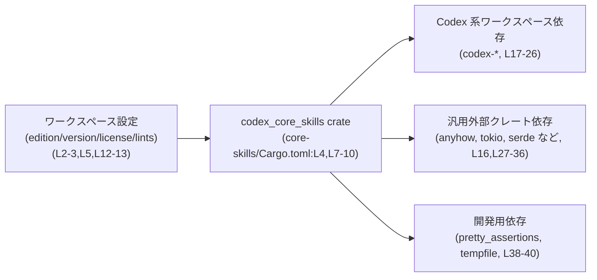
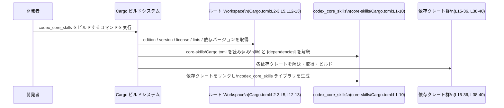

# core-skills/Cargo.toml

## 0. ざっくり一言

`core-skills/Cargo.toml` は、ライブラリクレート `codex_core_skills` の **メタデータと依存関係を定義する Cargo マニフェスト** です (core-skills/Cargo.toml:L1-10, L15-40)。  
実際の公開 API やロジックは `src/lib.rs` 側にあり、このファイルはそのビルド設定と外部コンポーネントとの関係を記述しています。

---

## 1. このモジュールの役割

### 1.1 概要

- このファイルは、Rust クレート `codex-core-skills` の
  - パッケージ名・バージョン・ライセンスなどの基本情報 (L1-5)
  - ライブラリターゲット名とソースパス (L7-10)
  - lint 設定の継承 (L12-13)
  - 実行時依存クレートと開発用依存クレートの一覧 (L15-36, L38-40)
  を宣言します。
- edition / license / version / lints / dependencies はすべて `workspace = true` 経由でルートワークスペースから継承され、バージョンやポリシーを一元管理する構成になっています (L2-3, L5, L12-13, L16-36)。

このファイル自体には Rust の関数や構造体は定義されていないため、**公開 API やコアロジックの内容は本チャンクからは分かりません**。

### 1.2 アーキテクチャ内での位置づけ

Cargo.toml に現れる情報から分かるのは、「codex_core_skills クレートがどのような設定・依存関係のもとでビルドされるか」です。

- ルートワークスペース設定から edition / license / version / lints を継承 (L2-3, L5, L12-13)
- ライブラリターゲット `codex_core_skills` を `src/lib.rs` として定義 (L7-10)
- Codex 系のワークスペース依存（`codex-analytics` など）と、一般的な外部クレート（`tokio`, `serde` など）を利用可能な状態にする (L15-36)
- テストや開発時には `pretty_assertions`, `tempfile` 等の dev-dependencies を利用可能にする (L38-40)

これを概念図として表すと、次のような依存関係になります。



※ この図は **ビルド時の依存関係** を示すものであり、どのクレートが実際にどの関数を呼んでいるかといった「実行時の詳しい呼び出し関係」は、このファイルだけからは分かりません。

### 1.3 設計上のポイント

コード（Cargo.toml）から読み取れる設計上の特徴は次のとおりです。

- **ワークスペース一元管理**  
  - edition / license / version / lints / dependencies をすべて `workspace = true` で継承しており、バージョンやポリシーをルートの Cargo.toml で集中管理する構成です (L2-3, L5, L12-13, L16-36)。
- **ライブラリクレートとしての提供**  
  - `[lib]` セクションのみが定義され、`doctest = false` が設定されています (L7-9)。  
    このクレートはライブラリとして他クレートから `use codex_core_skills::...` で利用されることを意図していると解釈できます。
- **lint 設定の集中管理**  
  - `[lints]` でも `workspace = true` が指定されており (L12-13)、警告・禁止事項のポリシーもルートワークスペースで統一されます。
- **非同期処理・シリアライゼーションなどの基盤クレートを依存として利用可能**  
  - `tokio`, `serde`, `serde_json`, `serde_yaml`, `tracing`, `zip` などが依存として列挙されており (L29-35), これらを利用するロジックが `src/lib.rs` 以降に存在することが想定されますが、具体的な使い方は本チャンクには現れません。

---

## 2. 主要な機能一覧（Cargo.toml としての機能）

このファイル自体はロジックを持たず、**ビルド設定** が主な役割です。その観点での「機能」を列挙します。

- `codex_core_skills` ライブラリターゲットの定義  
  - `[lib]` セクションでライブラリ名とパスを指定しています (L7-10)。
- ワークスペース共通設定の継承  
  - edition / license / version / lints をルートワークスペースから継承します (L2-3, L5, L12-13)。
- 実行時依存クレートの宣言  
  - `codex-analytics`, `codex-protocol`, `tokio`, `serde` などの依存を `workspace = true` で宣言し、ルート側でバージョンや features を一元管理します (L15-36)。
- 開発用依存クレートの宣言  
  - テスト・一時ファイル作成用途の `pretty_assertions`, `tempfile` を dev-dependencies に登録します (L38-40)。

---

## 3. 公開 API と詳細解説

### 3.1 型一覧（構造体・列挙体など）

このファイルは Cargo マニフェストであり、**Rust の型定義は一切含まれていません**。  
公開 API や型は、`[lib]` セクションで指定された `src/lib.rs` に実装されていると分かります (L7-10)。

| 名前 | 種別 | 役割 / 用途 | 定義位置 |
|------|------|-------------|----------|
| (なし) | - | Cargo.toml 自体には構造体・列挙体などの型定義は存在しません | core-skills/Cargo.toml:L1-40 |

#### 3.1.1 クレート／依存関係インベントリー（コンポーネント一覧）

このチャンクから分かる **ビルド対象クレートと依存クレートの一覧** です。

| 名前 | 区分 | 説明（一般的な役割） | 根拠 |
|------|------|----------------------|------|
| `codex-core-skills` | パッケージ | この Cargo.toml で定義されるパッケージ名。 | core-skills/Cargo.toml:L4 |
| `codex_core_skills` | ライブラリクレート | 実際に `use` されるライブラリ名。ソースは `src/lib.rs`。 | core-skills/Cargo.toml:L7-10 |
| `anyhow` | 外部依存 | エラーを `anyhow::Error` として扱うためのユーティリティクレート（一般的な役割）。 | core-skills/Cargo.toml:L16 |
| `codex-analytics` | workspace 依存 | Codex 系の分析/計測関連のクレート名と推測されますが、具体的な役割は本チャンクからは不明です。 | core-skills/Cargo.toml:L17 |
| `codex-app-server-protocol` | workspace 依存 | アプリケーションサーバとのプロトコル関連クレート名と推測されますが、詳細は不明です。 | core-skills/Cargo.toml:L18 |
| `codex-config` | workspace 依存 | 設定管理に関するクレート名と推測されますが、詳細は不明です。 | core-skills/Cargo.toml:L19 |
| `codex-instructions` | workspace 依存 | 指示・手順表現に関するクレート名と推測されますが、詳細は不明です。 | core-skills/Cargo.toml:L20 |
| `codex-login` | workspace 依存 | 認証・ログイン周りのクレート名と推測されますが、詳細は不明です。 | core-skills/Cargo.toml:L21 |
| `codex-otel` | workspace 依存 | OpenTelemetry 連携を扱うクレート名と推測されますが、詳細は不明です。 | core-skills/Cargo.toml:L22 |
| `codex-protocol` | workspace 依存 | Codex 内部の共通プロトコルを扱うクレート名と推測されますが、詳細は不明です。 | core-skills/Cargo.toml:L23 |
| `codex-skills` | workspace 依存 | 「スキル」関連のコア機能を提供するクレート名と推測されますが、詳細は不明です。 | core-skills/Cargo.toml:L24 |
| `codex-utils-absolute-path` | workspace 依存 | 絶対パス操作用ユーティリティと推測されますが、詳細は不明です。 | core-skills/Cargo.toml:L25 |
| `codex-utils-plugins` | workspace 依存 | プラグイン機構関連ユーティリティと推測されますが、詳細は不明です。 | core-skills/Cargo.toml:L26 |
| `dirs` | 外部依存 | 一般にユーザーディレクトリなど OS 依存のディレクトリパスを取得するクレートです。 | core-skills/Cargo.toml:L27 |
| `dunce` | 外部依存 | Windows などのパス表記を正規化するためのクレートとして知られています。 | core-skills/Cargo.toml:L28 |
| `serde` | 外部依存 | Rust の代表的なシリアライゼーションフレームワーク。本ファイルでは `derive` feature が有効化されています (L29)。 | core-skills/Cargo.toml:L29 |
| `serde_json` | 外部依存 | JSON との変換を提供する serde 拡張クレート。 | core-skills/Cargo.toml:L30 |
| `serde_yaml` | 外部依存 | YAML との変換を提供する serde 拡張クレート。 | core-skills/Cargo.toml:L31 |
| `shlex` | 外部依存 | シェル風の文字列トークナイズを行うクレートとして知られています。 | core-skills/Cargo.toml:L32 |
| `tokio` | 外部依存 | 非同期 I/O ランタイム。`fs`, `macros`, `rt` features が有効であることが分かります。 | core-skills/Cargo.toml:L33 |
| `toml` | 外部依存 | TOML 形式とのシリアライゼーションを提供するクレート。 | core-skills/Cargo.toml:L34 |
| `tracing` | 外部依存 | 構造化ログ／トレースを行うためのクレート。 | core-skills/Cargo.toml:L35 |
| `zip` | 外部依存 | ZIP アーカイブの読み書きを行うクレート。 | core-skills/Cargo.toml:L36 |
| `pretty_assertions` | dev 依存 | テスト失敗時の diff を見やすく表示するアサーションクレート。 | core-skills/Cargo.toml:L39 |
| `tempfile` | dev 依存 | 一時ファイル・ディレクトリ生成用クレート。 | core-skills/Cargo.toml:L40 |

**注意**: 用途欄に記載した内容は、各クレートの **一般的な役割** を説明したものであり、  
`codex_core_skills` クレートの中で「どのように使われているか」は、この Cargo.toml だけからは分かりません。

### 3.2 関数詳細

本ファイルは Cargo の設定ファイルであり、**Rust の関数定義は一切含まれていません**。  
そのため、「関数詳細テンプレート」を適用できる対象はこのチャンクには存在しません。

- `codex_core_skills` の公開関数・メソッド・型は、`src/lib.rs` 以降に定義されていると考えられますが、その内容はこのチャンクには現れません。

### 3.3 その他の関数

上記と同様の理由で、補助的な関数やラッパー関数もこのファイルには存在しません。

---

## 4. データフロー（ビルド時の依存解決フロー）

実行時のデータフローはこのファイルからは分からないため、**Cargo によるビルド時の依存解決の流れ**を示します。  
これは Cargo の一般的な挙動に基づく概念図です。



この図から分かるポイント:

- `workspace = true` と書かれた項目は、ルートワークスペースの設定に依存しており、そちらを変更すると `codex_core_skills` も影響を受けます (L2-3, L5, L12-13, L16-36)。
- `core-skills/Cargo.toml` 自体には依存クレートのバージョンは書かれておらず、**バージョンや feature 構成はすべてルートの Cargo.toml に委ねられています**。

---

## 5. 使い方（How to Use）

### 5.1 基本的な使用方法

このファイルは、`codex_core_skills` クレートを **ビルドおよび他クレートから利用可能にするための設定**です。  
他クレートからの利用イメージは次のようになります（API 名は不明なのでダミーとしています）。

#### Cargo.toml 側からの依存追加例

```toml
# 別クレートの Cargo.toml の一例
[dependencies]
# パッケージ名で依存を書く点に注意
codex-core-skills = { workspace = true }
# または、workspace で一元管理していない場合は:
# codex-core-skills = "0.x.y"  # 具体的なバージョンはルート側設定を参照
```

※ 上記は **一般的な利用例** であり、実際にこのリポジトリがどのような `[workspace.dependencies]` を持つかはこのチャンクからは分かりません。

#### Rust コードからの利用イメージ

```rust
// src/main.rs （codex_core_skills を利用する側の crate の例）

// ライブラリ名 `codex_core_skills` を use する
use codex_core_skills; // 実際には公開関数・型に応じて適切なパスを指定する

fn main() {
    // ここで codex_core_skills が提供する API を呼び出す
    // 例: codex_core_skills::some_function(...);
    // ただし、具体的な API 名や引数は core-skills/src/lib.rs を確認する必要があります。
}
```

このように、「Cargo.toml → Cargo の解釈 → ライブラリクレート `codex_core_skills` のビルド → 他クレートから `use`」という流れになります。

### 5.2 よくある使用パターン

このファイルに現れる設定から、想定されるパターンをいくつか挙げます。

- **ワークスペースでの依存共有**  
  - `anyhow`, `tokio`, `serde` など、多くの依存に `workspace = true` が付いています (L16-36)。  
    これは、複数クレートで同じ依存バージョンを共有し、ビルドの一貫性を保つための典型的な構成です。
- **非同期 I/O + シリアライゼーション基盤の活用**  
  - `tokio`（非同期ランタイム）と `serde*`, `toml`, `serde_yaml`, `serde_json`（シリアライゼーションクレート）を依存に含めているため、設定ファイルやプロトコルのシリアライズ／デシリアライズ、非同期ファイル I/O などを行うロジックが `src/lib.rs` 側に存在することが想定されますが、実際の API はこのチャンクからは分かりません。

### 5.3 よくある間違い

Cargo.toml 周りで起こりやすい誤用例と、その修正例を示します。

```toml
# 間違い例: クレート名（lib 名）で依存を書いてしまう
[dependencies]
codex_core_skills = { workspace = true }  # NG: パッケージ名ではなく crate 名

# 正しい例: パッケージ名で依存を書く
[dependencies]
codex-core-skills = { workspace = true }  # OK: L4 のパッケージ名と一致
```

```toml
# 間違い例: workspace 管理されているはずの依存に直接バージョンを指定
[dependencies]
anyhow = "1.0"  # L16 では workspace = true なので、ここでバージョンを決めるべきではない

# 正しい例: workspace の設定に従う
[dependencies]
anyhow = { workspace = true }  # core-skills/Cargo.toml:L16 と同じ指定
```

これらは一般的なパターンであり、このリポジトリ特有の問題が発生しているかどうかは、このチャンクからは判断できません。

### 5.4 使用上の注意点（まとめ）

- **workspace = true の前提**  
  - edition / license / version / lints / dependencies など、多くの項目が `workspace = true` に依存しているため (L2-3, L5, L12-13, L16-36)、  
    ルートワークスペースの設定を変更すると、このクレートのビルド結果や依存バージョンが一括して変わります。
- **依存クレートの安全性・エラー・並行性**  
  - `tokio` や `serde`, `zip` などは、非同期処理・シリアライゼーション・圧縮処理などの機能を提供するクレートです。  
    しかし、**実際にどの API をどのような前提で呼び出しているか** は `core-skills/Cargo.toml` からは分かりません。  
    エラー処理や並行性の扱いを評価するには、`src/lib.rs` 以降の実装を確認する必要があります。
- **未使用依存の可能性**  
  - Cargo.toml に列挙されている依存がすべて実際に使われているとは限りません。  
    未使用依存があるかどうかは、Rust コード側の参照状況（例: `cargo udeps` などのツール）を確認する必要があります。

---

## 6. 変更の仕方（How to Modify）

### 6.1 新しい機能を追加する場合（依存追加）

`codex_core_skills` に新しい外部クレートを利用する機能を追加する場合の、Cargo.toml 側での変更の流れです。

1. **ワークスペースで一元管理する場合**  
   - ルートワークスペースの Cargo.toml の `[workspace.dependencies]` に新しい依存を追加する。  
   - その上で、このファイルの `[dependencies]` に `{ workspace = true }` で参照を追加する。

   ```toml
   # core-skills/Cargo.toml の一部 (例)
   [dependencies]
   new-crate = { workspace = true }  # ルートの設定を参照
   ```

2. **このクレートだけが依存する場合**  
   - ルート側で一元管理したくない場合、このファイルに直接バージョンや path を書く。

   ```toml
   [dependencies]
   new-crate = "0.1"          # crates.io のバージョンを直接指定
   # または
   new-crate = { path = "../new-crate" }  # ローカルパスを指定
   ```

3. **Tokio や serde の feature を追加する場合**  
   - 既に `workspace = true` で管理されている依存（例: tokio, serde）について feature を増やしたいときは、  
     ルートワークスペース側の設定（`[workspace.dependencies]` の `features`）を変更する必要があります。  
     このファイルに直接 features を追加する形（`tokio = { workspace = true, features = [...] }`）になっている場合は、  
     ルート側のポリシーとの整合性に注意する必要があります（実際のルート設定はこのチャンクには現れません）。

### 6.2 既存の機能を変更する場合（依存・設定の変更）

- **依存を削除する場合**  
  - Rust コードから該当クレートの `use` や関数呼び出しが完全になくなっていることを確認した上で、  
    `core-skills/Cargo.toml` の `[dependencies]` / `[dev-dependencies]` から項目を削除します。  
    その後、必要に応じてルートワークスペースの `[workspace.dependencies]` からも削除します。
- **edition / lints の変更**  
  - 本ファイルでは `edition.workspace = true`, `[lints] workspace = true` となっているため (L2, L12-13)、  
    edition や lints を変更したい場合は、ルートワークスペースの設定を変更する必要があります。  
    このクレートだけ別の edition / lint を使う構成にはなっていません。
- **doctest の挙動変更**  
  - 現在 `doctest = false` が設定されています (L8)。  
    ドキュメントコメント中のコードをテストとして実行したい場合は、`true` に変更することで有効化できますが、  
    実際に doc コメントがどれだけ存在するかは `src/lib.rs` を確認する必要があります。

---

## 7. 関連ファイル

この Cargo.toml と密接に関係するファイル・設定は次のとおりです。

| パス / 場所 | 役割 / 関係 |
|-------------|------------|
| `core-skills/src/lib.rs` | `[lib]` セクションの `path = "src/lib.rs"` から分かる、このクレートの本体実装ファイルです (core-skills/Cargo.toml:L7-10)。公開 API やコアロジックはここ以降に定義されます。 |
| ルートワークスペースの `Cargo.toml` | `edition.workspace = true`, `license.workspace = true`, `version.workspace = true`, `[lints] workspace = true`, および各依存の `{ workspace = true }` の実体を定義するファイルです (L2-3, L5, L12-13, L16-36)。このファイルの設定が `codex_core_skills` のビルドと依存バージョンに直接影響します。 |
| （ルートから見た）`codex-analytics` などの依存クレート | `[dependencies]` セクションで参照されるクレート群です (L15-36)。それぞれのコードや API は別リポジトリ、またはワークスペース内の別パッケージとして存在しますが、その内容はこのチャンクには現れません。 |

このチャンクでは **Cargo.toml レベルの情報のみ** が得られるため、  
公開 API・エラー処理・並行性・セキュリティといった詳細を確認するには、`src/lib.rs` 以降のソースコードやルートワークスペースの設定を参照する必要があります。
