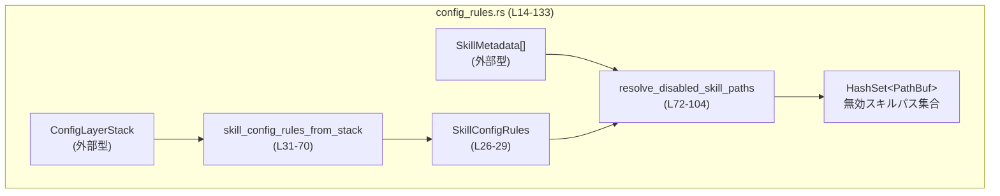
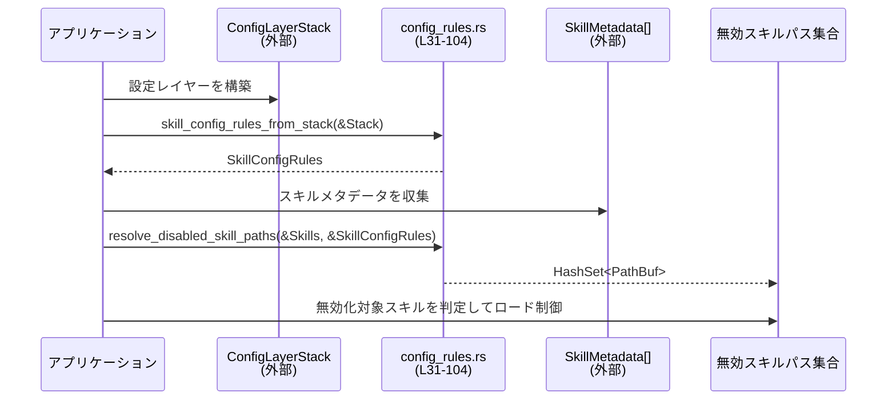

# core-skills/src/config_rules.rs

## 0. ざっくり一言

ユーザ設定やセッションフラグから「スキルを有効／無効にするルール」を抽出し、そのルールをもとに無効化すべきスキルファイルのパス集合を計算するモジュールです。

---

## 1. このモジュールの役割

### 1.1 概要

- このモジュールは、設定レイヤースタック（`ConfigLayerStack`）からスキルの有効・無効ルールを読み取り、順序付きルール列 `SkillConfigRules` を構築します（`skill_config_rules_from_stack`）。  
- さらに、そのルールと実際にロードされたスキル一覧（`SkillMetadata`）から、「最終的に無効扱いとするスキルパスの集合」を求めます（`resolve_disabled_skill_paths`）。

### 1.2 アーキテクチャ内での位置づけ

- 上位層からは
  - 設定レイヤー集合 `ConfigLayerStack`
  - ロード済みスキル情報 `SkillMetadata` のスライス
  が渡されます。
- 本モジュールはこれらを入力として
  - ルール表現 `SkillConfigRules`
  - 無効スキルの `HashSet<PathBuf>`
  を返します。



### 1.3 設計上のポイント

- ルールのセレクタは「名前」か「パス」のどちらか一方を取る `SkillConfigRuleSelector` で表現しています（`config_rules.rs:L14-18`）。
- ルールは順序付きのベクタ `SkillConfigRules.entries` として保持し、「後から定義されたルールが同じスキルに対する前のルールを上書きする」挙動を、単純な線形走査で実現しています（`config_rules.rs:L31-69`, `L72-103`）。
- 入力設定の不正値はエラーとしては扱わず、`tracing::warn!` でログに出した上で無視します（`config_rules.rs:L47-52`, `L111-126`）。
- パスセレクタは `dunce::canonicalize` を通して正規化し、失敗時は元パスをそのまま使うことで、パスの比較性をできる限り高めています（`config_rules.rs:L108-110`, `L131-132`）。
- すべて安全な Rust（`unsafe` なし）で書かれており、共有状態も持たないため、呼び出し側の型が `Send` / `Sync` を満たす限り並行呼び出しに適しています。

---

## 2. コンポーネント一覧（インベントリー）

このチャンクに現れる型・関数の一覧です。

| 名前 | 種別 | 公開 | 役割 / 用途 | 根拠 |
|------|------|------|-------------|------|
| `SkillConfigRuleSelector` | enum | 公開 | スキル設定ルールの対象を、名前またはパスで指定するセレクタ | `config_rules.rs:L14-18` |
| `SkillConfigRule` | struct | 公開 | 1 件のセレクタと、その有効フラグ（enabled/disabled）を表すルール | `config_rules.rs:L20-24` |
| `SkillConfigRules` | struct | 公開 | ルール一覧 `Vec<SkillConfigRule>` を順序付きで保持するラッパー | `config_rules.rs:L26-29` |
| `skill_config_rules_from_stack` | 関数 | 公開 | 設定レイヤースタックからスキルルール一覧 `SkillConfigRules` を構築する | `config_rules.rs:L31-70` |
| `resolve_disabled_skill_paths` | 関数 | 公開 | スキルメタデータとルールから、無効化されるスキルパス集合を計算する | `config_rules.rs:L72-104` |
| `skill_config_rule_selector` | 関数 | 非公開 | `SkillConfig` 1 件から Name/Path セレクタを抽出・検証するヘルパー | `config_rules.rs:L106-129` |
| `normalize_rule_path` | 関数 | 非公開 | パスセレクタに使うパスを正規化（canonicalize）する | `config_rules.rs:L131-132` |

---

## 3. 公開 API と詳細解説

### 3.1 型一覧（構造体・列挙体など）

| 名前 | 種別 | フィールド / バリアント | 役割 / 用途 | 根拠 |
|------|------|--------------------------|-------------|------|
| `SkillConfigRuleSelector` | enum | `Name(String)`, `Path(PathBuf)` | スキルを「名前」または「パス」で指定するためのセレクタ型 | `config_rules.rs:L14-18` |
| `SkillConfigRule` | struct | `selector: SkillConfigRuleSelector`, `enabled: bool` | 特定のセレクタに対してそのスキルを有効にするか無効にするかを表す | `config_rules.rs:L20-24` |
| `SkillConfigRules` | struct | `entries: Vec<SkillConfigRule>` | 設定レイヤー順に並んだスキル設定ルール一覧。順序が評価結果に影響する | `config_rules.rs:L26-29` |

### 3.2 関数詳細

#### `skill_config_rules_from_stack(config_layer_stack: &ConfigLayerStack) -> SkillConfigRules`

**概要**

- 設定レイヤースタックから、ユーザ／セッション由来の `skills` 設定を読み取り、スキルごとの有効／無効ルール一覧 `SkillConfigRules` を構築します（`config_rules.rs:L31-69`）。
- 不正な `skills` 設定や不正なルール項目は警告ログを出してスキップし、処理自体は継続します。

**引数**

| 引数名 | 型 | 説明 | 根拠 |
|--------|----|------|------|
| `config_layer_stack` | `&ConfigLayerStack` | 設定レイヤーのスタック。ここから各レイヤーの `skills` 設定を読み取る | `config_rules.rs:L31-36` |

**戻り値**

- 型: `SkillConfigRules`  
- 意味: レイヤーの優先度順（`LowestPrecedenceFirst` で列挙された順）に基づき構築されたルール一覧。後のルールほど高い優先度を持ちます（`config_rules.rs:L31-35`, `L55-66`, `L69`）。

**内部処理の流れ（アルゴリズム）**

1. 空の `entries: Vec<SkillConfigRule>` を用意します（`config_rules.rs:L32`）。
2. `config_layer_stack.get_layers(ConfigLayerStackOrdering::LowestPrecedenceFirst, true)` で、優先度の低いものから高いものへの順に、全レイヤー（無効レイヤーも含む）を列挙します（`config_rules.rs:L33-36`）。
3. 各レイヤーについて、`layer.name` が `ConfigLayerSource::User { .. }` または `ConfigLayerSource::SessionFlags` の場合にのみ処理対象とします（他は `continue` でスキップ）（`config_rules.rs:L37-42`）。
4. レイヤーの `config` から `"skills"` キーを取得し、存在しなければそのレイヤーはスキップします（`config_rules.rs:L44-46`）。
5. 取得した `skills_value` を `SkillsConfig` に変換しようとし、失敗した場合は `warn!("invalid skills config: {err}")` を出し、そのレイヤーの `skills` 設定をスキップします（`config_rules.rs:L47-53`）。
6. `skills.config`（`Vec<SkillConfig>` と推測される）をループし、各 `entry` について `skill_config_rule_selector(&entry)` を呼んで `SkillConfigRuleSelector` に変換します（`config_rules.rs:L55-57`）。
   - 変換に失敗した場合（`None`）は、内部で警告ログを出し、そのエントリを無視します（`config_rules.rs:L55-58`, `L106-129`）。
7. 有効な `selector` が得られた場合、`entries.retain(|entry| entry.selector != selector)` で、同じセレクタを持つ既存ルールを削除した上で、新しい `SkillConfigRule { selector, enabled: entry.enabled }` を末尾に追加します（`config_rules.rs:L61-65`）。
   - これにより、同一の名前セレクタや同一のパスセレクタに対しては、最後に見つかったルールのみが残り、後勝ちになります。
8. すべてのレイヤー・skills エントリの処理が終わったら、`SkillConfigRules { entries }` を返します（`config_rules.rs:L69`）。

**Examples（使用例）**

`ConfigLayerStack` の具体的な構築方法はこのチャンクには現れないため、抽象的な例になります。

```rust
use codex_config::ConfigLayerStack;                 // 設定スタック型（外部クレート）
use core_skills::config_rules::SkillConfigRules;   // 本モジュール（パスは実際のcrate構成に依存）
                                                   // ↑ 実際のモジュールパスはこのチャンクからは不明

fn build_rules(stack: &ConfigLayerStack) -> SkillConfigRules {
    // 設定スタックからスキル設定ルールを構築する
    let rules = skill_config_rules_from_stack(stack); // 後勝ちのルール一覧が得られる

    // 呼び出し元で rules.entries をそのまま使うこともできる
    rules
}
```

※ `ConfigLayerStack` の生成や `skills` 設定の具体的な内容は、このチャンクには現れないため省略しています。

**Errors / Panics**

- この関数自身は `Result` を返さず、エラーを戻り値としては報告しません。
- 次のような不正入力は、panic ではなく警告ログ（`tracing::warn!`）とスキップとして扱われます。
  - `"skills"` の値が `SkillsConfig` に変換できない場合（`config_rules.rs:L47-53`）。
  - 各 `SkillConfig` エントリにおいて、`skill_config_rule_selector` が `None` を返す場合（`config_rules.rs:L55-58`, `L106-129`）。
- 関数内で明示的な `unwrap` や `expect` は使っていないため、このモジュールのコードに起因する panic はありません（`config_rules.rs:L31-70`）。

**Edge cases（エッジケース）**

- `ConfigLayerStack` 内に `User` または `SessionFlags` 由来のレイヤーが一つもない場合  
  → `entries` は空のままで、`SkillConfigRules { entries: vec![] }` が返ります（`config_rules.rs:L37-42`, `L69`）。
- `"skills"` キーが存在しないレイヤーは静かにスキップされます（`config_rules.rs:L44-46`）。
- `skills` 設定内に同じ名前（または同じパス）のセレクタが複数回出てくる場合  
  → 最後に出現したものだけがルール一覧に残ります（`config_rules.rs:L61-65`）。
- 不正な `SkillConfig` エントリ（パスと名前が両方指定されている／両方空／空白だけの名前など）は、警告ログが出され、そのエントリは完全に無視されます（`config_rules.rs:L106-129`）。

**使用上の注意点**

- ルールの評価順序は、`ConfigLayerStackOrdering::LowestPrecedenceFirst` で列挙されたレイヤー順と、各 `SkillsConfig.config` 内の順序に依存します（`config_rules.rs:L33-36`, `L55-66`）。  
  「どの設定がどれを上書きするか」を理解する際には、この順序関係が重要です。
- 無効な `skills` 設定があっても、この関数はエラーを返さず、可能な部分だけでルールを構築します。そのため、呼び出し側で「設定が一部無視された」ことを知るにはログ（`warn!`）を確認する必要があります（`config_rules.rs:L50`, `L114`, `L121`, `L125`）。
- I/O を含むのは `normalize_rule_path` 内の `dunce::canonicalize` であり、これは `skill_config_rule_selector` を通じて呼ばれます。大量のパスセレクタがある場合、ファイルシステムへのアクセスが増える点に留意が必要です（`config_rules.rs:L108-110`, `L131-132`）。

---

#### `resolve_disabled_skill_paths(skills: &[SkillMetadata], rules: &SkillConfigRules) -> HashSet<PathBuf>`

**概要**

- 構築済みのルール一覧 `SkillConfigRules` と、ロード済みスキルのメタデータ一覧 `&[SkillMetadata]` を入力として、「最終的に無効扱いになるスキルファイルのパス集合」を計算します（`config_rules.rs:L72-104`）。
- ルールは順番に適用され、同じスキルに対する複数のルールがあれば、最後のルールの指定（enabled or disabled）が優先されます。

**引数**

| 引数名 | 型 | 説明 | 根拠 |
|--------|----|------|------|
| `skills` | `&[SkillMetadata]` | 全ロード済みスキルのメタデータ一覧。名前・パス等を含む | `config_rules.rs:L72-74`, `L88-92` |
| `rules` | `&SkillConfigRules` | 評価済みのスキル設定ルール一覧（順序付き） | `config_rules.rs:L74`, `L78-80` |

※ `SkillMetadata` の具体的なフィールド定義はこのチャンクには現れませんが、少なくとも `.name` と `.path_to_skills_md` を持つことがコードから分かります（`config_rules.rs:L90-91`）。

**戻り値**

- 型: `HashSet<PathBuf>`  
- 意味: すべてのルールを順に適用した結果、「無効」と判定されたスキルのパス集合。  
  - `HashSet` のため、同一パスは 1 回だけ含まれます（`config_rules.rs:L72-76`）。

**内部処理の流れ（アルゴリズム）**

1. 空の `disabled_paths: HashSet<PathBuf>` を作成します（`config_rules.rs:L76`）。
2. `rules.entries` を先頭から順に走査し、各 `SkillConfigRule` を `entry` として処理します（`config_rules.rs:L78`）。
3. `entry.selector` の種類に応じて分岐します（`config_rules.rs:L79-80`, `L87`）。
   - `SkillConfigRuleSelector::Path(path)` の場合（`config_rules.rs:L80-86`）:
     - `entry.enabled == true` のとき: `disabled_paths.remove(path)` で、そのパスを「無効集合」から除外します（`config_rules.rs:L81-82`）。
     - `entry.enabled == false` のとき: `disabled_paths.insert(path.clone())` で、そのパスを無効集合に追加します（`config_rules.rs:L83-85`）。
   - `SkillConfigRuleSelector::Name(name)` の場合（`config_rules.rs:L87-99`）:
     - `skills` スライスをイテレートし、`skill.name == *name` のスキルだけをフィルタします（`config_rules.rs:L88-90`）。
     - そのスキルの `path_to_skills_md`（`PathBuf`）を取り出し、各パスに対して
       - `entry.enabled == true` のとき: `disabled_paths.remove(&path)`（無効集合から削除）（`config_rules.rs:L93-94`）。
       - `entry.enabled == false` のとき: `disabled_paths.insert(path)`（無効集合に追加）（`config_rules.rs:L95-97`）。
4. すべてのルールエントリを処理し終えたら、`disabled_paths` を返します（`config_rules.rs:L103`）。

**Examples（使用例）**

`SkillMetadata` の完全な構造体定義はこのチャンクには現れないため、ここでは概念的な例を示します。

```rust
use std::collections::HashSet;
use std::path::PathBuf;

// 仮の SkillMetadata 型（実際の定義はこのチャンクには現れません）
struct SkillMetadata {
    name: String,                 // スキル名
    path_to_skills_md: PathBuf,   // skills.md のパス
}

fn example(skills: Vec<SkillMetadata>, rules: SkillConfigRules) -> HashSet<PathBuf> {
    // スライスとして関数に渡す
    let disabled = resolve_disabled_skill_paths(&skills, &rules);

    // disabled には「最終的に無効扱いとなる skills.md のパス」が入る
    disabled
}
```

**Errors / Panics**

- この関数も `Result` を返さず、内部で `unwrap` や `expect` を使用していません（`config_rules.rs:L72-104`）。
- 空の `skills` や空の `rules.entries` に対しても問題なく動作し、単に空の `HashSet` を返します。
- `HashSet::remove` や `insert` は失敗時に panic することはなく、エラーも返しません。

**Edge cases（エッジケース）**

- **空のルール**  
  - `rules.entries` が空の場合、`for entry in &rules.entries` のループは一度も実行されず、`disabled_paths` は空のまま返されます（`config_rules.rs:L78-101`, `L103`）。
- **存在しない名前セレクタ**  
  - `SkillConfigRuleSelector::Name("foo")` に対して、`skills` 内に `name == "foo"` のスキルが一つもなければ、内側の for ループは実行されず、何も変更されません（`config_rules.rs:L88-92`）。
- **複数スキルが同じ名前を持つ場合**  
  - `Name` セレクタは `skills` を `filter(|skill| skill.name == *name)` でフィルタしているため、その名前を持つすべてのスキルパスに対して有効／無効操作が行われます（`config_rules.rs:L88-92`）。
- **同一パスに対する複数ルール**  
  - `Path` セレクタと `Name` セレクタが同じスキルに対して繰り返し適用される場合、後に処理されたルールの結果が最終状態になります（順序は `rules.entries` の順）
    （`config_rules.rs:L78-99`）。
- **パスセレクタが実際のスキルと一致しない場合**  
  - `disabled_paths.insert(path.clone())` により集合には追加されますが、そのパスに対応するスキルが存在しない場合、後段の処理（このチャンクには現れない）がどのように扱うかは不明です（`config_rules.rs:L80-85`）。

**使用上の注意点**

- `rules.entries` の順序が非常に重要です。`skill_config_rules_from_stack` から得たルールをそのまま渡せば、設定レイヤーの優先度順に基づいた「最後に適用されたルールが勝つ」挙動になります（`config_rules.rs:L31-69`, `L78-99`）。
- `Name` セレクタは文字列比較（水平方向の等値比較）でマッチを判定しているため、大文字小文字の扱いなどは `SkillMetadata.name` に依存します（`config_rules.rs:L90`）。  
  このチャンクだけからは、名前の正規化ポリシーは分かりません。
- 関数は純粋関数に近く、外部状態を変更しないため、同じ `skills` と `rules` から常に同じ `HashSet<PathBuf>` を返します。並行実行時も、引数が適切に共有されていれば安全に利用できます。

---

### 3.3 その他の関数

| 関数名 | 公開 | 役割（1 行） | 根拠 |
|--------|------|--------------|------|
| `skill_config_rule_selector(entry: &SkillConfig) -> Option<SkillConfigRuleSelector>` | 非公開 | `SkillConfig` から「パス指定」または「名前指定」のどちらか一方のみを受け付け、その他の組合せは警告ログとともに無視する | `config_rules.rs:L106-129` |
| `normalize_rule_path(path: &Path) -> PathBuf` | 非公開 | 指定されたパスを `dunce::canonicalize` で正規化し、失敗時は元のパスをそのまま `PathBuf` にして返す | `config_rules.rs:L131-132` |

`skill_config_rule_selector` の挙動（契約）は、ルールの安全性と分かりやすさに密接に関わるため、詳しく補足します。

- `(Some(path), None)` の場合: 「パスのみ指定」。このとき `normalize_rule_path(path.as_path())` で正規化されたパスセレクタを返します（`config_rules.rs:L107-110`）。
- `(None, Some(name))` の場合: 「名前のみ指定」。`name.trim()` で前後の空白を削除し、空文字列になった場合は警告ログを出して `None` を返します（`config_rules.rs:L111-116`）。
- `(Some(_), Some(_))` の場合: 「パスと名前の両方指定」。この組合せは許可せず、警告ログを出して `None` を返します（`config_rules.rs:L120-123`）。
- `(None, None)` の場合: 「セレクタ未指定」。これも警告ログを出して `None` を返します（`config_rules.rs:L124-127`）。

この設計により、「どのスキルを指しているのか曖昧な設定」がルールとして使われることを防いでいます。

---

## 4. データフロー

### 4.1 代表的な処理シナリオ

1. アプリケーションは複数の設定レイヤー（デフォルト設定、ユーザ設定、セッションフラグなど）から `ConfigLayerStack` を構築します（この処理は別モジュールで行われ、本チャンクには現れません）。
2. `skill_config_rules_from_stack(&config_layer_stack)` を呼び出して、ユーザ／セッション由来の `skills` 設定から `SkillConfigRules` を生成します（`config_rules.rs:L31-69`）。
3. スキルメタデータ一覧 `Vec<SkillMetadata>` を用意し、`resolve_disabled_skill_paths(&skills, &rules)` を呼び出して無効スキルパスの集合を得ます（`config_rules.rs:L72-104`）。
4. 得られた `HashSet<PathBuf>` をもとに、実際のスキルロード／実行フェーズで該当パスのスキルをスキップする、といった制御が行われると考えられます（ただし、この制御ロジックはこのチャンクには現れません）。



※ 図中の `config_rules.rs` の処理範囲は `L31-104` です。

---

## 5. 使い方（How to Use）

### 5.1 基本的な使用方法

このチャンクだけでは `ConfigLayerStack` や `SkillMetadata` の完全な構築方法は分からないため、擬似的なコード例として、全体の流れを示します。

```rust
use std::collections::HashSet;
use std::path::PathBuf;

use codex_config::ConfigLayerStack;    // 設定スタック（外部）
use core_skills::config_rules::{
    skill_config_rules_from_stack,
    resolve_disabled_skill_paths,
    SkillConfigRules,
};                                      // 実際のモジュールパスはこのチャンクには現れません

// 仮の SkillMetadata 定義（実際の定義は別ファイル）
struct SkillMetadata {
    name: String,                 // スキル名
    path_to_skills_md: PathBuf,   // skills.md のパス
    // 他のフィールドがある可能性もあるが、このチャンクからは不明
}

fn main_flow(stack: &ConfigLayerStack, skills: Vec<SkillMetadata>) -> HashSet<PathBuf> {
    // 1. 設定レイヤーからルール一覧を構築
    let rules: SkillConfigRules = skill_config_rules_from_stack(stack); // L31-69

    // 2. スキルメタデータとルールから無効スキルパス集合を求める
    let disabled_paths: HashSet<PathBuf> = resolve_disabled_skill_paths(&skills, &rules); // L72-104

    // 3. 呼び出し元で disabled_paths を使ってスキルをフィルタリングする等の処理を行う
    disabled_paths
}
```

### 5.2 よくある使用パターン

- **単純に「無効なスキル一覧」を知りたい場合**  
  → 上記のように 2 関数を直列に呼び出し、`HashSet<PathBuf>` を取得して利用します。  

- **ルールそのものを検査したい場合**  
  → `SkillConfigRules.entries` を直接走査し、どのセレクタに対して enabled/disabled が指定されているかをログ出力するなどの用途に使えます（`config_rules.rs:L26-29`）。

### 5.3 よくある間違い（推測できる範囲）

コードから推測できる誤用例と正しい使い方の対比です。

```rust
// 誤り例: ConfigLayerStack から自前で "skills" を取り出して直接解釈しようとする
// これでは path/name のバリデーションや canonicalize が一貫しない可能性がある
/*
for layer in stack.get_layers(... ) {
    // 独自に "skills" をparse ...
}
*/

// 正しい例: skills 設定の解釈は本モジュールに委譲する
let rules = skill_config_rules_from_stack(&stack);        // L31-69
let disabled = resolve_disabled_skill_paths(&skills, &rules); // L72-104
```

### 5.4 使用上の注意点（まとめ）

- 設定の整合性:
  - パスと名前を同時に指定した `SkillConfig` エントリや、名前が空白のみのエントリは無視されます。設定を書く側は、どちらか一方だけを正しく指定する必要があります（`config_rules.rs:L107-117`, `L120-127`）。
- 評価順序:
  - どの設定がどれを上書きするかは `ConfigLayerStackOrdering::LowestPrecedenceFirst` と `SkillsConfig.config` 内の順序に依存します。  
    「最後に適用されたルールが勝つ」という前提で設計されています（`config_rules.rs:L31-36`, `L55-66`, `L78-99`）。
- パフォーマンス:
  - ルール数やスキル数が非常に多い場合、`resolve_disabled_skill_paths` はルール×スキルの組合せに比例して処理します（特に `Name` セレクタの場合に `skills.iter().filter(...)` を繰り返すため）（`config_rules.rs:L88-92`）。  
    一般的な規模では問題になりにくいですが、数万単位のスキルやルールが存在する環境では考慮が必要です。
- 並行性:
  - 関数は外部から渡された参照とローカル変数だけを扱い、グローバルな可変状態を持ちません。  
    `ConfigLayerStack` や `SkillConfigRules`, `SkillMetadata` が `Sync` / `Send` を満たす限り、並行呼び出しでのデータ競合は Rust の型システムにより防がれます。

---

## 6. 変更の仕方（How to Modify）

### 6.1 新しい機能を追加する場合

例として、「スキルをタグで指定するセレクタ」を追加したい場合を考えます（※実際にそうすべきかどうかではなく、変更の入口の例です）。

1. `SkillConfigRuleSelector` に新しいバリアント（例: `Tag(String)`）を追加します（`config_rules.rs:L14-18`）。
2. `SkillConfig` からタグ情報を受け取る仕様になっているなら、`skill_config_rule_selector` 内の `match (entry.path.as_ref(), entry.name.as_deref())` を拡張し、タグ向けの分岐を追加します（`config_rules.rs:L106-129`）。
3. `resolve_disabled_skill_paths` の `match &entry.selector` に `SkillConfigRuleSelector::Tag(tag)` の分岐を追加し、`SkillMetadata` から該当タグを持つスキルをフィルタする処理を実装します（`config_rules.rs:L79-100`）。
4. 新しいセレクタを含む設定の例をドキュメントやテストに追加し、期待どおりの無効パス集合になるか確認します。

### 6.2 既存の機能を変更する場合

- 影響範囲の確認
  - ルールの解釈ロジックを変更する場合は、少なくとも以下の箇所をセットで確認する必要があります。
    - `SkillConfigRuleSelector`（セレクタの表現）: `config_rules.rs:L14-18`
    - `skill_config_rule_selector`（入力設定からセレクタへの変換）: `config_rules.rs:L106-129`
    - `resolve_disabled_skill_paths`（セレクタの適用ロジック）: `config_rules.rs:L72-104`
- 契約の維持
  - 「パスと名前の両方を指定したエントリは無視される」「空白だけの名前は無視される」といった現在の仕様は、既存の設定ファイルに依存している可能性があります。  
    仕様変更を行う場合は、設定ファイルの互換性に注意する必要があります。
- テスト
  - このチャンクにはテストコードは含まれていません（`config_rules.rs` 内に `#[cfg(test)]` 等は現れません）。  
    挙動を変更する際は、別ファイルのテスト（もし存在すれば）を確認するか、新たにテストを追加することが望ましいです。

---

## 7. 関連ファイル

このチャンクから参照される外部型・モジュールと、その役割です（実際のファイルパスはこのチャンクには現れません）。

| パス / 型 | 役割 / 関係 | 根拠 |
|-----------|-------------|------|
| `codex_app_server_protocol::ConfigLayerSource` | 設定レイヤーの由来（User / SessionFlags など）を表す enum。`User` / `SessionFlags` だけを対象としてルールを抽出している | `config_rules.rs:L5`, `L37-40` |
| `codex_config::ConfigLayerStack` | 複数の設定レイヤーをスタックとして扱う型。本モジュールの入力 | `config_rules.rs:L6`, `L31-36` |
| `codex_config::ConfigLayerStackOrdering` | レイヤー列挙時の順序指定。ここでは `LowestPrecedenceFirst` を指定 | `config_rules.rs:L7`, `L33-35` |
| `codex_config::SkillConfig` | 1 件のスキル設定（パス・名前など）を表す型。`skill_config_rule_selector` の入力 | `config_rules.rs:L8`, `L106` |
| `codex_config::SkillsConfig` | 複数の `SkillConfig` を含む設定全体。`skills.config` として参照される | `config_rules.rs:L9`, `L47`, `L55` |
| `crate::SkillMetadata` | ロード済みスキルのメタデータ型。`name` と `path_to_skills_md` フィールドが使われている | `config_rules.rs:L12`, `L90-91` |
| `tracing::warn` | 不正設定を通知するためのロギングマクロ | `config_rules.rs:L10`, `L50`, `L114`, `L121`, `L125` |
| `dunce::canonicalize` | パスの正規化を行うヘルパー。Windows を意識した `std::fs::canonicalize` のラッパー | `config_rules.rs:L131-132` |

このチャンクにはテストや呼び出し元コードは現れないため、実際にどの層から呼ばれているかの詳細な関係は「不明」です。ただし、設定読み込み層とスキルロード層の中間に位置する「スキル有効／無効の判定ロジック」を担っていることが分かります。
