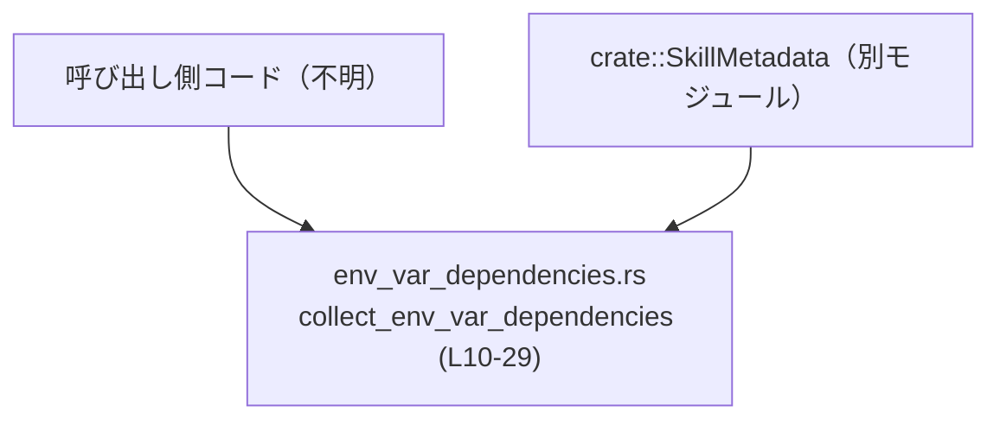
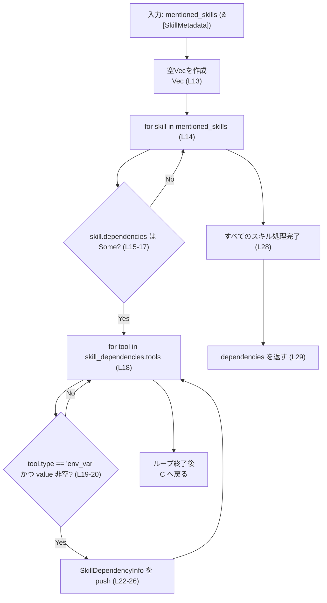
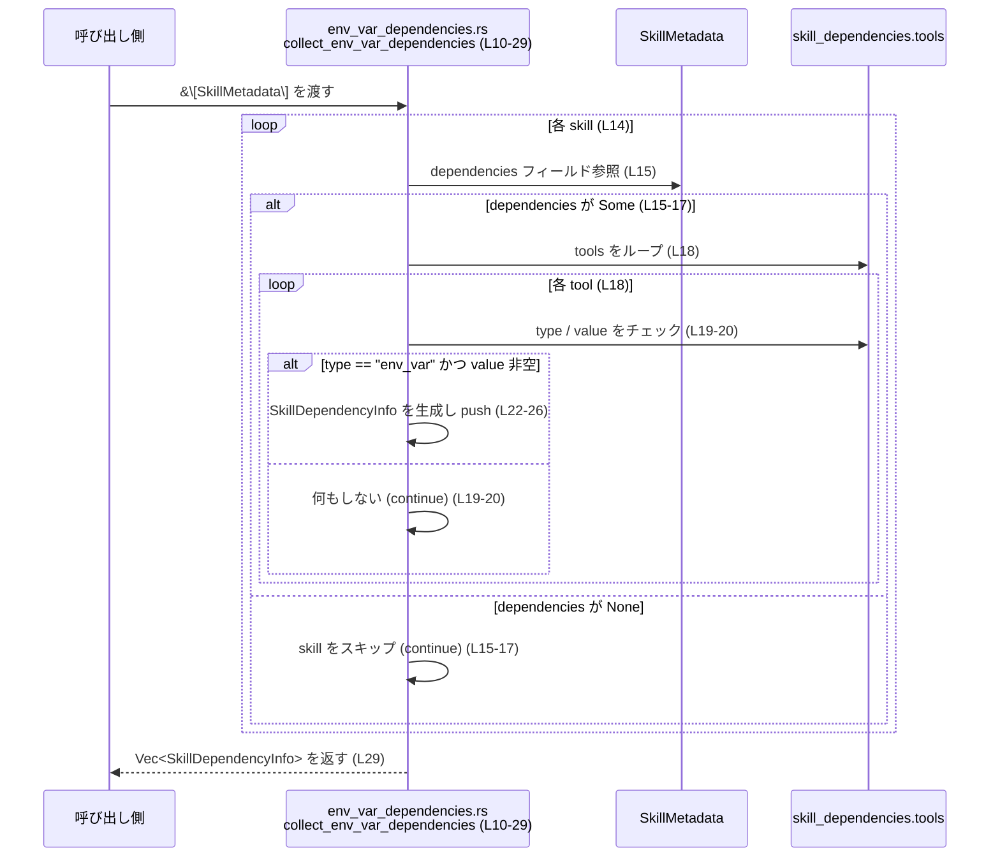

# core-skills/src/env_var_dependencies.rs

## 0. ざっくり一言

`SkillMetadata` の一覧から、「env_var」型のツール依存関係だけを抽出し、環境変数依存の一覧を返すユーティリティです（`collect_env_var_dependencies`）。  
その結果を保持するための軽量なデータ構造 `SkillDependencyInfo` も定義されています。

---

## 1. このモジュールの役割

### 1.1 概要

- このモジュールは、スキル定義 (`SkillMetadata`) に含まれる依存関係情報から、**環境変数（env_var）型の依存だけを集める**役割を持ちます。
- 呼び出し側が、どのスキルがどの環境変数に依存しているかを表示したり検証したりするための、**整形済みの一覧**を提供します。

根拠:

- `SkillDependencyInfo` 定義（環境変数名などを持つ構造体）  
  → `env_var_dependencies.rs:L3-8`
- `collect_env_var_dependencies` 内のフィルタ条件 `tool.r#type != "env_var"`  
  → `env_var_dependencies.rs:L18-21`

### 1.2 アーキテクチャ内での位置づけ

- 依存元:
  - `crate::SkillMetadata` に依存しています（スキル定義の型）。  
    → `env_var_dependencies.rs:L1, L11`
- 提供先:
  - このモジュールを利用する呼び出し側は、`SkillMetadata` の一覧をすでに持っており、それを `collect_env_var_dependencies` に渡すことで環境変数依存の一覧を取得すると考えられます。  
    （呼び出し側の具体的なモジュールはこのチャンクには現れません。）

依存関係の概略図（このファイルの範囲を明示）:



### 1.3 設計上のポイント

- **ステートレスなユーティリティ**  
  - グローバル状態や内部状態を持たず、引数から結果を生成して返すだけです。  
    → `env_var_dependencies.rs:L10-29`
- **明示的なフィルタリングロジック**  
  - 依存関係のうち `tool.r#type == "env_var"` かつ `tool.value` が非空のものだけを抽出します。  
    → `env_var_dependencies.rs:L18-21`
- **安全なエラーハンドリング方針**  
  - `skill.dependencies` が存在しない（`None`）場合はスキップする `let Some(...) else { continue; }` パターンを用いており、パニックせずに静かに無視する方針です。  
    → `env_var_dependencies.rs:L14-17`
- **同期・単純ループのみ**  
  - 非同期処理や並行性はなく、単純な for ループの組み合わせです。  
    → `env_var_dependencies.rs:L14-27`

---

## 2. 主要な機能一覧（コンポーネントインベントリー）

このファイル内の公開コンポーネントを一覧にします。

| 名前 | 種別 | 役割 / 用途 | 定義位置 |
|------|------|-------------|----------|
| `SkillDependencyInfo` | 構造体 | 1 つの環境変数依存関係（どのスキルがどの名前の環境変数に依存し、その説明は何か）を表すデータ構造 | `env_var_dependencies.rs:L3-8` |
| `collect_env_var_dependencies` | 関数 | `SkillMetadata` の一覧から、「env_var」型ツールの情報のみを抽出し、`SkillDependencyInfo` のベクタとして返す | `env_var_dependencies.rs:L10-29` |

主要な機能（目的ベース）として整理すると:

- 環境変数依存情報の保持: `SkillDependencyInfo` 構造体で、スキル名・環境変数名・説明をまとめて保持する。
- 環境変数依存情報の収集: `collect_env_var_dependencies` で、`SkillMetadata` の配列から環境変数依存を抽出しフラットな一覧に変換する。

---

## 3. 公開 API と詳細解説

### 3.1 型一覧（構造体・列挙体など）

| 名前 | 種別 | フィールド | 役割 / 用途 | 定義位置 |
|------|------|-----------|-------------|----------|
| `SkillDependencyInfo` | 構造体 | `skill_name: String` / `name: String` / `description: Option<String>` | 環境変数依存 1 件分を表現する。どのスキル (`skill_name`) が、どの環境変数 (`name`) に依存しているか、その説明 (`description`) を保持する。`Debug`, `Clone`, `PartialEq`, `Eq` を実装。 | `env_var_dependencies.rs:L3-8` |

根拠:

- フィールド定義 → `env_var_dependencies.rs:L4-7`
- derive 属性 → `env_var_dependencies.rs:L3`

#### フィールドの意味（コードから読み取れる範囲）

- `skill_name: String`  
  - 依存元スキルの名前。`collect_env_var_dependencies` 内で `skill.name.clone()` から設定されていることから、`SkillMetadata` の `name` フィールドをコピーした値です。  
    → `env_var_dependencies.rs:L22-25`
- `name: String`  
  - 依存している環境変数名。`tool.value.clone()` から設定されています。  
    → `env_var_dependencies.rs:L22-25`
- `description: Option<String>`  
  - その環境変数の説明。`tool.description.clone()` から設定されています。  
    → `env_var_dependencies.rs:L22-25`  
  - `Option<String>` であるため、説明が存在しない（`None`）ケースにも対応しています。

### 3.2 関数詳細

#### `collect_env_var_dependencies(mentioned_skills: &[SkillMetadata]) -> Vec<SkillDependencyInfo>`

**概要**

- 引数として受け取った `SkillMetadata` のスライス（配列の参照）を走査し、それぞれのスキルの依存関係のうち、**ツール種別が `"env_var"` で value が空でないもの**を抽出します。
- 抽出した依存関係を `SkillDependencyInfo` に詰め、フラットなベクタとして返します。  
  → `env_var_dependencies.rs:L10-29`

**引数**

| 引数名 | 型 | 説明 | 根拠 |
|--------|----|------|------|
| `mentioned_skills` | `&[SkillMetadata]` | 依存関係を調べる対象となるスキルの一覧。スライス参照なので、この関数はスキル一覧の所有権を取りません。 | `env_var_dependencies.rs:L10-12` |

`SkillMetadata` 自体の定義はこのファイルには存在しないため、フィールド構成などの詳細は不明です。ただしコードから次のフィールドが参照されていることがわかります。

- `skill.name` → `env_var_dependencies.rs:L23`
- `skill.dependencies` → `env_var_dependencies.rs:L15-16`

`skill.dependencies` は `let Some(skill_dependencies) = &skill.dependencies else { ... }` という構文で扱われているため、**Option 互換の型**であると考えられますが、正確な型はこのチャンクには現れません。

**戻り値**

- 型: `Vec<SkillDependencyInfo>`  
  → `env_var_dependencies.rs:L12`
- 内容:
  - 各要素は 1 つの環境変数依存を表します。
  - スキルごとに複数の依存があれば、その分だけ要素が追加されます。
  - 同じ環境変数名が複数スキル、または同一スキル内で複数回出現しても、**重複を削除せず**そのまま追加します（この関数内に重複除去処理はありません）。  
    → `env_var_dependencies.rs:L18-27`

**内部処理の流れ（アルゴリズム）**

1. 空のベクタ `dependencies` を作成する。  
   → `env_var_dependencies.rs:L13`
2. `mentioned_skills` の各 `skill` についてループする。  
   → `env_var_dependencies.rs:L14`
3. `skill.dependencies` が `Some(...)` でなければ `continue` し、そのスキルはスキップする。  
   → `env_var_dependencies.rs:L15-17`
4. `skill_dependencies.tools` の各 `tool` についてループする。  
   → `env_var_dependencies.rs:L18`
5. `tool.r#type != "env_var"` または `tool.value.is_empty()` の場合、その `tool` は無視して `continue`。  
   → `env_var_dependencies.rs:L19-20`
6. 条件を満たす `tool` について、`SkillDependencyInfo` を生成し `dependencies` に push する。  
   - `skill_name` に `skill.name.clone()` を設定
   - `name` に `tool.value.clone()` を設定
   - `description` に `tool.description.clone()` を設定  
   → `env_var_dependencies.rs:L22-26`
7. 全スキルの処理が終わったら `dependencies` を返す。  
   → `env_var_dependencies.rs:L29`

処理フローの簡易図:



**Examples（使用例）**

このファイルには使用例は含まれていません。このため、ここでは挙動を説明するための**簡易的な例**を示します。  
以下の構造体定義は実際の `SkillMetadata` とは異なる可能性があり、あくまで挙動のイメージ用です。

```rust
// （例示用）SkillMetadata と依存情報の簡易的な定義
// 実際の定義はこのファイルには含まれていません。
#[derive(Clone)]
struct Tool {
    r#type: String,          // "env_var" など
    value: String,           // 環境変数名
    description: Option<String>,
}

#[derive(Clone)]
struct Dependencies {
    tools: Vec<Tool>,
}

#[derive(Clone)]
struct SkillMetadata {
    name: String,
    dependencies: Option<Dependencies>,
}

// 実際の関数（本ファイルのもの）を利用
use crate::env_var_dependencies::{collect_env_var_dependencies, SkillDependencyInfo};

fn main() {
    // 2 つのスキルを仮定
    let skills = vec![
        SkillMetadata {
            name: "skill_a".to_string(),
            dependencies: Some(Dependencies {
                tools: vec![
                    Tool {
                        r#type: "env_var".to_string(),
                        value: "API_KEY".to_string(),
                        description: Some("外部 API のキー".to_string()),
                    },
                    Tool {
                        r#type: "file".to_string(),    // env_var ではないので無視される
                        value: "/tmp/config".to_string(),
                        description: None,
                    },
                ],
            }),
        },
        SkillMetadata {
            name: "skill_b".to_string(),
            dependencies: None, // 依存なしなので無視される
        },
    ];

    // 環境変数依存だけを収集
    let env_deps: Vec<SkillDependencyInfo> = collect_env_var_dependencies(&skills);

    for dep in env_deps {
        println!("skill={} env_var={} description={:?}",
                 dep.skill_name, dep.name, dep.description);
    }

    // 出力イメージ:
    // skill=skill_a env_var=API_KEY description=Some("外部 API のキー")
}
```

**Errors / Panics**

- この関数自体は `Result` ではなく `Vec` を返すため、**エラーを表現しません**。  
  → シグネチャ `-> Vec<SkillDependencyInfo>` (`env_var_dependencies.rs:L12`)
- パニックを引き起こすような明示的な `panic!` や `unwrap` などは使用していません。
- `mentioned_skills` やその内部フィールドに対し、不正なインデックスアクセスやアンラップはありません。  
  → すべて `for` ループと `if` / `let Some(..)` で処理 (`env_var_dependencies.rs:L14-27`)

そのため、通常の使用ではパニックは発生しないと考えられます。

**Edge cases（エッジケース）**

コードから読み取れる代表的なケース:

- `mentioned_skills` が空スライス (`&[]`) の場合  
  - ループに入らないため、そのまま空ベクタを返します。  
    → `env_var_dependencies.rs:L13-14, L29`
- ある `skill` の `dependencies` が `None` の場合  
  - `let Some(...) = &skill.dependencies else { continue; };` により、そのスキルはスキップされます。  
    → `env_var_dependencies.rs:L15-17`
- `skill_dependencies.tools` が空の場合  
  - `for tool in &skill_dependencies.tools` が 0 回で終了し、そのスキルについては何も追加されません。  
    → `env_var_dependencies.rs:L18-27`
- `tool.r#type != "env_var"` の場合  
  - `continue` され、このツールは無視されます。  
    → `env_var_dependencies.rs:L19-20`
- `tool.value.is_empty()`（空文字列）の場合  
  - 同様に `continue` され、環境変数名が空のものは結果に含まれません。  
    → `env_var_dependencies.rs:L19-20`
- `tool.description` が `None` の場合  
  - そのまま `description: None` として `SkillDependencyInfo` に格納されます。  
    → `env_var_dependencies.rs:L22-25`

**使用上の注意点**

- **重複の扱い**  
  - 同じ環境変数名が複数スキル、または同一スキル内で複数存在する場合も、そのまま複数件として返します。重複排除を行いたい場合は、呼び出し側で `HashSet` などを使って後処理する必要があります。  
    → 重複除去処理が存在しないことは、push ロジックのみから読み取れます (`env_var_dependencies.rs:L22-26`)。
- **環境変数以外は含まれない**  
  - `tool.r#type == "env_var"` のものだけが対象です。他の種別（例: "file" 等）の依存を同時に扱いたい場合、この関数だけでは足りません。  
    → `env_var_dependencies.rs:L19`
- **空名の環境変数は無視される**  
  - `tool.value.is_empty()` の場合はスキップされます。空文字列を有効な名前として扱いたい設計であれば、この条件は変更が必要です。  
    → `env_var_dependencies.rs:L19-20`
- **所有権とコスト**  
  - `skill.name.clone()`, `tool.value.clone()`, `tool.description.clone()` で文字列のクローンを作るため、依存件数が多い場合はそれに比例してメモリ確保・コピーのコストがかかります。  
    → `env_var_dependencies.rs:L22-25`

### 3.3 その他の関数

このファイルには `collect_env_var_dependencies` 以外の関数は定義されていません。  
→ 関数定義は `env_var_dependencies.rs:L10-29` の 1 件のみです。

---

## 4. データフロー

このモジュールを使って環境変数依存を収集する際の、代表的なデータフローを示します。

1. 呼び出し側が `SkillMetadata` の配列（例: `Vec<SkillMetadata>`）を用意する。
2. そのスライス参照を `collect_env_var_dependencies` に渡す。
3. 関数内で各 `SkillMetadata` の `dependencies.tools` を走査し、「env_var」で非空 value のものを `SkillDependencyInfo` に変換する。
4. 変換された `Vec<SkillDependencyInfo>` を呼び出し側で利用する。

シーケンス図（`collect_env_var_dependencies (L10-29)` の範囲を明示）:



---

## 5. 使い方（How to Use）

### 5.1 基本的な使用方法

`SkillMetadata` の一覧をすでに持っていることを前提に、この関数を利用して環境変数依存情報を取得する典型的な流れです。

```rust
use crate::SkillMetadata;
use crate::env_var_dependencies::{collect_env_var_dependencies, SkillDependencyInfo};

fn main() {
    // SkillMetadata の一覧をどこかから取得する
    // 実際には設定ファイルの読み込みなど別の処理が必要ですが、
    // このファイルにはその実装は含まれていません。
    let skills: Vec<SkillMetadata> = load_skills_from_somewhere(); // 仮の関数

    // 環境変数依存を収集する
    let env_deps: Vec<SkillDependencyInfo> = collect_env_var_dependencies(&skills);

    // 結果を利用する（例: 必要な環境変数を一覧表示）
    for dep in env_deps {
        println!(
            "skill: {:<20} env_var: {:<20} desc: {:?}",
            dep.skill_name,
            dep.name,
            dep.description
        );
    }
}

// 上記の load_skills_from_somewhere は、このファイルには存在しません。
// 実際の実装はプロジェクト内の別モジュールに依存します。
```

### 5.2 よくある使用パターン

1. **必須環境変数の一覧表示**  
   - CLI や GUI で「このプロジェクトを使う前に設定すべき環境変数一覧」を表示する用途。
   - `collect_env_var_dependencies` で取得したベクタを、そのままテーブル表示等に使う。

2. **環境変数の事前チェック**  
   - アプリケーション起動時に、必要な環境変数がすべて `std::env::var` などで取得できるかを確認する。
   - `SkillDependencyInfo.name` をキーとして実際の環境をチェックする。

   （環境変数の取得・検証処理自体はこのファイルには含まれていません。）

### 5.3 よくある間違い

このファイルから推測できる範囲での誤用例を示します。

```rust
use crate::env_var_dependencies::collect_env_var_dependencies;

// 誤り例: Vec<SkillMetadata> の所有権を渡してしまう（& を付け忘れる）
fn wrong(skills: Vec<SkillMetadata>) {
    // let env_deps = collect_env_var_dependencies(skills); // コンパイルエラー
    // 正しくは参照（&）を渡す
    let env_deps = collect_env_var_dependencies(&skills);
}

// 誤り例: この関数が重複を除去してくれると期待する
fn assume_dedup(skills: &[SkillMetadata]) {
    let env_deps = collect_env_var_dependencies(skills);
    // env_deps 内には同じ env_var 名が複数含まれることがありうる。
    // この関数内で重複除去は行われていないため、
    // 重複を避けたい場合はここで HashSet などを使った後処理が必要。
}
```

### 5.4 使用上の注意点（まとめ）

- 引数には所有権ではなくスライス参照 `&[SkillMetadata]` を渡す必要があります。  
  → シグネチャ `mentioned_skills: &[SkillMetadata]` (`env_var_dependencies.rs:L11`)
- この関数はあくまで「env_var」型の依存を抽出するだけであり、**実際の環境変数値の取得や検証は行いません**。
- 結果ベクタ内の要素は重複する可能性があります。必要なら呼び出し側で重複排除を行う必要があります。
- 処理は同期的であり、また I/O を行わないため、並行実行やエラー処理に関する特別な配慮は不要です（単純な CPU・メモリ処理です）。

---

## 6. 変更の仕方（How to Modify）

### 6.1 新しい機能を追加する場合

例として、「env_var 以外の種別も収集したい」「種別ごとに別の構造体にまとめたい」といった変更を行う際の観点です。

1. **収集対象の追加**  
   - たとえば `"secret_env_var"` のような追加種別を扱いたい場合、`if tool.r#type != "env_var"` という条件を調整する必要があります。  
     → 変更ポイント: `env_var_dependencies.rs:L19-20`
2. **返却構造の変更**  
   - `SkillDependencyInfo` にフィールドを追加したい場合は、そのフィールドを構造体定義に追加し (`env_var_dependencies.rs:L4-7`)、`collect_env_var_dependencies` 内で値を設定する必要があります (`env_var_dependencies.rs:L22-25`)。
3. **別種別用の関数追加**  
   - 環境変数以外（例えばファイル依存）を抽出する関数を追加する場合、このファイルに類似の関数を定義し、フィルタ条件を `"file"` などに変更するのが自然です。

### 6.2 既存の機能を変更する場合

- **フィルタ条件の変更**  
  - 例えば空文字列の `tool.value` も許容したい場合、`tool.value.is_empty()` のチェックを削除または変更します。  
    → `env_var_dependencies.rs:L19-20`
- **スキップ方針の変更**  
  - 現在は `skill.dependencies` が `None` の場合静かにスキップしますが、これをエラー扱いにしたい場合は `continue` の代わりにログ出力や Result 型の導入が必要です。  
    → `env_var_dependencies.rs:L15-17`
- **性能上の調整**  
  - `clone()` を減らしたい場合、`SkillDependencyInfo` のフィールドを `String` ではなく `&str` に変更する、あるいは呼び出し側で所有権を移すなど、所有権設計を見直す必要があります。ただし、その場合はライフタイムの扱いが複雑になる点に注意が必要です。

既存機能を変更する際は、`SkillDependencyInfo` と `collect_env_var_dependencies` を利用している箇所すべてでコンパイルエラーが出ないかを確認する必要があります（このチャンクからは、どこで使われているかは分かりません）。

---

## 7. 関連ファイル

このモジュールと密接に関係する型・ファイルについて、このチャンクから読み取れる範囲で整理します。

| パス / 型名 | 役割 / 関係 | 根拠 |
|------------|------------|------|
| `crate::SkillMetadata` | スキル定義を表す型。`collect_env_var_dependencies` の入力として使用される。フィールド構造はこのファイルには記述がなく、`name` フィールドと `dependencies` フィールド、および `dependencies.tools` の存在だけが読み取れる。 | `env_var_dependencies.rs:L1, L11, L14-18, L23` |
| `skill_dependencies.tools`（型名不明） | 各スキルの依存ツール一覧。中の要素は `r#type`, `value`, `description` フィールドを持つことがコードから分かるが、型定義はこのチャンクには現れない。 | `env_var_dependencies.rs:L18-19, L22-25` |

テストコードや `SkillMetadata` の具体的な定義がどのファイルにあるかは、このチャンクには現れないため不明です。
