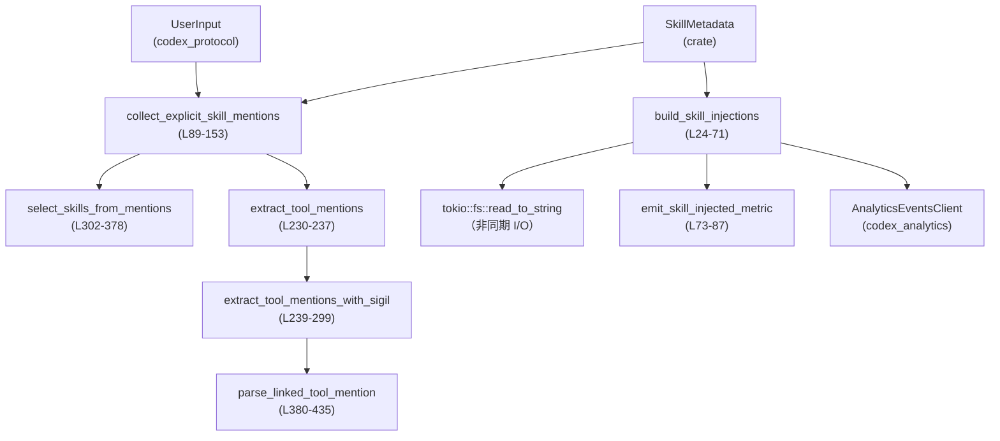
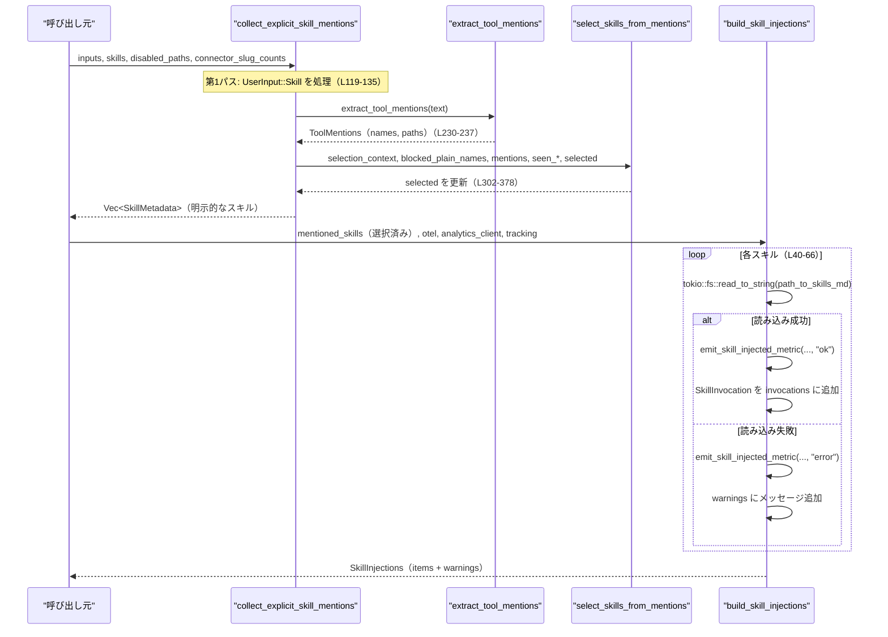

# core-skills/src/injection.rs コード解説

## 0. ざっくり一言

ユーザー入力中の「ツール／スキルの明示的な言及」を解析し、どのスキルを注入（ロード）するかを決め、そのスキル定義ファイル（SKILL.md）を読み込んでレスポンスに埋め込むためのユーティリティ群です（`core-skills/src/injection.rs:L18-71, L89-153`）。

---

## 1. このモジュールの役割

### 1.1 概要

- ユーザー入力（構造化 `UserInput::Skill` とテキスト中の `$tool-name` 記法）から、どの `SkillMetadata` が明示的に指定されたかを判定します（`collect_explicit_skill_mentions`）（`core-skills/src/injection.rs:L89-153, L302-378`）。
- 選ばれたスキルに対応する `SKILL.md` を非同期に読み込み、`ResponseItem` としてモデルへのシステムメッセージ等に注入する構造体 `SkillInjections` を構築します（`build_skill_injections`）（`core-skills/src/injection.rs:L18-71`）。
- テキスト中の `$ツール名` や `[$ツール名](パス)` からツール名・パスを抽出する低レベルパーサを提供します（`extract_tool_mentions_with_sigil` など）（`core-skills/src/injection.rs:L230-299, L380-435`）。
- ツールパスを `app://`, `mcp://`, `plugin://`, `skill://` などの種類に分類するヘルパーも含みます（`tool_kind_for_path`）（`core-skills/src/injection.rs:L191-209`）。

### 1.2 アーキテクチャ内での位置づけ

このモジュールは、「スキルメタデータ」と「ユーザー入力」から「注入すべきスキル」と「対応する SKILL.md の内容」を決める中間レイヤです。



- `collect_explicit_skill_mentions` で「どのスキルを使うか」が決まり、その結果が別の場所（たとえば呼び出し元のサービス）から `build_skill_injections` に渡されて SKILL.md 読み込みとメトリクス送信が行われる、という流れになっています。

### 1.3 設計上のポイント

- 責務の分割  
  - スキルの「選択ロジック」（名前・パスの解決）は `collect_explicit_skill_mentions` / `select_skills_from_mentions` が担当（`core-skills/src/injection.rs:L89-153, L302-378`）。
  - テキストのパース（`$name` / `[$name](path)`）は `extract_tool_mentions_with_sigil` と `parse_linked_tool_mention` に分離（`core-skills/src/injection.rs:L239-299, L380-435`）。
  - ファイル I/O とメトリクス送出は `build_skill_injections` / `emit_skill_injected_metric` に限定（`core-skills/src/injection.rs:L24-71, L73-87`）。
- 状態管理  
  - モジュール内にグローバルな状態はなく、全ての関数は引数とローカル変数だけを使います。`ToolMentions` などの構造体は一時的な解析結果を保持するだけです。
- エラーハンドリング方針  
  - SKILL.md の読み込み失敗は `SkillInjections.warnings` に人間向けメッセージを追加しつつ、メトリクスで `"error"` として記録しますが、呼び出し元にはエラー型としては返さず、成功したものだけを `items` に積みます（`core-skills/src/injection.rs:L56-64`）。
  - テキストパース系は `Option` を使って「パターンに合わない場合は None」を返す形で、例外や panic を発生させない設計です（`parse_linked_tool_mention` など）（`core-skills/src/injection.rs:L380-435`）。
- 並行性  
  - `build_skill_injections` は `async fn` として定義され、Tokio の非同期ファイル I/O を用いて SKILL.md を読み込みます（`core-skills/src/injection.rs:L24-41`）。
  - このモジュール内で共有可変状態やグローバル変数は使われていないため、関数自体はスレッドセーフな呼び出し方がしやすい構造になっています（外部型のスレッド安全性はこのファイルからは分かりません）。

---

## 2. 主要な機能一覧

- スキル注入構築: `build_skill_injections` — 選択済みスキルの SKILL.md を読み込み、`ResponseItem` と警告をまとめる（`core-skills/src/injection.rs:L24-71`）。
- スキル明示指定の収集: `collect_explicit_skill_mentions` — `UserInput` 列から明示的に指定された `SkillMetadata` を決定する（`core-skills/src/injection.rs:L89-153`）。
- テキスト中のツール言及抽出: `extract_tool_mentions` / `extract_tool_mentions_with_sigil` — `$tool` / `[$tool](path)` 形式の言及を `ToolMentions` にパースする（`core-skills/src/injection.rs:L230-299`）。
- スキル選択ロジック: `select_skills_from_mentions` — `ToolMentions` とスキル一覧・無効スキル・コネクタ情報から、実際に選ぶ `SkillMetadata` を決める（`core-skills/src/injection.rs:L302-378`）。
- ツールパス種別判定: `tool_kind_for_path` — `app://`, `mcp://`, `plugin://`, `skill://` や `SKILL.md` に基づきツール種別を分類する（`core-skills/src/injection.rs:L191-209`）。
- パス正規化・抽出: `app_id_from_path`, `plugin_config_name_from_path`, `normalize_skill_path` — パスから ID や設定名を抜き出したり、`skill://` プレフィックスを取り除く（`core-skills/src/injection.rs:L216-228`）。
- テスト用ヘルパー: `text_mentions_skill` — テキストが特定の `$skill` を含むかの判定ロジック（テストビルドのみ）（`core-skills/src/injection.rs:L455-485`）。

---

## 3. 公開 API と詳細解説

### 3.1 型一覧（構造体・列挙体など）

| 名前 | 種別 | 公開範囲 | 役割 / 用途 | 根拠 |
|------|------|----------|-------------|------|
| `SkillInjections` | 構造体 | `pub` | 注入されたスキルの `ResponseItem` と、読み込み失敗などの警告メッセージを保持するコンテナ | `core-skills/src/injection.rs:L18-22` |
| `SkillSelectionContext<'a>` | 構造体 | モジュール内 | スキル一覧・無効パス・名前カウントなど、選択処理に必要なコンテキスト情報をまとめる | `core-skills/src/injection.rs:L155-160` |
| `ToolMentions<'a>` | 構造体 | `pub` | テキスト中に検出されたツール名・パス・プレーンな名前を、それぞれセットとして保持する | `core-skills/src/injection.rs:L162-166` |
| `ToolMentionKind` | 列挙体 | `pub` | パスの種別（App, MCP, Plugin, Skill, Other）を表す | `core-skills/src/injection.rs:L182-189` |

メソッド／関連関数:

- `ToolMentions::plain_names()` / `paths()` は公開メソッドとして、検出されたプレーン名やパスを列挙するために用意されています（`core-skills/src/injection.rs:L173-179`）。

### 3.2 関数詳細（主要 7 件）

#### `build_skill_injections(...) -> SkillInjections`

```rust
pub async fn build_skill_injections(
    mentioned_skills: &[SkillMetadata],
    otel: Option<&SessionTelemetry>,
    analytics_client: &AnalyticsEventsClient,
    tracking: TrackEventsContext,
) -> SkillInjections
// core-skills/src/injection.rs:L24-71
```

**概要**

- 明示的に選択されたスキル一覧 (`mentioned_skills`) を受け取り、それぞれの `SKILL.md` を非同期に読み込んで `SkillInjections`（レスポンス用アイテム＋警告）を組み立てます（`core-skills/src/injection.rs:L24-71`）。
- 読み込み成功／失敗ごとに OpenTelemetry メトリクスを送信し、成功分については分析用の `SkillInvocation` を `AnalyticsEventsClient` に記録します（`core-skills/src/injection.rs:L41-50, L68`）。

**引数**

| 引数名 | 型 | 説明 |
|--------|----|------|
| `mentioned_skills` | `&[SkillMetadata]` | 注入対象とするスキルメタデータのスライス。空であれば即座にデフォルト値を返します（`L24-31`）。 |
| `otel` | `Option<&SessionTelemetry>` | OpenTelemetry セッション。`Some` の場合のみメトリクスを送信し、`None` の場合はメトリクス送信をスキップします（`L73-80`）。 |
| `analytics_client` | `&AnalyticsEventsClient` | スキル呼び出しをトラッキングするための分析クライアント（`L7, L68`）。 |
| `tracking` | `TrackEventsContext` | 分析イベントのコンテキスト（セッション ID などを含むと推測されますが、詳細はこのチャンクにはありません）（`L10, L24-29`）。 |

**戻り値**

- `SkillInjections`  
  - `items`: 読み込みに成功した各 `SkillMetadata` について、`SkillInstructions` を `ResponseItem` に変換したもののリスト（`L34-37, L50-54`）。
  - `warnings`: 読み込みに失敗したスキルについて、「Failed to load skill ...」形式のメッセージ文字列を保持します（`L56-64`）。

**内部処理の流れ**

1. `mentioned_skills` が空なら、何もせず `SkillInjections::default()` を返します（`L30-32`）。
2. 結果用の `SkillInjections` と、分析イベント用の `invocations: Vec<SkillInvocation>` を準備します（`L34-38`）。
3. 各 `skill` について、`tokio::fs::read_to_string` で `skill.path_to_skills_md` を非同期に読み込みます（`L40-41`）。
4. 読み込み成功 (`Ok(contents)`) の場合:
   - `emit_skill_injected_metric(otel, skill, "ok")` でメトリクス送信（`L42-43`）。
   - `SkillInvocation` を作成し `invocations` に追加（`L44-49`）。
   - `SkillInstructions { name, path, contents }` を `ResponseItem::from` で変換し、`result.items` に追加（`L50-54`）。
5. 読み込み失敗 (`Err(err)`) の場合:
   - `"error"` ステータスでメトリクス送信（`L56-57`）。
   - エラーメッセージを format! で生成し `result.warnings` に追加（`L58-64`）。
6. ループ完了後、`analytics_client.track_skill_invocations(tracking, invocations)` で成功したスキルの呼び出し情報を送信（`L68`）。
7. `result` を返却（`L70`）。

**Examples（使用例）**

スキル一覧が既に決まっているケースの例です。外部型はコメントで省略します。

```rust
use std::collections::HashSet;
use core_skills::injection::{build_skill_injections, SkillInjections}; // 仮のパス

#[tokio::main] // Tokio ランタイムを起動
async fn main() -> anyhow::Result<()> {
    let mentioned_skills: Vec<SkillMetadata> = vec![
        /* 有効な SkillMetadata を構築する */
    ];

    let otel: Option<&SessionTelemetry> = None;           // メトリクス無しで実行
    let analytics_client = AnalyticsEventsClient::new();  // 実際の生成方法は別モジュール
    let tracking = TrackEventsContext::new();             // コンテキスト生成（詳細不明）

    let injections: SkillInjections = build_skill_injections(
        &mentioned_skills,
        otel,
        &analytics_client,
        tracking,
    ).await;                                              // 非同期で SKILL.md を読み込む

    for item in &injections.items {                       // 成功したスキルごとの ResponseItem
        println!("Injected skill item: {:?}", item);
    }
    for warning in &injections.warnings {                 // 読み込み失敗メッセージ
        eprintln!("Warning: {}", warning);
    }

    Ok(())
}
```

※ `SkillMetadata` / `AnalyticsEventsClient` / `TrackEventsContext` の具体的な生成方法はこのファイルには現れないため不明です。

**Errors / Panics**

- ファイル読み込み (`fs::read_to_string`) の失敗は `Err` として呼び出し元に伝播せず、`warnings` ベクタに文字列として格納されるだけです（`L56-64`）。
- この関数内には `unwrap` や明示的な `panic!` はなく、標準ライブラリ／Tokio 内部での panic 以外には panic 要因は見当たりません。
- メトリクス／分析クライアントがエラーを返すかどうかはこのチャンクでは分かりません。呼び出し結果は変数に束縛されておらず、エラーを無視する設計になっていると解釈できます（`L73-86, L68`）。

**Edge cases（エッジケース）**

- `mentioned_skills` が空: すぐに `SkillInjections::default()` を返し、ファイル I/O やメトリクス送信は一切行いません（`L30-32`）。
- 一部のスキルだけが読み込み失敗する: 成功分だけ `items` に入り、失敗分は `warnings` にメッセージが追加されます。`track_skill_invocations` に渡されるのは成功したスキルだけです（`L42-50, L56-64, L68`）。
- 同じパスのスキルが `mentioned_skills` に重複している場合: それぞれ独立に読み込まれ、`items` にも複数入ります。重複排除は行っていません。

**使用上の注意点**

- 非同期関数なので、Tokio などの非同期ランタイム上で `.await` する必要があります。
- 読み込み失敗があっても `Result` ではなく `warnings` でしか通知されないため、呼び出し側で `warnings` を必ず確認しないと失敗に気付きにくい点に注意が必要です。
- `AnalyticsEventsClient` や `SessionTelemetry` のスレッド安全性はこのモジュールからは分かりませんが、この関数自身は共有可変状態を持たないため、同一 `AnalyticsEventsClient` を複数タスクから使う場合は、その型の仕様を確認する必要があります。

---

#### `collect_explicit_skill_mentions(...) -> Vec<SkillMetadata>`

```rust
pub fn collect_explicit_skill_mentions(
    inputs: &[UserInput],
    skills: &[SkillMetadata],
    disabled_paths: &HashSet<PathBuf>,
    connector_slug_counts: &HashMap<String, usize>,
) -> Vec<SkillMetadata>
// core-skills/src/injection.rs:L100-153
```

**概要**

- 構造化 `UserInput::Skill` とテキスト `UserInput::Text` の両方から、「ユーザーが明示的に使うと指定したスキル」を抽出し、`SkillMetadata` のリストとして返します（`L89-99, L100-153`）。
- パス指定（リンク）によるスキル選択を優先し、その後にテキスト中の `$skill-name` を用いて名前解決します。名前解決では、名前の曖昧さ（同名スキルやコネクタの存在）を考慮し、**一意な場合のみ** 選択します（`L119-135, L302-378`）。

**引数**

| 引数名 | 型 | 説明 |
|--------|----|------|
| `inputs` | `&[UserInput]` | ユーザー入力の列。`UserInput::Skill { name, path }` と `UserInput::Text { text, .. }` が少なくとも存在することがコードから読み取れます（`L119-121, L138-140`）。 |
| `skills` | `&[SkillMetadata]` | 利用可能なスキルのメタデータ一覧。パスと名前でスキルを特定するために使用します（`L102, L126-134`）。 |
| `disabled_paths` | `&HashSet<PathBuf>` | 無効化されたスキルのパス集合。ここに含まれるパスは、たとえ明示されていても選択対象から除外されます（`L103, L122-123, L327-333`）。 |
| `connector_slug_counts` | `&HashMap<String, usize>` | コネクタ（MCP / プラグインなど）のスラグ名の出現数。スキル名とコネクタ名が衝突する場合に、曖昧なテキスト参照を避けるために使われます（`L104, L364-367`）。 |

**戻り値**

- `Vec<SkillMetadata>`  
  - 明示的に選ばれたスキルメタデータのリスト。順序は `skills` 引数に渡されたスキル一覧の順序をできるだけ保つように設計されています（特に `select_skills_from_mentions` 内のループ順から）（`L302-341, L343-377`）。

**内部処理の流れ**

1. `build_skill_name_counts` を呼び出し、スキル名ごとの出現回数を計算します（`L106`）。
2. `SkillSelectionContext` を構築し、選択処理に必要な参照をまとめます（`L108-113`）。
3. 選択済みスキルやブロックされた名前を追跡するための集合を用意します（`selected`, `seen_names`, `seen_paths`, `blocked_plain_names`）（`L114-117`）。
4. **第1パス（構造化スキル入力）**:
   - `inputs` を走査し、`UserInput::Skill { name, path }` のみを対象にします（`L119-121`）。
   - その `name` を `blocked_plain_names` に追加し、後のテキスト解析で同名の `$name` をスキップするようにします（`L121`）。
   - `disabled_paths` または `seen_paths` に含まれるパスならスキップ（`L122-123`）。
   - そうでなければ、`skills` の中から `path_to_skills_md == path` のものを検索し、見つかれば `selected` に追加しつつ、`seen_paths`/`seen_names` に記録します（`L126-134`）。
5. **第2パス（テキスト入力）**:
   - `inputs` を再度走査し、今度は `UserInput::Text { text, .. }` だけを対象とします（`L138-140`）。
   - 各テキストに対して `extract_tool_mentions(text)` を呼び出し、`ToolMentions` を得ます（`L140`）。
   - `select_skills_from_mentions` に `selection_context` や `blocked_plain_names`、`seen_*`、`selected` を渡してスキルを追加選択します（`L141-148`）。
6. 最終的な `selected` を返します（`L152`）。

**Examples（使用例）**

```rust
use std::collections::{HashMap, HashSet};
use std::path::PathBuf;
use codex_protocol::user_input::UserInput;
use core_skills::injection::collect_explicit_skill_mentions; // 仮のパス

fn example() {
    let inputs = vec![
        UserInput::Text {
            text: "Please run $search on this query".to_string(), // テキスト中の $search
            // 他のフィールドはこのチャンクには現れない
        },
    ];
    let skills: Vec<SkillMetadata> = vec![
        /* name = "search" を含む SkillMetadata を用意する */
    ];

    let disabled_paths: HashSet<PathBuf> = HashSet::new();       // 全スキル有効
    let connector_slug_counts: HashMap<String, usize> = HashMap::new(); // コネクタ名の衝突無し

    let selected = collect_explicit_skill_mentions(
        &inputs,
        &skills,
        &disabled_paths,
        &connector_slug_counts,
    );

    // selected に "search" スキルの SkillMetadata が 1 件入ることが期待される
}
```

**Errors / Panics**

- この関数自体は `Result` を返さず、panic を発生させるコードも含まれていません。
- `build_skill_name_counts` の内部挙動はこのチャンクからは分かりませんが、戻り値 `.0` が `HashMap<String, usize>` である前提で動作します（`L106`）。
- すべての `UserInput::Skill` の `path` と `skills[*].path_to_skills_md` が `PathBuf` として比較可能であることを前提としています（`L126-130`）。

**Edge cases（エッジケース）**

- 同じスキルパスが複数の `UserInput::Skill` で指定された場合: `seen_paths` によって2回目以降は無視されます（`L121-123`）。
- `UserInput::Skill` で指定された `name` と同じプレーン名 `$name` がテキスト中に現れた場合: `blocked_plain_names` により、その名前によるテキスト選択は行われません（`L121, L352-355`）。
- `skills` 内に同名のスキルが複数存在する場合: `skill_name_counts` により、その名前の `skill_count` が 1 ではなくなり、テキストによる名前解決では選択されなくなります（`L359-370`）。
- 同名のコネクタが存在する場合: `connector_slug_counts` が 0 でないため、その名前は曖昧と見なされ、テキストからは選択されません（`L364-370`）。
- `disabled_paths` に含まれるスキル: 構造化入力でもテキスト入力でも、常にスキップされます（`L122-123, L327-333`）。

**使用上の注意点**

- この関数は **「明示的な」スキル指定の収集** に特化しており、暗黙の推論などは行いません。`skills` に存在しない名前やパスは無視されます。
- 名前ベースの選択は、`skill_name_counts` と `connector_slug_counts` に依存します。これらの値が実際のシステム構成とずれていると、想定と異なるスキルが選ばれる、あるいは選ばれない可能性があります。
- `UserInput` のバリアント構成（`Skill` / `Text`）はこのファイルに閉じていないため、他のバリアントが追加されてもこの関数には影響しませんが、新バリアントは無視されます。

---

#### `extract_tool_mentions(text: &str) -> ToolMentions<'_>`

```rust
pub fn extract_tool_mentions(text: &str) -> ToolMentions<'_> {
// core-skills/src/injection.rs:L235-237
```

**概要**

- テキスト中から `$tool-name` 形式のツール名、および `[$tool-name](path)` 形式のリンク付きツール言及を検出し、`ToolMentions` として返すラッパー関数です（`L230-237`）。
- 実際の処理は `extract_tool_mentions_with_sigil` に委譲され、シジル（接頭記号）として `TOOL_MENTION_SIGIL` を使用します（`L235-237`）。

**引数**

| 引数名 | 型 | 説明 |
|--------|----|------|
| `text` | `&str` | ユーザーのテキスト入力。中に `$tool` や `[$tool](path)` が含まれているかどうかを解析します。 |

**戻り値**

- `ToolMentions<'_>`  
  - `names`: 検出されたすべてのツール名（リンク付きとプレーンの両方）（`L241-243, L287-291, L252-259`）。
  - `paths`: リンク付きツールの `path` 部分（`L241-243, L252-260`）。
  - `plain_names`: `$tool` 形式のプレーン言及のみ（`L242-243, L287-291`）。

**内部処理の流れ**

1. グローバルに定義された `TOOL_MENTION_SIGIL`（おそらく `$`）とともに `extract_tool_mentions_with_sigil` を呼び出します（`L235-237`）。
2. 結果の `ToolMentions` をそのまま返します。

**Examples（使用例）**

```rust
use core_skills::injection::extract_tool_mentions; // 仮のパス

fn parse_text() {
    let text = "Use $search or [$analyze](skill://analytics/ANALYZE_SKILL.md).";

    let mentions = extract_tool_mentions(text);      // TOOL_MENTION_SIGIL を使って解析

    // names には "search", "analyze" が含まれる
    // paths には "skill://analytics/ANALYZE_SKILL.md" が含まれる
    for name in mentions.plain_names() {
        println!("Plain tool mention: {}", name);
    }
}
```

**Errors / Panics**

- 例外や panic を起こすコードは含まれていません。内部で参照する `extract_tool_mentions_with_sigil` も、インデックス操作で `get` を使い、範囲外アクセスは `None` やループ継続で処理されます（`L271-274`）。

**Edge cases**

- `text` が空文字列の場合: `ToolMentions` の各セットは空になり、`is_empty()` は `true` になります（`L239-247, L169-171`）。
- ツール言及が存在しない普通のテキストの場合も同様です。

**使用上の注意点**

- `ToolMentions` のライフタイム `'a` は元の `text` に束縛されているため、`ToolMentions` を保持している間は `text` がスコープから外れないようにする必要があります。これはコンパイラのライフタイムチェックによって自動的に保証されます。

---

#### `extract_tool_mentions_with_sigil(text: &str, sigil: char) -> ToolMentions<'_>`

```rust
pub fn extract_tool_mentions_with_sigil(
    text: &str,
    sigil: char,
) -> ToolMentions<'_>
// core-skills/src/injection.rs:L239-299
```

**概要**

- 任意のシジル（例: `$`, `@` など）を使って、テキスト中のツール言及を解析する本体関数です。
- 2 種類のパターンを検出します:
  - プレーン: `<sigil><name>` 例: `$search`
  - リンク付き: `[\<sigil\><name>](path)` 例: `[$search](skill://.../SKILL.md)`（`L245-263, L380-435`）。

**引数**

| 引数名 | 型 | 説明 |
|--------|----|------|
| `text` | `&str` | 対象テキスト。バイト列として走査されます（`L240-241, L245-246`）。 |
| `sigil` | `char` | ツール名の前に付く 1 文字の記号（通常は `$`）。 |

**戻り値**

- `ToolMentions<'_>`: `names`, `paths`, `plain_names` を含む検出結果（`L295-299`）。

**内部処理の流れ**

1. `text` を `as_bytes()` でバイト列に変換し、検出用のセットを初期化します（`L240-243`）。
2. `index` を 0 から `text_bytes.len()` までインクリメンタルに進めるループを開始します（`L245-246`）。
3. 各位置での処理:
   - もし現在のバイトが `'['` であり、かつ `parse_linked_tool_mention(text, text_bytes, index, sigil)` が `Some` を返した場合（リンク付きパターン）（`L247-251`）:
     - `name` がよくある環境変数名（`PATH` 等）でなければ（`is_common_env_var` が false）、`path` のツール種別を判定し、`App`/`Mcp`/`Plugin` 以外なら `mentioned_names` に `name` を入れます（`L252-259`）。
     - さらに `mentioned_paths` に `path` を入れ、`index` を `end_index` に更新して続行します（`L252-262`）。
   - そうでなければ、`sigil` と等しいバイトかどうかをチェックします（`L265-268`）。
     - 等しくなければ `index += 1` して次の位置へ（`L265-268`）。
     - 等しければ、次の 1 文字が `is_mention_name_char`（英数字・`_`・`-`・`:`）かどうかを確認します。そうでなければスキップ（`L270-277`）。
     - 有効な開始文字なら、`name_end` を進めて連続する mention 文字を取り込み、`name` を `&text[name_start..name_end]` として切り出します（`L280-287`）。
     - `name` が一般的な環境変数名でなければ、`mentioned_names` と `plain_names` に追加します（`L287-291`）。
     - `index` を `name_end` に更新します（`L292`）。
4. ループ終了後、構築した `ToolMentions` を返します（`L295-299`）。

**Examples（使用例）**

```rust
use core_skills::injection::extract_tool_mentions_with_sigil; // 仮のパス

fn parse_with_at_sigil() {
    let text = "Run @deploy and see [$logs](skill://infra/LOGS_SKILL.md).";

    let mentions = extract_tool_mentions_with_sigil(text, '@');

    // names: "deploy", "logs"
    // plain_names: "deploy" のみ
    // paths: "skill://infra/LOGS_SKILL.md"
}
```

**Errors / Panics**

- インデックス操作はすべて `get` 経由で行われ、範囲外アクセスでは `None` が返るだけです（`L271-274, L281-283, L391-393`）。
- 閉じ括弧 `]` や `)` が見つからない場合は `parse_linked_tool_mention` が `None` を返し、リンクとしては扱われず素通りします（`L404-407, L418-425`）。
- パスの種別判定 `tool_kind_for_path` は `starts_with` と補助関数 `is_skill_filename` のみを使用し、panic 要因はありません（`L197-209, L211-214`）。

**Edge cases**

- `is_common_env_var` に列挙された名前（PATH, HOME, USER 等）は、`$PATH` や `[$PATH](...)` と書かれていてもツール言及として扱われません（`L437-452, L252-259, L287-291`）。
- リンクパターンで `path` 部分が空、あるいは `()` の中身が空白のみの場合は `None` を返し、リンクとして扱いません（`L428-431`）。
- `path` に `)` が含まれていると、最初の `)` で終了とみなされます。Markdown のネストしたカッコ等には対応していませんが、これは仕様上の簡略化と解釈できます（`L418-425`）。

**使用上の注意点**

- `ToolMentions` は元の `text` を参照しているため、`ToolMentions` の利用中に `text` を破棄しないようにする必要があります（コンパイラが自動的に制約します）。
- アプリ・MCP・プラグインのパス（`app://`, `mcp://`, `plugin://`）に対するリンクは、`mentioned_paths` には入りますが、`mentioned_names` には入りません。後段のスキル選択ロジックではこれらをスキップしています（`L252-259, L315-322`）。

---

#### `select_skills_from_mentions(...)`

```rust
fn select_skills_from_mentions(
    selection_context: &SkillSelectionContext<'_>,
    blocked_plain_names: &HashSet<String>,
    mentions: &ToolMentions<'_>,
    seen_names: &mut HashSet<String>,
    seen_paths: &mut HashSet<PathBuf>,
    selected: &mut Vec<SkillMetadata>,
)
// core-skills/src/injection.rs:L302-378
```

**概要**

- 解析済みの `ToolMentions` とスキル一覧などから、どのスキルを実際に選択するかを決定し、`selected` に追加する内部関数です。
- パスによる明示指定を優先したうえで、名前による選択は「無効でない ＆ 未選択 ＆ 一意なスキル名 ＆ コネクタと衝突しない場合」に限定します（`L315-325, L343-371`）。

**引数**

| 引数名 | 型 | 説明 |
|--------|----|------|
| `selection_context` | `&SkillSelectionContext<'_>` | スキル一覧 (`skills`)、無効パス (`disabled_paths`)、スキル名カウント (`skill_name_counts`)、コネクタ名カウント (`connector_slug_counts`) を含むコンテキスト（`L155-160`）。 |
| `blocked_plain_names` | `&HashSet<String>` | 構造化 `UserInput::Skill` で既に指定された名前。ここに含まれる名前の `$name` による自動選択は行いません（`L119-121, L352-355`）。 |
| `mentions` | `&ToolMentions<'_>` | テキストから抽出されたツール言及。パスとプレーン名が含まれます（`L302-307`）。 |
| `seen_names` | `&mut HashSet<String>` | 既に選択済みのスキル名（重複選択防止用）（`L115, L326-341, L373-376`）。 |
| `seen_paths` | `&mut HashSet<PathBuf>` | 既に選択済みのスキルパス（`L116, L327-333, L336-341, L373-376`）。 |
| `selected` | `&mut Vec<SkillMetadata>` | 選択済みスキルの蓄積先。必要に応じてスキルがここに `clone` されます（`L339-340, L375-376`）。 |

**戻り値**

- 戻り値は `()`（ユニット）で、結果は `selected`, `seen_names`, `seen_paths` に副作用として反映されます。

**内部処理の流れ**

1. `mentions.is_empty()` なら何もせず早期リターン（`L311-313`）。
2. **パスベース選択**:
   - `mentions.paths()` からパスを列挙し、`tool_kind_for_path` により App/MCP/Plugin を除外したものを `mention_skill_paths` 集合として構築（`L315-323`）。
   - その際 `normalize_skill_path` により `skill://` プレフィックスを除去し、実際のファイルパスと比較可能な形にします（`L323-324`）。
   - `selection_context.skills` を順に走査し、`disabled_paths` および `seen_paths` に含まれないスキルのうち、`mention_skill_paths` にパスが含まれるものを選択し、`selected` / `seen_*` に追加（`L326-341`）。
3. **名前ベース選択**:
   - 再度 `selection_context.skills` を走査し、上記と同様に無効・既選択スキルをスキップ（`L343-348`）。
   - `blocked_plain_names` に名前が含まれるスキルをスキップ（構造化入力による優先選択を尊重）（`L352-355`）。
   - `mentions.plain_names` に名前が含まれないスキルをスキップ（`L356-357`）。
   - `skill_name_counts[name] == 1` かつ `connector_slug_counts[name.to_ascii_lowercase()] == 0` の場合のみ候補とする（`L359-370`）。
   - そのうえで `seen_names.insert(name)` が成功した（＝まだ選ばれていない）場合に `seen_paths` と `selected` に追加（`L373-376`）。

**Examples（使用例）**

`collect_explicit_skill_mentions` 経由でのみ呼ばれる内部関数であり、直接使うケースは通常想定されていません。`collect_explicit_skill_mentions` の使用例を参照してください。

**Errors / Panics**

- `normalize_skill_path` は `strip_prefix` の `unwrap_or` を使いますが、`strip_prefix` 自体は panic せず `Option` を返すので、この箇所で panic は発生しません（`L226-228`）。
- `mentions.plain_names` へのアクセスは同一モジュール内からのフィールドアクセスであり、ライフタイム整合性はコンパイラにより保証されます（`L356-357, L162-166`）。

**Edge cases**

- `mentions.paths()` のみが存在し、`plain_names` が空のケース: パスベース選択のみが行われます（`L315-341`）。
- `mentions.plain_names` に名前があっても、その名前の `skill_count != 1` または対応するコネクタが存在する場合、名前ベース選択は行われません（`L359-370`）。
- 同じ名前を持つ複数スキルがある場合: パスで指定されていない限り、テキストによる `$name` は無視されます。明示的な disambiguation が必要になります。

**使用上の注意点**

- この関数は `collect_explicit_skill_mentions` によってのみ呼び出される内部 API として設計されており、外部から直接使う場合は `SkillSelectionContext` の正しい構築が必要です。
- スキルの順序は `selection_context.skills` の順序をベースにしており、順序を変えたい場合は `skills` 配列側の順序を調整することになります。

---

#### `tool_kind_for_path(path: &str) -> ToolMentionKind`

```rust
pub fn tool_kind_for_path(path: &str) -> ToolMentionKind
// core-skills/src/injection.rs:L197-209
```

**概要**

- パス文字列のプレフィックスやファイル名に基づいて、ツール種別を `App` / `Mcp` / `Plugin` / `Skill` / `Other` に分類します。
- スキルかどうかの判定には、`skill://` プレフィックスと `SKILL.md` ファイル名を利用します（`L191-195, L197-205`）。

**引数**

| 引数名 | 型 | 説明 |
|--------|----|------|
| `path` | `&str` | ツール／リソースへのパス。`app://`, `mcp://`, `plugin://`, `skill://` のどれか、またはファイルパス想定。 |

**戻り値**

- `ToolMentionKind` — 判定された種別。

**内部処理の流れ**

1. `path.starts_with("app://")` なら `ToolMentionKind::App`（`L197-200`）。
2. そうでなければ `mcp://` なら `Mcp`（`L200-201`）。
3. そうでなければ `plugin://` なら `Plugin`（`L201-203`）。
4. そうでなければ `skill://` で始まる、あるいは末尾のファイル名が `SKILL.md`（大文字小文字無視）の場合は `Skill`（`L204-205, L211-214`）。
5. それ以外は `Other`（`L206-208`）。

**Examples（使用例）**

```rust
use core_skills::injection::{tool_kind_for_path, ToolMentionKind};

fn classify() {
    assert_eq!(tool_kind_for_path("app://my-app"), ToolMentionKind::App);
    assert_eq!(tool_kind_for_path("mcp://foo"), ToolMentionKind::Mcp);
    assert_eq!(tool_kind_for_path("plugin://search"), ToolMentionKind::Plugin);
    assert_eq!(tool_kind_for_path("skill://tools/SEARCH_SKILL.md"), ToolMentionKind::Skill);
    assert_eq!(tool_kind_for_path("/home/user/skills/SKILL.md"), ToolMentionKind::Skill);
    assert_eq!(tool_kind_for_path("/tmp/other.txt"), ToolMentionKind::Other);
}
```

**Errors / Panics**

- 単純な文字列判定のみで、panic 要因はありません。

**Edge cases**

- Windows パスなどで `\` を含む場合でも、`is_skill_filename` が `rsplit(['/', '\\'])` により最後の要素だけを取り出すため、ファイル名が `SKILL.md` なら Skill と判定されます（`L211-214`）。
- `app://` などのプレフィックスは、`strip_prefix` ではなく `starts_with` で判定しているため、大小文字の違い（`App://` など）は区別されます。`APP://` は `App` とは判定されず `Other` になります。

**使用上の注意点**

- パスの大小文字やプロトコル名の仕様はここでは固定であり、柔軟なマッチング（大文字小文字無視など）は行っていません。

---

#### `parse_linked_tool_mention(...) -> Option<(&'a str, &'a str, usize)>`

```rust
fn parse_linked_tool_mention<'a>(
    text: &'a str,
    text_bytes: &[u8],
    start: usize,
    sigil: char,
) -> Option<(&'a str, &'a str, usize)>
// core-skills/src/injection.rs:L380-435
```

**概要**

- `text` 中のインデックス `start` が `'['` である前提で、`[<sigil><name>](path)` という Markdown 風パターンを解析し、`(name, path, end_index)` を返す補助関数です。
- パターンに一致しなければ `None` を返し、一切の副作用を持ちません。

**引数**

| 引数名 | 型 | 説明 |
|--------|----|------|
| `text` | `&'a str` | 元テキスト。`name` と `path` はこの文字列へのスライスとして返されます（`L380-383, L428-434`）。 |
| `text_bytes` | `&[u8]` | 同じテキストのバイト表現。インデックス操作のために使います（`L381-382`）。 |
| `start` | `usize` | `'['` の位置インデックス。`extract_tool_mentions_with_sigil` から渡されます（`L247-249`）。 |
| `sigil` | `char` | ツール名の先頭に来るシジル（例: `$`）（`L384`）。 |

**戻り値**

- `Some((name, path, end_index))`  
  - `name`: シジル直後から `]` 直前までのツール名部分（`L391-397, L433`）。
  - `path`: `(` と `)` に囲まれた部分を `trim()` した文字列（`L418-429`）。
  - `end_index`: `)` の直後のインデックス。呼び出し元で次の検索位置として使われます（`L434-435, L260-262`）。
- パターンに一致しなかった場合は `None`。

**内部処理の流れ**

1. `sigil_index = start + 1` とし、そこが `sigil` と一致するか確認。違う場合は `None`（`L386-389`）。
2. `name_start = sigil_index + 1` から始めて、最初の文字が `is_mention_name_char` か確認。違う場合は `None`（`L391-395`）。
3. 連続する `is_mention_name_char` バイトを読み進めて `name_end` を決定（`L397-402`）。
4. 次の文字が `']'` でなければ `None`（`L404-406`）。
5. `path_start = name_end + 1` から、空白をスキップし `(` を探す。見つからなければ `None`（`L408-415`）。
6. `path_end` を `)` まで読み進め、`path_end` の位置が `')'` でなければ `None`（`L418-425`）。
7. `path = text[path_start + 1..path_end].trim()` を取り出し、空文字なら `None`（`L428-431`）。
8. `name` を `text[name_start..name_end]` としてスライスし、`Some((name, path, path_end + 1))` を返します（`L433-435`）。

**Examples（使用例）**

通常は `extract_tool_mentions_with_sigil` からだけ呼び出される内部関数です。擬似的なユニットテストイメージを示します。

```rust
fn parse_one() {
    let text = "[$search](skill://tools/SEARCH_SKILL.md)";
    let bytes = text.as_bytes();

    let result = parse_linked_tool_mention(text, bytes, 0, '$')
        .expect("should match");

    assert_eq!(result.0, "search");                         // name
    assert_eq!(result.1, "skill://tools/SEARCH_SKILL.md");  // path
    // result.2 は ')' の次のインデックス
}
```

**Errors / Panics**

- すべてのインデックスアクセスは `get` を通じて行われるため、範囲外アクセス時に panic は起きません（`L392-393, L399-401, L409-412, L420-422, L424-425`）。
- `trim` などの標準メソッドも panic しません。

**Edge cases**

- パターンが `[ $name ](path)` のように空白を含む場合: `sigil` チェックおよび `is_mention_name_char` チェックで弾かれます（`L386-395`）。
- `]` が見つからない場合や、`(` / `)` が欠けている場合: それぞれ `None` を返し、呼び出し元はリンクとして扱いません（`L404-407, L414-415, L424-425`）。
- `path` 内に先頭／末尾の空白がある場合でも `trim()` により除去されます（`L428-429`）。

**使用上の注意点**

- インデックス `start` は必ず `'['` を指している必要があります。この前提は `extract_tool_mentions_with_sigil` が保証しています（`L247-249`）。
- 返される `name` と `path` は `text` への参照であり、`text` のライフタイムに依存します。

---

#### `SkillInjections` 構造体

```rust
#[derive(Debug, Default)]
pub struct SkillInjections {
    pub items: Vec<ResponseItem>,
    pub warnings: Vec<String>,
}
// core-skills/src/injection.rs:L18-22
```

**概要**

- スキル注入処理の結果を表す単純なコンテナ構造体です。
- `items` には実際にモデルに渡すべき `ResponseItem`（スキル定義など）が入り、`warnings` には SKILL.md 読み込み失敗などのメッセージが入ります（`L34-37, L56-64`）。

**使用例**

```rust
fn handle_injections(injections: SkillInjections) {
    for item in injections.items {
        // item をモデルへのシステムプロンプト等として使用
    }
    for warning in injections.warnings {
        eprintln!("Skill load warning: {}", warning);
    }
}
```

---

### 3.3 その他の関数・メソッド一覧

| 名称 | 種別 | 公開範囲 | 役割（1 行） | 根拠 |
|------|------|----------|--------------|------|
| `emit_skill_injected_metric` | 関数 | モジュール内 | スキル注入の成功／失敗を OpenTelemetry のカウンタに送信する（`status` と `skill` ラベル付き） | `L73-87` |
| `SkillSelectionContext<'a>` | 構造体 | モジュール内 | スキル選択処理に必要な参照を一括管理する | `L155-160` |
| `ToolMentions::is_empty` | メソッド | モジュール内 | `names` と `paths` が空かどうかで、検出結果が空かを判定する | `L168-171` |
| `ToolMentions::plain_names` | メソッド | `pub` | 検出されたプレーンなツール名のイテレータを返す | `L173-175` |
| `ToolMentions::paths` | メソッド | `pub` | 検出されたパスのイテレータを返す | `L177-179` |
| `is_skill_filename` | 関数 | モジュール内 | パス文字列からファイル名を抽出し、`SKILL.md` かどうかを判定する | `L211-214` |
| `app_id_from_path` | 関数 | `pub` | `app://` プレフィックスを除いたアプリ ID を返す（空なら `None`） | `L216-219` |
| `plugin_config_name_from_path` | 関数 | `pub` | `plugin://` プレフィックスを除いたプラグイン設定名を返す（空なら `None`） | `L221-224` |
| `normalize_skill_path` | 関数 | `pub(crate)` | `skill://` プレフィックスを取り除き、スキルファイルパスを正規化する | `L226-228` |
| `is_common_env_var` | 関数 | モジュール内 | `PATH` や `HOME` などの代表的な環境変数名かどうかを判定する | `L437-452` |
| `text_mentions_skill` | 関数（テスト構成） | `cfg(test)` | テキストに `$skill_name` パターンが含まれているかを検出するテスト用ヘルパー | `L455-485` |
| `is_mention_name_char` | 関数 | モジュール内 | ツール名に使える文字かどうか（英数字＋`_`/`-`/`:`）を判定する | `L487-488` |

---

## 4. データフロー

ここでは、典型的な「ユーザー入力からスキルを選択し、SKILL.md を注入する」までの流れを示します。

1. 呼び出し元が `UserInput` の配列（テキスト＋スキル選択）と `SkillMetadata` の一覧を準備します。
2. `collect_explicit_skill_mentions` が `UserInput` を解析して、どのスキルが明示的に選択されたかを求めます（`L100-153`）。
3. 呼び出し元が `build_skill_injections` にそのスキル一覧を渡し、`SKILL.md` を読み込んで `ResponseItem` に変換します（`L24-71`）。
4. `build_skill_injections` は成功／失敗に応じてメトリクスと分析イベントを送信します。



---

## 5. 使い方（How to Use）

### 5.1 基本的な使用方法

想定される基本フローは以下の通りです。

1. 有効なスキル一覧 `Vec<SkillMetadata>` と、ユーザーの入力 `Vec<UserInput>` を用意する。
2. `collect_explicit_skill_mentions` で明示的に指定されたスキルを取得する。
3. それを `build_skill_injections` に渡し、SKILL.md の内容を読み込んで `SkillInjections` を得る。
4. `SkillInjections.items` をモデルへのシステムメッセージなどとして使用し、`warnings` をログに出す。

擬似コード:

```rust
use std::collections::{HashMap, HashSet};
use std::path::PathBuf;
use codex_protocol::user_input::UserInput;
use core_skills::injection::{
    collect_explicit_skill_mentions,
    build_skill_injections,
    SkillInjections,
};

async fn handle_user(
    inputs: Vec<UserInput>,
    skills: Vec<SkillMetadata>,
    disabled_paths: HashSet<PathBuf>,
    connector_slug_counts: HashMap<String, usize>,
    otel: Option<&SessionTelemetry>,
    analytics_client: &AnalyticsEventsClient,
    tracking: TrackEventsContext,
) -> SkillInjections {
    let selected = collect_explicit_skill_mentions(
        &inputs,
        &skills,
        &disabled_paths,
        &connector_slug_counts,
    );

    let injections = build_skill_injections(
        &selected,
        otel,
        analytics_client,
        tracking,
    ).await;

    injections
}
```

### 5.2 よくある使用パターン

- **パスで明示指定されたスキルを優先するケース**  
  - ユーザー UI から `UserInput::Skill { name, path }` が送られてくる場合、そのパスに一致するスキルが最優先で選択されます（`L119-135`）。
- **テキスト中の `$name` からスキルを自動選択するケース**  
  - `UserInput::Text` 内の `$name` 言及に対応するスキル名が一意であり、コネクタ名と衝突しなければ、自動的にスキルが選ばれます（`L343-371`）。

### 5.3 よくある間違い

```rust
// 間違い例: disabled_paths を考慮せずにスキル一覧だけを使って別ロジックで選択してしまう
// これでは collect_explicit_skill_mentions と結果がずれる可能性がある。

// 正しい例: collect_explicit_skill_mentions に disabled_paths と connector_slug_counts を渡す
let selected = collect_explicit_skill_mentions(
    &inputs,
    &skills,
    &disabled_paths,
    &connector_slug_counts,
);
```

```rust
// 間違い例: SkillInjections.warnings を無視する
let injections = build_skill_injections(&selected, otel, &analytics_client, tracking).await;
// warnings をチェックしていない

// 正しい例: warnings をログ等に必ず出力して、読み込み失敗に気付けるようにする
for warning in &injections.warnings {
    eprintln!("Skill load warning: {}", warning);
}
```

### 5.4 使用上の注意点（まとめ）

- `collect_explicit_skill_mentions`
  - `skills` / `disabled_paths` / `connector_slug_counts` がシステム全体の状態と整合している必要があります。
  - 明示的な `UserInput::Skill` による指定を尊重するため、同じ名前の `$name` があってもテキストからは選択されません（`L119-121, L352-355`）。
- `build_skill_injections`
  - I/O エラーは `warnings` にしか現れないため、呼び出し側で必ず確認する必要があります。
  - 非同期関数であるため、同期コンテキストから呼び出す場合は適切なランタイム（Tokio など）上で実行することが前提となります。

---

## 6. 変更の仕方（How to Modify）

### 6.1 新しい機能を追加する場合

- **新しいツール種別を追加したい場合**
  1. `ToolMentionKind` に新しいバリアントを追加する（`core-skills/src/injection.rs:L182-189`）。
  2. `tool_kind_for_path` に対応する `starts_with` 判定などを追加する（`L197-209`）。
  3. 必要に応じて、`extract_tool_mentions_with_sigil` や `select_skills_from_mentions` の `matches!` 部分にその種別を組み込み、スキル選択対象に含めるかどうかを定義する（`L252-259, L315-322`）。

- **リンク書式を拡張したい場合**
  1. `parse_linked_tool_mention` のパースロジックを修正・拡張する（`L380-435`）。
  2. 変更に応じて `extract_tool_mentions_with_sigil` が期待通り動くか確認する（`L247-263`）。
  3. テストファイル `injection_tests.rs`（`L491-493`）にテストケースを追加する。

### 6.2 既存の機能を変更する場合

- スキル選択ルールを変更したいとき:
  - 影響の中心は `collect_explicit_skill_mentions` と `select_skills_from_mentions` です（`L100-153, L302-378`）。
  - 名前の曖昧性解消ロジックは `skill_name_counts` および `connector_slug_counts` を用いた条件式（`L359-370`）にまとまっているため、ここを変更すると挙動が変わります。
  - `blocked_plain_names` の扱いを変えると、「構造化入力」と「テキスト入力」の優先度関係が変わる点に注意が必要です（`L119-121, L352-355`）。

- テキストパースの仕様を変えたいとき:
  - `$` 以外のシジルを許可したり、許可する文字種を変える場合は `extract_tool_mentions_with_sigil` と `is_mention_name_char` を確認する必要があります（`L239-299, L487-488`）。
  - 環境変数名のホワイトリストを変更する場合は `is_common_env_var` を更新します（`L437-452`）。

変更時には、`injection_tests.rs` のテスト内容と呼び出し元コード（このチャンクにはない）を再確認し、一貫した挙動になっているかどうかを確認することが重要です。

---

## 7. 関連ファイル

| パス | 役割 / 関係 |
|------|------------|
| `core-skills/src/injection_tests.rs` | 本モジュールのテストコード。`#[path = "injection_tests.rs"]` により `mod tests;` としてインクルードされています（`core-skills/src/injection.rs:L491-493`）。 |
| `crate::SkillMetadata` 定義ファイル | スキルメタデータの構造体定義。`build_skill_injections` と `collect_explicit_skill_mentions` で中心的に使われます（`L5, L24-26, L100-102`）。 |
| `crate::build_skill_name_counts` 定義ファイル | スキル名ごとの出現回数や関連情報を計算する関数。曖昧なスキル名の解決に使用されます（`L6, L106`）。 |
| `codex_protocol::user_input` | `UserInput` 列挙体の定義。`Skill` / `Text` などのバリアントを通じてユーザー入力を表現します（`L14, L119-121, L138-140`）。 |
| `codex_analytics` 関連ファイル | `AnalyticsEventsClient`, `SkillInvocation`, `InvocationType`, `TrackEventsContext` の定義。スキル注入のトラッキングに使用します（`L7-10, L44-49, L68`）。 |
| `codex_instructions::SkillInstructions` | SKILL.md の内容を AI への指示形式にラップする型。`ResponseItem::from` による変換に使われます（`L11, L50-54`）。 |
| `codex_otel::SessionTelemetry` | OpenTelemetry セッションを表す型。スキル注入メトリクスの送信に使用します（`L12, L24-27, L73-86`）。 |
| `codex_utils_plugins::mention_syntax` | `TOOL_MENTION_SIGIL` の定義元。スキル／ツール言及のシジル（接頭記号）として使用されます（`L15, L235-237`）。 |

このチャンク以外のファイルの中身は提示されていないため、具体的な構造やフィールドは不明です。ここでは、このモジュールから参照されている事実のみを記述しています。
